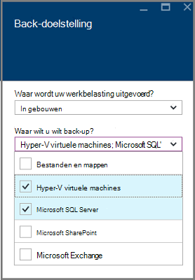
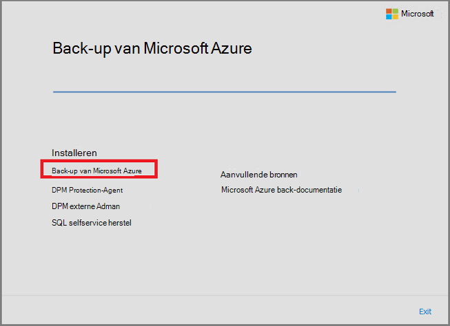
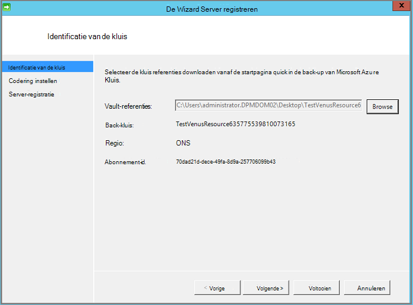

<properties
  pageTitle="Voorbereiden van uw back-up van werkbelasting met Azure Backup Server-omgeving | Microsoft Azure"
  description="Bereid uw omgeving met Azure back-up Server kunt beveiligen of de back-up van werkbelasting."
  services="backup"
  documentationCenter=""
  authors="PVRK"
  manager="shivamg"
  editor=""
  keywords="back-upserver Azure; bescherming van de werklast; back-up van werkbelasting"/>

<tags
  ms.service="backup"
  ms.workload="storage-backup-recovery"
  ms.tgt_pltfrm="na"
  ms.devlang="na"
  ms.topic="article"
  ms.date="09/27/2016"
  ms.author="jimpark;trinadhk;pullabhk;markgal"/>

# <a name="preparing-to-back-up-workloads-using-azure-backup-server"></a>Back-up van werkbelasting met Azure back-up Server wordt voorbereid

> [AZURE.SELECTOR]
- [Azure back-upserver](backup-azure-microsoft-azure-backup.md)
- [SCDPM](backup-azure-dpm-introduction.md)
- [Azure reserveserver (klassiek)](backup-azure-microsoft-azure-backup-classic.md)
- [SCDPM (klassiek)](backup-azure-dpm-introduction-classic.md)

In dit artikel wordt uitgelegd hoe u uw back-up van werkbelasting met Azure Backup Server-omgeving voorbereiden. Met Azure back-up Server, kunt u de werkbelasting van toepassingen zoals VMs Hyper-V, Microsoft SQL Server, SharePoint Server, Microsoft Exchange en Windows-clients beveiligen vanaf één console. U kunt ook gegevens als de werklast van een server (IaaS) zoals VMs in Azure beveiligen.

> [AZURE.NOTE] Azure heeft twee implementatiemodellen voor het maken en werken met resources: [Resource Manager en klassiek](../resource-manager-deployment-model.md). Dit artikel bevat informatie en procedures voor het terugzetten van VMs met behulp van het model van de bronnenbeheerder geïmplementeerd.

Back-upserver Azure neemt veel van de back-upfunctie werkbelasting Data Protection Manager (DPM). Dit artikel bevat koppelingen naar documentatie DPM om uit te leggen sommige gedeelde functies. Hoewel Azure Backup Server deelt veel van dezelfde functionaliteit als de DPM. Azure back-up Server niet een back-up op tape, noch werkt het de integratie met System Center.

## <a name="1-choose-an-installation-platform"></a>1. Kies een installatieplatform

De eerste stap in de richting van de reserveserver Azure slag is voor het instellen van een Windows-Server. De server kan worden in Azure of op locatie.

### <a name="using-a-server-in-azure"></a>Met behulp van een server in Azure

Bij het kiezen van een server voor het uitvoeren van Azure back-up, moet dat u beginnen met een afbeelding van Windows Server 2012 R2 Datacenter. Het artikel, [de eerste virtuele Windows-computer in de Azure portal maken](..\virtual-machines\virtual-machines-windows-hero-tutorial.md), bevat een zelfstudie voor aan de slag met de aanbevolen virtuele machine in Azure, zelfs als u nooit Azure voordat hebt gebruikt. De aanbevolen minimale vereisten voor de server virtuele machine (VM) moeten worden: standaard A2 2 cores en 3,5 GB RAM.

Werkbelasting met Azure back-up Server beveiligen heeft vele nuances bevatten. Artikel [DPM als een Azure virtuele machine installeren](https://technet.microsoft.com/library/jj852163.aspx), kunt u uitleggen deze nuances bevatten. Lees dit artikel volledig alvorens de machine te implementeren.

### <a name="using-an-on-premises-server"></a>Met behulp van een server op locatie

Als u niet uitvoeren van de basis-server in Azure wilt, kunt u de server uitvoeren op een Hyper-V VM, een VM VMware of een fysieke host. De aanbevolen minimale vereisten voor de serverhardware zijn 2 cores en 4 GB RAM-geheugen. De ondersteunde besturingssystemen worden vermeld in de volgende tabel.

| Besturingssysteem        | Platform           | SKU  |
| :------------- |-------------| :-----|
|Windows Server 2012 R2 en de meest recente SPs| 64-bits| Standaard, Datacenter, Foundation|
|Windows Server 2012 en de meest recente SPs|    64-bits| Datacenter, Foundation, standaard|
|Windows Storage Server 2012 R2 en de meest recente SPs  |64-bits|    Standaard, werkgroep|
|Windows Storage Server 2012 en de meest recente SPs |64-bits |Standaard, werkgroep|


U kunt de DPM-opslag met behulp van Windows Server Deduplication deduplicate. Meer informatie over hoe [DPM en deduplication](https://technet.microsoft.com/library/dn891438.aspx) samen wanneer in Hyper-V VMs geïmplementeerd.

> [AZURE.NOTE]  U kunt Azure Backup Server niet installeren op een computer als een domeincontroller.

U moet de Azure Backup Server toevoegen aan een domein. Als u van plan bent de server verplaatsen naar een ander domein, is het raadzaam om de server te koppelen aan het nieuwe domein voordat u Azure back-up Server installeert. Een bestaande Azure back-up Server-computer verplaatst naar een nieuw domein nadat de implementatie is *niet ondersteund*.

## <a name="2-recovery-services-vault"></a>2. de recovery Services kluis

Of u een back-up gegevens naar Azure verzenden of lokaal houden, moet de software verbinding met Azure. Meer specifiek, de servermachine Azure back-up moet worden geregistreerd met een kluis recovery services.

Voor het maken van een kluis recovery services:

1. Log in om de [Azure portal](https://portal.azure.com/).

2. Klik op **Bladeren** en typ in de lijst met resources **Recovery Services**in het menu Hub. Als u te typen begint, de lijst wordt gefilterd op basis van uw invoer. Klik op **de kluis Recovery Services**.

     <br/>

    De lijst van kluizen Recovery Services wordt weergegeven.

3. Klik in het menu **kluizen Recovery Services** op **toevoegen**.

    

    De kluis Recovery Services blade wordt geopend, waarin u een **naam**, **abonnement**, **resourcegroep**en **locatie**.

    

4. Voer voor de **naam**een beschrijvende naam ter identificatie van de kluis. De naam moet uniek zijn voor het abonnement Azure. Typ een naam die tussen 2 en 50 tekens bevat. Het moet beginnen met een letter en mag alleen letters, cijfers en streepjes.

5. Klik op **abonnement** overzicht de beschikbare abonnementen. Als u niet zeker weet welke abonnement wilt gebruiken, gebruikt u de standaardinstelling (of voorgesteld) abonnement. Zullen er meerdere opties als uw organisatie-account gekoppeld aan meerdere Azure abonnementen is.

6. Klik op **resourcegroep** overzicht de beschikbare brongroepen of klik op **Nieuw** om een nieuwe resourcegroep te maken. Zie voor volledige informatie over resourcegroepen, [Azure Resource Manager-overzicht](../azure-resource-manager/resource-group-overview.md)

7. Klik op **locatie** selecteren van de geografische regio van de kluis.

8. Klik op **maken**. Het kan even duren voor de kluis Recovery Services moet worden gemaakt. Controleren van de van statusmeldingen in het bovenste rechter gebied in de portal.
Zodra uw kluis is gemaakt, wordt het geopend in de portal.

### <a name="set-storage-replication"></a>Opslag, replicatie instellen

De opslagoptie voor replicatie kunt u kiezen tussen geo-redundante opslag en lokaal redundante opslag. Standaard heeft de kluis geo-redundante opslag. Laat de optie ingesteld op geo-redundante opslag als dit uw primaire back-up. Kies lokaal redundante opslag als u wilt een goedkopere optie die niet helemaal zo duurzaam. Meer informatie over [geo-redundante](../storage/storage-redundancy.md#geo-redundant-storage) [lokaal redundante](../storage/storage-redundancy.md#locally-redundant-storage) opslagopties en in de [opslag van Azure replicatie-overzicht](../storage/storage-redundancy.md).

De instelling opslag replicatie bewerken:

1. Selecteer de kluis te openen de kluis dashboard en de instellingen voor blade. Als het blad **Instellingen** niet wordt geopend, klikt u op **alle instellingen** in het dashboard van de kluis.

2. Klik op het blad **Instellingen** **Back-up infrastructuur** > **Back-up configureren** voor het openen van de **Back-up configuratie** blade. Kies de optie van de replicatie opslag voor uw kluis op de **Back-up van configuratie** -blade.

    

    Nadat u de opslagoptie voor uw kluis, bent u gereed om de VM koppelen aan de kluis. Om te beginnen met de koppeling, ontdekken en u registreren de Azure virtuele machines.

## <a name="3-software-package"></a>3. het softwarepakket

### <a name="downloading-the-software-package"></a>Het softwarepakket downloaden
1. Log in om de [Azure portal](https://portal.azure.com/).

2. Als u al een kluis Recovery Services geopend, gaat u verder met stap 3. Als u beschikt niet over een Recovery Services kluis openen, maar in de Azure portal de Hub op het menu **Bladeren**.

    - Typ in de lijst met resources **Recovery Services**.
    - Als u te typen begint, de lijst wordt gefilterd op basis van uw invoer. Wanneer u **de kluizen Recovery Services**ziet, klikt u erop.

    

    De lijst van kluizen Recovery Services weergegeven.

    - Selecteer in de lijst van kluizen Recovery Services, een kluis.

    Hiermee opent u het geselecteerde kluis dashboard.

    

3. Blade instellingen wordt standaard geopend. Als deze gesloten is, klik op **Instellingen** voor het openen van de bladeserver instellingen.

    

4. Klik op **back-up** in **Aan de slag** te openen van de wizard aan de slag.

    

5. De handleiding Introductie is dat nu wordt geopend, doelstellingen voor back-up scherm worden automatisch geselecteerd.
    

    Selecteer in de sectie **back-up doelstellingen** *in ruimten* voor *waar uw werkbelasting actief is*.

    

6. Selecteer de werklast die u wilt beveiligen met Azure back-up Server in *welke werklast die u wilt beveiligen* en klik op **OK**.

    > [AZURE.NOTE] Als u van plan bent om alleen bestanden en mappen te beveiligen, vervolgens het beste gebruiken Azure Backup agent. Als u van plan bent om de werkbelasting van meer dan alleen bestanden en mappen beveiligen in toekomstige als u van plan bent de behoeften van de bescherming uitbreiden selecteren of alle van de werkbelasting.

    Hiermee wijzigt u de wizard aan de slag als voorbereiding van infrastructuur voor de bescherming van de werklast op ruimten naar Azure.

    

7. In de blade **-infrastructuur voorbereiden** dat nu wordt geopend, klikt u op de koppelingen voor het **downloaden** voor Azure Backup Server installeert en Download kluis referenties. U gebruikt de referenties van de kluis tijdens de registratie van Azure back-up Server om de recovery services. De koppelingen gaat u naar het Download Center waar het softwarepakket kan worden gedownload.

    

8. Selecteer alle bestanden en klik op **volgende**. Download alle bestanden die binnenkomen vanaf de downloadpagina van Microsoft Azure back-up en alle bestanden in dezelfde map plaatsen.

    

    Aangezien de downloadgrootte van alle bestanden bij elkaar > 3G, op een 10 Mbps downloadkoppeling duurt maximaal 60 minuten voor de downloadbewerking is voltooid.


### <a name="extracting-the-software-package"></a>Uitpakken van het softwarepakket met

Nadat u alle bestanden hebt gedownload, klikt u op **MicrosoftAzureBackupInstaller.exe**. Hiermee start u de **Wizard Setup van Microsoft Azure back-up** om uit te pakken van de setup-bestanden naar een door u opgegeven locatie. Ga verder met de wizard en klik op de knop **ophalen** om te beginnen met het uitpakken gestart.

> [AZURE.WARNING] Minimaal 4GB vrije schijfruimte is vereist voor de setup-bestanden uitpakken.


Als de extractie proces voltooid, schakel het selectievakje in om te starten om te beginnen met de installatie van Microsoft Azure back-up Server en klik op de knop **Voltooien** de vers uitgepakte *setup.exe* .

### <a name="installing-the-software-package"></a>Het softwarepakket installeren

1. Klik op **Microsoft Azure back-up** om de setup wizard te starten.

    

2. Klik op de knop **volgende** op het Welkom-scherm. Hiermee gaat u naar de sectie *Vereiste controles* . Klik op de knop **controleren** om te bepalen als de vereisten voor hardware en software voor Azure Backup Server is voldaan op dit scherm. Als alle vereisten is voldaan is, wordt er een bericht dat aangeeft dat de computer voldoet aan de vereisten. Klik op de knop **volgende** .

    

3. Microsoft Azure back-up Server vereist SQL Server Standard en het installatiepakket Azure Backup Server wordt meegeleverd met de juiste SQL Server binaire bestanden die nodig zijn. Bij het starten van een nieuwe installatie van Azure back-up Server, moet u kiest u de optie **Nieuwe exemplaar van SQL Server installeren met deze instellingen** en klik op de knop **Zoeken en installeren** . Zodra de vereisten zijn geïnstalleerd, klikt u op **volgende**.

    

    Als een fout met de aanbeveling optreedt om de computer opnieuw hebt opgestart, doet en klik op **Opnieuw controleren**.

    > [AZURE.NOTE] Azure Backup Server werkt niet met een externe SQL Server-exemplaar. Het exemplaar dat wordt gebruikt door Azure back-up Server moet lokaal zijn.

4. Een locatie voor de installatie van Microsoft Azure Backup server-bestanden en klik op **volgende**.

    

    De tijdelijke locatie is een vereiste voor back-ups Azure maken. Controleer dat de tijdelijke locatie is ten minste 5% van de gegevens die zijn gepland om te worden een back-up naar de cloud. Voor de bescherming van de schijf moeten aparte schijven worden geconfigureerd nadat de installatie is voltooid. Zie voor meer informatie over opslagpools [opslagpools configureren en opslagruimte op een schijf](https://technet.microsoft.com/library/hh758075.aspx).

5. Voor beperkte lokale gebruikersaccounts een sterk wachtwoord en klik op **volgende**.

    

6. Selecteer of u *Microsoft Update* gebruikt om te controleren op updates en klik op **volgende**.

    >[AZURE.NOTE] Het aan te raden Windows Update omleiden naar Microsoft Update, beveiliging en belangrijke updates voor Windows en andere producten zoals Microsoft Azure back-up Server biedt.

    

7. Bekijk de *Samenvatting van instellingen* en klik op **installeren**.

    

8. De installatie gebeurt in fasen. In de eerste fase is de Microsoft Azure herstelagent Services op de server geïnstalleerd. De wizard controleert ook of er verbinding met het Internet. Als Internet-verbinding beschikbaar is kunt u doorgaan met de installatie, zo niet, moet u details van de proxy verbinding maakt met het Internet.

    De volgende stap is het configureren van Microsoft Azure Services herstelagent. U moet uw kluis referenties invoeren om de computer om de herstelconsole services registreren als onderdeel van de configuratie. U krijgt ook een wachtwoordzin te coderen/decoderen van gegevens die worden verzonden tussen Azure en uw locatie. Als u automatisch een wachtwoordzin genereren of uw eigen wachtwoordzin met minimaal 16 tekens bevatten. Doorgaan met de wizard totdat u de agent is geconfigureerd.

    

9. Zodra de registratie van de Microsoft Azure back-up server met succes is uitgevoerd, verloopt de algemene setup wizard de installatie en configuratie van SQL Server en de serveronderdelen Azure back-up. Nadat de installatie van SQL Server-onderdelen is voltooid, wordt de Azure back-up-serveronderdelen zijn geïnstalleerd.

    


Wanneer de installatiestap is voltooid, wordt pictogrammen op het bureaublad van het product gemaakt ook. Dubbelklik op het pictogram om het product te starten.

### <a name="add-backup-storage"></a>Back-up opslag toevoegen

De eerste back-up wordt bewaard op de opslag is aangesloten op de machine Azure back-upserver. Zie voor meer informatie over het toevoegen van schijven [configureren opslagpools en opslagruimte op een schijf](https://technet.microsoft.com/library/hh758075.aspx).

> [AZURE.NOTE] U moet een back-up opslag toevoegen, zelfs als u van plan bent om gegevens te verzenden naar Azure. De kluis Azure back-up bevat de *tweede* kopie van de gegevens in de huidige architectuur van de back-upserver Azure, terwijl de lokale opslag de eerste (en verplicht) back-up bevat.

## <a name="4-network-connectivity"></a>4. verbinding met het netwerk

Azure back-up Server moet verbinding met de service Azure back-up voor het product om probleemloos te werken. Gebruiken om te controleren of de computer de verbinding met Azure heeft, het ```Get-DPMCloudConnection``` cmdlet in de console Azure back-up Server PowerShell. Als de uitvoer van de cmdlet ingesteld op TRUE is en vervolgens de verbinding bestaat, anders er geen verbinding is.

Op hetzelfde moment moet het Azure abonnement in orde zijn. De status van uw abonnement en als u wilt beheren, log in op de [portal abonnement]( https://account.windowsazure.com/Subscriptions).

Zodra u weet dat de status van de verbinding Azure en de Azure abonnement, kunt u in de onderstaande tabel voor informatie over de gevolgen voor de functionaliteit maken en terugzetten.

| Connectiviteit staat | Azure-abonnement | Back-up naar Azure| Back-ups naar schijf | Terugzetten vanuit Azure | Herstellen van de schijf |
| -------- | ------- | --------------------- | ------------------- | --------------------------- | ----------------------- |
| Verbonden | Actieve | Toegestaan | Toegestaan | Toegestaan | Toegestaan |
| Verbonden | Verlopen | Gestopt | Gestopt | Toegestaan | Toegestaan |
| Verbonden | Deprovisioned | Gestopt | Gestopt | Herstel gestopt en Azure punten verwijderd | Gestopt |
| Verbroken verbindingen > 15 dagen | Actieve | Gestopt | Gestopt | Toegestaan | Toegestaan |
| Verbroken verbindingen > 15 dagen | Verlopen | Gestopt | Gestopt | Toegestaan | Toegestaan |
| Verbroken verbindingen > 15 dagen | Deprovisioned | Gestopt | Gestopt |  Herstel gestopt en Azure punten verwijderd | Gestopt |

### <a name="recovering-from-loss-of-connectivity"></a>Het systeem herstellen na verlies van connectiviteit
Als u een firewall of een proxy die toegang tot Azure is voorkomen, moet u "witte" lijst de volgende domein adressen in het profiel van de firewall-proxy:

- www.msftncsi.com
- \*. Microsoft.com
- \*. WindowsAzure.com
- \*. microsoftonline.com
- \*. windows.net

Zodra er verbinding met Azure is teruggezet naar de Azure back-up Server, worden de bewerkingen die worden uitgevoerd door de Azure abonnement staat bepaald. De bovenstaande tabel bevat details over de bewerkingen toegestaan nadat de machine 'verbonden'.

### <a name="handling-subscription-states"></a>Verwerking van provincies abonnement

Het is mogelijk een Azure-abonnement nemen vanuit een *vervallen* of *Deprovisioned* staat voor de *actieve* status. Echter dit heeft enkele gevolgen van de werking van het product als de status niet *actief*is:

- Functionaliteit verloren gaat voor de periode waarin het is deprovisioned voor een *Deprovisioned* -abonnement. Over het *actief*, de functionaliteit van back-up en terugzetten van het product opnieuw actief. De back-upgegevens op de lokale schijf kan ook worden opgehaald als deze met een voldoende lange bewaartermijn is gehouden. De back-upgegevens in Azure is onherstelbaar verloren wanneer de *Deprovisioned* staat het abonnement heeft ingevoerd.
- Functionaliteit voor verliest een *verlopen* abonnement alleen totdat deze is gedaan *actieve* opnieuw. Alle back-ups die is gepland voor de periode dat het abonnement *verlopen is* , wordt niet uitgevoerd.


## <a name="troubleshooting"></a>Het oplossen van problemen

Als Microsoft Azure back-up mislukt met fouten tijdens de installatiefase (of back-up of terugzetten), verwijzen naar deze [fout codes document](https://support.microsoft.com/kb/3041338) voor meer informatie.
U kunt ook verwijzen naar de [dat back-up Azure gerelateerde Veelgestelde vragen](backup-azure-backup-faq.md)


## <a name="next-steps"></a>Volgende stappen

U kunt gedetailleerde informatie over het [voorbereiden van uw omgeving voor DPM](https://technet.microsoft.com/library/hh758176.aspx) op de Microsoft TechNet-website. Het bevat ook informatie over de ondersteunde configuraties waarop Azure Backup Server kan worden geïmplementeerd en gebruikt.

Deze artikelen kunt u een beter begrip van de werkbelasting bescherming met Microsoft Azure Backup server krijgen.

- [Back-up van SQL Server](backup-azure-backup-sql.md)
- [Back-up van SharePoint server](backup-azure-backup-sharepoint.md)
- [Alternatieve server back-up](backup-azure-alternate-dpm-server.md)
