<properties
   pageTitle="Back-ups van virtuele machine monitor bronnenbeheerder geïmplementeerd | Microsoft Azure"
   description="Controleren van gebeurtenissen en waarschuwingen afkomstig van back-ups van virtuele machine bronnenbeheerder geïmplementeerd. Per e-mail op basis van meldingen."
   services="backup"
   documentationCenter="dev-center-name"
   authors="markgalioto"
   manager="cfreeman"
   editor=""/>

<tags
ms.service="backup"
ms.workload="storage-backup-recovery"
ms.tgt_pltfrm="na"
ms.devlang="na"
ms.topic="article"
ms.date="08/25/2016"
ms.author="trinadhk; giridham;"/>

# <a name="monitor-alerts-for-azure-virtual-machine-backups"></a>Waarschuwingen voor back-ups van Azure virtual machine monitor

Waarschuwingen zijn antwoorden van de service een gebeurtenis drempel bereikt of overtroffen. Weten wanneer start problemen kan zijn essentieel voor het houden van zakelijke kosten omlaag. Waarschuwingen meestal niet plaats op een schema en het is dus handig om te weten zo spoedig mogelijk na het optreden van waarschuwingen. Bijvoorbeeld wanneer een back-up of terugzetten taak mislukt, een waarschuwing optreedt binnen vijf minuten van de storing. De tegel back-up waarschuwingen weergegeven in het dashboard kluis kritiek en het waarschuwingsniveau gebeurtenissen. U kunt alle gebeurtenissen bekijken in de waarschuwingsinstellingen van back-up. Maar wat doet u als er een waarschuwing wanneer u op een afzonderlijk probleem werkt optreedt? Als u niet weet wanneer de waarschuwing gebeurt, is het mogelijk een kleine ongemak of deze gegevens kan binnendringen. Om er zeker van de juiste mensen zich bewust zijn van een waarschuwing - wanneer deze optreedt, de service configureren voor het verzenden van meldingen via e-mail. Zie voor meer informatie over het instellen van e-mailmeldingen [configureren meldingen](backup-azure-monitor-vms.md#configure-notifications).

## <a name="how-do-i-find-information-about-the-alerts"></a>Hoe vind ik informatie over de waarschuwingen

Als u informatie over de gebeurtenis die een waarschuwing heeft veroorzaakt, moet u de back-up waarschuwingen blade openen. Er zijn twee manieren voor het openen van de back-up waarschuwingen blade: vanuit de back-up waarschuwingen naast elkaar in het dashboard kluis of van het blad gebeurtenissen en waarschuwingen.

De back-up waarschuwingen blade uit de back-up waarschuwingen naast elkaar openen:

- Klik op de tegel **Back-up van waarschuwingen** op het dashboard kluis **kritieke** en **waarschuwingsberichten** als de operationele gebeurtenissen voor dat prioriteitsniveau wilt weergeven.

    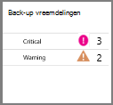


De back-up waarschuwingen blade openen vanaf de blade waarschuwingen en gebeurtenissen:

1. Klik op **Alle instellingen**van het dashboard kluis. 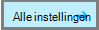

2. Klik op de **Instellingen voor** blade, **waarschuwingen en gebeurtenissen**. 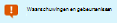

3. Klik op **Back-up van waarschuwingen**op het blad **gebeurtenissen en waarschuwingen** . 

    De **Back-up waarschuwingen** blade wordt geopend en de gefilterde waarschuwingen worden weergegeven.

    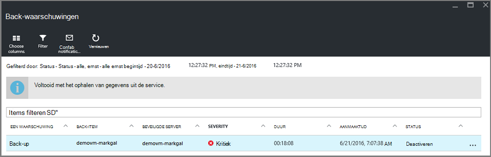

4. Gedetailleerde informatie over een specifieke waarschuwing, uit de lijst met gebeurtenissen, klikt u op de melding om te openen de blade **Details** .

    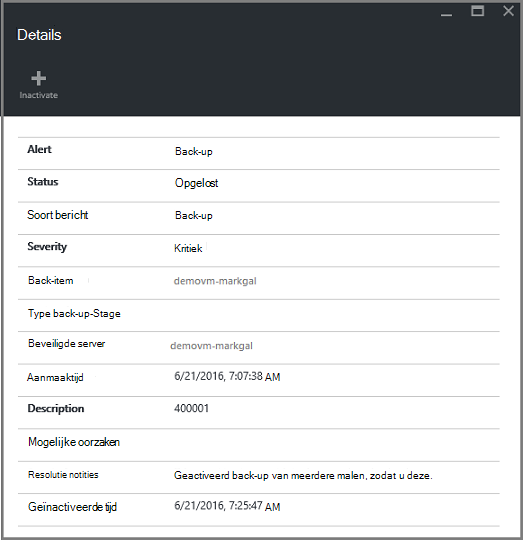

    Als u wilt aanpassen welke kenmerken weergegeven in de lijst, Zie [weergavekenmerken extra gebeurtenis](backup-azure-monitor-vms.md#view-additional-event-attributes)

## <a name="configure-notifications"></a>Meldingen configureren

 U kunt de service voor het verzenden van e-mailberichten voor de waarschuwingen die hebben plaatsgevonden gedurende het afgelopen uur of wanneer bepaalde typen gebeurtenissen plaatsvinden.

E-mailmeldingen voor berichten instellen

1. Klik in het menu waarschuwingen voor back-up **meldingen configureren**

    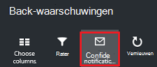

    Het blad van de meldingen configureren wordt geopend.

    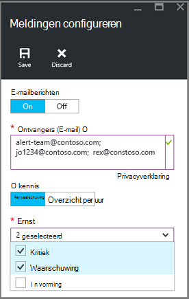

2. Klik op het blad configureren meldingen, voor e-mailberichten, **op**.

    De geadresseerden en de ernst dialoogvensters hebben een ster ernaast omdat deze informatie vereist is. Ten minste één e-mailadres en selecteer ten minste één prioriteit.

3. Typ de e-mailadressen voor wie de meldingen ontvangen in het dialoogvenster **geadresseerden (E-mail)** . Gebruik de notatie: username@domainname.com. Meerdere e-mailadressen te scheiden met een puntkomma (;).

4. Kies in het gebied **Waarschuwen** **Per signaal** om melding te verzenden wanneer de opgegeven waarschuwing optreedt of **Digest per uur** voor het verzenden van een overzicht van het afgelopen uur.

5. Kies een of meer niveaus die u als trigger wilt e-mailmeldingen in het dialoogvenster **ernst** .

6. Klik op **Opslaan**.
### <a name="what-alert-types-are-available-for-azure-iaas-vm-backup"></a>Welke typen waarschuwingen zijn beschikbaar voor Azure IaaS VM back-up?
| Waarschuwingsniveau  | Waarschuwingen verzonden |
| ------------- | ------------- |
| Kritiek | Back-fout, herstel  |
| Waarschuwing  | Geen |
| Informatieve  | Geen  |

### <a name="are-there-situations-where-email-isnt-sent-even-if-notifications-are-configured"></a>Zijn er situaties waar e-mail is niet verzonden, zelfs als meldingen zijn geconfigureerd?

Er zijn situaties waarbij een waarschuwing niet verzonden wordt, zelfs als de meldingen correct is geconfigureerd. In de volgende situaties e-mail worden meldingen niet verzonden om te voorkomen dat de waarschuwing lawaai:

- Als meldingen zijn geconfigureerd voor Verificatiesamenvatting per uur, een waarschuwing wordt ingediend en binnen het uur is opgelost.
- De taak wordt geannuleerd.
- Een back-uptaak wordt geactiveerd en mislukt en een andere back-up wordt uitgevoerd.
- Een geplande back-uptaak voor een Resource Manager ingeschakeld VM wordt gestart, maar de VM bestaat niet meer.

## <a name="customize-your-view-of-events"></a>De weergave van gebeurtenissen aanpassen

De instelling van de **controlelogboeken** wordt geleverd met een set vooraf gedefinieerde filters en kolommen met gegevens over de operationele gebeurtenis. U kunt de weergave aanpassen, zodat wanneer het blad **gebeurtenissen** wordt geopend, wordt u de gewenste informatie.

1. In het [dashboard van de kluis](./backup-azure-manage-vms.md#open-a-recovery-services-vault-in-the-dashboard), blader naar en **Controlelogboeken** om te openen het blad **gebeurtenissen** op.

    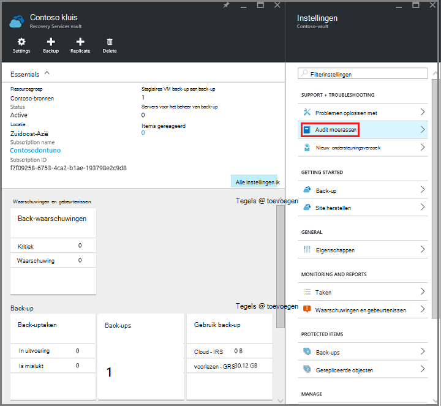

    Het blad **gebeurtenissen** wordt geopend met de operationele gebeurtenissen voor de huidige kluis gefilterd.

    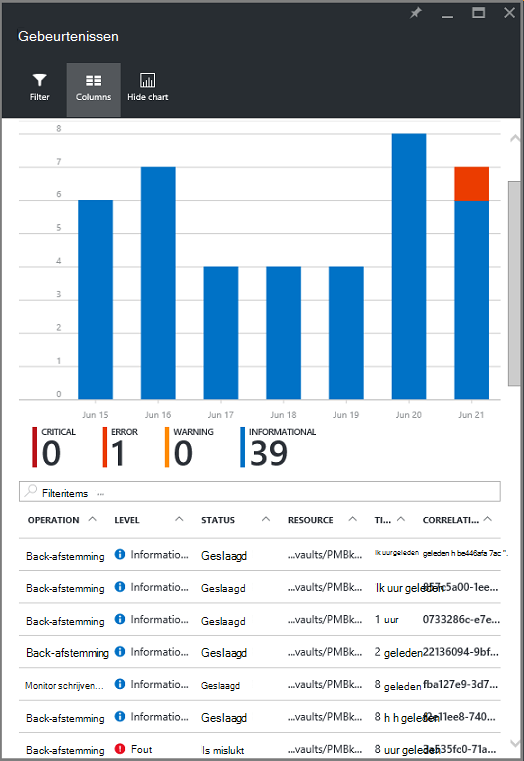

    Het blad toont de lijst van kritieke, fout, waarschuwing en informatieve gebeurtenissen die hebben plaatsgevonden in de afgelopen week. De tijdspanne is een standaardwaarde ingesteld in het **Filter**. Het blad **gebeurtenissen** bevat ook een staafdiagram bijhouden wanneer de gebeurtenissen hebben plaatsgevonden. Als u niet wilt dat het staafdiagram bekijken in het menu **gebeurtenissen** klikt u op **grafiek verbergen** in-of uitschakelen van de grafiek. De standaardweergave van gebeurtenissen bevat informatie voor bewerking, niveau, Status, bron en tijd. Voor informatie over extra gebeurtenis kenmerken bloot, Zie de sectie [informatie over de gebeurtenis uit te breiden](backup-azure-monitor-vms.md#view-additional-event-attributes).

2. Klik voor meer informatie over een operationele gebeurtenis, in de kolom **bewerking** op een operationele gebeurtenis openen de blade. Het blad bevat gedetailleerde informatie over de gebeurtenissen. Gebeurtenissen worden gegroepeerd op hun correlatie-ID en een lijst van de gebeurtenissen die hebben plaatsgevonden in de tijdspanne.

    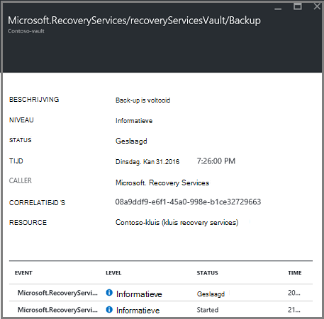

3. Gedetailleerde informatie over een bepaalde gebeurtenis uit de lijst met gebeurtenissen, klikt u op de gebeurtenis openen de blade **Details** .

    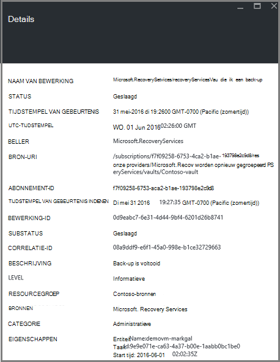

    De informatie voor de gebeurtenis is gedetailleerd de gegevens haalt. Als u de voorkeur geeft aan dat veel informatie over elke gebeurtenis zien en willen graag dat veel details toevoegen aan het blad **gebeurtenissen** , Zie de sectie [informatie over de gebeurtenis uit te breiden](backup-azure-monitor-vms.md#view-additional-event-attributes).


## <a name="customize-the-event-filter"></a>De gebeurtenis filter aanpassen
Gebruik het **Filter** aanpassen of de informatie die wordt weergegeven in een bepaalde blade kiezen. De om gebeurtenisgegevens te filteren:

1. In het [dashboard van de kluis](./backup-azure-manage-vms.md#open-a-recovery-services-vault-in-the-dashboard), blader naar en **Controlelogboeken** om te openen het blad **gebeurtenissen** op.

    

    Het blad **gebeurtenissen** wordt geopend met de operationele gebeurtenissen voor de huidige kluis gefilterd.

    

2. Klik op **Filter** als u wilt dat blade openen in het menu **gebeurtenissen** .

    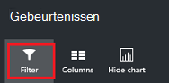

3. Op het blad **Filter** aanpassen de filters **niveau** **tijd span**en **beller** . De andere filters zijn niet beschikbaar omdat deze zijn ingesteld op de huidige informatie voor de kluis Recovery Services bieden.

    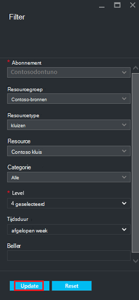

    Kunt u het **niveau** van de gebeurtenis: kritische fout, waarschuwing of informatie. U kunt een willekeurige combinatie van gebeurtenisniveaus, maar hebt u ten minste één niveau geselecteerd. Schakelen tussen het niveau van de in- of uitschakelen. De **tijd span** filter kunt u opgeven hoe lang voor het vastleggen van gebeurtenissen. Als u een aangepaste periode gebruikt, kunt u de begin- en eindtijden instellen.

4. Zodra u klaar bent om te vragen de activiteiten zich aanmeldt met behulp van het filter, klikt u op **bijwerken**. De resultaten verschijnen in het blad **gebeurtenissen** .

    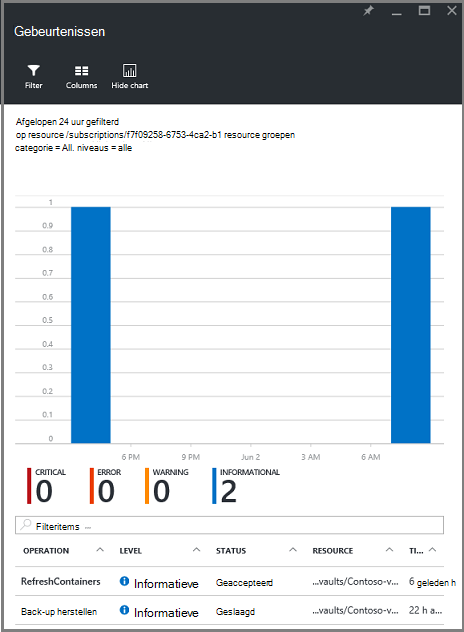


### <a name="view-additional-event-attributes"></a>Extra gebeurtenis weergavekenmerken
De knop **kolommen** kunt u gebeurtenis extra kenmerken worden weergegeven in de lijst op het blad **gebeurtenissen** inschakelen. De standaardlijst met gebeurtenissen weergegeven informatie voor bewerking, niveau, Status, bron en de tijd. Inschakelen van extra kenmerken:

1. Klik op het blad **gebeurtenissen** op **kolommen**.

    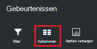

    De blade **kolommen kiezen** wordt geopend.

    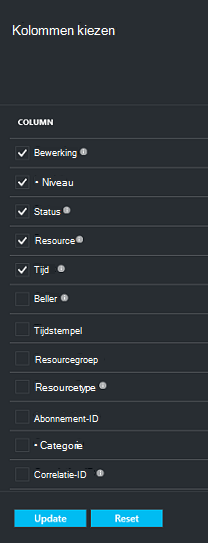

2. Schakel het kenmerk, klikt u op het selectievakje. Het selectievakje kenmerk wordt in- of uitschakelen.

3. Klik op **opnieuw instellen** om de lijst met kenmerken in het blad **gebeurtenissen** opnieuw instellen. Na het toevoegen of verwijderen van kenmerken in de lijst, gebruik **herstellen** om de nieuwe lijst met kenmerken van de gebeurtenis weer te geven.

4. Klik op **bijwerken** om de gegevens in de kenmerken van de gebeurtenis bijgewerkt. De volgende tabel vindt u informatie over alle kenmerken.

| Naam van de kolom      |Beschrijving|
| -----------------|-----------|
| Bewerking|De naam van de bewerking.|
| Niveau|Het niveau van de bewerking, de waarden die kunnen worden: informatie, waarschuwing, fout of kritiek|
|Status|Beschrijvende status van de bewerking|
|Resource|URL van de bron; ook bekend als de resource-ID|
|Tijd|Tijd, gemeten vanaf de huidige tijd, wanneer de gebeurtenis zich heeft voorgedaan|
|Beller|Wie of wat de naam of de gebeurtenis; het systeem of een gebruiker kan worden|
|Tijdstempel|De tijd waarop de gebeurtenis is geactiveerd|
|Resourcegroep|De bijbehorende resourcegroep.|
|Resourcetype|Het type interne bron gebruikt door Resource Manager|
|Abonnement-ID|De bijbehorende abonnement-ID|
|Categorie|Categorie van de gebeurtenis|
|Correlatie-ID|Gemeenschappelijke-ID voor de bijbehorende gebeurtenissen|


## <a name="use-powershell-to-customize-alerts"></a>PowerShell gebruiken voor het aanpassen van meldingen
U kunt aangepaste waarschuwingen voor de taken in de portal. Als u deze taken, waarschuwingsregels PowerShell gebaseerd op de operationele Logboeken gebeurtenissen te definiëren. Gebruik *PowerShell versie 1.3.0 of hoger*.

Kunt u een aangepaste melding om te waarschuwen voor back-up instellen in een opdracht, zoals in het volgende script:

```
PS C:\> $actionEmail = New-AzureRmAlertRuleEmail -CustomEmail contoso@microsoft.com
PS C:\> Add-AzureRmLogAlertRule -Name backupFailedAlert -Location "East US" -ResourceGroup RecoveryServices-DP2RCXUGWS3MLJF4LKPI3A3OMJ2DI4SRJK6HIJH22HFIHZVVELRQ-East-US -OperationName Microsoft.Backup/RecoveryServicesVault/Backup -Status Failed -TargetResourceId /subscriptions/86eeac34-eth9a-4de3-84db-7a27d121967e/resourceGroups/RecoveryServices-DP2RCXUGWS3MLJF4LKPI3A3OMJ2DI4SRJK6HIJH22HFIHZVVELRQ-East-US/providers/microsoft.backupbvtd2/RecoveryServicesVault/trinadhVault -Actions $actionEmail
```

**ResourceId** : kunt u ResourceId krijgen van de controlelogboeken. De ResourceId is een URL die is opgegeven in de kolom bron van de logboeken.

**OperationName** : OperationName is de notatie ' Microsoft.RecoveryServices/recoveryServicesVault/*gebeurtenisnaam*' waarbij de *gebeurtenisnaam* kan zijn:<br/>
- Registreren <br/>
- Registratie ongedaan maken <br/>
- ConfigureProtection <br/>
- Back-up <br/>
- Herstellen <br/>
- StopProtection <br/>
- DeleteBackupData <br/>
- CreateProtectionPolicy <br/>
- DeleteProtectionPolicy <br/>
- UpdateProtectionPolicy <br/>

**Status** : ondersteunde waarden zijn gestart, is voltooid of mislukt.

**ResourceGroup** : dit is de groep waartoe de resource behoort. U kunt de kolom Resource-groep toevoegen aan de gegenereerde logboeken. Resourcegroep is een van de beschikbare informatie over de gebeurtenis.

**Naam** : de naam van de huidige regel.

**CustomEmail** : Hiermee geeft u het aangepaste e-mailadres waarnaar u wilt een waarschuwingsbericht verzenden

**SendToServiceOwners** : deze optie stuurt waarschuwingen naar alle beheerders en CO-beheerders van het abonnement. Deze kan worden gebruikt in de cmdlet **New-AzureRmAlertRuleEmail**

### <a name="limitations-on-alerts"></a>Beperkingen voor waarschuwingen
Waarschuwingen op basis van een gebeurtenis, gelden de volgende beperkingen:

1. Waarschuwingen worden gegenereerd op alle virtuele machines in de kluis Recovery Services. De waarschuwing voor een subset van de virtuele machines in een kluis Recovery Services kan niet worden aangepast.
2. Deze functie is in de voorvertoning. [Meer informatie](../monitoring-and-diagnostics/insights-powershell-samples.md#create-alert-rules)
3. Waarschuwingen worden verzonden uit "alerts-noreply@mail.windowsazure.com". Momenteel kunt u de afzender van het e-mailadres niet wijzigen.


## <a name="next-steps"></a>Volgende stappen

Gebeurtenislogboeken geweldige post mortem inschakelen en controleren van ondersteuning voor de back-upbewerkingen. De volgende bewerkingen worden geregistreerd:

- Registreren
- Registratie ongedaan maken
- Beveiliging configureren
- Back-up (zowel gepland als back-up op verzoek)
- Herstellen
- Beveiliging stoppen
- Back-ups verwijderen
- Beleid toevoegen
- Beleid verwijderen
- Updatebeleid
- Taak annuleren

Zie het artikel, de [gebeurtenissen weergeven en controlelogboeken](../monitoring-and-diagnostics/insights-debugging-with-events.md)voor een uitgebreide uitleg van de gebeurtenissen, bewerkingen en controlelogboeken de Azure services heen.

Bekijk voor meer informatie over het opnieuw maken van een virtuele machine vanaf een herstelpunt [Herstellen Azure VMs](backup-azure-restore-vms.md). Als u informatie over het beveiligen van uw virtuele machines, Zie [wordt eerst gezocht: Back-up van VMs naar een kluis Recovery Services](backup-azure-vms-first-look-arm.md). Meer informatie over de beheertaken voor VM back-ups in het artikel, de [virtuele machine back-ups beheren Azure](backup-azure-manage-vms.md).
