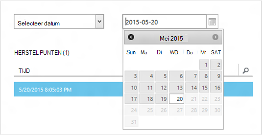
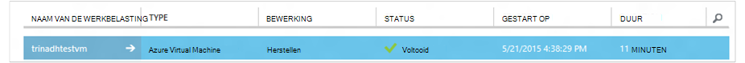

<properties
    pageTitle="Een virtuele machines terugzetten vanaf back-up | Microsoft Azure"
    description="Informatie over het herstellen van een Azure virtual machine vanaf een herstelpunt"
    services="backup"
    documentationCenter=""
    authors="trinadhk"
    manager="shreeshd"
    editor=""
    keywords="back-up terugzetten. hoe om te zetten; herstelpunt;"/>

<tags
    ms.service="backup"
    ms.workload="storage-backup-recovery"
    ms.tgt_pltfrm="na"
    ms.devlang="na"
    ms.topic="article"
    ms.date="08/02/2016"
    ms.author="trinadhk; jimpark;"/>

# Virtuele machines in Azure zetten

> [AZURE.SELECTOR]
- [VMs in Azure portal herstellen](backup-azure-arm-restore-vms.md)
- [VMs in klassieke portal herstellen](backup-azure-restore-vms.md)

Een virtuele machine op een nieuwe VM terugzetten uit de back-ups opgeslagen in een kluis voor Azure back-up met de volgende stappen.

## Herstellen van workflow

### 1. Kies een item terugzetten

1. Ga naar het tabblad **Beveiligde Items** en selecteer de virtuele machine die u wilt terugzetten naar een nieuwe VM.

    

    De kolom **Herstelpunt** in de pagina **Beveiligde Items** ziet u het aantal punten voor een virtuele machine herstellen. De kolom **Nieuw herstel punt** ziet u de tijd van de meest recente back-up van waaruit een virtuele machine kan worden hersteld.

2. Klik op **herstellen** om de wizard **een Item terugzetten** starten.

    

### 2. Kies een herstelpunt

1. In het scherm **Selecteer een herstelpunt** kunt u vanuit het meest recente herstelpunt of vanuit een vorig punt herstellen in de tijd. De standaardoptie is geselecteerd wanneer de wizard wordt geopend, is *Nieuw herstelpunt*.

    

2. Kies een eerder punt in de tijd, kiest u de optie **Selecteren** in de vervolgkeuzelijst en een datum in de kalender selecteren door te klikken op het **pictogram Agenda**. In het besturingselement, alle datums die van herstel punten worden gevuld met een licht grijze schaduw en kunnen worden geselecteerd door de gebruiker.

    

    Nadat u een datum in het kalenderbesturingselement op, wijst het herstel beschikbaar op dat de datum in herstel punten in de volgende tabel worden weergegeven. De kolom **tijd** geeft de tijd waarop de momentopname is gemaakt. De kolom **Type** weergegeven van de [consistentie](https://azure.microsoft.com/documentation/articles/backup-azure-vms/#consistency-of-recovery-points) van het herstelpunt. De kop bevat het nummer van het herstel punten beschikbaar op die dag tussen haakjes.

    

3. Het herstelpunt selecteren uit de tabel **Herstellen punten** en klikt u op de pijl Volgende om naar het volgende scherm te gaan.

### 3. Geef een doellocatie

1. Geef in het scherm **Select restore exemplaar** details van waar u de virtuele machine te herstellen.

  - Geef de naam van de virtuele machine: In een bepaalde cloud-service, de naam van de virtuele machine moet uniek zijn. We ondersteunen geen bestaande VM te schrijven. 
  - Selecteer een cloud service voor de VM: dit is verplicht voor het maken van een VM. U kunt een nieuwe wolk service maken of een bestaande cloud-service te gebruiken.

        Whatever cloud service name is picked should be globally unique. Typically, the cloud service name gets associated with a public-facing URL in the form of [cloudservice].cloudapp.net. Azure will not allow you to create a new cloud service if the name has already been used. If you choose to create select create a new cloud service, it will be given the same name as the virtual machine – in which case the VM name picked should be unique enough to be applied to the associated cloud service.

        We only display cloud services and virtual networks that are not associated with any affinity groups in the restore instance details. [Learn More](../virtual-network/virtual-networks-migrate-to-regional-vnet.md).

2. Selecteer een opslag voor de VM: dit is verplicht voor het maken van de VM. U kunt kiezen uit bestaande opslag rekeningen in hetzelfde gebied, als de back-up Azure kluis. We ondersteunen geen opslag rekeningen die Zone redundante of van Premium opslagtype.

    Als er geen accounts opslag met ondersteunde configuratie, maak dan een account voor opslag van ondersteunde configuratie voordat de bewerking voor terugzetten wordt gestart.

    

3. Selecteer een virtueel netwerk: het virtuele netwerk (VNET) voor de virtuele machine is geselecteerd op het moment van het maken van de VM. Herstellen van de gebruikersinterface ziet u de VNETs binnen dit abonnement die kunnen worden gebruikt. Het is niet verplicht een VNET selecteren voor de teruggezette VM: is het mogelijk om naar de herstelde virtuele machine verbinding via het internet, zelfs als de VNET wordt niet toegepast.

    Als de geselecteerde cloud-service gekoppeld aan een virtueel netwerk is, kunt u het virtuele netwerk niet wijzigen.

    

4. Selecteer een subnet: In het geval de VNET heeft de subnetten, standaard het eerste subnet wordt geselecteerd. Kies het subnet van uw keuze in de vervolgkeuzelijst opties. Ga voor subnet details, uitbreiding van de netwerken in de [portal homepage](https://manage.windowsazure.com/), Ga naar de **Virtuele netwerken** en selecteer het virtuele netwerk configureren voor subnet details dieper.

    

5. Klik op het pictogram **indienen** in de wizard de gegevens indienen en maken een terugzettaak.

## Bijhouden van de bewerking voor terugzetten
Nadat u hebt ingevoerd alle informatie in de wizard terugzetten en deze ingediend probeert Azure back-up te maken van een taak voor het bijhouden van de bewerking voor terugzetten.

Als het maken van de taak voltooid is, ziet u een toast melding die aangeeft dat de taak is gemaakt. U kunt meer informatie opvragen door te klikken op de knop **Taak weergeven** , u naar het tabblad **taken gaat** .

Zodra de bewerking voor terugzetten is voltooid, wordt het gemarkeerd als voltooid in het tabblad **taken** .

Na het terugzetten van de virtuele machine moet u de uitbreidingen op de oorspronkelijke VM en [de eindpunten wijzigen](../virtual-machines/virtual-machines-windows-classic-setup-endpoints.md) voor de virtuele machine in de portal Azure opnieuw te installeren.

## Stappen na herstellen
Als u van een verdeling op basis van cloud-init Linux zoals Ubuntu, om veiligheidsredenen gebruikmaakt, wachtwoord geblokkeerd boeken terugzetten. Gebruik de extensie VMAccess op de teruggezette VM [het wachtwoord](../virtual-machines/virtual-machines-linux-classic-reset-access.md)opnieuw instellen. Beste SSH sleutels op deze verdelingen gebruiken om te voorkomen dat opnieuw instellen van wachtwoord na terugzetten. 

## VMs teruggezette back-up
Als u VM naar dezelfde cloud service met dezelfde naam die oorspronkelijk als back-ups van VM teruggezet hebt, blijven back-up voor het herstellen van de VM boeken. Als u hebt Vm teruggezet naar een andere cloud-service of een andere naam op voor de teruggezette VM wordt opgegeven, wordt deze behandeld als een nieuwe VM en moet u back-up instellen voor herstelde VM.

## Een VM terugzetten tijdens een noodherstel van Azure DataCenter
Azure back-up kunt terugzetten van back-ups van VMs naar het midden van de gekoppelde gegevens in het geval de primaire gegevens center waar VMs disaster ervaringen worden uitgevoerd en u kluis worden geo-redundante back-up hebt geconfigureerd. Tijdens dergelijke scenario's, moet u een account opslag die aanwezig in de gepaarde datacenter is en de rest van het herstelproces blijft hetzelfde. Service berekenen van gepaarde geo Azure back-up gebruikt de teruggezette virtuele machine maken. 

## Domain Controller VMs herstellen
Backup Domain Controller (DC) virtuele machines is een ondersteund scenario met Azure back-up. Echter sommige Wees voorzichtig tijdens het terugzetten. De ervaring van terugzetten verschilt sterk Domain Controller VMs in een configuratie met één DC vs. VMs in een multi-DC-configuratie.

### De DC
VM kan worden hersteld (zoals VM) uit de Azure portal of met PowerShell.

### Meerdere domeincontrollers
Wanneer u werkt in een omgeving met meerdere DC, hebben de domeincontrollers gegevens synchroon houden hun eigen manier. Wanneer een punt dat oudere back-up teruggezet *zonder de juiste voorzorgsmaatregelen is*, kan het USN-herstelprocedure verwoesting in een omgeving met meerdere DC aanrichten. De juiste manier te herstellen die een VM wordt het opstarten in DSRM-modus.

De uitdaging doet zich voor omdat de DSRM-modus is niet aanwezig in Azure. Als u wilt dat een VM herstellen, niet u dus de Azure portal gebruiken. De enige ondersteunde terugzetten mechanisme is op basis van een schijf herstellen met behulp van PowerShell.

>[AZURE.WARNING] Voor een domeincontroller VMs in een omgeving met meerdere DC, gebruik niet de Azure portal voor terugzetten! Alleen op basis van PowerShell terugzetten wordt ondersteund.

Lees meer over het [probleem van USN-hersteloptie](https://technet.microsoft.com/library/dd363553) en de strategieën voorgesteld te verhelpen.

## VMs herstellen met speciale netwerkconfiguraties.
Azure Backup biedt ondersteuning voor back-up voor het van speciale netwerkconfiguraties van virtuele machines te volgen.

- VMs onder taakverdeling (intern en extern)
- VMs met meerdere gereserveerde IP-adressen
- VMs met meerdere NIC 's

Deze configuraties dwingend na de overwegingen bij het herstellen van deze.

>[AZURE.TIP] Gebruik PowerShell gebaseerd terugzetten stroom de speciale configuratie van VMs boeken herstellen opnieuw te maken.

### Terugzetten vanuit de gebruikersinterface:
Bij het terugzetten van UI, **Kies altijd een nieuwe wolk service**. Houd er rekening mee dat sinds de portal duurt slechts verplicht parameters tijdens terugzetten flow, VMs teruggezet met behulp van de gebruikersinterface gaan verloren speciale configuratie van de die ze bezitten. Met andere woorden, terugzetten VMs zijn normale VMs zonder configuratie van taakverdeling of meerdere NIC of meerdere gereserveerde IP.

### Terugzetten vanuit PowerShell:
PowerShell heeft kan alleen de schijven van VM back-up terugzetten en niet de virtuele machine te maken. Dit is handig bij het terugzetten van virtuele machines waarvoor speciale netwerk configuraties mentined hierboven.

Om de virtuele machine na terugzetten schijven volledig opnieuw te maken, als volgt te werk:

1. De schijven herstellen vanaf back-up met behulp van [De back-up PowerShell Azure](../backup-azure-vms-classic-automation.md#restore-an-azure-vm) -kluis

2. De VM-configuratie vereist voor taakverdeling maken / meerdere NIC/meerdere gereserveerde IP met behulp van de PowerShell-cmdlets en het gebruik te maken van VM configuratie nodig.
    - VM maken in de cloud-service met [interne taakverdeling](https://azure.microsoft.com/documentation/articles/load-balancer-internal-getstarted/)
    - VM verbinding maken met [Internet facing taakverdeling] maken (https://azure.microsoft.com/en-us/documentation/articles/load-balancer-internet-getstarted/)
    - VM maken met [meerdere NIC 's](https://azure.microsoft.com/documentation/articles/virtual-networks-multiple-nics/)
    - VM maken met [meerdere gereserveerde IP-adressen](https://azure.microsoft.com/documentation/articles/virtual-networks-reserved-public-ip/)

## Volgende stappen
- [Het oplossen van problemen](backup-azure-vms-troubleshoot.md#restore)
- [Beheren van virtuele machines](backup-azure-manage-vms.md)
