<properties
   pageTitle="Gegevens terugzetten op een Windows-Server of een Windows-Client uit met behulp van het klassieke implementatiemodel Azure | Microsoft Azure"
   description="Informatie over het terugzetten van een Windows-Server of een Windows-Client."
   services="backup"
   documentationCenter=""
   authors="saurabhsensharma"
   manager="shivamg"
   editor=""/>

<tags
   ms.service="backup"
   ms.workload="storage-backup-recovery"
     ms.tgt_pltfrm="na"
     ms.devlang="na"
     ms.topic="article"
     ms.date="08/02/2016"
     ms.author="trinadhk; jimpark; markgal;"/>

# Bestanden terugzetten naar een Windows server- of Windows-clientcomputer met behulp van het implementatiemodel klassiek

> [AZURE.SELECTOR]
- [Klassieke portal](backup-azure-restore-windows-server-classic.md)
- [Azure portal](backup-azure-restore-windows-server.md)

Dit artikel heeft betrekking op de stappen die nodig zijn voor het uitvoeren van bewerkingen voor het herstellen van twee typen:

- Gegevens terugzetten op de machine waarop de back-ups zijn genomen.
- Gegevens terugzetten op een andere machine.

In beide gevallen worden de gegevens opgehaald uit de kluis Azure back-up.

[AZURE.INCLUDE [learn-about-deployment-models](../../includes/learn-about-deployment-models-classic-include.md)]

## Herstellen van gegevens op de machine
Als u per ongeluk een bestand verwijderd en u terugzetten op de machine wilt (waarvan de back-up wordt genomen), kunt de volgende stappen u de gegevens herstellen.

1. Open de module **Microsoft Azure back-up** .
2. Klik op **Gegevens herstellen** als u de werkstroom start.

    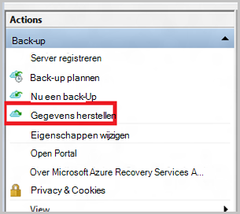

3. Selecteer de * *deze server (*yourmachinename*) ** optie voor het herstellen van de back-up bestand op dezelfde computer.

    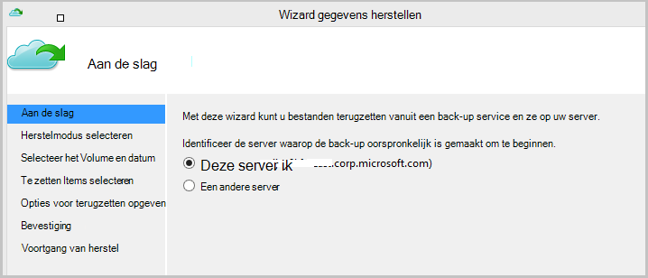

4. Kiezen om te **Zoeken naar bestanden** of **bestanden zoekt**.

    Laat de optie als u van plan bent om te herstellen van een of meer bestanden waarvan het pad is bekend. Als u niet zeker bent van de mappenstructuur wilt zoeken naar een bestand, kiest u de optie **Zoeken naar bestanden** . In deze sectie, zullen we doorgaan met de standaardoptie.

    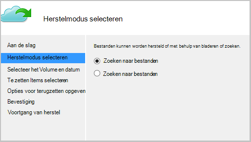

5. Selecteer het volume waarin u wilt het bestand terugzetten.

    U kunt terugzetten vanaf een punt in de tijd. Datums die in **vet** in de kalender worden weergegeven, geven de beschikbaarheid van een herstelpunt. Nadat u een datum hebt geselecteerd, op basis van het back-upschema (en het succes van een back-up) kunt u een punt in de tijd in de vervolgkeuzelijst **tijd** af.

    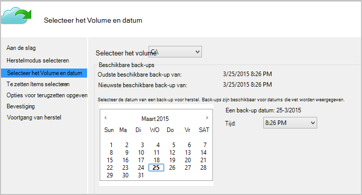

6. Selecteer de items te herstellen. U kunt meerdere mappen en-bestanden die u wilt terugzetten.

    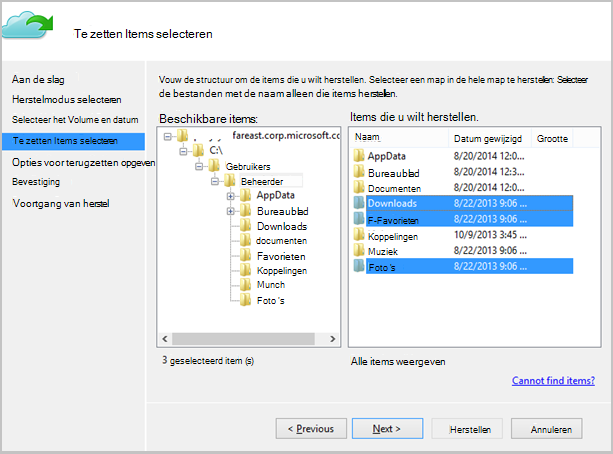

7. Geef de parameters voor herstel.

    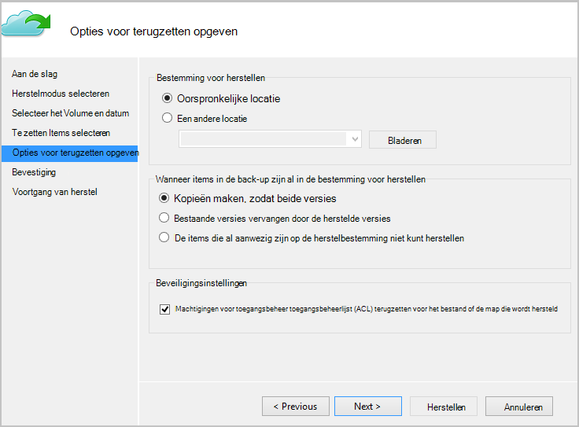

  - U hebt een optie van het terugzetten naar de oorspronkelijke locatie (waarin het bestand of de map zou worden overschreven) of naar een andere locatie in dezelfde computer.
  - Als het bestand of de map die u wilt terugzetten in de doellocatie bestaat, kunt u kopieën (twee versies van hetzelfde bestand) maken, de bestanden op de doellocatie overschreven of overslaan van het herstel van de bestanden die aanwezig zijn in het doeldomein.
  - Het is raadzaam dat u de optie laat van het terugzetten van de ACL's voor bestanden die worden hersteld.

8. Zodra deze ingangen worden opgegeven, klikt u op **volgende**. De werkstroom herstel, die de bestanden op deze computer herstelt, wordt gestart.

## Terugzetten naar een andere computer
Als u de hele server wordt verbroken, kunt u nog steeds gegevens herstellen van Azure back-up naar een andere computer. De volgende stappen illustreren de workflow.  

De terminologie die wordt gebruikt in deze stappen omvat:

- *Bron machine* – de oorspronkelijke computer waarop de reservekopie is gemaakt en die momenteel niet beschikbaar.
- *Target machine* : de machine waarop de gegevens worden hersteld.
- *Monster kluis* – kluis van de back-up van de *broncomputer* en de *doelcomputer* zijn geregistreerd.  

> [AZURE.NOTE] Back-ups van een machine die niet op een computer waarop een eerdere versie van het besturingssysteem terugzetten. Bijvoorbeeld als back-ups van een computer met Windows 7 zijn genomen, kan deze worden hersteld op een Windows 8 of hoger machine. Vice versa wordt echter niet steeds kloppen.

1. Open de module **Microsoft Azure back-up** in op de *doelcomputer*.
2. Zorg ervoor dat de *doelcomputer* en de *broncomputer* zijn geregistreerd op de kluis met dezelfde back-up.
3. Klik op **Gegevens herstellen** als u de werkstroom start.

    

4. Selecteer **een andere server**

    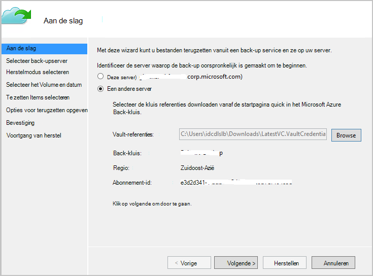

5. Bieden de kluis referentie-bestand dat overeenkomt met het *monster kluis*. Als de kluis referentie-bestand is ongeldig (of verlopen) download een nieuwe kluis referentie-bestand uit het *monster kluis* in de klassieke Azure portal. Zodra de kluis referentie-bestand is opgegeven, wordt de back-kluis tegen de kluis referentie-bestand weergegeven.

6. Selecteer de *bron-computer* uit de lijst met computers weergegeven.

    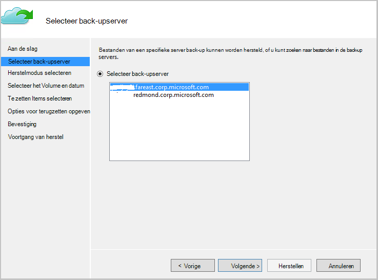

7. Selecteer de optie het **Zoeken naar bestanden** of het **Zoeken naar bestanden** . In deze sectie gebruiken we de optie **Zoeken naar bestanden** .

    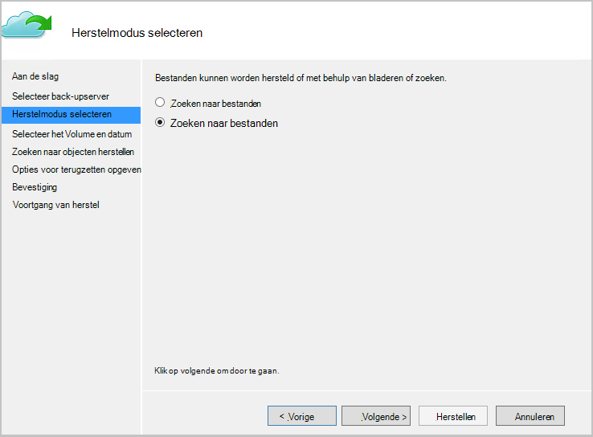

8. Selecteer het volume en de datum in het volgende scherm. Zoeken naar de map/bestandsnaam die u wilt terugzetten.

    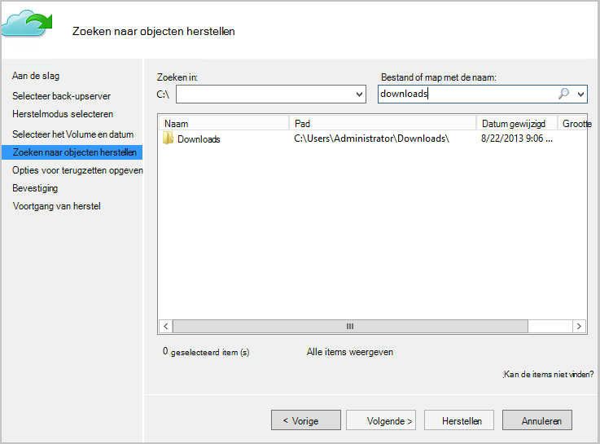

9. Selecteer de locatie waar de bestanden moeten worden teruggezet.

    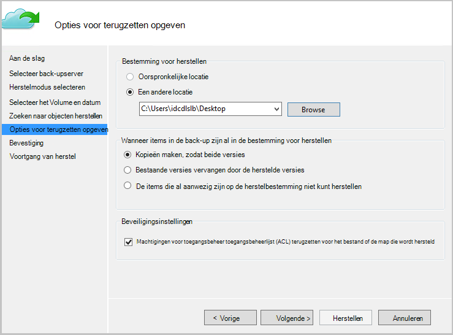

10. De codering wachtwoordzin die is opgegeven tijdens de registratie *van de broncomputer* naar de *kluis monster*bevatten.

    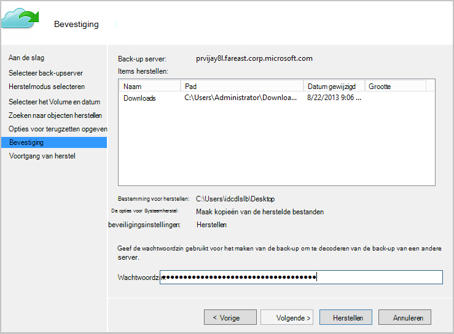

11. Nadat de tekst is ingevoerd, klikt u op **herstellen**, die het terugzetten van de back-ups van bestanden naar de opgegeven bestemming activeert.

## Volgende stappen
- [Azure back-Veelgestelde vragen](backup-azure-backup-faq.md)
- Ga naar de [Azure back-Forum](http://go.microsoft.com/fwlink/p/?LinkId=290933).

## Meer informatie
- [Azure back-overzicht](http://go.microsoft.com/fwlink/p/?LinkId=222425)
- [Back-up Azure virtuele machines](backup-azure-vms-introduction.md)
- [Back-up van Microsoft werkbelasting](backup-azure-dpm-introduction.md)
