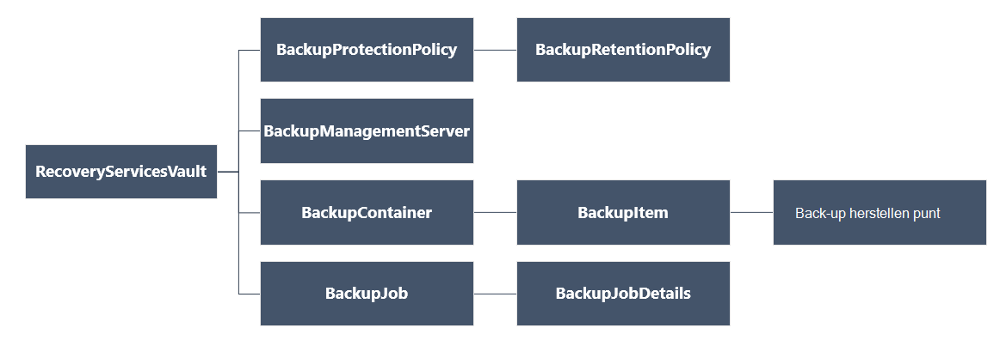

<properties
   pageTitle="Implementeren en beheren van back-ups voor de bronnenbeheerder geïmplementeerd VMs met PowerShell | Microsoft Azure"
   description="Gebruik PowerShell om te implementeren en beheren van back-ups in Azure voor VMs bronnenbeheerder geïmplementeerd"
   services="backup"
   documentationCenter=""
   authors="markgalioto"
   manager="cfreeman"
   editor=""/>

<tags
   ms.service="backup"
   ms.devlang="na"
   ms.topic="article"
   ms.tgt_pltfrm="na"
   ms.workload="storage-backup-recovery"
   ms.date="08/03/2016"
   ms.author="markgal; trinadhk"/>

# <a name="deploy-and-manage-backups-for-resource-manager-deployed-vms-using-powershell"></a>Implementeren en beheren van back-ups voor de bronnenbeheerder geïmplementeerd VMs met PowerShell

> [AZURE.SELECTOR]
- [Resource Manager](backup-azure-vms-automation.md)
- [Klassiek](backup-azure-vms-classic-automation.md)

In dit artikel wordt beschreven hoe u met back-up en herstellen van een Azure virtual machine (VM) van een kluis Recovery Services Azure PowerShell-cmdlets. Een kluis Recovery Services is een bron van Azure Resource Manager en ter bescherming van gegevens en bedrijfsmiddelen in Azure back-up- en herstel van Azure-Site wordt gebruikt. U kunt een kluis Recovery Services beveiligd VMs servicebeheer Azure geïmplementeerd als VMs Azure bronnenbeheerder geïmplementeerd.

>[AZURE.NOTE] Azure heeft twee implementatiemodellen voor het maken en werken met resources: [Resource Manager en klassiek](../resource-manager-deployment-model.md). Dit artikel is bestemd voor VMs gemaakt met behulp van het model Resource Manager.

Dit artikel helpt u bij een VM beschermen en gegevens terugzetten vanaf een herstelpunt met behulp van PowerShell.

## <a name="concepts"></a>Concepten

Als u niet bekend met de Azure back-up service, voor een overzicht van de service bent, kijk dan eens [Wat is Azure back-up?](backup-introduction-to-azure-backup.md) Voordat u begint, ervoor te zorgen dat u wat u nodig hebt over de vereisten die nodig zijn om te werken met Azure back-up en de beperkingen van de huidige back-upoplossing voor VM dekt.

Om efficiënt gebruik van PowerShell is het nodig om te begrijpen van de hiërarchie van objecten en waar te beginnen.



De verwijzing AzureRmRecoveryServicesBackup PowerShell-cmdlet, Zie de [Azure Backup - Cmdlets voor Recovery Services](https://msdn.microsoft.com/library/mt723320.aspx) in de bibliotheek Azure.
De verwijzing AzureRmRecoveryServicesVault PowerShell-cmdlet, Zie de [Azure Recovery Service Cmdlets](https://msdn.microsoft.com/library/mt643905.aspx).


## <a name="setup-and-registration"></a>Installatie en registratie

Om te beginnen:

1. [De meest recente versie van PowerShell downloaden](https://github.com/Azure/azure-powershell/releases) (is de minimaal vereiste versie: 1.4.0)

2. De beschikbare Azure back-up PowerShell-cmdlets vinden door de volgende opdracht te typen:

```
PS C:\> Get-Command *azurermrecoveryservices*

CommandType     Name                                               Version    Source
-----------     ----                                               -------    ------
Cmdlet          Backup-AzureRmRecoveryServicesBackupItem           1.4.0      AzureRM.RecoveryServices.Backup
Cmdlet          Disable-AzureRmRecoveryServicesBackupProtection    1.4.0      AzureRM.RecoveryServices.Backup
Cmdlet          Enable-AzureRmRecoveryServicesBackupProtection     1.4.0      AzureRM.RecoveryServices.Backup
Cmdlet          Get-AzureRmRecoveryServicesBackupContainer         1.4.0      AzureRM.RecoveryServices.Backup
Cmdlet          Get-AzureRmRecoveryServicesBackupItem              1.4.0      AzureRM.RecoveryServices.Backup
Cmdlet          Get-AzureRmRecoveryServicesBackupJob               1.4.0      AzureRM.RecoveryServices.Backup
Cmdlet          Get-AzureRmRecoveryServicesBackupJobDetails        1.4.0      AzureRM.RecoveryServices.Backup
Cmdlet          Get-AzureRmRecoveryServicesBackupManagementServer  1.4.0      AzureRM.RecoveryServices.Backup
Cmdlet          Get-AzureRmRecoveryServicesBackupProperties        1.4.0      AzureRM.RecoveryServices
Cmdlet          Get-AzureRmRecoveryServicesBackupProtectionPolicy  1.4.0      AzureRM.RecoveryServices.Backup
Cmdlet          Get-AzureRMRecoveryServicesBackupRecoveryPoint     1.4.0      AzureRM.RecoveryServices.Backup
Cmdlet          Get-AzureRmRecoveryServicesBackupRetentionPolic... 1.4.0      AzureRM.RecoveryServices.Backup
Cmdlet          Get-AzureRmRecoveryServicesBackupSchedulePolicy... 1.4.0      AzureRM.RecoveryServices.Backup
Cmdlet          Get-AzureRmRecoveryServicesVault                   1.4.0      AzureRM.RecoveryServices
Cmdlet          Get-AzureRmRecoveryServicesVaultSettingsFile       1.4.0      AzureRM.RecoveryServices
Cmdlet          New-AzureRmRecoveryServicesBackupProtectionPolicy  1.4.0      AzureRM.RecoveryServices.Backup
Cmdlet          New-AzureRmRecoveryServicesVault                   1.4.0      AzureRM.RecoveryServices
Cmdlet          Remove-AzureRmRecoveryServicesProtectionPolicy     1.4.0      AzureRM.RecoveryServices.Backup
Cmdlet          Remove-AzureRmRecoveryServicesVault                1.4.0      AzureRM.RecoveryServices
Cmdlet          Restore-AzureRMRecoveryServicesBackupItem          1.4.0      AzureRM.RecoveryServices.Backup
Cmdlet          Set-AzureRmRecoveryServicesBackupProperties        1.4.0      AzureRM.RecoveryServices
Cmdlet          Set-AzureRmRecoveryServicesBackupProtectionPolicy  1.4.0      AzureRM.RecoveryServices.Backup
Cmdlet          Set-AzureRmRecoveryServicesVaultContext            1.4.0      AzureRM.RecoveryServices
Cmdlet          Stop-AzureRmRecoveryServicesBackupJob              1.4.0      AzureRM.RecoveryServices.Backup
Cmdlet          Unregister-AzureRmRecoveryServicesBackupContainer  1.4.0      AzureRM.RecoveryServices.Backup
Cmdlet          Unregister-AzureRmRecoveryServicesBackupManagem... 1.4.0      AzureRM.RecoveryServices.Backup
Cmdlet          Wait-AzureRmRecoveryServicesBackupJob              1.4.0      AzureRM.RecoveryServices.Backup
```


De volgende taken kunnen worden geautomatiseerd met PowerShell:

- Maak een kluis Recovery Services
- Een back-up of Azure VMs beveiligen
- Een back-up starten
- Een back-up controleren
- Herstellen van een Azure VM

## <a name="create-a-recovery-services-vault"></a>Maak een kluis recovery services

De volgende stappen leiden u door het maken van een kluis Recovery Services. Een kluis Recovery Services is anders dan een back-up kluis.

1. Als u back-up Azure voor de eerste keer gebruikt, moet u de **[Register-AzureRMResourceProvider](https://msdn.microsoft.com/library/mt679020.aspx)** -cmdlet de Azure Recovery Service provider registreren bij uw abonnement.

    ```
    PS C:\> Register-AzureRmResourceProvider -ProviderNamespace "Microsoft.RecoveryServices"
    ```

2. De kluis Recovery Services is een resource Resource Manager, dus moet u deze te plaatsen binnen een resourcegroep. U kunt een bestaande bronnengroep gebruiken of een nieuwe resourcegroep maken met de cmdlet **[New-AzureRmResourceGroup](https://msdn.microsoft.com/library/mt678985.aspx)** . Wanneer u een nieuwe groep maakt, geeft u de naam en locatie voor de resourcegroep.  

    ```
    PS C:\> New-AzureRmResourceGroup –Name "test-rg" –Location "West US"
    ```

3. De cmdlet **[New-AzureRmRecoveryServicesVault](https://msdn.microsoft.com/library/mt643910.aspx)** gebruik te maken van de nieuwe kluis. Zorg ervoor dat het dezelfde locatie opgeven voor de kluis als is gebruikt voor de resourcegroep.

    ```
    PS C:\> New-AzureRmRecoveryServicesVault -Name "testvault" -ResourceGroupName " test-rg" -Location "West US"
    ```

4. Geef het type opslag redundantie te gebruiken; u kunt [Lokaal redundante opslag (LRS)](../storage/storage-redundancy.md#locally-redundant-storage) of [Geo-redundante opslag (GRS)](../storage/storage-redundancy.md#geo-redundant-storage). In het volgende voorbeeld ziet u dat de optie - BackupStorageRedundancy voor testVault is ingesteld op GeoRedundant.

    ```
    PS C:\> $vault1 = Get-AzureRmRecoveryServicesVault –Name "testVault"
    PS C:\> Set-AzureRmRecoveryServicesBackupProperties  -Vault $vault1 -BackupStorageRedundancy GeoRedundant
    ```

    > [AZURE.TIP] Het object Recovery Services kluis vereist veel Azure Backup-cmdlets als invoer. Daarom is het handig voor het opslaan van de back-up Recovery Services vault-object in een variabele.

## <a name="view-the-vaults-in-a-subscription"></a>Bekijk de kluizen in een abonnement
**[Get-AzureRmRecoveryServicesVault](https://msdn.microsoft.com/library/mt643907.aspx)** gebruiken om de lijst weergeven met alle kluizen in het huidige abonnement. U kunt deze opdracht gebruiken om te controleren of een nieuwe kluis is gemaakt, of om te zien welke kluizen beschikbaar zijn in het abonnement.

Voert u de opdracht Get-AzureRmRecoveryServicesVault en alle kluizen in het abonnement worden vermeld.

```
PS C:\> Get-AzureRmRecoveryServicesVault
Name              : Contoso-vault
ID                : /subscriptions/1234
Type              : Microsoft.RecoveryServices/vaults
Location          : WestUS
ResourceGroupName : Contoso-docs-rg
SubscriptionId    : 1234-567f-8910-abc
Properties        : Microsoft.Azure.Commands.RecoveryServices.ARSVaultProperties
```


## <a name="backup-azure-vms"></a>Back-up Azure VMs
Nu dat u een kluis recovery services hebt gemaakt, kunt u het beveiligen van een virtuele machine. Maar voordat u de beveiliging toepast, moet u de context van de kluis en is het verstandig om te controleren of het beleid voor bescherming. Kluis context bepaalt het type gegevens dat is beveiligd in de kluis. Het beleid is het schema voor wanneer de back-uptaak wordt uitgevoerd en hoe lang elke back-momentopname blijft behouden.

Voordat u op een VM bescherming inschakelt, moet u de kluis context instellen. De context wordt toegepast op alle volgende cmdlets.

```
PS C:\> Get-AzureRmRecoveryServicesVault -Name testvault | Set-AzureRmRecoveryServicesVaultContext
```

### <a name="create-a-protection-policy"></a>Maak een beleid voor bescherming

Als u een nieuwe kluis maakt, beschikt u over een standaardbeleid. Dit beleid wordt een back-up elke dag op een opgegeven tijdstip geactiveerd. Momentopname van de back-up is per het standaardbeleid voor 30 dagen bewaard. Het standaardbeleid kunt u snel uw VM te beschermen en het beleid met andere details later bewerken.

**[Get-AzureRmRecoveryServicesBackupProtectionPolicy](https://msdn.microsoft.com/library/mt723300.aspx)** gebruiken om de lijst van beschikbaar beleid weer in de kluis:

```
PS C:\> Get-AzureRmRecoveryServicesBackupProtectionPolicy -WorkloadType AzureVM
Name                 WorkloadType       BackupManagementType BackupTime                DaysOfWeek
----                 ------------       -------------------- ----------                ----------
DefaultPolicy        AzureVM            AzureVM              4/14/2016 5:00:00 PM
```

> [AZURE.NOTE] De tijdzone van het veld BackupTime in PowerShell is UTC. Echter, wanneer de tijd van de back-up wordt weergegeven in de portal Azure, de tijd wordt aangepast aan uw lokale tijdzone.

Een back-up beleid is gekoppeld aan ten minste één bewaarbeleid.  Bewaarbeleid bepaalt hoe lang een herstelpunt wordt gehouden met Azure back-up. **Get-AzureRmRecoveryServicesBackupRetentionPolicyObject** gebruiken om het bewaarbeleid standaard weer te geven.  Op dezelfde manier kunt u **Get-AzureRmRecoveryServicesBackupSchedulePolicyObject** voor het standaardbeleid voor planning. De planning en het vasthouden van beleidsobjecten worden gebruikt als invoer voor de cmdlet **New-AzureRmRecoveryServicesBackupProtectionPolicy** .

Een back-up beleid bepaalt wanneer en hoe vaak de back-up van een item wordt uitgevoerd. De cmdlet New-AzureRmRecoveryServicesBackupProtectionPolicy maakt een PowerShell-object dat informatie over back-beleid bevat. De back-beleid wordt gebruikt als invoer voor de cmdlet Enable-AzureRmRecoveryServicesBackupProtection.

```
PS C:\> $schPol = Get-AzureRmRecoveryServicesBackupSchedulePolicyObject -WorkloadType "AzureVM"
PS C:\>  $retPol = Get-AzureRmRecoveryServicesBackupRetentionPolicyObject -WorkloadType "AzureVM"
PS C:\>  New-AzureRmRecoveryServicesBackupProtectionPolicy -Name "NewPolicy" -WorkloadType AzureVM -RetentionPolicy $retPol -SchedulePolicy $schPol
Name                 WorkloadType       BackupManagementType BackupTime                DaysOfWeek
----                 ------------       -------------------- ----------                ----------
NewPolicy           AzureVM            AzureVM              4/24/2016 1:30:00 AM
```

### <a name="enable-protection"></a>Beveiliging inschakelen

Twee objecten - het artikel en het beleid betrekking heeft op beveiliging inschakelen. Beide objecten zijn vereist voor beveiliging op de kluis. Nadat het beleid gekoppeld aan de kluis is, wordt de back-werkstroom geactiveerd op het moment dat is gedefinieerd in het schema van het beleid.

De bescherming van niet-gecodeerde ARM VMs inschakelen

```
PS C:\> $pol=Get-AzureRmRecoveryServicesBackupProtectionPolicy -Name "NewPolicy"
PS C:\> Enable-AzureRmRecoveryServicesBackupProtection -Policy $pol -Name "V2VM" -ResourceGroupName "RGName1"
```

Als u wilt dat de bescherming van gecodeerde VMs [gecodeerd met BEK en KEK], moet u machtigingen voor back-up Azure service lezen toetsen en geheimen uit sleutel kluis te geven. 

```
PS C:\> Set-AzureRmKeyVaultAccessPolicy -VaultName 'KeyVaultName' -ResourceGroupName 'RGNameOfKeyVault' -PermissionsToKeys backup,get,list -PermissionsToSecrets get,list -ServicePrincipalName 262044b1-e2ce-469f-a196-69ab7ada62d3
PS C:\> $pol=Get-AzureRmRecoveryServicesBackupProtectionPolicy -Name "NewPolicy"
PS C:\> Enable-AzureRmRecoveryServicesBackupProtection -Policy $pol -Name "V2VM" -ResourceGroupName "RGName1"
```

Op basis van VMs voor ASM

```
PS C:\>  $pol=Get-AzureRmRecoveryServicesBackupProtectionPolicy -Name "NewPolicy"
PS C:\>  Enable-AzureRmRecoveryServicesBackupProtection -Policy $pol -Name "V1VM" -ServiceName "ServiceName1"
```

### <a name="modify-a-protection-policy"></a>Een beleid wijzigen

Wijzig het beleid, het BackupSchedulePolicyObject of BackupRetentionPolicy-object wijzigen en wijzig het beleid met behulp van Set AzureRmRecoveryServicesBackupProtectionPolicy

Het volgende voorbeeld wordt het aantal bewaren tot 365.

```
PS C:\> $retPol = Get-AzureRmRecoveryServicesBackupRetentionPolicyObject -WorkloadType "AzureVM"
PS C:\> $retPol.DailySchedule.DurationCountInDays = 365
PS C:\> $pol= Get-AzureRmRecoveryServicesBackupProtectionPolicy -Name NewPolicy
PS C:\> Set-AzureRmRecoveryServicesBackupProtectionPolicy -Policy $pol  -RetentionPolicy  $RetPol
```

## <a name="run-an-initial-backup"></a>Een eerste back-up uitvoeren

Het back-upschema wordt een volledige back-up bij de eerste voor het artikel terug. Op de volgende back-ups, de back-up is een kopie van de incrementele. Als u wilt afdwingen dat de eerste back-up op een bepaalde tijd of zelfs direct gebeuren, gebruikt u de cmdlet **[Back-up-AzureRmRecoveryServicesBackupItem](https://msdn.microsoft.com/library/mt723312.aspx)** :

```
PS C:\> $namedContainer = Get-AzureRmRecoveryServicesBackupContainer -ContainerType "AzureVM" -Status "Registered" -Name "V2VM"
PS C:\> $item = Get-AzureRmRecoveryServicesBackupItem -Container $namedContainer -WorkloadType "AzureVM"
PS C:\> $job = Backup-AzureRmRecoveryServicesBackupItem -Item $item
WorkloadName     Operation            Status               StartTime                 EndTime                   JobID
------------     ---------            ------               ---------                 -------                   ----------
V2VM              Backup               InProgress            4/23/2016 5:00:30 PM                       cf4b3ef5-2fac-4c8e-a215-d2eba4124f27
```

> [AZURE. Opmerking: De tijdzone van de velden Begintijd en eindtijd in PowerShell is UTC. Echter, wanneer de tijd wordt weergegeven in de portal Azure, de tijd wordt aangepast aan uw lokale tijdzone.

## <a name="monitoring-a-backup-job"></a>Een back-up controleren

De meeste langdurige bewerkingen in Azure back-up worden gemodelleerd als een taak. Dit kunt u gemakkelijk de voortgang bijhouden zonder dat de Azure portal open te allen tijde.

Als u de meest recente status van een taak in uitvoering, gebruikt u de cmdlet Get-AzureRmRecoveryservicesBackupJob.

```
PS C:\ > $joblist = Get-AzureRmRecoveryservicesBackupJob –Status InProgress
PS C:\ > $joblist[0]
WorkloadName     Operation            Status               StartTime                 EndTime                   JobID
------------     ---------            ------               ---------                 -------                   ----------
V2VM             Backup               InProgress            4/23/2016 5:00:30 PM           cf4b3ef5-2fac-4c8e-a215-d2eba4124f27
```

Gebruik de cmdlet **[Wachten op AzureRmRecoveryServicesBackupJob](https://msdn.microsoft.com/library/mt723321.aspx)** in plaats van deze taken is voltooid - dat is niet nodig aanvullende code - polling. Deze cmdlet wordt de uitvoering onderbroken totdat de taak is voltooid of de opgegeven time-outwaarde is bereikt.

```
PS C:\> Wait-AzureRmRecoveryServicesBackupJob -Job $joblist[0] -Timeout 43200
```

## <a name="restore-an-azure-vm"></a>Herstellen van een Azure VM

Er is een belangrijk verschil tussen een met behulp van de portal voor Azure VM herstellen en terugzetten van een VM met PowerShell. Met PowerShell, is de bewerking voor terugzetten is voltooid zodra de schijven en informatie over de configuratie van het herstelpunt gemaakt. De bewerking voor terugzetten maakt een virtuele machine. De instructies voor het maken van de virtuele machine van schijven beschikbaar. Als u wilt een VM volledig herstellen, moet u echter via de volgende procedures:

- Selecteer de VM
- Kies een herstelpunt
- De schijven herstellen
- De VM maken van schijven opgeslagen

De onderstaande afbeelding ziet u de objecthiërarchie van het RecoveryServicesVault naar de BackupRecoveryPoint.


Identificeer wilt terugzetten van back-ups, het artikel een back-up en herstelpunt dat de point-in-time-gegevens bevat. De cmdlet **[Terugzetten AzureRmRecoveryServicesBackupItem](https://msdn.microsoft.com/library/mt723316.aspx)** vervolgens gebruiken om gegevens te herstellen van de kluis voor rekening van de klant.

### <a name="select-the-vm"></a>Selecteer de VM

Als u de PowerShell-object waarmee de juiste back-artikel, starten vanuit de container in de kluis en werk van boven naar beneden in de objecthiërarchie. Als u de container die de VM vertegenwoordigt, gebruikt u de cmdlet **[Get-AzureRmRecoveryServicesBackupContainer](https://msdn.microsoft.com/library/mt723319.aspx)** en pipe die aan de cmdlet **[Get-AzureRmRecoveryServicesBackupItem](https://msdn.microsoft.com/library/mt723305.aspx)** .

```
PS C:\> $namedContainer = Get-AzureRmRecoveryServicesBackupContainer  -ContainerType AzureVM –Status Registered -Name 'V2VM'
PS C:\> $backupitem = Get-AzureRmRecoveryServicesBackupItem –Container $namedContainer  –WorkloadType "AzureVM"
```

### <a name="choose-a-recovery-point"></a>Kies een herstelpunt

Gebruik de cmdlet **[Get-AzureRmRecoveryServicesBackupRecoveryPoint](https://msdn.microsoft.com/library/mt723308.aspx)** om de herstel-punten voor de back-artikel. Kies vervolgens het herstelpunt herstellen. Als u niet zeker welk herstelpunt weet te gebruiken, is het verstandig om te kiezen van de meest recente RecoveryPointType = AppConsistent punt in de lijst.

In het volgende script wordt de variabele **$rp**, een matrix van punten voor het geselecteerde item in de back-up herstellen. De array in omgekeerde volgorde gesorteerd van tijd met het meest recente herstelpunt op index 0. Met standaard PowerShell matrix indexeren kunt u het herstelpunt kiezen. Bijvoorbeeld: $rp [0] het meest recente herstelpunt selecteren.

```
PS C:\> $startDate = (Get-Date).AddDays(-7)
PS C:\> $endDate = Get-Date
PS C:\> $rp = Get-AzureRmRecoveryServicesBackupRecoveryPoint -Item $backupitem -StartDate $startdate.ToUniversalTime() -EndDate $enddate.ToUniversalTime()
PS C:\> $rp[0]
RecoveryPointAdditionalInfo :
SourceVMStorageType         : NormalStorage
Name                        : 15260861925810
ItemName                    : VM;iaasvmcontainer;RGName1;V2VM
RecoveryPointId             : /subscriptions/XX/resourceGroups/ RGName1/providers/Microsoft.RecoveryServices/vaults/testvault/backupFabrics/Azure/protectionContainers/IaasVMContainer;iaasvmcontainer;RGName1;V2VM/protectedItems/VM;iaasvmcontainer; RGName1;V2VM
                              /recoveryPoints/15260861925810
RecoveryPointType           : AppConsistent
RecoveryPointTime           : 4/23/2016 5:02:04 PM
WorkloadType                : AzureVM
ContainerName               : IaasVMContainer;iaasvmcontainer; RGName1;V2VM
ContainerType               : AzureVM
BackupManagementType        : AzureVM
```


### <a name="restore-the-disks"></a>De schijven herstellen

Gebruik de cmdlet **[Terugzetten AzureRmRecoveryServicesBackupItem](https://msdn.microsoft.com/library/mt723316.aspx)** gegevens en configuratiegegevens voor een item back-up terugzetten naar een herstelpunt. Nadat u hebt geïdentificeerd een herstelpunt gebruiken als de waarde voor de parameter **- RecoveryPoint** . In het vorige codevoorbeeld is **$rp [0]** gekozen als het herstelpunt. In de onderstaande voorbeeldcode wordt **[0] $rp** opgegeven als het herstelpunt te gebruiken voor het herstellen van de schijf.

Schijven en gegevens over de configuratie terugzetten

```
PS C:\> $restorejob = Restore-AzureRmRecoveryServicesBackupItem -RecoveryPoint $rp[0] -StorageAccountName DestAccount -StorageAccountResourceGroupName DestRG
PS C:\> $restorejob
WorkloadName     Operation          Status               StartTime                 EndTime            JobID
------------     ---------          ------               ---------                 -------          ----------
V2VM              Restore           InProgress           4/23/2016 5:00:30 PM                        cf4b3ef5-2fac-4c8e-a215-d2eba4124f27
```

Als de terugzettaak is voltooid, gebruikt u de cmdlet **[Get-AzureRmRecoveryServicesBackupJobDetails](https://msdn.microsoft.com/library/mt723310.aspx)** om de details van de bewerking voor terugzetten. De eigenschap JobDetails bevat de informatie die nodig is voor het opnieuw opbouwen van de VM.

```
PS C:\> $restorejob = Get-AzureRmRecoveryServicesBackupJob -Job $restorejob
PS C:\> $details = Get-AzureRmRecoveryServicesBackupJobDetails
```

Nadat u de schijven terugzet, gaat u naar de volgende sectie voor meer informatie over het maken van de VM.

### <a name="create-a-vm-from-restored-disks"></a>Een VM maken vanuit teruggezette schijven

Nadat u de schijven hebt teruggezet, moet u deze stappen gebruiken voor het maken en configureren van de virtuele machine van de schijf.

1. Eigenschappen voor de herstelde schijf voor details van de query.

    ```
    PS C:\> $properties = $details.properties
    PS C:\> $storageAccountName = $properties["Target Storage Account Name"]
    PS C:\> $containerName = $properties["Config Blob Container Name"]
    PS C:\> $blobName = $properties["Config Blob Name"]
    ```

2. De context Azure opslag instellen en de JSON-configuratiebestand terugzetten.

    ```
    PS C:\> Set-AzureRmCurrentStorageAccount -Name $storageaccountname -ResourceGroupName testvault
    PS C:\> $destination_path = "C:\vmconfig.json"
    PS C:\> Get-AzureStorageBlobContent -Container $containerName -Blob $blobName -Destination $destination_path
    PS C:\> $obj = ((Get-Content -Path $destination_path -Encoding Unicode)).TrimEnd([char]0x00) | ConvertFrom-Json
    ```

3. Het configuratiebestand JSON gebruiken om de VM-configuratie te maken.

    ```
  PS C:\> $vm = New-AzureRmVMConfig -VMSize $obj.HardwareProfile.VirtualMachineSize -VMName "testrestore"
    ```

4. De OS-schijf en gegevensschijven koppelen.

      Voor niet-gecodeerde VMs

       ```
       PS C:\> Set-AzureRmVMOSDisk -VM $vm -Name "osdisk" -VhdUri $obj.StorageProfile.OSDisk.VirtualHardDisk.Uri -CreateOption “Attach”
       PS C:\> $vm.StorageProfile.OsDisk.OsType = $obj.StorageProfile.OSDisk.OperatingSystemType foreach($dd in $obj.StorageProfile.DataDisks)
       {
       $vm = Add-AzureRmVMDataDisk -VM $vm -Name "datadisk1" -VhdUri $dd.VirtualHardDisk.Uri -DiskSizeInGB 127 -Lun $dd.Lun -CreateOption Attach
       }
       ```
      Voor gecodeerde VMs moet u de [sleutel kluis informatie](https://msdn.microsoft.com/library/dn868052.aspx) opgeven voordat u de schijven kunt koppelen.
      
      ```
      PS C:\> Set-AzureRmVMOSDisk -VM $vm -Name "osdisk" -VhdUri $obj.StorageProfile.OSDisk.VirtualHardDisk.Uri -DiskEncryptionKeyUrl "https://ContosoKeyVault.vault.azure.net:443/secrets/ContosoSecret007" -DiskEncryptionKeyVaultId "/subscriptions/abcdedf007-4xyz-1a2b-0000-12a2b345675c/resourceGroups/ContosoRG108/providers/Microsoft.KeyVault/vaults/ContosoKeyVault" -KeyEncryptionKeyUrl "https://ContosoKeyVault.vault.azure.net:443/keys/ContosoKey007" -KeyEncryptionKeyVaultId "subscriptions/abcdedf007-4xyz-1a2b-0000-12a2b345675c/resourceGroups/ContosoRG108/providers/Microsoft.KeyVault/vaults/ContosoKeyVault" -CreateOption "Attach" -Windows
      PS C:\> $vm.StorageProfile.OsDisk.OsType = $obj.StorageProfile.OSDisk.OperatingSystemType foreach($dd in $obj.StorageProfile.DataDisks)
       {
       $vm = Add-AzureRmVMDataDisk -VM $vm -Name "datadisk1" -VhdUri $dd.VirtualHardDisk.Uri -DiskSizeInGB 127 -Lun $dd.Lun -CreateOption Attach
       }
      ```
      
5. Stel de netwerkinstellingen.

    ```
    PS C:\> $nicName="p1234"
    PS C:\> $pip = New-AzureRmPublicIpAddress -Name $nicName -ResourceGroupName "test" -Location "WestUS" -AllocationMethod Dynamic
    PS C:\> $vnet = Get-AzureRmVirtualNetwork -Name "testvNET" -ResourceGroupName "test"
    PS C:\> $nic = New-AzureRmNetworkInterface -Name $nicName -ResourceGroupName "test" -Location "WestUS" -SubnetId $vnet.Subnets[$subnetindex].Id -PublicIpAddressId $pip.Id
    PS C:\> $vm=Add-AzureRmVMNetworkInterface -VM $vm -Id $nic.Id
    ```

6. De virtuele machine maken.

    ```
    PS C:\> $vm.StorageProfile.OsDisk.OsType = $obj.StorageProfile.OSDisk.OperatingSystemType
    PS C:\> New-AzureRmVM -ResourceGroupName "test" -Location "WestUS" -VM $vm
    ```

## <a name="next-steps"></a>Volgende stappen

Als u liever met PowerShell koppelen aan uw resources Azure, Controleer de PowerShell-artikel voor het beveiligen van Windows Server, [distribueren en beheren van back-up voor Windows Server](./backup-client-automation.md). Er is ook een PowerShell-artikel voor het beheren van DPM back-ups, [distribueren en beheren van back-up DPM](./backup-dpm-automation.md). Beide van deze artikelen hebben een versie voor implementaties Resource Manager als klassieke implementaties.  
