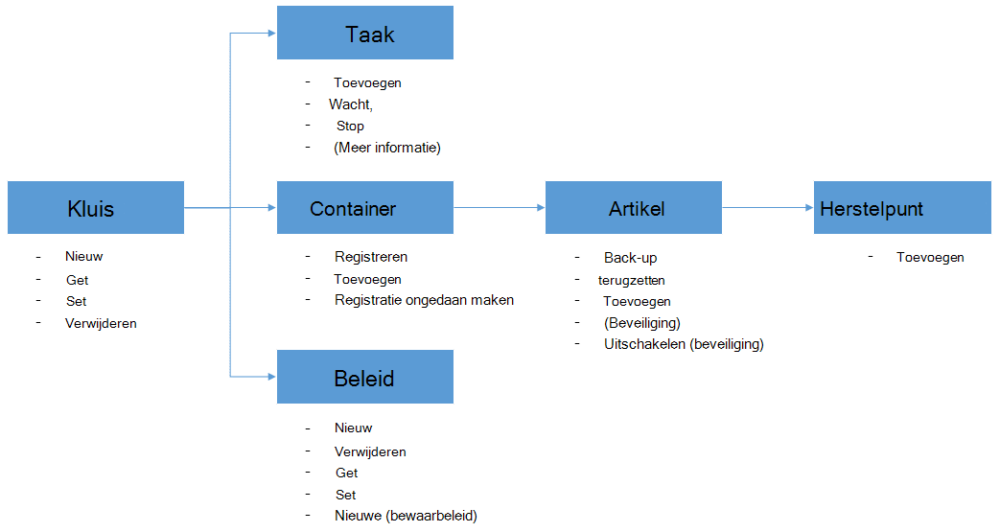

<properties
    pageTitle="Implementeren en beheren van back-up voor Azure VMs met PowerShell | Microsoft Azure"
    description="Meer informatie over het implementeren en beheren van back-up Azure PowerShell gebruiken"
    services="backup"
    documentationCenter=""
    authors="markgalioto"
    manager="cfreeman"
    editor=""/>

<tags
    ms.service="backup"
    ms.workload="storage-backup-recovery"
    ms.tgt_pltfrm="na"
    ms.devlang="na"
    ms.topic="article"
    ms.date="08/08/2016"
    ms.author="markgal;trinadhk;jimpark" />


# <a name="deploy-and-manage-backup-for-azure-vms-using-powershell"></a>Implementeren en beheren van back-up voor Azure VMs met PowerShell

> [AZURE.SELECTOR]
- [Resource Manager](backup-azure-vms-automation.md)
- [Klassiek](backup-azure-vms-classic-automation.md)

In dit artikel wordt beschreven hoe u Azure PowerShell gebruiken voor back-up en herstel van VMs Azure. Azure heeft twee verschillende modellen voor het maken en werken met resources: bronnen Manager en klassiek. In dit artikel beschreven hoe u met het model Klassiek implementatie. Microsoft raadt de meeste nieuwe implementaties gebruiken het model Resource Manager.

## <a name="concepts"></a>Concepten


Dit artikel bevat informatie over de PowerShell-cmdlets waarmee een back-up van virtuele machines. Zie [plannen van uw back-upinfrastructuur VM in Azure](backup-azure-vms-introduction.md)voor inleidende informatie over het beveiligen van VMs Azure.

> [AZURE.NOTE] Voordat u begint, lees de [voorwaarden](backup-azure-vms-prepare.md) vereist om te werken met Azure back-up en de [beperkingen](backup-azure-vms-prepare.md#limitations) van de huidige back-upoplossing voor VM.

PowerShell als effectief wilt gebruiken, neem even de tijd om te begrijpen van de hiërarchie van objecten en waar te beginnen.



De twee belangrijkste stromen inschakelen voor een VM en herstellen van gegevens van een herstelpunt. De focus van dit artikel is om te worden bedreven zijn in het werken met de PowerShell-cmdlets waarmee deze twee scenario's.


## <a name="setup-and-registration"></a>Installatie en registratie
Om te beginnen:

1. [Nieuwste PowerShell downloaden](https://github.com/Azure/azure-powershell/releases) (minimaal vereiste versie is: 1.0.0)

2. De beschikbare Azure back-up PowerShell-cmdlets vinden door de volgende opdracht te typen:

```
PS C:\> Get-Command *azurermbackup*

CommandType     Name                                               Version    Source
-----------     ----                                               -------    ------
Cmdlet          Backup-AzureRmBackupItem                           1.0.1      AzureRM.Backup
Cmdlet          Disable-AzureRmBackupProtection                    1.0.1      AzureRM.Backup
Cmdlet          Enable-AzureRmBackupContainerReregistration        1.0.1      AzureRM.Backup
Cmdlet          Enable-AzureRmBackupProtection                     1.0.1      AzureRM.Backup
Cmdlet          Get-AzureRmBackupContainer                         1.0.1      AzureRM.Backup
Cmdlet          Get-AzureRmBackupItem                              1.0.1      AzureRM.Backup
Cmdlet          Get-AzureRmBackupJob                               1.0.1      AzureRM.Backup
Cmdlet          Get-AzureRmBackupJobDetails                        1.0.1      AzureRM.Backup
Cmdlet          Get-AzureRmBackupProtectionPolicy                  1.0.1      AzureRM.Backup
Cmdlet          Get-AzureRmBackupRecoveryPoint                     1.0.1      AzureRM.Backup
Cmdlet          Get-AzureRmBackupVault                             1.0.1      AzureRM.Backup
Cmdlet          Get-AzureRmBackupVaultCredentials                  1.0.1      AzureRM.Backup
Cmdlet          New-AzureRmBackupProtectionPolicy                  1.0.1      AzureRM.Backup
Cmdlet          New-AzureRmBackupRetentionPolicyObject             1.0.1      AzureRM.Backup
Cmdlet          New-AzureRmBackupVault                             1.0.1      AzureRM.Backup
Cmdlet          Register-AzureRmBackupContainer                    1.0.1      AzureRM.Backup
Cmdlet          Remove-AzureRmBackupProtectionPolicy               1.0.1      AzureRM.Backup
Cmdlet          Remove-AzureRmBackupVault                          1.0.1      AzureRM.Backup
Cmdlet          Restore-AzureRmBackupItem                          1.0.1      AzureRM.Backup
Cmdlet          Set-AzureRmBackupProtectionPolicy                  1.0.1      AzureRM.Backup
Cmdlet          Set-AzureRmBackupVault                             1.0.1      AzureRM.Backup
Cmdlet          Stop-AzureRmBackupJob                              1.0.1      AzureRM.Backup
Cmdlet          Unregister-AzureRmBackupContainer                  1.0.1      AzureRM.Backup
Cmdlet          Wait-AzureRmBackupJob                              1.0.1      AzureRM.Backup
```

De volgende taken voor de installatie en registratie kunnen worden geautomatiseerd met PowerShell:

- Maak een back-kluis
- Het VMs registreren met de back-up Azure service

### <a name="create-a-backup-vault"></a>Maak een back-kluis

> [AZURE.WARNING] Voor klanten die Azure back-up voor de eerste keer, moet u voor het registreren van de provider Azure back-up kan worden gebruikt bij uw abonnement. Dit kan worden gedaan door de volgende opdracht uit te voeren: Register-AzureRmResourceProvider - ProviderNamespace "Microsoft.Backup"

Kunt u een nieuwe back-kluis met de cmdlet **New-AzureRmBackupVault** . De back-vault is een bron ARM, dus u hoeft te plaatsen binnen een groep. Voer de volgende opdrachten in een verhoogde Azure PowerShell-console:

```
PS C:\> New-AzureRmResourceGroup –Name “test-rg” –Location “West US”
PS C:\> $backupvault = New-AzureRmBackupVault –ResourceGroupName “test-rg” –Name “test-vault” –Region “West US” –Storage GeoRedundant
```

U kunt een lijst van alle back-kluizen in een bepaald abonnement met de cmdlet **Get-AzureRmBackupVault** .

> [AZURE.NOTE] Het is handig voor het opslaan van de back-kluis-object in een variabele. Het object kluis is nodig als invoer voor veel Azure Backup-cmdlets.


### <a name="registering-the-vms"></a>Het VMs registreren
De eerste stap naar een back-up configureren met Azure back-up is voor het registreren van uw computer of VM met een kluis Azure back-up. De **Kassa-AzureRmBackupContainer** -cmdlet neemt de gegevens invoeren van een virtuele machine van Azure IaaS en geregistreerd met de opgegeven kluis. De bewerking van het register de Azure virtual machine worden gekoppeld aan de back-kluis en traceert de VM via de levenscyclus van de back-up.

Uw VM met de back-up Azure-service registreert, maakt een containerobject op het hoogste niveau. Een container meestal meerdere items bevat die kunnen worden een back-up, maar in het geval van VMs zal er slechts één back-item voor de container.

```
PS C:\> $registerjob = Register-AzureRmBackupContainer -Vault $backupvault -Name "testvm" -ServiceName "testvm"
```

## <a name="backup-azure-vms"></a>Back-up Azure VMs

### <a name="create-a-protection-policy"></a>Maak een beleid voor bescherming
Het is niet verplicht voor het maken van een nieuw beleid voor bescherming start back-up van uw VMs. De kluis is voorzien van een 'Default Policy' die kunnen worden gebruikt om snel bescherming en later bewerkt met de juiste gegevens. Een overzicht van het beleid van de kluis kunt u opvragen via de cmdlet **Get-AzureRmBackupProtectionPolicy** :

```
PS C:\> Get-AzureRmBackupProtectionPolicy -Vault $backupvault

Name                      Type               ScheduleType       BackupTime
----                      ----               ------------       ----------
DefaultPolicy             AzureVM            Daily              26-Aug-15 12:30:00 AM
```

> [AZURE.NOTE] De tijdzone van het veld BackupTime in PowerShell is UTC. Echter wanneer de back-up tijd wordt weergegeven in de portal Azure, wordt de tijdzone uitgelijnd op het lokale systeem en de UTC-afwijking.

Een back-up beleid is gekoppeld aan ten minste één bewaarbeleid. Het bewaarbeleid bepaalt hoe lang een herstelpunt wordt gehouden met Azure back-up. De cmdlet **New-AzureRmBackupRetentionPolicy** maakt PowerShell-objecten bevatten informatie over bewaarbeleid. Deze inhouding beleidsobjecten worden gebruikt als invoer voor de cmdlet *New-AzureRmBackupProtectionPolicy* of rechtstreeks met de cmdlet *Enable-AzureRmBackupProtection* .

Een back-up beleid bepaalt wanneer en hoe vaak de back-up van een item wordt uitgevoerd. De cmdlet **New-AzureRmBackupProtectionPolicy** maakt een PowerShell-object dat informatie over back-beleid bevat. De back-beleid wordt gebruikt als invoer voor de cmdlet *Enable-AzureRmBackupProtection* .

```
PS C:\> $Daily = New-AzureRmBackupRetentionPolicyObject -DailyRetention -Retention 30
PS C:\> $newpolicy = New-AzureRmBackupProtectionPolicy -Name DailyBackup01 -Type AzureVM -Daily -BackupTime ([datetime]"3:30 PM") -RetentionPolicy $Daily -Vault $backupvault

Name                      Type               ScheduleType       BackupTime
----                      ----               ------------       ----------
DailyBackup01             AzureVM            Daily              01-Sep-15 3:30:00 PM
```

### <a name="enable-protection"></a>Beveiliging inschakelen
Beveiliging inschakelen draait om twee objecten - het artikel en het beleid, en moeten beide deel uitmaken van de dezelfde kluis. Nadat het beleid gekoppeld aan het artikel is, wordt de back-up-workflow kick in op het opgegeven schema.

```
PS C:\> Get-AzureRmBackupContainer -Type AzureVM -Status Registered -Vault $backupvault | Get-AzureRmBackupItem | Enable-AzureRmBackupProtection -Policy $newpolicy
```

### <a name="initial-backup"></a>Eerste back-up
Het back-upschema wordt gedaan om de volledige kopie van het artikel en de incrementele kopie voor de volgende back-ups. Echter, als u wilt afdwingen dat de eerste back-up op een bepaalde tijd of zelfs direct gebeuren vervolgens gebruiken de cmdlet **Back-up-AzureRmBackupItem** :

```
PS C:\> $container = Get-AzureRmBackupContainer -Vault $backupvault -Type AzureVM -Name "testvm"
PS C:\> $backupjob = Get-AzureRmBackupItem -Container $container | Backup-AzureRmBackupItem
PS C:\> $backupjob

WorkloadName    Operation       Status          StartTime              EndTime
------------    ---------       ------          ---------              -------
testvm          Backup          InProgress      01-Sep-15 12:24:01 PM  01-Jan-01 12:00:00 AM
```

> [AZURE.NOTE] De tijdzone van de velden Begintijd en eindtijd in PowerShell is UTC. Echter, als soortgelijke informatie wordt weergegeven in de portal Azure, de tijdzone wordt uitgelijnd op de klok.

### <a name="monitoring-a-backup-job"></a>Een back-up controleren
De meeste langdurige bewerkingen in Azure back-up worden gemodelleerd als een taak. Dit kunt u gemakkelijk de voortgang bijhouden zonder dat de Azure portal open te allen tijde.

Als u de meest recente status van een taak in uitvoering, gebruikt u de cmdlet **Get-AzureRmBackupJob** .

```
PS C:\> $joblist = Get-AzureRmBackupJob -Vault $backupvault -Status InProgress
PS C:\> $joblist[0]

WorkloadName    Operation       Status          StartTime              EndTime
------------    ---------       ------          ---------              -------
testvm          Backup          InProgress      01-Sep-15 12:24:01 PM  01-Jan-01 12:00:00 AM
```

In plaats van deze taken is voltooid - dat is niet nodig, aanvullende code - polling is eenvoudiger met de cmdlet **Wachten op AzureRmBackupJob** . Als in een script gebruikt, wordt de cmdlet de uitvoering onderbroken totdat de taak is voltooid of de opgegeven time-outwaarde is bereikt.

```
PS C:\> Wait-AzureRmBackupJob -Job $joblist[0] -Timeout 43200
```


## <a name="restore-an-azure-vm"></a>Herstellen van een Azure VM

U moet back-upgegevens terugzetten, identificatie van het artikel een back-up en herstel punt dat de point-in-time-gegevens bevat. Deze informatie wordt geleverd aan de cmdlet terugzetten AzureRmBackupItem terugzetten van gegevens uit de kluis in de rekening van de klant te starten.

### <a name="select-the-vm"></a>Selecteer de VM

Als u de PowerShell-object waarmee de juiste back-artikel, die u wilt starten vanuit de Container in de kluis en werk van boven naar beneden in de objecthiërarchie. Als u de container die de VM vertegenwoordigt, gebruikt u de cmdlet **Get-AzureRmBackupContainer** en pipe die aan de cmdlet **Get-AzureRmBackupItem** .

```
PS C:\> $backupitem = Get-AzureRmBackupContainer -Vault $backupvault -Type AzureVM -name "testvm" | Get-AzureRmBackupItem
```

### <a name="choose-a-recovery-point"></a>Kies een herstelpunt

U kunt nu de herstel-punten voor de back-item met de cmdlet **Get-AzureRmBackupRecoveryPoint** lijst en kiest u het herstelpunt herstellen. Gebruikers kiezen meestal de meest recente *AppConsistent* punt in de lijst.

```
PS C:\> $rp =  Get-AzureRmBackupRecoveryPoint -Item $backupitem
PS C:\> $rp

RecoveryPointId    RecoveryPointType  RecoveryPointTime      ContainerName
---------------    -----------------  -----------------      -------------
15273496567119     AppConsistent      01-Sep-15 12:27:38 PM  iaasvmcontainer;testvm;testv...
```

De variabele ```$rp``` is een matrix van punten herstel voor de geselecteerde back-up artikel, gesorteerd in omgekeerde volgorde van tijd - het laatste herstelpunt op index 0 is. Met standaard PowerShell matrix indexeren kunt u het herstelpunt kiezen. Bijvoorbeeld: ```$rp[0]``` wordt het meest recente herstelpunt selecteren.

### <a name="restoring-disks"></a>Herstellen van schijven

Er is een belangrijk verschil tussen de bewerking voor terugzetten via de portal Azure en Azure PowerShell gedaan. Met PowerShell stopt de bewerking voor terugzetten bij het herstellen van schijven en configuratiegegevens van het herstelpunt. Er wordt een virtuele machine niet gemaakt.

> [AZURE.WARNING] De Restore-AzureRmBackupItem maakt een VM. De schijven worden alleen hersteld naar de rekening voor opslag opgegeven. Dit is niet in de portal Azure treedt hetzelfde probleem.

```
PS C:\> $restorejob = Restore-AzureRmBackupItem -StorageAccountName "DestAccount" -RecoveryPoint $rp[0]
PS C:\> $restorejob

WorkloadName    Operation       Status          StartTime              EndTime
------------    ---------       ------          ---------              -------
testvm          Restore         InProgress      01-Sep-15 1:14:01 PM   01-Jan-01 12:00:00 AM
```

U kunt de details van de bewerking voor terugzetten met behulp van de cmdlet **Get-AzureRmBackupJobDetails** als de terugzettaak is voltooid. De eigenschap *ErrorDetails* wordt de informatie die nodig is om opnieuw de VM te hebben.

```
PS C:\> $restorejob = Get-AzureRmBackupJob -Job $restorejob
PS C:\> $details = Get-AzureRmBackupJobDetails -Job $restorejob
```

### <a name="build-the-vm"></a>Opbouwen van de VM

Bouwen van de VM uit de teruggezette schijven kan plaatsvinden met behulp van de oudere Azure Service Management PowerShell-cmdlets, de nieuwe sjablonen voor Azure Resource Manager, of zelfs met de Azure portal. In een snel voorbeeld zien we hoe krijgt de Azure Service Management-cmdlets gebruiken.

```
 $properties  = $details.Properties

 $storageAccountName = $properties["Target Storage Account Name"]
 $containerName = $properties["Config Blob Container Name"]
 $blobName = $properties["Config Blob Name"]

 $keys = Get-AzureStorageKey -StorageAccountName $storageAccountName
 $storageAccountKey = $keys.Primary
 $storageContext = New-AzureStorageContext -StorageAccountName $storageAccountName -StorageAccountKey $storageAccountKey


 $destination_path = "C:\Users\admin\Desktop\vmconfig.xml"
 Get-AzureStorageBlobContent -Container $containerName -Blob $blobName -Destination $destination_path -Context $storageContext


$obj = [xml](((Get-Content -Path $destination_path -Encoding UniCode)).TrimEnd([char]0x00))
 $pvr = $obj.PersistentVMRole
 $os = $pvr.OSVirtualHardDisk
 $dds = $pvr.DataVirtualHardDisks
 $osDisk = Add-AzureDisk -MediaLocation $os.MediaLink -OS $os.OS -DiskName "panbhaosdisk"
 $vm = New-AzureVMConfig -Name $pvr.RoleName -InstanceSize $pvr.RoleSize -DiskName $osDisk.DiskName

 if (!($dds -eq $null))
 {
     foreach($d in $dds.DataVirtualHardDisk)
     {
         $lun = 0
         if(!($d.Lun -eq $null))
         {
             $lun = $d.Lun
         }
         $name = "panbhadataDisk" + $lun
     Add-AzureDisk -DiskName $name -MediaLocation $d.MediaLink
     $vm | Add-AzureDataDisk -Import -DiskName $name -LUN $lun
    }
}

New-AzureVM -ServiceName "panbhasample" -Location "SouthEast Asia" -VM $vm
```

Lezen over de volgende cmdlets voor meer informatie over het bouwen van een VM vanaf de teruggezette diskettes:

- [Toevoegen-AzureDisk](https://msdn.microsoft.com/library/azure/dn495252.aspx)
- [Nieuwe AzureVMConfig](https://msdn.microsoft.com/library/azure/dn495159.aspx)
- [Nieuwe AzureVM](https://msdn.microsoft.com/library/azure/dn495254.aspx)

## <a name="code-samples"></a>Codevoorbeelden

### <a name="1-get-the-completion-status-of-job-sub-tasks"></a>1. de voltooiingsstatus van de taak subtaken ophalen

U kunt de cmdlet **Get-AzureRmBackupJobDetails** gebruiken voor het bijhouden van de voltooiingsstatus van de afzonderlijke subtaken:

```
PS C:\> $details = Get-AzureRmBackupJobDetails -JobId $backupjob.InstanceId -Vault $backupvault
PS C:\> $details.SubTasks

Name                                                        Status
----                                                        ------
Take Snapshot                                               Completed
Transfer data to Backup vault                               InProgress
```

### <a name="2-create-a-dailyweekly-report-of-backup-jobs"></a>2. een dagelijks/wekelijks rapport maken van back-uptaken

Beheerders willen meestal weten back-uptaken uitgevoerd in de afgelopen 24 uur de status van de back-uptaken. Bovendien geeft de hoeveelheid gegevens die worden overgedragen beheerders een manier om te schatten hun maandelijkse gegevens gebruik. Het onderstaande script de onbewerkte gegevens ophaalt uit de back-up Azure service en worden de gegevens weergegeven in de console met PowerShell.

```
param(  [Parameter(Mandatory=$True,Position=1)]
        [string]$backupvaultname,

        [Parameter(Mandatory=$False,Position=2)]
        [int]$numberofdays = 7)


#Initialize variables
$DAILYBACKUPSTATS = @()
$backupvault = Get-AzureRmBackupVault -Name $backupvaultname
$enddate = ([datetime]::Today).AddDays(1)
$startdate = ([datetime]::Today)

for( $i = 1; $i -le $numberofdays; $i++ )
{
    # We query one day at a time because pulling 7 days of data might be too much
    $dailyjoblist = Get-AzureRmBackupJob -Vault $backupvault -From $startdate -To $enddate -Type AzureVM -Operation Backup
    Write-Progress -Activity "Getting job information for the last $numberofdays days" -Status "Day -$i" -PercentComplete ([int]([decimal]$i*100/$numberofdays))

    foreach( $job in $dailyjoblist )
    {
        #Extract the information for the reports
        $newstatsobj = New-Object System.Object
        $newstatsobj | Add-Member -Type NoteProperty -Name Date -Value $startdate
        $newstatsobj | Add-Member -Type NoteProperty -Name VMName -Value $job.WorkloadName
        $newstatsobj | Add-Member -Type NoteProperty -Name Duration -Value $job.Duration
        $newstatsobj | Add-Member -Type NoteProperty -Name Status -Value $job.Status

        $details = Get-AzureRmBackupJobDetails -Job $job
        $newstatsobj | Add-Member -Type NoteProperty -Name BackupSize -Value $details.Properties["Backup Size"]
        $DAILYBACKUPSTATS += $newstatsobj
    }

    $enddate = $enddate.AddDays(-1)
    $startdate = $startdate.AddDays(-1)
}

$DAILYBACKUPSTATS | Out-GridView
```

Als u wilt de mogelijkheden voor grafieken toevoegen aan de rapportuitvoer van dit, leren van het weblogbericht TechNet [Charting met PowerShell](http://blogs.technet.com/b/richard_macdonald/archive/2009/04/28/3231887.aspx)

## <a name="next-steps"></a>Volgende stappen

Als u liever met PowerShell koppelen aan uw resources Azure, Controleer de PowerShell-artikel voor het beveiligen van Windows Server, [distribueren en beheren van back-up voor Windows Server](./backup-client-automation-classic.md). Er is ook een PowerShell-artikel voor het beheren van DPM back-ups, [distribueren en beheren van back-up DPM](./backup-dpm-automation-classic.md). Beide van deze artikelen hebben een versie voor implementaties Resource Manager als klassieke implementaties.
