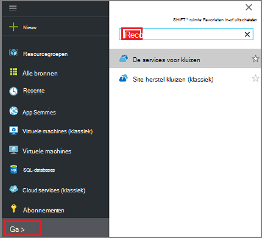
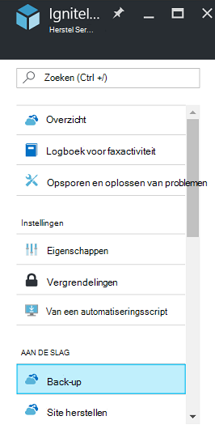
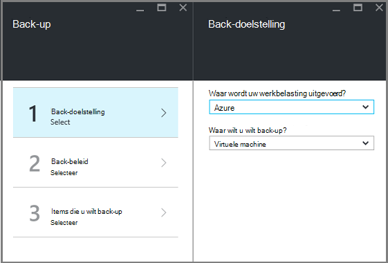
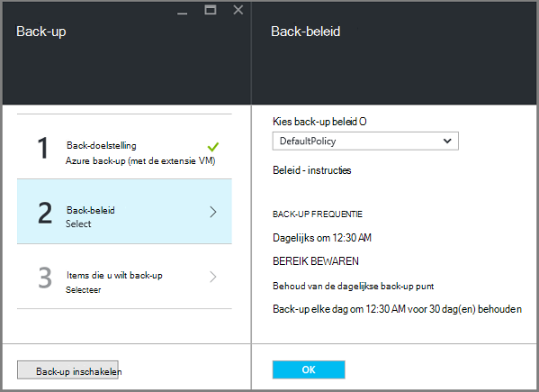
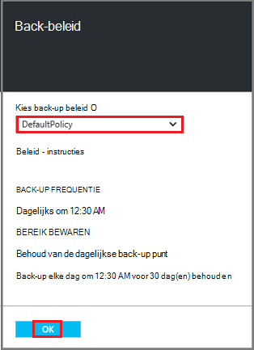
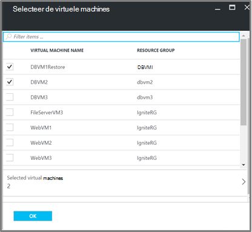
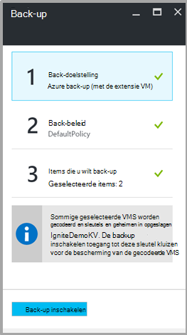

<properties
   pageTitle="Maken en terugzetten van back-up gecodeerd VMs met Azure back-up"
   description="In dit artikel gesprekken voert over de back-up en terugzetten ervaring voor VMs gecodeerd met Azure schijfversleuteling."
   services="backup"
   documentationCenter=""
   authors="JPallavi"
   manager="vijayts"
   editor=""/>
<tags
   ms.service="backup"
   ms.devlang="na"
   ms.topic="article"
   ms.tgt_pltfrm="na"
   ms.workload="storage-backup-recovery"
   ms.date="10/25/2016"
   ms.author="markgal; jimpark; trinadhk"/>

# Maken en terugzetten van back-up gecodeerd VMs met Azure back-up

In dit artikel gesprekken voert over stappen om een back-up en terugzetten van virtuele machines met Azure Backup. Het biedt ook informatie over ondersteunde scenario's, de vereisten en stappen voor probleemoplossing voor foutgevallen.

## Ondersteunde scenario 's

> [AZURE.NOTE]
1.  Back-up en het herstellen van gecodeerde VMs wordt alleen ondersteund voor bronnenbeheerder geïmplementeerd virtuele machines. Het wordt niet ondersteund voor klassieke virtuele machines.  
2.  Dit wordt alleen ondersteund voor virtuele machines is versleuteld met BitLocker-versleutelingssleutel en coderingssleutel Key. Het wordt niet ondersteund voor virtuele machines met behulp van BitLocker-versleutelingssleutel alleen gecodeerd.  

## Minimumvereisten

1.  Virtuele machine is gecodeerd met [Azure schijfversleuteling](../security/azure-security-disk-encryption.md). Deze moet worden versleuteld met BitLocker-versleutelingssleutel en coderingssleutel Key.
2.  Recovery services kluis is gemaakt en opslag, replicatie instellen met behulp van de stappen die worden vermeld in het artikel [voorbereiden uw omgeving voor back-up](backup-azure-arm-vms-prepare.md).

## Back-up gecodeerd VM
Gebruik de volgende stappen uit voor back-up doel instellen, beleid, artikelen en trigger back-up configureren.

### Back-up configureren

1. Als u al een Recovery Services kluis openen, gaat u verder met de volgende stap. Als u beschikt niet over een Recovery Services kluis openen, maar in de Azure portal de Hub op het menu **Bladeren**.

  - Typ in de lijst met resources **Recovery Services**.
  - Als u te typen begint, de lijstfilters op basis van uw invoer. Wanneer u **de kluizen Recovery Services**ziet, klikt u erop.
  
        

    De lijst van kluizen Recovery Services weergegeven. Selecteer in de lijst van kluizen Recovery Services, een kluis.

    Hiermee opent u het geselecteerde kluis dashboard.

2. Klik op **back-up** openen de blade back-up uit de lijst met items die wordt weergegeven onder de kluis.

       
    
3. Klik op de bladeserver back-up **back-up doel** om de back-up doel blade openen.

       
    
4.   Stel op de back-up doel-blade **waar uw werkbelasting actief is** op Azure en **Waar wilt u back-up wilt** met virtuele machine, klikt u op **OK**.

    De back-up doel blade sluiten en openen van de back-up beleid blade.

       

5. Selecteer de back-beleid dat u wilt toepassen op de kluis en klik op **OK**op de back-up beleid-blade.

       

    De details van het standaardbeleid worden weergegeven in de details. Als u een beleid maken, **Nieuw** te selecteren uit de vervolgkeuzelijst. Zodra u op **OK**klikt, wordt het back-beleid gekoppeld aan de kluis.

    Kies vervolgens de VMs koppelen aan de kluis.
    
6. Kies de versleutelde virtuele machines te koppelen aan het opgegeven beleid en klik op **OK**.

      
   
7. Deze pagina wordt een bericht weergegeven over de sleutel kluis die is gekoppeld aan het gecodeerde VMs geselecteerd. Back-up-service is alleen-lezen toegang tot de sleutels en geheimen in de sleutel kluis. Deze machtigingen back-toets en het geheim, samen met de bijbehorende VMs wordt gebruikt. 

      

      Nu dat u hebt gedefinieerd op alle instellingen voor de kluis, in de blade back-up back-up inschakelen op de onderkant van de pagina. Back-up implementeert het beleid naar de kluis en het VMs.

8. De volgende fase in de voorbereiding is het installeren van de Agent VM of zorg ervoor dat de VM-Agent is geïnstalleerd. Dezelfde, gebruikt u de stappen vermeld in het artikel [voorbereiden uw omgeving voor back-up](backup-azure-arm-vms-prepare.md). 

### Starten van de back-uptaak
Gebruik de stappen vermeld in het artikel [Back-Azure VMs te recovery services kluis](backup-azure-arm-vms.md) trigger reservekopietaak.

## Herstellen gecodeerd VM
Ervaring voor virtuele machines van gecodeerde en niet-gecodeerde herstellen is hetzelfde. Gebruik de stappen vermeld in [virtuele machines in Azure portal terugzetten](backup-azure-arm-restore-vms.md) herstellen van de gecodeerde VM. In het geval u nodig hebt om sleutels en geheimen te herstellen, moet u ervoor zorgen dat belangrijke kluis herstellen moet al bestaan.

## Het oplossen van problemen

| Bewerking | Foutdetails | Resolutie |
| -------- | -------- | -------|
| Back-up | Validatie mislukt als de virtuele machine wordt gecodeerd met de BEK alleen. Back-ups kunnen alleen worden ingeschakeld voor virtuele machines met BEK en KEK gecodeerd. | Virtuele machine moet worden versleuteld met BEK en KEK. Daarna de back-up moet worden ingeschakeld. |
| Herstellen | Deze gecodeerde VM kunt u niet terugzetten omdat de sleutel kluis die zijn gekoppeld aan deze VM bestaat niet. | - [Aan de slag met Azure sleutel kluis](../key-vault/key-vault-get-started.md)met sleutel kluis maken. Raadpleeg het artikel [sleutel sleutel kluis en geheim met Azure back-up terugzetten](backup-azure-restore-key-secret.md) herstellen sleutel en geheim als ze niet aanwezig zijn. |
| Herstellen | Deze gecodeerde VM kunt u niet terugzetten omdat de sleutel en het geheim dat is gekoppeld aan deze VM niet bestaat. | Raadpleeg het artikel [sleutel sleutel kluis en geheim met Azure back-up terugzetten](backup-azure-restore-key-secret.md) herstellen sleutel en geheim als ze niet aanwezig zijn. |
