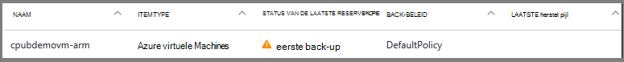
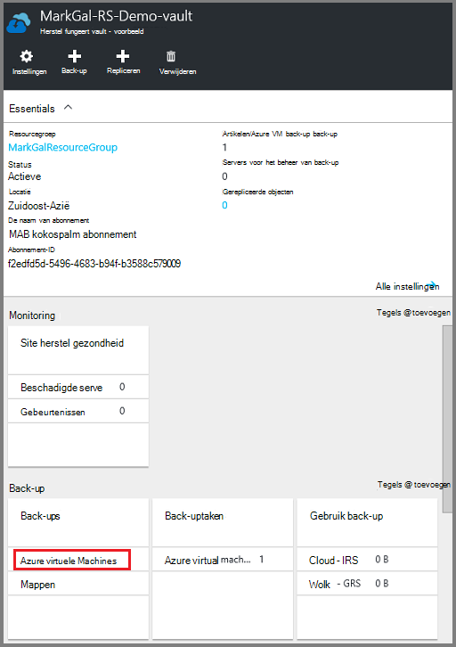
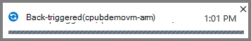
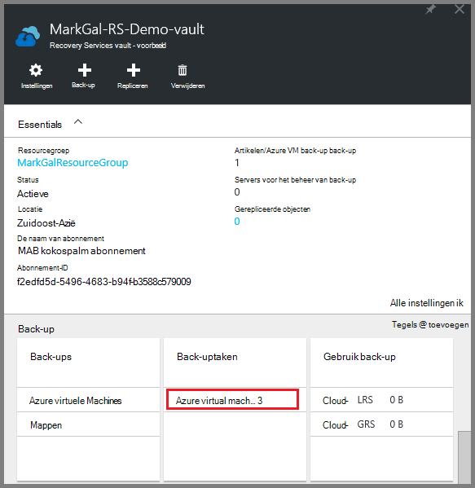
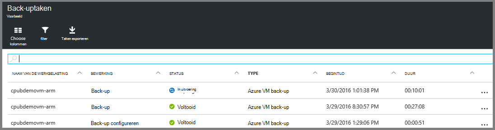

<properties
    pageTitle="Eerst wordt gezocht naar: Azure VMs beschermen met een kluis recovery services | Microsoft Azure"
    description="Azure VMs beschermen met een kluis recovery services. Back-ups van VMs bronnenbeheerder geïmplementeerd, klassieke geïmplementeerd VMs en Premium opslag VMs gebruiken om uw gegevens te beschermen. Maak en registreer een kluis recovery services. VMs in Azure beschermen registreren VMs en beleid maken."
    services="backup"
    documentationCenter=""
    authors="markgalioto"
    manager="cfreeman"
    editor=""
    keyword="backups; vm backup"/>

<tags
    ms.service="backup"
    ms.workload="storage-backup-recovery"
    ms.tgt_pltfrm="na"
    ms.devlang="na"
    ms.topic="hero-article"
    ms.date="10/13/2016"
    ms.author="markgal; jimpark"/>

# Eerst wordt gezocht naar: Azure VMs beschermen met een kluis recovery services

> [AZURE.SELECTOR]
- [VMs beschermen met een kluis recovery services](backup-azure-vms-first-look-arm.md)
- [VMs beschermen met een back-kluis](backup-azure-vms-first-look.md)

Deze zelfstudie doorloopt u de stappen voor het maken van een kluis recovery services en back-ups van een Azure VM (virtual machine). Recovery services kluizen beschermen:

- Azure VMs bronnenbeheerder geïmplementeerd
- Klassieke VMs
- Standaardopslag VMs
- Premium-opslagruimte VMs
- VMs gecodeerd met behulp van Azure schijfversleuteling met BEK en KEK

Zie voor meer informatie over het beveiligen van de premie opslag VMs [Back-up en herstellen van de premie opslag VMs](backup-introduction-to-azure-backup.md#back-up-and-restore-premium-storage-vms)

>[AZURE.NOTE] In deze zelfstudie wordt ervan uitgegaan dat er al een VM in Azure abonnementskosten en dat u maatregelen genomen hebt om de back-service toegang heeft tot de VM.

[AZURE.INCLUDE [learn-about-Azure-Backup-deployment-models](../../includes/backup-deployment-models.md)]

Op een hoog niveau zijn hier de stappen die u zult uitvoeren.  

1. Maak een kluis recovery services voor een VM.
2. Via de portal Azure selecteert u een Scenario, beleid instellen en artikelen te beschermen.
3. De eerste back-up uitvoeren.

## Een kluis recovery services voor een VM maken

Een kluis recovery services is een entiteit die de back-ups en herstel punten die zijn gemaakt na verloop van tijd worden opgeslagen. De kluis recovery services bevat ook de back-beleid toegepast op de beveiligde VMs.

>[AZURE.NOTE] Back-ups van VMs is een lokaal proces. U kan geen back-up van VMs van de ene locatie naar een kluis recovery services op een andere locatie. Dus voor elke locatie Azure met VMs worden back-up moet moeten ten minste één recovery services kluis hebben op die locatie.

Voor het maken van een kluis recovery services:

1. Log in om de [Azure portal](https://portal.azure.com/).

2. Klik op **Bladeren** en typ in de lijst met resources **Recovery Services**in het menu Hub. Als u te typen begint, de lijstfilters op basis van uw invoer. Klik op **de kluis Recovery Services**.

      

    De lijst met recovery services kluizen worden weergegeven.

3. Klik in het menu **kluizen Recovery Services** op **toevoegen**.

    

    De kluis Recovery Services blade wordt geopend, waarin u een **naam**, **abonnement**, **resourcegroep**en **locatie**.

    

4. Voer voor de **naam**een beschrijvende naam ter identificatie van de kluis. De naam moet uniek zijn voor het abonnement Azure. Typ een naam die tussen 2 en 50 tekens bevat. Het moet beginnen met een letter en mag alleen letters, cijfers en streepjes.

5. Klik op **abonnement** overzicht de beschikbare abonnementen. Als u niet zeker weet welke abonnement wilt gebruiken, gebruikt u de standaardinstelling (of voorgesteld) abonnement. Er zijn meerdere opties als uw organisatie-account gekoppeld aan meerdere Azure abonnementen is.

6. Klik op **resourcegroep** overzicht de beschikbare brongroepen of klik op **Nieuw** om een resourcegroep te maken. Zie voor volledige informatie over resourcegroepen, [Azure Resource Manager-overzicht](../azure-resource-manager/resource-group-overview.md)

7. Klik op **locatie** selecteren van de geografische regio van de kluis. De kluis **moet** zich in hetzelfde gebied, als de virtuele machines die u wilt beveiligen.

    >[AZURE.IMPORTANT] Als u niet zeker van de locatie waar uw VM bestaat bent, sluiten een dialoogvenster voor het maken van de kluis en Ga naar de lijst van virtuele Machines in de portal. Als u virtuele machines in meerdere regio's, maakt u een kluis recovery services in elke regio. De kluis in de eerste locatie voordat u gaat naar de volgende locatie maken. Het is niet nodig om opslag rekeningen voor het opslaan van de back-upgegevens--de kluis recovery services te geven en de Azure back-service verwerkt dit automatisch.

8. Klik op **maken**. Het kan even duren voor de kluis recovery services moet worden gemaakt. Controleren van de van statusmeldingen in het bovenste rechter gebied in de portal. Zodra uw kluis is gemaakt, verschijnt het in de lijst met recovery services kluizen.

    

Nu dat u hebt gemaakt de kluis, informatie over het instellen van de replicatie van opslag.

### Opslag, replicatie instellen

De opslagoptie voor replicatie kunt u kiezen tussen geo-redundante opslag en lokaal redundante opslag. Standaard heeft de kluis geo-redundante opslag. Laat de optie ingesteld op geo-redundante opslag als dit uw primaire back-up. Kies lokaal redundante opslag als u wilt een goedkopere optie die niet zo duurzaam. Meer informatie over [geo-redundante](../storage/storage-redundancy.md#geo-redundant-storage) [lokaal redundante](../storage/storage-redundancy.md#locally-redundant-storage) opslagopties en in de [opslag van Azure replicatie-overzicht](../storage/storage-redundancy.md).

De instelling opslag replicatie bewerken:

1. Selecteer de kluis te openen de kluis dashboard en de instellingen voor blade. Als het blad **Instellingen** niet wordt geopend, klikt u op **alle instellingen** in het dashboard van de kluis.

2. Klik op het blad **Instellingen** **Back-up infrastructuur** > **Back-up configureren** voor het openen van de **Back-up configuratie** blade. Kies de optie van de replicatie opslag voor uw kluis op de **Back-up van configuratie** -blade.

    

    Nadat u de opslagoptie voor uw kluis, bent u gereed om de VM koppelen aan de kluis. Om te beginnen met de koppeling, ontdekken en u registreren de Azure virtuele machines.

## Selecteer een back-up doel, beleid instellen en definiëren van items die u wilt beveiligen

Een VM met een kluis, uitvoeren voordat u zich registreert de discovery-proces om ervoor te zorgen dat alle nieuwe virtuele machines die zijn toegevoegd aan het abonnement zijn geïdentificeerd. De query's proces Azure voor de lijst met virtuele machines in het abonnement, aanvullende informatie, zoals de naam van de wolk en de regio. De portal voor Azure verwijst scenario naar wat u wilt opnemen in de kluis recovery services. Het beleid is het schema voor hoe vaak en wanneer herstel punten worden genomen. Beleid omvat ook het bereik van de inhouding voor de herstel-punten.

1. Als u al een recovery services kluis openen, gaat u verder met stap 2. Als u beschikt niet over een recovery services kluis openen, maar zijn in de portal Azure, de Hub op het menu **Bladeren**.

  - Typ in de lijst met resources **Recovery Services**.
  - Als u te typen begint, de lijstfilters op basis van uw invoer. Wanneer u **de kluizen Recovery Services**ziet, klikt u erop.

      

    De lijst van recovery services kluizen wordt weergegeven.
  - Selecteer in de lijst van recovery services kluizen, een kluis.

    Hiermee opent u het geselecteerde kluis dashboard.

    

2. Klik op **back-up** om de bladeserver back-up openen in het menu van het dashboard kluis.

    

    Als het blad wordt geopend, zoekt naar de back-up-service nieuwe VMs in het abonnement.

    

3. Klik op de bladeserver back-up **back-up doel** om de back-up doel blade openen.

    

4. Stel op de back-up doel-blade **waar uw werkbelasting actief is** op Azure en **Waar wilt u back-up wilt** met virtuele machine, klikt u op **OK**.

    De back-up doel blade sluiten en openen van de back-up beleid blade.

    

5. Selecteer de back-beleid dat u wilt toepassen op de kluis en klik op **OK**op de back-up beleid-blade.

    

    De details van het standaardbeleid worden weergegeven in de details. Als u een beleid maken, **Nieuw** te selecteren uit de vervolgkeuzelijst. Het menu biedt ook een optie waarmee u de tijd wanneer de momentopname is, tot 7 uur. Zie [een back-beleid definiëren](backup-azure-vms-first-look-arm.md#defining-a-backup-policy)voor instructies over het definiëren van een back-up beleid. Zodra u op **OK**klikt, wordt het back-beleid gekoppeld aan de kluis.

    Kies vervolgens de VMs koppelen aan de kluis.

6. Kies de virtuele machines te koppelen aan het opgegeven beleid en klik op **selecteren**.

    

    Als u de gewenste VM, controleren of het bestaat in Azure dezelfde locatie als de kluis Recovery Services niet ziet.

7. Nu u hebt gedefinieerd alle instellingen voor de kluis, in de blade back-up klikt u op **Back-up inschakelen** op de onderkant van de pagina. Dit implementeert het beleid naar de kluis en het VMs.

    

## Eerste back-up

Nadat u een back-up beleid is geïmplementeerd op de virtuele machine, dat betekent niet dat de gegevens heeft zijn back-up gemaakt. De eerste geplande back-up (zoals gedefinieerd in het beleid van de back-up) is de eerste back-up. Totdat de eerste back-up, ziet u de laatste back-Status van de **Back-uptaken** blade als **waarschuwing (eerste back-up in behandeling)**.

Het is raadzaam dat u **nu een Back-up**uitvoeren tenzij uw eerste back-up vervalt binnenkort beginnen.

Voer **nu een Back-up**:

1. Klik op het dashboard kluis op de tegel **back-up** op **Azure virtuele Machines**  
    

    Hiermee opent u de **Back-up Items** blade.

2. Op het blad **Back-up van Items** met de rechtermuisknop op de kluis die u back wilt-up en klik op **Nu back**.

    

    De back-uptaak wordt geactiveerd.  

    

3. U kunt dat uw eerste back-up is voltooid, klikt u op het dashboard kluis op de tegel **Back-uptaken** op **Azure virtuele machines**.

    

    Hiermee opent u het back-uptaken blade.

4. In het blad van de taken back-up kunt u de status van alle taken bekijken.

    

    >[AZURE.NOTE] Als onderdeel van de back-upbewerking verleent de Azure back-service een opdracht aan de back-extensie in elke VM leegmaken alle schrijfbewerkingen en een consistente momentopname.

    Als de back-uptaak is voltooid, wordt de status *voltooid*is.

[AZURE.INCLUDE [backup-create-backup-policy-for-vm](../../includes/backup-create-backup-policy-for-vm.md)]

## De VM-Agent installeren op de virtuele machine

Deze informatie wordt verstrekt in het geval het nodig is. De Azure VM-Agent moet worden geïnstalleerd op de Azure virtual machine voor de uitbreiding van de back-up om te werken. Echter, als uw VM is gemaakt vanuit de galerie met Azure, vervolgens de VM-Agent is al aanwezig op de virtuele machine. VMs die worden gemigreerd van datacenters voor ruimten zou niet de Agent VM geïnstalleerd. In dat geval moet de VM-Agent worden geïnstalleerd. Als u back-ups van de Azure VM problemen hebt, controleert u dat de Agent Azure VM juist is geïnstalleerd op de virtuele machine (Zie onderstaande tabel). Als u een aangepaste VM maakt, is [schakelt u het selectievakje **de VM-Agent installeren** ](../virtual-machines/virtual-machines-windows-classic-agents-and-extensions.md) voordat u de virtuele machine ingericht.

Meer informatie over de [VM-Agent](https://go.microsoft.com/fwLink/?LinkID=390493&clcid=0x409) en [hoe u deze installeert](../virtual-machines/virtual-machines-windows-classic-manage-extensions.md).

De volgende tabel vindt u meer informatie wilt over de VM-Agent voor Windows en Linux VMs.

| **Bewerking** | **Windows** | **Linux** |
| --- | --- | --- |
| De VM-Agent installeren | <li>Download en installeer de [agent MSI](http://go.microsoft.com/fwlink/?LinkID=394789&clcid=0x409). U moet Administrator-bevoegdheden om de installatie te voltooien. <li>[De eigenschap VM bijwerken](http://blogs.msdn.com/b/mast/archive/2014/04/08/install-the-vm-agent-on-an-existing-azure-vm.aspx) om aan te geven dat de agent is geïnstalleerd. | <li> Installeer de meest recente [Linux agent](https://github.com/Azure/WALinuxAgent) van GitHub. U moet Administrator-bevoegdheden om de installatie te voltooien. <li> [De eigenschap VM bijwerken](http://blogs.msdn.com/b/mast/archive/2014/04/08/install-the-vm-agent-on-an-existing-azure-vm.aspx) om aan te geven dat de agent is geïnstalleerd. |
| De Agent VM bijwerken | Bijwerken van de VM-Agent is net zo eenvoudig als de [binaire bestanden voor VM-Agent](http://go.microsoft.com/fwlink/?LinkID=394789&clcid=0x409)opnieuw te installeren.  Zorg ervoor dat er geen back-up wordt uitgevoerd terwijl de VM-agent wordt bijgewerkt. | Volg de instructies over het [bijwerken van de Agent Linux VM ](../virtual-machines-linux-update-agent.md).  Zorg ervoor dat er geen back-up wordt uitgevoerd terwijl de VM-Agent wordt bijgewerkt. |
| De Agent voor VM-installatie valideren | <li>Ga naar de map *C:\WindowsAzure\Packages* in Azure VM. <li>U moet het bestand WaAppAgent.exe aanwezig.<li> Klik met de rechtermuisknop op het bestand, Ga naar **Eigenschappen**en selecteer vervolgens het tabblad **Details** . Het veld versie van het Product dient te worden 2.6.1198.718 of hoger. | N.V.T. |

### Back-extensie

Zodra de VM-Agent op de virtuele machine is geïnstalleerd, installeert de Azure back-service de back-extensie naar de VM-Agent. De Azure back-service werkt naadloos en de back-uitbreiding zonder tussenkomst van de gebruiker extra patches.

De back-extensie is geïnstalleerd door de back-up-service of de VM wordt uitgevoerd. Een actieve VM biedt de grootste kans om een consistente toepassing herstelpunt. De back-up Azure service blijft echter een back-up de VM zelfs als deze is uitgeschakeld en de extensie kan niet worden geïnstalleerd. Dit staat bekend als off line VM. In dit geval zijn het herstelpunt *crash consistent*.

## Informatie over probleemoplossing
Hebt u problemen met het uitvoeren van de taken in dit artikel, raadpleegt u de [richtlijnen voor Troubleshooting](backup-azure-vms-troubleshoot.md).

## Prijzen
Azure VM back-up worden berekend op basis van exemplaren beschermd model. Meer informatie op de [Prijzen van de back-up](https://azure.microsoft.com/pricing/details/backup/)

## Heb je vragen?
Als u vragen hebt of als er een functie die u zou willen zien opgenomen, [feedback verzenden](http://aka.ms/azurebackup_feedback).
