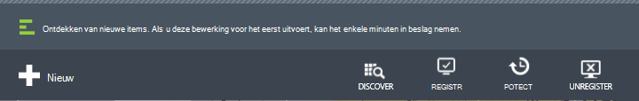
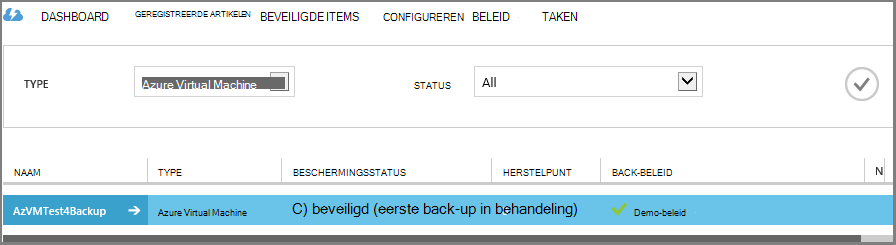

<properties
    pageTitle="Eerste uiterlijk: Azure VMs beschermen met een back-up kluis | Microsoft Azure"
    description="Azure VMs beveiligen met back-up kluis. Zelfstudie wordt uitgelegd kluis maken, VMs registreren en beleid maken VMs in Azure beschermen."
    services="backup"
    documentationCenter=""
    authors="markgalioto"
    manager="cfreeman"
    editor=""/>

<tags
    ms.service="backup"
    ms.workload="storage-backup-recovery"
    ms.tgt_pltfrm="na"
    ms.devlang="na"
    ms.topic="hero-article"
    ms.date="09/15/2016"
    ms.author="markgal; jimpark"/>

# Eerst wordt gezocht naar: back-ups van Azure virtual machines

> [AZURE.SELECTOR]
- [VMs beschermen met een kluis recovery services](backup-azure-vms-first-look-arm.md)
- [Azure VMs beschermen met een back-kluis](backup-azure-vms-first-look.md)

Deze zelfstudie gaat u door de stappen voor het maken van back-up een Azure VM (virtual machine) naar een back-up kluis in Azure. Dit artikel beschrijft het model Klassiek of Service Manager distributie model voor back-ups van VMs. Als u geïnteresseerd in een VM maken voor een kluis Recovery Services die deel uitmaakt van een resourcegroep bent, Zie [wordt eerst gezocht: VMs beschermen met een kluis recovery services](backup-azure-vms-first-look-arm.md). Om te kunnen voltooien van deze zelfstudie, moeten deze vereisten worden voldaan:

- U hebt een VM in Azure abonnement gemaakt.
- De VM heeft verbinding met Azure openbare IP-adressen. Zie [Netwerkverbindingen](./backup-azure-vms-prepare.md#network-connectivity)voor meer informatie.

Als u wilt een back-up een VM, zijn er vijf hoofdstappen:  

 een kluis back-up maken of een bestaande back-kluis te identificeren.  
 de klassieke Azure portal gebruiken om te detecteren en registreren van de virtuele machines.  
 de VM-Agent te installeren.  
 het beleid voor de bescherming van de virtuele machines maken.  
 de back-up uitvoert.

>[AZURE.NOTE] Azure heeft twee implementatiemodellen voor het maken en werken met resources: [Resource Manager en klassiek](../resource-manager-deployment-model.md). Deze handleiding is bedoeld voor gebruik met het VMs die kunnen worden gemaakt in de klassieke Azure portal. De back-up Azure service ondersteunt VMs op basis van een Resource Manager. Zie voor meer informatie over het VMs maken voor een kluis recovery services [eerste blik: VMs beschermen met een kluis recovery services](backup-azure-vms-first-look-arm.md).

## Stap 1: Maak een back-up kluis voor een VM

Een back-vault is een entiteit die de back-ups en herstel punten die zijn gemaakt na verloop van tijd worden opgeslagen. De back-kluis bevat ook de back-beleid dat wordt toegepast op de virtuele machines die back-up wordt gemaakt.

1. Log in om de [klassieke Azure portal](http://manage.windowsazure.com/).

2. Klik op **Nieuw** in de linkerbenedenhoek van de portal voor Azure

    

3. Klik in de wizard Snelle invoer **Van gegevens** > **Recovery Services** > **Back-up Vault** > **Snelle invoer**.

    

    De wizard wordt u gevraagd de **naam** en **de regio**. Als u meer dan één abonnement beheren, verschijnt er een dialoogvenster voor het kiezen van het abonnement.

4. Voer voor de **naam**een beschrijvende naam ter identificatie van de kluis. De naam moet uniek zijn voor het abonnement Azure.

5. Selecteer de regio voor de kluis in de **regio**. In hetzelfde gebied, als de virtuele machines die het voorkomt dat de kluis **moet** worden.

    Als u de regio waarin uw VM bestaat niet, sluit deze wizard en klik op **virtuele Machines** in de lijst met services op Azure. De kolom locatie bevat de naam van de regio. Hebt u virtuele machines in meerdere regio's, maakt u een back-up kluis in elke regio.

6. Als er geen dialoogvenster **abonnement** in de wizard, gaat u verder met de volgende stap. Als u met meerdere abonnementen werkt, selecteert u een abonnement wilt koppelen aan de nieuwe back-kluis.

    

7. Klik op de **kluis te maken**. Het kan even duren voor de kluis back-up moet worden gemaakt. Controleren van de statusmeldingen onderaan in de portal.

    

    Een bericht bevestigt dat de kluis heeft gemaakt. Dit wordt vermeld op de pagina **services herstellen** als **actief**.

    

8. Selecteer in de lijst van kluizen op **Recovery Services** pagina de kluis die u hebt gemaakt voor het starten van de pagina **Quick Start** .

    

9. Klik op de pagina **Quick Start** **configureren** om te openen de optie opslag replicatie.
    

10. De optie **opslag, replicatie** , kiest u de replicatieoptie voor uw kluis.

    

    Standaard heeft de kluis geo-redundante opslag. Geo-redundante opslag kiezen als dit uw primaire back-up. Kies lokaal redundante opslag als u wilt een goedkopere optie die niet helemaal zo duurzaam. Meer informatie over opties voor geo-redundante en lokaal redundante opslag in de [opslag van Azure replicatie-overzicht](../storage/storage-redundancy.md).

Nadat u de opslagoptie voor uw kluis, bent u gereed om de VM koppelen aan de kluis. Om te beginnen met de koppeling, ontdekken en registreer de Azure virtuele machines.

## Stap 2 - ontdekken en Azure registreren virtuele machines
Voordat u zich registreert de VM met een kluis, de discovery-proces voor elke nieuwe VMs worden uitgevoerd. Dit geeft een lijst van virtuele machines in het abonnement, samen met extra informatie, zoals de naam van de wolk en de regio.

1. Aanmelden bij de [klassieke Azure portal](http://manage.windowsazure.com/)

2. Klik in de klassieke Azure portal **Recovery Services** om de lijst van kluizen Recovery Services.
    

3. Selecteer in de lijst van kluizen, de kluis back-up een VM.

    Wanneer u uw kluis selecteert, wordt het geopend in de pagina **Quick Start**

4. Klik op **Items geregistreerd**in het menu kluis.

    

5. Selecteer in het menu **Type** **Azure Virtual Machine**.

    

6. Klik op **DISCOVER** onderaan de pagina.
    

    De discovery-proces duurt een paar minuten terwijl de tabelindeling van de virtuele machines. Er is een bericht onder aan het scherm waarin u zien kunt dat het proces wordt uitgevoerd.

    

    Wijzigingen in de berichtgevingsvoorkeuren als het proces is voltooid.

    

7. Klik op **REGISTREREN** onderaan de pagina.
    

8. Selecteer de virtuele machines die u wilt registreren in het snelmenu **Artikelen registreren** .

    >[AZURE.TIP] Meerdere virtuele machines kunnen in één keer worden geregistreerd.

    Er wordt een taak gemaakt voor elke virtuele machine die u hebt geselecteerd.

9. Klik op **Taak weergeven** in de kennisgeving naar de pagina **taken** .

    

    De virtuele machine wordt ook weergegeven in de lijst met geregistreerde artikelen, en de status van de bewerking van de registratie.

    

    Wanneer de bewerking is voltooid, de status verandert zodat de status *geregistreerd* .

    

## Stap 3: de VM-Agent installeren op de virtuele machine

De Azure VM-Agent moet worden geïnstalleerd op de Azure virtual machine voor de uitbreiding van de back-up om te werken. Als uw VM uit de galerie met Azure is gemaakt, is de VM-Agent al aanwezig op de VM. Aan de [bescherming van de VMs](backup-azure-vms-first-look.md#step-4-protect-azure-virtual-machines)kunt u overslaan.

Als uw VM migratie van een datacenter in gebouwen, de VM waarschijnlijk beschikt niet over de VM Agent is geïnstalleerd. U moet de VM-Agent installeren op de virtuele machine voordat u overgaat tot het beschermen van de VM. Zie voor gedetailleerde stappen voor het installeren van de Agent VM de [VM Agent sectie van het artikel VMs back-up](backup-azure-vms-prepare.md#vm-agent).

## Stap 4: het back-beleid maken
Voordat u de eerste back-uptaak activeren, het schema instellen als back-momentopnamen. De planning wanneer back-momentopnamen worden en hoe lang deze momentopnamen worden bewaard, is de back-beleid. De gegevens bewaren is gebaseerd op opa-vader-zoon back-schema.

1. Ga naar de back-kluis onder **Recovery Services** in de klassieke Azure portal en klikt u op **Items geregistreerd**.
2. **Azure Virtual Machine** selecteert in de vervolgkeuzelijst.

    

3. Klik op **beveiligen** onder aan de pagina.
    

    De **wizard Beveiliging van Items** wordt weergegeven en worden *alleen* virtuele machines die worden geregistreerd en niet beveiligd.

    

4. Selecteer de virtuele machines die u wilt beveiligen.

    Als er twee of meer virtuele machines met dezelfde naam, kunt u de Cloud-Service gebruiken onderscheid maken tussen de virtuele machines.

5. Selecteer een bestaand beleid of maak een nieuw beleid ter bescherming van de virtuele machines die u in het menu **Beveiliging configureren** .

    Nieuwe back-up kluizen hebben het standaardbeleid dat is gekoppeld aan de kluis. Dit beleid gaat dagelijks elke avond momentopname en dagelijkse momentopname is gedurende 30 dagen bewaard. Elke back-beleid kan meerdere virtuele machines gekoppeld hebben. De virtuele machine kan echter alleen zijn gekoppeld aan één beleid tegelijkertijd.

    

    >[AZURE.NOTE] Een back-up beleid omvat een stelsel bewaren voor de geplande back-ups. Als u een bestaande back-up beleid selecteert, kunt u zich niet wijzigen van de opties voor het behoud in de volgende stap.

6. Op **Bereik bewaren** de draagwijdte dagelijkse, wekelijkse, maandelijkse en jaarlijkse voor de specifieke punten van de back-up.

    

    Bewaarbeleid geeft de lengte van de tijd om een back-up op te slaan. U kunt verschillende bewaarbeleid op basis van wanneer de back-up wordt genomen.

7. Klik op **taken** om de lijst met taken **Configureren beveiliging** weer te geven.

    

    Nu u het beleid hebt gemaakt, gaat u naar de volgende stap en de eerste back-up uitvoeren.

## Stap 5 - eerste back-up

Als een virtuele machine met een beleid is beveiligd, kunt u die relatie bekijken op het tabblad **Items beveiligd** . Totdat de eerste back-up, geeft de **Status van bescherming** als **beveiligd - (in afwachting van de eerste back-up)**. De eerste geplande back-up is de *eerste back-up*.

De eerste back-up nu wilt starten:

1. Klik op **Nu back-up** onder aan de pagina op de pagina **Items beveiligd** .
    

    De Azure back-service maakt voor de eerste back-up een back-up.

2. Klik op het tabblad **taken** om de lijst met taken.

    

    Wanneer de eerste back-up is voltooid, wordt de status van de virtuele machine op het tabblad **Beveiligde Items** *beveiligd*.

    

    >[AZURE.NOTE] Back-ups maken van virtuele machines is een lokaal proces. U kan niet back-up van virtuele machines van de ene regio naar een kluis back-up in een ander gebied. Voor elke Azure regio met VMs die u back wilt-up worden gemaakt, moet ten minste één back-kluis dus worden gemaakt in die regio.

## Volgende stappen
Nu dat u een reservekopie hebt gemaakt van een VM, zijn er verschillende Vervolgstappen die van belang kunnen zijn. De meest logische stap is vertrouwd raken met het terugzetten van gegevens naar een VM. Er zijn echter de beheertaken die u inzicht in uw gegevens veilig te houden en de kosten te minimaliseren.

- [Beheren en controleren van uw virtuele machines](backup-azure-manage-vms.md)
- [Herstellen van virtuele machines](backup-azure-restore-vms.md)
- [Richtlijnen voor het oplossen van problemen](backup-azure-vms-troubleshoot.md)

## Heb je vragen?
Als u vragen hebt of als er een functie die u zou willen zien opgenomen, [feedback verzenden](http://aka.ms/azurebackup_feedback).
