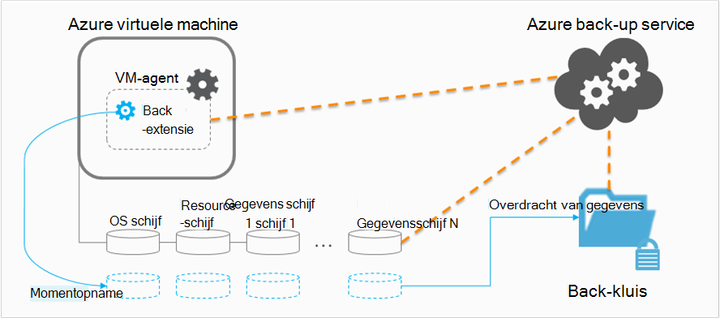

<properties
    pageTitle="Planning van de back-upinfrastructuur van uw VM in Azure | Microsoft Azure"
    description="Belangrijke overwegingen bij het plannen van back-up van virtuele machines in Azure"
    services="backup"
    documentationCenter=""
    authors="markgalioto"
    manager="cfreeman"
    editor=""
    keywords="back-up van vms, back-up van virtuele machines"/>

<tags
    ms.service="backup"
    ms.workload="storage-backup-recovery"
    ms.tgt_pltfrm="na"
    ms.devlang="na"
    ms.topic="article"
    ms.date="10/19/2016"
    ms.author="trinadhk; jimpark; markgal;"/>

# <a name="plan-your-vm-backup-infrastructure-in-azure"></a>Plan uw back-upinfrastructuur VM in Azure
Dit artikel biedt prestaties en suggesties zodat u de back-upinfrastructuur van uw VM resource. Definieert ook belangrijke aspecten van de back-up-service; deze aspecten is essentieel bij het bepalen van uw architectuur, capaciteitsplanning en planning. Als u [uw omgeving voorbereid](backup-azure-vms-prepare.md)hebt, is dit de volgende stap voordat u [back-up van VMs](backup-azure-vms.md). Als u meer weten over Azure virtuele machines wilt, Zie de [documentatie van de virtuele Machines](https://azure.microsoft.com/documentation/services/virtual-machines/).

## <a name="how-does-azure-back-up-virtual-machines"></a>Hoe doet Azure van virtuele machines maken?
Wanneer de Azure back-service een back-uptaak op het geplande tijdstip initieert, wordt de back-extensie om een point-in-time momentopname. Deze momentopname wordt genomen in overleg met de Volume Shadow Copy Service (VSS) om een consistente momentopname van de schijven in de virtuele machine zonder af te sluiten.

Nadat de momentopname is gemaakt, worden de gegevens overgebracht door de Azure back-service om de back-up. Als u het back-upproces efficiënter, de service identificeert en blokken gegevens die zijn gewijzigd sinds de laatste back-up worden overgebracht.



Als de gegevensoverdracht voltooid is, de momentopname wordt verwijderd en een herstelpunt is gemaakt.

### <a name="data-consistency"></a>Consistentie van de gegevens
Back-ups maken en terugzetten business kritieke gegevens wordt bemoeilijkt door het feit dat bedrijfskritieke gegevens terwijl de toepassingen die leiden de gegevens tot moeten worden gestaafd worden uitgevoerd. Om dit op te lossen, biedt Azure back-up toepassing consistent back-ups voor Microsoft werkbelasting met behulp van VSS om ervoor te zorgen dat gegevens correct naar de opslag geschreven.

>[AZURE.NOTE] Voor Linux virtuele machines zijn alleen bestand consistent back-ups mogelijk omdat Linux beschikt niet over een gelijkwaardig platform VSS.

Volledige back-ups van VSS neemt Azure back-up Windows VMs (Lees meer over [VSS volledige back-up](http://blogs.technet.com/b/filecab/archive/2008/05/21/what-is-the-difference-between-vss-full-backup-and-vss-copy-backup-in-windows-server-2008.aspx)). Inschakelen van VSS, back-ups, het onder register sleutel moet worden ingesteld op de VM.

```
[HKEY_LOCAL_MACHINE\SOFTWARE\MICROSOFT\BCDRAGENT]
"USEVSSCOPYBACKUP"="TRUE"
```


Deze tabel bevat informatie over de typen van de samenhang en de voorwaarden die zij onder tijdens Azure VM back-up- en herstelprocedures.

| Consistentie | Op basis van VSS | Details en uitleg |
|-------------|-----------|---------|
| Consistentie van toepassing | Ja | Dit is de ideale consistentie type voor Microsoft werklasten zorgt ervoor dat:<ol><li> De VM *wordt opgestart*. <li>Er is *geen beschadiging*. <li>Er is *geen gegevens verloren gaan*.<li> De gegevens is in overeenstemming met de toepassing die gebruikmaakt van de gegevens met betrekking tot de toepassing op het tijdstip van de back-up--met VSS</ol> De meeste Microsoft werklasten hebben VSS-schrijvers doen werkbelasting specifieke acties met betrekking tot de consistentie van de gegevens. Microsoft SQL Server heeft bijvoorbeeld een VSS-schrijver die ervoor zorgt dat het schrijven naar de database en het transactielogboek correct zijn uitgevoerd.<br><br> Voor Azure VM betekent back-ups ophalen van een herstelpunt consistente toepassing dat de uitbreiding van de back-up kon de VSS-workflow aanroepen en *correct* voltooid voordat de VM-momentopname is gemaakt. Dit betekent natuurlijk dat de VSS-schrijvers van de toepassingen in Azure VM ook aangeroepen.<br><br>(Meer informatie over de [Basisbeginselen van VSS](http://blogs.technet.com/b/josebda/archive/2007/10/10/the-basics-of-the-volume-shadow-copy-service-vss.aspx) en duik diep in de details van [hoe het werkt](https://technet.microsoft.com/library/cc785914%28v=ws.10%29.aspx)). |
| De consistentie van het bestandssysteem | Ja - voor Windows-computers | Er zijn twee scenario's waarbij het herstelpunt *bestandssysteem consistent*kan zijn:<ul><li>Back-ups van Linux VMs in Azure, aangezien Linux beschikt niet over een gelijkwaardig platform VSS.<li>VSS-fout tijdens het back-up voor Windows VMs in Azure.</li></ul> In beide gevallen is de beste die kan worden uitgevoerd om ervoor te zorgen dat: <ol><li> De VM *wordt opgestart*. <li>Er is *geen beschadiging*.<li>Er is *geen gegevens verloren gaan*.</ol> Toepassingen moeten hun eigen mechanisme "fix-up" van de teruggezette gegevens implementeren.|
| Crashbestendigheid | Nee | Deze situatie is gelijk aan een virtuele machine met een 'crash' (door middel van hetzij een zachte of harde reset). Dit gebeurt meestal wanneer de Azure virtuele machine wordt afgesloten op het moment van back-up. Voor Azure VM back-ups kunt geen garanties rond de consistentie van de gegevens aan een consistente crash herstel punt middelen die Azure back-up op het opslagmedium--vanuit het perspectief van het besturingssysteem of vanuit het perspectief van de toepassing. Alleen gegevens die al op de schijf op het moment van back-up is wat wordt vastgelegd en een back-up. <br/> <br/> Er zijn geen garanties, in de meeste gevallen zal het besturingssysteem opstarten. Dit wordt meestal gevolgd door Schijfcontrole-procedure, zoals chkdsk, om eventuele Beschadigingsfouten te herstellen. De gegevens in het geheugen of schrijft die niet volledig naar de schijf leeggemaakt niet verloren. De toepassing bestaat doorgaans uit met een eigen mechanisme voor controle als terugdraaien van de gegevens moet worden gedaan. <br><br>Als u bijvoorbeeld als het transactielogboek voor posten die niet aanwezig in de database zijn, wordt de databasesoftware een rollback totdat de gegevens consistent zijn. Wanneer gegevens verspreid over meerdere virtuele schijven (net als bij spanned volumes), biedt een consistente crash herstelpunt geen garanties voor de juistheid van de gegevens.|


## <a name="performance-and-resource-utilization"></a>Prestaties en resource-gebruik
Als back-up software die is geïmplementeerd in lokalen, moet u plannen voor de capaciteit en het Resourcegebruik behoeften back-ups van VMs in Azure. De [opslaglimiet voor Azure](azure-subscription-service-limits.md#storage-limits) definiëren VM implementaties voor maximale prestaties met minimale overlast voor de werkbelasting met structuur.

Aandacht besteden aan de volgende grenswaarden voor Azure opslag bij het plannen van back-upprestaties:

- Max egress per account opslag
- Aanvraag voor totaalbedrag tarief per account opslag

### <a name="storage-account-limits"></a>Limieten van opslag
Telkens wanneer gegevens back-up van een account voor de opslag wordt gekopieerd, telt het tegen de invoer/uitvoer-bewerkingen per seconde (IOP's) en egress (of doorvoer) maatstaven van de opslag-account. Terzelfder tijd, de virtuele machines uitgevoerd en verbruikt IOP's en de doorvoer. Het doel is om ervoor te zorgen dat het totale verkeer - back-up en de virtuele machine - niet hoger zijn dan de limieten van opslag.

### <a name="number-of-disks"></a>Aantal schijven
Het back-upproces probeert zo snel mogelijk een back-uptaak voltooid. Hierdoor verbruikt het zoveel bronnen geplaatst. Alle i/o-bewerkingen zijn echter beperkt door de *Doorvoer van het doel voor één Blob*heeft een maximum van 60 MB per seconde. In een poging om de snelheid maximaliseren, probeert het back-upproces back-up van van de VM schijven *parallel*. Dus als een VM vier schijven heeft, probeert Azure back-up vervolgens op back-up van alle vier schijven parallel. Dat de belangrijkste factor back-verkeer een klantrekening opslag te verlaten om te bepalen is het **aantal schijven** back-up gemaakt van de account van de opslag.

### <a name="backup-schedule"></a>Back-upschema
Een bijkomende factor die van invloed op prestaties is de **back-upschema**. Als u het beleid configureren zodat alle VMs zijn een back-up op hetzelfde moment, kunt u een vastgelopen verkeer hebt gepland. Het back-upproces wilt back-up van alle schijven tegelijkertijd. Kunt u het back-verkeer beperken vanuit een account opslag - zorgen dat verschillende VMs zijn een back-up op verschillende tijdstippen van de dag, met elkaar niet overlappen.

## <a name="capacity-planning"></a>Capaciteitsplanning
Het samenstellen van al deze factoren betekent dat gebruik van opslag-account moet goed worden gepland. Download de [VM back-upcapaciteit planning Excel-werkblad](https://gallery.technet.microsoft.com/Azure-Backup-Storage-a46d7e33) om de impact van de schijf en een back-upschema keuzes.

### <a name="backup-throughput"></a>Back-doorvoer
Voor elke schijf een back-wordt gemaakt, back-Azure leest de blokken op de schijf en slaat alleen de gewijzigde gegevens (incrementele back-up). Deze tabel geeft de gemiddelde doorvoer-waarden die u van Azure back-up verwachten kunt. Met deze, kunt u de hoeveelheid tijd die nodig is om een back-up een schijf van een bepaalde grootte schatten.

| Back-upbewerking | Best mogelijke doorvoer |
| ---------------- | ---------- |
| Eerste back-up | 160 Mbps |
| Incrementele back-up (DR) | 640 Mbps <br><br> Deze doorvoer kan aanzienlijk afnemen als er een groot aantal verspreide lospeuteren op de schijf die u wilt back-up worden gemaakt. |

## <a name="total-vm-backup-time"></a>Totale tijd voor VM-back-up
Een meerderheid van de back-up tijd wordt besteed aan lezen en kopiëren van gegevens, maar er zijn andere activiteiten die aan de totale tijd die nodig is bijdragen voor back-up van een VM:

- De tijd die nodig is voor het [installeren of bijwerken van de back-extensie](backup-azure-vms.md#offline-vms).
- Snapshot-tijd is de tijd genomen voor het starten van een momentopname. Momentopnamen zijn dicht bij de geplande back-up tijd geactiveerd.
- Wachttijd. Omdat de service back-up back-ups van meerdere klanten verwerkt, back-upgegevens van momentopname kopiëren naar de back-up of kluis Recovery Services niet onmiddellijk wordt gestart. Laden in tijden van de piek, de wacht kunt uitrekken tot 8 uur als gevolg van het aantal back-ups wordt verwerkt. De totaaltijd VM zijn echter minder dan 24 uur per dag back-beleid.

## <a name="best-practices"></a>Best Practices
Het is raadzaam na deze praktijken bij het configureren van back-ups voor virtuele machines:

- Niet meer dan vier klassieke VMs uit dezelfde service cloud back-up maken op hetzelfde moment plannen. Wij stellen voor spreiding begintijden back-up een uur als u wilt back-up van meerdere VMs uit dezelfde cloud-service.
- Niet meer dan 40 bronnenbeheerder geïmplementeerd VMs back-up maken op hetzelfde moment plant.
- VM back-ups plannen tijdens daluren zodat de back-up service IOP's gebruikt voor het overbrengen van gegevens naar de back-up van de klantrekening opslag of Recovery Services kluis.
- Zorg ervoor dat een beleid verspreid over verschillende opslag accounts VMs adressen. Wij stellen niet meer dan 20 diskettes nodig van een opslag voor één account worden beschermd door een beleid. Als er meer dan 20 schijven in een opslag-account, verdeeld over de VMs meerdere beleidsinstellingen opvragen van de vereiste IOP's tijdens de fase van de overdracht van het back-upproces.
- Een VM uitgevoerd dezelfde account voor opslag op de premie opslag niet terugzetten. Als de bewerking restore proces valt met de back-upbewerking samen, vermindert de beschikbare IOP's voor back-up.
- Wij raden u aan elke VM Premium uitgevoerd op een afzonderlijke premium opslag rekening om te zorgen voor optimale prestaties van de back-up.

## <a name="data-encryption"></a>Gegevenscodering

Azure back-up wordt niet gecodeerd gegevens als onderdeel van het back-upproces. Echter voor het coderen van gegevens binnen de VM en back-up van de beveiligde gegevens naadloos (meer informatie over [back-up van gecodeerde gegevens](backup-azure-vms-encryption.md)).


## <a name="how-are-protected-instances-calculated"></a>Hoe kan ik beveiligde exemplaren berekend?
Azure virtuele machines die zijn een back-up via Azure back-up zijn [back-up Azure prijzen](https://azure.microsoft.com/pricing/details/backup/). De beveiligde exemplaren berekening is gebaseerd op de *werkelijke* grootte van de virtuele machine, de som van alle gegevens in de virtuele machine is, met uitzondering van de schijf"bron".

U bent *niet* in rekening gebracht op basis van de maximale grootte die voor elke gegevensschijf is gekoppeld aan de virtuele machine wordt ondersteund, maar op de werkelijke gegevens in de gegevensschijf. Ook is de back-up opslaan wissel gebaseerd op de hoeveelheid gegevens die zijn opgeslagen met Azure back-up, dat is de som van de werkelijke gegevens in elk herstelpunt.

Bijvoorbeeld, nemen een standaard A2-formaat virtuele machine met twee extra gegevensschijven met een maximale grootte van 1 TB. Onderstaande tabel geeft de werkelijke gegevens op elk van deze schijven:

|Schijftype|Maximale grootte|Werkelijke gegevens aanwezig|
|---------|--------|------|
| Besturingssysteem schijf | 1023 GB | 17 GB |
| Lokale schijf / schijf Resource | 135 GB | 5 GB (niet meegeleverd voor back-up) |
| Gegevens-cd 1 | 1023 GB | 30 GB |
| Gegevens diskette 2 | 1023 GB | 0 GB |

De *werkelijke* grootte van de virtuele machine is in dit geval 17 GB + 30 GB + 0 GB = 47 GB. Dit wordt de beveiligd exemplaar van maandelijkse factuur op basis van grootte. Naarmate de hoeveelheid gegevens in de virtuele machine groeit, wordt het exemplaar beschermde formaat gebruikt voor de facturering van ook aangepast.

Facturering start pas als de eerste geslaagde back-up is voltooid. Op dit moment begint de facturering van de opslag- en beveiligde exemplaren. Facturering blijft zolang de *back-up gegevens die zijn opgeslagen met Azure back-up* voor de virtuele machine. De bewerking beveiliging stoppen stopt niet de facturering of de gegevens van de back-up is opgeslagen.

De facturering voor een opgegeven virtuele machine wordt stopgezet slechts als de beveiliging gestopt *en is* alle gegevens van de back-up is verwijderd. Als er geen actieve back-uptaken (wanneer deze bescherming is gestopt), verandert de grootte van de virtuele machine op het moment van de laatste geslaagde back-up de beveiligd exemplaar van maandelijkse factuur op basis van grootte.

## <a name="questions"></a>Heb je vragen?
Als u vragen hebt of als er een functie die u zou willen zien opgenomen, [feedback verzenden](http://aka.ms/azurebackup_feedback).

## <a name="next-steps"></a>Volgende stappen

- [Back-up van virtuele machines](backup-azure-vms.md)
- [Virtuele machine back-up beheren](backup-azure-manage-vms.md)
- [Herstellen van virtuele machines](backup-azure-restore-vms.md)
- [Problemen met VM back-up](backup-azure-vms-troubleshoot.md)
