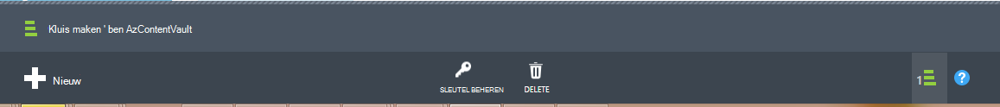

<properties
    pageTitle="Voorbereiden van uw omgeving om back-up van Azure virtual machines | Microsoft Azure"
    description="Zorg ervoor dat uw omgeving is voorbereid voor back-ups van virtuele machines in Azure"
    services="backup"
    documentationCenter=""
    authors="markgalioto"
    manager="cfreeman"
    editor=""
    keywords="back-ups; back-up;"/>

<tags
    ms.service="backup"
    ms.workload="storage-backup-recovery"
    ms.tgt_pltfrm="na"
    ms.devlang="na"
    ms.topic="article"
    ms.date="08/26/2016"
    ms.author="trinadhk; jimpark; markgal;"/>


# <a name="prepare-your-environment-to-back-up-azure-virtual-machines"></a>Voorbereiden van uw omgeving om back-up van Azure virtual machines

> [AZURE.SELECTOR]
- [Model van resource manager](backup-azure-arm-vms-prepare.md)
- [Klassiek model](backup-azure-vms-prepare.md)

Voordat u back-up een Azure VM (virtual machine), zijn er drie voorwaarden moeten bestaan.

- U moet een back-up kluis maken of een bestaande back-kluis *in hetzelfde gebied, als uw VM*identificeren.
- Geen netwerkverbinding tussen de openbare Internet-adressen Azure en de eindpunten Azure opslag.
- De VM-agent installeren op de VM.

Als u weet dat deze voorwaarden al aanwezig zijn in uw omgeving gaat u verder met de [Back-up van uw artikel VMs](backup-azure-vms.md). Anders zal lezen op, in dit artikel leiden u door de stappen voor het voorbereiden van uw back-up een VM Azure-omgeving.


## <a name="limitations-when-backing-up-and-restoring-a-vm"></a>Beperkingen bij de back-up en terugzetten van een VM

>[AZURE.NOTE] Azure heeft twee implementatiemodellen voor het maken en werken met resources: [Resource Manager en klassiek](../resource-manager-deployment-model.md). De volgende lijst bevat de beperkingen bij de implementatie in het klassieke model.

- Back-ups maken van virtuele machines met meer dan 16 data schijven wordt niet ondersteund.
- Back-ups maken van virtuele machines met een gereserveerd IP-adres en geen gedefinieerde eindpunt wordt niet ondersteund.
- Back-upgegevens bevat geen gekoppelde netwerkstations gekoppeld aan VM. 
- Vervangen van een bestaande virtuele machine tijdens het terugzetten wordt niet ondersteund. Verwijder eerst de bestaande virtuele machine en alle gekoppelde schijven en vervolgens de gegevens terugzetten vanaf de back-up.
- Cross-regio back-up en terugzetten wordt niet ondersteund.
- Back-ups maken van virtuele machines met behulp van de back-up Azure service wordt ondersteund in alle openbare gebieden van Azure (Zie de [Controlelijst](https://azure.microsoft.com/regions/#services) van ondersteunde regio's). Als het gebied dat u zoekt niet-ondersteunde vandaag, deze niet in de vervolgkeuzelijst bij het maken van de kluis.
- Back-ups maken van virtuele machines met behulp van de back-up Azure service wordt alleen ondersteund voor versies van besturingssystemen selecteren:
  - **Linux**: Azure Backup biedt ondersteuning voor [een lijst met distributies die door Azure worden geviseerd](../virtual-machines/virtual-machines-linux-endorsed-distros.md) , met uitzondering van Core OS Linux. Andere plaatsen-uw-eigen-Linux-distributies kunnen ook werken als de agent VM beschikbaar op de virtuele machine is en ondersteuning voor Python bestaat.
  - **Windows Server**: versies ouder dan Windows Server 2008 R2 worden niet ondersteund.
- Herstellen van een domeincontroller wordt (DC) VM die deel uitmaakt van een configuratie met meerdere DC uitsluitend ondersteund via PowerShell. Meer informatie over het [herstellen van een domeincontroller multi-DC](backup-azure-restore-vms.md#restoring-domain-controller-vms).
- Virtuele machines met de volgende speciale netwerkconfiguraties terugzetten wordt uitsluitend ondersteund via PowerShell. VMs die u maakt met behulp van de werkstroom terugzetten in de gebruikersinterface geen deze netwerkconfiguraties nadat de bewerking voor terugzetten voltooid is. Voor meer informatie, Zie [VMs herstellen met speciale netwerkconfiguraties](backup-azure-restore-vms.md#restoring-vms-with-special-netwrok-configurations).
    - Virtuele machines onder load balancer-configuratie (intern en extern)
    - Virtuele machines met meerdere gereserveerde IP-adressen
    - Virtuele machines met meerdere netwerkadapters

## <a name="create-a-backup-vault-for-a-vm"></a>Maak een back-up kluis voor een VM

Een back-vault is een entiteit die de back-ups en herstel punten die zijn gemaakt na verloop van tijd worden opgeslagen. De back-kluis bevat ook de back-beleid dat wordt toegepast op de virtuele machines die back-up wordt gemaakt.

Deze afbeelding ziet u de relaties tussen de verschillende entiteiten van Azure back-up:     

Voor het maken van een back-up kluis:

1. Log in om de [Azure portal](http://manage.windowsazure.com/).

2. Klik op **Nieuw**in Azure portal > **Integratie van hybride** > **back-up**. Wanneer u een **back-up**klikt, zal het automatisch overschakelen naar de klassieke portal (na de opmerking wordt weergegeven).

    

    >[AZURE.NOTE] Als u uw abonnement op het laatst is gebruikt in de klassieke portal, kan uw abonnement openen in de klassieke portal. In dit geval om een kluis back-up hebt gemaakt, klikt u op **Nieuw** > **Data Services** > **Recovery Services** > **Kluis back-** > **Snelle maken** (Zie de onderstaande afbeelding).

    

3. Voer voor de **naam**een beschrijvende naam ter identificatie van de kluis. De naam moet uniek zijn voor het abonnement Azure. Typ een naam die tussen 2 en 50 tekens bevat. Het moet beginnen met een letter en mag alleen letters, cijfers en streepjes.

4. Selecteer de regio voor de kluis in de **regio**. De kluis moet zich in hetzelfde gebied, als de virtuele machines die u wilt beveiligen. Als u virtuele machines in meerdere regio's, moet u een back-up kluis in elke regio. Er is niet nodig opslag om rekeningen te geven voor het opslaan van de back-upgegevens--de back-kluis en de greep met Azure back-service dit automatisch.

5. Selecteer het abonnement dat u wilt koppelen aan de back-kluis in **abonnement** . Zullen er meerdere opties als uw organisatie-account gekoppeld aan meerdere Azure abonnementen is.

6. Klik op de **kluis te maken**. Het kan even duren voor de kluis back-up moet worden gemaakt. Controleren van de statusmeldingen onderaan in de portal.

    

7. Een bericht bevestigt dat de kluis is gemaakt. Deze wordt vermeld op de pagina **services herstellen** als **actief**. Zorg dat u de juiste opslag redundantie optie rechts nadat de kluis is gemaakt. Meer informatie over het [instellen van de optie opslag redundantie in de back-kluis](backup-configure-vault.md#azure-backup---storage-redundancy-options).

    

8. Klik op de back-kluis naar de pagina **Quick Start** waarin de instructies voor de back-ups van Azure virtuele machines worden weergegeven.

    


## <a name="network-connectivity"></a>Verbinding met het netwerk

Om het beheren van de VM-snapshots, moet de extensie back-verbinding met de Azure openbare IP-adressen. Zonder het juiste Internet-verbinding time-out van de virtuele machine van HTTP-aanvragen en de back-upbewerking is mislukt. Als uw implementatie heeft toegangsbeperkingen (via een netwerk security group (NSG), voor het voorbeeld), kiest u een van deze opties voor het leveren van een duidelijk pad voor back-verkeer:

- ["Witte" lijst de Azure datacenter IP ranges](http://www.microsoft.com/en-us/download/details.aspx?id=41653) - Zie het artikel voor instructies over hoe te "witte" lijst de IP-adressen.
- Implementeren van een HTTP-proxyserver voor het routeren van verkeer.

Bij het bepalen van welke optie u moet gebruiken, zijn de e-mailverkeer tussen de beheersbaarheid, granulaire controle en kosten.

|Optie|Voordelen|Nadelen|
|------|----------|-------------|
|Whitelist IP-bereiken| Geen extra kosten.<br><br>Voor access te openen in een NSG, gebruikt u de cmdlet <i>Set-AzureNetworkSecurityRule</i> . | Complex om te beheren als het risico IP-bereiken veranderen.<br><br>Biedt toegang tot het geheel van Azure en niet alleen opslag.|
|HTTP-proxy| Detail te beheren in de proxy de opslag URL's toegestaan.<br>Eén punt van internettoegang tot VMs.<br>Niet onderworpen zijn aan wijzigingen van Azure IP-adres.| Extra kosten voor het uitvoeren van een VM met de proxysoftware.|

### <a name="whitelist-the-azure-datacenter-ip-ranges"></a>"Witte" lijst de Azure datacenter IP-bereiken

Aan de "witte" lijst vindt de Azure datacenter IP-adresbereiken u de [Azure-website](http://www.microsoft.com/en-us/download/details.aspx?id=41653) voor meer informatie over de IP-bereiken en instructies.

### <a name="using-an-http-proxy-for-vm-backups"></a>Met behulp van een HTTP-proxy voor VM back-ups
Bij het maken van back-up een VM, verzendt de back-extensie op de VM opdrachten voor het beheer van de momentopname naar Azure opslag met behulp van een HTTPS-API. Route de uitbreiding back-verkeer via de HTTP-proxy, omdat dit het enige onderdeel dat is geconfigureerd voor toegang tot het openbare Internet.

>[AZURE.NOTE] Er is geen aanbeveling voor de proxysoftware die moet worden gebruikt. Zorg ervoor dat u een proxy die compatibel is met de van onderstaande configuratiestappen kiezen.

Het van de voorbeeldafbeelding hieronder ziet u de met drie configuratiestappen nodig voor het gebruik van een HTTP-proxy:

- App VM routeert alle HTTP-verkeer voor het openbare Internet via een Proxy-VM.
- VM-proxy kunt binnenkomend verkeer van VMs in het virtuele netwerk.
- De netwerk Security Group (NSG) met de naam NSF lockdown moet een beveiliging regel zodat uitgaande internetverkeer van Proxy-VM.


Voor het gebruik van een HTTP-proxy te communiceren met het openbare Internet als volgt te werk:

#### <a name="step-1-configure-outgoing-network-connections"></a>Stap 1. Uitgaande verbindingen configureren
###### <a name="for-windows-machines"></a>Voor Windows-computers
Hierdoor wordt setup configuratie van de proxyserver voor lokale systeemaccount.

1. [Gg.bat](https://technet.microsoft.com/sysinternals/bb897553) downloaden
2. Voer de volgende opdracht uit met verhoogde bevoegdheid om

     ```
     psexec -i -s "c:\Program Files\Internet Explorer\iexplore.exe"
     ```
     Internet explorer-venster wordt geopend.
3. Ga naar Extra -> Internet-opties -> verbindingen -> LAN-instellingen.
4. Controleer of de proxy-instellingen voor de account System. Proxy IP-adres en poort instellen.
5. Sluit Internet Explorer.

Dit zal een proxyconfiguratie voor alle computers instellen en wordt gebruikt voor alle uitgaande HTTP/HTTPS-verkeer.

Als u hebt een proxy-server ingesteld op de huidige gebruikersaccount (niet een lokale systeemaccount), gebruikt u het volgende script toepassen op SYSTEMACCOUNT:

```
   $obj = Get-ItemProperty -Path Registry::”HKEY_CURRENT_USER\Software\Microsoft\Windows\CurrentVersion\Internet Settings\Connections"
   Set-ItemProperty -Path Registry::”HKEY_USERS\S-1-5-18\Software\Microsoft\Windows\CurrentVersion\Internet Settings\Connections" -Name DefaultConnectionSettings -Value $obj.DefaultConnectionSettings
   Set-ItemProperty -Path Registry::”HKEY_USERS\S-1-5-18\Software\Microsoft\Windows\CurrentVersion\Internet Settings\Connections" -Name SavedLegacySettings -Value $obj.SavedLegacySettings
   $obj = Get-ItemProperty -Path Registry::”HKEY_CURRENT_USER\Software\Microsoft\Windows\CurrentVersion\Internet Settings"
   Set-ItemProperty -Path Registry::”HKEY_USERS\S-1-5-18\Software\Microsoft\Windows\CurrentVersion\Internet Settings" -Name ProxyEnable -Value $obj.ProxyEnable
   Set-ItemProperty -Path Registry::”HKEY_USERS\S-1-5-18\Software\Microsoft\Windows\CurrentVersion\Internet Settings" -Name Proxyserver -Value $obj.Proxyserver
```

>[AZURE.NOTE] Als u '(407) proxyverificatie vereist' in het logboek voor proxy server ziet, controleert u dat de authrntication juist is geconfigureerd.

######<a name="for-linux-machines"></a>Voor Linux-machines

Voeg de volgende regel aan de ```/etc/environment``` bestand:

```
http_proxy=http://<proxy IP>:<proxy port>
```

Voeg de volgende regels aan de ```/etc/waagent.conf``` bestand:

```
HttpProxy.Host=<proxy IP>
HttpProxy.Port=<proxy port>
```

#### <a name="step-2-allow-incoming-connections-on-the-proxy-server"></a>Stap 2. Binnenkomende verbindingen toestaan op de proxy-server:

1. Open Windows Firewall op de proxyserver. De eenvoudigste manier om toegang tot de firewall is om te zoeken naar Windows Firewall met geavanceerde beveiliging.

    

2. Klik in het dialoogvenster Windows Firewall met de rechtermuisknop op **Binnenkomende regels** en klik op **Nieuwe regel...**.

    

3. In de **Inkomende Wizard nieuwe regel voor**, kiest u de optie **aangepast** voor het **Type regel** en klikt u op **volgende**.

4. **Alle programma's** en klik op **volgende**op de pagina om het **programma**te selecteren.

5. Voer de volgende gegevens op de pagina **protocollen en poorten** en klik op **volgende**:

    

    - Kies voor het *protocoltype* *TCP*
    - Kies *lokale poort* in *Specifieke poorten*, Geef in het onderstaande veld de ```<Proxy Port>``` die is geconfigureerd.
    - Selecteer *Alle poorten* voor *externe poort*

    Voor de rest van de wizard, klikt u op naar het eind en deze regel een naam geven.

#### <a name="step-3-add-an-exception-rule-to-the-nsg"></a>Stap 3. Een uitzonderingsregel toevoegen aan de NSG:

In de Azure PowerShell-prompt, typ de volgende opdracht:

De volgende opdracht wordt een uitzondering op de NSG. Deze uitzondering kan de TCP-verkeer van een willekeurige poort op de 10.0.0.5 aan een internetadres op poort 80 (HTTP) of 443 (HTTPS). Als u een specifieke poort in het openbare Internet vereist, moet u die poort wilt toevoegen de ```-DestinationPortRange``` ook.

```
Get-AzureNetworkSecurityGroup -Name "NSG-lockdown" |
Set-AzureNetworkSecurityRule -Name "allow-proxy " -Action Allow -Protocol TCP -Type Outbound -Priority 200 -SourceAddressPrefix "10.0.0.5/32" -SourcePortRange "*" -DestinationAddressPrefix Internet -DestinationPortRange "80-443"
```

*Zorg ervoor dat u de namen in het voorbeeld door de gegevens voor uw implementatie vervangen.*


## <a name="vm-agent"></a>VM-agent

Voordat u back-up de Azure virtuele machine, moet u ervoor zorgen dat de agent Azure VM juist is geïnstalleerd op de virtuele machine. Aangezien de VM-agent een optioneel onderdeel op het moment dat de virtuele machine wordt gemaakt is, moet u ervoor zorgen dat het selectievakje voor de VM-agent is ingeschakeld voordat de virtuele machine is ingericht.

### <a name="manual-installation-and-update"></a>Handmatige installatie en update

De VM-agent is al aanwezig in VMs die zijn gemaakt vanuit de galerie met Azure. Virtuele machines die worden gemigreerd van datacenters voor gebouwen moet echter niet de VM agent is geïnstalleerd. Voor dergelijke VMs moet de agent VM expliciet worden geïnstalleerd. Meer informatie over het [installeren van de agent van de VM op een bestaande VM](http://blogs.msdn.com/b/mast/archive/2014/04/08/install-the-vm-agent-on-an-existing-azure-vm.aspx).

| **Bewerking** | **Windows** | **Linux** |
| --- | --- | --- |
| De VM-agent installeren | <li>Download en installeer de [agent MSI](http://go.microsoft.com/fwlink/?LinkID=394789&clcid=0x409). U moet Administrator-bevoegdheden om de installatie te voltooien. <li>[De eigenschap VM bijwerken](http://blogs.msdn.com/b/mast/archive/2014/04/08/install-the-vm-agent-on-an-existing-azure-vm.aspx) om aan te geven dat de agent is geïnstalleerd. | <li> Installeer de meest recente [Linux agent](https://github.com/Azure/WALinuxAgent) van GitHub. U moet Administrator-bevoegdheden om de installatie te voltooien. <li> [De eigenschap VM bijwerken](http://blogs.msdn.com/b/mast/archive/2014/04/08/install-the-vm-agent-on-an-existing-azure-vm.aspx) om aan te geven dat de agent is geïnstalleerd. |
| De agent VM bijwerken | Bijwerken van de VM-agent is net zo eenvoudig als de [binaire bestanden voor VM-agent](http://go.microsoft.com/fwlink/?LinkID=394789&clcid=0x409)opnieuw te installeren. <br><br>Zorg ervoor dat er geen back-up wordt uitgevoerd terwijl de VM-agent wordt bijgewerkt. | Volg de instructies over het [bijwerken van de agent Linux VM ](../virtual-machines-linux-update-agent.md). <br><br>Zorg ervoor dat er geen back-up wordt uitgevoerd terwijl de VM-agent wordt bijgewerkt. |
| De agent VM installatie valideren | <li>Ga naar de map *C:\WindowsAzure\Packages* in Azure VM. <li>U moet het bestand WaAppAgent.exe aanwezig.<li> Klik met de rechtermuisknop op het bestand, Ga naar **Eigenschappen**en selecteer vervolgens het tabblad **Details** . Het veld versie van het Product dient te worden 2.6.1198.718 of hoger. | N.V.T. |


Meer informatie over de [VM-agent](https://go.microsoft.com/fwLink/?LinkID=390493&clcid=0x409) en [hoe u deze installeert](https://azure.microsoft.com/blog/2014/04/15/vm-agent-and-extensions-part-2/).

### <a name="backup-extension"></a>Back-extensie

Als u wilt back-up van de virtuele machine, installeert de Azure back-up-service een uitbreiding naar de VM-agent. De Azure back-service werkt naadloos en de back-uitbreiding zonder tussenkomst van de gebruiker extra patches.

De back-extensie is geïnstalleerd als de VM wordt uitgevoerd. Een actieve VM biedt ook de grootste kans om een consistente toepassing herstelpunt. Echter de Azure back-up service zal doorgaan met de back-up van de VM--zelfs als deze is uitgeschakeld en de extensie kan niet worden geïnstalleerd (aka Offline VM). In dit geval worden het herstelpunt *crashconsistent* zoals hierboven wordt beschreven.


## <a name="questions"></a>Heb je vragen?
Als u vragen hebt of als er een functie die u zou willen zien opgenomen, [feedback verzenden](http://aka.ms/azurebackup_feedback).

## <a name="next-steps"></a>Volgende stappen
Nu u uw omgeving voor back-ups van uw VM hebt voorbereid, de volgende logische stap is voor het maken van een back-up. De planning artikel vindt meer gedetailleerde informatie over back-ups van VMs.

- [Back-up van virtuele machines](backup-azure-vms.md)
- [Plan uw back-upinfrastructuur VM](backup-azure-vms-introduction.md)
- [Back-ups maken van virtuele machine](backup-azure-manage-vms.md)
