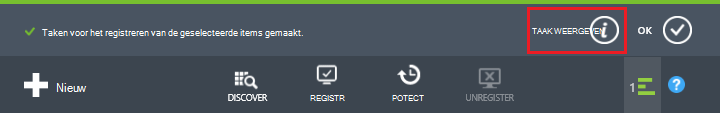
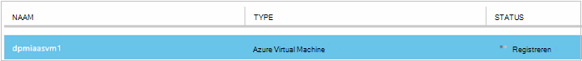
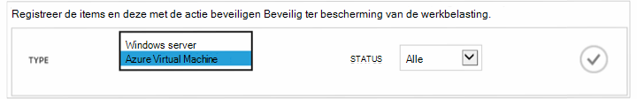
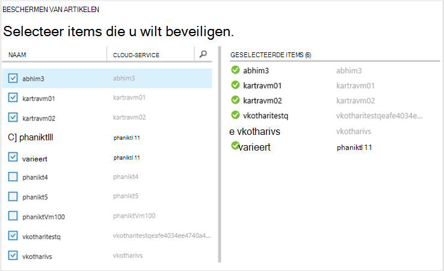
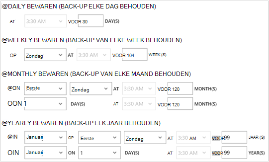
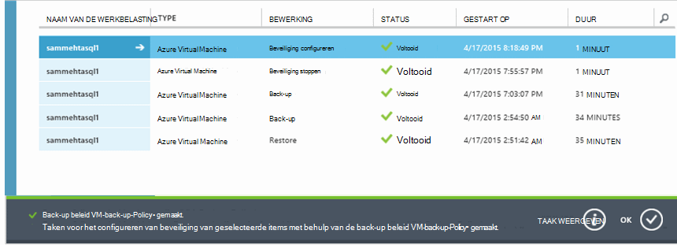

<properties
    pageTitle="Back-up van Azure virtual machines | Microsoft Azure"
    description="Ontdekken, registreren en back-up van uw virtuele machines met deze procedures voor Azure VM back-up."
    services="backup"
    documentationCenter=""
    authors="markgalioto"
    manager="jwhit"
    editor=""
    keywords="virtuele machine back-up. een back-up in virtuele machine; back-up en herstel na storing herstel; VM back-up"/>

<tags
    ms.service="backup"
    ms.workload="storage-backup-recovery"
    ms.tgt_pltfrm="na"
    ms.devlang="na"
    ms.topic="article"
    ms.date="09/28/2016"
    ms.author="trinadhk; jimpark; markgal;"/>

# Back-up van Azure virtual machines

> [AZURE.SELECTOR]
- [Back-up VMs in kluis Recovery Services](backup-azure-arm-vms.md)
- [Back-up VMs op back-up-kluis](backup-azure-vms.md)

Dit artikel bevat procedures voor back-ups van een klassieke geïmplementeerd Azure VM (virtual machine) naar een back-up kluis. Er zijn een paar taken u zorgen moet voor voordat u back-up een Azure virtuele machine. Als u nog niet hebt gedaan, worden de [vereisten](backup-azure-vms-prepare.md) om voor te bereiden uw omgeving voor back-ups van uw VMs voltooid.

Voor meer informatie, Zie de artikelen op [de back-upinfrastructuur van uw VM in Azure plannings](backup-azure-vms-introduction.md) - en [Azure virtuele machines](https://azure.microsoft.com/documentation/services/virtual-machines/).

>[AZURE.NOTE] Azure heeft twee implementatiemodellen voor het maken en werken met resources: [Resource Manager en klassiek](../resource-manager-deployment-model.md). Een kluis back-up kunt beschermen alleen VMs klassieke geïmplementeerd. VMs bronnenbeheerder geïmplementeerd met een kluis back-up kunt u niet beveiligen. Zie [Back-up van VMs naar de kluis Recovery Services](backup-azure-arm-vms.md) voor meer informatie over het werken met kluizen Recovery Services.

Back-ups van Azure virtual machines omvat drie belangrijke stappen:

>[AZURE.NOTE] Back-ups maken van virtuele machines is een lokaal proces. Om een reservekopie virtuele machines in een regio met een back-up kluis in een ander gebied. Zo moet u een back-up kluis in elke regio Azure, wanneer een VMs die een reservekopie maken.

## Stap 1: Ontdek Azure virtuele machines
Om een nieuwe virtuele machines (VMs) toegevoegd aan het abonnement worden geïdentificeerd voordat u zich registreert, de discovery-proces worden uitgevoerd. De query's proces Azure voor de lijst met virtuele machines in het abonnement, aanvullende informatie, zoals de naam van de wolk en de regio.

1. Aanmelden bij de [klassieke portal](http://manage.windowsazure.com/)

2. Klik in de lijst van Azure services **Recovery Services** om de lijst van kluizen back-up en herstel van de Site.
    

3. Selecteer in de lijst met back-up kluizen, de kluis back-up een VM.

    Als dit een nieuwe kluis opent de portal naar de pagina **Quick Start** .

    

    Als de kluis eerder is geconfigureerd, wordt de portal naar de meest recent gebruikte menu geopend.

4. Klik op **Items geregistreerd**in het menu vault (bovenaan de pagina).

    

5. Selecteer in het menu **Type** **Azure Virtual Machine**.

    

6. Klik op **DISCOVER** onderaan de pagina.
    

    De discovery-proces duurt een paar minuten terwijl de tabelindeling van de virtuele machines. Er is een bericht onder aan het scherm waarin u zien kunt dat het proces wordt uitgevoerd.

    

    Wijzigingen in de berichtgevingsvoorkeuren als het proces is voltooid. Als de discovery-proces de virtuele machines niet kunt vinden heeft, moet u eerst controleren dat het VMs bestaat. Als het VMs bestaat, zorg ervoor de VMs in hetzelfde gebied, als de back-kluis. Als het VMs bestaat en in hetzelfde gebied zijn, zorgen dat de VMs zijn niet geregistreerd voor een back-up kluis. Als een VM is toegewezen aan een back-up kluis die niet worden toegewezen aan andere back-kluizen beschikbaar is.

    

    Zodra u nieuwe items hebt gevonden, gaat u naar stap 2 en de VMs registreren.

##  Stap 2 - Register Azure virtuele machines
U registreert een Azure virtuele machine wilt koppelen aan de Azure back-up service. Dit is doorgaans een eenmalige activiteit.

1. Ga naar de back-kluis onder **Recovery Services** in Azure portal en klik op **Items geregistreerd**.

2. **Azure Virtual Machine** selecteert in de vervolgkeuzelijst.

    

3. Klik op **REGISTREREN** onderaan de pagina.
    

4. Selecteer de virtuele machines die u wilt registreren in het snelmenu **Artikelen registreren** . Als er twee of meer virtuele machines met dezelfde naam, kunt u de cloud-service gebruiken onderscheid maken tussen deze.

    >[AZURE.TIP] Meerdere virtuele machines kunnen in één keer worden geregistreerd.

    Er wordt een taak gemaakt voor elke virtuele machine die u hebt geselecteerd.

5. Klik op **Taak weergeven** in de kennisgeving naar de pagina **taken** .

    

    De virtuele machine wordt ook weergegeven in de lijst met geregistreerde artikelen, en de status van de bewerking van de registratie.

    

    Wanneer de bewerking is voltooid, de status verandert zodat de status *geregistreerd* .

    

## Stap 3: Azure virtuele machines beveiligen
Nu kunt u een back-up en het vasthouden van het beleid voor de virtuele machine instellen. Meerdere virtuele machines kunnen worden beveiligd met behulp van een enkele actie beschermen.

Azure back-up kluizen gemaakt na mei 2015 worden geleverd met een standaardbeleid is ingebouwd in de kluis. Dit standaardbeleid wordt geleverd met een standaard bewaren van 30 dagen en een back-upschema eenmaal dagelijks.

1. Ga naar de back-kluis onder **Recovery Services** in Azure portal en klik op **Items geregistreerd**.
2. **Azure Virtual Machine** selecteert in de vervolgkeuzelijst.

    

3. Klik op **beveiligen** onder aan de pagina.

    De **wizard Beveiliging van Items** wordt weergegeven. De wizard worden alleen de virtuele machines die worden geregistreerd en niet beveiligd. Selecteer de virtuele machines die u wilt beveiligen.

    Als er twee of meer virtuele machines met dezelfde naam, kunt u de cloud-service gebruiken onderscheid maken tussen de virtuele machines.

    >[AZURE.TIP] U kunt in één keer meerdere virtuele machines beveiligen.

    

4. Kies een **back-upschema** voor back-up van de virtuele machines die u hebt geselecteerd. U kunt kiezen uit een bestaande set beleidsregels of een nieuwe definiëren.

    Elke back-beleid kan meerdere virtuele machines gekoppeld hebben. Echter, de virtuele machine kan alleen worden gekoppeld aan een beleid op elk gewenst moment in de tijd.

    

    >[AZURE.NOTE] Een back-up beleid omvat een stelsel bewaren voor de geplande back-ups. Als u een bestaande back-up beleid selecteert, kunt u de opties voor het behoud in de volgende stap niet wijzigen.

5. Kies een **bereik bewaren** om te koppelen aan de back-ups.

    

    Bewaarbeleid geeft de lengte van de tijd om een back-up op te slaan. U kunt verschillende bewaarbeleid op basis van wanneer de back-up wordt genomen. Een back-up punt dagelijks genomen (die fungeert als een operationele herstelpunt) kan bijvoorbeeld 90 dagen worden bewaard. Ter vergelijking: een back-up punt aan het einde van elk kwartaal (ter controle) genomen wellicht vele maanden of jaren worden bewaard.

    

    In dit van de voorbeeldafbeelding:

    - **Dagelijkse bewaarbeleid**: back-ups die dagelijks worden opgeslagen gedurende 30 dagen.
    - **Wekelijkse bewaarbeleid**: back-ups die elke week op zondag 104 weken blijven behouden.
    - **Maandelijkse bewaarbeleid**: back-ups die op de laatste zondag van elke maand voor 120 maanden worden bewaard.
    - **Jaarlijkse bewaarbeleid**: back-ups die op de eerste zondag van elke januari 99 jaar worden bewaard.

    Configureer het beleid voor de bescherming en koppelt de virtuele machines met dat beleid voor elke virtuele machine die u hebt geselecteerd, wordt een taak gemaakt.

6. De lijst met taken in het menu kluizen **Beveiliging configureren** klikt u op **taken** en selecteer **Beveiliging configureren** met het filter voor de **bewerking** .

    

## Eerste back-up
Nadat u de virtuele machine met een beleid is beveiligd, wordt deze weergegeven onder het tabblad **Beveiligde Items** met de status van *Protected - (in afwachting van de eerste back-up)*. De eerste geplande back-up is de *eerste back-up*.

Voor het starten van de eerste back-up onmiddellijk na het configureren van beveiliging:

1. Onderaan op de pagina **Items beveiligd** , klikt u op **Nu back-up**.

    De Azure back-service maakt voor de eerste back-up een back-up.

2. Klik op het tabblad **taken** om de lijst met taken.

    

>[AZURE.NOTE] Tijdens de back-upbewerking verleent de Azure back-service een opdracht aan de back-extensie in elke virtuele machine leegmaken van alle taken van het schrijven en een consistente momentopname.

Als de eerste back-up is voltooid, wordt de status van de virtuele machine op het tabblad **Beveiligde Items** *beveiligd*.

## Back-up en details weergeven
Als beveiligd, vergroot het aantal virtuele machine ook in **de samenvatting dashboardpagina** . **De dashboardpagina** geeft ook het aantal taken van de afgelopen 24 uur die zijn *geslaagd*, *mislukt*, en worden *uitgevoerd*. Gebruik de **Status**, **bewerking**of **van** en **naar** menu's om de taken te filteren op de pagina **taken** .

Waarden in het dashboard worden elke 24 uur vernieuwd.

## Het oplossen van problemen
Als u problemen tijdens het maken van een reservekopie van uw virtuele machine, bekijkt u de [Probleemoplossing VM-artikel](backup-azure-vms-troubleshoot.md) voor meer informatie.

## Volgende stappen

- [Beheren en controleren van uw virtuele machines](backup-azure-manage-vms.md)
- [Herstellen van virtuele machines](backup-azure-restore-vms.md)
