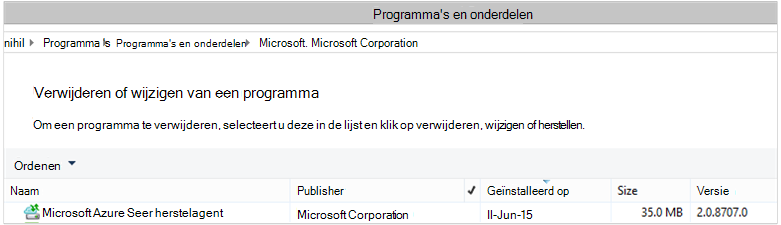

<properties
    pageTitle="Implementeren en beheren van back-up voor Windows Server/Client met PowerShell | Microsoft Azure"
    description="Meer informatie over het implementeren en beheren van back-up Azure PowerShell gebruiken"
    services="backup"
    documentationCenter=""
    authors="saurabhsensharma"
    manager="shivamg"
    editor=""/>

<tags
    ms.service="backup"
    ms.workload="storage-backup-recovery"
    ms.tgt_pltfrm="na"
    ms.devlang="na"
    ms.topic="article"
    ms.date="09/01/2016"
    ms.author="saurabhsensharma;markgal;jimpark;nkolli;trinadhk"/>


# <a name="deploy-and-manage-backup-to-azure-for-windows-serverwindows-client-using-powershell"></a>Implementeren en beheren van back-up naar Azure voor Windows Server, Windows Client met PowerShell

> [AZURE.SELECTOR]
- [ARM](backup-client-automation.md)
- [Klassiek](backup-client-automation-classic.md)

In dit artikel wordt beschreven hoe u PowerShell gebruiken voor Azure back-up van Windows Server of een Windows-client instellen en beheren van back-up en herstel.

## <a name="install-azure-powershell"></a>Azure PowerShell installeren

[AZURE.INCLUDE [learn-about-deployment-models](../../includes/learn-about-deployment-models-include.md)]

In oktober 2015, werd Azure PowerShell 1.0 uitgebracht. Deze release is de 0.9.8 geslaagd vrijgeven en over een aantal belangrijke wijzigingen, met name in de naamgeving patroon van de cmdlets gebracht. 1.0-cmdlets gaat u als volgt het naampatroon {werkwoord}-{zelfstandig naamwoord;} AzureRm Overwegende dat de 0.9.8 namen bevatten geen **Rm** (bijvoorbeeld nieuw-AzureRmResourceGroup in plaats van een nieuw AzureResourceGroup). Wanneer u Azure PowerShell 0.9.8, moet u eerst de Resource Manager-modus inschakelen met de opdracht **Switch AzureMode AzureResourceManager** . Deze opdracht is niet nodig in 1.0 of hoger.

Als u wilt gebruiken de scripts die zijn geschreven voor de 0.9.8 omgeving, in de omgeving van 1.0 of hoger, moet u zorgvuldig testen de scripts in een pre-productieomgeving voordat u ze in de productie gebruikt om te voorkomen dat onverwachte gevolgen.

[Download de nieuwste versie van PowerShell](https://github.com/Azure/azure-powershell/releases) (minimaal vereiste versie is: 1.0.0)


[AZURE.INCLUDE [arm-getting-setup-powershell](../../includes/arm-getting-setup-powershell.md)]


## <a name="create-a-backup-vault"></a>Maak een back-kluis

> [AZURE.WARNING] Voor klanten die Azure back-up voor de eerste keer, moet u voor het registreren van de provider Azure back-up kan worden gebruikt bij uw abonnement. Dit kan worden gedaan door de volgende opdracht uit te voeren: Register-AzureProvider - ProviderNamespace "Microsoft.Backup"

Kunt u een nieuwe back-kluis met de cmdlet **New-AzureRMBackupVault** . De back-vault is een bron ARM, dus u hoeft te plaatsen binnen een groep. Voer de volgende opdrachten in een verhoogde Azure PowerShell-console:

```
PS C:\> New-AzureResourceGroup –Name “test-rg” -Region “West US”
PS C:\> $backupvault = New-AzureRMBackupVault –ResourceGroupName “test-rg” –Name “test-vault” –Region “West US” –Storage GeoRedundant
```

De cmdlet **Get-AzureRMBackupVault** gebruikt om de back-up kluizen in een abonnement.


## <a name="installing-the-azure-backup-agent"></a>De Azure Backup agent installeren
Voordat u de back-up Azure agent installeert, moet u het installatieprogramma is gedownload en aanwezig zijn op de Windows Server. U kunt de meest recente versie van het installatieprogramma van het [Microsoft Downloadcentrum](http://aka.ms/azurebackup_agent) of vanaf de back-kluis dashboardpagina. Opslaan in een gemakkelijk toegankelijke locatie, zoals het installatieprogramma * C:\Downloads\*.

Als de agent hebt geïnstalleerd, moet u de volgende opdracht uitvoeren in een verhoogde PowerShell-console:

```
PS C:\> MARSAgentInstaller.exe /q
```

Hiermee installeert u de agent met de standaardopties. De installatie duurt een paar minuten op de achtergrond. Als u niet de optie */nu* opent het venster van **Windows Update** aan het einde van de installatie om te controleren op updates. Eenmaal geïnstalleerd, wordt de agent in de lijst met geïnstalleerde programma's weergegeven.

Ga naar **Het Configuratiescherm**om te zien in de lijst met geïnstalleerde programma's, > **programma's** > **programma's en onderdelen**.



### <a name="installation-options"></a>Installatie-opties

Overzicht van alle opties die beschikbaar zijn via de opdrachtregel gebruiken met de volgende opdracht:

```
PS C:\> MARSAgentInstaller.exe /?
```

De volgende opties zijn beschikbaar:

| Optie | Details | Standaard |
| ---- | ----- | ----- |
| /q | Stille installatie | - |
| / p: "vestiging" | Het pad naar de installatiemap voor de agent Azure back-up. | C:\Program Files\Microsoft Azure Services herstelagent |
| / s: 'locatie' | Het pad naar de map voor de back-up Azure-agent. | C:\Program Files\Microsoft Azure Recovery Services Agent\Scratch |
| /m | Opt-in voor Microsoft Update | - |
| /nu | Niet controleren op updates nadat de installatie is voltooid | - |
| /d | Hiermee verwijdert u de herstelagent Services Microsoft Azure | - |
| /pH | Proxy-adres van Host | - |
| /PO | Proxy Host poort nummer | - |
| /Pu | Proxy Host gebruikersnaam | - |
| /PW | Proxywachtwoord | - |


## <a name="registering-with-the-azure-backup-service"></a>Met de back-up Azure service registreren
Voordat u met de back-up Azure service registreren kunt, moet u ervoor zorgen dat aan de [vereisten](backup-configure-vault.md) wordt voldaan. U moet:

- Hebt u een geldig abonnement Azure
- Hebt u een back-kluis

De cmdlet **Get-AzureRMBackupVaultCredentials** worden uitgevoerd in een console Azure PowerShell downloaden van de referenties van de kluis en sla deze op een handige locatie zoals * C:\Downloads\*.

```
PS C:\> $credspath = "C:\"
PS C:\> $credsfilename = Get-AzureRMBackupVaultCredentials -Vault $backupvault -TargetLocation $credspath
PS C:\> $credsfilename
f5303a0b-fae4-4cdb-b44d-0e4c032dde26_backuprg_backuprn_2015-08-11--06-22-35.VaultCredentials
```

De machine registreren bij de kluis wordt gedaan met de cmdlet [Start OBRegistration](https://technet.microsoft.com/library/hh770398%28v=wps.630%29.aspx) :

```
PS C:\> $cred = $credspath + $credsfilename
PS C:\> Start-OBRegistration -VaultCredentials $cred -Confirm:$false

CertThumbprint      : 7a2ef2caa2e74b6ed1222a5e89288ddad438df2
SubscriptionID      : ef4ab577-c2c0-43e4-af80-af49f485f3d1
ServiceResourceName : test-vault
Region              : West US

Machine registration succeeded.
```

> [AZURE.IMPORTANT] Gebruik geen relatieve paden het bestand kluis referenties opgeven. U moet een absoluut pad opgeven als invoer voor de cmdlet.

## <a name="networking-settings"></a>Netwerkinstellingen
Wanneer de verbinding van de Windows-computer met het internet via een proxyserver, kunnen de proxy-instellingen ook worden geleverd aan de agent. In dit voorbeeld is het geen proxy-server, zodat we geen proxy-gerelateerde informatie expliciet wordt gewist.

Bandbreedtegebruik kan ook worden beheerd met de opties van de ```work hour bandwidth``` en ```non-work hour bandwidth``` voor een bepaald aantal dagen van de week.

Details van de proxy en de bandbreedte van de instelling is gedaan met de cmdlet [Set-OBMachineSetting](https://technet.microsoft.com/library/hh770409%28v=wps.630%29.aspx) :

```
PS C:\> Set-OBMachineSetting -NoProxy
Server properties updated successfully.

PS C:\> Set-OBMachineSetting -NoThrottle
Server properties updated successfully.
```

## <a name="encryption-settings"></a>Coderingsinstellingen
De back-upgegevens verzonden naar Azure back-up is gecodeerd ter bescherming van de vertrouwelijkheid van de gegevens. De codering wachtwoordzin is 'wachtwoord' voor het decoderen van de gegevens op het moment van herstel.

```
PS C:\> ConvertTo-SecureString -String "Complex!123_STRING" -AsPlainText -Force | Set-OBMachineSetting
Server properties updated successfully
```

> [AZURE.IMPORTANT] De wachtwoordzin gegevens veilig bewaren als deze eenmaal is ingesteld. Niet mogelijk om gegevens te herstellen van Azure zonder deze wachtwoordzin.

## <a name="back-up-files-and-folders"></a>Back-up van bestanden en mappen
Alle back-ups van Windows-Servers en -clients naar Azure back-up worden beheerst door een beleid. Het beleid bestaat uit drie delen:

1. Een **back-upschema** die aangeeft wanneer back-ups moeten worden genomen en worden gesynchroniseerd met de service.
2. Een **bewaarschema** geeft aan hoe lang herstel punten in Azure behouden.
3. Een **specificatie opnemen of uitsluiten** die wat bepaalt moet worden gestaafd.

In dit document, aangezien we bij het automatiseren van back-up, we gaan ervan uit dat er niets is geconfigureerd. We beginnen met het maken van een nieuwe back-beleid voor de cmdlet [New-OBPolicy](https://technet.microsoft.com/library/hh770416.aspx) gebruiken en.

```
PS C:\> $newpolicy = New-OBPolicy
```

Op dit moment het beleid is leeg en andere cmdlets zijn nodig om te bepalen welke items worden opgenomen of uitgesloten, wanneer back-ups wordt uitgevoerd en wanneer de back-ups worden opgeslagen.

### <a name="configuring-the-backup-schedule"></a>Het back-upschema configureren
De eerste 3 delen van een beleid is het back-upschema dat is gemaakt met de cmdlet [New-OBSchedule](https://technet.microsoft.com/library/hh770401) . Het back-upschema wordt gedefinieerd als de back-ups moeten worden genomen. Wanneer u een planning maakt, moet u 2 invoerparameters opgeven:

- **Dagen van de week** dat de back-up moet worden uitgevoerd. U kunt de back-uptaak op slechts één dag of elke dag van de week of een combinatie tussen in uitvoeren.
- **Tijden van de dag** bij de back-up moet worden uitgevoerd. U kunt maximaal 3 verschillende tijdstippen van de dag waarop de back-up wordt geactiveerd.

Bijvoorbeeld, kon u een back-beleid dat wordt uitgevoerd om 16: 00, elke zaterdag en zondag.

```
PS C:\> $sched = New-OBSchedule -DaysofWeek Saturday, Sunday -TimesofDay 16:00
```

Het back-upschema moet worden gekoppeld aan een beleid en dit kan worden bereikt met behulp van de cmdlet [Set-OBSchedule](https://technet.microsoft.com/library/hh770407) .

```
PS C:> Set-OBSchedule -Policy $newpolicy -Schedule $sched
BackupSchedule : 4:00 PM Saturday, Sunday, Every 1 week(s) DsList : PolicyName : RetentionPolicy : State : New PolicyState : Valid
```
### <a name="configuring-a-retention-policy"></a>Een bewaarbeleid configureren
Het bewaarbeleid bepaalt hoe lang het herstel punten gemaakt op basis van de back-uptaken blijven behouden. Wanneer u een nieuw bewaarbeleid met de cmdlet [New-OBRetentionPolicy](https://technet.microsoft.com/library/hh770425) maakt, kunt u het aantal dagen dat moeten worden bewaard met Azure back-up de back-up herstellen punten. In het volgende voorbeeld wordt een bewaarbeleid van 7 dagen.

```
PS C:\> $retentionpolicy = New-OBRetentionPolicy -RetentionDays 7
```

Het bewaarbeleid moet worden gekoppeld aan het belangrijkste beleid met de cmdlet [Set-OBRetentionPolicy](https://technet.microsoft.com/library/hh770405):

```
PS C:\> Set-OBRetentionPolicy -Policy $newpolicy -RetentionPolicy $retentionpolicy

BackupSchedule  : 4:00 PM
                  Saturday, Sunday,
                  Every 1 week(s)
DsList          :
PolicyName      :
RetentionPolicy : Retention Days : 7

                  WeeklyLTRSchedule :
                  Weekly schedule is not set

                  MonthlyLTRSchedule :
                  Monthly schedule is not set

                  YearlyLTRSchedule :
                  Yearly schedule is not set

State           : New
PolicyState     : Valid
```
### <a name="including-and-excluding-files-to-be-backed-up"></a>Inclusief en exclusief te worden back-ups van bestanden
Een ```OBFileSpec``` object definieert de bestanden moeten worden opgenomen en uitgesloten van een back-up. Dit is een set regels die u het bereik van de beveiligde bestanden en mappen op een computer. U kunt veel regels opgenomen of uitgesloten indien nodig het bestand en deze koppelen aan een beleid hebben. Bij het maken van een nieuw OBFileSpec-object kunt u:

- Geef de bestanden en mappen moeten worden opgenomen
- Geef de bestanden en mappen moeten worden uitgesloten
- Recursieve back-up van gegevens in een map (of) of alleen op het hoogste niveau bestanden in de opgegeven map moeten een back-up van opgeven.

Deze laatste wordt bereikt met behulp van de niet-recursieve - vlag in de opdracht Nieuw OBFileSpec.

In het volgende voorbeeld we een back-up volume C: en D: en de OS binaire bestanden in de map Windows en tijdelijke mappen uitsluiten. Om dit te doen maken we twee specificaties met de cmdlet [New-OBFileSpec](https://technet.microsoft.com/library/hh770408) - een opgenomen bestand en één voor uitsluiting. Zodra de bestandsspecificaties hebt gemaakt, zijn deze gekoppeld aan het beleid met de cmdlet [Add-OBFileSpec](https://technet.microsoft.com/library/hh770424) .

```
PS C:\> $inclusions = New-OBFileSpec -FileSpec @("C:\", "D:\")

PS C:\> $exclusions = New-OBFileSpec -FileSpec @("C:\windows", "C:\temp") -Exclude

PS C:\> Add-OBFileSpec -Policy $newpolicy -FileSpec $inclusions

BackupSchedule  : 4:00 PM
                  Saturday, Sunday,
                  Every 1 week(s)
DsList          : {DataSource
                  DatasourceId:0
                  Name:C:\
                  FileSpec:FileSpec
                  FileSpec:C:\
                  IsExclude:False
                  IsRecursive:True

                  , DataSource
                  DatasourceId:0
                  Name:D:\
                  FileSpec:FileSpec
                  FileSpec:D:\
                  IsExclude:False
                  IsRecursive:True

                  }
PolicyName      :
RetentionPolicy : Retention Days : 7

                  WeeklyLTRSchedule :
                  Weekly schedule is not set

                  MonthlyLTRSchedule :
                  Monthly schedule is not set

                  YearlyLTRSchedule :
                  Yearly schedule is not set

State           : New
PolicyState     : Valid


PS C:\> Add-OBFileSpec -Policy $newpolicy -FileSpec $exclusions

BackupSchedule  : 4:00 PM
                  Saturday, Sunday,
                  Every 1 week(s)
DsList          : {DataSource
                  DatasourceId:0
                  Name:C:\
                  FileSpec:FileSpec
                  FileSpec:C:\
                  IsExclude:False
                  IsRecursive:True
                  ,FileSpec
                  FileSpec:C:\windows
                  IsExclude:True
                  IsRecursive:True
                  ,FileSpec
                  FileSpec:C:\temp
                  IsExclude:True
                  IsRecursive:True

                  , DataSource
                  DatasourceId:0
                  Name:D:\
                  FileSpec:FileSpec
                  FileSpec:D:\
                  IsExclude:False
                  IsRecursive:True

                  }
PolicyName      :
RetentionPolicy : Retention Days : 7

                  WeeklyLTRSchedule :
                  Weekly schedule is not set

                  MonthlyLTRSchedule :
                  Monthly schedule is not set

                  YearlyLTRSchedule :
                  Yearly schedule is not set

State           : New
PolicyState     : Valid
```

### <a name="applying-the-policy"></a>Het beleid wordt toegepast
Nu het beleidsobject is voltooid en heeft een bijbehorende back-upschema bewaarbeleid en een lijst opnemen of uitsluiten van bestanden. Dit beleid kan nu worden toegezegd voor Azure back-up te gebruiken. Voordat u het zojuist gemaakte beleid zorgen ervoor dat er geen bestaande back-beleid dat is gekoppeld aan de server met behulp van de [Software-OBPolicy](https://technet.microsoft.com/library/hh770415) -cmdlet. Het beleid verwijderen wordt om bevestiging gevraagd. Overslaan van het gebruik van de bevestiging van de ```-Confirm:$false``` vlag met de cmdlet.

```
PS C:> Get-OBPolicy | Remove-OBPolicy
Microsoft Azure Backup Are you sure you want to remove this backup policy? This will delete all the backed up data. [Y] Yes [A] Yes to All [N] No [L] No to All [S] Suspend [?] Help (default is "Y"):
```

Doorvoeren van het beleidsobject wordt gedaan met de cmdlet [Set-OBPolicy](https://technet.microsoft.com/library/hh770421) . Dit vraagt om bevestiging. Overslaan van het gebruik van de bevestiging van de ```-Confirm:$false``` vlag met de cmdlet.

```
PS C:> Set-OBPolicy -Policy $newpolicy
Microsoft Azure Backup Do you want to save this backup policy ? [Y] Yes [A] Yes to All [N] No [L] No to All [S] Suspend [?] Help (default is "Y"):
BackupSchedule : 4:00 PM Saturday, Sunday, Every 1 week(s)
DsList : {DataSource
         DatasourceId:4508156004108672185
         Name:C:\
         FileSpec:FileSpec
         FileSpec:C:\
         IsExclude:False
         IsRecursive:True,

         FileSpec
         FileSpec:C:\windows
         IsExclude:True
         IsRecursive:True,

         FileSpec
         FileSpec:C:\temp
         IsExclude:True
         IsRecursive:True,

         DataSource
         DatasourceId:4508156005178868542
         Name:D:\
         FileSpec:FileSpec
         FileSpec:D:\
         IsExclude:False
         IsRecursive:True
    }
PolicyName : c2eb6568-8a06-49f4-a20e-3019ae411bac
RetentionPolicy : Retention Days : 7
              WeeklyLTRSchedule :
              Weekly schedule is not set

              MonthlyLTRSchedule :
              Monthly schedule is not set

              YearlyLTRSchedule :
              Yearly schedule is not set
State : Existing PolicyState : Valid
```

U kunt de details van de bestaande back-beleid met de cmdlet [Get-OBPolicy](https://technet.microsoft.com/library/hh770406) weergeven. U kunt inzoomen verder met de cmdlet [Get-OBSchedule](https://technet.microsoft.com/library/hh770423) voor het back-upschema en de cmdlet [Get-OBRetentionPolicy](https://technet.microsoft.com/library/hh770427) voor het bewaarbeleid

```
PS C:> Get-OBPolicy | Get-OBSchedule
SchedulePolicyName : 71944081-9950-4f7e-841d-32f0a0a1359a
ScheduleRunDays : {Saturday, Sunday}
ScheduleRunTimes : {16:00:00}
State : Existing

PS C:> Get-OBPolicy | Get-OBRetentionPolicy
RetentionDays : 7
RetentionPolicyName : ca3574ec-8331-46fd-a605-c01743a5265e
State : Existing

PS C:> Get-OBPolicy | Get-OBFileSpec
FileName : *
FilePath : \?\Volume{b835d359-a1dd-11e2-be72-2016d8d89f0f}\
FileSpec : D:\
IsExclude : False
IsRecursive : True

FileName : *
FilePath : \?\Volume{cdd41007-a22f-11e2-be6c-806e6f6e6963}\
FileSpec : C:\
IsExclude : False
IsRecursive : True

FileName : *
FilePath : \?\Volume{cdd41007-a22f-11e2-be6c-806e6f6e6963}\windows
FileSpec : C:\windows
IsExclude : True
IsRecursive : True

FileName : *
FilePath : \?\Volume{cdd41007-a22f-11e2-be6c-806e6f6e6963}\temp
FileSpec : C:\temp
IsExclude : True
IsRecursive : True
```

### <a name="performing-an-ad-hoc-backup"></a>Een ad hoc-back-up maken
Nadat u een back-beleid is ingesteld wordt de back-ups per de planning plaatsvindt. Back-up van een ad-hoc activeren is ook mogelijk met de cmdlet [Start OBBackup](https://technet.microsoft.com/library/hh770426) :

```
PS C:> Get-OBPolicy | Start-OBBackup
Taking snapshot of volumes...
Preparing storage...
Estimating size of backup items...
Estimating size of backup items...
Transferring data...
Verifying backup...
Job completed.
The backup operation completed successfully.
```

## <a name="restore-data-from-azure-backup"></a>Gegevens terugzetten vanaf de back-up Azure
In deze sectie begeleidt u door de stappen voor het herstel van gegevens uit back-up Azure automatiseren. Dit omvat de volgende stappen:

1. Kies het bronvolume
2. Kies een punt back-up terugzetten
3. Kies een item terugzetten
4. Het herstelproces starten

### <a name="picking-the-source-volume"></a>Het bronvolume verzamelen
Om een item terugzetten uit back-up Azure, moet u eerst de bron van het artikel te identificeren. Aangezien we nu de opdrachten in de context van een Windows-Server of een Windows-client wordt uitgevoerd, wordt de computer al geïdentificeerd. De volgende stap bij het identificeren van de bron is voor het volume met het. Een lijst met volumes of back-up gemaakt van deze computer bronnen kan worden opgehaald door het uitvoeren van de cmdlet [Get-OBRecoverableSource](https://technet.microsoft.com/library/hh770410) . Met deze opdracht geeft als resultaat een matrix van alle bronnen in een back-up van deze server/client.

```
PS C:> $source = Get-OBRecoverableSource
PS C:> $source
FriendlyName : C:\
RecoverySourceName : C:\
ServerName : myserver.microsoft.com

FriendlyName : D:\
RecoverySourceName : D:\
ServerName : myserver.microsoft.com
```

### <a name="choosing-a-backup-point-to-restore"></a>Een back-up punt herstellen kiezen
De lijst met back-punten kan worden opgehaald door het uitvoeren van de cmdlet [Get-OBRecoverableItem](https://technet.microsoft.com/library/hh770399.aspx) met de juiste parameters. In ons voorbeeld we de meest recente back-punt voor het bronvolume *D:* kiezen en gebruiken voor het herstellen van een specifiek bestand.

```
PS C:> $rps = Get-OBRecoverableItem -Source $source[1]
IsDir : False
ItemNameFriendly : D:\
ItemNameGuid : \?\Volume{b835d359-a1dd-11e2-be72-2016d8d89f0f}\
LocalMountPoint : D:\
MountPointName : D:\
Name : D:\
PointInTime : 18-Jun-15 6:41:52 AM
ServerName : myserver.microsoft.com
ItemSize :
ItemLastModifiedTime :

IsDir : False
ItemNameFriendly : D:\
ItemNameGuid : \?\Volume{b835d359-a1dd-11e2-be72-2016d8d89f0f}\
LocalMountPoint : D:\
MountPointName : D:\
Name : D:\
PointInTime : 17-Jun-15 6:31:31 AM
ServerName : myserver.microsoft.com
ItemSize :
ItemLastModifiedTime :
```
Het object ```$rps``` is een matrix van punten voor back-up. Het eerste element is de nieuwste en de zoveelste element is de oudste. Als u het laatste punt, maken we gebruik van ```$rps[0]```.

### <a name="choosing-an-item-to-restore"></a>Een item terugzetten kiezen
Recursief gebruiken ter identificatie van de exacte bestand of map wilt terugzetten, de cmdlet [Get-OBRecoverableItem](https://technet.microsoft.com/library/hh770399.aspx) . Op die manier de maphiërarchie bezocht kan worden uitsluitend met behulp van de ```Get-OBRecoverableItem```.

In dit voorbeeld, als we willen herstellen van het bestand *finances.xls* we kunnen verwijzen naar die met behulp van het object ```$filesFolders[1]```.

```
PS C:> $filesFolders = Get-OBRecoverableItem $rps[0]
PS C:> $filesFolders
IsDir : True
ItemNameFriendly : D:\MyData\
ItemNameGuid : \?\Volume{b835d359-a1dd-11e2-be72-2016d8d89f0f}\MyData\
LocalMountPoint : D:\
MountPointName : D:\
Name : MyData
PointInTime : 18-Jun-15 6:41:52 AM
ServerName : myserver.microsoft.com
ItemSize :
ItemLastModifiedTime : 15-Jun-15 8:49:29 AM

PS C:> $filesFolders = Get-OBRecoverableItem $filesFolders[0]
PS C:> $filesFolders
IsDir : False
ItemNameFriendly : D:\MyData\screenshot.oxps
ItemNameGuid : \?\Volume{b835d359-a1dd-11e2-be72-2016d8d89f0f}\MyData\screenshot.oxps
LocalMountPoint : D:\
MountPointName : D:\
Name : screenshot.oxps
PointInTime : 18-Jun-15 6:41:52 AM
ServerName : myserver.microsoft.com
ItemSize : 228313
ItemLastModifiedTime : 21-Jun-14 6:45:09 AM

IsDir : False
ItemNameFriendly : D:\MyData\finances.xls
ItemNameGuid : \?\Volume{b835d359-a1dd-11e2-be72-2016d8d89f0f}\MyData\finances.xls
LocalMountPoint : D:\
MountPointName : D:\
Name : finances.xls
PointInTime : 18-Jun-15 6:41:52 AM
ServerName : myserver.microsoft.com
ItemSize : 96256
ItemLastModifiedTime : 21-Jun-14 6:43:02 AM
```

U kunt ook zoeken naar items terugzetten met behulp van de ```Get-OBRecoverableItem``` cmdlet. In ons voorbeeld om te zoeken naar *finances.xls* kan krijgen we een greep op het bestand door het uitvoeren van deze opdracht:

```
PS C:\> $item = Get-OBRecoverableItem -RecoveryPoint $rps[0] -Location "D:\MyData" -SearchString "finance*"
```

### <a name="triggering-the-restore-process"></a>Het herstelproces starten
Om het herstelproces starten, moeten we eerst de opties voor terugzetten opgeven. Dit kan worden gedaan met behulp van de cmdlet [New-OBRecoveryOption](https://technet.microsoft.com/library/hh770417.aspx) . In dit voorbeeld gaan we ervan uit dat we willen de bestanden terugzetten naar *C:\temp*. Laten we ook aannemen dat u wilt overslaan van bestanden die al in de map *C:\temp*. U maakt een hersteloptie, gebruik de volgende opdracht:

```
PS C:\> $recovery_option = New-OBRecoveryOption -DestinationPath "C:\temp" -OverwriteType Skip
```

Nu terugzetten te activeren met behulp van de opdracht [Start-OBRecovery](https://technet.microsoft.com/library/hh770402.aspx) op de geselecteerde ```$item``` uit de uitvoer van de ```Get-OBRecoverableItem``` cmdlet:

```
PS C:\> Start-OBRecovery -RecoverableItem $item -RecoveryOption $recover_option
Estimating size of backup items...
Estimating size of backup items...
Estimating size of backup items...
Estimating size of backup items...
Job completed.
The recovery operation completed successfully.
```


## <a name="uninstalling-the-azure-backup-agent"></a>De Azure Backup agent verwijderen
Verwijderen van de agent Azure back-up kan worden uitgevoerd met de volgende opdracht:

```
PS C:\> .\MARSAgentInstaller.exe /d /q
```

De agent binaire bestanden verwijderen van de computer heeft enkele gevolgen te overwegen:

- Het bestandsfilter wordt verwijderd uit de computer en het bijhouden van wijzigingen is gestopt.
- Alle informatie over het beleid van de computer wordt verwijderd, maar blijft de beleidsgegevens worden opgeslagen in de service.
- Alle back-up schema's worden verwijderd en er geen verdere back-ups worden genomen.

Echter, de gegevens opgeslagen in Azure blijft en door u aan de hand van de instellingen bewaren beleid blijft behouden. Oudere punten worden automatisch verouderde.

## <a name="remote-management"></a>Extern beheer
Het management rond de Azure Backup agent, beleid en gegevensbronnen kan op afstand worden gedaan via PowerShell. De computer die u extern wilt beheren, moet goed worden voorbereid.

De WinRM-service is standaard geconfigureerd voor handmatig opstarten. Het opstarttype is ingesteld op *automatisch* en de service moet worden gestart. Om te controleren of de WinRM-service wordt uitgevoerd, moet de waarde van de eigenschap Status *wordt uitgevoerd*.

```
PS C:\> Get-Service WinRM

Status   Name               DisplayName
------   ----               -----------
Running  winrm              Windows Remote Management (WS-Manag...
```

PowerShell moet worden geconfigureerd voor externe toegang.

```
PS C:\> Enable-PSRemoting -force
WinRM is already set up to receive requests on this computer.
WinRM has been updated for remote management.
WinRM firewall exception enabled.

PS C:\> Set-ExecutionPolicy unrestricted -force
```

De computer kan nu worden beheerd op afstand - vanaf de installatie van de agent. Het volgende script wordt bijvoorbeeld de agent opgehaald bij de externe computer en installeert dit programma.

```
PS C:\> $dloc = "\\REMOTESERVER01\c$\Windows\Temp"
PS C:\> $agent = "\\REMOTESERVER01\c$\Windows\Temp\MARSAgentInstaller.exe"
PS C:\> $args = "/q"
PS C:\> Copy-Item "C:\Downloads\MARSAgentInstaller.exe" -Destination $dloc - force

PS C:\> $s = New-PSSession -ComputerName REMOTESERVER01
PS C:\> Invoke-Command -Session $s -Script { param($d, $a) Start-Process -FilePath $d $a -Wait } -ArgumentList $agent $args
```

## <a name="next-steps"></a>Volgende stappen
Voor meer informatie over Azure back-up voor Windows Server/Client Zie

- [Inleiding tot Azure back-up](backup-introduction-to-azure-backup.md)
- [Back-up van Windows-Servers](backup-configure-vault.md)
