<properties
    pageTitle="Back-up van een Windows server of client met behulp van het klassieke implementatiemodel Azure | Microsoft Azure"
    description="Back-up Windows-servers of clients Azure door het maken van een back-up kluis, downloaden van referenties de reservekopie-agent installeren en uitvoeren van een eerste back-up van uw bestanden en mappen."
    services="backup"
    documentationCenter=""
    authors="markgalioto"
    manager="cfreeman"
    editor=""
    keywords="back-kluis; back-up van een Windows-server. windows back-up."/>

<tags
    ms.service="backup"
    ms.workload="storage-backup-recovery"
    ms.tgt_pltfrm="na"
    ms.devlang="na"
    ms.topic="article"
    ms.date="08/08/2016"
    ms.author="jimpark; trinadhk; markgal"/>

# Back-up van een Windows-server of client aan het klassieke implementatiemodel met Azure

> [AZURE.SELECTOR]
- [Klassieke portal](backup-configure-vault-classic.md)
- [Azure portal](backup-configure-vault.md)

Dit artikel heeft betrekking op de procedures die u volgen moet om uw omgeving voorbereiden en back-up van Windows server (of client) naar Azure. Dit omvat ook overwegingen voor de implementatie van uw back-upoplossing. Als u geïnteresseerd bent in Azure back-up voor de eerste keer probeert, doorloopt in dit artikel snel u het proces.

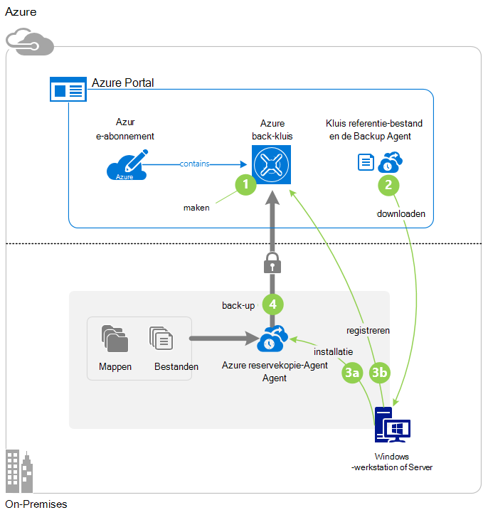

>[AZURE.IMPORTANT] Azure heeft twee verschillende modellen voor het maken en werken met resources: Resource Manager en klassiek. In dit artikel beschreven hoe u met de klassieke implementatiemodel. Microsoft raadt de meeste nieuwe implementaties gebruiken het model Resource Manager.

## Voordat u begint
Als u wilt back-up van een server of client voor Azure, moet u een account Azure. Als u er geen hebt, kunt u een [gratis account](https://azure.microsoft.com/free/) maken in een paar minuten.

## Stap 1: Maak een back-kluis
Als u wilt back-up van bestanden en mappen van een server of de client, moet u voor het maken van een back-up kluis in de geografische regio waar u de gegevens op te slaan.

### Voor het maken van een back-kluis

1. Log in om [de klassieke portal](https://manage.windowsazure.com/).

2. Klik op **Nieuw** > **Data Services** > **Recovery Services** > **Kluis back-up**, en kies vervolgens **Snel maken**.

3. Voer een beschrijvende naam voor de back-kluis voor de parameter **Name** . Typ een naam die tussen 2 en 50 tekens bevat. Het moet beginnen met een letter en mag alleen letters, cijfers en streepjes. Deze naam moet uniek zijn voor elk abonnement.

4. Selecteer de regio voor de back-kluis voor de parameter **regio** . Uw keuze bepaalt de geografische regio waar de back-up gegevens worden verzonden. Een geografisch gebied dat dicht bij uw locatie te kiezen, kunt u beperken netwerkvertraging wanneer de back-up naar Azure.

5. Klik op de **kluis te maken**.

    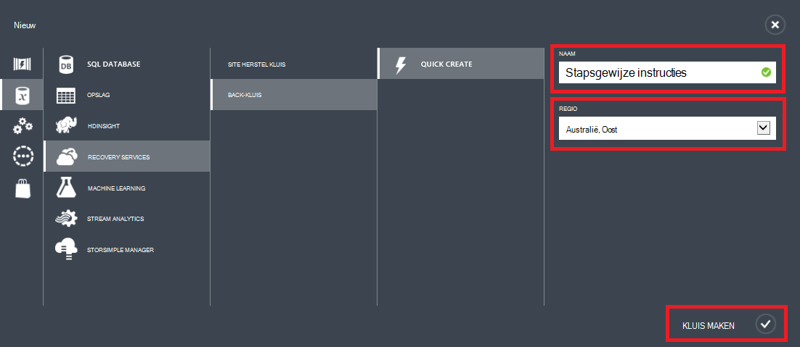

    Het kan even duren voor de kluis back-up moet worden gemaakt. U kunt de status controleren de mededelingen onder in de klassieke portal.

    Nadat de kluis back-up is gemaakt, wordt er een bericht dat de kluis is gemaakt. Ook verschijnt deze als **actief** in de lijst met resources **Recovery Services** .

    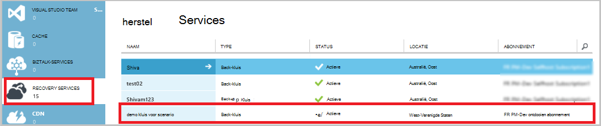

4. Selecteer de optie van de redundantie opslag door de stappen die hier worden beschreven.

    >[AZURE.IMPORTANT] De beste tijd voor het identificeren van uw opslag redundantie optie is direct na het maken van de kluis en voordat computers zijn geregistreerd op de kluis. Nadat u een item naar de kluis is geregistreerd, wordt de optie opslag redundantie is vergrendeld en kan niet worden gewijzigd.

    Als u Azure als het eindpunt van een primaire back-up opslaan gebruikt (bijvoorbeeld u een back-up naar Azure vanaf een Windows-server), kunt u de optie voor [geo-redundante opslag](../storage/storage-redundancy.md#geo-redundant-storage) verzamelen (de standaardinstelling).

    Als u Azure als het eindpunt van een tertiaire back-up opslaan gebruikt (bijvoorbeeld u via System Center Data Protection Manager winkel een lokale back-up op gebouwen en het gebruik van Azure voor op lange termijn), [lokaal redundante opslag](../storage/storage-redundancy.md#locally-redundant-storage)kiezen. Dit brengt de kosten voor het opslaan van gegevens in Azure, terwijl een lager niveau van duurzaamheid voor uw gegevens die acceptabel voor tertiaire kopieën wellicht.

    **Selecteer de optie opslag redundantie:**

    een. Klik op de kluis die u zojuist hebt gemaakt.

    b. Selecteer op de pagina Quick Start **configureren**.

    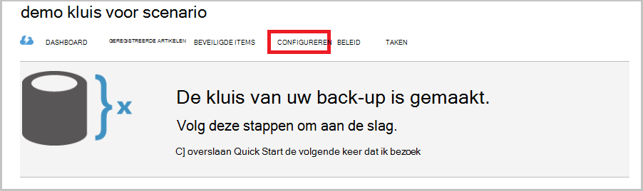

    c. Kies de optie de juiste opslag redundantie.

    Als u **Lokaal redundante**selecteert, moet u klikken op **Opslaan** (omdat **Geo-redundante** de standaardoptie is).

    d. Klik in het linkernavigatievenster **Recovery Services** terug te keren naar de lijst met resources voor de Recovery Services.

## Stap 2: De kluis referentie-bestand downloaden
De machine op locatie moet worden geverifieerd met een back-up kluis voordat deze kan back-up van gegevens naar Azure. De verificatie wordt bereikt door de *referenties van de kluis*. De kluis referentie-bestand wordt gedownload via een beveiligd kanaal van de klassieke portal. De persoonlijke sleutel van het certificaat niet in de portal of de service blijft bestaan.

Meer informatie over de [kluis met behulp van referenties voor de verificatie van de back-up service](backup-introduction-to-azure-backup.md#what-is-the-vault-credential-file).

### De kluis referentie-bestand te downloaden naar een lokale computer

1. In het linkernavigatievenster **Recovery Services**op en selecteert u de back-kluis die u hebt gemaakt.

    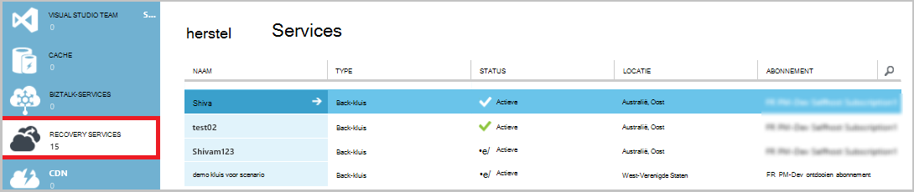

2.  Klik op de pagina Quick Start **Download kluis referenties**.

    De klassieke portal genereert een referentie kluis met behulp van een combinatie van de naam van de kluis en de huidige datum. De referenties kluis bestand wordt alleen gebruikt tijdens de registratie van workflow en verloopt na 48 uur.

    De kluis referentie-bestand kan worden gedownload vanaf de portal.

3. Klik op **Opslaan** het bestand te downloaden kluis referentie naar de map Downloads van de lokale account. U kunt ook **OpslaanAls** selecteren in het menu **Opslaan** om een locatie voor het bestand kluis referentie.

    >[AZURE.NOTE] Zorg ervoor dat de kluis referenties opgeslagen op een locatie die toegankelijk is vanaf uw computer. Als het is opgeslagen in een bestand delen of server message block, Controleer of u de juiste machtigingen beschikken.

## Stap 3: Downloaden, installeren en registreren van de reservekopie-agent
Nadat u de kluis back-up maken en de kluis referentie-bestand downloadt, moet een agent op elke Windows-computers zijn geïnstalleerd.

### Downloaden, installeren en registreren van de agent

1. **Recovery Services**op en selecteert u de back-kluis die u wilt registreren met een server.

2. Klik op de pagina Quick Start de **Agent voor Windows Server of System Center Data Protection Manager of Windows client**-agent. Klik vervolgens op **Opslaan**.

    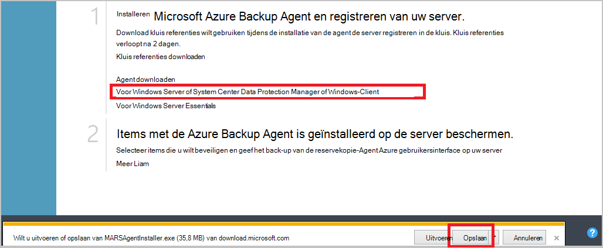

3. Nadat u het bestand MARSagentinstaller.exe is gedownload, klikt u op **uitvoeren** (of dubbelklik op de **MARSAgentInstaller.exe** van de locatie is opgeslagen).

4. Kies de installatiemap en de cachemap die vereist zijn voor de agent en klik op **volgende**. De cachelocatie die u opgeeft moet ruimte ten minste 5 procent van de back-upgegevens.

5. U kunt verbinding maken met het Internet via de proxy-instellingen blijven.          Als u een proxyserver gebruikt om verbinding met het Internet, klikt u op de pagina configuratie van Proxy het selectievakje **aangepaste proxy-instellingen gebruiken** en voer vervolgens de details van proxy server. Als u een geverifieerde proxy gebruikt, voert u de gegevens van de gebruiker en het wachtwoord en klik op **volgende**.

7. Klik op **installeren** om de installatie van de agent te starten. De Backup agent installeert u .NET Framework 4.5 en Windows PowerShell (als dit nog niet is geïnstalleerd) om de installatie te voltooien.

8. Nadat de agent is geïnstalleerd, klikt u op **Doorgaan om de registratie** te gaan met de workflow.

9. Blader naar en selecteer de kluis referentie-bestand dat u eerder hebt gedownload op de pagina identificatie van de kluis.

    Het bestand kluis referentie is geldig voor alleen 48 uur nadat het gedownload van de portal. Als er een fout optreedt op wordt deze pagina (bijvoorbeeld "kluis referenties opgegeven bestand is verlopen'), zich aanmelden bij de portal en het kluis referenties opnieuw downloaden.

    Zorg ervoor dat de kluis referentie-bestand op een locatie die toegankelijk is voor het setup-programma beschikbaar is. Als u access-gerelateerde fouten optreden, worden de kluis referentie-bestand kopiëren naar een tijdelijke locatie op dezelfde machine en probeer het opnieuw.

    Als u een kluis referentie fout, zoals "Ongeldige kluis referenties opgegeven", het bestand is beschadigd of heeft niet de meest recente referenties aan hebt gekoppeld de recovery-service. Probeer het opnieuw na het downloaden van een nieuwe kluis referentie-bestand vanaf de portal. Deze fout kan ook optreden als een gebruiker de optie **Download kluis referenties** meerdere keren achtereen snel. In dit geval alleen het laatste kluis referentie bestand is geldig.

9. Op de pagina-instelling-codering kunt u genereren een wachtwoordzin of voorzien van een wachtwoordzin (minimaal 16 tekens). Moet de wachtwoordzin op een veilige locatie opslaan.

10. Klik op **Voltooien**. De Wizard registreren Server registreert de server met de back-up.

    >[AZURE.WARNING] Als u de wachtwoordzin vergeet of verliest, kan niet Microsoft kunt u de back-upgegevens herstellen. Eigenaar van de wachtwoordzin codering, en Microsoft heeft geen inzicht in de wachtwoordzin die u gebruikt. Sla het bestand op een veilige locatie omdat het tijdens een herstelbewerking wordt vereist.

11. Nadat de sleutel is ingesteld, laat u het selectievakje **Starten Microsoft Azure Services herstelagent** is ingeschakeld en klik vervolgens op **sluiten**.

## Stap 4: De eerste back-up voltooien

De eerste back-up bevat twee belangrijke taken:

- Het back-upschema maken
- Back-ups van bestanden en mappen voor de eerste keer

Nadat het beleid van de back-up is voltooid de eerste back-up wordt gemaakt back-punten die u gebruiken kunt als u nodig hebt om de gegevens te herstellen. De back-up beleid gebeurt op basis van het schema dat u definieert.

### De back-up plannen

1. Open de Microsoft Azure Backup agent. (Deze wordt automatisch geopend als u het selectievakje **Starten Microsoft Azure Services herstelagent** is ingeschakeld wanneer u de Wizard registreren Server gesloten.) Deze kunt u vinden door te zoeken op uw computer **Microsoft Azure back-up**.

    

2. In de reservekopie-agent, klikt u op **Back-up plannen**.

    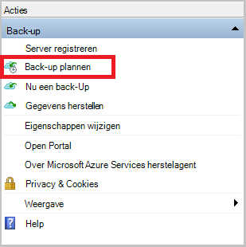

3. Klik op **volgende**op de pagina Introductie van de Wizard Back.

4. Klik op Items selecteren op de pagina back-up op **Items toevoegen**.

5. Selecteer de bestanden en mappen die u back wilt-up maken en klik vervolgens op **OK**.

6. Klik op **volgende**.

7. Het **back-upschema** en klik op **volgende**op de pagina **Back-upschema opgeven** .

    U kunt dagelijks (met een maximale snelheid van drie keer per dag) of een wekelijkse back-ups plannen.

    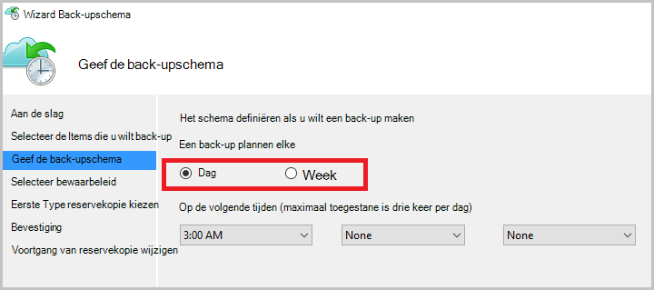

    >[AZURE.NOTE] Zie het artikel [Gebruik Azure back-up vervangt uw tape-infrastructuur](backup-azure-backup-cloud-as-tape.md)voor meer informatie over het opgeven van het back-upschema.

8. Selecteer op de pagina **Selecteer bewaarbeleid** het **Bewaarbeleid** voor de back-up.

    Het bewaarbeleid bevat de duur waarvoor de back-up wordt opgeslagen. In plaats van gewoon "flat policy" voor alle punten van de back-up op te geven, kunt u verschillende bewaarbeleid op basis van wanneer de back-up. U kunt de dagelijkse, wekelijkse, maandelijkse en jaarlijkse bewaarbeleid aan uw behoeften wijzigen.

9. Kies de eerste type back-up op de pagina Kies eerste back-uptype. Laat de optie **automatisch via het netwerk** hebt geselecteerd en klik op **volgende**.

    U kunt back-ups automatisch via het netwerk, of kunt u een off line reservekopie. De rest van dit artikel wordt beschreven dat het proces voor het maken van back-automatisch. Als u liever een off line back-up te doen, bekijk de [off line back-up procedure in Azure Backup](backup-azure-backup-import-export.md) -artikel voor meer informatie.

10. Lees de informatie op de pagina bevestigen en klik op **Voltooien**.

11. Na het voltooien van de wizard Back-upschema maken, klikt u op **sluiten**.

### Inschakelen van bandbreedtebeperking (optioneel)

De Backup agent biedt bandbreedtebeperking. Met een gebeurtenisbeperking bepaalt hoe netwerkbandbreedte tijdens de overdracht van gegevens wordt gebruikt. Dit besturingselement is handig als u back wilt-up van gegevens tijdens werkuren, maar niet wilt dat de back-upprocedure te mengen met andere Internet-verkeer. Beperking van toepassing op back-up en terugzetten van activiteiten.

**Bandbreedtebeperking inschakelen**

1. In de reservekopie-agent, klikt u op **Eigenschappen wijzigen**.

    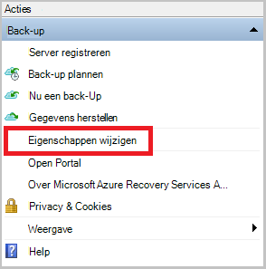

2. Schakel het selectievakje **internet bandbreedtegebruik voor back-upbewerkingen Procesbeperking inschakelen** op het tabblad **Throttling** .

    

3. Nadat u de bandbreedtebeperking hebt ingeschakeld, geeft u de toegestane bandbreedte voor de overdracht van gegevens met back-up tijdens **werkuren** en **niet-gewerkte uren**.

    De waarden van de bandbreedte begint in 512 kilobits per seconde (Kbps) en maximaal 1023 MB per seconde (MBps) kunnen gaan. Ook geven het begin en einddatum voor **werkuren**en welke dagen van de week worden beschouwd als werkdagen. Uren buiten de aangewezen werk uren worden beschouwd als niet-werk uren.

4. Klik op **OK**.

### Nu back-up maken

1. In de reservekopie-agent, klikt u op **Nu een Back-Up maken** om de eerste seeding via het netwerk.

    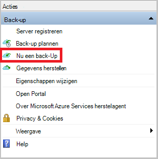

2. Controleer de instellingen die de Wizard Back-Up nu gebruiken wilt voor back-up van de computer op de pagina bevestigen. Klik vervolgens op **Back-Up**.

3. Klik op **sluiten** om de wizard te sluiten. Als u dit doen voordat u het back-upproces is voltooid, blijft de wizard op de achtergrond uitgevoerd.

Nadat de eerste back-up is voltooid, wordt de status **voltooid van de taak** weergegeven in de console van de back-up.

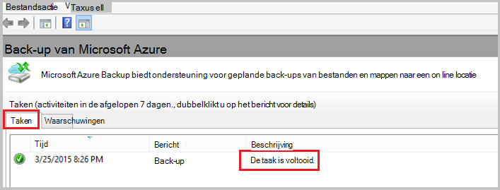

## Volgende stappen
- Aanmelden voor een [gratis account van Azure](https://azure.microsoft.com/free/).

Zie voor meer informatie over back-ups van VMs of andere werkbelasting:

- [Een back-up IaaS VMs](backup-azure-vms-prepare.md)
- [Back-up werkbelasting op Azure met Microsoft Azure back-up Server](backup-azure-microsoft-azure-backup.md)
- [Back-up werkbelasting op Azure met DPM](backup-azure-dpm-introduction.md)
