<properties
    pageTitle="Back-up van een Windows-Server of client voor Azure met Azure back-up met behulp van het implementatiemodel Resource Manager | Microsoft Azure"
    description="Back-up Windows-servers of clients Azure door het maken van een back-up kluis, downloaden van referenties de reservekopie-agent installeren en uitvoeren van een eerste back-up van uw bestanden en mappen."
    services="backup"
    documentationCenter=""
    authors="markgalioto"
    manager="cfreeman"
    editor=""
    keywords="back-kluis; back-up van een Windows-server. windows back-up."/>

<tags
    ms.service="backup"
    ms.workload="storage-backup-recovery"
    ms.tgt_pltfrm="na"
    ms.devlang="na"
    ms.topic="article"
    ms.date="08/10/2016"
    ms.author="jimpark; trinadhk; markgal"/>

# Back-up van een Windows-Server of client voor Azure met het implementatiemodel Resource Manager

> [AZURE.SELECTOR]
- [Azure portal](backup-configure-vault.md)
- [Klassieke portal](backup-configure-vault-classic.md)

In dit artikel wordt uitgelegd hoe u een back-up van uw Windows Server (of Windows-client) bestanden en mappen naar Azure met Azure back-up met behulp van het implementatiemodel Resource Manager.

[AZURE.INCLUDE [learn-about-deployment-models](../../includes/backup-deployment-models.md)]

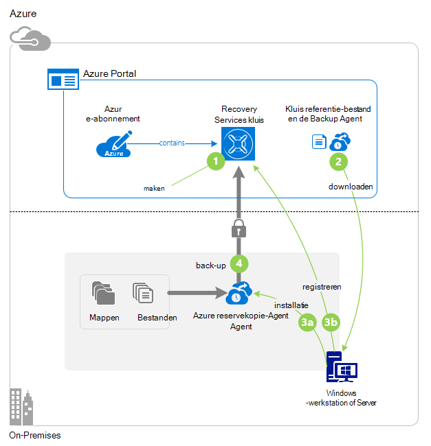

## Voordat u begint
Als u wilt back-up van een server of client voor Azure, moet u een account Azure. Als u er geen hebt, kunt u een [gratis account](https://azure.microsoft.com/free/) maken in een paar minuten.

## Stap 1: Maak een kluis Recovery Services

Een kluis Recovery Services is een entiteit die de back-ups en herstel punten die u na verloop van tijd maakt worden opgeslagen. De kluis Recovery Services bevat ook de back-beleid toegepast op de beveiligde bestanden en mappen. Wanneer u een kluis Recovery Services maakt, moet u ook de optie de juiste opslag redundantie.

### Voor het maken van een kluis Recovery Services

1. Als u nog niet hebt gedaan, aanmelden bij de [Azure Portal](https://portal.azure.com/) met behulp van uw abonnement op Azure.

2. Klik op **Bladeren** en typ in de lijst met resources **Recovery Services**in het menu Hub. Als u te typen begint, de lijst wordt gefilterd op basis van uw invoer. Klik op **kluizen Recovery Services**.

    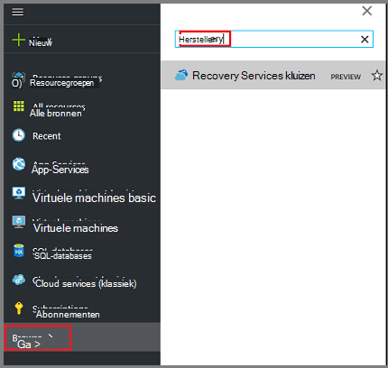  

    De lijst van kluizen Recovery Services wordt weergegeven.

3. Klik in het menu **kluizen Recovery Services** op **toevoegen**.

    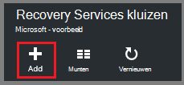

    De kluis Recovery Services blade wordt geopend, waarin u een **naam**, **abonnement**, **resourcegroep**en **locatie**.

    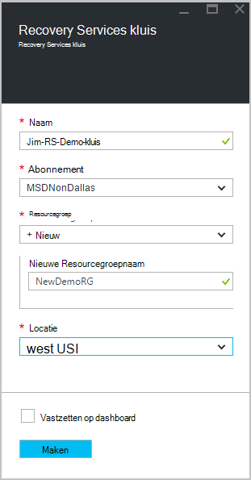

4. Voer voor de **naam**een beschrijvende naam ter identificatie van de kluis. De naam moet uniek zijn voor het abonnement Azure. Typ een naam die tussen 2 en 50 tekens bevat. Het moet beginnen met een letter en mag alleen letters, cijfers en streepjes.

5. Klik op **abonnement** overzicht de beschikbare abonnementen. Als u niet zeker weet welke abonnement wilt gebruiken, gebruikt u de standaardinstelling (of voorgesteld) abonnement. Zullen er meerdere opties als uw organisatie-account gekoppeld aan meerdere Azure abonnementen is.

6. Klik op **resourcegroep** overzicht de beschikbare brongroepen of klik op **Nieuw** om een nieuwe resourcegroep te maken. Zie voor volledige informatie over resourcegroepen, [Azure Resource Manager-overzicht](../azure-resource-manager/resource-group-overview.md)

7. Klik op **locatie** selecteren van de geografische regio van de kluis. Uw keuze bepaalt de geografische regio waar de back-up gegevens worden verzonden. Een geografisch gebied dat dicht bij uw locatie te kiezen, kunt u beperken netwerkvertraging wanneer de back-up naar Azure.

8. Klik op **maken**. Het kan even duren voor de kluis Recovery Services moet worden gemaakt. Controleren van de van statusmeldingen in het bovenste rechter gebied in de portal. Zodra uw kluis is gemaakt, moet deze geopend in de portal. Als u uw kluis weergegeven nadat deze is voltooid, klikt u op **vernieuwen**. Wanneer de lijst wordt vernieuwd, klikt u op de naam van de kluis.

### Opslag redundantie bepalen
Wanneer u een kluis Recovery Services maakt kunt u bepalen hoe de opslag worden gerepliceerd.

1. In de **Instellingen** -bladeserver, die automatisch wordt gestart met het dashboard kluis, klikt u op **Back-up infrastructuur**.

2. Klik op **Back-up configuratie** om het **replicatietype opslag**weer te geven in de back-up infrastructuur-blade.

    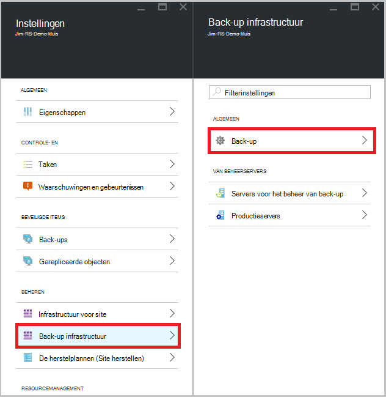

3. Kies de optie replicatie opslag voor uw kluis.

    

    Standaard heeft de kluis geo-redundante opslag. Als u Azure als eindpunt primaire back-up opslaan in een verder gebruik van geo-redundante opslag. Als u Azure als het eindpunt van een niet-primaire back-up opslaan gebruikt, kiest u lokaal redundante opslag, waarmee de kosten van het opslaan van gegevens in Azure wordt beperkt. Meer informatie over [geo-redundante](../storage/storage-redundancy.md#geo-redundant-storage) en [lokaal redundante](../storage/storage-redundancy.md#locally-redundant-storage) opslagopties in dit [Overzicht](../storage/storage-redundancy.md).

    Nadat u de opslagoptie voor uw kluis, bent u klaar om uw bestanden en mappen koppelen aan de kluis.

Nu dat u een kluis hebt gemaakt, kunt u uw back-up van bestanden en mappen door te downloaden en installeren van de agent Microsoft Azure Recovery Services, kluis referenties downloaden en vervolgens deze referenties te gebruiken voor het registreren van de agent met de kluis-infrastructuur voorbereiden.

## Stap 2 - bestanden downloaden

>[AZURE.NOTE] Door back-ups via de portal Azure is binnenkort beschikbaar. Op dit moment met de Microsoft Azure Services herstelagent op ruimten kunt u back-up van uw bestanden en mappen.

1. Klik op **Instellingen** op het dashboard Recovery Services kluis.

    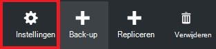

2. Klik op **aan de slag > back-up** op het blad van de instellingen.

    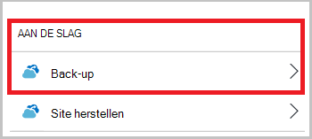

3. Klik op **back-up doel** op het blad van de back-up.

    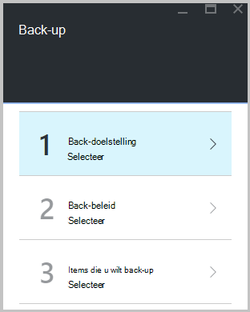

4. Selecteer **On-premises** waarvandaan het is uw werkbelasting uitgevoerd? menu.

5. Selecteer de **bestanden en mappen** vanuit de pagina wat u wilt wilt back-up? menu en klik op **OK**.

#### De agent Recovery Services downloaden

1. Klik in de blade **-infrastructuur voorbereiden** op **Agent downloaden voor Windows Server of Windows-Client** .

    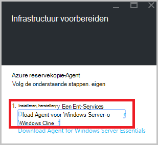

2. Klik op **Opslaan** in het pop-upmenu voor downloaden. Het bestand **MARSagentinstaller.exe** wordt standaard opgeslagen in de map Downloads.

#### Kluis referenties downloaden

1. Klik op **downloaden > opslaan** op het blad van de infrastructuur voorbereiden.

    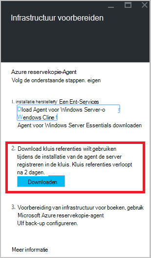

## Stap 3 - installeren en registreren van de agent

1. Zoek en dubbelklik op de **MARSagentinstaller.exe** uit de map Downloads (of een andere locatie is opgeslagen).

2. Voer de Microsoft Azure Services Setup Wizard herstelagent. Als u de wizard hebt voltooid, moet u:

    - Kies een locatie voor de installatie en het cache-map.
    - Geef uw proxy server info als u een proxyserver gebruikt om verbinding met het internet.
    - Uw gebruikersnaam en wachtwoord nadere bijzonderheden te geven als u een geverifieerde proxy gebruikt.
    - De referenties van de gedownloade kluis
    - De wachtwoordzin codering op een veilige locatie opslaan.

    >[AZURE.NOTE] Als u de wachtwoordzin vergeet of verliest, helpen niet Microsoft herstellen van de back-upgegevens. Sla het bestand op een veilige locatie. Het is vereist voor het terugzetten van een back-up.

De agent is nu geïnstalleerd en uw computer is geregistreerd op de kluis. Bent u klaar om te configureren en uw back-up plannen.

### Bevestig de installatie

Om te bevestigen dat de agent is geïnstalleerd en correct is geregistreerd, kunt u voor de items die u in de sectie **Productie-Server** van de beheerportal voor van back-up controleren. Om dit te doen:

1. Log in om de [Azure Portal](https://portal.azure.com/) met behulp van uw abonnement op Azure.

2. Klik op **Bladeren** en typ in de lijst met resources **Recovery Services**in het menu Hub. Als u te typen begint, de lijst wordt gefilterd op basis van uw invoer. Klik op **kluizen Recovery Services**.

      

    De lijst van kluizen Recovery Services wordt weergegeven.

2. Selecteer de naam van de kluis die u hebt gemaakt.

    De blade Recovery Services kluis dashboard wordt geopend.

    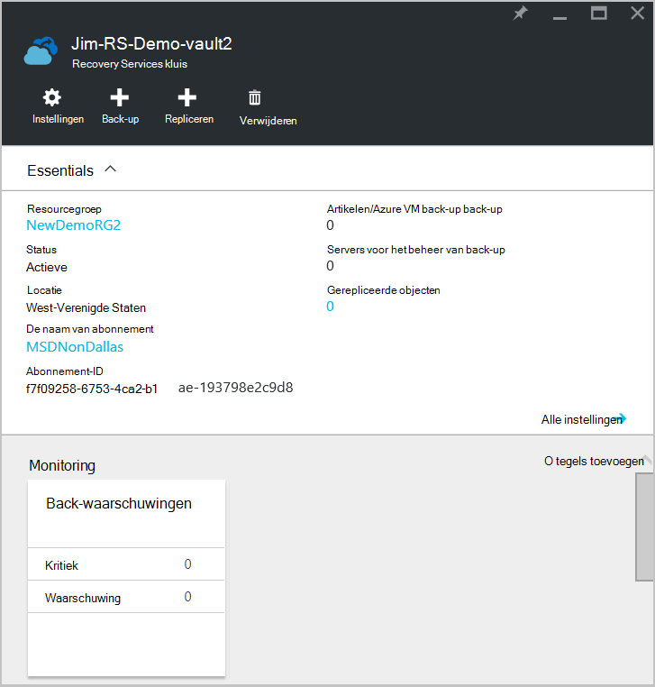  

3. Klik op de knop **Instellingen** boven aan de pagina.

4. Klik op **een back-up infrastructuur > productieservers**.

    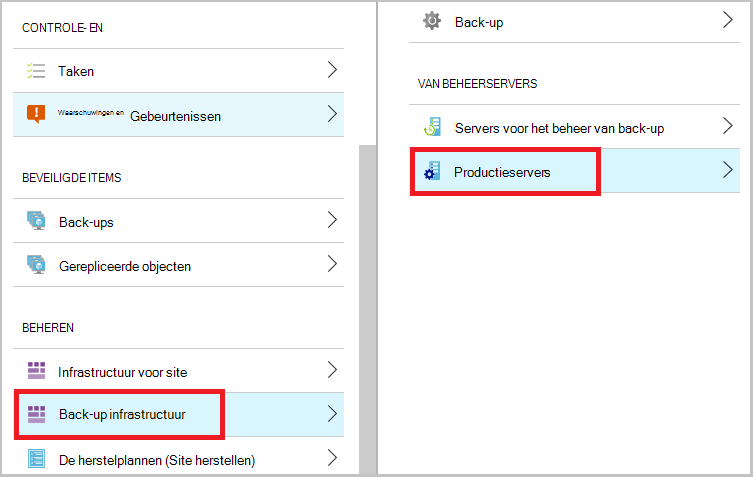

Als u de servers in de lijst ziet, kunt u bevestigen dat de agent is geïnstalleerd en correct geregistreerd hebben.

## Stap 4: De eerste back-up voltooien

De eerste back-up bevat twee belangrijke taken:

- De back-up plannen
- Back-up van bestanden en mappen voor de eerste keer

Als u de eerste back-up wilt u de reservekopie-agent Microsoft Azure.

### De back-up plannen

1. Open de Microsoft Azure Backup agent. Deze kunt u vinden door te zoeken op uw computer **Microsoft Azure back-up**.

    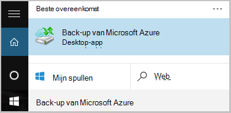

2. In de reservekopie-agent, klikt u op **Back-up plannen**.

    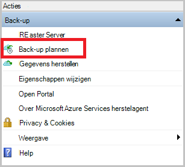

3. Klik op **volgende**op de pagina Introductie van de Wizard Back.

4. Klik op Items selecteren op de pagina back-up op **Items toevoegen**.

5. Selecteer de bestanden en mappen die u back wilt-up maken en klik vervolgens op **OK**.

6. Klik op **volgende**.

7. Het **back-upschema** en klik op **volgende**op de pagina **Back-upschema opgeven** .

    U kunt dagelijks (met een maximale snelheid van drie keer per dag) of een wekelijkse back-ups plannen.

    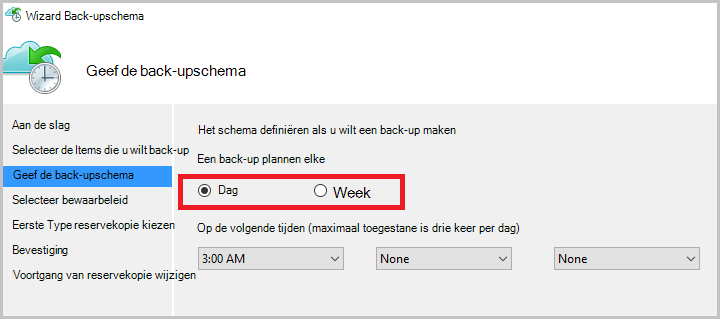

    >[AZURE.NOTE] Zie het artikel [Gebruik Azure back-up vervangt uw tape-infrastructuur](backup-azure-backup-cloud-as-tape.md)voor meer informatie over het opgeven van het back-upschema.

8. Selecteer op de pagina **Selecteer bewaarbeleid** het **Bewaarbeleid** voor de back-up.

    Het bewaarbeleid bevat de duur waarvoor de back-up wordt opgeslagen. In plaats van gewoon "flat policy" voor alle punten van de back-up op te geven, kunt u verschillende bewaarbeleid op basis van wanneer de back-up. U kunt de dagelijkse, wekelijkse, maandelijkse en jaarlijkse bewaarbeleid aan uw behoeften wijzigen.

9. Kies de eerste type back-up op de pagina Kies eerste back-uptype. Laat de optie **automatisch via het netwerk** hebt geselecteerd en klik op **volgende**.

    U kunt back-ups automatisch via het netwerk, of kunt u een off line reservekopie. De rest van dit artikel wordt beschreven dat het proces voor het maken van back-automatisch. Als u liever een off line back-up te doen, bekijk de [off line back-up procedure in Azure Backup](backup-azure-backup-import-export.md) -artikel voor meer informatie.

10. Lees de informatie op de pagina bevestigen en klik op **Voltooien**.

11. Na het voltooien van de wizard Back-upschema maken, klikt u op **sluiten**.

### Inschakelen van bandbreedtebeperking (optioneel)

De reservekopie-agent biedt bandbreedtebeperking. Met een gebeurtenisbeperking bepaalt hoe netwerkbandbreedte tijdens de overdracht van gegevens wordt gebruikt. Dit besturingselement is handig als u back wilt-up van gegevens tijdens werkuren, maar niet wilt dat de back-upprocedure te mengen met andere Internet-verkeer. Beperking van toepassing op back-up en terugzetten van activiteiten.

>[AZURE.NOTE] Bandbreedtebeperking is niet beschikbaar in Windows Server 2008 R2 SP1, Windows Server 2008 SP2 of Windows 7 (servicepacks). De functie voor bandbreedteregeling Azure back-up-netwerk voert Quality of Service (QoS) op het lokale besturingssysteem. Hoewel Azure back-up deze besturingssystemen beschermen kunt, werken niet de versie van QoS beschikbaar op deze platforms met bandbreedtebeperking Azure back-up. Bandbreedtebeperking kan worden gebruikt op alle andere [ondersteunde besturingssystemen](backup-azure-backup-faq.md#installation-amp-configuration).

**Bandbreedtebeperking inschakelen**

1. Klik op **Eigenschappen wijzigen**in de reservekopie-agent.

    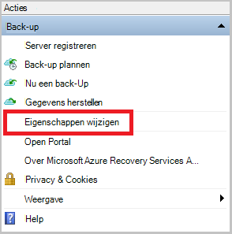

2. Schakel het selectievakje **internet bandbreedtegebruik voor back-upbewerkingen Procesbeperking inschakelen** op het tabblad **Throttling** .

    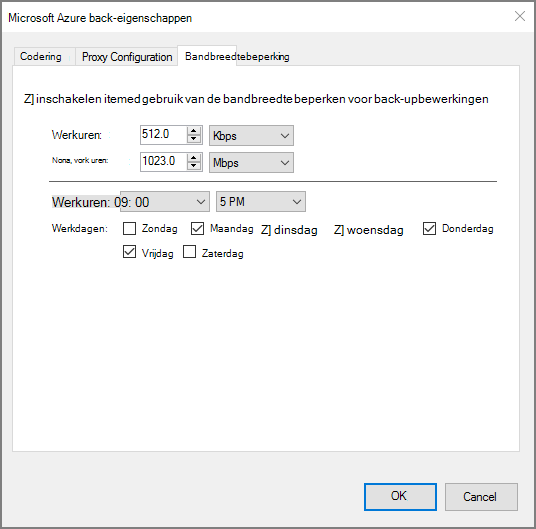

3. Nadat u de bandbreedtebeperking hebt ingeschakeld, geeft u de toegestane bandbreedte voor de overdracht van gegevens met back-up tijdens **werkuren** en **niet-gewerkte uren**.

    De waarden van de bandbreedte begint in 512 kilobits per seconde (Kbps) en maximaal 1023 MB per seconde (MBps) kunnen gaan. Ook geven het begin en einddatum voor **werkuren**en welke dagen van de week worden beschouwd als werkdagen. Uren buiten de aangewezen werk uren worden beschouwd als niet-werk uren.

4. Klik op **OK**.

### Reservekopie maken van bestanden en mappen voor de eerste keer

1. In de reservekopie-agent, klikt u op **Nu een Back-Up maken** om de eerste seeding via het netwerk.

    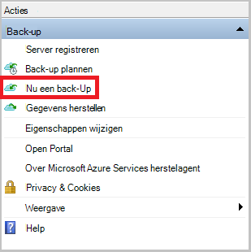

2. Controleer de instellingen die de Wizard Back-Up nu gebruiken wilt voor back-up van de computer op de pagina bevestigen. Klik vervolgens op **Back-Up**.

3. Klik op **sluiten** om de wizard te sluiten. Als u dit doen voordat u het back-upproces is voltooid, blijft de wizard op de achtergrond uitgevoerd.

Nadat de eerste back-up is voltooid, wordt de status **voltooid van de taak** weergegeven in de console van de back-up.

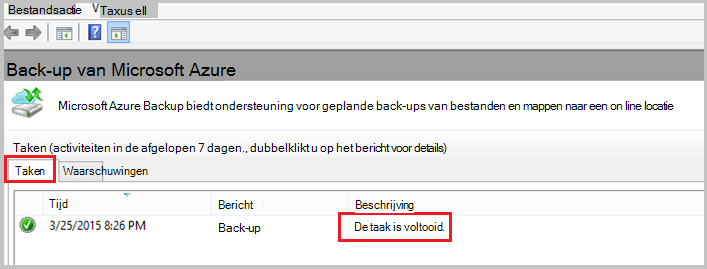

## Heb je vragen?
Als u vragen hebt of als er een functie die u zou willen zien opgenomen, [feedback verzenden](http://aka.ms/azurebackup_feedback).

## Volgende stappen
Zie voor meer informatie over back-ups van VMs of andere werkbelasting:

- Nu dat u hebt back-up van uw bestanden en mappen, kunt u [uw kluizen en servers te beheren](backup-azure-manage-windows-server.md).
- Als u een back-up, gebruik van dit artikel voor het [herstellen van bestanden naar een Windows-computer](backup-azure-restore-windows-server.md).
