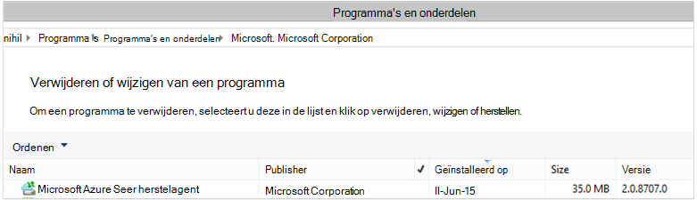

<properties
    pageTitle="Azure een back-up - implementeren en beheren voor DPM met PowerShell terug | Microsoft Azure"
    description="Meer informatie over het implementeren en beheren van back-up Azure voor Data Protection Manager (DPM) met PowerShell"
    services="backup"
    documentationCenter=""
    authors="NKolli1"
    manager="shreeshd"
    editor=""/>

<tags
    ms.service="backup"
    ms.workload="storage-backup-recovery"
    ms.tgt_pltfrm="na"
    ms.devlang="na"
    ms.topic="article"
    ms.date="09/01/2016"
    ms.author="jimpark; anuragm;trinadhk;markgal"/>


# <a name="deploy-and-manage-backup-to-azure-for-data-protection-manager-dpm-servers-using-powershell"></a>Implementeren en beheren van back-up Azure voor Data Protection Manager (DPM) servers met PowerShell

> [AZURE.SELECTOR]
- [ARM](backup-dpm-automation.md)
- [Klassiek](backup-dpm-automation-classic.md)

In dit artikel wordt beschreven hoe u met behulp van back-Azure setup op een server DPM PowerShell en back-up en herstel te beheren.

## <a name="setting-up-the-powershell-environment"></a>De PowerShell-omgeving instellen

[AZURE.INCLUDE [learn-about-deployment-models](../../includes/learn-about-deployment-models-include.md)]

Voordat u PowerShell gebruiken kunt voor het beheren van back-ups van Data Protection Manager naar Azure, moet u de juiste omgeving hebben in PowerShell. Ervoor zorgen dat u de volgende opdracht om de juiste modules importeren en kunt u correct verwijst naar de DPM-cmdlets worden uitgevoerd aan het begin van de PowerShell-sessie:

```
PS C:> & "C:\Program Files\Microsoft System Center 2012 R2\DPM\DPM\bin\DpmCliInitScript.ps1"

Welcome to the DPM Management Shell!

Full list of cmdlets: Get-Command
Only DPM cmdlets: Get-DPMCommand
Get general help: help
Get help for a cmdlet: help <cmdlet-name> or <cmdlet-name> -?
Get definition of a cmdlet: Get-Command <cmdlet-name> -Syntax
Sample DPM scripts: Get-DPMSampleScript
```

## <a name="setup-and-registration"></a>Installatie en registratie
Om te beginnen:

1. [Nieuwste PowerShell downloaden](https://github.com/Azure/azure-powershell/releases) (minimaal vereiste versie is: 1.0.0)
2. De back-up Azure commandlets inschakelen door over te schakelen naar de modus *AzureResourceManager* met behulp van de **Schakeloptie-AzureMode** -commandlet:

```
PS C:\> Switch-AzureMode AzureResourceManager
```

De volgende taken voor de installatie en registratie kunnen worden geautomatiseerd met PowerShell:

- Maak een kluis Recovery Services
- De Azure Backup agent installeren
- Met de back-up Azure service registreren
- Netwerkinstellingen
- Coderingsinstellingen

## <a name="create-a-recovery-services-vault"></a>Maak een kluis recovery services

De volgende stappen leiden u door het maken van een kluis Recovery Services. Een kluis Recovery Services is anders dan een back-up kluis.

1. Als u back-up Azure voor de eerste keer gebruikt, moet u de **Register-AzureRMResourceProvider** -cmdlet de Azure Recovery Service provider registreren bij uw abonnement.

    ```
    PS C:\> Register-AzureRmResourceProvider -ProviderNamespace "Microsoft.RecoveryServices"
    ```

2. De kluis Recovery Services is een bron van de ARM, dus u hoeft te plaatsen binnen een resourcegroep. U kunt een bestaande bronnengroep gebruiken of een nieuwe maken. Wanneer u een nieuwe groep maakt, geeft u de naam en locatie voor de resourcegroep.  

    ```
    PS C:\> New-AzureRmResourceGroup –Name "test-rg" –Location "West US"
    ```

3. Gebruik de cmdlet **New-AzureRmRecoveryServicesVault** voor het maken van een nieuwe kluis. Zorg ervoor dat het dezelfde locatie opgeven voor de kluis als is gebruikt voor de resourcegroep.

    ```
    PS C:\> New-AzureRmRecoveryServicesVault -Name "testvault" -ResourceGroupName " test-rg" -Location "West US"
    ```

4. Geef het type opslag redundantie te gebruiken; u kunt [Lokaal redundante opslag (LRS)](../storage/storage-redundancy.md#locally-redundant-storage) of [Geo-redundante opslag (GRS)](../storage/storage-redundancy.md#geo-redundant-storage). In het volgende voorbeeld ziet u dat de optie - BackupStorageRedundancy voor testVault is ingesteld op GeoRedundant.

    > [AZURE.TIP] Het object Recovery Services kluis vereist veel Azure Backup-cmdlets als invoer. Daarom is het handig voor het opslaan van de back-up Recovery Services vault-object in een variabele.

    ```
    PS C:\> $vault1 = Get-AzureRmRecoveryServicesVault –Name "testVault"
    PS C:\> Set-AzureRmRecoveryServicesBackupProperties  -vault $vault1 -BackupStorageRedundancy GeoRedundant
    ```


## <a name="view-the-vaults-in-a-subscription"></a>Bekijk de kluizen in een abonnement
**Get-AzureRmRecoveryServicesVault** gebruiken om de lijst weergeven met alle kluizen in het huidige abonnement. U kunt deze opdracht gebruiken om te controleren of een nieuwe kluis is gemaakt, of om te zien welke kluizen beschikbaar zijn in het abonnement.

Voert u de opdracht Get-AzureRmRecoveryServicesVault en alle kluizen in het abonnement worden vermeld.

```
PS C:\> Get-AzureRmRecoveryServicesVault
Name              : Contoso-vault
ID                : /subscriptions/1234
Type              : Microsoft.RecoveryServices/vaults
Location          : WestUS
ResourceGroupName : Contoso-docs-rg
SubscriptionId    : 1234-567f-8910-abc
Properties        : Microsoft.Azure.Commands.RecoveryServices.ARSVaultProperties
```


## <a name="installing-the-azure-backup-agent-on-a-dpm-server"></a>De Azure Backup agent installeren op een Server DPM
Voordat u de back-up Azure agent installeert, moet u het installatieprogramma is gedownload en aanwezig zijn op de Windows Server. U kunt de meest recente versie van het installatieprogramma van het [Microsoft Downloadcentrum](http://aka.ms/azurebackup_agent) of vanaf de dashboardpagina Recovery Services-kluis. Opslaan in een gemakkelijk toegankelijke locatie, zoals het installatieprogramma * C:\Downloads\*.

Als de agent hebt geïnstalleerd, moet u de volgende opdracht uitvoeren in een verhoogde PowerShell console **op de DPM-server**:

```
PS C:\> MARSAgentInstaller.exe /q
```

Hiermee installeert u de agent met de standaardopties. De installatie duurt een paar minuten op de achtergrond. Als u niet de optie */nu* opent het venster **Windows Update** aan het einde van de installatie om te controleren op updates.

De agent weergegeven in de lijst met geïnstalleerde programma's. Ga naar **Het Configuratiescherm**om te zien in de lijst met geïnstalleerde programma's, > **programma's** > **programma's en onderdelen**.



### <a name="installation-options"></a>Installatie-opties
Overzicht van alle opties die beschikbaar zijn via de opdrachtregel gebruiken met de volgende opdracht:

```
PS C:\> MARSAgentInstaller.exe /?
```

De volgende opties zijn beschikbaar:

| Optie | Details | Standaard |
| ---- | ----- | ----- |
| /q | Stille installatie | - |
| / p: "vestiging" | Het pad naar de installatiemap voor de agent Azure back-up. | C:\Program Files\Microsoft Azure Services herstelagent |
| / s: 'locatie' | Het pad naar de map voor de back-up Azure-agent. | C:\Program Files\Microsoft Azure Recovery Services Agent\Scratch |
| /m | Opt-in voor Microsoft Update | - |
| /nu | Niet controleren op updates nadat de installatie is voltooid | - |
| /d | Hiermee verwijdert u de herstelagent Services Microsoft Azure | - |
| /pH | Proxy-adres van Host | - |
| /PO | Proxy Host poort nummer | - |
| /Pu | Proxy Host gebruikersnaam | - |
| /PW | Proxywachtwoord | - |

## <a name="registering-dpm-to-a-recovery-services-vault"></a>Services registreren DPM naar een herstel-kluis

Nadat u de kluis Recovery Services hebt gemaakt, download de meest recente agent en de referenties van de kluis en sla deze op een handige locatie op als C:\Downloads.

```
PS C:\> $credspath = "C:\downloads"
PS C:\> $credsfilename = Get-AzureRmRecoveryServicesVaultSettingsFile -Backup -Vault $vault1 -Path  $credspath
PS C:\> $credsfilename
C:\downloads\testvault\_Sun Apr 10 2016.VaultCredentials
```

Voer de cmdlet [Start OBRegistration](https://technet.microsoft.com/library/hh770398%28v=wps.630%29.aspx) voor het registreren van de machine met de kluis op de DPM-server.

```
PS C:\> $cred = $credspath + $credsfilename
PS C:\> Start-OBRegistration-VaultCredentials $cred -Confirm:$false
CertThumbprint      :7a2ef2caa2e74b6ed1222a5e89288ddad438df2
SubscriptionID      : ef4ab577-c2c0-43e4-af80-af49f485f3d1
ServiceResourceName: testvault
Region              :West US
Machine registration succeeded.
```

### <a name="initial-configuration-settings"></a>Configuratie-instellingen
Zodra de DPM-Server is geregistreerd bij de kluis Recovery Services, wordt gestart met de standaardinstellingen van het abonnement. Deze instellingen voor abonnement zijn netwerken, codering en de Staging-ruimte. U moet eerst een greep van de bestaande instellingen (standaard) die met de cmdlet [Get-DPMCloudSubscriptionSetting](https://technet.microsoft.com/library/jj612793) abonnementsinstellingen wijzigen:

```
$setting = Get-DPMCloudSubscriptionSetting -DPMServerName "TestingServer"
```

Alle wijzigingen worden aangebracht in dit lokale PowerShell-object ```$setting``` en vervolgens het volledige object hecht aan DPM en Azure back-up wilt opslaan met de cmdlet [Set-DPMCloudSubscriptionSetting](https://technet.microsoft.com/library/jj612791) . Moet u de ```–Commit``` vlag om ervoor te zorgen dat de wijzigingen worden doorgevoerd. De instellingen worden niet toegepast en gebruikt door back-up Azure tenzij vastgelegd.

```
PS C:\> Set-DPMCloudSubscriptionSetting -DPMServerName "TestingServer" -SubscriptionSetting $setting -Commit
```

## <a name="networking"></a>Netwerken
Als de verbinding van de machine DPM naar de back-up Azure service op het internet via een proxy-server, moeten de proxy-instellingen voor een geslaagde back-ups worden verstrekt. Dit gebeurt met behulp van de ```-ProxyServer```en ```-ProxyPort```, ```-ProxyUsername``` en de ```ProxyPassword``` parameters met de cmdlet [Set-DPMCloudSubscriptionSetting](https://technet.microsoft.com/library/jj612791) . In dit voorbeeld is het geen proxyserver zodat we geen proxy-gerelateerde informatie expliciet wordt gewist.

```
PS C:\> Set-DPMCloudSubscriptionSetting -DPMServerName "TestingServer" -SubscriptionSetting $setting -NoProxy
```

Bandbreedtegebruik kan ook worden beheerd met opties van ```-WorkHourBandwidth``` en ```-NonWorkHourBandwidth``` voor een bepaald aantal dagen van de week. In dit voorbeeld zijn we niet een beperking instellen.

```
PS C:\> Set-DPMCloudSubscriptionSetting -DPMServerName "TestingServer" -SubscriptionSetting $setting -NoThrottle
```

## <a name="configuring-the-staging-area"></a>Configureren van de staging-ruimte
De back-up Azure-agent op de DPM-server moet tijdelijke opslag voor gegevens uit de cloud (lokale faseringsgebied) hersteld. Configureer de staging-ruimte met de cmdlet [Set-DPMCloudSubscriptionSetting](https://technet.microsoft.com/library/jj612791) en de ```-StagingAreaPath``` parameter.

```
PS C:\> Set-DPMCloudSubscriptionSetting -DPMServerName "TestingServer" -SubscriptionSetting $setting -StagingAreaPath "C:\StagingArea"
```

In het voorbeeld wordt de staging-ruimte wordt ingesteld op *C:\StagingArea* in de PowerShell-object ```$setting```. Zorg ervoor dat de opgegeven map bestaat al, anders mislukt de laatste doorvoeren van de instellingen van het abonnement.


### <a name="encryption-settings"></a>Coderingsinstellingen
De back-upgegevens verzonden naar Azure back-up is gecodeerd ter bescherming van de vertrouwelijkheid van de gegevens. De codering wachtwoordzin is 'wachtwoord' voor het decoderen van de gegevens op het moment van herstel. Het is belangrijk om deze gegevens veilig en beveiligd als deze eenmaal is ingesteld.

In het onderstaande voorbeeld wordt de eerste opdracht de tekenreeks converteren naar ```passphrase123456789``` voor veilige string en wijst de beveiligde tekenreeks aan de variabele met de naam ```$Passphrase```. de tweede opdracht stelt de beveiligde tekenreeks in ```$Passphrase``` als het wachtwoord voor het coderen van back-ups.

```
PS C:\> $Passphrase = ConvertTo-SecureString -string "passphrase123456789" -AsPlainText -Force

PS C:\> Set-DPMCloudSubscriptionSetting -DPMServerName "TestingServer" -SubscriptionSetting $setting -EncryptionPassphrase $Passphrase
```

> [AZURE.IMPORTANT] De wachtwoordzin gegevens veilig bewaren als deze eenmaal is ingesteld. Niet mogelijk om gegevens te herstellen van Azure zonder deze wachtwoordzin.

Op dit punt, u moet hebt aangebracht de vereiste wijzigingen in de ```$setting``` object. Vergeet niet de wijzigingen doorvoeren.

```
PS C:\> Set-DPMCloudSubscriptionSetting -DPMServerName "TestingServer" -SubscriptionSetting $setting -Commit
```

## <a name="protect-data-to-azure-backup"></a>Bescherming van gegevens naar Azure back-up
In dit gedeelte vindt u een productieserver toevoegen aan DPM en vervolgens de gegevens naar de lokale opslag van DPM, en vervolgens naar Azure back-up te beschermen. In de voorbeelden wordt gedemonstreerd hoe u een back-up van bestanden en mappen. De logica kan eenvoudig worden uitgebreid voor back-up van een willekeurige gegevensbron met DPM ondersteund. Alle DPM back-ups worden geregeld door een bescherming groep (PG) met vier delen:

1. **Leden van de groep** is een lijst van alle voor objecten (ook bekend als *Datasources* in DPM) die u wilt beschermen in dezelfde groep bescherming. U wilt bijvoorbeeld bescherming van productie VMs in één groep voor bescherming en SQL Server-databases in een andere groep van bescherming hebben verschillende back-upvereisten. Voordat u kunt back-up van een gegevensbron op een productieserver moet u ervoor zorgen dat wordt de DPM Agent is geïnstalleerd op de server en wordt beheerd door de DPM. Volg de stappen voor het [installeren van de DPM Agent](https://technet.microsoft.com/library/bb870935.aspx) en deze koppelen aan de juiste DPM-Server.
2. **Data protection-methode** geeft het doel back-uplocaties - tape, schijf en cloud. In ons voorbeeld beveiligen we gegevens naar de lokale schijf en naar de cloud.
3. Een **back-upschema** dat aangeeft wanneer de back-ups moeten worden genomen en hoe vaak de gegevens moeten worden gesynchroniseerd tussen de DPM-Server en de productieserver.
4. Een **bewaarschema** geeft aan hoe lang herstel punten in Azure behouden.

### <a name="creating-a-protection-group"></a>Maken van een groep voor de bescherming
Begint met het maken van een nieuwe bescherming groep met de cmdlet [New-DPMProtectionGroup](https://technet.microsoft.com/library/hh881722) .

```
PS C:\> $PG = New-DPMProtectionGroup -DPMServerName " TestingServer " -Name "ProtectGroup01"
```

De bovenstaande cmdlet maakt een bescherming groep met de naam *ProtectGroup01*. Een bestaande groep voor de bescherming kan ook later worden gewijzigd als u wilt back-up naar de cloud Azure toevoegen. Echter alle wijzigingen wilt aanbrengen in de groep bescherming - nieuwe of bestaande - moeten we een greep krijgen op een *kan worden gewijzigd* met de cmdlet [Get-DPMModifiableProtectionGroup](https://technet.microsoft.com/library/hh881713) -object.

```
PS C:\> $MPG = Get-ModifiableProtectionGroup $PG
```

### <a name="adding-group-members-to-the-protection-group"></a>Leden van de groep toe te voegen aan de groep voor de bescherming
Elke DPM Agent weet de lijst met gegevensbronnen op de server waarop het product is geïnstalleerd. Een gegevensbron toevoegen aan de groep voor de bescherming, moet de DPM Agent eerst een lijst van de gegevensbronnen sturen naar de DPM-server. Een of meer gegevensbronnen worden vervolgens geselecteerd en toegevoegd aan de groep bescherming. De PowerShell stappen die hiervoor nodig zijn:

1. Een lijst met alle servers die worden beheerd door de DPM via de DPM Agent ophalen.
2. Kies een specifieke server.
3. Een lijst met alle gegevensbronnen op de server ophalen.
4. Kies een of meer gegevensbronnen en deze toevoegen aan de groep voor de bescherming

De lijst met servers waarop de DPM Agent is geïnstalleerd en wordt beheerd door de DPM-Server wordt verkregen met de cmdlet [Get-DPMProductionServer](https://technet.microsoft.com/library/hh881600) . In dit voorbeeld wordt filteren en alleen PS configureren met de naam *productionserver01* voor back-up.

```
PS C:\> $server = Get-ProductionServer -DPMServerName "TestingServer" | where {($_.servername) –contains “productionserver01”
```

Haal nu de lijst met gegevensbronnen op ```$server``` met de cmdlet [Get-DPMDatasource](https://technet.microsoft.com/library/hh881605) . In dit voorbeeld zijn we filteren voor het volume D: *\* die wij configureren voor back-up wilt maken. Deze gegevensbron wordt vervolgens toegevoegd aan de groep van de bescherming met de cmdlet [Add-DPMChildDatasource](https://technet.microsoft.com/library/hh881732) . Gebruik de *kan worden gewijzigd * protection group-object ```$MPG``` om de toevoegingen.

```
PS C:\> $DS = Get-Datasource -ProductionServer $server -Inquire | where { $_.Name -contains “D:\” }

PS C:\> Add-DPMChildDatasource -ProtectionGroup $MPG -ChildDatasource $DS
```

Herhaal deze stap zo vaak als nodig is, totdat u alle gekozen gegevensbronnen hebt toegevoegd aan de groep bescherming. U kunt beginnen met een gegevensbron, en voltooien van de werkstroom voor het maken van de groep voor de bescherming en toevoegen op een later moment meer gegevensbronnen aan de groep bescherming.

### <a name="selecting-the-data-protection-method"></a>De methode van de bescherming van gegevens selecteren
Als de gegevensbronnen zijn toegevoegd aan de groep voor de bescherming, is de volgende stap geeft u de beveiligingsmethode met de cmdlet [Set-DPMProtectionType](https://technet.microsoft.com/library/hh881725) . In dit voorbeeld is de groep bescherming voor lokale schijf en de cloud back-up. Ook moet u de gegevensbron die u wilt beveiligen naar de cloud met de cmdlet [Add-DPMChildDatasource](https://technet.microsoft.com/library/hh881732.aspx) - vlag Online opgeven.

```
PS C:\> Set-DPMProtectionType -ProtectionGroup $MPG -ShortTerm Disk –LongTerm Online
PS C:\> Add-DPMChildDatasource -ProtectionGroup $MPG -ChildDatasource $DS –Online
```

### <a name="setting-the-retention-range"></a>Het instellen van het bereik bewaren
De inhouding voor de back-punten met de cmdlet [Set-DPMPolicyObjective](https://technet.microsoft.com/library/hh881762) instellen. Wanneer kan het lijken alsof de inhouding instellen voordat u het back-upschema zijn gedefinieerd, met oneven de ```Set-DPMPolicyObjective``` cmdlet wordt automatisch een standaard back-upschema die vervolgens kan worden gewijzigd. Het is altijd mogelijk om de back-up plannen eerst instellen en het bewaarbeleid na.

In het volgende voorbeeld stelt de cmdlet de inhouding-parameters voor schijf back-ups. Hierdoor behoudt de back-ups voor 10 dagen en synchronisatie van gegevens elke 6 uur tussen de productie en de DPM-server. De ```SynchronizationFrequencyMinutes``` niet bepalen hoe vaak een back-up is gemaakt, maar hoe vaak de gegevens worden gekopieerd naar de DPM-server.  Deze instelling voorkomt u dat back-ups te groot.

```
PS C:\> Set-DPMPolicyObjective –ProtectionGroup $MPG -RetentionRangeInDays 10 -SynchronizationFrequencyMinutes 360
```

Voor back-ups naar Azure (DPM verwijst naar deze als on line back-ups) de inhouding bereiken kunnen worden geconfigureerd voor de [lange termijn bewaren met behulp van een schema opa-vader-zoon (GFS)](backup-azure-backup-cloud-as-tape.md). Dat wil zeggen, kunt u een gecombineerde bewaarbeleid met betrekking tot de dagelijkse, wekelijkse, maandelijkse en jaarlijkse bewaarbeleid. In dit voorbeeld we een matrix die de handhaving van complexe regeling die we willen maken en configureer vervolgens de inhouding bereik met de cmdlet [Set-DPMPolicyObjective](https://technet.microsoft.com/library/hh881762) .

```
PS C:\> $RRlist = @()
PS C:\> $RRList += (New-Object -TypeName Microsoft.Internal.EnterpriseStorage.Dls.UI.ObjectModel.OMCommon.RetentionRange -ArgumentList 180, Days)
PS C:\> $RRList += (New-Object -TypeName Microsoft.Internal.EnterpriseStorage.Dls.UI.ObjectModel.OMCommon.RetentionRange -ArgumentList 104, Weeks)
PS C:\> $RRList += (New-Object -TypeName Microsoft.Internal.EnterpriseStorage.Dls.UI.ObjectModel.OMCommon.RetentionRange -ArgumentList 60, Month)
PS C:\> $RRList += (New-Object -TypeName Microsoft.Internal.EnterpriseStorage.Dls.UI.ObjectModel.OMCommon.RetentionRange -ArgumentList 10, Years)
PS C:\> Set-DPMPolicyObjective –ProtectionGroup $MPG -OnlineRetentionRangeList $RRlist
```

### <a name="set-the-backup-schedule"></a>Het back-upschema instellen
DPM een standaard back-upschema wordt automatisch ingesteld als u opgeeft dat de bescherming objectief met behulp van de ```Set-DPMPolicyObjective``` cmdlet. Met de cmdlet [Get-DPMPolicySchedule](https://technet.microsoft.com/library/hh881749) is gevolgd door de cmdlet [Set-DPMPolicySchedule](https://technet.microsoft.com/library/hh881723) wijzigt u de standaard-schema's.

```
PS C:\> $onlineSch = Get-DPMPolicySchedule -ProtectionGroup $mpg -LongTerm Online
PS C:\> Set-DPMPolicySchedule -ProtectionGroup $MPG -Schedule $onlineSch[0] -TimesOfDay 02:00
PS C:\> Set-DPMPolicySchedule -ProtectionGroup $MPG -Schedule $onlineSch[1] -TimesOfDay 02:00 -DaysOfWeek Sa,Su –Interval 1
PS C:\> Set-DPMPolicySchedule -ProtectionGroup $MPG -Schedule $onlineSch[2] -TimesOfDay 02:00 -RelativeIntervals First,Third –DaysOfWeek Sa
PS C:\> Set-DPMPolicySchedule -ProtectionGroup $MPG -Schedule $onlineSch[3] -TimesOfDay 02:00 -DaysOfMonth 2,5,8,9 -Months Jan,Jul
PS C:\> Set-DPMProtectionGroup -ProtectionGroup $MPG
```

In het bovenstaande voorbeeld ```$onlineSch``` is een matrix met vier elementen, met de bestaande planning on line beveiliging voor de groep bescherming in de algemene regeling:

1. ```$onlineSch[0]```bevat de dagelijkse planning
2. ```$onlineSch[1]```bevat de weekplanning
3. ```$onlineSch[2]```bevat het maandelijkse schema
4. ```$onlineSch[3]```de jaarlijkse planning bevat

Dus als u de wekelijkse planning wijzigen, u verwijzen moet naar de ```$onlineSch[1]```.

### <a name="initial-backup"></a>Eerste back-up
Als back-ups van een gegevensbron voor de eerste keer, DPM behoeften eerste replica maakt dat maakt een volledige kopie van de gegevensbron moet worden beschermd op DPM replica volume. Deze activiteit kan ofwel worden gepland voor een bepaalde tijd of kan worden geactiveerd handmatig, met behulp van de cmdlet [Set-DPMReplicaCreationMethod](https://technet.microsoft.com/library/hh881715) met de parameter ```-NOW```.

```
PS C:\> Set-DPMReplicaCreationMethod -ProtectionGroup $MPG -NOW
```
### <a name="changing-the-size-of-dpm-replica--recovery-point-volume"></a>De grootte van de DPM Replica & herstel punt volume wijzigen
Verder kunt u de grootte van het volume van DPM Replica en de schaduwkopie van volume met de cmdlet [Set-DPMDatasourceDiskAllocation](https://technet.microsoft.com/library/hh881618.aspx) zoals in het volgende voorbeeld: Get DatasourceDiskAllocation Datasource - Set $DS-DatasourceDiskAllocation - Datasource $DS - ProtectionGroup $MPG-handmatige - ReplicaArea (2 gb) - ShadowCopyArea (2 gb)

### <a name="committing-the-changes-to-the-protection-group"></a>Doorvoeren van de wijzigingen aan de groep voor de bescherming
Tot slot moeten de wijzigingen worden doorgevoerd voordat de back-up per de nieuwe groepsconfiguratie bescherming door DPM kan worden. Dit kan worden bereikt met de cmdlet [Set-DPMProtectionGroup](https://technet.microsoft.com/library/hh881758) .

```
PS C:\> Set-DPMProtectionGroup -ProtectionGroup $MPG
```
## <a name="view-the-backup-points"></a>De back-up punten weergeven
U kunt de cmdlet [Get-DPMRecoveryPoint](https://technet.microsoft.com/library/hh881746) gebruiken om een lijst van alle punten van het herstel voor een gegevensbron. Wij zullen in het volgende voorbeeld:
- alle PGs op de DPM-server opgehaald en opgeslagen in een matrix```$PG```
- ophalen van de gegevensbronnen die overeenkomt met de```$PG[0]```
- alle punten van het herstel voor een datasource ophalen.

```
PS C:\> $PG = Get-DPMProtectionGroup –DPMServerName "TestingServer"
PS C:\> $DS = Get-DPMDatasource -ProtectionGroup $PG[0]
PS C:\> $RecoveryPoints = Get-DPMRecoverypoint -Datasource $DS[0] -Online
```

## <a name="restore-data-protected-on-azure"></a>Herstel gegevens beveiligd op Azure
Herstellen van gegevens is een combinatie van een ```RecoverableItem``` object en een ```RecoveryOption``` object. In de vorige sectie wij een lijst van de back-punten voor een gegevensbron.

In het onderstaande voorbeeld wordt gedemonstreerd hoe een Hyper-V virtuele machine van Azure back-up terugzetten back-punten in combinatie met het doel voor het herstel. In dit voorbeeld omvat:

- Een hersteloptie die met de cmdlet [New-DPMRecoveryOption](https://technet.microsoft.com/library/hh881592) maken.
- Bezig met ophalen van de matrix van back-punten met behulp van de ```Get-DPMRecoveryPoint``` cmdlet.
- Punt terugzetten vanaf back-up te kiezen.

```
PS C:\> $RecoveryOption = New-DPMRecoveryOption -HyperVDatasource -TargetServer "HVDCenter02" -RecoveryLocation AlternateHyperVServer -RecoveryType Recover -TargetLocation “C:\VMRecovery”

PS C:\> $PG = Get-DPMProtectionGroup –DPMServerName "TestingServer"
PS C:\> $DS = Get-DPMDatasource -ProtectionGroup $PG[0]
PS C:\> $RecoveryPoints = Get-DPMRecoverypoint -Datasource $DS[0] -Online

PS C:\> Restore-DPMRecoverableItem -RecoverableItem $RecoveryPoints[0] -RecoveryOption $RecoveryOption
```

De opdrachten kunnen eenvoudig worden uitgebreid voor elk gegevensbrontype.

## <a name="next-steps"></a>Volgende stappen

- Voor meer informatie over DPM naar Azure back-up Zie [back-up DPM-inleiding](backup-azure-dpm-introduction.md)
