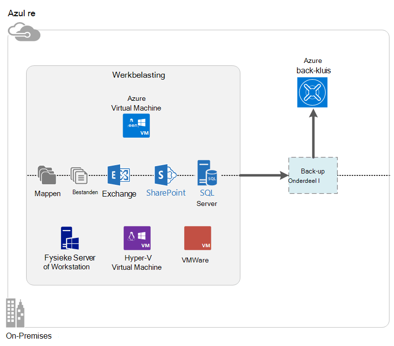

<properties
    pageTitle="Wat is Azure back-up? | Microsoft Azure"
    description="Azure back-up en Recovery Services gebruikt, kunt u back-up en terugzetten van gegevens en toepassingen van Windows-Servers, clientcomputers Windows, System Center DPM servers en Azure virtuele machines."
    services="backup"
    documentationCenter=""
    authors="markgalioto"
    manager="cfreeman"
    editor="tysonn"
    keywords="back-up en herstel. Recovery services; back-upoplossingen"/>

<tags
    ms.service="backup"
    ms.workload="storage-backup-recovery"
    ms.tgt_pltfrm="na"
    ms.devlang="na"
    ms.topic="get-started-article"
    ms.date="10/19/2016"
    ms.author="jimpark; trinadhk"/>

# Wat is Azure back-up?
Azure back-up is de service waarmee u back-up en terugzetten van gegevens in de cloud met Microsoft. Uw bestaande in ruimten of off-site back-upoplossing wordt vervangen door een cloud-gebaseerde oplossing die betrouwbaar, veilig en kosten concurrerend. Ook kan worden voorkomen, activa die worden uitgevoerd in de cloud. Azure back-up biedt recovery services is gebaseerd op een hoogwaardige infrastructuur die schaalbare, duurzaam en uiterst beschikbaar is.

[Bekijk een video-overzicht van Azure back-up](https://azure.microsoft.com/documentation/videos/what-is-azure-backup/)

## Waarom Azure back-up gebruiken?
Traditionele back-upoplossingen hebben ontwikkeld om de cloud behandelen als een eindpunt vergelijkbaar met schijven of tapes. Hoewel deze benadering eenvoudig is, is beperkt. Het is niet volledig profiteren van een onderliggende cloud-platform en vertaald naar een inefficiënte, dure oplossing.
Back-Azure daarentegen biedt alle voordelen van een wolk van krachtige en betaalbare back-upoplossing. Hier zijn enkele van de belangrijkste voordelen van Azure back-up.

| Functie | Voordeel |
| ------- | ------- |
| Automatisch opslagbeheer | Geen kapitaaluitgaven is nodig voor opslagapparaten voor gebouwen. Azure back-up automatisch toegewezen en beheert u back-up opslaan en een verbruik van pay-als-u-use-model wordt gebruikt. |
| Onbeperkt aantal schalen | Profiteren van hoge beschikbaarheid waarborgen zonder de overhead van onderhoud en controle. Azure back-up maakt gebruik van de onderliggende kracht en de schaal van de Azure cloud met haar nonintrusive autoscaling mogelijkheden. |
| Meerdere opties voor opslag | Kies uw back-up opslaan op basis van de noodzaak:<li>Een lokaal redundante opslag blok blob is ideaal voor voordelige klanten en het nog steeds gegevens beter beschermen tegen lokale hardwarestoringen. <li>Een blob geo-replicatie opslag blok biedt drie meer kopieën in een datacenter paren. Deze extra kopieën ervoor te zorgen dat de back-upgegevens maximaal beschikbaar zelfs als een Azure siteniveau ramp plaatsvindt. |
| Onbeperkte gegevensoverdracht | Tijdens een bewerking voor terugzetten uit de back-up kluis is gratis voor alle (uitgaand) egress-gegevensoverdracht. Gegevens voor inkomende Azure is ook gratis. Werkt met de import-service waar het beschikbaar is. |
| Gegevenscodering | Gegevenscodering kan beveiligde overdracht en opslag van gegevens van de klant in het openbare cloud. De codering wachtwoordzin is opgeslagen bij de bron en wordt nooit doorgegeven of opgeslagen in Azure. De coderingssleutel terugzetten van de gegevens is vereist en alleen de klant heeft volledige toegang tot de gegevens in de service. |  
| Toepassing consistent back-up | Toepassing consistent back-ups van Windows ervoor dat correcties niet nodig is op het moment van herstel, waardoor de doelstelling van herstel tijd. Zo kunnen klanten sneller terug te keren naar een actief. |
| Op lange termijn | In plaats van betalen voor externe tapeback-upoplossingen, klanten kan back-up Azure biedt een zeer geschikte tapeback-achtige oplossing tegen een lage prijs. |

## Azure onderdelen van de back-up
Omdat back-up een back-upoplossing hybride is, bestaat uit meerdere onderdelen die samenwerken inschakelen van end-to-end back-up maken en terugzetten van werkstromen.

### Implementatiescenario 's

| Onderdeel | Kan worden geïmplementeerd in Azure? | Kan worden geïmplementeerd op locatie? | Doel-opslag wordt ondersteund|
| --- | --- | --- | --- |
| Azure Backup agent | 
**Ja**
 
De agent Azure back-up kan worden geïmplementeerd op alle Windows Server VM in Azure uitgevoerd.
 | 
**Ja**
 
De Backup agent kan worden geïmplementeerd op alle Windows Server VM of fysieke machine.
 | 
Azure kluis voor back-up
 |
| System Center Data Protection Manager (DPM) | 
**Ja**

Meer informatie over [het beveiligen van de werkbelasting in Azure met behulp van System Center DPM](http://blogs.technet.com/b/dpm/archive/2014/09/02/azure-iaas-workload-protection-using-data-protection-manager.aspx).
 | 
**Ja**
 
Meer informatie over [het beveiligen van de werkbelasting en VMs in uw datacenter](https://technet.microsoft.com/library/hh758173.aspx).
 | 
Lokaal gekoppelde schijf
 
Azure kluis back-up,
 
tape (op-ruimten alleen)
 |
| Azure back-upserver | 
**Ja**

Meer informatie over [het beveiligen van de werkbelasting in Azure met Azure back-up Server](backup-azure-microsoft-azure-backup.md).
 | 
**Ja**
 
Meer informatie over [het beveiligen van de werkbelasting in Azure met Azure back-up Server](backup-azure-microsoft-azure-backup.md).
 | 
Lokaal gekoppelde schijf
 
Azure kluis voor back-up
 |
| Azure back-up (met de extensie VM) | 
**Ja**

Onderdeel van Azure fabric

Speciaal voor [back-up van Azure infrastructuur als een service (IaaS) virtuele machines](backup-azure-vms-introduction.md).
 | 
**Nee**
 
System Center DPM gebruik maken van virtuele machines in uw datacenter.
 | 
Azure kluis voor back-up
 |

### Component niveau voordelen en beperkingen

| Onderdeel | Voordelen | Beperkingen | Herstel granulatie |
| --- | --- | --- | --- |
| Azure agent voor back-up (MARS) | <li>Kan back-up van bestanden en mappen op een computer met Windows-besturingssysteem worden het fysieke of virtuele (VMs kunnen zich overal op de bedrijfsruimten of Azure)<li>Geen aparte back-server is vereist<li>Maakt gebruik van Azure back-kluis | <li>Drie keer een dag back-up of het bestand niveau herstellen<li>Bestand/map/volume niveau herstellen alleen, niet van toepassing op de hoogte<li>Er is geen ondersteuning voor Linux | bestanden/mappen/volumes |
| System Center Data Protection Manager | <li>App op de hoogte van momentopnamen (VSS)<li>Volledige flexibiliteit bij het maken van back-ups<li>Herstel granulatie (alle)<li>Kluis Azure back-up kunt gebruiken<li>Ondersteuning voor Linux (als die worden gehost op Hyper-V) | <li>Ontbreken van heterogene ondersteuning (VMware VM back-up, Oracle werkbelasting back-up).  | bestanden/mappen/volumes / VMs/toepassingen |
| Microsoft Azure back-upserver | <li>App op de hoogte van momentopnamen (VSS)<li>Volledige flexibiliteit bij het maken van back-ups<li>Herstel granulatie (alle)<li>Kluis Azure back-up kunt gebruiken<li>Ondersteuning voor Linux (als die worden gehost op Hyper-V)<li>System Center-licentie vereist niet | <li>Ontbreken van heterogene ondersteuning (VMware VM back-up, Oracle werkbelasting back-up).<li>Altijd vereist live Azure abonnement<li>Er is geen ondersteuning voor tapeback-up | bestanden/mappen/volumes / VMs/toepassingen |
| Azure IaaS VM back-up | <li>Eigen back-ups voor Windows/Linux<li>Geen specifieke agent installatie vereist<li>Fabric niveau backup geen back-up infrastructuur die nodig is | <li>Eenmaal per dag back up of de schijf niveau herstellen<li>Geen back-up van gebouwen | VMs Alle schijven (met PowerShell) |

## Welke toepassingen en werklast kunnen een reservekopie worden?

| Werkbelasting | Broncomputer | Azure-back-upoplossing |
| --- | --- |---|
| Bestanden en mappen | Windows Server | 
[Azure Backup agent](backup-configure-vault.md),
 
[DPM System Center](backup-azure-dpm-introduction.md) (+ de Azure Backup agent)
 
[Azure back-upserver](backup-azure-microsoft-azure-backup.md) (inclusief de Azure Backup agent)
  |
| Bestanden en mappen | Windows-client | 
[Azure Backup agent](backup-configure-vault.md),
 
[DPM System Center](backup-azure-dpm-introduction.md) (+ de Azure Backup agent)
 
[Azure back-upserver](backup-azure-microsoft-azure-backup.md) (inclusief de Azure Backup agent)
  |
| Hyper-V virtuele machine (Windows) | Windows Server | 
[DPM System Center](backup-azure-backup-sql.md) (+ de Azure Backup agent)
 
[Azure back-upserver](backup-azure-microsoft-azure-backup.md) (inclusief de Azure Backup agent)
 |
| Hyper-V virtuele machines (Linux) | Windows Server | 
[DPM System Center](backup-azure-backup-sql.md) (+ de Azure Backup agent)
 
[Azure back-upserver](backup-azure-microsoft-azure-backup.md) (inclusief de Azure Backup agent)
  |
| Microsoft SQL Server | Windows Server | 
[DPM System Center](backup-azure-backup-sql.md) (+ de Azure Backup agent)
 
[Azure back-upserver](backup-azure-microsoft-azure-backup.md) (inclusief de Azure Backup agent)
  |
| Microsoft SharePoint | Windows Server | 
[DPM System Center](backup-azure-backup-sql.md) (+ de Azure Backup agent)
 
[Azure back-upserver](backup-azure-microsoft-azure-backup.md) (inclusief de Azure Backup agent)
   |
| Microsoft Exchange |  Windows Server | 
[DPM System Center](backup-azure-backup-sql.md) (+ de Azure Backup agent)
 
[Azure back-upserver](backup-azure-microsoft-azure-backup.md) (inclusief de Azure Backup agent)
   |
| Azure IaaS VMs (Windows) | - | [Azure back-up (met de extensie VM)](backup-azure-vms-introduction.md) |
| Azure IaaS VMs (Linux) | - | [Azure back-up (met de extensie VM)](backup-azure-vms-introduction.md) |

## Ondersteuning voor ARM en Linux

| Onderdeel | ARM ondersteuning | Linux (Azure geviseerd) ondersteuning |
| --- | --- | --- |
| Azure agent voor back-up (MARS) | Ja | Geen (alleen Windows gebaseerde agent) |
| System Center Data Protection Manager | Ja (Agent in Gast) | Is het mogelijk alleen Hyper-V (niet Azure VM) alleen bestand consistent back-up |
| Azure reserveserver (MAB) | Ja (Agent in Gast) | Alleen is het mogelijk alleen bestand consistent back-up van Hyper-V (niet Azure VM) (gelijk aan DPM) |
| Azure IaaS VM back-up | Ja | Ja |

[AZURE.INCLUDE [learn-about-deployment-models](../../includes/learn-about-deployment-models-include.md)]

## Back-up en herstellen van de premie opslag VMs

De back-up Azure service beschermt nu Premium opslag VMs.

### Back-up van Premium opslag VMs

Tijdens een back-up van de premie opslag VMs, maakt de back-up-service een tijdelijke locatie voor gefaseerde installatie in de rekening van de premie opslag. De tijdelijke locatie, met de naam "AzureBackup-" is gelijk aan de totale grootte van premium schijven aangesloten op de VM.

>[AZURE.NOTE] Wijzigen of bewerken van de tijdelijke locatie.

Nadat de back-uptaak is voltooid, wordt de tijdelijke locatie verwijderd. De prijs van de opslag die wordt gebruikt voor de tijdelijke locatie komt overeen met alle [Premium opslag prijzen](../storage/storage-premium-storage.md#pricing-and-billing).

### Premium opslag VMs herstellen

Premium opslag VM kan worden hersteld naar een Premium opslagmedium of naar normale opslag. Een premie opslag VM herstelpunt herstellen in Premium-opslag is het normale herstel. Het kan echter zijn voordelige standaardopslag een premie opslag VM herstelpunt herstellen. Dit type herstelbewerking kan worden gebruikt als u een subset van bestanden van de VM.

## Functionaliteit
Deze vijf tabellen samenvatten hoe back-upfunctie in elk onderdeel wordt verwerkt.

### Opslag

| Functie | Azure Backup agent | DPM System Center | Azure back-upserver | Azure back-up (met de extensie VM) |
| ------- | --- | --- | --- | ---- |
| Azure kluis voor back-up | ![Ja][green] | ![Ja][green] | ![Ja][green] | ![Ja][green] |
| Schijfopslag | | ![Ja][green] | ![Ja][green] |  |
| Tapeopslag | | ![Ja][green] |  | |
| Compressie (in kluis, back-up) | ![Ja][green] | ![Ja][green]| ![Ja][green] | |
| Incrementele back-up | ![Ja][green] | ![Ja][green] | ![Ja][green] | ![Ja][green] |
| Schijf deduplication | | ![Gedeeltelijk][yellow] | ![Gedeeltelijk][yellow]| | |

De kluis back-up is het beste opslag door alle onderdelen. DPM System Center en back-up Server bieden ook de optie om een kopie van de lokale schijf. System Center DPM alleen biedt echter de optie om gegevens te schrijven naar een tape-opslagapparaat.

#### Incrementele back-up
Elke component ondersteunt incrementele back-up ongeacht het doel opslag (diskette, tape, back-kluis). Incrementele back-up zorgt ervoor dat back-ups tijd efficiënt, en door overdracht alleen de wijzigingen die zijn aangebracht sinds de laatste back-up.

#### Compressie
Back-ups gecomprimeerd om de vereiste opslagruimte. Het enige onderdeel dat geen compressie gebruikt, is de VM-extensie. VM-extensie alle gegevens van de back-up gekopieerd uit de klantrekening opslag om de back-up in hetzelfde gebied zonder deze te comprimeren. Terwijl het licht gaan zonder compressie inflates de opslag gebruikt, zorgt opslaan van de gegevens zonder compressie voor snellere hersteltijden.

#### Deduplication
Deduplication wordt ondersteund voor System Center DPM en back-up Server wanneer deze [geïmplementeerd in een Hyper-V virtuele machine is](http://blogs.technet.com/b/dpm/archive/2015/01/06/deduplication-of-dpm-storage-reduce-dpm-storage-consumption.aspx). Deduplication wordt uitgevoerd op het hostniveau van de met behulp van Windows Server deduplication op virtuele harde schijven (VHD's) die zijn gekoppeld aan de virtuele machine als back-up opslaan.

>[AZURE.WARNING] Deduplication is niet beschikbaar in Azure voor elk van de onderdelen van de back-up. Wanneer System Center DPM en back-up Server in Azure worden gebruikt, kunnen niet de schijven die zijn gekoppeld aan de VM worden deduplicated.

### Beveiliging

| Functie | Azure Backup agent | DPM System Center | Azure back-upserver | Azure back-up (met de extensie VM) |
| ------- | --- | --- | --- | ---- |
| Beveiliging van het netwerk (met Azure) | ![Ja][green] |![Ja][green] | ![Ja][green] | ![Gedeeltelijk][yellow]|
| Beveiliging van gegevens (in Azure) | ![Ja][green] |![Ja][green] | ![Ja][green] | ![Gedeeltelijk][yellow]|

Verkeer van alle back-up van uw servers om de back-up is gecodeerd met behulp van geavanceerde codering standaard 256. De gegevens worden verzonden via een beveiligde HTTPS-verbinding. De back-upgegevens wordt ook opgeslagen in de back-up kluis in gecodeerde vorm. Alleen de klant bevat de wachtwoordzin ontgrendelen van deze gegevens. Microsoft kan niet de back-upgegevens op elk gewenst moment te decoderen.

>[AZURE.WARNING] De sleutel voor het versleutelen van de gegevens van de back-up is alleen met de klant aanwezig. Microsoft houdt niet bij een kopie in Azure en heeft geen toegang tot de sleutel. Als de sleutel verkeerd invoert herstellen niet Microsoft back-upgegevens.

Back-ups van Azure VMs moet het instellen van de codering *in* de virtuele machine. BitLocker gebruikt op Windows virtuele machines en **dm-crypt** op Linux virtuele machines. Azure back-up wordt niet automatisch gecodeerd met gegevens back-up die wordt geleverd door dit pad.

### Ondersteunde werkbelasting

| Functie | Azure Backup agent | DPM System Center | Azure back-upserver | Azure back-up (met de extensie VM) |
| ------- | --- | --- | --- | ---- |
| Windows Server-computer--bestanden en mappen | ![Ja][green] | ![Ja][green] | ![Ja][green] | |
| Windows-clientcomputer--bestanden en mappen | ![Ja][green] | ![Ja][green] | ![Ja][green] | |
| Hyper-V virtuele machine (Windows) | | ![Ja][green] | ![Ja][green] | |
| Hyper-V virtuele machines (Linux) | | ![Ja][green] | ![Ja][green] | |
| Microsoft SQL Server | | ![Ja][green] | ![Ja][green] | |
| Microsoft SharePoint | | ![Ja][green] | ![Ja][green] | |
| Microsoft Exchange  | | ![Ja][green] | ![Ja][green] | |
| Azure virtual machine (Windows) | | | | ![Ja][green] |
| Azure virtual machine (Linux) | | | | ![Ja][green] |

### Netwerk

| Functie | Azure Backup agent | DPM System Center | Azure back-upserver | Azure back-up (met de extensie VM) |
| ------- | --- | --- | --- | ---- |
| Netwerkcompressie (naar de back-upserver) | | ![Ja][green] | ![Ja][green] | |
| Netwerkcompressie (om de back-up) | ![Ja][green] | ![Ja][green] | ![Ja][green] | |
| Netwerkprotocol (naar de back-upserver) | | TCP | TCP | |
| Netwerkprotocol (om de back-up) | HTTPS | HTTPS | HTTPS | HTTPS |

De extensie VM leest de gegevens rechtstreeks vanuit de Azure opslag via het opslagnetwerk, is het niet nodig voor het optimaliseren van dit verkeer. Het verkeer is via het netwerk van lokale opslag in het datacenter Azure, zodat er weinig behoefte compressie door bandbreedte overwegingen.

Als u een back-up uw gegevens naar een back-upserver (DPM of back-upserver), kan verkeer van de primaire server naar de back-upserver besparen op bandbreedte worden gecomprimeerd.

#### Bandbreedtebeperking
De Azure Backup agent biedt de bandbreedteregeling mogelijkheid, kunt u bepalen hoe netwerkbandbreedte tijdens de overdracht van gegevens wordt gebruikt. Bandbreedtebeperking kan het handig zijn als u back wilt-up van gegevens tijdens werkuren, maar niet wilt dat de back-upprocedure te mengen met andere internet-verkeer. Beperking voor gegevens overdracht is van toepassing op back-up en terugzetten van activiteiten.

### Back-up en vasthouden

|  | Azure Backup agent | DPM System Center | Azure back-upserver | Azure back-up (met de extensie VM) |
| --- | --- | --- | --- | --- |
| Back-up frequentie (om de back-up) | Drie back-ups per dag | Twee back-ups per dag |Twee back-ups per dag | Een back-up per dag |
| Back-up frequentie (schijf) | Niet van toepassing | 
Elke 15 minuten voor SQL Server
 
Elk uur voor andere werkbelasting
 | 
Elke 15 minuten voor SQL Server
 
Elk uur voor andere werkbelasting
 |Niet van toepassing |
| Opties voor het behoud | Dagelijks, wekelijks, maandelijks, jaarlijks | Dagelijks, wekelijks, maandelijks, jaarlijks | Dagelijks, wekelijks, maandelijks, jaarlijks |Dagelijks, wekelijks, maandelijks, jaarlijks |
| Bewaartermijn | Maximaal 99 jaar | Maximaal 99 jaar | Maximaal 99 jaar | Maximaal 99 jaar |
| Punten in kluis back-up herstellen | Onbeperkt | Onbeperkt | Onbeperkt | Onbeperkt |
| Punten op lokale schijf herstellen | Niet van toepassing | 64 voor bestandsservers,  448 voor toepassingsservers | 64 voor bestandsservers,  448 voor toepassingsservers |Niet van toepassing |
| Herstel punten op tape | Niet van toepassing | Onbeperkt | Niet van toepassing | Niet van toepassing |

## Wat is de referentie kluis bestand?

Het bestand kluis referenties is een certificaat dat is gegenereerd door de portal voor elke back-vault. De portal uploads van de openbare sleutel vervolgens de Access Control Service (ACS). De persoonlijke sleutel is beschikbaar voor de gebruiker bij het downloaden van de referenties en vervolgens ingevoerd tijdens de registratie van de computer. De persoonlijke sleutel wordt geverifieerd door de machine back-up om gegevens te verzenden naar een geïdentificeerde kluis in de Azure back-service.

De referentie van de kluis wordt alleen gebruikt tijdens de registratie-workflow. Het is uw verantwoordelijkheid om ervoor te zorgen dat het bestand kluis referenties niet meer veilig. Als het valt in de handen van een rogue-gebruiker, kan de kluis referenties-bestand kan worden gebruikt voor het registreren van andere computers tegen de dezelfde kluis. Aangezien de gegevens van de back-up is gecodeerd met behulp van een wachtwoordzin die alleen bij de klant horen, kunnen bestaande back-ups echter kan niet worden aangetast. Om te verhelpen dit probleem, kluis referenties ingesteld op 48 uur verlopen. Terwijl u kunt downloaden de kluis referenties van een back-up van een willekeurig aantal malen vault, alleen het laatste bestand van toepassing is tijdens de registratie-workflow.

## Hoe verschilt Azure back-up van Azure Site herstellen?
Veel klanten hetzelfde als back-up, herstel en noodherstel. Beide gegevens vastleggen en terugzetten semantiek bieden, maar hun core proposities verschillen.

Azure back-up een back-up van gegevens op gebouwen en in de cloud. Azure-Site-Recovery coördineert de virtuele machine en fysieke server replicatie, failover en failback. Beide services zijn belangrijk omdat uw disaster recovery-oplossing nodig om uw gegevens veilig te houden en terug te vorderen (back-up) *en* Houd uw werkbelasting beschikbaar (Site herstellen) wanneer er storingen optreden.

De volgende concepten helpen u belangrijke beslissingen nemen om de back-up en noodherstel.

| Concept | Details | Back-up | Disaster recovery (DR) |
| ------- | ------- | ------ | ----------------- |
| Herstel punt doelstelling (vrijgegeven Productieorder) | Het bedrag van de aanvaardbare gegevens verloren gaan als u een herstelbewerking moet worden gedaan. | Back-upoplossingen hebben een grote verscheidenheid in hun aanvaardbare vrijgegeven Productieorder. Back-ups van de virtuele machine hebben meestal een vrijgegeven Productieorder van één dag back-ups productoutput amper 15 minuten. | Disaster recovery oplossingen hebben lage productoutput. De DR kopie mag zich achter een paar seconden of een paar minuten. |
| Herstel tijd doelstelling (RTO) | De hoeveelheid tijd die nodig is om te herstellen of terugzetten. | Vanwege de grotere vrijgegeven Productieorder is de hoeveelheid gegevens die nodig zijn voor het verwerken van een back-upoplossing meestal veel hoger, die leidt tot meer RTOs. Bijvoorbeeld, kost het dagen om gegevens te herstellen van banden, afhankelijk van de tijd die nodig is voor het vervoer van de band van een off-site locatie. | Disaster recovery oplossingen hebben kleinere RTOs omdat ze meer synchroon met de bron. Minder wijzigingen moeten worden verwerkt. |
| Bewaren | Hoe lang de gegevens moeten worden opgeslagen | Voor scenario's waarvoor operationele herstel (gegevens beschadigd bestand per ongeluk worden verwijderd, OS-fout), back-upgegevens meestal behouden voor 30 dagen of minder. Uit een oogpunt van naleving mogelijk gegevens kunnen worden opgeslagen voor maanden of zelfs jaren. Back-upgegevens is ideaal voor archivering in dergelijke gevallen. | Herstel na noodgevallen moet alleen operationele herstelgegevens, dat meestal een paar uur of tot een dag duurt. Vanwege de verfijnde gegevensregistratie in DR-oplossingen, wordt met behulp van DR gegevens op lange termijn niet aanbevolen. |

## Volgende stappen

Een eenvoudige back-up Azure uitproberen. Zie een van deze zelfstudies voor instructies:

- [Probeer Azure back-up](backup-try-azure-backup-in-10-mins.md)
- [Probeer Azure VM back-up](backup-azure-vms-first-look.md)

Omdat deze zelfstudies u een back-up snel helpen, geven ze u alleen het meest directe pad voor back-ups van uw gegevens. Voor meer informatie over het type back-up die u wilt doen, Zie:

- [Back-up van Windows-computer](backup-configure-vault.md)
- [Een back-up de werkbelasting van toepassingen](backup-azure-microsoft-azure-backup.md)
- [Back-up Azure IaaS VMs](backup-azure-vms-prepare.md)

[green]: ./media/backup-introduction-to-azure-backup/green.png
[yellow]: ./media/backup-introduction-to-azure-backup/yellow.png
[red]: ./media/backup-introduction-to-azure-backup/red.png
