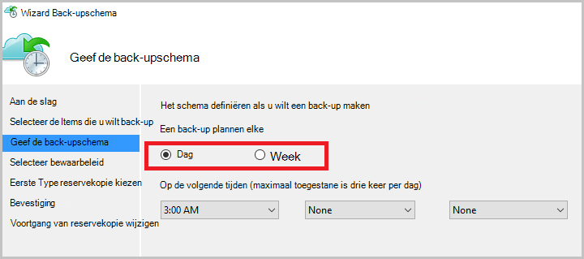

<properties
   pageTitle="Meer informatie over back-up bestanden en mappen van Windows naar Azure met Azure back-up met behulp van het implementatiemodel Resource Manager | Microsoft Azure"
   description="Informatie over gegevens van Windows Server back-up maken van een kluis, installeren van de agent Recovery Services en back-ups van uw bestanden en mappen naar Azure."
   services="backup"
   documentationCenter=""
   authors="markgalioto"
   manager="cfreeman"
   editor=""
   keywords="het back-up. het maken van reservekopieën"/>

<tags
   ms.service="backup"
   ms.workload="storage-backup-recovery"
   ms.tgt_pltfrm="na"
   ms.devlang="na"
   ms.topic="hero-article"
   ms.date="09/27/2016"
   ms.author="markgal;"/>

# Eerst wordt gezocht naar: back-up van bestanden en mappen met Azure back-up met behulp van het implementatiemodel Resource Manager

In dit artikel wordt uitgelegd hoe u een back-up van uw Windows Server (of Windows-client) bestanden en mappen naar Azure met Azure back-up met behulp van bronbeheer. Het is een zelfstudie bedoeld u stapsgewijs door de basisbeginselen. Als u aan de slag met Azure back-up wilt, bent u op de juiste plaats.

Als u meer weten over Azure back-up wilt, Lees dit [Overzicht](backup-introduction-to-azure-backup.md).

Back-ups van bestanden en mappen naar Azure, moet deze activiteiten:

 krijgt een Azure-abonnement (als u nog geen hebt). 
 een kluis Recovery Services maken. 
 de benodigde bestanden te downloaden. 
 installeren en registreren de agent Recovery Services. 
 Back-up van uw bestanden en mappen.

## Stap 1: Een Azure abonnement ophalen

Als u niet een Azure-abonnement hebt, kunt u een [gratis account](https://azure.microsoft.com/free/) waarmee u toegang tot alle Azure service maken.

## Stap 2: Maak een kluis Recovery Services

Als u wilt back-up van uw bestanden en mappen, moet u een kluis Recovery Services maken in de regio waar u de gegevens op te slaan. U moet ook bepalen hoe u wilt dat uw opslag gerepliceerd.

### Voor het maken van een kluis Recovery Services

1. Als u nog niet hebt gedaan, aanmelden bij de [Azure Portal](https://portal.azure.com/) met behulp van uw abonnement op Azure.

2. De Hub menu, klikt u op **Bladeren** en typ in de lijst met resources **Recovery Services** en klik op **kluizen Recovery Services**.

      

3. Klik in het menu **kluizen Recovery Services** op **toevoegen**.

    

    De kluis Recovery Services blade wordt geopend, waarin u een **naam**, **abonnement**, **resourcegroep**en **locatie**.

    

4. Voer voor de **naam**een beschrijvende naam ter identificatie van de kluis.

5. Klik op **abonnement** overzicht de beschikbare abonnementen.

6. Klik op **resourcegroep** overzicht de beschikbare brongroepen of klik op **Nieuw** om een nieuwe resourcegroep te maken.

7. Klik op **locatie** selecteren van de geografische regio van de kluis. Uw keuze bepaalt de geografische regio waar de back-up gegevens worden verzonden.

8. Klik op **maken**.

    Als u uw kluis weergegeven nadat deze is voltooid, klikt u op **vernieuwen**. Wanneer de lijst wordt vernieuwd, klikt u op de naam van de kluis.

### Opslag redundantie bepalen
Wanneer u een kluis Recovery Services maakt kunt u bepalen hoe de opslag worden gerepliceerd.

1. Klik op de nieuwe kluis te openen van het dashboard.

2. In de **Instellingen** -bladeserver, die automatisch wordt gestart met het dashboard kluis, klikt u op **Back-up infrastructuur**.

3. Klik op **Back-up configuratie** om het **replicatietype opslag**weer te geven in de back-up infrastructuur-blade.

    

4. Kies de replicatieoptie de juiste opslag voor uw kluis.

    

    Standaard heeft de kluis geo-redundante opslag. Als u Azure als eindpunt primaire back-up opslaan in een verder gebruik van geo-redundante opslag. Als u Azure als het eindpunt van een niet-primaire back-up opslaan gebruikt, kiest u lokaal redundante opslag, waarmee de kosten van het opslaan van gegevens in Azure wordt beperkt. Meer informatie over [geo-redundante](../storage/storage-redundancy.md#geo-redundant-storage) en [lokaal redundante](../storage/storage-redundancy.md#locally-redundant-storage) opslagopties in dit [Overzicht](../storage/storage-redundancy.md).

Nu dat u een kluis hebt gemaakt, kunt u uw back-up van bestanden en mappen door het downloaden van de Microsoft Azure Recovery Services agent en kluis referenties-infrastructuur voorbereiden.

## Stap 3 - bestanden downloaden

1. Klik op **Instellingen** op het dashboard Recovery Services kluis.

    

2. Klik op **aan de slag > back-up** op het blad van de instellingen.

    

3. Klik op **back-up doel** op het blad van de back-up.

    

4. Selecteer **On-premises** waarvandaan het is uw werkbelasting uitgevoerd? menu.

5. Selecteer de **bestanden en mappen** vanuit de pagina wat u wilt wilt back-up? menu en klik op **OK**.

### De agent Recovery Services downloaden

1. Klik in de blade **-infrastructuur voorbereiden** op **Agent downloaden voor Windows Server of Windows-Client** .

    

2. Klik op **Opslaan** in het pop-upmenu voor downloaden. Het bestand **MARSagentinstaller.exe** wordt standaard opgeslagen in de map Downloads.

### Kluis referenties downloaden

1. Klik op **downloaden > opslaan** op het blad van de infrastructuur voorbereiden.

    

## Stap 4 - installatie en de agent te registreren

>[AZURE.NOTE] Door back-ups via de portal Azure is binnenkort beschikbaar. Op dit moment met de Microsoft Azure Services herstelagent op ruimten kunt u back-up van uw bestanden en mappen.

1. Zoek en dubbelklik op de **MARSagentinstaller.exe** uit de map Downloads (of een andere locatie is opgeslagen).

2. Voer de Microsoft Azure Services Setup Wizard herstelagent. Als u de wizard hebt voltooid, moet u:

    - Kies een locatie voor de installatie en het cache-map.
    - Geef uw proxy server info als u een proxyserver gebruikt om verbinding met het internet.
    - Uw gebruikersnaam en wachtwoord nadere bijzonderheden te geven als u een geverifieerde proxy gebruikt.
    - De referenties van de gedownloade kluis
    - De wachtwoordzin codering op een veilige locatie opslaan.

    >[AZURE.NOTE] Als u de wachtwoordzin vergeet of verliest, helpen niet Microsoft herstellen van de back-upgegevens. Sla het bestand op een veilige locatie. Het is vereist voor het terugzetten van een back-up.

De agent is nu geïnstalleerd en uw computer is geregistreerd op de kluis. Bent u klaar om te configureren en uw back-up plannen.

## Stap 5: Back-up van uw bestanden en mappen

De eerste back-up bevat twee belangrijke taken:

- De back-up plannen
- Back-up van bestanden en mappen voor de eerste keer

Als u de eerste back-up wilt u de agent Microsoft Azure Recovery Services.

### De back-up plannen

1. De agent Microsoft Azure Recovery Services openen. Deze kunt u vinden door te zoeken op uw computer **Microsoft Azure back-up**.

    

2. Klik op **Back-up plannen**in de agent Recovery Services.

    

3. Klik op **volgende**op de pagina Introductie van de Wizard Back.

4. Klik op Items selecteren op de pagina back-up op **Items toevoegen**.

5. Selecteer de bestanden en mappen die u back wilt-up maken en klik vervolgens op **OK**.

6. Klik op **volgende**.

7. Het **back-upschema** en klik op **volgende**op de pagina **Back-upschema opgeven** .

    U kunt dagelijks (met een maximale snelheid van drie keer per dag) of een wekelijkse back-ups plannen.

    

    >[AZURE.NOTE] Zie het artikel [Gebruik Azure back-up vervangt uw tape-infrastructuur](backup-azure-backup-cloud-as-tape.md)voor meer informatie over het opgeven van het back-upschema.

8. Selecteer op de pagina **Selecteer bewaarbeleid** het **Bewaarbeleid** voor de back-up.

    Het bewaarbeleid bevat de duur waarvoor de back-up wordt opgeslagen. In plaats van gewoon "flat policy" voor alle punten van de back-up op te geven, kunt u verschillende bewaarbeleid op basis van wanneer de back-up. U kunt de dagelijkse, wekelijkse, maandelijkse en jaarlijkse bewaarbeleid aan uw behoeften wijzigen.

9. Kies de eerste type back-up op de pagina Kies eerste back-uptype. Laat de optie **automatisch via het netwerk** hebt geselecteerd en klik op **volgende**.

    U kunt back-ups automatisch via het netwerk, of kunt u een off line reservekopie. De rest van dit artikel wordt beschreven dat het proces voor het maken van back-automatisch. Als u liever een off line back-up te doen, bekijk de [off line back-up procedure in Azure Backup](backup-azure-backup-import-export.md) -artikel voor meer informatie.

10. Lees de informatie op de pagina bevestigen en klik op **Voltooien**.

11. Na het voltooien van de wizard Back-upschema maken, klikt u op **sluiten**.

### Reservekopie maken van bestanden en mappen voor de eerste keer

1. Klik op **Nu een Back-Up maken** om de eerste seeding via het netwerk in de agent Recovery Services.

    

2. Controleer de instellingen die de Wizard Back-Up nu gebruiken wilt voor back-up van de computer op de pagina bevestigen. Klik vervolgens op **Back-Up**.

3. Klik op **sluiten** om de wizard te sluiten. Als u dit doen voordat u het back-upproces is voltooid, blijft de wizard op de achtergrond uitgevoerd.

Nadat de eerste back-up is voltooid, wordt de status **voltooid van de taak** weergegeven in de console van de back-up.

## Heb je vragen?
Als u vragen hebt of als er een functie die u zou willen zien opgenomen, [feedback verzenden](http://aka.ms/azurebackup_feedback).

## Volgende stappen
- Krijg meer informatie over [back-ups van Windows-computers](backup-configure-vault.md).
- Nu dat u hebt back-up van uw bestanden en mappen, kunt u [uw kluizen en servers te beheren](backup-azure-manage-windows-server.md).
- Als u een back-up, gebruik van dit artikel voor het [herstellen van bestanden naar een Windows-computer](backup-azure-restore-windows-server.md).
