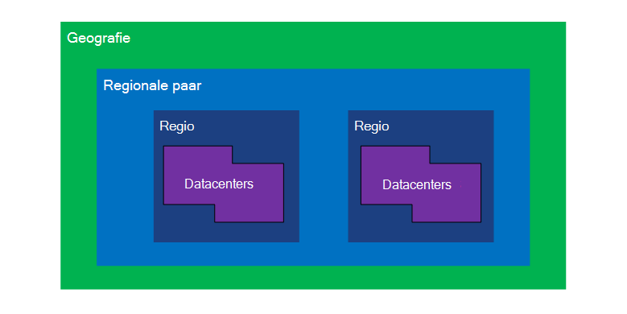
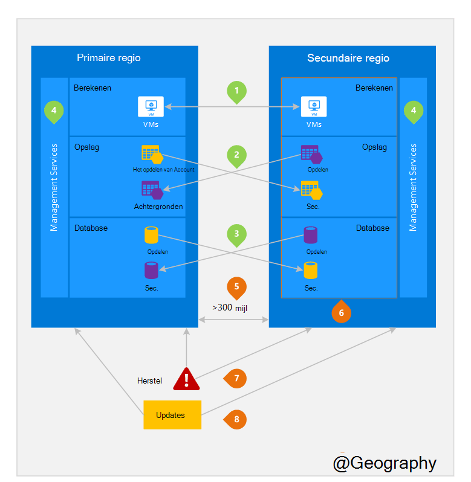

<properties
    pageTitle="Zakelijke continuïteit en disaster recovery (BCDR): Azure gekoppeld regio's | Microsoft Azure"
    description="Azure regionale paren zorgen ervoor dat toepassingen robuuste bij data center defecten."
    services="site-recovery"
    documentationCenter=""
    authors="rayne-wiselman"
    manager="jwhit"
    editor=""/>

<tags
    ms.service="site-recovery"
    ms.workload="storage-backup-recovery"
    ms.tgt_pltfrm="na"
    ms.devlang="na"
    ms.topic="article"
    ms.date="08/23/2016"
    ms.author="raynew"/>

# Zakelijke continuïteit en disaster recovery (BCDR): Azure gekoppeld regio's

## Wat zijn regio's worden gekoppeld?

Azure werkt op verschillende gebieden over de hele wereld. Een Azure Geografie is een bepaald gebied van de wereld met ten minste één regio van Azure. Een Azure gebied is een gebied in een wereld met een of meer datacenters.

Elke regio Azure is gekoppeld aan een andere regio binnen hetzelfde geografische spreiding, die samen een combinatie van een regionale. De uitzondering is Zuid van Brazilië die is gekoppeld aan een gebied buiten de Geografie.

Figuur 1: diagram Azure regionale paar

| Geografie     |  Gepaarde regio 's  |                     |
| :-------------| :-------------   | :-------------      |
| Noord-Amerika | Centrale Noord-Amerikaanse | Zuid-centraal-Verenigde Staten    |
| Noord-Amerika | Oost-Verenigde Staten          | West-Verenigde Staten             |
| Noord-Amerika | Verenigde Staten Oost 2        | US Central          |
| Noord-Amerika | West VS 2        | West Central US     |
| Europa        | Noord-Europa     | West-Europa         |
| Azië          | Zuid-Oost-Azië  | Oost-Azië           |
| China         | Oost-China       | Noord-China         |
| Japan         | East Japan       | West Japan          |
| Brazilië        | Brazilië South (1) | Zuid-centraal-Verenigde Staten    |
| Australië     | Australië, Oost   | Zuidoost Australië |
| Amerikaanse overheid | Amerikaanse beurs Iowa      | Amerikaanse finan-Virginia     |
| India         | Centraal India    | Zuid-India         |
| Canada        | Canada Central   | Canada Oost         |
| VERENIGD KONINKRIJK            | Verenigd Koninkrijk West          | Groot-Brittannië-Zuid            |

Tabel 1 - toewijzing van azure regionale paren

> (1) Brazilië-Zuid is uniek omdat het is gekoppeld aan een gebied buiten de eigen Geografie. Secundaire Brazilië zuidelijk van de regio Zuid-centraal ons maar Zuid-centraal ons van secundaire regio niet Zuid Brazilië.

Wij raden u aan over regionale paren van Azure van isolatie en beschikbaarheid van werklasten worden gerepliceerd. Bijvoorbeeld geplande Azure systeemupdates opeenvolgend worden geïmplementeerd (niet tegelijkertijd) tussen de paren regio's. Dit betekent dat zelfs in het zeldzame geval van een defecte update beide regio's worden niet beïnvloed tegelijk. Voorts, in het onwaarschijnlijke geval van een stroomstoring brede terugvordering van ten minste één regio van elk paar voorrang krijgt.

## Een voorbeeld van de gepaarde regio 's
Afbeelding 2 hieronder toont een hypothetische toepassing die gebruikmaakt van de combinatie van regionale voor noodherstel. De groene nummers markeren de cross-regio activiteiten van drie Azure services (Azure berekenen, opslag- en Database) en hoe deze zijn geconfigureerd om te repliceren tussen de regio's. De unieke voordelen van de implementatie van verschillende gekoppelde gebieden worden gemarkeerd door de oranje getallen.

Figuur 2 – hypothetische Azure regionale paar

## Cross-regio activiteiten
Als bedoeld in figuur 2.

 **Azure berekenen (PaaS)** – u resources meer compute vooraf zodat bronnen beschikbaar zijn in een andere regio tijdens een ramp moet inrichten. Zie voor meer informatie, [technische richtsnoeren Azure herstellingsvermogen](./resiliency/resiliency-technical-guidance.md).

 **Opslag Azure** - Geo-redundante opslag (GRS) is standaard geconfigureerd als een account Azure opslag wordt gemaakt. Met GRS, uw gegevens automatisch gerepliceerd driemaal in het gebied op de primaire en drie keer in de gepaarde regio. Zie [Azure opslag redundantieopties](storage/storage-redundancy.md)voor meer informatie.

 **Azure SQL Databases** – met Azure SQL standaard Geo-replicatie, kunt u asynchrone replicatie van transacties naar een gepaarde regio. Met Premium Geo-replicatie, kunt u replicatie voor elke regio in de wereld; we raden echter aan dat u deze bronnen in een gepaarde regio voor de meeste disaster recovery-scenario's implementeert. Zie voor meer informatie, [Geo-replicatie in Azure SQL-Database](./sql-database/sql-database-geo-replication-overview.md).

 logische isolatie van onderdelen van service management **Azure Resource Manager (ARM)** - ARM intrinsiek biedt verschillende regio's. Dit betekent dat logische fouten in één gebied waarschijnlijk minder invloed hebben op andere.

## Voordelen van gepaarde regio 's
Als bedoeld in figuur 2.  

**Fysieke afscherming** – indien mogelijk, Azure geeft de voorkeur aan ten minste 300 mijl van de scheiding tussen datacenters in een combinatie van regionale, hoewel dit niet praktisch of mogelijk in alle regio's. Scheiding van fysieke datacenter verkleint de kans op natuurrampen, civiele unrest, stroomuitval of fysieke netwerkstoringen beïnvloeden beide gebieden tegelijk. Isolatie is onderworpen aan de beperkingen in de Geografie (Geografie grootte, energie-infrastructuur/netwerkbeschikbaarheid, verordeningen, enz.).  

**Platform geleverde replicatie** - sommige services zoals Geo-redundante opslag bieden automatische replicatie naar het gekoppelde gebied.

**invorderingsopdracht regio** – in geval van een grote stroomstoring, herstel van één gebied voorrang krijgt bij elk paar. Toepassingen die worden gedistribueerd via gekoppelde gebieden zijn gegarandeerd een van de regio's met prioriteit wordt hersteld. Als een toepassing wordt geïmplementeerd in regio's die niet zijn gekoppeld, mag herstel worden uitgesteld – in het ergste geval dat de gekozen regio's mogelijk de laatste twee worden hersteld.

**sequentieel bijwerken** – Azure geplande systeem updates worden in tegenstelling tot gebieden paren opeenvolgend (niet tegelijkertijd) tot een minimum beperken van uitval, het effect van bugs en logische fouten in het zeldzame geval van een slechte update.

**gegevens hand vestigingsplaats** – een gebied bevindt zich in de wereld dezelfde als de paar (met uitzondering van Zuid Brazilië) om te voldoen aan de hand van vestigingsplaats gegevensvereisten voor belasting- en wet handhaving jurisdictie.

