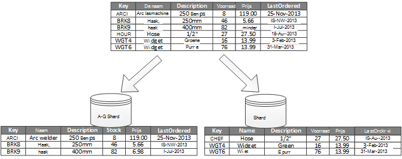
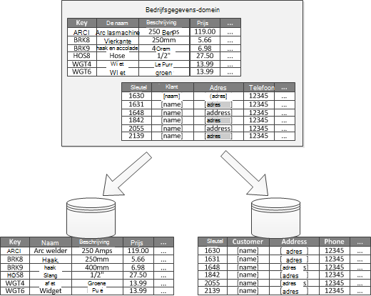

<properties
   pageTitle="Gegevenspartitionering richtlijnen | Microsoft Azure"
   description="Richtlijnen voor het afzonderlijke partities moeten worden beheerd en afzonderlijk toegankelijk."
   services=""
   documentationCenter="na"
   authors="dragon119"
   manager="christb"
   editor=""
   tags=""/>

<tags
   ms.service="best-practice"
   ms.devlang="na"
   ms.topic="article"
   ms.tgt_pltfrm="na"
   ms.workload="na"
   ms.date="07/14/2016"
   ms.author="masashin"/>

# Richtlijnen voor partitionering van gegevens

[AZURE.INCLUDE [pnp-header](../includes/guidance-pnp-header-include.md)]

## Overzicht

In een groot aantal oplossingen voor grootschalige, is data onderverdeeld in afzonderlijke partities die kunnen worden beheerd en afzonderlijk toegankelijk. De partitionering strategie moet zorgvuldig worden gekozen om de voordelen bij het minimaliseren van de schadelijke effecten. Partitionering kunt schaalbaarheid verbeteren en optimaliseren van de prestaties minder bronconflicten. Een ander voordeel van het partitioneren van is dat er een mechanisme voor het delen van gegevens door het patroon van gebruik. U kunt bijvoorbeeld oudere, minder actieve (koud) gegevens in de gegevensopslag goedkoper archiveren.

## Waarom gegevens partitioneren?

De meeste cloud-toepassingen en services opslaan en ophalen van gegevens als onderdeel van hun activiteiten. Het ontwerp van opgeslagen gegevens die door een toepassing wordt gebruikt, kan een belangrijke weerslag op de prestaties, de doorvoer en de schaalbaarheid van een systeem hebben. Een techniek die veel wordt toegepast in grootschalige systemen is de gegevens opsplitsen in afzonderlijke partities.

> De term _partitie_ die wordt gebruikt in deze richtsnoeren wordt verwezen naar het proces gegevens fysiek onder te verdelen in afzonderlijke. Dit is niet hetzelfde als de SQL Server-tabel partitionering, een ander concept.

Partitioneren van gegevens kan een aantal voordelen bieden. Het kan bijvoorbeeld worden toegepast om:

- **Schaalbaarheid verbeteren**. Wanneer u een systeem voor de database voor eenmalige schaalt, wordt het uiteindelijk een fysieke hardware limiet is bereikt. Als u gegevens in meerdere partities opsplitsen, die elk op een afzonderlijke server wordt gehost, kunt u de schaal van het systeem bijna voor onbepaalde tijd.
- **De prestaties verbeteren**. Data access-bewerkingen op elke partitie vindt plaats via een kleinere hoeveelheid gegevens. Op voorwaarde dat de gegevens op een geschikte manier is gepartitioneerd, kunt partitionering u uw systeem efficiënter. Bewerkingen die betrekking hebben op meer dan één partitie kunnen tegelijk uitvoeren. Elke partitie kan zich bevinden in de buurt van de toepassing die u gebruikt voor het netwerklatentie minimaliseren.
- **Beschikbaarheid verbeteren**. Gegevens over meerdere servers verdelen vermijdt een potentieel risico. Als een server uitvalt, of ondergaat gepland onderhoud, alleen de gegevens in die partitie niet beschikbaar is. Bewerkingen op andere partities kunnen blijven. Verhoging van het aantal partities vermindert de relatieve invloed van een storing van één server door vermindering van het percentage van de gegevens die niet beschikbaar. Elke partitie worden gerepliceerd, kan de kans op een enkele partitie defect bewerkingen te verminderen. Maar is het ook mogelijk om te scheiden van de essentiële gegevens die voortdurend moet worden en hoge beschikbaarheid van gegevens met lage waarde die lager beschikbaarheid eisen (zoals logboekbestanden).
- **Verbeterde beveiliging**. Afhankelijk van de aard van de gegevens en hoe deze is gepartitioneerd, mogelijk gevoelige en niet-vertrouwelijke gegevens opdelen in verschillende partities, en daarom in verschillende servers of gegevens worden opgeslagen. Beveiliging kan vervolgens speciaal geoptimaliseerd voor gevoelige gegevens.
- **Operationele flexibiliteit bieden**. Partitionering biedt veel mogelijkheden voor fijn afstemmen bewerkingen administratieve doeltreffendheid maximaliseren en de kosten te minimaliseren. Zo kunt u verschillende strategieën voor het beheer, toezicht, back-up en terugzetten, en andere administratieve taken op basis van het belang van de gegevens in elke partitie.
- **Overeenkomen met de gegevens opslaan om het patroon van gebruik**. Partitionering kunt u elke partitie moet worden ingezet op een ander type gegevensarchief, op basis van kosten en de ingebouwde functies gegevensarchief aanbiedingen. Grote binaire gegevens kunnen bijvoorbeeld worden opgeslagen in een gegevensarchief blob terwijl meer gestructureerde gegevens kunnen worden bewaard in een database van document. Zie voor meer informatie, [een polyglot oplossing te ontwikkelen] in de handleiding van patronen en procedures en [voor zeer schaalbare oplossingen voor gegevenstoegang: met behulp van SQL, NoSQL en polyglot permanente] op de website van Microsoft.

Sommige systemen niet geïmplementeerd omdat deze wordt beschouwd als kosten in plaats van een voordeel partitioneren. Veelvoorkomende oorzaken van deze motivering omvatten:

- Veel systemen voor opslag van gegevens bieden geen ondersteuning voor joins meerdere partities en kan het lastig om referentiële integriteit in een gepartitioneerde systeem bijhouden. Het is vaak noodzakelijk voor de tenuitvoerlegging van joins en integriteit gecontroleerd in de toepassingscode (in de partitionering laag), wat leiden extra i/o- en complexiteit van de toepassing tot kan.
- Beheren van partities is niet altijd een eenvoudige zaak. In een systeem waarop de gegevens vluchtige zijn, moet u mogelijk opnieuw partities regelmatig minder bronconflicten en hotspots.
- Sommige algemene programma's werken niet natuurlijk met gepartitioneerde gegevens.

## Ontwerpen van partities

Gegevens op verschillende manieren kunnen worden gepartitioneerd: horizontaal, verticaal of functioneel. De strategie die u kiest, hangt af van de reden voor het partitioneren van de gegevens en de eisen van de toepassingen en services met de gegevens.

> [AZURE.NOTE] De partitionering's beschreven in deze handleiding worden beschreven op een manier die onafhankelijk is van de onderliggende technologie voor gegevensopslag. Zij kunnen worden toegepast op vele soorten opgeslagen gegevens, met inbegrip van relationele en NoSQL databases.

### Partitioneren van strategieën

De drie typische strategieën voor het partitioneren van gegevens zijn:

- **Horizontaal partitioneren** (ook wel _sharding_genoemd). In deze strategie, elke partitie is een gegevensarchief op zichzelf, maar alle partities hebben hetzelfde schema. Elke partitie een _shard_ wordt genoemd en bevat een specifieke subset van de gegevens, zoals de orders voor een specifieke set klanten in een e-commerce-toepassing.
- **Verticale partities**. In deze strategie houdt elke partitie een subset van de velden voor de items in het gegevensarchief. De velden zijn onderverdeeld volgens hun gebruikspatroon. Veelgebruikte velden kunnen bijvoorbeeld worden geplaatst in een verticale partitie en minder vaak gebruikte velden in een andere.
- **Functionele partitioneren**. Gegevens worden samengevoegd in deze strategie, afhankelijk van hoe het wordt gebruikt door elke begrensde context in het systeem. Bijvoorbeeld een e-commerce systeem dat implementeert zakelijke functies voor facturering te scheiden en factuurgegevens in één partitie ' en ' product voorraadgegevens in een ander productvoorraad beheren kan opslaan.

Het is belangrijk te weten dat de drie strategieën die hier worden beschreven, kunnen worden gecombineerd. Elkaar niet uitsluiten en we raden alle bij het ontwerpen van een partitieschema. U kunt bijvoorbeeld gegevens opsplitsen in shards en gebruik vervolgens verticale partities verder onderverdelen van de gegevens in elke shard. Ook kan de gegevens in een partitie functioneel worden gesplitst in shards (die kunnen ook worden verticaal gepartitioneerd).

De verschillende eisen van elke strategie kunnen echter een aantal problemen met conflicterende verhogen. U moet evalueren en deze balans tijdens het ontwerpen van een partitieschema die voldoet aan de algemene gegevensverwerking doelstellingen die voor uw systeem. In de volgende secties Ontdek elk van de strategieën in meer detail.

### Horizontaal partitioneren (sharding)

Figuur 1 toont een overzicht van horizontaal partitioneren of sharding. In dit voorbeeld wordt is de voorraadgegevens product onderverdeeld in shards op basis van de productcode. Elke shard bevat de gegevens voor een aaneengesloten bereik van shard sleutels (A-G en H-Z), alfabetisch gerangschikt.

_Figuur 1. Horizontaal (sharding) gegevens op basis van een partitiesleutel partitioneren_

Sharding kunt u de werklast verdeeld over meer computers, waardoor minder bronconflicten en verbetert de prestaties. Door toevoeging van meer shards die worden uitgevoerd op extra servers, kunt u het systeem van schalen.

De belangrijkste factor bij het implementeren van deze strategie partitionering is de keuze van de sleutel sharding. Kan het moeilijk zijn de sleutel kunt wijzigen als het systeem uitgevoerd wordt. De sleutel moet ervoor zorgen dat gegevens zodat u de werkbelasting is zelfs zo mogelijk in de shards is gepartitioneerd.

Opmerking verschillende shards hoeft niet dezelfde hoeveelheden gegevens bevatten. In plaats daarvan is de belangrijkste overweging voor evenwicht tussen het aantal aanvragen. Sommige shards is mogelijk erg groot, maar elk artikel is het onderwerp van een klein aantal access-bewerkingen. Andere shards mogelijk kleiner, maar elk artikel veel vaker wordt geopend. Het is ook belangrijk om ervoor te zorgen dat een enkele shard niet de grenzen van de schaal (in termen van capaciteit en verwerkingscapaciteit) van het gegevensarchief dat wordt gebruikt overschrijdt als host voor deze shard.

Als u een schema sharding, maak geen hotspots (of partities hot) die invloed hebben op prestaties en beschikbaarheid. Bijvoorbeeld, als u een hash van een klant-id in plaats van de eerste letter van de naam van een klant, voorkomt u dat de onevenwichtige verdeling van gemeenschappelijke en minder vaak eerste letters. Dit is een typische techniek waarmee gegevens beter verdelen over de partities.

Kies een sleutel sharding die eventuele toekomstige vereisten voor grote shards splitsen in kleinere stukken minimaliseert coalesce kleine shards in grotere partities of wijzigen van het schema over de gegevens die zijn opgeslagen in een set van partities. Deze bewerkingen kunnen worden zeer tijdrovend en vereist mogelijk een of meer shards off line nemen terwijl ze worden uitgevoerd.

Als shards zijn gerepliceerd, is het mogelijk dat sommige van de replica's online terwijl anderen zijn gesplitst, samengevoegd of opnieuw geconfigureerd. Het systeem moet echter mogelijk om te beperken welke bewerkingen kunnen worden uitgevoerd op de gegevens in deze shards tijdens het wijzigen van de configuratie. De gegevens in de replica's kan bijvoorbeeld worden gemarkeerd als alleen-lezen voor het beperken van het toepassingsgebied van de inconsistences die zich voordoen kunnen tijdens shards zijn ernstig wordt doorkruist.

> Zie voor meer gedetailleerde informatie en advies over de vele van deze overwegingen en technieken voor het ontwerpen van de opgeslagen gegevens die horizontaal partitioneren implementeren goede praktijken, [Sharding patroon].

### Verticale partities

Het meest gebruikt voor het partitioneren van verticale is het verminderen van de I/O en prestaties kosten in verband met het ophalen van de artikelen die meestal worden benaderd. Figuur 2 toont een voorbeeld van verticale partities. In het volgende voorbeeld worden verschillende eigenschappen voor elk gegevensitem worden vastgehouden in verschillende partities. Één partitie bevat de gegevens die toegankelijk is vaker, met inbegrip van de naam, beschrijving en prijsinformatie over producten. Andere bevat het volume in de voorraad en laatste besteld.

_Figuur 2. Verticaal partitioneren van gegevens door het patroon van gebruik_

In dit voorbeeld wordt de toepassing regelmatig query's de naam van het product, de beschrijving en de prijs bij het weergeven van details van het product aan klanten. Het voorraadniveau en de datum die als laatste het product is besteld bij de fabrikant worden vastgehouden in een afzonderlijke partitie omdat deze twee items worden vaak samen gebruikt.

Deze partitieschema bijkomend voordeel is dat de gegevens relatief traag bewegende (productnaam, beschrijving en prijs) wordt gescheiden van de meer dynamische gegevens (voorraadniveau en laatst bestelde). Een toepassing kan zinvol zijn om de gegevens langzaam verplaatsen in het geheugen als is veelvuldig in cache.

Een ander typisch voorbeeld voor deze partitie strategie is het maximaliseren van de beveiliging van vertrouwelijke gegevens. Bijvoorbeeld kunt u dit doen door creditcardnummers en de bijbehorende beveiligings controle kaartnummers opgeslagen in afzonderlijke partities.

Verticale partities kan ook minder gelijktijdige toegang die nodig is om de gegevens.

> Verticale partities werkt op het entiteitsniveau van binnen een gegevensarchief gedeeltelijk normaliseren van een entiteit voor het opsplitsen van een _groot_ item op een set items _beperken_ . Het is uitermate geschikt voor kolom-georiënteerd gegevensarchieven zoals HBase en Cassandra. Als de gegevens in een collectie kolommen waarschijnlijk niet is te wijzigen, kunt u ook overwegen kolom winkels in SQL Server.

### Functionele partitioneren

Voor systemen kunnen identificeren een begrensde context voor elk afzonderlijk gebied of de service in de toepassing, biedt functionele partitionering een techniek voor het verbeteren van de prestaties van isolatie en data access. Ander algemeen gebruik van functionele partitioneren is alleen-lezen gegevens scheiden van alleen-lezen gegevens die worden gebruikt voor rapportagedoeleinden. In figuur 3 ziet een overzicht van het partitioneren van functionele waar voorraadgegevens wordt gescheiden van de gegevens van de klant.

_In figuur 3. Partitioneren van gegevens door begrensde context of subdomein functioneel_

Deze strategie partitionering verminderen data access bronconflicten in verschillende delen van een systeem.

## Ontwerpen van partities voor schaalbaarheid

Kunt u de grootte en de werklast voor elke partitie en stemmen deze zodat de gegevens worden verdeeld om te bereiken maximale schaalbaarheid noodzakelijk is. U moet de gegevens echter ook partitioneren zodat de schaal grenzen van een enkele partitie opslag niet wordt overschreden.

Volg deze stappen bij het ontwerpen van partities voor schaalbaarheid:

1. Analyseren van de toepassing te begrijpen van de data access patronen, zoals de grootte van de resultaatset van de query, de frequentie van de toegang, de inherente latentie en de server-side verwerkingsvereisten berekenen. In veel gevallen zal een paar belangrijke entiteiten eisen de meeste van de verwerkingscapaciteit.
2. Deze analyse gebruiken om te bepalen van de schaalbaarheid van huidige en toekomstige doelen, zoals de gegevensgrootte en werkbelasting. Vervolgens verdelen de gegevens over de partities te voldoen aan het doel van schaalbaarheid. In de horizontale partitionering strategie is het belangrijk om te controleren of de verdeling is zelfs kiezen van de juiste shard sleutel. Zie voor meer informatie het [Sharding patroon].
3. Zorg ervoor dat de beschikbare bronnen voor elke partitie voldoende zijn voor het verwerken van de schaalbaarheidsvereisten in termen van capaciteit en doorvoer. Het knooppunt dat als host een partitie fungeert kan bijvoorbeeld een vaste limiet op de hoeveelheid opslagruimte, stroom of bandbreedte van het netwerk waarmee deze verwerking opleggen. Als de vereisten voor opslag en verwerking van gegevens zal deze limieten overschrijden, kan het verfijnen van uw strategie voor partitionering of gegevens uit verder splitsen nodig zijn. Bijvoorbeeld, een benadering van de schaalbaarheid mogelijk logboekgegevens wilt scheiden van de kernfuncties van toepassing. Hiervoor afzonderlijke gebruiken om te voorkomen dat het totale voor gegevensopslag van de schaal van het knooppunt is overschreden. Als het totale aantal opgeslagen gegevens van het knooppunt overschrijdt, kan het gebruik van aparte opslagknooppunten nodig zijn.
4. Controleren van het systeem onder gebruiken om te controleren dat de gegevens worden verdeeld, zoals verwacht en dat de partities kunnen omgaan met de belasting die wordt opgelegd. Het is mogelijk dat het gebruik niet overeenkomt met het verbruik dat bij de analyse wordt verwacht. In dat geval is het mogelijk zijn de partities opnieuw uit te balanceren. Bij gebreke daarvan, kan het nodig zijn sommige delen van het systeem te krijgen het vereiste evenwicht ontwerpen.

Houd er rekening mee dat sommige omgevingen wolk bronnen in infrastructuur grenzen toewijzen. Zorg ervoor dat de grenzen van de geselecteerde rand onvoldoende ruimte biedt voor een verwachte groei van het volume van de gegevens in de gegevensopslag, processorcapaciteit en bandbreedte.

Bijvoorbeeld als u tabelopslag Azure, een drukke shard mogelijk meer bronnen nodig hebben dan beschikbaar zijn voor een enkele partitie om aanvragen te verwerken. (Er is een limiet voor de omvang van de aanvragen die in een bepaalde periode kan worden bediend door een enkele partitie. Zie de pagina [Azure opslag schaalbaarheid en prestaties doelen] op de website van Microsoft voor meer informatie.)

 Als dit het geval is, moet de shard mogelijk opnieuw worden gepartitioneerd spreiding van de belasting. Als de totale grootte of de doorvoer van deze tabellen groter is dan de capaciteit van een opslagruimte-account, kan het nodig zijn extra opslagruimte accounts maken en de tabellen verspreid over deze accounts zijn. Als het aantal accounts opslag groter is dan het aantal accounts die beschikbaar voor een abonnement zijn, vervolgens kan het nodig zijn meerdere abonnementen gebruiken.

## Partities voor de prestaties van query's ontwerpen

Prestaties van query's kan vaak worden versterkt door kleinere gegevenssets en door de parallelle query's uitvoeren. Elke partitie kan een klein gedeelte van de hele gegevensset moet bevatten. De vermindering van het volume kan verbeteren de prestaties van query's. Partitioneren is echter geen alternatief voor het ontwerpen en configureren van een database op de juiste manier. Controleer bijvoorbeeld of de nodige indexen op zijn plaats te hebben als u een relationele database.

Volg deze stappen bij het ontwerpen van partities voor de prestaties van query's:

1. Bekijk de vereisten van de toepassing en de prestaties:
    - De zakelijke vereisten gebruiken om te bepalen van de kritieke query's die altijd snel moeten uitvoeren.
    - Het identificeren van alle query's die traag systeem controleren.
    - Vaststellen welke query's het meest worden uitgevoerd. Slechts één exemplaar van elke query minimale kosten kan hebben, maar het cumulatieve verbruik van middelen zouden kunnen spelen. Het kan zinvol zijn om te scheiden van de gegevens die door deze query's in een afzonderlijke partitie of zelfs een cache wordt opgehaald.
2. De gegevens die wordt veroorzaakt door trage prestaties partitie:
    - De grootte van elke partitie zodat de responstijd van de query in het doel.
    - De sleutel shard zodanig ontwerpen dat de toepassing de partitie gemakkelijk terugvinden kunt als u horizontaal partitioneren implementeert. Hiermee voorkomt u dat de query hoeft te scannen via elke partitie.
    - U kunt de locatie van een partitie. Indien mogelijk proberen te houden partities die geografisch dicht bij de toepassingen en gebruikers die toegang hebben tot deze gegevens.
3. Als een entiteit prestatie-eisen voor doorvoer en query heeft, gebruikt u de functionele partitionering op basis van die entiteit. Als dit nog niet voldoet aan de eisen, gelden ook horizontaal partitioneren. In de meeste gevallen een enkele partitie strategie is voldoende, maar in sommige gevallen is het efficiënter om het combineren van beide strategieën.
4. Overweeg het gebruik van asynchrone query's parallel worden uitgevoerd meerdere partities om prestaties te verbeteren.

## Ontwerpen van partities voor beschikbaarheid

Partitioneren van gegevens kan de beschikbaarheid van toepassingen verbeteren door ervoor te zorgen dat de gehele dataset geen potentieel risico vormt en dat afzonderlijke subsets van de dataset onafhankelijk kunnen worden beheerd. Partities met kritieke gegevens te repliceren kan ook de beschikbaarheid te verbeteren.

Bij het ontwerpen en implementeren van partities, moet u rekening houden met de volgende factoren die invloed hebben op de beschikbaarheid:

- **Hoe belangrijk de gegevens zijn bedrijfsactiviteiten**. Sommige gegevens zijn bijvoorbeeld belangrijke gegevens zoals Factuurdetails of banktransacties. Andere gegevens zijn bijvoorbeeld minder belangrijke operationele gegevens, zoals de logboekbestanden en sporen van de prestaties. Nadat u elk type gegevens, kunt u:
    - Kritieke gegevens op te slaan in maximaal beschikbare partities met een geschikt back-upplan.
    - Afzonderlijk beheer tot stand te brengen en mechanismen en procedures voor de verschillende criticalities van elke gegevensset. Plaats gegevens die dezelfde mate van belangrijkheid in dezelfde partitie zodat deze kan worden een reservekopie samen bij een geschikte frequentie. Bijvoorbeeld mogelijk worden back-up moet vaker dan de partities die registratie of traceringsinformatie bevatten partities bevatten gegevens voor banktransacties.
- **Hoe de afzonderlijke partities kunnen worden beheerd**. Ontwerpen van partities voor de ondersteuning van onafhankelijke beheer en onderhoud biedt verschillende voordelen. Bijvoorbeeld:
    - Als een partitie is mislukt, kan deze onafhankelijk van elkaar worden hersteld zonder exemplaren van toepassingen die toegang hebben tot gegevens in andere partities.
    - Partitioneren van gegevens per geografisch gebied kan geplande onderhoudstaken op rustige uren voor elke locatie. Controleer de partities zijn niet te groot om te voorkomen dat een planmatig onderhoud gedurende deze periode wordt voltooid.
- **Of voor het repliceren van kritieke gegevens in meerdere partities**. Deze strategie kunt verbeteren de beschikbaarheid en prestaties, maar het ook leiden consistentie problemen tot kan. Het duurt om de wijzigingen in gegevens in een partitie worden gesynchroniseerd met elke replica. Tijdens deze periode bevatten verschillende partities verschillende waarden.

## Informatie over het partitioneren van de invloed van ontwerp en ontwikkeling

Met behulp van partitionering wordt complexiteit toegevoegd aan het ontwerp en de ontwikkeling van het systeem. U kunt partitioneren als een fundamenteel onderdeel van het systeem ontwerp zelfs wanneer het systeem in eerste instantie slechts één partitie bevat. Als u partities als nabeschouwing, wanneer het systeem start afnemen prestaties en de schaalbaarheid van toepassing, de complexiteit neemt toe omdat u al een live systeem te handhaven.

Als u het systeem om op te nemen in deze omgeving partitionering bijwerkt, vereist het wijzigen van de logica van de toegang tot gegevens. Het kan ook betrekking hebben op migratie van bestaande gegevens te verspreiden onder meerdere partities, vaak terwijl gebruikers verwachten om door te gaan met het systeem kunnen grote hoeveelheden.

In sommige gevallen partitioneren niet van belang wordt geacht omdat de initiële gegevensset klein is en eenvoudig kan worden bediend door een enkele server. Dit is mogelijk in een systeem dat niet naar verwachting na de initiële grootte schalen true, maar veel commerciële systemen moeten groeien naarmate het aantal gebruikers toeneemt. Deze uitbreiding is meestal vergezeld gaan van een groei van het volume van de gegevens.

Het is ook belangrijk dat u begrijpt dat partitioneren niet altijd een functie van grote winkels is. Bijvoorbeeld, kan een kleine gegevensarchief worden sterk benaderd door honderden van twee gelijktijdige clientverbindingen. Partitioneren van de gegevens in deze situatie kunt u bronconflicten reduceren en de doorvoer verbeteren.

Bij het ontwerpen van een partitieschema gegevens, moet u rekening houden met de volgende punten:

- **Indien mogelijk, gegevens voor de meest voorkomende databasebewerkingen in bijeenhouden elke partitie cross-partitie gegevensbewerkingen toegang te minimaliseren**. Bij het controleren van meerdere partities kan meer tijd dan het uitvoeren van query's alleen binnen een enkele partitie, maar partities voor één set van query's optimaliseren kan schaden andere sets van query's. Wanneer u kan niet worden vermeden bij het controleren van meerdere partities, minimaliseren query door de parallelle query's uitvoeren en de resultaten binnen de toepassing verzamelen. Deze benadering is niet mogelijk in sommige gevallen, zoals wanneer het noodzakelijk is te verkrijgen van een resultaat van een query en deze gebruiken in de volgende query.
- **Als query's maken gebruik van tamelijk statisch referentiegegevens, zoals postcode tabellen of productlijsten, kunt u deze gegevens in alle van de partities te verminderen, de eis voor het opzoeken van afzonderlijke bewerkingen in verschillende partities te repliceren**. Deze benadering kan ook de kans de referentiegegevens van een 'hot' dataset die veel verkeer uit over het hele systeem kan raken. Er is echter een extra kosten in verband met wijzigingen die zich in deze verwijzingsgegevens voordoen kunnen synchroniseren.
- **Waar mogelijk, vereisten voor referentiële integriteit tussen verticale en functionele partities minimaliseren**. In deze schema's is de toepassing zelf verantwoordelijk voor referentiële integriteit meerdere partities wanneer gegevens worden bijgewerkt en verbruikt. Query's die u lid van gegevens op verschillende partities worden moeten langzamer dan de query's die gegevens alleen binnen dezelfde partitie toevoegen omdat de toepassing meestal moet opeenvolgende query's kan uitvoeren op basis van een sleutel en klik vervolgens op een refererende sleutel. In plaats daarvan te repliceren of uit de relevante gegevens normaliseren. De Querytijd waar partitie cross joins noodzakelijk zijn, minimaliseren parallelle query's uitvoeren op de partities en deelnemen aan de gegevens in de toepassing.
- **Houd rekening met het effect dat het partitieschema van meerdere partities op de consistentie van de gegevens hebt.** Evalueren of sterke samenhang eigenlijk een vereiste is. In plaats daarvan wordt een gemeenschappelijke aanpak in de cloud voor het implementeren van eventuele consistentie. De gegevens in elke partitie afzonderlijk worden bijgewerkt en de toepassingslogica zorgt ervoor dat de updates zijn al voltooid. Ook de inconsistenties die zich voordoen kunnen bij het opvragen van gegevens tijdens het uitvoeren van een bewerking uiteindelijk consistent worden verwerkt. Zie voor meer informatie over het implementeren van de uiteindelijke algehele consistentie van de [gegevens consistent primer].
- **Overwegen hoe query's zoeken naar de juiste partitie**. Als een query alle partities om de vereiste gegevens te zoeken scannen moet, is er een belangrijke invloed op de prestaties, zelfs als meerdere parallelle query's worden uitgevoerd. Query's met verticale en functionele partitionering strategieën kunnen natuurlijk de partities opgeven. Horizontaal partitioneren (sharding) kan nog wel een moeilijk item zoeken omdat elke shard hetzelfde schema heeft. Een standaardoplossing voor sharding is, houden een schema dat kan worden gebruikt om de locatie shard voor bepaalde artikelen van de gegevens op te zoeken. Dit overzicht kan worden geïmplementeerd in het sharding de bedrijfslogica van de toepassing of onderhouden door de data store als transparante sharding ondersteunt.
- **Wanneer u een horizontale partitionering strategie rekening houden met de shards periodiek opnieuw**. Dit helpt de gegevens gelijkmatig verdelen door de grootte en werkbelasting hotspots te minimaliseren, maximaliseren van de prestaties van query's en fysieke opslag beperkingen te omzeilen. Dit is echter een complexe taak die vaak het gebruik van een aangepast hulpprogramma of proces vereist.
- **Als u elke partitie, repliceert biedt extra bescherming tegen fouten**. Als een afzonderlijke replica mislukt, kunnen query's worden gericht op een werkend exemplaar.
- **Als u naar de fysieke grenzen van een strategie voor partitionering, moet u mogelijk de schaalbaarheid naar een ander niveau uitbreiden**. Bijvoorbeeld als het partitioneren op het databaseniveau van de is, mogelijk moet u zoeken of partities in meerdere databases repliceren. Als partitioneren al op het databaseniveau van de is en fysieke beperkingen een probleem zijn, kan het betekenen dat u moet zoeken of partities in meerdere hosting accounts worden gerepliceerd.
- **Voorkomen dat transacties die toegang hebben tot gegevens in meerdere partities**. Sommige gegevens winkels implementeren transactionele consistentie en integriteit voor bewerkingen die gegevens, maar alleen wanneer de gegevens zich in één partitie wijzigen. Als u ondersteuning van transacties op verschillende partities moet, moet u waarschijnlijk implementeren als onderdeel van uw toepassingslogica omdat meest partitionering systemen geen ondersteuning voor native bieden.

Alle winkels van gegevens vereisen sommige operationeel beheer en controle van de activiteit. De taken kunnen variëren van het laden van gegevens, back-up en terugzetten van gegevens, gegevens ordenen en ervoor te zorgen dat het systeem efficiënt en correct wordt uitgevoerd.

Houd rekening met de volgende factoren die invloed hebben op de operationele beheer:

- **Het implementeren van passende management en operationele taken bij de gegevens is gepartitioneerd**. Deze taken omvatten het mogelijk maken en terugzetten, archiveren van gegevens, het controleren van het systeem en andere administratieve taken. Onderhouden van logische consistentie tijdens back-up en het terugzetten kan bijvoorbeeld een uitdaging.
- **Het laden van de gegevens in meerdere partities en het toevoegen van nieuwe gegevens die uit andere bronnen binnenkomen wordt**. Sommige functies en hulpprogramma's ondersteunen een laptopgeheugen data bewerkingen, zoals het laden van de gegevens in de juiste partitie mogelijk niet. Dit betekent dat u mogelijk maken of verkrijgen van nieuwe functies en hulpprogramma's.
- **Het archiveren en verwijderen van de gegevens op een regelmatige basis**. Als u wilt voorkomen dat de overmatige groei van partities, die u wilt archiveren en verwijderen van gegevens op regelmatige basis (bijvoorbeeld maandelijks). Kan het nodig zijn om te zetten van de gegevens die overeenkomen met het schema van een ander archief.
- **Het zoeken naar problemen met data integriteit**. U kunt een periodieke data integriteit problemen zoals gegevens zoeken in een partitie die verwezen naar ontbrekende gegevens in een ander proces wordt uitgevoerd. Het proces kan een poging om deze problemen automatisch repareren of te verhogen van een waarschuwing aan een operator handmatig de problemen corrigeren. Bijvoorbeeld gegevens kan worden gehouden in één partitie in een e-commerce-toepassing, maar de regelitems die elke order vormen kunnen worden gehouden in een andere. Gegevens toevoegen aan andere partities moet het proces van een bestelling te plaatsen. Als dit proces mislukt, er zijn wellicht artikelen opgeslagen voor dat er geen overeenkomstige order.

Verschillende gegevens opslagtechnologieën bieden meestal hun eigen functies voor de ondersteuning van partitionering. In de volgende secties worden de opties die worden geïmplementeerd door de gegevensopslag die veel worden gebruikt door toepassingen Azure samengevat. Deze beschrijven overwegingen bij het ontwerpen van toepassingen die het meeste van deze functies profijt ook.

## Partitioneren van strategieën voor Azure SQL-Database

Azure SQL-Database is een relationele database-as-a-service die wordt uitgevoerd in de cloud. Het is gebaseerd op Microsoft SQL Server. Een relationele database verdeelt gegevens in tabellen en elke tabel bevat informatie over entiteiten als een reeks rijen. Elke rij bevat kolommen waarin de gegevens voor de afzonderlijke velden van een entiteit. De pagina [Wat is Azure SQL Database?] op de Microsoft-website biedt gedetailleerde informatie over het maken en gebruiken van SQL-databases.

## Horizontaal partitioneren met elastische Database

Eén SQL-database heeft een limiet aan de hoeveelheid gegevens die kan bevatten. De doorvoer wordt beperkt door de architecturale factoren en het aantal gelijktijdige verbindingen die hierdoor worden ondersteund. De functie elastische Database van SQL-Database ondersteunt horizontaal schalen voor een SQL-database. Elastische Database gebruikt, kunt u de gegevens verdelen in shards die verspreid zijn over meerdere SQL-databases. U kunt ook toevoegen of verwijderen van shards, zoals het volume van de gegevens die u nodig hebt voor het verwerken van vergroot en verkleind. Met behulp van elastische Database kunt bronconflicten verminderen door de belasting te verdelen over databases.

> [AZURE.NOTE] Elastische Database is een vervanging voor de functie van de overkoepelende organisaties van Azure SQL-Database. Bestaande installaties kunnen worden gemigreerd naar elastische Database met behulp van het hulpprogramma voor het migreren van overkoepelende organisaties van SQL-Database Federation. Als uw scenario wordt niet lenen voor zichzelf natuurlijk tot de functies die worden geleverd door elastische Database, kunt u ook uw eigen mechanisme sharding implementeren.

Elke shard is geïmplementeerd als een SQL-database. Een shard kan bevatten meer dan één gegevensset (hierna aangeduid als een _shardlet_). Elke database houdt de metagegevens die de shardlets die erin wordt beschreven. Een shardlet kan één gegevenselement of een groep items met dezelfde sleutel shardlet kan zijn. Als u gegevens in een toepassing multitenant sharding, de sleutel shardlet dient de huurder-ID en alle gegevens voor een bepaalde huurder aansprakelijk kunnen worden als onderdeel van de dezelfde shardlet. Gegevens voor andere huurders zouden worden gehouden in verschillende shardlets.

Het is de verantwoordelijkheid van de programmeur een dataset koppelen aan een sleutel shardlet. Een afzonderlijke SQL-database fungeert als een globale shard kaart manager. Deze database bevat een lijst van alle shards en shardlets in het systeem. Een clienttoepassing die toegang heeft tot gegevens maakt eerst verbinding met de globale shard kaart manager-database naar een exemplaar van de shard-kaart (met shards en shardlets), die het vervolgens in de cache lokaal opgeslagen.

De toepassing wordt vervolgens gebruikt deze informatie op aanvragen van route gegevens naar de juiste shard. Deze functionaliteit is verborgen achter een reeks API's die zijn opgenomen in de Azure SQL Database elastische Database Client Library, die als NuGet-pakket beschikbaar is. De pagina [overzicht van elastische Database functies] op de website van Microsoft biedt een meer uitgebreide inleiding op elastische Database.

> [AZURE.NOTE] U kunt de database manager globale shard latentie te verlagen en de beschikbaarheid te verbeteren repliceren. Als u de database met behulp van een van de Premium prijzen lagen implementeert, kunt u actieve geo-replicatie voortdurend om gegevens te kopiëren op databases in verschillende regio's. Maak een kopie van de database in elke regio waarin gebruikers zijn gebaseerd. Configureer uw toepassing verbinding maken met deze kopie ophalen van de kaart shard.

> Een alternatieve methode is Azure SQL-gegevens synchroniseren of een pijpleiding Azure Data Factory gebruiken voor het repliceren van de database manager shard tussen de regio's. Deze vorm van replicatie wordt periodiek uitgevoerd en is meer geschikt als de kaart shard niet vaak veranderen. De database manager shard heeft bovendien niet worden gemaakt met behulp van een Premium prijzen laag.

Elastische Database biedt twee schema's voor de gegevens wilt toewijzen aan de shardlets en ze opslaan in shards:

- Een **lijst met hyperlinks shard** beschrijft een koppeling tussen een enkele sleutel en een shardlet. Bijvoorbeeld in een multitenant systeem kunnen de gegevens voor elke huurder worden gekoppeld aan een unieke sleutel en opgeslagen in zijn eigen shardlet. Privacy en isolatie te garanderen (dat wil zeggen om te voorkomen dat een huurder de opslagmiddelen voor gegevens aan anderen is opgevist), elke shardlet kan worden gehouden binnen de eigen shard.

_In figuur 4. Met behulp van een lijst met hyperlinks shard huurder gegevens opslaan in afzonderlijke shards_

- **Bereik shard kaart** met een beschrijving van een koppeling tussen een reeks aaneengesloten sleutelwaarden en een shardlet. In de multitenant-voorbeeld hierboven beschreven, als alternatief voor de uitvoering van specifieke shardlets, kunt u de gegevens voor een aantal huurders (elk met hun eigen sleutel) binnen de shardlet dezelfde groeperen. Dit schema is goedkoper dan de eerste (omdat de huurders delen opslagmiddelen voor gegevens), maar maakt ook een risico van minder, gegevensprivacy en isolatie.

_In figuur 5. Met behulp van een bereik shard kaart voor het opslaan van gegevens voor een bereik van huurders in een shard_

Houd er rekening mee dat een enkele shard de gegevens voor verschillende shardlets kan bevatten. U kunt bijvoorbeeld lijst shardlets voor het opslaan van gegevens voor verschillende niet-aaneengesloten huurders in de dezelfde shard. U kunt ook mengen bereik, shardlets en shardlets in de dezelfde shard lijst Hoewel door middel van verschillende kaarten in de globale shard kaart manager-database pakken te. (De algemene shard kaart manager-database kan meerdere shard kaarten bevatten.) In figuur 6 ziet u deze benadering.

_Figuur 6. Implementatie van meerdere shard worden toegewezen_

Het partitieschema die u implementeert, kan een grote invloed hebben op de prestaties van uw systeem. Het kan ook van invloed op de snelheid waarmee shards moet worden toegevoegd of verwijderd, of het percentage gegevens die opnieuw moeten worden gepartitioneerd in shards. Houd rekening met de volgende punten wanneer u Elastische Database met partitiegegevens:

- Gegevens die samen worden gebruikt in de shard dezelfde groep en bewerkingen die toegang moeten krijgen tot gegevens die worden vastgehouden in meerdere shards te voorkomen. Houd er rekening mee dat met elastische Database, een shard een SQL-database in zijn eigen recht is en Azure SQL-Database biedt geen ondersteuning voor meerdere databases joins (die moeten worden uitgevoerd op de client). Vergeet ook niet dat in Azure SQL-Database, beperkingen voor referentiële integriteit, triggers en opgeslagen procedures in een database kunnen niet verwijzen naar objecten in de andere. Dus niet een systeem met afhankelijkheden tussen shards ontwerpen. Een SQL-database kan echter tabellen die kopieën van referentiegegevens vaak gebruikt door query's en andere bewerkingen bevatten bevatten. Deze tabellen geen deel uitmaken van een specifieke shardlet. Deze gegevens worden gerepliceerd via shards kunt join gegevens meerdere databases moet verwijderen. In het ideale geval moeten dergelijke gegevens statische of langzaam bewegende de replicatie inspanningen minimaliseren en verminderen de kans dat deze verouderd.

    > [AZURE.NOTE] Hoewel joins voor meerdere databases biedt geen ondersteuning voor SQL-Database, kunt u de cross-shard query's met de API van elastische uitvoeren. Deze query's kunnen de gegevens in de shardlets waarnaar wordt verwezen door een kaart shard transparant worden doorlopen. Elastische Database API-einden cross-shard query's naar beneden in een reeks van afzonderlijke query's (één voor elke database) en de resultaten vervolgens samengevoegd. Zie de pagina [met meerdere shard opvragen] op de website van Microsoft voor meer informatie.

- De gegevens die zijn opgeslagen in de shardlets die deel uitmaken van dezelfde shard toewijzing moet hetzelfde schema hebben. Geen maakt een lijst shard kaart die verwijst naar bepaalde gegevens van de huurder met shardlets en andere shardlets met productinformatie. Deze regel wordt niet afgedwongen door de elastische Database, maar de gegevens beheren en uitvoeren van query's wordt zeer complex als elk shardlet een ander schema heeft. In het voorbeeld is een goede oplossing is om twee lijst shard toewijzingen te maken: één die verwijst naar gegevens van de huurder en een andere die naar informatie over het product verwijst. Houd er rekening mee dat de gegevens die behoren tot verschillende shardlets kunnen worden opgeslagen in de dezelfde shard.

    > [AZURE.NOTE] Elke shardlet in de shard kaart met hetzelfde schema is afhankelijk van de cross-shard queryfunctionaliteit van de elastische Database API.

- Transactionele bewerkingen worden alleen ondersteund voor gegevens die worden vastgehouden in de dezelfde shard en niet via shards. Transacties kunnen shardlets beslaan als ze deel van de dezelfde shard uitmaken. Dus als uw bedrijfslogica moet voor het uitvoeren van transacties, de betrokken gegevens opslaan in de dezelfde shard of uiteindelijke algehele consistentie te implementeren. Zie voor meer informatie de [gegevens consistent primer].
- Shards dicht bij de gebruikers die toegang hebben tot de gegevens in deze shards plaatsen (met andere woorden, geo-de shards vinden). Deze strategie vermindert latentie.
- Voorkomen dat een mengsel van zeer actief (hotspots) en relatief inactieve shards. Wilt u de werklast gelijkmatig verspreid over shards. Hiervoor kunnen de sleutels shardlet hashing.
- Als u shards geo zoeken, zorg dat de gecodeerde sleutels toewijzen aan shardlets gehouden in shards die dicht bij de gebruikers die toegang deze gegevens tot zijn opgeslagen.
- Op dit moment slechts een beperkte set SQL data typen worden ondersteund als de sleutels shardlet; _int, bigint, varbinary,_ en _unieke id_. De SQL-gegevenstypen voor _int_ en _bigint_ overeenkomen met de gegevenstypen _int_ en _lang_ in C# en het bereiken van hetzelfde. Het type SQL _varbinary_ kan worden verwerkt met behulp van een matrix van _bytes_ in C# en de SQL- _uniqueidentier_ -type komt overeen met de _Guid_ -klasse in het .NET Framework.

Zoals de naam al aangeeft, maakt elastische Database het mogelijk om het systeem toevoegen en verwijderen van shards als het volume van de gegevens wordt kleiner en groter wordt. De API's in de bibliotheek Azure SQL Database elastische Database client kunnen een toepassing maken en shards dynamisch verwijderen (en transparant werken de hyperlinks shard manager). Verwijderen van een shard is echter een destructieve bewerking waarvoor ook de gegevens in dat shard te verwijderen.

Als een toepassing moet een shard splitsen in twee afzonderlijke shards of shards combineren, biedt elastische Database aparte gesplitste samenvoegen. Deze service wordt uitgevoerd in een wolk gehoste service (die door de ontwikkelaar moet worden gemaakt) en gegevens veilig tussen shards worden gemigreerd. Zie het onderwerp [schaal hulpprogramma voor het elastische Database splitsen samenvoegen] op de Microsoft-website voor meer informatie.

## Strategieën voor de opslag van Azure partitioneren

Azure opslag biedt drie onttrekkingen voor het beheren van gegevens:

- Tabelopslag structuur schaalbare opslag implementeert. Een tabel bevat een verzameling van entiteiten, die elk een set eigenschappen en waarden kan bevatten.
- Blobopslag, opslag voor grote objecten en bestanden levert.
- Opslag-wachtrijen die ondersteuning bieden voor betrouwbaar asynchroon berichtenverkeer tussen toepassingen.

Tabelopslag en blobopslag zijn in feite sleutel / waarde-archieven die zijn geoptimaliseerd voor respectievelijk gestructureerde en ongestructureerde gegevens bevatten. Opslag wachtrijen hebben een mechanisme voor het bouwen van losse, schaalbare toepassingen. Tabelopslag, blob-opslag en opslag wachtrijen worden gemaakt in het kader van een account Azure opslag. Opslag-accounts ondersteunen drie vormen van redundantie:

- **Lokaal redundante opslag**, waarmee drie kopieën van gegevens binnen een enkele datacenter onderhoudt. Deze vorm van redundantie beschermt tegen hardwarefouten, maar niet tegen een ramp die het hele datacenter omvat.
- **Zone redundante opslag**, die drie kopieën van gegevens verspreid over verschillende datacenters in hetzelfde gebied (of tussen twee geografisch sluiten regio's) bijgehouden. Deze vorm van redundantie kunt beschermen tegen rampen die plaatsvinden binnen een enkele datacenter, maar biedt geen bescherming tegen grootschalige netwerk verbroken die betrekking hebben op een hele regio. Houd er rekening mee dat zone redundante opslag momenteel alleen beschikbaar voor BLOB's blokkeren is.
- **Geo-redundante opslag**, zes kopieën van gegevens worden bijgehouden: drie exemplaren in één regio (lokale regio) en de andere drie exemplaren in een externe gebied. Deze vorm van redundantie biedt het hoogste niveau van beveiliging voor noodherstel.

Microsoft heeft schaalbaarheid doelen voor de opslag van Azure gepubliceerd. Zie de pagina [Azure opslag schaalbaarheid en prestaties doelen] op de website van Microsoft voor meer informatie. Op dit moment de totale opslagcapaciteit account mag niet meer dan 500 TB. (Inclusief de grootte van de gegevens die worden vastgehouden in tabelopslag en blob-opslag en openstaande berichten die worden vastgehouden in de wachtrij opslag).

De maximumduur van aanvraag (uitgaande van een eenheid van 1 KB, blob of grootte van het bericht) is 20 KBps. Als uw systeem waarschijnlijk deze limieten worden overschreden is, kunt u het partitioneren van de belasting over meerdere accounts voor opslag. Een enkele Azure abonnement kunt maximaal 100 opslag accounts maken. Bedenk wel dat deze limieten mogelijk gewijzigd.

## Azure tabelopslag partitioneren

Azure tabelopslag is een sleutel / waarde-archief dat ontworpen om het partitioneren. Alle entiteiten worden opgeslagen in een partitie en partities worden intern beheerd door Azure tabelopslag. Elke entiteit die opgeslagen in een tabel moet bevatten een tweedelige sleutel bevat:

- **De partitiesleutel**. Dit is een string-waarde die bepaalt op welke partitie Azure tabelopslag de entiteit worden geplaatst. Alle entiteiten met dezelfde partitiesleutel worden opgeslagen op dezelfde partitie.
- **De rijsleutel**. Dit is een andere string-waarde die de entiteit in de partitie wordt geïdentificeerd. Alle entiteiten in een partitie worden lexically, gesorteerd in oplopende volgorde, op deze sleutel. De toetscombinatie voor partitie-sleutel/rij moet uniek zijn voor elke entiteit en niet meer dan 1 KB in lengte.

De rest van de gegevens voor een entiteit bestaat uit velden toepassing gedefinieerd. Gelden geen specifieke schema's en elke rij een andere groep van toepassingen gedefinieerde velden kan bevatten. De enige beperking is de maximale grootte van een entiteit (met inbegrip van de partitie en rij toetsen) is momenteel 1 MB. De maximale grootte van een tabel is 200 TB, maar deze cijfers in de toekomst kunnen veranderen. (Controleer de pagina [Azure opslag schaalbaarheid en prestaties doelen] op de website van Microsoft voor de meest recente informatie over deze beperkingen.)

Als u probeert op te slaan van entiteiten die groter zijn dan de capaciteit, overwegen deze te splitsen in meerdere tabellen. Gebruik de verticale partities verdelen de velden in de groepen die waarschijnlijk zal samen worden gebruikt.

Figuur 7 ziet u de logische structuur van een voorbeeld van de opslag-account (Contoso gegevens) voor een fictief e-commerce-toepassing. De opslag-account bevat drie tabellen: klantgegevens, productinformatie en Info van de Order. Elke tabel heeft meerdere partities.

De gegevens is in de tabel met klantgegevens gepartitioneerd volgens de plaats waar de klant zich bevindt en de rijsleutel bevat de klant-ID. De producten per productcategorie zijn gepartitioneerd en de rijsleutel bevat het productnummer in de tabel Product Info. De orders worden gepartitioneerd in de tabel Order Info op de datum waarop ze werden geplaatst en de rijsleutel specificeert de tijd waarop die de order is ontvangen. Houd er rekening mee dat alle gegevens door de rijsleutel in elke partitie is besteld.

_Figuur 7. De tabellen en partities op de rekening van een voorbeeld van de opslag_

> [AZURE.NOTE] Azure tabelopslag wordt ook een tijdstempelveld toegevoegd aan elke entiteit. De tijdstempelveld wordt onderhouden door de tabelopslag en wordt bijgewerkt telkens wanneer de entiteit is gewijzigd en opgeslagen in een partitie. Dit veld de tabel storage-service gebruikt voor het implementeren van optimistische gelijktijdigheid. (Telkens wanneer een toepassing schrijft een entiteit terug naar de tabelopslag, de tabel storage-service de waarde van de tijdstempel in de entiteit die wordt geschreven met de waarde die opgeslagen in de tabelopslag vergelijkt. Als de waarden verschillend zijn, betekent dit dat een andere toepassing moet zijn aangepast de entiteit sinds deze voor het laatst werd opgehaald en de schrijfbewerking is mislukt. Dit veld in uw eigen code niet wijzigen en geeft u een waarde voor dit veld wanneer u een nieuwe entiteit maken.

Azure tabelopslag gebruikt de partitiesleutel om te bepalen hoe de gegevens worden opgeslagen. Als een entiteit wordt toegevoegd aan een tabel met een partitiesleutel eerder ongebruikte, maakt Azure tabelopslag u een nieuwe partitie voor deze entiteit. Andere entiteiten met dezelfde partitiesleutel worden opgeslagen op dezelfde partitie.

Dit mechanisme wordt effectief een strategie voor automatisch schalen implementeert. Elke partitie worden opgeslagen op één server in een datacenter Azure om ervoor te zorgen dat query's die gegevens uit een enkele partitie ophaalt snel worden uitgevoerd. Andere partities kunnen echter worden gedistribueerd over meerdere servers. Bovendien kan één server meerdere partities host als deze partities slechts een grootte beperkte zijn.

Bij het ontwerpen van de entiteiten voor de tabelopslag van Azure, moet u rekening houden met de volgende punten:

- De selectie van partitie-toets en de rij waarden moet door de manier waarop worden gereden in de gegevens wordt geopend. Kies een partitie sleutel/rij toetsencombinatie die de meerderheid van uw query's ondersteunt. De meest efficiënte query's halen gegevens door te geven van de partitie en de rijsleutel. Query's die een partitiesleutel en een bereik van rij toetsen kunnen worden uitgevoerd door het scannen van een enkele partitie. Dit is relatief snel, omdat de gegevens worden bewaard in de belangrijkste rijvolgorde. Als query's niet welke partitie opgeeft te scannen, nodig de partitiesleutel Azure tabelopslag voor het scannen van elke partitie voor uw gegevens.

    > [AZURE.TIP] Als een entiteit een natuurlijke sleutel heeft, als de partitiesleutel gebruiken en geef een lege tekenreeks als de rijsleutel. Als een entiteit een samengestelde sleutel die bestaat uit twee eigenschappen heeft, selecteer het langzaamst wijzigen eigenschap als de partitie en de andere als de rijsleutel. Als een entiteit meer dan twee sleuteleigenschappen heeft, gebruiken een samenvoeging van de eigenschappen voor de partitie en rij toetsen.

- Als u regelmatig query's die gegevens zoeken met behulp van de velden dan de partitie en rij toetsen, Overweeg de implementatie van het [patroon van index-tabel].
- Als u een partitiesleutels genereren met behulp van een monotone oplopende of aflopende volgorde (bijvoorbeeld "0001", "0002", "0003", enzovoort) en elke partitie slechts een beperkte hoeveelheid gegevens bevat, kunt tabelopslag Azure fysiek groeperen deze partities samen op dezelfde server. Dit mechanisme wordt aangenomen dat de toepassing waarschijnlijk voor het uitvoeren van query's via een aaneengesloten bereik van de partities (bereik van query's) en is geoptimaliseerd voor deze kwestie. Deze benadering kan echter leiden tot gericht op één server omdat alle ingevoegde nieuwe entiteiten zijn waarschijnlijk aan één einde of de andere van de aaneengesloten bereiken geconcentreerde hotspots. Het kan ook schaalbaarheid verminderen. Als de lading meer gelijkmatig verspreid over servers, kunt u de partitie-toets als u de reeks willekeuriger hashing.
- Azure tabelopslag biedt ondersteuning voor transactionele bewerkingen voor entiteiten die deel uitmaken van dezelfde partitie. Dit betekent dat een toepassing uitvoeren kan meerdere invoegen, bijwerken, verwijderen, vervangen of samenvoegbewerkingen als een atomaire eenheid (als de transactie niet meer dan 100 eenheden bevat en de nettolading van de aanvraag niet groter zijn dan 4 MB). Bewerkingen die zich uitstrekken over meerdere partities zijn niet transactioneel en zult u uiteindelijk consistentie implementeren, zoals beschreven door de [gegevens consistent primer]. Ga naar de pagina [andere entiteitstransacties] op de website van Microsoft voor meer informatie over de tabelopslag en transacties.
- Zorgvuldig aandacht schenken aan de granulatie van de partitie-toets om de volgende redenen:
    - Met dezelfde partitiesleutel voor elke entiteit wordt de tabel storage-service voor het maken van één grote partitie die op één server worden vastgehouden. Dit voorkomt dat horizontaal schalen en in plaats daarvan de belasting ligt de nadruk op één server. Deze aanpak is daarom alleen geschikt voor systemen die een klein aantal entiteiten beheren. Echter, deze aanpak garandeert dat alle entiteiten entiteitstransacties kunnen deelnemen.
    - Met een unieke partitiesleutel voor elke entiteit wordt de tabel storage-service voor het maken van een afzonderlijke partitie voor elke entiteit, waardoor mogelijk een groot aantal kleine partities (afhankelijk van de grootte van de entiteiten). Deze aanpak is echter beter dan een enkele partitie gebruikt, maar de entiteitstransacties zijn niet mogelijk. Query's die meer dan één entiteit fetch betrekt ook, het lezen van meer dan één server. Als de toepassing wordt uitgevoerd voor query's bereik, kan vervolgens om de partitiesleutels te genereren met een reeks monotone echter helpen deze query's te optimaliseren.
    - Delen van de partitiesleutel in een subset van entiteiten maakt het mogelijk om gerelateerde entiteiten op dezelfde partitie. Bewerkingen die betrekking hebben op gerelateerde entiteiten kunnen worden uitgevoerd met behulp van de entiteitstransacties en query's die een set verwante entiteiten ophalen via één server kunnen worden voldaan.

Zie het artikel [gids voor Azure opslag tabel] op de website van Microsoft voor meer informatie over de partitionering van de gegevens in de Azure tabelopslag.

## Partitionering Azure blob-opslag

Azure blob-opslag kan grote binaire objecten--grootte voor blok BLOB's momenteel maximaal 200 GB of 1 TB voor pagina BLOB's bevatten. (Voor de meest recente informatie, Ga naar de pagina [Azure opslag schaalbaarheid en prestaties doelen] op de website van Microsoft.) Blok BLOB's gebruiken in scenario's zoals streaming waarin u moet uploaden of downloaden van grote hoeveelheden gegevens snel. Pagina BLOB's voor toepassingen en seriële toegang tot delen van de gegevens niet willekeurig gebruiken.

Elke blob (blokkeren of pagina) wordt in een container in een opslag Azure rekening gehouden. U kunt containers groep verwante BLOB's die dezelfde beveiligingsvereisten hebben, hoewel deze groepering logische in plaats van fysieke. Binnen een container heeft elke blob een unieke naam.

BLOB-opslag is automatisch gepartitioneerd op basis van de naam van de blob. Elke blob wordt vastgehouden in een eigen partitie. BLOB's in dezelfde container delen een partitie niet. Deze architectuur zorgt Azure blob-opslag voor een evenwichtige verdeling over servers transparant omdat verschillende BLOB's in dezelfde container kunnen worden verdeeld over verschillende servers.

De acties van het schrijven van een enkel blok (blob blok) of de pagina (pagina blob) zijn atomic, maar bewerkingen die blokken, pagina's of BLOB's omvatten niet. Als u nodig hebt om ervoor te zorgen dat bij het uitvoeren van schrijfbewerkingen blokkeert, pagina's en-BLOB's, pakt u een vergrendeling voor schrijven met behulp van een lease blob.

Azure blob-opslag ondersteunt overdrachtsnelheden van maximaal 60 MB per tweede of 500 aanvragen per seconde voor elke blob. Als u verwacht dat u deze limieten surpassing en de blob-gegevens tamelijk statisch is, overweeg blobs repliceren met behulp van de Azure Content Delivery Network. Zie de pagina [via levering inhoud netwerk voor Azure] op de website van Microsoft voor meer informatie. Zie voor aanvullende richtlijnen en overwegingen [via Content Delivery Network voor Azure].

## Azure opslag wachtrijen partitioneren

Azure opslag wachtrijen kunnen u asynchrone berichtafhandeling tussen processen. Een account Azure opslag kan een willekeurig aantal wachtrijen bevatten en elke wachtrij kan een willekeurig aantal berichten bevatten. De enige beperking is de ruimte die beschikbaar is in de opslag-account. De maximale grootte van een afzonderlijk bericht is 64 KB. Als u berichten groter dan dit vereist, overwegen in plaats daarvan gebruik van wachtrijen Azure Service Bus.

Elke wachtrij opslag heeft een unieke naam binnen de opslag rekening met het. Azure partities van wachtrijen op basis van de naam. Alle berichten voor dezelfde wachtrij worden opgeslagen in dezelfde partitie die wordt beheerd door een enkele server. Andere wachtrijen kunnen worden beheerd door verschillende servers om de belasting in evenwicht. De toewijzing van servers wachtrijen is transparant voor toepassingen en gebruikers.

 In een grootschalige toepassing niet gebruikt dezelfde wachtrij voor de opslag voor alle exemplaren van de toepassing omdat deze benadering zorgen de server die als host voor de wachtrij dat ervoor fungeert tot een hotspot. Gebruik in plaats daarvan andere wachtrijen voor verschillende functionele gebieden van de toepassing. Azure opslag wachtrijen ondersteunen geen transacties, zodat het routeren van berichten naar andere wachtrijen moet weinig invloed hebben op consistentie messaging.

Een wachtrij Azure opslag kan tot 2.000 berichten per seconde verwerken.  Als u berichten met een grotere snelheid dan deze te verwerken, kunt u meerdere wachtrijen maken. Bijvoorbeeld in een algemene toepassing aparte opslag wachtrijen in aparte opslag rekeningen voor het verwerken van toepassingsexemplaren die worden uitgevoerd in elke regio maken.

## Strategieën voor Azure Service Bus partitioneren

Een bericht broker Azure Service Bus gebruikt voor het verwerken van berichten die worden verzonden naar een wachtrij Service Bus of onderwerp. Standaard worden alle berichten die worden verzonden naar een wachtrij of onderwerp afgehandeld door hetzelfde bericht broker proces. Deze architectuur kunt u een beperking op de algehele doorvoer van de berichtenwachtrij plaatsen. Echter, u kunt ook partitioneren een wachtrij of onderwerp wanneer deze wordt gemaakt. Dit doet u door de eigenschap _EnablePartitioning_ van de beschrijving van de wachtrij of onderwerp op _true_.

Een gepartitioneerde wachtrij of onderwerp is verdeeld in meerdere fragmenten, die wordt ondersteund door een archief van afzonderlijke berichten en message broker. Service Bus neemt de verantwoordelijkheid voor het maken en beheren van deze fragmenten. Wanneer een toepassing een bericht in een wachtrij van gepartitioneerde of onderwerp plaatst, wijst Bus-Service het bericht naar een fragment voor die wachtrij of onderwerp. Wanneer een toepassing een bericht van een abonnement of een wachtrij ontvangt, wordt Service Bus controleert elk fragment voor het volgende bericht beschikbaar en wordt doorgegeven aan de toepassing voor verwerking.

Deze structuur helpt bij het verdelen van de belasting over bericht makelaars en berichtenarchieven verhogen schaalbaarheid en beschikbaarheid te verbeteren. Als u het berichtenarchief van broker of bericht voor een fragment is tijdelijk niet beschikbaar is, kan Service Bus berichten ophalen uit een van de resterende beschikbare fragmenten.

Bus service toewijst aan een bericht naar een fragment als volgt:

- Als het bericht bij een sessie hoort, worden alle berichten met dezelfde waarde voor de eigenschap _SessionId_ verzonden naar het fragment dat hetzelfde.
- Als het bericht niet bij een sessie hoort, maar de afzender een waarde voor de eigenschap _PartitionKey_ is opgegeven, worden alle berichten met dezelfde waarde voor _PartitionKey_ verzonden naar het fragment dat hetzelfde.

    > [AZURE.NOTE] Als de _sessie-id_ en _PartitionKey_ eigenschappen zijn zowel opgeeft, en vervolgens als deze zijn ingesteld op dezelfde waarde of het bericht geweigerd.
- Als de _sessie-id_ en _PartitionKey_ eigenschappen van een bericht niet zijn opgegeven, maar de duplicatendetectie is ingeschakeld, wordt de eigenschap _MessageId_ gebruikt. Alle berichten met de dezelfde _MessageId_ wordt doorgestuurd naar het fragment dat hetzelfde.
- Als de eigenschap van een _sessie-id, PartitionKey,_ of _MessageId_ berichten niet opneemt, vervolgens Service Bus berichten aan toegewezen fragmenten opeenvolgend. Als een fragment niet beschikbaar is, wordt Service Bus naar de andere verplaatst. Dit betekent dat een tijdelijke storing in de infrastructuur voor berichtafhandeling niet de bewerking bericht verzenden wordt mislukt.

Houd rekening met de volgende punten wanneer u bepaalt als of partitioneren van een berichtenwachtrij Service Bus of een onderwerp:

- Service Bus wachtrijen en onderwerpen worden binnen het bereik van de naamruimte van een Bus-Service gemaakt. Bus service kan momenteel maximaal 100 gepartitioneerde wachtrijen of onderwerpen per naamruimte.
- Elke naamruimte Bus Service legt de quota op de beschikbare middelen, zoals het aantal abonnementen per onderwerp, het aantal gelijktijdige verzenden en ontvangen aanvragen per seconde en het maximum aantal gelijktijdige verbindingen die tot stand kan worden gebracht. Deze contingenten worden beschreven op de website van Microsoft op de pagina [quota's Service Bus]. Als u verwacht deze waarden overschrijden dat, aanvullende naamruimten maken met hun eigen wachtrijen en onderwerpen en het werk verdeeld over deze naamruimten. Bijvoorbeeld in een algemene toepassing maken van aparte naamruimten in elke regio en instanties van de toepassing voor het gebruik van de wachtrijen en onderwerpen in de dichtstbijzijnde naamruimte configureren.
- Berichten die worden verzonden als onderdeel van een transactie moeten een partitiesleutel opgeven. Dit is een eigenschap van de _sessie-id_, _PartitionKey_of _MessageId_ . Alle berichten die worden verzonden als onderdeel van dezelfde transactie moeten dezelfde partitiesleutel opgeven omdat ze moeten worden behandeld door hetzelfde bericht broker proces. U kunt geen berichten verzenden naar andere wachtrijen of onderwerpen binnen dezelfde transactie.
- Gepartitioneerde wachtrijen en onderwerpen kunnen niet worden geconfigureerd om automatisch worden verwijderd wanneer ze niet actief worden.
- Op dit moment gepartitioneerde wachtrijen en onderwerpen kunnen niet worden gebruikt met de geavanceerde Message Queuing-Protocol (AMQP) als u cross-platform of hybride oplossingen.

## Strategieën voor Azure DocumentDB databases partitioneren

Azure DocumentDB is een NoSQL database waarmee u documenten kunt opslaan. Een document in een database van DocumentDB is een geserialiseerd JSON representatie van een object of een ander deel van de gegevens. Geen vaste schema's worden toegepast, met dien verstande dat elk document bevatten een unieke ID moet.

Documenten zijn ingedeeld in collecties. U kunt verwante documenten in een collectie samen groeperen. In een systeem dat blogberichten onderhoudt, kunt u de inhoud van elk blogbericht kunt opslaan als een document in een collectie. Ook kunt u verzamelingen voor elk onderwerp. U kunt ook in een multitenant-toepassing, zoals een systeem waarbij verschillende auteurs controleren en beheren van hun eigen blogberichten kunt u partitioneren blogs door de auteur en afzonderlijke collecties voor elke auteur. De opslagruimte die wordt toegewezen aan collecties is elastisch en kleiner of groter kan indien nodig.

Document collecties hebben een natuurlijke mechanisme voor het partitioneren van gegevens binnen een enkele database. Intern, een DocumentDB-database kan meerdere servers omvatten en mogelijk proberen te verspreiden van de belasting door collecties verdelen over servers. De eenvoudigste manier voor het implementeren van sharding is een verzameling voor elke shard maken.

> [AZURE.NOTE] Elke database DocumentDB heeft een _prestatieniveau_ die bepaalt het bedrag van de middelen die wordt opgehaald. Een prestatieniveau is gekoppeld aan een limiet van _aanvraag eenheid_ (RU). De limiet van RU geeft de omvang van de middelen die gereserveerd en beschikbaar is voor exclusief gebruik door die collectie. De kosten van een collectie is afhankelijk van het prestatieniveau van de die geselecteerd voor die collectie. Hoe hoger de prestaties niveau (en limiet RU) hoe hoger de toeslag. U kunt het prestatieniveau van een collectie met behulp van de Azure portal aanpassen. Zie de pagina [prestaties in DocumentDB] op de Microsoft-website voor meer informatie.

Alle databases worden gemaakt in de context van een account DocumentDB. Één DocumentDB rekening kan diverse databases bevatten en deze geeft aan in welke regio de databases worden gemaakt. Elke account DocumentDB ook een eigen toegangsbeheer afgedwongen. Kunt u gebruikersaccounts DocumentDB geo-shards (verzamelingen in databases) dicht bij de gebruikers die toegang moeten krijgen tot deze zoek en zodat alleen die gebruikers verbinding met deze maken kunnen beperkingen worden afgedwongen.

Elke account DocumentDB heeft een quotum dat beperkt het aantal databases en collecties die kan bevatten en het bedrag van de opslag van documenten die beschikbaar is. Deze limieten kunnen worden gewijzigd, maar worden beschreven op de pagina [DocumentDB grenzen en quota's] op de Microsoft-website. Is het in theorie mogelijk als u een systeem waarbij alle shards tot dezelfde database behoren implementeert, kunt u de opslaglimiet voor de capaciteit van de account kan bereiken.

In dit geval moet u mogelijk extra DocumentDB accounts en databases te maken en de shards verdelen over deze databases. Zelfs als u waarschijnlijk niet kunnen bereiken van de opslagcapaciteit van een database, is het een goede gewoonte om meerdere databases gebruiken. Dat komt doordat elke database heeft een eigen set van gebruikers en machtigingen, en u kunt dit mechanisme voor het isoleren van verzamelingen op basis van per-database.

In figuur 8 ziet u de structuur op hoog niveau van de DocumentDB architectuur.

_Figuur 8.  De structuur van de architectuur van DocumentDB_

Het is de taak van de clienttoepassing aanvragen doorsturen naar de juiste shard, meestal door het implementeren van een eigen mechanisme voor toewijzing op basis van bepaalde kenmerken van de gegevens die de sleutel shard definiëren. In figuur 9 ziet twee databases DocumentDB, elk met twee collecties die als shards fungeren. De gegevens is een laptopgeheugen door een huurder-ID en bevat de gegevens voor een bepaalde huurder. De databases worden gemaakt in afzonderlijke rekeningen voor DocumentDB. Deze accounts bevinden zich in hetzelfde gebied, als de huurder waarvoor deze gegevens bevatten. De routing-logica in de clienttoepassing gebruikt de huurder-ID als sleutel shard.

_Figuur 9. Implementatie van een database Azure DocumentDB sharding_

Houd rekening met de volgende punten bij het partitioneren van gegevens met een database DocumentDB kiezen:

- **Met een DocumentDB-database beschikbaar zijn met de quotabeperkingen van de account DocumentDB**. Elke database een aantal collecties kan bevatten (nogmaals, er is een limiet), en elke collectie is gekoppeld aan een prestatieniveau die de RU-limiet (gereserveerde doorvoer) voor die collectie regelt. Ga naar de pagina [DocumentDB grenzen en quota's] op de website van Microsoft voor meer informatie.
- **Elk document moet een kenmerk dat kan worden gebruikt als unieke identificatie voor dat document in de collectie waarin het gehouden hebben**. Dit kenmerk is anders dan de sleutel shard, waarmee wordt gedefinieerd welke collectie het document bevat. Een collectie kan een groot aantal documenten bevatten. In theorie, wordt het alleen beperkt door de maximumlengte van de document-ID. De document-ID kan maximaal 255 tekens zijn.
- **Alle bewerkingen op een document worden uitgevoerd binnen de context van een transactie. Transacties in DocumentDB databases zijn binnen het bereik van de collectie waarin het document is opgenomen.** Als een bewerking is mislukt, is het werk dat is uitgevoerd teruggedraaid. Wanneer een document onderworpen aan een bewerking is, gelden alle wijzigingen die zijn aangebracht niveau momentopname-isolatie. Dit mechanisme zorgt ervoor dat als een aanvraag voor een nieuw document maken mislukt, een andere gebruiker die de database wordt gelijktijdig doorzoeken ziet bijvoorbeeld niet in een gedeeltelijke document wordt vervolgens verwijderd.
- **DocumentDB databasequery's worden ook binnen het bereik van het niveau van de collectie**. Een enkele query kunt u gegevens ophalen uit slechts één collectie. Als u gegevens ophaalt uit meerdere collecties, moet u query afzonderlijk elke collectie en de resultaten in uw toepassingscode samenvoegen.
- **DocumentDB databases programmeerbare objecten die alle worden opgeslagen in een verzameling naast documenten ondersteunt**. Het gaat hierbij om opgeslagen procedures, functies en triggers (geschreven in JavaScript). Deze artikelen hebben toegang tot een document binnen dezelfde collectie. Bovendien deze items uitgevoerd binnen het bereik van de ambient transactie (in geval van een trigger die wordt geactiveerd als het resultaat van een maken, verwijderen of vervangen van de bewerking uitgevoerd op een document), of door een nieuwe transactie (in geval van een opgeslagen procedure die wordt uitgevoerd als gevolg van een expliciete clientaanvraag) starten. Als de code in een programmeerbaar object een uitzondering genereert, de transactie teruggedraaid. U kunt opgeslagen procedures en triggers te handhaven van de integriteit en consistentie tussen de documenten, maar deze documenten moeten al deel uitmaken van dezelfde collectie.
- **De collecties die u van plan bent in de databases in een DocumentDB rekening houden moet waarschijnlijk niet groter zijn dan de doorvoer grenzen gedefinieerd door de prestaties van de collecties**. Deze beperkingen worden beschreven op de pagina [beheren DocumentDB capaciteit moet] op de website van Microsoft. Als u dat deze limiet bereikt verwacht, kunt u verzamelingen splitsen in databases op verschillende DocumentDB rekeningen te verlagen van de belasting per collectie.

## Strategieën voor Azure Search partitioneren

De mogelijkheid om gegevens te zoeken is vaak de belangrijkste vorm van navigatie en exploratie die door veel toepassingen wordt geleverd. Het helpt gebruikers bronnen snel (bijvoorbeeld producten in een e-commerce-toepassing) op basis van combinaties van zoekcriteria. De Azure Search-service biedt mogelijkheden voor zoeken in volledige tekst via webinhoud en bevat functies zoals type-ahead, voorgestelde query's op basis van overeenkomsten en beperkt navigatie in de buurt. Een volledige beschrijving van deze mogelijkheden is beschikbaar op de pagina [Wat is Azure Search?] op de website van Microsoft.

Azure zoeken doorzoekbare inhoud als JSON-documenten in een database is opgeslagen. U definieert indexen die in deze documenten de doorzoekbare velden en Azure Search bieden deze definities. Wanneer een gebruiker een zoekopdracht indient, wordt Azure Search de juiste indexen overeenkomende objecten.

De opslag die wordt gebruikt door de zoekfunctie Azure kan worden onderverdeeld in 1, 2, 3, 4, 6 of 12 partities zodat bronconflicten en elke partitie kan maximaal 6 keer worden gerepliceerd. Het product van het aantal partities, vermenigvuldigd met het aantal replica's wordt de _eenheid zoeken_ (SU) genoemd. Een enkel exemplaar van Azure Search kan maximaal 36 SUs (een database met 12 partities ondersteunt slechts een maximum van 3 replica's) bevatten.

U worden voor elke SU dat is toegewezen aan uw service gefactureerd. Als het volume van doorzoekbare inhoud toeneemt of het aantal search-aanvragen groeit, kunt u SUs kunt toevoegen aan een bestaand exemplaar van Azure zoeken voor het verwerken van de extra belasting. Azure Search zelf worden de documenten gelijkmatig over de partities verdeeld. Geen handmatige partitionering strategieën worden momenteel ondersteund.

Elke partitie kan maximaal 15 miljoen documenten bevatten of 300 GB aan opslagruimte (indien dit kleiner is) in beslag nemen. U kunt maximaal 50 indexen maken. De prestaties van de service varieert en is afhankelijk van de complexiteit van de documenten, de beschikbare indexen en de effecten van netwerkvertraging. Gemiddeld moet één replica (SU 1) worden voor het verwerken van 15 query's per seconde (QPS), hoewel wordt aanbevolen om met uw eigen gegevens te verkrijgen van een meer precieze meting van doorvoer benchmarks uitvoeren. Zie de pagina [limieten in Azure Search Service] op de Microsoft-website voor meer informatie.

> [AZURE.NOTE] U kunt een beperkt aantal gegevenstypen opslaan in doorzoekbare documenten, met inbegrip van tekenreeksen, Booleaanse waarden numerieke gegevens, datetime-gegevens en bepaalde geografische gegevens. Zie de pagina [ondersteunde gegevenstypen (Azure Search)] op de Microsoft-website voor meer informatie.

Hebt u slechts beperkte controle over hoe Azure Search partities voor gegevens voor elk exemplaar van de service. Echter, in een globale omgeving u mogelijk de prestaties verbeteren en latentie en bronconflicten verder beperken door het partitioneren van de service zelf met een van de volgende strategieën:

- Een exemplaar maken van Azure zoeken in alle geografische gebieden en ervoor te zorgen dat clienttoepassingen zijn gericht op de dichtstbijzijnde beschikbare instantie. Deze strategie is vereist dat de updates van inhoud in alle exemplaren van de service tijdig worden gerepliceerd.

- Maak twee lagen van Azure zoeken:
    - Een lokale service in elke regio met de gegevens die het vaakst wordt geopend door gebruikers in die regio. Gebruikers kunnen hier aanvragen voor snelle maar beperkte resultaten leiden.
    - Een wereldwijde service die alle gegevens omvat. Gebruikers kunnen rechtstreeks aanvragen voor een langzamere maar meer volledige resultaten hier.

Deze benadering is het meest geschikt wanneer er een aanzienlijke regionale variatie in de gegevens die moet worden doorzocht.

## Partitioneren van strategieën voor Azure-Cache bestand Vgx.

Azure Cache bestand Vgx. biedt gedeelde cache in de cloud die gebaseerd op het bestand Vgx. sleutel / waarde-gegevensarchief. Zoals de naam al aangeeft, is Azure bestand Vgx. Cache bedoeld als een cache-oplossing. Gebruik dit alleen voor de opslag van tijdelijke gegevens, en niet als een permanente gegevensarchief. Toepassingen die gebruikmaken van Azure bestand Vgx. Cache moet kunnen blijven functioneren als de cache niet beschikbaar is. Azure Cache bestand Vgx. ondersteuning van primaire en secundaire replicatie voor maximale beschikbaarheid, maar op dit moment beperkt de maximale cachegrootte 53 GB. Als u meer ruimte dan deze nodig hebt, moet u extra caches. Ga naar de pagina [Bestand Vgx. Azure-Cache] op de Microsoft-website voor meer informatie.

Partitionering van een gegevensarchief bestand Vgx. omvat de gegevens opsplitsen in exemplaren van het bestand Vgx.. Elk exemplaar vormt één partitie. Azure Cache bestand Vgx. het bestand Vgx. diensten achter een gevel abstracts en wordt niet weergegeven door ze rechtstreeks. De eenvoudigste manier voor het implementeren van partitionering is voor het maken van meerdere exemplaren van het bestand Vgx. Azure-Cache en de gegevens verspreid over deze.

U kunt elk gegevensitem koppelen aan een id (een partitiesleutel) die aangeeft welke cache slaat het gegevensitem. De logica van de toepassing client kunt deze id aanvragen doorsturen naar de juiste partitie. Dit schema is erg eenvoudig, maar als het partitieschema verandert (bijvoorbeeld als extra exemplaren van het bestand Vgx. Azure-Cache zijn gemaakt), client-toepassingen moet mogelijk opnieuw worden geconfigureerd.

Native (niet Azure bestand Vgx. Cache) bestand Vgx. ondersteunt de server-side partitionering op basis van het bestand Vgx. clustering. In deze benadering kunt u verdelen de gegevens gelijkmatig over servers met behulp van een hash-mechanisme. Elk bestand Vgx.-server worden metagegevens die in het bereik van de hash-sleutels die de partitie heeft, wordt beschreven en vindt u ook informatie over welke hash toetsen bevinden zich in de partities op andere servers.

Clienttoepassingen verstuurd aanvragen naar een van de deelnemende bestand Vgx.-servers (waarschijnlijk het dichtst benadert). Het bestand Vgx. server onderzoekt de aanvraag van de client. Als het kan lokaal worden opgelost, worden de gevraagde bewerking uitgevoerd. Anders wordt de aanvraag op de juiste server doorgestuurd.

Dit model wordt geïmplementeerd met behulp van bestand Vgx. clustering en wordt meer gedetailleerd beschreven op de pagina [bestand Vgx. cluster zelfstudie] op de website van bestand Vgx.. Bestand Vgx. clustering is transparant voor clienttoepassingen. Extra bestand Vgx. servers kunnen worden toegevoegd aan het cluster (en de gegevens opnieuw kunnen worden gepartitioneerd) zonder dat u de configuratie van de clients.

> [AZURE.IMPORTANT] Azure Cache bestand Vgx. ondersteunt momenteel geen bestand Vgx. clustering. Als u wilt dat voor de uitvoering van deze aanpak met Azure, moet u uw eigen bestand Vgx. servers implementeren met bestand Vgx. installeren op een reeks Azure virtuele machines en ze handmatig configureren. De pagina [Waarop het bestand Vgx. op een CentOS Linux VM in Azure] op de website van Microsoft helpt bij een voorbeeld met het bouwen en configureren van een bestand Vgx. knooppunt wordt uitgevoerd als een Azure VM.

De pagina [partitionering: het opsplitsen van de gegevens tussen meerdere exemplaren bestand Vgx.] op het bestand Vgx. website vindt u meer informatie over het implementeren van met het bestand Vgx. partitioneren. De rest van dit gedeelte wordt ervan uitgegaan dat u of de client proxy bijgestaan partitioneren implementeert.

Houd rekening met de volgende punten bij het partitioneren van gegevens met Azure bestand Vgx. Cache bepalen:

- Azure bestand Vgx. Cache is niet bedoeld om te fungeren als een permanente gegevensarchief, zodat ongeacht Partitieschema u implementeert, uw toepassingscode moet in staat zijn gegevens op te halen vanaf een locatie die niet de cache.
- Gegevens die toegankelijk is vaak samen moet worden gehouden op dezelfde partitie. Bestand Vgx. is een krachtige sleutel / waarde-archief dat diverse zeer geoptimaliseerde mechanismen biedt voor het structureren van gegevens. Deze mechanismen zijn:
    - Eenvoudige tekenreeksen (binaire gegevens in lengte tot 512 MB)
    - Statistische typen zoals lijsten (die kunnen fungeren als wachtrijen en stacks)
    - Ingesteld (bestelde en ongeordende)
    - Hashes (die u kunnen groeperen gerelateerde velden, zoals de artikelen die staan voor de velden in een object)

- De typen statistische kunnen u veel gerelateerde waarden koppelen met dezelfde sleutel. Een sleutel bestand Vgx. geeft een lijst, set, of hash in plaats van de gegevensitems die het bevat. Deze typen met Azure bestand Vgx. Cache beschikbaar zijn en door de [gegevens van het type] pagina worden beschreven op de website van bestand Vgx.. Bijvoorbeeld kunnen in deel van een e-commerce-systeem dat de orders die zijn geplaatst door klanten worden bijgehouden, de details van elke klant worden opgeslagen in een bestand Vgx. hash die is gekoppeld met behulp van de klant-ID. Elk hash kan een verzameling van order-id's bevatten voor de klant. Een afzonderlijk bestand Vgx. set past orders opnieuw gestructureerd als hashes en gekoppeld met behulp van de order-ID. In figuur 10 ziet deze structuur. Houd er rekening mee dat bestand Vgx. niet elke vorm van referentiële integriteit, implementeert dus het is de verantwoordelijkheid van de ontwikkelaar te handhaven van de relaties tussen de klanten en orders.

_Figuur 10. Voorgestelde structuur in de opslag voor het vastleggen van orders van klanten en de bijbehorende gegevens bestand Vgx._

> [AZURE.NOTE] In het bestand Vgx., alle sleutels zijn waarden van binaire gegevens (zoals tekenreeksen bestand Vgx.) en kunnen maximaal 512 MB aan gegevens bevatten. In theorie kan een sleutel bijna alle informatie bevatten. We raden echter aan een consistent naamgevingsschema voor sleutels die beschrijving van het type gegevens en dat de entiteit identificeert, maar is niet erg lang vast te stellen. Gebruik de toetsen van het formulier "entity_type:ID" is een gemeenschappelijke aanpak. U kunt bijvoorbeeld "klant: 99" om aan te geven van de sleutel voor een klant met de 99-ID.

- U kunt implementeren verticale partities door gerelateerde informatie op te slaan in verschillende aggregaties in dezelfde database. U kunt bijvoorbeeld in een e-commerce toepassing, vaak geraadpleegde gegevens over producten die in één bestand Vgx. hash en minder vaak gebruikte gedetailleerde informatie in een andere opslaan.
Beide hashes kunnen dezelfde product-ID gebruiken als onderdeel van de sleutel. U kunt bijvoorbeeld ' product: _nn_"( _nn_ is de product-ID) voor de productinformatie en" product_details: _nn_' voor de gedetailleerde gegevens. Deze strategie kan helpen verminderen de hoeveelheid gegevens die waarschijnlijk de meeste query's op te halen.
- U kunt opnieuw partitioneren een bestand Vgx. gegevens opslaan, maar houd er rekening mee dat het een complexe en tijdrovende taak is. Bestand Vgx. clustering kunt partitioneren gegevens automatisch, maar deze functie is niet beschikbaar in Azure bestand Vgx. Cache. Dus bij het ontwerpen van uw partitieschema probeert te laat voldoende vrije ruimte op elke partitie voor de groei van de verwachte gegevens na verloop van tijd. Vergeet echter niet dat Azure bestand Vgx. Cache tijdelijk is bedoeld voor cache-gegevens en dat gegevens in de cache bewaard kan een korte levensduur die is opgegeven als een time-to-live (TTL)-waarde. Voor een relatief vluchtige gegevens, kan de TTL-waarde korte, maar voor statische gegevens de TTL-waarde kan niet veel langer. Vermijd grote hoeveelheden langlevende gegevens in de cache opslaan als het volume van deze gegevens in te vullen van de cache waarschijnlijk. Kunt u een beleid voor een verwijdering dat ervoor zorgt Azure bestand Vgx. Cache om gegevens te verwijderen dat als er ruimte is op een premie.

    > [AZURE.NOTE] Wanneer u Azure bestand Vgx. cache gebruikt, geeft u de maximale grootte van de cache (van 250 MB tot 53 GB) door het selecteren van de juiste prijzen laag. Echter na een Azure bestand Vgx. Cache is gemaakt, kan niet u groter (of kleiner) de grootte ervan.

- Bestand Vgx. batches en transacties kunnen niet meerdere verbindingen omvatten zodat alle gegevens die wordt beïnvloed door een batch- of in dezelfde database (shard) moeten worden bewaard.

    > [AZURE.NOTE] Een reeks van bewerkingen in een transactie bestand Vgx. is niet noodzakelijkerwijs atomic. De opdrachten die voor het opstellen van een transactie worden gecontroleerd en in de wachtrij geplaatst voordat ze worden uitgevoerd. Als er een fout optreedt tijdens deze fase, de hele wachtrij verwijderd. Nadat de transactie is ingediend, de opdrachten in de wachtrij worden uitgevoerd in de reeks. Als de opdracht niet werkt, alleen van die opdracht wordt gestopt. Alle vorige en volgende opdrachten in de wachtrij worden uitgevoerd. Ga naar de pagina [transacties] op de website van bestand Vgx. voor meer informatie.

- Bestand Vgx. ondersteunt een beperkt aantal atomaire bewerkingen. Alleen bewerkingen van dit type die ondersteuning bieden voor meerdere sleutels en waarden zijn MGET-en MSET. MGET bewerkingen terug een verzameling van waarden voor een opgegeven lijst van toetsen en MSET bewerkingen opslaan van een verzameling van waarden voor een opgegeven lijst met sleutels. Als u deze bewerkingen gebruikt, moeten de sleutel / waarde-paren waarnaar wordt verwezen door de opdrachten MSET en MGET binnen dezelfde database worden opgeslagen.

## Partities opnieuw

Als een systeem verder wordt ontwikkeld en u de gebruikspatronen beter begrijpen, is het mogelijk het partitieschema aanpassen. Afzonderlijke partities kunnen bijvoorbeeld een onevenredige hoeveelheid verkeer langetermijnmiddelen starten en worden hot leidt tot buitensporige bronconflicten. Ook kan u hebben onderschat de omvang van de gegevens in bepaalde partities, waardoor u de grenzen van de opslagcapaciteit in deze partities te benaderen. Wat de oorzaak is, is het soms nodig, partities gelijkmatiger de spreiding van de belasting opnieuw uit te hebben.

Systemen voor opslag die niet openbaar tonen hoe de gegevens wordt verdeeld over de servers kunnen in sommige gevallen automatisch opnieuw partities binnen de grenzen van de beschikbare middelen. In andere gevallen wordt opnieuw een beheertaak die uit twee fasen bestaat:

1. Bepaling van de nieuwe partitie strategie vast te stellen:
    - Welke partities mogelijk moet worden gesplitst (of eventueel gecombineerd).
    - Hoe gegevens naar deze nieuwe partities met het ontwerpen van nieuwe partitiesleutels toewijzen.
2. De betrokken gegevens migreren van het partitieschema van oude naar de nieuwe set van partities.

> [AZURE.NOTE] De toewijzing van DocumentDB database verzamelingen servers transparant is, maar u kunt nog steeds de opslagcapaciteit en de grenzen van de doorvoer van een account DocumentDB bereiken. Als dit gebeurt, moet u mogelijk uw partitieschema ontwerpen en de gegevens te migreren.

Afhankelijk van de technologie voor gegevensopslag en het ontwerp van uw systeem voor gegevensopslag, is het mogelijk om gegevens tussen partities in gebruik (online migration) te migreren. Als dit niet mogelijk is, moet u mogelijk tijdelijk niet beschikbaar terwijl de gegevens verplaatst (off line migration) is de desbetreffende partities maken.

## Migratie van offline

Off line migratie is Hoewel de eenvoudigste oplossing, omdat het daardoor de kans op conflicten die zich voordoen. Breng geen wijzigingen in de gegevens terwijl deze wordt verplaatst en geherstructureerd.

In dat geval omvat dit proces de volgende stappen uit:

1. Markeer de shard off line.
2. Gesplitste samenvoegen en de gegevens naar de nieuwe shards verplaatsen.
3. Controleer of de gegevens.
4. De nieuwe shards on line te brengen.
5. Verwijder de oude shard.

Als u wilt behouden sommige beschikbaarheid, kunt u de oorspronkelijke shard als alleen-lezen in stap 1 in plaats van onbeschikbaar maken markeren. Hierdoor kunnen toepassingen die de gegevens lezen terwijl wordt verplaatst, maar niet om deze te wijzigen.

## Online migratie

Online migratie is uit te voeren maar minder storend voor gebruikers, omdat de gegevens blijven beschikbaar tijdens de gehele procedure ingewikkelder. Het proces is vergelijkbaar met die door de migratie off line gebruikt, behalve dat de oorspronkelijke shard is niet gemarkeerd voor off line (stap 1). De code van de toegang tot gegevens in de clienttoepassingen mogelijk afhankelijk van de granulatie van het migratieproces (bijvoorbeeld of het gebeurt per artikel of door shard shard) voor het verwerken van lezen en schrijven van gegevens die op twee locaties (de oorspronkelijke shard en de nieuwe shard) worden vastgehouden.

Zie voor een voorbeeld van een oplossing die ondersteuning online migration biedt [schaal hulpprogramma voor het elastische Database splitsen samenvoegen] artikel op de website van Microsoft.

## Gerelateerde patronen en richtlijnen

Wanneer u strategieën voor de uitvoering van de consistentie van de gegevens, kunnen de volgende patronen ook relevant zijn voor uw scenario:

- Strategieën voor consistentie in een gedistribueerde omgeving zoals een wolk van beschrijving van de pagina [gegevens consistent primer] op de website van Microsoft.
- De pagina [gegevens partitionering richtlijnen] op de website van Microsoft biedt een algemeen overzicht van de partities te voldoen aan verschillende criteria in een gedistribueerde oplossing ontwerpen.
- [Sharding patroon] zoals beschreven op de website van Microsoft bevat een overzicht van enkele gemeenschappelijke strategieën voor het sharding gegevens.
- [Index tabel patroon] zoals beschreven op de website van Microsoft ziet u het maken van secundaire gegevens. Een toepassing kan gegevens met deze benadering, snel ophalen met behulp van query's die niet verwijzen naar de primaire sleutel van een collectie.
- De [weergave patroon gerealiseerd] zoals beschreven op de website van Microsoft wordt beschreven hoe u vooraf ingestelde gegevens ter ondersteuning van snelle query samenvatten weergaven genereren. Deze benadering is handig in een gepartitioneerde gegevensopslag als de partities die de samenvattingsgegevens bevatten over meerdere sites zijn verspreid.
- Het [Gebruik van Azure Content Delivery Network] -artikel op de website van Microsoft biedt aanvullende richtlijnen over het configureren en gebruiken van Content Delivery Network met Azure.

## Meer informatie

- De pagina [Wat is Azure SQL Database?] op de Microsoft-website biedt gedetailleerde documentatie wordt beschreven hoe u SQL-databases te maken.
- De pagina [overzicht van elastische Database functies] op de website van Microsoft biedt een uitgebreide inleiding tot elastische Database.
- De pagina [schalen met het gereedschap elastische Database splitsen samenvoegen] op de website van Microsoft bevat informatie over het gebruik van de service gesplitste samenvoegen shards elastische Database beheren.
- De pagina [Azure opslag schaalbaarheid en prestaties doelen](https://msdn.microsoft.com/library/azure/dn249410.aspx) op de Microsoft-website worden de huidige limieten voor de grootte en de doorvoer van Azure opslag.
- De pagina [andere entiteitstransacties] op de Microsoft-website bevat gedetailleerde informatie over de implementatie van transactionele bewerkingen via entiteiten die zijn opgeslagen in de Azure tabelopslag.
- Het artikel [gids voor de opslag van Azure tabel] op de website van Microsoft bevat gedetailleerde informatie over de partitionering van de gegevens in de Azure tabelopslag.
- De pagina [Met behulp van Azure Content Delivery Network] op de website van Microsoft wordt beschreven hoe u voor het repliceren van gegevens die via de Azure Content Delivery Network in Azure blob-opslag worden vastgehouden.
- De pagina [beheren DocumentDB capaciteit moet] op de Microsoft-website bevat informatie over hoe databases Azure DocumentDB resources toewijzen.
- De pagina [Wat is Azure Search?] op de Microsoft-website biedt een volledige beschrijving van de mogelijkheden die beschikbaar in Azure zoeken zijn.
- De pagina [limieten in Azure Search Service] op de Microsoft-website bevat informatie over de capaciteit van elk exemplaar van Azure zoeken.
- De pagina [ondersteunde gegevenstypen (Azure Search)] op de Microsoft-website vindt u een overzicht van de gegevenstypen die u in documenten met doorzoekbare en indexen gebruiken kunt.
- De pagina [Bestand Vgx. Azure-Cache] op de Microsoft-website bevat een inleiding tot Azure bestand Vgx. Cache.
- De [partitionering: het opsplitsen van de gegevens tussen meerdere exemplaren bestand Vgx.] pagina op de website van bestand Vgx. bevat informatie over het partitioneren met het bestand Vgx. implementeren.
- De pagina [Waarop het bestand Vgx. op een CentOS Linux VM in Azure] op de website van Microsoft helpt bij een voorbeeld met het bouwen en configureren van een bestand Vgx. knooppunt wordt uitgevoerd als een Azure VM.
- De [gegevens van het type] pagina op de website van bestand Vgx. beschrijving van de gegevenstypen die beschikbaar in het bestand Vgx. en Azure bestand Vgx. Cache zijn.

[Cache bestand Vgx Azure.]: http://azure.microsoft.com/services/cache/
[Azure opslag schaalbaarheid en prestaties, doelen]: storage/storage-scalability-targets.md
[Gids voor de tabel Azure opslag]: storage/storage-table-design-guide.md
[Een Polyglot oplossing bouwen]: https://msdn.microsoft.com/library/dn313279.aspx
[Toegang tot gegevens voor zeer schaalbare oplossingen: met behulp van SQL, NoSQL en Polyglot persistentie]: https://msdn.microsoft.com/library/dn271399.aspx
[Gegevens consistent primer]: http://aka.ms/Data-Consistency-Primer
[Richtlijnen voor partitionering van gegevens]: https://msdn.microsoft.com/library/dn589795.aspx
[Gegevenstypen]: http://redis.io/topics/data-types
[DocumentDB beperkt en quota]: documentdb/documentdb-limits.md
[Elastische Database functies-overzicht]: sql-database/sql-database-elastic-scale-introduction.md
[Federations Migration Utility]: https://code.msdn.microsoft.com/vstudio/Federations-Migration-ce61e9c1
[Index tabel patroon]: http://aka.ms/Index-Table-Pattern
[Beheren van de DocumentDB die u nodig hebt]: documentdb/documentdb-manage.md
[Gerealiseerde weergave patroon]: http://aka.ms/Materialized-View-Pattern
[Bij het controleren van meerdere shard]: sql-database/sql-database-elastic-scale-multishard-querying.md
[Partitioneren: het opsplitsen van de gegevens tussen meerdere exemplaren bestand Vgx.]: http://redis.io/topics/partitioning
[Prestaties in DocumentDB]: documentdb/documentdb-performance-levels.md
[Entiteit groep transacties uitvoeren]: https://msdn.microsoft.com/library/azure/dd894038.aspx
[Cluster zelfstudie bestand Vgx.]: http://redis.io/topics/cluster-tutorial
[Een CentOS Linux VM in Azure waarop bestand Vgx.]: http://blogs.msdn.com/b/tconte/archive/2012/06/08/running-redis-on-a-centos-linux-vm-in-windows-azure.aspx
[Schalen met het gereedschap elastische Database splitsen samenvoegen]: sql-database/sql-database-elastic-scale-overview-split-and-merge.md
[Met behulp van Azure Content Delivery Network]: cdn/cdn-create-new-endpoint.md
[Quota Service Bus]: service-bus/service-bus-quotas.md
[Grenzen in Azure Search service]:  search/search-limits-quotas-capacity.md
[Sharding patroon]: http://aka.ms/Sharding-Pattern
[Ondersteunde gegevenstypen (Azure Search)]:  https://msdn.microsoft.com/library/azure/dn798938.aspx
[Transacties]: http://redis.io/topics/transactions
[Wat is Azure zoeken?]: search/search-what-is-azure-search.md
[Wat is Azure SQL Database?]: sql-database/sql-database-technical-overview.md
