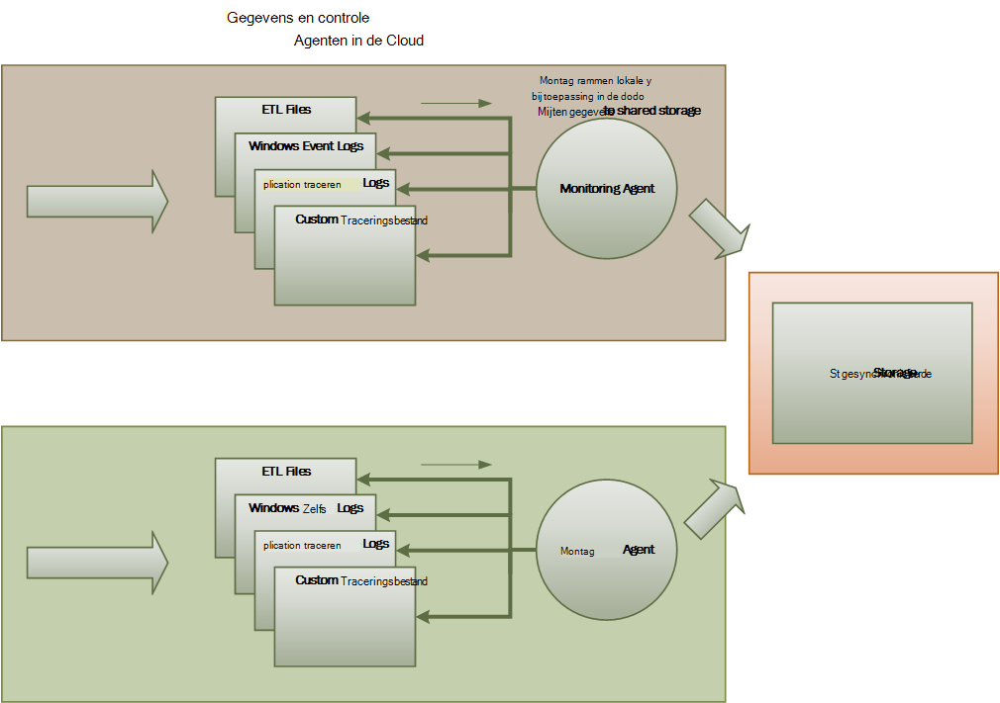
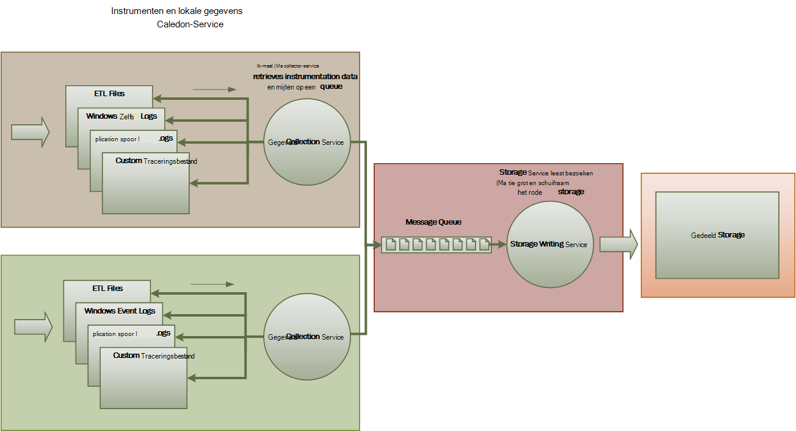
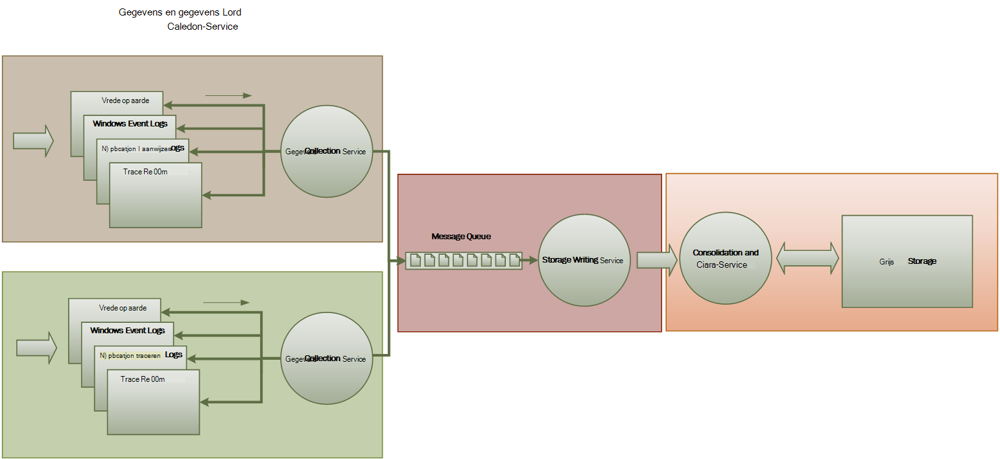

<properties
   pageTitle="Richtsnoeren voor bewaking en diagnose | Microsoft Azure"
   description="Aanbevolen procedures voor het controleren van gedistribueerde toepassingen in de cloud."
   services=""
   documentationCenter="na"
   authors="dragon119"
   manager="christb"
   editor=""
   tags=""/>

<tags
   ms.service="best-practice"
   ms.devlang="na"
   ms.topic="article"
   ms.tgt_pltfrm="na"
   ms.workload="na"
   ms.date="07/13/2016"
   ms.author="masashin"/>

# <a name="monitoring-and-diagnostics-guidance"></a>Richtsnoeren voor bewaking en diagnose

[AZURE.INCLUDE [pnp-header](../includes/guidance-pnp-header-include.md)]

## <a name="overview"></a>Overzicht
Gedistribueerde toepassingen en services die worden uitgevoerd in de cloud zijn, gezien hun aard, complexe stukjes software die bestaat uit veel bewegende onderdelen. In een productieomgeving is het belangrijk om te kunnen houden van de manier waarop gebruikers gebruikmaken van uw systeem, het brongebruik trace en de gezondheid en de prestaties van uw systeem over het algemeen te controleren. Deze gegevens kunt u als een diagnostisch hulpmiddel te detecteren en oplossen van problemen, en ook om te helpen potentiële problemen herkennen en voorkomen ze.

## <a name="monitoring-and-diagnostics-scenarios"></a>Scenario's voor bewaking en diagnose
U kunt bewaking krijgen een beter inzicht in hoe goed een systeem functioneert. Controle is een cruciaal onderdeel van het beheren van doelen voor quality of service. Gebruikelijke scenario's voor het verzamelen van meetgegevens bevatten:

- Ervoor te zorgen dat het systeem gezond blijft.
- De beschikbaarheid van het systeem en de componenten bijhouden.
- Goede prestaties om ervoor te zorgen dat de doorvoer van het systeem geen nadelige invloed op onverwacht als het volume van werk toeneemt.
- Garanderen dat het systeem voldoet aan de service level agreements (Sla) tot stand gebracht met klanten.
- Bescherming van de privacy en beveiliging van het systeem, gebruikers en hun gegevens.
- Bijhouden van de bewerkingen die worden uitgevoerd voor de controle- of regelgevende doeleinden.
- Het dagelijks gebruik van het systeem en het ontdekken van trends die tot problemen leiden kunnen als ze niet zijn opgenomen in de gaten.
- Bijhouden van problemen die zich uit het eerste rapport via analyse van mogelijke oorzaken, rectificatie, na een software-updates en implementatie voordoen.
- Bewerkingen voor tracering en foutopsporing softwareversies.

> [AZURE.NOTE] Deze lijst is niet bedoeld om te worden uitgebreid. Dit document richt zich op deze scenario's als de meest voorkomende situaties om controle uit te voeren. Mogelijk zijn er anderen die minder gebruikelijk zijn of die specifiek zijn voor uw omgeving.

In de volgende secties worden deze scenario's uitgebreider beschreven. De gegevens voor elk scenario wordt beschreven in de volgende notatie:

1. Een beknopt overzicht van het scenario
2. De normale voorschriften van dit scenario
3. De ruwe gegevens die voor de ondersteuning van het scenario en de mogelijke bronnen van deze informatie is vereist
4. Hoe deze onbewerkte gegevens kan worden geanalyseerd en gecombineerd voor het genereren van zinvolle diagnostische gegevens

## <a name="health-monitoring"></a>Statuscontrole
Een systeem is in orde als deze wordt uitgevoerd en kunnen verzoeken te verwerken. Het doel van het gezondheidstoezicht op de is een momentopname van de huidige toestand van het systeem te genereren, zodat u controleren kunt of alle onderdelen van het systeem werken zoals verwacht.

### <a name="requirements-for-health-monitoring"></a>Voorschriften inzake de bewaking van de gezondheid
Een operator moet snel (binnen een paar seconden) worden gewaarschuwd als een deel van het systeem wordt geacht te zijn beschadigd. De exploitant moet kunnen nagaan welke onderdelen van het systeem normaal functioneren en welke onderdelen zijn problemen. Status van een systeem kan worden gemarkeerd door middel van een stoplicht systeem:

- Rood voor beschadigde (het systeem is gestopt)
- Geel voor gedeeltelijk gezonde (het systeem met verminderde functionaliteit wordt uitgevoerd)
- Groen voor volledig in orde

Een uitgebreid systeem van toezicht op de gezondheid kan een operator om te doorlopen en het systeem om de status van subsystemen en onderdelen weer te geven. Bijvoorbeeld als het systeem als geheel wordt weergegeven als gedeeltelijk in orde, moet de exploitant mogelijk inzoomen en bepalen welke functionaliteit is momenteel niet beschikbaar.

### <a name="data-sources-instrumentation-and-data-collection-requirements"></a>Gegevensbronnen instrumentation eisen, en verzamelen van gegevens
De onbewerkte gegevens die is vereist voor de ondersteuning van de controle kunnen worden gegenereerd als gevolg van:

- Uitvoering van aanvragen van gebruikers traceren. Deze informatie kan worden gebruikt om te bepalen welke aanvragen zijn geslaagd en hoe lang duurt elke aanvraag die is mislukt.
- Synthetische gebruiker controleren. Dit proces simuleert de stappen die worden uitgevoerd door een gebruiker en een vooraf gedefinieerde reeks stappen volgt. De resultaten van elke stap moeten worden vastgelegd.
- Logboekregistratie van uitzonderingen fouten en waarschuwingen. Deze informatie kan worden vastgelegd als gevolg van de instructies trace ingesloten in de toepassingscode, alsmede de gebeurtenislogboeken van alle services die wordt verwezen naar het systeem op te halen.
- Controleren van de status van de diensten van derden die het systeem gebruikt. Dit toezicht mogelijk op te halen en bij het parseren van gezondheidsgegevens die deze services leveren. Deze informatie kan een groot aantal indelingen duren.
- Toezicht op het eindpunt. Dit mechanisme is meer gedetailleerd beschreven in de sectie 'Beschikbaarheid controleren'.
- Het verzamelen van informatie van de prestaties, zoals achtergrond CPU-gebruik of (inclusief netwerk) i/o-activiteit.

### <a name="analyzing-health-data"></a>Analyseren van gezondheidsgegevens
De primaire focus van het gezondheidstoezicht is snel wilt aangeven of het systeem wordt uitgevoerd. Hot analyse van de gegevens direct kan een waarschuwing als een essentieel onderdeel als beschadigd wordt gedetecteerd. (Deze niet reageert op een opeenvolgende reeks pings, bijvoorbeeld.) De exploitant kan vervolgens de passende corrigerende maatregelen nemen.

Een meer geavanceerde systeem kan een anticiperende element waarmee u een koude analyse over recente en huidige werkbelasting bevatten. Een koude analyse kunt herkent trends en te bepalen of het systeem waarschijnlijk in orde is of of het systeem moeten aanvullende bronnen. Dit voorspellende element moet worden op basis van kritieke prestatiegegevens, zoals:

- De frequentie van aanvragen die gericht zijn op elke service of subsysteem.
- De reactietijden van deze aanvragen.
- Het volume van de gegevens die naar en van elke service.

Als de waarde van een metriek een gedefinieerde drempel overschrijdt, kan het systeem een waarschuwing als u een operator of autoscaling (indien beschikbaar) te nemen preventieve acties vereist zijn voor de gezondheid van het systeem te verhogen. Deze acties kunnen betrekking hebben op bronnen, opnieuw starten van een of meer services die zijn mislukt of beperking toepassen op verzoeken voor lagere prioriteit toe te voegen.

## <a name="availability-monitoring"></a>Beschikbaarheid controleren
Een echt gezonde systeem vereist dat de onderdelen en subsystemen waaruit het systeem beschikbaar zijn. Beschikbaarheid controleren nauw verwant is aan gezondheidstoezicht. Maar dat statuscontrole onmiddellijk een overzicht van de huidige toestand van het systeem geeft, controle op beschikbaarheid is betrokken met het bijhouden van de beschikbaarheid van het systeem en de onderdelen voor het genereren van statistische gegevens over de uptime van het systeem.

Sommige onderdelen (zoals een database) zijn in veel systemen geconfigureerd met ingebouwde redundantie om snelle failover in geval van een ernstige fout of een verlies van connectiviteit mogelijk te maken. In het ideale geval moet gebruikers niet rekening houden dat dit een fout is opgetreden. Maar uit een beschikbaarheid controleren perspectief, voor het verzamelen van zoveel mogelijk informatie over dergelijke fouten de oorzaak en het nemen van corrigerende maatregelen om te voorkomen dat ze in de toekomst nodig is.

De gegevens die nodig is voor het bijhouden van de beschikbaarheid is afhankelijk van een aantal factoren van lager niveau. Veel van deze factoren kunnen zijn specifiek voor de toepassings-, systeem- en omgeving. Een doeltreffend controlesysteem legt de van beschikbaarheidsgegevens die overeenkomt met deze factoren op een laag niveau en vervolgens worden samengevoegd om aan te geven een totaalbeeld van het systeem. Bijvoorbeeld in een e-commerce-systeem, de zakelijke functionaliteit waarmee een klant om bestellingen kan afhankelijk zijn van de opslagplaats waar gegevens worden opgeslagen en het betalingssysteem dat zorgt voor de monetaire transacties voor het betalen van deze orders. De beschikbaarheid van het gedeelte van de order plaatsing van het systeem is daarom een functie van de beschikbaarheid van de opslagplaats en het subsysteem van de betaling.

### <a name="requirements-for-availability-monitoring"></a>Voorschriften voor het toezicht op beschikbaarheid
Een operator moeten ook kunnen de historische beschikbaarheid van elk systeem en het subsysteem weergeven en deze informatie gebruiken om eventuele trends waardoor een of meer subsystemen worden periodiek uitgevoerd. (Services start niet op een bepaald moment van de dag die komt met de verwerking van piekuren overeen?)

Een oplossing voor controle dient een onmiddellijke en historische overzicht van de beschikbaarheid of onbeschikbaarheid van elk subsysteem. Het moet ook snel een operator waarschuwen wanneer een of meer services mislukt of als gebruikers geen verbinding met services maken kunnen worden. Dit is een kwestie van niet alleen elke service controleren, maar ook de acties van elke gebruiker als deze acties mislukken wanneer ze proberen te communiceren met de service onderzoek. Tot op zekere hoogte een mate van connectiviteit fout is normaal en kan worden veroorzaakt door fouten van voorbijgaande aard. Maar misschien handig om het systeem een waarschuwing voor het aantal verbindingen aan een opgegeven subsysteem dat storingen tijdens een bepaalde periode optreden te verhogen.

### <a name="data-sources-instrumentation-and-data-collection-requirements"></a>Gegevensbronnen instrumentation eisen, en verzamelen van gegevens
Met een controle van de gezondheid van worden de ruwe gegevens die vereist is ter ondersteuning van de beschikbaarheid controleren ten gevolge van synthetische gebruiker prestatiecontrole en -registratie van eventuele uitzonderingen, fouten en waarschuwingen die kunnen optreden gegenereerd. Gegevens over de beschikbaarheid kan bovendien worden verkregen controle eindpunt kan uitvoeren. De toepassing kan één of meer eindpunten, gezondheid, elke testen toegang tot een functioneel gebied binnen het systeem worden blootgesteld. Het systeem van toezicht kan elk eindpunt ping volgens een ingesteld schema en verzamelt de resultaten (geslaagd of mislukt).

Alle time-outs netwerkfouten connectiviteit en opnieuw verbindingspogingen moeten worden vastgelegd. Alle gegevens moeten wel tijdstempel.

<a name="analyzing-availability-data"></a>
### <a name="analyzing-availability-data"></a>Analyseren van gegevens over de beschikbaarheid
De gegevens moeten worden samengevoegd en gecorreleerd ter ondersteuning van de volgende soorten analyse:

- De onmiddellijke beschikbaarheid van het systeem en subsystemen.
- Het uitvalpercentage voor de beschikbaarheid van het systeem en subsystemen. In het ideale geval een operator moeten kunnen fouten correlatie met specifieke activiteiten: Wat is er gebeurt wanneer niet?
- Een historisch overzicht van defecten vertoont van het systeem of de subsystemen over in de opgegeven periode en de belasting op het systeem (het aantal aanvragen van gebruikers, bijvoorbeeld) wanneer een fout is opgetreden.
- De redenen voor de onbeschikbaarheid van het systeem of de subsystemen. Bijvoorbeeld, de redenen mogelijk service niet wordt uitgevoerd, verbinding verbroken, verbonden maar time-out en verbonden, maar de terugkerende fouten.

U kunt het percentage beschikbaarheid van een service gedurende een periode berekenen met behulp van de volgende formule:

```
%Availability =  ((Total Time – Total Downtime) / Total Time ) * 100
```

Dit is handig voor SLA. ([SLA monitoring](#SLA-monitoring) wordt meer gedetailleerd beschreven verderop in deze handleiding.) De definitie van _uitvaltijd_ is afhankelijk van de service. Visual Studio Team Services bouwen-Service wordt uitvaltijd gedefinieerd als de periode (totale gecumuleerde minuten) die tijdens de Build-Service niet beschikbaar is. Een minuut wordt beschouwd als niet beschikbaar als alle continue HTTP-aanvragen te bouwen Service uitvoeren van bewerkingen in de minuut klant geïnitieerde in een foutcode resulteren of niet een antwoord terug.

## <a name="performance-monitoring"></a>Prestaties controleren
Als het systeem wordt geplaatst onder meer stress (door het verhogen van het volume van de gebruikers), wordt de grootte van de datasets die deze gebruikerstoegang groeit en de mogelijkheid van het mislukken van een of meer onderdelen van waarschijnlijker. Storingen wordt vaak voorafgegaan door een afname van prestaties. Als u een daling detecteren u kunt ingaan om de situatie te verhelpen.

Prestaties van het systeem hangt af van een aantal factoren. Elke factor wordt meestal gemeten door middel van prestatie-indicatoren (KPI's), zoals het aantal databasetransacties per seconde of het volume van de netwerkaanvragen die met succes worden verwerkt in een opgegeven periode. Sommige van deze KPI's is mogelijk beschikbaar als specifieke maatregelen, terwijl anderen kunnen worden afgeleid uit een combinatie van parameters.

> [AZURE.NOTE] Bepaling van de prestaties slecht of goed is vereist dat u begrijpt dat het niveau van de prestaties die het systeem kunnen uitvoeren moet. Hiervoor moet de inachtneming van het systeem, terwijl deze bij een normale belasting werkt en de gegevens van de KPI's vastleggen in een bepaalde tijdsperiode. Dit kan betrekking hebben op het systeem een gesimuleerde werkdruk uitgevoerd in een testomgeving en de gewenste gegevens te verzamelen voordat u het systeem naar een productieomgeving implementeert.

> U moet ook zorgen dat prestaties ter controle niet een last op het systeem wordt. U kunt mogelijk dynamisch aanpassen van de mate van detail voor de gegevens die u prestatiecontrole verzamelt.

### <a name="requirements-for-performance-monitoring"></a>Vereisten voor het controleren van de prestaties
Systeemprestaties controleren, moet een operator meestal voor informatie die bevat:

- De respons voor aanvragen van gebruikers.
- Het aantal gelijktijdige aanvragen.
- Het volume van het netwerkverkeer.
- De tarieven op welke business transacties zijn uitgevoerd.
- De gemiddelde verwerkingstijd voor aanvragen.

Ook is het handig om hulpprogramma's waarmee een operator waarmee u steunkleuren correlaties, zoals:

- Het aantal gelijktijdige gebruikers versus aanvraaglatentie tijden (hoe lang het duurt om te starten met het verwerken van een aanvraag, nadat de gebruiker is verzonden).
- Het aantal gelijktijdige gebruikers versus de gemiddelde responstijd (hoe lang het duurt om een aanvraag te voltooien nadat deze verwerking is gestart).
- Het volume van aanvragen en het aantal fouten bij bestandsverwerking.

Met deze functionele informatie op hoog niveau moeten een operator kunnen verkrijgen van een gedetailleerde weergave van de prestaties voor elk onderdeel in het systeem. Deze gegevens worden gewoonlijk geleverd door low-level prestatiemeteritems die gegevens, zoals bijhouden:

- Geheugengebruik.
- Het aantal threads.
- CPU-verwerkingstijd.
- Lengte van wachtrij voor aanvragen.
- Schijf of netwerk-i/o-tarieven en fouten.
- Aantal bytes geschreven of gelezen.
- Middleware-indicatoren, zoals de wachtrijlengte.

Alle visualisaties mag een exploitant een periode opgeven. De weergegeven gegevens kan zijn een momentopname van de huidige situatie en/of een historisch overzicht van de prestaties.

Een operator moet u mogelijk een waarschuwing op basis van elke maatregel prestaties voor een opgegeven waarde in een opgegeven tijdsinterval te verhogen.

### <a name="data-sources-instrumentation-and-data-collection-requirements"></a>Gegevensbronnen instrumentation eisen, en verzamelen van gegevens
U kunt prestatiegegevens op hoog niveau (doorvoer, aantal gelijktijdige gebruikers, het aantal zakelijke transacties en tarieven fout) verzamelen door het controleren van de voortgang van aanvragen van gebruikers als ze binnenkomen en via het systeem. Dit houdt in dat instructies traceren op belangrijke punten in de toepassingscode, samen met informatie over tijdsinstellingen opnemen. Met voldoende gegevens voor het correleren van hen met de aanvragen die ze hebben veroorzaakt moeten alle fouten, uitzonderingen en waarschuwingen worden vastgelegd. Het logboek Internet Information Services (IIS) is een andere nuttige bron.

Indien mogelijk moet u ook prestatiegegevens voor externe systemen die worden gebruikt voor de toepassing vastleggen. Deze externe systemen bieden mogelijk hun eigen prestatiemeteritems of andere functies voor het aanvragen van prestatiegegevens. Als dit niet mogelijk, record gegevens zoals de begin- en eindtijd van elk verzoek van een extern systeem, samen met de status (geslaagd, mislukt of waarschuwing) van de bewerking. Zo kunt u een stopwatch aanpak op tijd aanvragen: een timer starten wanneer de aanvraag wordt gestart en vervolgens de timer stoppen als de aanvraag is voltooid.

Low-level prestatiegegevens voor afzonderlijke onderdelen in een systeem mogelijk beschikbaar zijn via de functies en services, zoals Windows-prestatiemeteritems en Azure diagnostische gegevens.

### <a name="analyzing-performance-data"></a>Prestatiegegevens analyseren
Veel van de analyse werk bestaat uit het verzamelen van prestatiegegevens door gebruiker aanvraagtype en/of het subsysteem of service waarop elke aanvraag wordt verzonden. Een voorbeeld van een aanvraag van de gebruiker een item toe te voegen aan uw winkelwagen of afrekenen uitvoeren in een e-commerce-systeem.

Een andere algemene vereiste samenvatten gegevens in geselecteerde percentielen. Een operator bepaalt bijvoorbeeld de reactietijden voor 99% van de aanvragen, 95 procent van de aanvragen en 70 procent van de aanvragen. SLA-doelen mogelijk of andere doelstellingen voor elke percentiel ingesteld. De voortdurende resultaten moeten worden gerapporteerd in bijna real-time bij het vaststellen van de onmiddellijke problemen. De resultaten moeten ook worden samengevoegd voor statistische doeleinden de langere periode.

In het geval van latentieproblemen met prestaties, moeten een operator kunnen de oorzaak van het knelpunt snel identificeren door het onderzoeken van de latentie van elke stap waarmee elke aanvraag. De prestatiegegevens moeten daarom bieden een mogelijkheid voor het correleren van prestatienormen voor elke stap ze te moeten koppelen aan een specifiek verzoek.

Afhankelijk van de vereisten visualisatie kan zijn handig voor het genereren en een gegevenskubus met weergaven van de onbewerkte gegevens opgeslagen. Deze gegevenskubus kunt opvragen van complexe ad-hoc en analyse van de informatie over de prestaties.

## <a name="security-monitoring"></a>Beveiliging controleren
Alle commerciële systemen die gevoelige gegevens bevatten, moeten een structuur beveiliging implementeren. De complexiteit van het beveiligingsmechanisme dat is meestal een functie van de gevoeligheid van de gegevens. In een systeem dat gebruikers moeten worden geverifieerd, moet u registreren:

- Alle aanmeldingspogingen, of ze is mislukt of mislukt.
- Alle bewerkingen uitgevoerd door-- en de details van alle bronnen toegankelijk door--een geverifieerde gebruiker.
- Wanneer een gebruiker een sessie wordt beëindigd en meldt zich af.

Controle mogelijk voor het vaststellen van aanvallen op het systeem. Een groot aantal mislukte aanmeldingspogingen kan bijvoorbeeld aangeven dat een brute kracht-aanval. Een onverwachte toename aanvragen zijn het resultaat van een distributed denial of service (DDoS) aanval. U moet worden voorbereid voor het controleren van alle aanvragen voor alle resources, ongeacht de bron van deze aanvragen. Een systeem dat een beveiligingslek aanmelden is kan per ongeluk resources voor de buitenwereld zonder dat een gebruiker daadwerkelijk aanmelden blootgesteld.

### <a name="requirements-for-security-monitoring"></a>Vereisten voor de beveiliging controleren
De meest belangrijke aspecten van beveiliging controle moeten een operator om te snel inschakelen:

- Poging tot beveiligingsrisico's worden gedetecteerd door een niet-geverifieerde entiteit.
- Diensten voor het uitvoeren van bewerkingen op de gegevens die ze hebben geen toegang pogingen identificeren.
- Bepalen of het systeem of een deel van het systeem, bij een aanval van binnen of buiten is. (Bijvoorbeeld een kwaadwillende geverifieerde gebruiker mogelijk aan het proberen om het systeem ingedrukt.)

Ter ondersteuning van deze eisen, moet een operator worden gewaarschuwd:

- Als u één account herhaalde niet aanmeldingspogingen binnen een bepaalde periode.
- Als een geverifieerde account wordt herhaaldelijk probeert toegang te krijgen tot een bron verboden gedurende een bepaalde periode.
- Als u een groot aantal aanvragen voor niet-geverifieerde of niet-gemachtigde optreden gedurende een bepaalde periode.

De informatie die wordt verstrekt aan een operator kan het adres van de host van de bron voor elke aanvraag moet bevatten. Als er ontstaan regelmatig schendingen van de beveiliging van een bepaald bereik van adressen, kunnen deze hosts worden geblokkeerd.

Een belangrijk onderdeel in het onderhouden van de beveiliging van een systeem wordt herkend snel acties die van het gebruikelijke patroon afwijken. Gegevens zoals het aantal mislukte en/of geslaagde-in-aanvragen kan visueel worden weergegeven om te bepalen of er een piek van de activiteit op een ongebruikelijk tijdstip is. (Een voorbeeld van deze activiteit is gebruikers aanmelden om 3:00 AM en een groot aantal bewerkingen uitvoeren bij het starten van hun werkdag om 9:00 uur). Deze informatie kan ook worden gebruikt om te configureren op basis van tijd autoscaling. Bijvoorbeeld, als een operator neemt dat een groot aantal gebruikers zich regelmatig aanmelden op een bepaald moment van de dag, de operator aanvullende services zou u het volume van het werk, sluit deze extra services bij de piek is verstreken starten kunt rangschikken.

### <a name="data-sources-instrumentation-and-data-collection-requirements"></a>Gegevensbronnen instrumentation eisen, en verzamelen van gegevens
Beveiliging is een aspect dat omvat van alle meest gedistribueerde systemen. De relevante gegevens is waarschijnlijk op meerdere punten in een systeem worden gegenereerd. Tot vaststelling van een aanpak voor informatie over beveiliging en gebeurtenis Management (SIEM) veiligheidsgerelateerde informatie die uit gebeurtenissen die door de toepassing, netwerkapparatuur, servers, firewalls, antivirussoftware en andere elementen voor de preventie van onrechtmatige toegang voortvloeit, moet u overwegen.

Beveiliging bewaking kan gegevens uit programma's die geen deel uitmaken van uw toepassing opnemen. Deze hulpprogramma's kunnen opnemen die activiteiten door externe bureaus of Netwerkfilters die pogingen om niet-geverifieerde toegang krijgen tot uw toepassing en gegevens scannen van poorten te identificeren.

In alle gevallen moet de verzamelde gegevens een beheerder bepalen de aard van een aanval en de passende tegenmaatregelen neemt inschakelen.

### <a name="analyzing-security-data"></a>Beveiligingsgegevens analyseren
Een functie van het toezicht op veiligheid is de uiteenlopende bronnen waaruit de gegevens ontstaat. De verschillende indelingen en mate van detail vereist vaak complexe analyses van de opgenomen gegevens met elkaar verbinden in een samenhangend thread van informatie. Naast de eenvoudigste van de gevallen (bijvoorbeeld een groot aantal mislukte aanmeldingen of herhaalde pogingen tot onbevoegde toegang krijgen tot belangrijke bronnen detecteren), is het niet mogelijk voor het uitvoeren van een complexe geautomatiseerde gegevensverwerking beveiliging. In plaats daarvan misschien het beter deze gegevens, maar in de oorspronkelijke vorm, voor een veilige bewaarplaats voor deskundige handmatige analyse tijdsaanduiding te schrijven.

<a name="SLA-monitoring"></a>

## <a name="sla-monitoring"></a>SLA monitoring
Veel commerciële systemen die ondersteuning bieden voor betalende klanten maken garanties over de prestaties van het systeem in de vorm van SLA's. Sla's staat in feite dat het systeem een bepaald volume van het werk binnen een overeengekomen periode en zonder verlies van kritieke gegevens kan verwerken. SLA monitoring ervoor te zorgen dat het systeem kan voldoen aan meetbare Sla's betreft.

> [AZURE.NOTE] SLA monitoring is nauw verwant aan het controleren van de prestaties. Maar dat ervoor te zorgen dat het systeem functies _optimaal_prestatiecontrole is betrokken, SLA monitoring wordt geregeld door een contractuele verplichting die bepaalt welke _optimaal_ daadwerkelijk betekent.

Sla's zijn vaak gedefinieerd in termen van:

- Algemene beschikbaarheid van het systeem. Een organisatie kan bijvoorbeeld garanderen dat het systeem beschikbaar voor 99,9 procent van de tijd zijn zal. Dit is gelijk aan niet meer dan 9 uur downtime per jaar of ongeveer 10 minuten per week.
- Operationele doorvoer. Dit aspect wordt vaak uitgedrukt in een of meer – hoogwatermarkeringen, zoals het garanderen van of het systeem kunt ondersteunen maximaal 100.000 gelijktijdige aanvragen 10.000 gelijktijdige zakelijke transacties verwerken.
- Operationele reactietijd. Het systeem doet ook garanties met betrekking tot de frequentie waarmee aanvragen worden verwerkt. Een voorbeeld is dat 99 procent van alle zakelijke transacties binnen 2 seconden eindigt en geen enkele transactie langer dan 10 seconden duurt.

> [AZURE.NOTE] Sommige opdrachten voor commerciële systemen mogelijk ook Sla's voor customer support. Een voorbeeld is dat alle helpdesk-aanvragen zullen roepen een antwoord binnen 5 minuten en dat 99 procent van alle problemen volledig zijn opgelost binnen 1 werkdag. Effectief [plan van aanpak](#issue-tracking) (verderop in deze sectie) is essentieel om dergelijke Sla's.

### <a name="requirements-for-sla-monitoring"></a>Voorschriften inzake de bewaking van SLA
Op het hoogste niveau moet een exploitant kunnen bepalen in één oogopslag of het systeem aan de overeengekomen Sla's of niet voldoet. En als u niet de exploitant kan inzoomen omlaag en onderzoekt de onderliggende factoren om te bepalen van de redenen voor de prestaties van schepen.

Typische belangrijke indicatoren die kunnen worden die visueel omvatten:

- Het percentage van de actieve tijdsduur van service.
- De doorvoer van de toepassing (gemeten in termen van geslaagde transacties en/of bewerkingen per seconde).
- Het aantal geslaagde/mislukte aanvragen.
- Het nummer van de toepassings- en paginafouten, uitzonderingen en waarschuwingen.

Alle van deze indicatoren moet kunnen worden gefilterd op een bepaalde periode.

Een wolk toepassing zal waarschijnlijk een aantal subsystemen en onderdelen omvatten. Een operator moet een indicator op hoog niveau selecteren en bekijken hoe van de gezondheid van de onderliggende elementen bestaat. Bijvoorbeeld, als de uptime van het systeem als geheel onder een aanvaardbare waarde valt, moet een operator mogelijk inzoomen en bepalen welke elementen zijn die bijdragen tot deze storing.

> [AZURE.NOTE] Uptime van het systeem moet zorgvuldig worden gedefinieerd. Mislukken van afzonderlijke exemplaren van de elementen in een systeem dat gebruikmaakt van redundantie voor maximale beschikbaarheid te garanderen, maar het systeem kan blijven functioneel. De totale bedrijfstijd van elk element, en niet noodzakelijkerwijs of het systeem werkelijk is gestopt uptime van het systeem zoals voorgesteld door het gezondheidstoezicht aangeven. Bovendien kunnen fouten worden geïsoleerd. Dus zelfs als een bepaald systeem niet beschikbaar is, kan de rest van het systeem blijven beschikbaar, maar met verminderde functionaliteit. (In een e-commerce-systeem, een storing in het systeem kan voorkomen dat een klant orders te plaatsen, maar de klant nog steeds mogelijk om te bladeren in de productcatalogus.)

Voor de signalering van toepassing, moet het systeem kunnen om aan te trekken van een gebeurtenis als een van de belangrijke indicatoren een bepaalde drempel overschrijden. De details van het niveau van de verschillende factoren die het opstellen van de indicator op hoog niveau zijn als contextuele gegevens waarschuwingsmethoden systeem beschikbaar.

### <a name="data-sources-instrumentation-and-data-collection-requirements"></a>Gegevensbronnen instrumentation eisen, en verzamelen van gegevens
De onbewerkte gegevens die vereist is ter ondersteuning van SLA monitoring is vergelijkbaar met de onbewerkte gegevens die vereist is voor het controleren van de prestaties, en bepaalde aspecten van de gezondheid en de controle op beschikbaarheid. (Zie de secties voor meer informatie.) U kunt deze gegevens vastleggen:

- Bezig met controleren van eindpunt.
- Logboekregistratie van uitzonderingen fouten en waarschuwingen.
- Het uitvoeren van aanvragen van gebruikers traceren.
- Monitoring van de beschikbaarheid van services van derden die het systeem gebruikt.
- Met behulp van prestatiegegevens en tellers.

Alle gegevens moeten getimede en tijdstempel.

### <a name="analyzing-sla-data"></a>SLA gegevens analyseren
De gegevens moeten worden samengevoegd voor het genereren van een afbeelding van de algehele prestaties van het systeem. Geaggregeerde gegevens moeten ook inzoomen zodat onderzoek van de prestaties van de onderliggende subsystemen ondersteunen. Bijvoorbeeld, moeten u kunnen:

- Het totale aantal gebruikersaanvragen gedurende een bepaalde periode berekenen en bepalen wat de snelheid van het slagen of mislukken van deze aanvragen.
- Combineer de reactietijden van aanvragen van gebruikers voor het genereren van een algemeen overzicht van de reactietijden van het systeem.
- Analyseren van de voortgang van aanvragen van gebruikers voor het uitsplitsen van de totale reactietijd van een aanvraag in de reactietijden van de afzonderlijke werkitems in die aanvraag.  
- De algemene beschikbaarheid van het systeem als een percentage van de uptime van voor een bepaalde periode vast.
- Het percentage beschikbaarheid van de afzonderlijke onderdelen en services op het systeem analyseren. Dit kan inhouden bij het parseren van logboeken die services van andere leveranciers hebt gegenereerd.

Veel commerciële systemen vereist echte prestaties cijfers tegen de overeengekomen Sla's voor een bepaalde periode, meestal een maand. Deze informatie kan worden gebruikt voor het berekenen van kredieten of andere vormen van terugbetalingen voor klanten als de SLA's in die periode niet wordt voldaan. De beschikbaarheid van een service kunt u berekenen met behulp van de methode beschreven in de sectie [gegevens over de beschikbaarheid analyseren](#analyzing-availability-data).

Ook voor interne doeleinden, kan een organisatie het aantal en de aard van de incidenten die services storing veroorzaakt bijhouden. Leren hoe u deze problemen snel oplossen of deze volledig te elimineren kunt om de uitvaltijd en voldoen aan de SLA's.

## <a name="auditing"></a>Controle
Afhankelijk van de aard van de toepassing, kunnen er wettelijke of andere wettelijke regelingen die vereisten opgeven voor de controle van de gebruikers en toegang tot alle gegevens opnemen. Controle kan bewijzen dat klanten koppelingen naar specifieke verzoeken. Desavoueren voorkomen is een belangrijke factor in veel e-business-systemen om te helpen met het onderhouden van een vertrouwensrelatie tussen een klant en de organisatie die verantwoordelijk is voor de toepassing of service.

### <a name="requirements-for-auditing"></a>Voorschriften voor de controle
Een analist moet op het spoor van de volgorde van de bedrijfsactiviteiten die gebruikers uitvoeren zodat u acties van gebruikers reconstrueren kunt. Dit kan nodig zijn als een kwestie van een record, of als onderdeel van een forensisch onderzoek.

Controle-informatie is uiterst gevoelig. Deze bevat waarschijnlijk gegevens waarmee de gebruikers van het systeem, met de taken die zij uitvoert. Om deze reden, controle-informatie zullen waarschijnlijk de vorm aannemen van rapporten die alleen beschikbaar voor vertrouwde analisten zijn in plaats van als een interactief systeem dat ondersteuning biedt voor detailanalyse van grafische bewerkingen. Een analist moet u mogelijk een reeks rapporten te genereren. Rapporten kunnen bijvoorbeeld lijst activiteiten van alle gebruikers die zich voordoen tijdens een opgegeven tijdsperiode, details van de chronologie van de activiteit voor één gebruiker of de volgorde van bewerkingen die worden uitgevoerd op een of meer resources weergeven.

### <a name="data-sources-instrumentation-and-data-collection-requirements"></a>Gegevensbronnen instrumentation eisen, en verzamelen van gegevens
De primaire bronnen van informatie voor de controle kunnen omvatten:

- Het beveiligingssysteem dat verificatie van de gebruiker wordt beheerd.
- Traceerlogboeken voor het registreren van gebruikersactiviteiten.
- Beveiligingslogboeken, die alle herkenbare en identiteit netwerkaanvragen bijhouden.

De indeling van de audit-gegevens en de manier waarop deze opgeslagen, kan worden veroorzaakt door de wettelijke voorschriften. Bijvoorbeeld, het niet mogelijk om de gegevens op geen enkele manier schoon te. (Deze moet worden vastgelegd in de oorspronkelijke indeling.) Toegang tot de opslagplaats waar wordt gehouden, moet worden beveiligd om geknoei te voorkomen.

### <a name="analyzing-audit-data"></a>Analyseren van controlegegevens
Een analist moet toegang kunnen krijgen tot de ruwe gegevens in hun geheel, in de oorspronkelijke vorm. Afgezien van de verplichting om algemene audit rapporten te genereren, worden de hulpprogramma's voor het analyseren van deze gegevens waarschijnlijk gespecialiseerd zijn en het systeem extern gehouden.

## <a name="usage-monitoring"></a>Gebruik controleren
Gebruik controle wordt bijgehouden hoe de functies en onderdelen van een toepassing worden gebruikt. Een operator kan de verzamelde gegevens te gebruiken:

- Te bepalen welke functies worden intensief gebruikt en alle mogelijke hotspots in het systeem. Intensief verkeer elementen nuttig functionele partitioneren of zelfs replicatie gelijkmatiger verspreiden van de belasting. Een operator kan deze informatie ook gebruiken om na te gaan welke functies worden niet vaak gebruikt en zijn mogelijke kandidaten voor pensionering of vervanging in een toekomstige versie van het systeem.
- Informatie verkrijgen over de operationele gebeurtenissen van het systeem dat bij normaal gebruik. U kunt bijvoorbeeld de statistische gegevens over het aantal transacties en de omvang van de klanten die verantwoordelijk voor deze zijn opnemen in een e-commercesite. Deze informatie kan worden gebruikt voor de capaciteitsplanning, zoals het aantal klanten groeit.
- Tevredenheid van de gebruiker met de prestaties of functionaliteit van het systeem worden gedetecteerd (mogelijk indirect). Bijvoorbeeld, als een groot aantal klanten in een e-commerce systeem regelmatig hun winkelwagentjes gewoon laten, dit mogelijk vanwege een probleem met de functie voor uitchecken.
- Informatie over facturering genereren. Een commerciële toepassing of service multitenant mogelijk brengen van klanten voor de bronnen die ze gebruiken.
- Quota afdwingen. Als een gebruiker in een multitenant systeem groter is dan hun quota betaalde gebruik of de resource gedurende een bepaalde periode te verwerken, hun toegang kan worden beperkt of snelheid van verwerking.

### <a name="requirements-for-usage-monitoring"></a>Vereisten voor het gebruik controleren
Het gebruik van onderzoeken, moet een operator meestal Zie informatie over:

- Het aantal aanvragen die zijn verwerkt door elk subsysteem en bestemd is voor elke resource.
- Het werk dat het uitvoeren van elke gebruiker.
- Het volume van de gegevensopslag die elke gebruiker in beslag neemt.
- De resources die door elke gebruiker toegang heeft tot.

Een operator moeten ook kunnen grafieken genereren. Bijvoorbeeld een grafiek de meest resource grote gebruikers kan weergeven of het meest toegang krijgen tot bronnen of functies.

### <a name="data-sources-instrumentation-and-data-collection-requirements"></a>Gegevensbronnen instrumentation eisen, en verzamelen van gegevens
Gebruik bijhouden kan worden uitgevoerd op een relatief hoog niveau. Deze kunt noteren de begin- en eindtijden van elke aanvraag en de aard van de aanvraag (lezen, schrijven, enzovoort, afhankelijk van het object in kwestie). U kunt deze gegevens door downloaden:

- Traceren van gebruikersactiviteiten.
- Het opnemen van prestatiemeteritems die het gebruik voor elke resource te meten.
- Het verbruik van middelen door elke gebruiker in de gaten.

Voor de meting van toepassing, moet u ook bepalen welke gebruikers zijn verantwoordelijk voor het uitvoeren van welke bewerkingen en de bronnen die gebruikmaken van deze bewerkingen kunnen worden. De verzamelde informatie moet gedetailleerd genoeg om nauwkeurige facturering.

<a name="issue-tracking"></a>
## <a name="issue-tracking"></a>Plan van aanpak
Klanten en andere gebruikers misschien problemen rapporteren als onverwachte gebeurtenissen of het probleem zich in het systeem voordoet. Bijhouden van kwesties heeft betrekking op het beheer van deze problemen, koppelt de inspanningen op te lossen de onderliggende problemen in het systeem en voorlichting van de klanten van mogelijke oplossingen.

### <a name="requirements-for-issue-tracking"></a>Vereisten voor het bijhouden van kwesties
Operatoren voeren vaak bijhouden met behulp van een afzonderlijk systeem waarmee deze record- en de details van de problemen die gebruikers rapporteren. Deze gegevens kunnen bevatten de taken die de gebruiker heeft geprobeerd uit te voeren, symptomen van het probleem, de volgorde van gebeurtenissen, en eventuele fout- of waarschuwingsberichten die zijn verleend.

### <a name="data-sources-instrumentation-and-data-collection-requirements"></a>Gegevensbronnen instrumentation eisen, en verzamelen van gegevens
De oorspronkelijke gegevensbron voor actie-items gegevens is de gebruiker die het probleem in eerste instantie gemeld. De gebruiker mogelijk bijkomende gegevens te verstrekken, zoals:

- Een crashdump (als de toepassing een component die wordt uitgevoerd op het bureaublad van de gebruiker bevat).
- Een momentopname van een scherm.
- De datum en tijd waarop de fout is opgetreden, samen met andere milieu-informatie zoals de locatie van de gebruiker.

Deze informatie kan worden gebruikt om te helpen de foutopsporing inspanning en samen te stellen van een reserve voor toekomstige versies van de software.

### <a name="analyzing-issue-tracking-data"></a>Actie-items gegevens analyseren
Andere gebruikers kunnen hetzelfde probleem rapporteren. Het systeem van actie-items moet algemene rapporten te koppelen.

De voortgang van de foutopsporing inspanningen moet worden geboekt tegen elk probleemrapport. Als het probleem is opgelost, kan de klant worden geïnformeerd over de oplossing.

Als een gebruiker een probleem met een bekende oplossing in het systeem van actie-items meldt, moet de operator onmiddellijk kennis van de gebruiker van de oplossing kunnen zijn.

## <a name="tracing-operations-and-debugging-software-releases"></a>Bewerkingen tracering en foutopsporing van softwareversies
Wanneer een gebruiker een probleem meldt, is vaak alleen de gebruiker op de hoogte van de direct invloed op hun activiteiten heeft. De gebruiker kan alleen meldt de resultaten van hun eigen ervaring aan een operator die verantwoordelijk is voor het onderhoud van het systeem. Deze ervaringen zijn meestal gewoon een zichtbare symptoom van een of meer fundamentele problemen. In veel gevallen moet een analist graven via de chronologie van de onderliggende verrichtingen vast te stellen van de oorzaak van het probleem. Dit proces heet _hoofdoorzaak analyse_.

> [AZURE.NOTE] Hoofdoorzaakanalyses mogelijk inefficiënties in het ontwerp van een toepassing aan het licht komen. In deze gevallen is het mogelijk zijn voor het bijwerken van de onderdelen waarin dit probleem optreedt en implementeren als onderdeel van een latere versie. Dit proces vereist zorgvuldig beheer en bijgewerkte onderdelen moeten nauwlettend worden gevolgd.

### <a name="requirements-for-tracing-and-debugging"></a>Vereisten voor tracering en foutopsporing
Voor het traceren van onverwachte gebeurtenissen en andere problemen, is het essentieel dat de meetgegevens biedt voldoende informatie om te schakelen van een analist traceren terug naar de oorsprong van deze problemen en reconstrueren van de reeks gebeurtenissen die zich hebben voorgedaan. Deze informatie moet voldoende zijn voor een analist bij de diagnose van de oorzaak van problemen. Een ontwikkelaar kan Breng de nodige wijzigingen om te voorkomen dat ze in de toekomst.

### <a name="data-sources-instrumentation-and-data-collection-requirements"></a>Gegevensbronnen instrumentation eisen, en verzamelen van gegevens
Het oplossen van problemen kan betrekking hebben op tracering alle methoden (en hun parameters) als onderdeel van een bewerking aangeroepen voor het bouwen van een structuur die ziet u de logische stroom door het systeem wanneer een klant een bepaalde aanvraag indient. Uitzonderingen en waarschuwingen die door het systeem worden gegenereerd als gevolg van deze overdracht moeten worden opgenomen en vastgelegd.

Ondersteuning voor foutopsporing, kan worden gegeven haken waarmee een operator voor het vastleggen van informatie over de status op cruciale punten in het systeem. Of het systeem de voortgang van geselecteerde bewerkingen gedetailleerd stapsgewijze informatie bieden. Vastleggen van gegevens op dit niveau een extra belasting op het systeem kunnen worden opgelegd en moet een tijdelijke proces. Een operator wordt dit proces hoofdzakelijk wanneer een zeer ongewone reeks gebeurtenissen vindt plaats en is moeilijk te repliceren, of wanneer een nieuwe versie van een of meer elementen in een systeem vereist een zorgvuldige controle om ervoor te zorgen dat de elementen werken zoals verwacht.

## <a name="the-monitoring-and-diagnostics-pipeline"></a>De pijplijn voor bewaking en diagnose
Een gedistribueerd systeem voor grootschalige monitoring vormt een belangrijke uitdaging. De scenario's beschreven in de vorige sectie niet noodzakelijkerwijs beschouwd in isolatie. Er is waarschijnlijk een aanzienlijke overlapping in de bewaking en diagnostische gegevens die voor elke situatie vereist is, hoewel deze gegevens moeten mogelijk worden verwerkt en gepresenteerd op verschillende manieren. Om deze redenen, moet u een overzichtsweergave van bewaking en diagnostiek te houden.

U kunt de volledige controle en diagnose proces als een pijpleiding die bestaat uit de in figuur 1 weergegeven stadia voorzien.


_Figuur 1. De fasen in de pijplijn voor bewaking en diagnose_

Figuur 1 belicht hoe de gegevens voor de bewaking en diagnostische gegevens kunnen afkomstig zijn uit een groot aantal verschillende gegevensbronnen. De fasen van de instrumenten en de collectie betrokken zijn bij het identificeren van de bronnen van de plaats waar de gegevens moeten worden vastgelegd om te bepalen welke gegevens vast te leggen, het vastleggen en hoe deze gegevens zo opmaken dat deze gemakkelijk kan worden onderzocht. Het werkgebied analyse/diagnose neemt de onbewerkte gegevens en wordt gebruikt voor het genereren van zinvolle informatie waarmee een operator om te bepalen wat de status van het systeem. De operator kan deze informatie gebruiken om beslissingen te nemen over mogelijke acties te nemen en feed vervolgens de resultaten weer in de stadia van de instrumenten en de collectie. De visualisatie/signalering fase fase geeft verbruikbare overzicht van de systeemstatus. Informatie kan worden weergegeven in bijna real-time met behulp van een reeks van dashboards. En deze rapporten, grafieken en diagrammen voor een historische weergave van de gegevens die kunnen helpen bij het identificeren van tendensen op lange termijn kan genereren. Als de informatie aangeeft dat een KPI zal aanvaardbare grenzen overschrijden, kan deze fase ook een waarschuwing aan een operator. In sommige gevallen kan een waarschuwing ook worden gebruikt voor het starten van een geautomatiseerd proces dat u probeert te treffen corrigerende maatregelen, zoals autoscaling.

Houd er rekening mee dat deze stappen vormen een continue stroom proces waarbij de fasen zijn gebeurt parallel. In het ideale geval alle fasen worden dynamisch worden geconfigureerd. Op sommige punten, vooral wanneer een nieuw is geïmplementeerd of er zijn problemen, kan het nodig zijn uitgebreide om gegevens te verzamelen op een meer regelmatige basis. Op andere momenten, moet het mogelijk zijn om terug te keren tot het vastleggen van een basisniveau van essentiële informatie om te controleren of het systeem goed functioneert.

Bovendien worden de hele controleproces overwogen een levende, continue oplossing die valt onder de "fine-tuning"-verbeteringen als gevolg van de feedback. U kunt bijvoorbeeld beginnen met het meten van vele factoren om te bepalen van de status van een systeem. Analyse na verloop van tijd kan leiden tot een verfijning als u maatregelen die niet relevant is negeren, zodat u nauwkeuriger concentreren op de gegevens die u nodig hebt tijdens het achtergrond lawaai tot een minimum beperken.

## <a name="sources-of-monitoring-and-diagnostic-data"></a>Bronnen van bewaking en diagnostische gegevens
De informatie die het controleproces gebruikt kan afkomstig zijn uit verschillende bronnen, zoals geïllustreerd in figuur 1. Op het niveau afkomstig informatie van traceerlogboeken opgenomen in de code van het systeem. Ontwikkelaars moeten volgen een standaard aanpak voor het bijhouden van de stroom van de besturing door middel van hun code. Een vermelding voor een methode kan bijvoorbeeld een bericht traceren met de naam van de methode, de huidige tijd, de waarde van elke parameter en andere relevante informatie te verzenden. Registratie van de tijden en uitgangen kan ook nuttig zijn.

U moet alle uitzonderingen en waarschuwingen in logboek registreren en ervoor te zorgen dat u een volledige tracering van alle geneste uitzonderingen en waarschuwingen behouden. In het ideale geval moet u de informatie die de gebruiker die de code van activiteit correlatie-informatie identificeert (voor het bijhouden van aanvragen als ze het systeem passeren) wordt uitgevoerd ook vastleggen. En u probeert toegang te krijgen tot alle bronnen zoals berichtenwachtrijen, databases, bestanden en andere afhankelijke services moet aanmelden. Deze informatie kan worden gebruikt voor de meting en controledoeleinden.

Veel toepassingen maken gebruik van bibliotheken en frameworks voor het uitvoeren van veelvoorkomende taken, zoals toegang tot een gegevensarchief of via een netwerk communiceren. Deze kaders mogelijk configureerbaar voor hun eigen traceringsberichten en ruwe diagnostische gegevens, zoals de transactie tarieven en data transmission successen en mislukkingen.

> [AZURE.NOTE] Veel moderne frameworks publiceren automatisch, prestaties en het traceren van gebeurtenissen. Het vastleggen van deze informatie is gewoon een kwestie van de mogelijkheid voor het ophalen en opslaan waar deze kan worden verwerkt en geanalyseerd.

Het besturingssysteem waarop de toepassing wordt uitgevoerd, kan een bron van laag niveau algemene informatie, zoals prestatiemeteritems die i/o-tarieven, het geheugengebruik en CPU-gebruik aangeven zijn. Besturingssysteemfouten (zoals het gebrek aan een bestand correct geopend) kunnen ook worden vermeld.

U moet ook rekening houden met de onderliggende infrastructuur en onderdelen op uw systeem wordt uitgevoerd. Virtuele machines, virtuele netwerken en opslag kunnen worden bronnen van belangrijke infrastructuur niveau prestatiemeteritems en andere diagnostische gegevens.

Als uw toepassing gebruikmaakt van andere externe diensten, zoals een webserver of database management systeem deze services kunnen worden gepubliceerd hun eigen trace-informatie, logboeken en prestatiemeteritems. Voorbeelden zijn SQL Server dynamische Management-weergaven voor het bijhouden van bewerkingen die worden uitgevoerd op een SQL Server-database en traceerlogboeken voor het registreren van aanvragen voor een webserver IIS.

Als de onderdelen van een systeem worden aangepast en nieuwe versies worden ingezet, is het belangrijk te kunnen problemen met het kenmerk, gebeurtenissen en Maatstelsel van elke versie. Deze informatie moet terug naar de pijpleiding release worden gekoppeld zodat problemen met een specifieke versie van een onderdeel worden snel worden getraceerd en opgelost.

Beveiligingsproblemen kunnen optreden op elk punt in het systeem. Een gebruiker kan bijvoorbeeld proberen aan te melden met een ongeldige gebruikersnaam of wachtwoord. Een geverifieerde gebruiker proberen onbevoegde toegang krijgen tot een bron. Of een gebruiker een ongeldige of verouderde sleutel voor toegang tot de gecodeerde gegevens kan bevatten. Beveiligingsinformatie voor geslaagde en beschadigde aanvragen moet altijd worden vastgelegd.

Het [opzetten van een toepassing](#instrumenting-an-application) sectie bevat richtlijnen voor meer op de gegevens die u moet vastleggen. Maar kunt u verschillende strategieën gebruiken om deze informatie te verzamelen:

- **Toepassing/systeemcontrole**. Deze strategie maakt gebruik van interne bronnen binnen de toepassing toepassingskaders, besturingssysteem en infrastructuur. De toepassingscode kan genereren zijn eigen gegevens op belangrijke punten tijdens de levenscyclus van de aanvraag van een client controleren. De toepassing kan traceren instructies die selectief kunnen worden ingeschakeld of uitgeschakeld als de omstandigheden bevatten. Het is ook mogelijk om diagnostische gegevens dynamisch invoeren met behulp van een diagnostics framework. Deze kaders geven doorgaans plug-ins die kunt koppelen aan verschillende instrumentation punten in uw code en traceergegevens vastleggen op deze punten.

    Bovendien kan uw code en/of de onderliggende infrastructuur gebeurtenissen op kritieke punten verhogen. Herstelagenten die zijn geconfigureerd om te luisteren naar deze gebeurtenissen controleren kan de informatie over de gebeurtenis vastleggen.

- **Controle van de werkelijke gebruiker**. Deze benadering legt de interactie tussen een gebruiker en de toepassing en neemt de stroom van elke aanvraag en het antwoord. Deze informatie kan hebben een tweeledig doel: het kan worden gebruikt voor de meting van gebruik door elke gebruiker en kan worden gebruikt om te bepalen of gebruikers een passende kwaliteit van de service (bijvoorbeeld snelle responstijden, lage latentie en minimum aan fouten) worden ontvangen. Aspecten van belang wanneer zich fouten in de meeste gevallen voordoen kunt u de opgenomen gegevens. U kunt de gegevens ook gebruiken om elementen te identificeren waar het systeem vertraagt, mogelijk als gevolg van de hotspots in de toepassing of een andere vorm van een knelpunt. Als u deze benadering zorgvuldig implementeert, is het mogelijk om te reconstrueren stromen gebruikers via de toepassing voor foutopsporing en testdoeleinden.

    > [AZURE.IMPORTANT] U kunt de gegevens die worden vastgelegd door echte gebruikers zijn uiterst gevoelige omdat deze mogelijk vertrouwelijke informatie controleren. Als u opgenomen gegevens opslaat, moet u deze veilig opslaan. Als u wilt dat de gegevens worden gebruikt voor de prestaties controleren of foutopsporing, het verwijderen van alle persoonlijk identificeerbare informatie eerst.

- **Synthetische gebruiker controleren**. In deze benadering schrijft u uw eigen testclient die overeenkomt met een gebruiker en een configureerbare maar typische reeks bewerkingen wordt uitgevoerd. U kunt de prestaties van de testclient om te bepalen wat de status van het systeem kunt bijhouden. Kun je meerdere exemplaren van de testclient als onderdeel van een bewerking load testen hoe het systeem reageert onder stress en wat voor controle van de uitvoer wordt gegenereerd in deze omstandigheden vast te stellen.

    > [AZURE.NOTE] U kunt implementeren om reële en synthetische gebruiker controleren door code die wordt getraceerd en tijden de uitvoering van de methodeaanroepen en andere essentiële onderdelen van een toepassing.

- **Profilering**. Deze benadering is voornamelijk gericht op het controleren en verbeteren de prestaties van toepassingen. In plaats van het besturingssysteem op het functionele niveau van het reële en synthetische gebruiker controleren, deze gegevens worden vastgelegd lager niveau als de toepassing wordt uitgevoerd. U kunt implementeren profilering via periodieke bemonstering van de staat van de uitvoering van een toepassing (om te bepalen welk deel van de code waarmee de toepassing wordt uitgevoerd op een bepaald moment in de tijd). U kunt ook instrumentatie die sondes ingevoegd in de code op belangrijke junctures (zoals het begin en einde van een aanroep van de methode) en welke methoden zijn aangeroepen wanneer, en hoe lang elke aanroep heeft vastgelegd. Vervolgens kunt u deze gegevens om te bepalen welke onderdelen van de toepassing kunnen veroorzaken problemen met de prestaties analyseren.

- **Controle eindpunt**. Deze techniek maakt gebruik van een of meer diagnostische eindpunten die de toepassing ook specifiek om controle inschakelen. Een eindpunt verschaft toegang tot de code van de toepassing en kunt informatie ophalen over de gezondheid van het systeem. Verschillende eindpunten zich kunnen richten op de verschillende aspecten van de functionaliteit. U kunt zelf diagnostische client periodieke aanvragen naar deze eindpunten verzendt schrijven en de antwoorden opnemen. Deze aanpak wordt beschreven meer [Gezondheid eindpunt Monitoring patroon](https://msdn.microsoft.com/library/dn589789.aspx) op de website van Microsoft.

Maximale dekking, moet u een combinatie van deze technieken gebruiken.

<a name="instrumenting-an-application"></a>
## <a name="instrumenting-an-application"></a>Opzetten van een toepassing
Instrumentation is een essentieel onderdeel van het controleproces. U kunt zinvolle beslissingen nemen over de prestaties en de gezondheid van een systeem alleen als het vastleggen van de gegevens waarmee deze beslissingen. De informatie die u verzamelt met behulp van instrumenten moet toereikend zijn om te beoordelen van de prestaties, problemen en beslissingen nemen zonder dat u aanmelden bij een externe productieserver tracering (en foutopsporing) uit te voeren handmatig. Gegevens omvat meestal metrische gegevens en informatie die geschreven voor traceerlogboeken.

De inhoud van een traceerlogboek is het resultaat van tekstuele gegevens die door de toepassing geschreven of binaire gegevens die zijn gemaakt als gevolg van een traceringsgebeurtenis (als de toepassing is Event Tracing voor Windows--ETW). Ze kunnen ook worden gegenereerd in het systeemlogboek in logboeken registreren van gebeurtenissen die voortvloeien uit de delen van de infrastructuur, zoals een webserver. Tekstuele logboekberichten zijn vaak ontworpen om te worden leesbaar, maar moeten ze ook worden geschreven in een indeling waarmee u een geautomatiseerd systeem hen gemakkelijk te parseren.

U moet Logboeken ook categoriseren. Niet alle gegevens van gebeurtenistracering schrijven naar een afzonderlijk logboek, maar afzonderlijke Logboeken gebruiken voor het vastleggen van de trace-uitvoer van verschillende operationele aspecten van het systeem. U kunt berichten in het logboek snel filteren door het lezen van het logboek van de juiste plaats voor het verwerken van een langdurige één bestand. Nooit schrijven gegevens verschillende beveiligingseisen (zoals controle-informatie en gegevens voor foutopsporing) moeten hetzelfde logboek.

> [AZURE.NOTE] Een logboek kan worden geïmplementeerd als een bestand op het bestandssysteem of het in een andere indeling, zoals een blob in blob-opslag kan worden gehouden. Logboekgegevens kan ook worden gehouden in een meer gestructureerde opslag, zoals rijen in een tabel.

Statistieken over het algemeen worden een maatregel of een telling van sommige aspect of de resource in het systeem op een bepaald tijdstip, met een bijbehorende tags of meer dimensies (soms een _monster_genoemd). Een enkel exemplaar van een metric is meestal niet nuttig in een geïsoleerde omgeving. In plaats daarvan moeten maatstaven worden vastgelegd in de tijd. Het belangrijkste punt van overweging is welke parameters u moet vastleggen en hoe vaak. Genereren van gegevens voor de statistieken te vaak kan worden opgelegd een aanzienlijke extra belasting op het systeem, dat de vastgelegde maatstaven minder vaak is het mogelijk dat u mist de omstandigheden die leiden tot een belangrijke gebeurtenis. De overwegingen variëren metric metric. Bijvoorbeeld, CPU-gebruik op een server kan aanzienlijk variëren van tweede tweede maar intensief gebruik wordt het probleem alleen als de lange levensduur is over een aantal minuten.

<a name="information-for-correlating-data"></a>
### <a name="information-for-correlating-data"></a>Informatie voor het correleren van gegevens
U kunt eenvoudig afzonderlijke op systeemniveau prestatiemeteritems controleren, verzamelen voor resources en toepassing traceergegevens ophalen uit verschillende logboekbestanden. Maar sommige vormen van toezicht op de fase van analyse en diagnose van de pijpleiding toezicht te correleren de gegevens die zijn opgehaald uit verschillende bronnen vereisen. Deze gegevens kan verschillende vormen aannemen in de onbewerkte gegevens en het analyseproces moet beschikken over voldoende gegevens kunnen deze verschillende formulieren toewijzen. Bijvoorbeeld op het niveau van framework, kan een taak worden geïdentificeerd door een thread-ID. Binnen een toepassing mogelijk hetzelfde werk is gekoppeld aan de gebruikers-ID voor de gebruiker die deze taak uitvoert.

Er is ook onwaarschijnlijk dat een 1:1 mapping tussen threads en aanvragen van gebruikers, omdat asynchrone bewerkingen opnieuw gebruiken mogelijk voor het uitvoeren van bewerkingen voor meerdere gebruikers dezelfde threads. Om zaken te bemoeilijken verder kan één aanvraag worden verwerkt door meer dan één thread als stromen via het systeem worden uitgevoerd. Indien mogelijk, elke aanvraag koppelen met een unieke activiteit-ID die door het systeem wordt doorgegeven als onderdeel van de context van de aanvraag. (De techniek voor het genereren en inclusief activiteit ID's in de trace-informatie is afhankelijk van de technologie die wordt gebruikt voor het vastleggen van de gegevens van gebeurtenistracering.)

Alle controlegegevens moeten tijdstempel op dezelfde manier. Voor de consistentie te registreren alle datums en tijden gebruiken Coordinated Universal Time. Hierdoor kunt u gemakkelijker reeksen traceren van gebeurtenissen.

> [AZURE.NOTE] Computers in de verschillende tijdzones en netwerken kunnen niet worden gesynchroniseerd. Niet afhankelijk zijn van tijdstempels alleen gebruiken voor het correleren van gegevens die meerdere systemen beslaan.

### <a name="information-to-include-in-the-instrumentation-data"></a>Informatie moet worden opgenomen in de gegevens
Wanneer u bij het bepalen van welke gegevens u wilt verzamelen, moet u rekening houden met de volgende punten:

- Zorg ervoor dat informatie die wordt opgenomen door traceringsgebeurtenissen machine en leesbaar is. Goed gedefinieerde schema's voor deze informatie ter vergemakkelijking van de geautomatiseerde verwerking van gegevens tussen systemen, en consistent als bewerkingen en technisch personeel voor het lezen van de logboeken vast. Milieu-informatie, zoals de werkomgeving, de computer waarop het proces wordt uitgevoerd, de details van het proces en de stack met opgeroepen procedures bevatten.  
- Schakel profilering alleen indien nodig omdat er een aanzienlijke overhead op het systeem kunnen worden opgelegd. Profilering via instrumentation registreert een gebeurtenis (zoals een aanroep van de methode) telkens wanneer die deze plaatsvinden, dat alleen geselecteerde records bemonstering voor gebeurtenissen. De selectie kan worden op basis van tijd (eenmaal elke *n* seconden), of een frequentie-(zodra elke *n* -verzoeken). Gebeurtenissen zeer vaak kan door instrumentation profilering leiden tot te veel lasten als zelf invloed op de algehele prestaties. In dit geval de bemonstering aanpak mogelijk beter. Echter, als de frequentie van de gebeurtenissen laag is, bemonstering missen ze. In dit geval mogelijk instrumentation betere benadering.
- Bieden voldoende context als u een ontwikkelaar of beheerder om te bepalen van de bron van elke aanvraag. U kunt hierbij een vorm van activiteit-ID waarmee een specifiek exemplaar van een aanvraag. Het kan ook gegevens bevatten die kan worden gebruikt om deze activiteit te correleren met de rekenkundige uitgevoerd werk en de bronnen die worden gebruikt. Houd er rekening mee dat dit werk kan cross-grenzen van processen en machines. Voor de meting, de context behoren ook (direct of indirect via andere gecorreleerde informatie) een verwijzing naar de klant die de aanvraag worden veroorzaakt. Deze context biedt waardevolle informatie over de status van de toepassing op het moment waarop de bewaking verkregen gegevens is opgenomen.
- Vastleggen van alle aanvragen en de locaties of de regio's waarop deze aanvragen worden gedaan. Deze informatie kan helpen om te bepalen of er een specifiek hotspots zijn. Deze informatie is ook handig om vast te stellen of opnieuw te partitioneren van een toepassing of de gegevens die worden gebruikt.
- Vastleggen en de details van de uitzonderingen zorgvuldig vastleggen. Kritieke foutopsporingsinformatie is vaak verloren gaan als gevolg van slechte exception handling. De volledige details van de uitzonderingen die de toepassing, met inbegrip van inner uitzonderingen en andere contextgegevens vastleggen. De stack met opgeroepen procedures indien mogelijk zijn.
- In overeenstemming zijn in de gegevens die de verschillende elementen van uw toepassing vastleggen, omdat dit helpen kan bij het analyseren van gebeurtenissen en deze te correleren met aanvragen van gebruikers. Rekening houden met een uitgebreide en configureerbare logboekregistratie-pakket gebruiken om informatie te verzamelen in plaats van afhankelijk van de ontwikkelaars van de aanpak van de uitvoering van andere onderdelen van het systeem vast. Gegevens verzamelen van prestatie-items, zoals het volume van de I/O die wordt uitgevoerd, netwerkgebruik, het aantal aanvragen, geheugen en CPU-gebruik. Sommige infrastructuurservices bieden mogelijk hun eigen specifieke prestatiemeteritems, zoals het aantal verbindingen met een database, de snelheid waarmee transacties worden uitgevoerd en het aantal transacties dat het slagen of mislukken. Toepassingen kunnen ook hun eigen specifieke prestatiemeteritems definiëren.
- Meld alle oproepen naar externe services, zoals databases, webservices of andere services op systeemniveau, die deel van de infrastructuur uitmaken. Gegevens over de tijd voor het uitvoeren van ieder gesprek, en het succes of de mislukking van de oproep. Informatie over alle nieuwe pogingen en mislukte tijdelijke fouten die optreden indien mogelijk vastleggen.

### <a name="ensuring-compatibility-with-telemetry-systems"></a>Biedt compatibiliteit met telemetrie systemen
In veel gevallen is de informatie die instrumentation produceert als een reeks gebeurtenissen gegenereerd en doorgegeven aan een afzonderlijke telemetriesysteem voor de verwerking en analyse. Een telemetriesysteem meestal onafhankelijk is van een specifieke toepassing of technologie, maar deze gegevens een bepaalde opmaak die meestal met een schema aangegeven wordt volgen verwacht. Het schema geeft effectief een contract waarin de gegevensvelden en typen die de telemetriesysteem kunt nemen. Het schema moet worden algemene zodat gegevens binnenkomen uit een scala aan platforms en apparaten.

Een gemeenschappelijk schema moet bevatten velden die gemeenschappelijk zijn voor alle instrumenten gebeurtenissen, zoals de naam van de gebeurtenis, de tijd van de gebeurtenis, het IP-adres van de afzender, en de gegevens die zijn vereist voor het correleren met andere gebeurtenissen (zoals een gebruikers-ID, de apparaat-ID en ID van een groep). Houd er rekening mee dat een onbeperkt aantal apparaten met gebeurtenissen, verhogen mogelijk zodat het schema moet niet afhankelijk van het apparaattype. Bovendien verschillende apparaten mogelijk verhogen met gebeurtenissen voor dezelfde toepassing; de toepassing mogelijk zwervend of een andere vorm van distributie van meerdere apparaten.

Het schema kan ook domein velden opnemen die relevant zijn voor een bepaald scenario die gemeenschappelijk is voor verschillende toepassingen. Informatie over uitzonderingen, toepassing start en end-gebeurtenissen en succes en/of web service API-aanroepen niet mogelijk. Alle toepassingen die gebruikmaken van dezelfde reeks velden domein moeten uitstralen dezelfde reeks gebeurtenissen, waardoor een reeks gemeenschappelijke rapporten en analytics worden opgebouwd.

Tot slot bevatten een schema aangepaste velden voor het vastleggen van de details van specifieke gebeurtenissen.

### <a name="best-practices-for-instrumenting-applications"></a>Aanbevolen procedures voor het implementeren van toepassingen
De volgende lijst bevat een overzicht van aanbevolen procedures voor het opzetten van een gedistribueerde toepassing die wordt uitgevoerd in de cloud.

- Logboeken kunt gemakkelijk te lezen en gemakkelijk te parseren. Gebruik van gestructureerde registratie indien mogelijk. Beknopt en beschrijvend in berichten in het logboek worden.
- De bron te identificeren in alle logboeken en beschrijf context en informatie over tijdsinstellingen elke logboekrecord is geschreven.
- Gebruik de tijdzone en de opmaak voor alle tijdstempels. Hierdoor kunt u gebeurtenissen voor bewerkingen met hardware en services die worden uitgevoerd in verschillende geografische regio's omvatten correleren.
- Logboeken categoriseren en berichten schrijven naar het juiste bestand.
- Niet bekendmaken gevoelige informatie over het systeem of persoonlijke gegevens van gebruikers. Sleept u deze gegevens voordat deze wordt geregistreerd, maar zorg ervoor dat de relevante details behouden blijven. Bijvoorbeeld de ID en het wachtwoord uit tekenreeksen voor een databaseverbinding verwijderen, maar de overige gegevens in het logboek schrijven zodat een analist bepalen kan dat het systeem toegang krijgt de juiste database tot. Alle belangrijke uitzonderingen te melden, maar de beheerder schakelt u logboekregistratie in- en uitschakelen voor lagere niveaus van uitzonderingen en waarschuwingen inschakelen. Ook vastleggen en alle opnieuw logica informatie registreren. Deze gegevens kunnen zijn nuttig bij het controleren van de tijdelijke status van het systeem.
- Traceren van process-oproepen, zoals aanvragen die naar externe webservices of databases.
- Geen berichten vastgelegd in combinatie met verschillende beveiligingseisen in hetzelfde logboekbestand. Bijvoorbeeld geen debug schrijven en controle-informatie aan hetzelfde logboek.
- Met uitzondering van het controleren van gebeurtenissen, zorg dat alle aanroepen van logboekregistratie brand en vergeet bewerkingen die de voortgang van zakelijke activiteiten niet geblokkeerd. Controle van gebeurtenissen zijn buitengewone omdat ze essentieel voor het bedrijf zijn en kunnen worden geclassificeerd als een fundamenteel onderdeel van de bedrijfsactiviteiten.
- Zorg ervoor dat de logboekregistratie uitbreidbaar is en heeft geen directe afhankelijkheden op een concreet doel. Bijvoorbeeld in plaats van het schrijven van gegevens met behulp van _System.Diagnostics.Trace_, een abstract interface (zoals _ILogger_) die methoden voor logboekregistratie te definiëren en die kan worden uitgevoerd door middel van ieder geschikt middel.
- Zorg ervoor dat de registratie fail-safe is en nooit trapsgewijze fouten veroorzaakt. Logboekregistratie moet geen uitzonderingen genereert.
- Instrumentation behandelen als een voortdurende iteratief proces en niet alleen wanneer er een probleem is Logboeken regelmatig bekijken.

## <a name="collecting-and-storing-data"></a>Het verzamelen en opslaan van gegevens
De collectie fase van het controleproces is betrokken met het ophalen van de informatie die instrumentation genereert, deze gegevens te vereenvoudigen voor de fase van analyse/diagnose te verbruiken en de getransformeerde gegevens op te slaan in een betrouwbare opslag. De gegevens die afkomstig zijn uit verschillende delen van een gedistribueerd systeem kan worden gehouden op verschillende locaties en met verschillende indelingen. Uw toepassingscode kan bijvoorbeeld traceerlogboekbestanden genereren en genereren van gegevens uit gebeurtenislogboek toepassing, dat prestatiemeters die de belangrijkste aspecten van de infrastructuur van uw toepassing controleren via andere technologieën kunnen worden vastgelegd. Alle onderdelen van derden en services blob dat uw toepassing gebruikt instrumentation gegevens in verschillende indelingen bieden mogelijk met behulp van afzonderlijke traceringsbestanden,-opslag of zelfs een aangepaste gegevensarchief.

Het verzamelen van gegevens wordt meestal uitgevoerd via een collectie die autonoom kunnen uitvoeren vanuit de toepassing die de gegevens genereert. In afbeelding 2 ziet u een voorbeeld van deze architectuur, markeren van het subsysteem instrumentation verzamelen van gegevens.


_Figuur 2. Gegevens verzamelen_

Houd er rekening mee dat dit een vereenvoudigde weergave is. De collectie-service is niet noodzakelijkerwijs een proces en kan bestaan uit veel samenstellende delen uitgevoerd op verschillende computers, zoals beschreven in de volgende secties. Ook als de analyse van de telemetriegegevens snel moet worden uitgevoerd (hot analyse, zoals beschreven in de sectie [ondersteunende warm, warm, en koud analyse](#supporting-hot-warm-and-cold-analysis) verderop in dit document), lokale onderdelen die worden uitgevoerd buiten de service collectie onmiddellijk analyse taken kunnen uitvoeren. Figuur 2 laat zien dat deze situatie voor de geselecteerde gebeurtenissen. Na de analytische verwerking, kunnen de resultaten direct naar de visualisatie en waarschuwingsmethoden subsysteem worden verzonden. Gegevens die met warme of koude analyse wordt onderworpen in opslag gehouden terwijl het wacht op verwerking.

Azure toepassingen en services biedt Azure diagnostiek een mogelijke oplossing voor het vastleggen van gegevens. Azure diagnostische gegevens worden verzameld uit de volgende bronnen voor elk computerknooppunt aggregeert deze en vervolgens geüpload naar Azure opslag:

- IIS-logboeken
- Kan geen aanvragen van IIS-logboeken
- Windows-gebeurtenislogboeken
- Prestatiemeteritems
- Crashdumps
- Azure diagnostische infrastructuur Logboeken  
- Aangepaste foutenlogboeken
- .NET gebeurtenisbron
- Op basis van een manifest ETW

Zie voor meer informatie het artikel [Azure: telemetrie basisbegrippen en probleemoplossing](http://social.technet.microsoft.com/wiki/contents/articles/18146.windows-azure-telemetry-basics-and-troubleshooting.aspx).

### <a name="strategies-for-collecting-instrumentation-data"></a>Strategieën voor het verzamelen van gegevens
Gelet op de elastische aard van de wolk, en om te voorkomen dat de noodzaak van handmatig ophalen van telemetriegegevens van elk knooppunt in het systeem dient te zorgen voor de gegevens die worden overgebracht naar een centrale locatie en geconsolideerd. In een systeem dat meerdere datacenters omvat mogelijk handig eerst verzamelen, samenvoegen, en gegevens opslaan op een regio per regio basis, en vervolgens de regionale gegevens samengevoegd in één centraal systeem.

U kunt kiezen voor het optimaliseren van het gebruik van bandbreedte voor de overdracht minder urgente gegevens in brokken als batches. Echter, de gegevens moet niet worden uitgesteld voor onbepaalde tijd, vooral als het tijdgevoelige informatie bevat.

#### <a name="pulling-and-pushing-instrumentation-data"></a>_Ophalen en opslaan van gegevens_
Het subsysteem instrumentation gegevensverzameling kunt actief gegevens ophalen uit de verschillende logboeken en andere bronnen voor elk exemplaar van de toepassing (de _pull-model_). Of het kan fungeren als een passieve ontvanger die wacht tot de gegevens verzonden van de onderdelen die elk exemplaar van de toepassing (de _push-model_).

Een benadering voor de implementatie van het pull-model is met controle agenten die lokaal worden uitgevoerd met elk exemplaar van de toepassing. Een controle-agent is een afzonderlijk proces dat periodiek haalt (worden) telemetriegegevens verzameld op het lokale knooppunt en schrijft deze gegevens rechtstreeks naar de centrale opslag die delen van alle exemplaren van de toepassing. Dit is het mechanisme dat diagnostische Azure worden geïmplementeerd. Elk exemplaar van een Azure web of de werknemer kan worden geconfigureerd voor het vastleggen van diagnostische en andere traceergegevens die lokaal opgeslagen. De monitoring agent die naast elk exemplaar wordt uitgevoerd de opgegeven gegevens naar Azure opslag gekopieerd. Het artikel [Diagnostics inschakelen in Azure Cloud Services en virtuele Machines](./cloud-services/cloud-services-dotnet-diagnostics.md) bevat meer details over dit proces. Sommige elementen, zoals IIS-logboeken crashdumps en aangepaste foutenlogboeken, weggeschreven naar een blob-opslag. Gegevens van de Windows-gebeurtenislogboek, prestatiemeters en ETW-gebeurtenissen vastgelegd in tabelopslag. In afbeelding 3 wordt dit mechanisme.



_In figuur 3. Met behulp van een monitoring agent informatie ophalen en schrijven naar gedeelde opslag_

> [AZURE.NOTE] Met behulp van een monitoring agent is ideaal voor het vastleggen van gegevens die natuurlijk wordt opgehaald uit een gegevensbron. Een voorbeeld is de gegevens van SQL Server Management rapporten of de lengte van een wachtrij Azure Service Bus.


Het is haalbaar is gewoon opslaan van telemetriegegevens voor een kleine toepassing die wordt uitgevoerd op een beperkt aantal knooppunten op één locatie beschreven procedure gebruiken. Een complexe, sterk schaalbare, globale wolk toepassing kan echter enorme hoeveelheden gegevens genereren uit honderden websites en werknemer rollen, database shards en andere services. Deze stortvloed van gegevens kan de i/o-bandbreedte beschikbaar met een centrale locatie gemakkelijk overstelpen. Uw telemetrie oplossing moet dus schaalbaar is om te voorkomen dat die als knelpunt wordt beschouwd als het systeem wordt uitgebreid. De oplossing moet in het ideale geval een zekere mate van redundantie te verminderen het risico van verlies van belangrijke informatie over prestatiebewaking (zoals gegevens, controle en facturering) als onderdeel van het systeem niet kan opnemen.

Om deze problemen op te lossen, kunt u implementeren queuing, zoals weergegeven in figuur 4. In deze architectuur, de lokale monitoring agent (als kan worden geconfigureerd op de juiste wijze) of aangepaste gegevensverzameling service (indien niet) gegevens berichten naar een wachtrij. Een afzonderlijk proces asynchroon uitgevoerd (de storage service schrijven in afbeelding 4) de gegevens in deze wachtrij worden gehaald en naar gedeelde opslag geschreven. Een berichtenwachtrij is geschikt voor dit scenario omdat hiermee de "ten minste" semantiek ervoor te zorgen dat in de wachtrij gegevens zullen niet worden verwijderd nadat deze geboekt. U kunt de opslag service schrijven met behulp van een afzonderlijke werknemer rol implementeren.



_In figuur 4. Met behulp van een wachtrij op de buffer gegevens_

De gegevensverzameling lokale service kunt gegevens toevoegen aan een wachtrij onmiddellijk nadat deze is ontvangen. De wachtrij fungeert als een buffer en de opslag service schrijven kunt ophalen en schrijven van de gegevens in een eigen tempo. Standaard werkt een wachtrij op een first-in, first-out basis. Maar u kunt bepalen van berichten versnellen door de wachtrij als ze gegevens bevatten die snel moeten worden verwerkt. Voor meer informatie, Zie het patroon [Wachtrij prioriteit](https://msdn.microsoft.com/library/dn589794.aspx) . Ook kunt u verschillende kanalen (bijvoorbeeld onderwerpen Service Bus) rechtstreeks gegevens naar verschillende bestemmingen, afhankelijk van de vorm van analytische verwerking die nodig is.

Schaalbaarheid, kunt u meerdere exemplaren van de service schrijven opslag uitvoeren. Als er een groot aantal gebeurtenissen, kunt u een gebeurtenis-hub aan de verzending van de gegevens te berekenen van verschillende bronnen voor de verwerking en opslag.

<a name="consolidating-instrumentation-data"></a>
#### <a name="consolidating-instrumentation-data"></a>_Gegevens consolideren_
De gegevens die de service verzamelen van gegevens uit een enkel exemplaar van een toepassing ophaalt geeft een gelokaliseerde weergave van de gezondheid en de prestaties van die instantie. Voor de beoordeling van de algemene toestand van het systeem, is het noodzakelijk bepaalde aspecten van de gegevens in de weergaven lokaal te consolideren. Nadat de gegevens zijn opgeslagen, maar in sommige gevallen u ook dat bereiken kunt als de gegevens worden verzameld, kunt u deze uitvoeren. In plaats van rechtstreeks naar gedeelde opslag wordt geschreven, kan de gegevens doorgeven via een afzonderlijke gegevens consolidatie die gegevens worden gecombineerd en fungeert als een filter en opruimen proces. Gegevens met dezelfde correlatie informatie zoals een activiteits-ID kan bijvoorbeeld worden Verenigd. (Het is mogelijk dat een gebruiker start een zakelijke bewerking op één knooppunt en wordt overgedragen naar een ander knooppunt in het geval van storingen in knooppunten of afhankelijk van de manier waarop Netwerktaakverdeling is geconfigureerd). Dit proces kan ook detecteren en verwijderen van dubbele gegevens (altijd een mogelijkheid als de telemetrie service berichtwachtrijen push gegevens uit naar de opslag wordt gebruikt). Figuur 5 ziet u een voorbeeld van deze structuur.



_In figuur 5. Met behulp van een afzonderlijk serviceverzoek te consolideren en het opschonen van gegevens_

### <a name="storing-instrumentation-data"></a>Gegevens opslaan
De vorige besprekingen hebben afgebeeld een tamelijk eenvoudig beeld van de manier waarop gegevens opgeslagen. In werkelijkheid, kan het zinvol zijn om de verschillende soorten informatie worden opgeslagen met behulp van technologieën die het meest geschikt voor de manier waarop elk type dreigt zijn te worden gebruikt.

Azure blob en tabel opslag bijvoorbeeld bepaalde overeenkomsten in de manier waarin ze zijn geopend. Maar de bewerkingen die u uitvoeren kunt met behulp van deze beperkingen hebben en de gedetailleerdheid van de gegevens die ze bevatten verschilt nogal. Als u wilt meer analytische bewerkingen uitvoeren of functies van zoeken in volledige tekst van de gegevens nodig hebben, misschien het meer gegevensopslag die voorziet in functies die zijn geoptimaliseerd voor specifieke typen query's en data access gebruiken. Bijvoorbeeld:

- Gegevens van prestatiemeteritems kunnen worden opgeslagen in een SQL-database ad hoc analyse inschakelen.
- Traceerlogboeken kunnen beter worden opgeslagen in Azure DocumentDB.
- Beveiligingsgegevens kan worden geschreven naar HDFS.
- Gegevens zoeken in volledige tekst kan worden opgeslagen via Elasticsearch (die ook zoekopdrachten sneller met behulp van uitgebreide indexering).

U kunt een extra service die regelmatig de gegevens worden opgehaald uit de gedeelde opslag, partities en filters van de gegevens in het doel en schrijft u deze naar de gewenste set met gegevensarchieven, zoals aangegeven in figuur 6 implementeren. Een alternatieve methode is deze functionaliteit toevoegen aan het proces van consolidatie en opruimen en de gegevens rechtstreeks naar deze winkels schrijven als deze is opgehaald in plaats van op te slaan in een intermediair gedeeld opslaggebied. Elke methode heeft voor- en nadelen. Uitvoering van een afzonderlijke partitie service verlaagt de belasting van de consolidatie en opruimen, en zorgt ervoor dat ten minste enkele van de gepartitioneerde gegevens opnieuw worden gegenereerd als dat nodig is (afhankelijk van hoeveel gegevens wordt opgeslagen in gedeelde opslag). Echter, verbruikt deze aanvullende bronnen. Ook kan er een vertraging tussen de ontvangst van de gegevens van elk toepassingsexemplaar en de omzetting van deze gegevens in alle vereiste gegevens.


_Figuur 6. Partitioneren van gegevens in de analytische en opslagvereisten_

Dezelfde instrumentatiegegevens mogelijk voor meer dan één doel. Prestatiemeteritems kunnen bijvoorbeeld worden gebruikt om een historische weergave van de prestaties van het systeem na verloop van tijd. Deze informatie kan worden gecombineerd met andere gegevens over het gebruik voor het genereren van de factuurgegevens klant. In deze gevallen kan dezelfde gegevens worden verzonden naar meer dan één bestemming, zoals een database van document die als een winkel op de lange termijn fungeren voor de opslag van informatie over facturering en een multidimensionale winkel voor het verwerken van complexe prestaties analytics.

U moet ook overwegen hoe dringend de gegevens is vereist. Gegevens die informatie over waarschuwingen moet snel worden geopend zodat u moet snel gegevens opgeslagen en geïndexeerd of structuur van de query's waarmee de waarschuwingsmethoden systeem optimaliseren. In sommige gevallen kan het nodig zijn voor de telemetrie service waarmee de gegevens worden verzameld op elk knooppunt te formatteren en gegevens lokaal opslaan zodat u een lokaal exemplaar van de waarschuwingsmethoden systeem snel wordt u gewaarschuwd voor eventuele problemen. Dezelfde gegevens kunnen worden verzonden naar de opslag schrijven service weergegeven in de vorige diagrammen en centraal opgeslagen als deze is nodig voor andere doeleinden.

Informatie die wordt gebruikt voor meer beschouwd als analyse voor rapportage en historische trends te ontdekken is minder urgente en op een wijze die ondersteuning biedt voor datamining en ad-hoc query's kan worden opgeslagen. Zie de sectie [Supporting koud, warm, en warm analyse](#supporting-hot-warm-and-cold-analysis) verderop in dit document voor meer informatie.

#### <a name="log-rotation-and-data-retention"></a>_Log rotatie en het vasthouden van gegevens_
Instrumentation kan grote hoeveelheden gegevens te genereren. Deze gegevens kan worden gehouden op verschillende plaatsen, beginnend met de ruwe logboekbestanden traceringsbestanden, en andere informatie die is vastgelegd op elk knooppunt op de geconsolideerde gereinigd en gepartitioneerde weergave van deze gegevens in gedeelde opslag. In sommige gevallen, nadat de gegevens zijn verwerkt en overgebracht, kunnen de oorspronkelijke van onbewerkte brongegevens worden verwijderd uit elk knooppunt. In andere gevallen mogelijk nodig of gewoon bruikbaar de onbewerkte gegevens op te slaan. Gegevens die worden gegenereerd voor foutopsporing kan best blijven beschikbaar in zijn ruwe vorm maar kunnen snel wordt verwijderd nadat de fouten zijn verholpen.

Prestatiegegevens heeft vaak een langere levensduur, zodat deze kan worden gebruikt voor het ontdekken van prestatietrends en capaciteitsplanning. De geconsolideerde weergave van deze gegevens wordt meestal voor een beperkte periode snel toegang tot online bewaard. Daarna kan worden gearchiveerd of verwijderd. Gegevens verzameld voor de meting en facturatie klanten mogelijk moeten worden opgeslagen voor onbepaalde tijd. Bovendien kunnen voorschriften dicteren dat ter controle- en beveiligingslogboek verzamelde informatie ook moet worden gearchiveerd en opgeslagen. Deze gegevens ook gevoelig is en moet worden gecodeerd of anderszins zijn beschermd om geknoei te voorkomen. U moet nooit wachtwoorden van gebruikers of andere informatie die kan worden gebruikt voor frauduleuze identiteit vastleggen. Dergelijke informatie moeten worden wassen om achtergrondkoolwaterstoffen van de gegevens voordat deze wordt opgeslagen.

#### <a name="down-sampling"></a>_Down-sampling_
Het is handig voor het opslaan van historische gegevens, zodat u op de lange termijn trends vinden kunt. In plaats van de oude gegevens opslaat in zijn geheel, is het mogelijk met de gegevens die de resolutie verlaagt en opslagkosten opslaan down-monster. Als u bijvoorbeeld kunt niet opslaan van minuut tot minuut prestatie-indicatoren, u gegevens samenvoegen die meer dan een maand oud om per uur.

### <a name="best-practices-for-collecting-and-storing-logging-information"></a>Aanbevolen procedures voor het verzamelen en opslaan van logboekgegevens
De volgende lijst bevat een overzicht van de beste praktijken voor het vastleggen en opslaan van logboekgegevens:

- De monitoring agent of de service verzamelen van gegevens moet als een out-of-process-service moet worden uitgevoerd en eenvoudig te implementeren.
- Alle uitvoer van de monitoring agent of gegevensverzameling service moet een agnostische indeling die onafhankelijk is van de computer, besturingssysteem of netwerkprotocol. Bijvoorbeeld van een zelfbeschrijvend zoals JSON, MessagePack, of Protobuf in plaats van ETL/ETW uitstralen. Met een standaardindeling zorgt voor het systeem maken verwerking pijpleidingen; lezen en verzenden van gegevens in de overeengekomen indeling transformeren onderdelen kunnen gemakkelijk worden geïntegreerd.
- Het proces van bewaking en gegevensverzameling moet fail-safe en trapsgewijze fouten niet moet activeren.
- In geval van een tijdelijke storing bij het verzenden van gegevens naar een gegevens-sink moet de monitoring agent of gegevensverzameling service telemetriegegevens opnieuw rangschikken zodat de nieuwste informatie wordt eerst verzonden worden voorbereid. (De monitoring agent-gegevensverzameling-service kan de oudere gegevens of lokaal opslaan en verzenden deze later beluisteren, naar eigen goeddunken kiezen.)

## <a name="analyzing-data-and-diagnosing-issues"></a>Gegevens analyseren en oplossen van problemen
Een belangrijk onderdeel van het proces van bewaking en diagnostiek analyseert de verzamelde gegevens als u een afbeelding van het algehele welzijn van het systeem. U moet hebt gedefinieerd uw eigen KPI's en prestatiemetingen en het is belangrijk om te weten hoe u de gegevens die u heeft verzameld zijn die voldoen aan de vereisten van de analyse van de structuur. Het is ook belangrijk dat u begrijpt hoe de gegevens die worden vastgelegd in de verschillende maatstaven en log bestanden gerelateerd is, omdat deze informatie kan worden sleutel tot het bijhouden van een reeks gebeurtenissen en helpen bij het vaststellen van problemen die zich voordoen.

Zoals beschreven in de sectie [gegevens consolidatie](#consolidating-instrumentation-data), de gegevens voor elk deel van het systeem wordt meestal opgenomen lokaal, maar over het algemeen moet worden gecombineerd met gegevens die zijn gegenereerd op andere sites die deel uitmaken van het systeem. Deze informatie moet zorgvuldig correlatie om ervoor te zorgen dat de gegevens nauwkeurig worden gecombineerd. Zo beslaat de gebruiksgegevens voor een bewerking een knooppunt dat fungeert als host voor een website die een gebruiker verbinding maakt, een knooppunt dat wordt uitgevoerd toegang krijgen tot afzonderlijke service als onderdeel van deze bewerking en opslag van gegevens die op een ander knooppunt. Deze informatie moet worden gebonden samen tot een algemeen overzicht van het gebruik van resource- en voor de bewerking. Overwegende dat de aggregatie en opmaak zal eerder optreden op een centraal knooppunt kunnen op het knooppunt waarop de gegevens worden vastgelegd, sommige voorbehandeling en filteren van gegevens optreden.

<a name="supporting-hot-warm-and-cold-analysis"></a>
### <a name="supporting-hot-warm-and-cold-analysis"></a>Ondersteuning voor koud, warm en koud analyse
Analyseren en formatteren van gegevens voor visualisatie, kunnen rapporteren en waarschuwen doeleinden een complex proces dat een eigen set bronnen verbruikt worden. Sommige vormen van toezicht zijn tijdkritieke en vereisen directe analyse van de gegevens te laten zijn. Dit staat bekend als _hot analyse_. Voorbeelden zijn de analyses die vereist voor waarschuwingen en sommige aspecten zijn van de beveiliging controleren (zoals het opsporen van een aanval op het systeem). Gegevens die voor deze doeleinden vereist is moeten snel beschikbaar en gestructureerde voor efficiënte verwerking. In sommige gevallen kan het nodig zijn om de analyse verwerking aan de afzonderlijke knooppunten waarin de gegevens worden bewaard.

Andere vormen van analyse zijn minder tijdkritieke en wellicht sommige berekeningen en aggregatie na van de onbewerkte gegevens ontvangst. Dit wordt _warme analyse_genoemd. Prestatieanalyse worden vaak in deze categorie valt. In dit geval is een geïsoleerd en één gebeurtenis onwaarschijnlijk dat statistisch significant. (Dit kan worden veroorzaakt door een plotselinge Prikker of storing.) De gegevens uit een reeks gebeurtenissen dient een betrouwbaarder beeld van de prestaties van het systeem.

Warme analyse kan ook worden gebruikt om te helpen vaststellen van problemen met de gezondheid. Een gebeurtenis gezondheid wordt doorgaans verwerkt door hot analyse en een waarschuwing onmiddellijk kunt verhogen. Een operator moet u mogelijk de redenen voor de gebeurtenis gezondheid door het onderzoeken van de gegevens uit het pad warm detailinformatie. Deze gegevens moet bevatten informatie over de gebeurtenissen die voor het probleem dat de gezondheid gebeurtenis heeft veroorzaakt.

Sommige soorten monitoring op lange termijn meer gegevens genereren. Deze analyse kan worden uitgevoerd op een later tijdstip mogelijk volgens een vooraf bepaald schema. In sommige gevallen wellicht de analyse uit te voeren complexe filtering van grote hoeveelheden gegevens die zijn vastgelegd in een bepaalde tijdsperiode. Dit wordt _koud-analyse_genoemd. De belangrijkste vereiste is dat de gegevens veilig worden opgeslagen nadat deze is vastgelegd. Bijvoorbeeld gebruik van toezicht en controle vereist een nauwkeurig overzicht van de status van het systeem op regelmatige tijdstippen in de tijd, maar deze informatie staat geen beschikbaar is voor het verwerken van direct nadat die zijn verzameld.

Een operator ook kunt koude analyse de gegevens leveren voor de gezondheid van voorspellende analyse. De operator kan historische informatie over een bepaalde periode te verzamelen en gebruiken in combinatie met de huidige gezondheidsgegevens (uit het pad warm) trends analyseren die spoedig gezondheid problemen kunnen veroorzaken. In deze gevallen kan het nodig zijn om aan te trekken van een waarschuwing dat corrigerende maatregelen kan worden genomen.

### <a name="correlating-data"></a>Data correleren
De gegevens met betrekking tot instrumentation een momentopname van de systeemstatus kan bieden, maar het doel van de analyse is deze gegevens inzichtelijker te maken. Bijvoorbeeld:

- Wat is de oorzaak van een intensieve I/O op systeemniveau laden op een bepaalde tijd?
- Is het het resultaat van een groot aantal databasebewerkingen?
- Is dit weerspiegeld in de database reactietijd van het aantal transacties per seconde en de reactietijd op het raakpunt van dezelfde toepassing?

Zo ja, misschien een corrigerende actie die mogelijk de werklast verminderen shard de gegevens over meerdere servers. Uitzonderingen kunnen ook ontstaan als gevolg van een storing in enig niveau van het systeem. Een uitzondering in één niveau vaak activeert nog een fout in het niveau boven.

Om deze redenen moet u kunnen correleren van de verschillende soorten gegevens op elk niveau voor de productie van een algemeen overzicht van de status van het systeem en de toepassingen die worden uitgevoerd op deze controle. Vervolgens kunt u deze informatie gebruiken om te beslissen of het systeem goed presteren of niet en bepalen wat kan worden gedaan ter verbetering van de kwaliteit van het systeem.

Zoals beschreven in de sectie [informatie over correlerende gegevens](#information-for-correlating-data), moet u ervoor zorgen dat de ruwe gegevens voldoende context en activiteit-ID-gegevens ter ondersteuning van de vereiste aggregaties voor het correleren van gebeurtenissen bevat. Bovendien worden deze gegevens in verschillende indelingen kan worden gehouden en kan het parseren van deze informatie om te zetten in een gestandaardiseerde indeling voor analyse nodig zijn.

### <a name="troubleshooting-and-diagnosing-issues"></a>Problemen oplossen en diagnosticeren van problemen
Diagnose vereist de mogelijkheid om de oorzaak van fouten of onverwacht gedrag, met inbegrip van de basis-oorzaak analyse uitvoeren. De informatie die is vereist meestal omvat:

- Meer informatie van gebeurtenislogboeken en sporen, voor het gehele systeem of voor een opgegeven subsysteem tijdens een opgegeven tijdsduur.
- Stacktraces ten gevolge van fouten die in het systeem of een opgegeven subsysteem gedurende een bepaalde periode optreden van elk niveau van de opgegeven uitzonderingen worden voltooid.
- Crash dumpen voor mislukte processen ergens in het systeem of voor een opgegeven subsysteem tijdens een opgegeven tijdsduur.
- Activiteit logboek opnemen van de bewerkingen die worden uitgevoerd door alle gebruikers of voor geselecteerde gebruikers gedurende een bepaalde periode.

Gegevens analyseren voor het oplossen van problemen vaak vereist een diepgaande technische kennis van de systeemarchitectuur en de verschillende onderdelen waaruit de oplossing. Daardoor is vaak een grote mate van handmatige tussenkomst vereist interpreteren van de gegevens en een passende strategie juist het beste tot stand brengen van de oorzaak van problemen. Het misschien alleen om een kopie van deze gegevens in de oorspronkelijke indeling opslaan en beschikbaar voor koude analyse door een deskundige.

## <a name="visualizing-data-and-raising-alerts"></a>Gegevens visualiseren en waarschuwingen te verhogen
Een belangrijk aspect van een systeem van toezicht is de mogelijkheid om de gegevens op zodanige wijze dat een exploitant snel eventuele trends of problemen vinden kunt. Belangrijk is ook de mogelijkheid om snel een operator in kennis als een belangrijke gebeurtenis heeft plaatsgevonden die mogelijk aandacht nodig hebben.

De presentatie van gegevens kunnen verschillende vormen, met inbegrip van visualisatie met behulp van dashboards, waarschuwingen en rapportage.

### <a name="visualization-by-using-dashboards"></a>Visualisatie met behulp van dashboards
De meest gebruikte manier voor het visualiseren van gegevens is dashboards die informatie kunnen worden weergegeven als een reeks grafieken, diagrammen of een andere afbeelding gebruiken. Deze items kunnen uit parameters en een analist moet kunnen belangrijke parameters voor elke specifieke situatie (bijvoorbeeld de periode) te selecteren.

Dashboards kunnen hiërarchisch worden geordend. Op het hoogste niveau dashboards kunnen geven een algemeen overzicht van elk aspect van het systeem maar een operator om de details inschakelen. Bijvoorbeeld een dashboard dat ziet u de gehele schijf I/O voor het systeem moet kunnen een analist weer te geven van de i/o-tarieven voor elke afzonderlijke schijf om na te gaan of één of meer specifieke apparaten rekening gehouden met een onevenredig grote hoeveelheid verkeer. In het ideale geval moet het dashboard ook verwante informatie, zoals de bron van elke aanvraag genereert deze I/O (gebruiker of activiteit) weergegeven. Deze informatie kan vervolgens worden gebruikt om te bepalen of (en hoe) naar de belasting meer gelijkmatig verspreid over apparaten, en of het systeem zou beter presteren als meer apparaten zijn toegevoegd.

Een dashboard kunt ook kleurcodes gebruiken of een andere visuele aanwijzingen om aan te geven van de waarden die worden weergegeven afwijkende of buiten een verwachte bereik. Met behulp van het vorige voorbeeld:

- Een schijf met een i/o-tarief dat bijna de maximale capaciteit bereikt gedurende een langere periode (hot schijf), kan worden gemarkeerd in het rood.
- Een schijf met een i/o-tarief dat regelmatig wordt uitgevoerd in de maximale limiet gedurende korte perioden (warme schijf), kan worden gemarkeerd in geel.
- Een schijf die normaal gebruik vertoont, kan worden weergegeven in het groen.

Houd er rekening mee dat de ruwe gegevens voor een dashboardsysteem efficiënt werken, moet hebben. Als u uw eigen dashboardsysteem bouwt of met behulp van een dashboard ontwikkeld door een andere organisatie, moet u begrijpen welke gegevens u verzamelen wilt, op welk niveau van granulatie en hoe deze moet worden opgemaakt voor het dashboard te verbruiken.

Een goed dashboard niet alleen informatie weergegeven, kunt u eveneens een analist voor ad-hoc vragen over die informatie opleveren. Sommige systemen bieden hulpprogramma's die een operator gebruiken kunt om deze taken uit te voeren en de onderliggende gegevens te verkennen. U kunt ook afhankelijk van de bibliotheek die wordt gebruikt om deze gegevens, is het mogelijk deze gegevens rechtstreeks opvragen of importeren in hulpprogramma's zoals Microsoft Excel voor verdere analyse en rapportage.

> [AZURE.NOTE] U moet toegang tot dashboards voor geautoriseerde medewerkers beperken omdat deze informatie mogelijk commercieel gevoelige. Beschermt de onderliggende gegevens voor dashboards te voorkomen dat gebruikers deze wijzigen.

### <a name="raising-alerts"></a>Verhogen van waarschuwingen
Waarschuwen is het proces van het analyseren van de gegevens controleren en instrumentatie en genereert een melding als er een belangrijke gebeurtenis wordt gevonden.

Waarschuwingen kunt u ervoor zorgen dat het systeem gezond, responsief en veilig blijft. Het is een belangrijk onderdeel van een systeem waardoor prestaties, beschikbaarheid en privacy waarborgen voor de gebruikers waar de gegevens wellicht onmiddellijk worden beïnvloed. Een operator kan moet worden gesteld van de gebeurtenis die de waarschuwing heeft geactiveerd. Waarschuwing kan ook worden gebruikt om op te roepen systeemfuncties zoals autoscaling.

Meestal signalering is afhankelijk van de volgende gegevens:

- Beveiligingsgebeurtenissen. De gebeurtenislogboeken aangeven die verificatie herhaald en/of vergunning fouten optreden, kan het systeem worden aangevallen als een operator moet worden geïnformeerd.
- Prestatiegegevens. Het systeem moet snel reageren als een bepaalde prestaties metric hoger is dan een opgegeven drempelwaarde.
- Informatie over de beschikbaarheid. Als een fout wordt aangetroffen, kan het snel opnieuw een of meer subsystemen of failover uitvoeren naar de bron van een back-up nodig zijn. Herhaalde fouten in een subsysteem kunnen wijzen op ernstige bezorgdheid.

Operators kunnen informatie over waarschuwingen ontvangen via veel leveringskanalen zoals e-mail, een pager-apparaat of een SMS-bericht. Een waarschuwing kan ook een indicatie van hoe kritieke situatie is. Veel waarschuwingsmethoden ondersteuning groepen abonnee en alle operatoren die deel uitmaken van dezelfde groep dezelfde reeks signalen kunnen ontvangen.

Een waarschuwingsmethoden systeem moet worden aangepast en de juiste waarden uit de onderliggende gegevens kunnen worden opgegeven als parameters. Deze benadering kan een operator om te filteren van gegevens en de focus op deze drempels of combinaties van waarden die van belang zijn. Houd er rekening mee dat in sommige gevallen de onbewerkte gegevens kan worden geleverd aan de waarschuwingsmethoden systeem. In andere gevallen is misschien het meer geaggregeerde gegevens. (Bijvoorbeeld een waarschuwing kan worden geactiveerd als het CPU-gebruik voor een knooppunt is langer dan 90 procent over de laatste 10 minuten). De informatie op het systeem waarschuwingsmethoden behoren ook passende informatie samenvatting en context. Deze gegevens kunt het risico te verkleinen dat fout-positieve gebeurtenissen een waarschuwing wordt krachtvoertuigen.

### <a name="reporting"></a>Rapportage
Rapportage wordt gebruikt voor het genereren van een algemeen overzicht van het systeem. Deze kan historische gegevens, naast informatie over de huidige opnemen. Rapportage eisen zelf worden onderverdeeld in twee categorieën: operationele reporting en security reporting.

Operationele rapportage omvat gewoonlijk de volgende aspecten:

- Verzamelen van statistische gegevens, kunt u gebruik van bronnen van het algehele systeem of de opgegeven subsystemen tijdens een opgegeven tijdsduur begrijpen
- Het identificeren van trends in de weergave Resourcegebruik voor het hele systeem of de opgegeven subsystemen gedurende een bepaalde periode
- Controle van de uitzonderingen die zijn opgetreden in het hele systeem of opgegeven subsystemen gedurende een bepaalde periode
- Bepaling van de efficiëntie van de toepassing van de gebruikte middelen en het understanding of de omvang van de middelen (en de bijbehorende kosten) kunnen worden verminderd zonder onnodig prestaties

Security reporting heeft betrekking op het gebruik van het systeem klanten bijhouden. Deze kan omvatten:

- Bewerkingen van de gebruiker controle. Hiervoor moeten de individuele aanvragen die elke gebruiker wordt uitgevoerd, samen met de datums en tijden opnemen. De gegevens moeten worden gestructureerd zodat een beheerder snel opnieuw de volgorde van de bewerkingen die door een gebruiker worden uitgevoerd in een opgegeven periode.
- Gebruik van bronnen bijhouden door de gebruiker. Dit vereist opname hoe elke aanvraag voor een gebruiker toegang tot de diverse bronnen waaruit het systeem en voor hoe lang. Een beheerder moet kunnen deze gegevens gebruiken voor het genereren van een rapport voor gebruik door de gebruiker gedurende een bepaalde periode, eventueel voor facturatie.

In veel gevallen kunnen batchprocessen rapporten volgens een ingesteld schema genereren. (Latentie is meestal niet een probleem.) Maar ze moeten ook beschikbaar zijn voor het genereren van op een ad hoc basis als dat nodig is. Als u bijvoorbeeld als u bij het opslaan van gegevens in een relationele database zoals Azure SQL-Database, kunt u een hulpprogramma zoals SQL Server Reporting Services uitpakken en gegevens opmaken en deze als een set van rapporten.

## <a name="related-patterns-and-guidance"></a>Gerelateerde patronen en richtlijnen
- [AutoScaling richtlijnen](best-practices-auto-scaling.md) wordt beschreven hoe u management overhead te verminderen door de noodzaak van een operator om voortdurend de prestaties van een systeem bewaken en beslissingen te nemen over het toevoegen of verwijderen van resources te verminderen.
- [Gezondheid eindpunt Monitoring patroon](https://msdn.microsoft.com/library/dn589789.aspx) wordt beschreven hoe u voor de uitvoering van controles binnen een toepassing die externe hulpprogramma's via de blootgestelde eindpunten met regelmatige tussenpozen openen kunnen.
- [Prioriteit wachtrij patroon](https://msdn.microsoft.com/library/dn589794.aspx) wordt de prioriteit van berichten in de wachtrij zodat dringende aanvragen worden ontvangen en kunnen worden verwerkt voordat de minder urgente berichten.

## <a name="more-information"></a>Meer informatie
- [Controleren, opsporen en oplossen van problemen met Microsoft Azure opslag](./storage/storage-monitoring-diagnosing-troubleshooting.md)
- [Azure: Telemetrie basisbegrippen en probleemoplossing](http://social.technet.microsoft.com/wiki/contents/articles/18146.windows-azure-telemetry-basics-and-troubleshooting.aspx)
- [Diagnostiek in Azure, Cloud Services en virtuele Machines inschakelen](./cloud-services/cloud-services-dotnet-diagnostics.md)
- [Azure bestand Vgx. Cache](https://azure.microsoft.com/services/cache/) [Azure DocumentDB](https://azure.microsoft.com/services/documentdb/)en [HDInsight](https://azure.microsoft.com/services/hdinsight/)
- [Het gebruik van wachtrijen Service Bus](./service-bus-messaging/service-bus-dotnet-get-started-with-queues.md)
- [SQL Server business intelligence in Azure virtuele Machines](./virtual-machines/virtual-machines-windows-classic-ps-sql-bi.md)
- [Meldingen ontvangen](./monitoring-and-diagnostics/insights-receive-alert-notifications.md) en de [gezondheid van spoor-service](./monitoring-and-diagnostics/insights-service-health.md)
- [Inzichten van toepassing](./application-insights/app-insights-overview.md)
