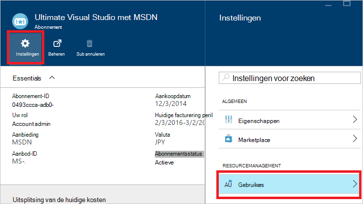

<properties
    pageTitle="Het toevoegen of wijzigen van de beheerdersrollen Azure | Microsoft Azure"
    description="Hierin wordt beschreven hoe u Azure CO-beheerder, beheerder en de Administrator-Account toevoegen of wijzigen"
    services=""
    documentationCenter=""
    authors="genlin"
    manager="mbaldwin"
    editor=""
    tags="billing"/>

<tags
    ms.service="billing"
    ms.workload="na"
    ms.tgt_pltfrm="na"
    ms.devlang="na"
    ms.topic="article"
    ms.date="08/17/2016"
    ms.author="genli"/>

# Het toevoegen of wijzigen van de beheerdersrollen Azure

Er zijn drie soorten functies in Microsoft Azure beheerder:

| Administratieve rol   | Limiet  | Beschrijving
| ------------- | ------------- |---------------|
|Account Administrator (AA)  | 1 per account Azure  |Dit is de persoon die aangemeld voor of Azure abonnementen hebt gekocht, en die is gemachtigd voor toegang tot de [Account Center](https://account.windowsazure.com/Home/Index) en verschillende beheertaken uitvoeren. Hierbij kunnen abonnementen maken, annuleren van abonnementen de facturering voor een abonnement te wijzigen en de Service-beheerder te wijzigen.
| Service-systeembeheerder (SA) | 1 per abonnement Azure  |Deze rol is gemachtigd om services in [Azure portal](https://portal.azure.com)te beheren. De Account Administrator is standaard voor een nieuw abonnement ook de servicebeheerder.|
|CO-beheerder (CA) in de [Azure klassieke portal](https://manage.windowsazure.com)|200 per abonnement| Deze rol heeft dezelfde toegangsrechten als servicebeheerder, maar de koppeling van abonnementen op Azure mappen niet wijzigen. |

> [AZURE.NOTE] Azure Active Directory-rol gebaseerde Access Control RBAC () kan een gebruiker aan meerdere rollen worden toegevoegd. Voor meer informatie Zie [Toegangsbeheer op basis van Azure Active Directory-rol](./active-directory/role-based-access-control-configure.md).

> [AZURE.NOTE] Als u meer Help-informatie op elk punt in dit artikel, neem [contact op met ondersteuning](https://portal.azure.com/?#blade/Microsoft_Azure_Support/HelpAndSupportBlade) voor uw probleem snel opgelost.

## Het toevoegen van een beheerder voor een abonnement

**Azure portal**

1. Log in om de [Azure portal](https://portal.azure.com).

2. Selecteer in het menu Hub **abonnement** > *het abonnement dat u wilt dat de beheerder toegang tot*.

    

3. Selecteer **Instellingen**in het blad abonnement> **gebruikers**.

    
4. Selecteer in het blad gebruikers **toevoegen**>**een rol selecteren** > **eigenaar**.

    

    **Opmerking**
    - De rol eigenaar heeft dezelfde toegangsrechten als co-beheerder. Deze rol heeft geen toegangsrechten op het [Midden van Azure-Account](https://account.windowsazure.com/subscriptions).
    - De eigenaars die u hebt toegevoegd via het [portal Azure](https://portal.azure.com) niet kunnen services in [Azure klassieke portal](https://manage.windowsazure.com)beheren.  

5. Typ het e-mailadres van de gebruiker die u wilt toevoegen als eigenaar, klikt u op de gebruiker en klik vervolgens op **selecteren**.

    

**Azure klassieke portal**

1. Log in om de [Azure klassieke portal](https://manage.windowsazure.com/).

2. In het navigatiedeelvenster, selecteer **Instellingen**> **beheerders**> **toevoegen**.  

    

3. Typ het e-mailadres van de persoon die u wilt toevoegen als co-beheerder en selecteer vervolgens het abonnement dat u wilt dat de CO-beheerder toegang tot. 

     

De volgende e-mailadres kan worden toegevoegd als beheerder van een collega:

* **Microsoft-Account** (voorheen Windows Live ID)  
 U kunt een Microsoft-Account aanmelden bij alle consument-georiënteerde Microsoft-producten en cloud services, zoals Outlook (Hotmail), Skype (MSN), OneDrive, Windows Phone en Xbox LIVE.
* **Organisatie-account** 
 Een organisatie-account is een account die wordt gemaakt onder Azure Active Directory. Het accountadres van de organisatie-lijkt op het volgende: user@ &lt;uw domein&gt;. onmicrosoft.com

### En beperkingen

 * Elk abonnement is gekoppeld aan een map Azure AD (ook bekend als de map standaard). Als u wilt zoeken in de map standaard het abonnement is gekoppeld aan, gaat u naar de [Azure klassieke portal](https://manage.windowsazure.com/), selecteert u **Instellingen** > **abonnementen**. Controleer de abonnement-ID om de Default Directory.

 * Als u bent aangemeld met een Microsoft-Account, kunt u andere Microsoft-Accounts of gebruikers binnen de map standaard alleen toevoegen als co-beheerder.

 * Als u bent aangemeld met een account van de organisatie, kunt u andere organisatie-accounts toevoegen in uw organisatie als co-beheerder. Bijvoorbeeld abby@contoso.com kunt toevoegen bob@contoso.com als beheerder of als co-beheerder, maar kan niet toevoegen john@notcontoso.com tenzij john@noncontoso.com is de gebruiker in Default Directory. Microsoft-Account gebruikers toevoegen als beheerder of een collega beheerder kunnen gebruikers zijn aangemeld met organisatie-accounts blijven.

 * Nu dat het mogelijk om in te loggen Azure met een organisatie account is, vindt hier u de wijzigingen aan de eisen van de beheerder en CO-beheerder account:

    Aanmelding, methode| Microsoft-Account of gebruikers in de Directory standaard als CA of SA toevoegen?  |Organisatie-account in dezelfde organisatie als CA of SA toevoegen? |Organisatie-account toevoegen in de andere organisatie als CA of SA?
    ------------- | ------------- |---------------|---------------
    Microsoft-Account |Ja|Nee|Nee
    Organisatie-Account|Ja|Ja|Nee

## Het wijzigen van de beheerder voor een abonnement

Alleen de Account beheerder kan de servicebeheerder voor een abonnement kunt wijzigen.

1. Meld u met behulp van de Account beheerder in [Azure Account Center](https://account.windowsazure.com/subscriptions) .

2. Selecteer het abonnement dat u wilt wijzigen.

3. Klik op details **bewerken abonnement** aan de rechterkant.  

    

4. Voer in het vak met **De beheerder van** het e-mailadres van de nieuwe Service-beheerder.  

    

## Het wijzigen van de Account Administrator

Om eigendom van het account Azure Zie [Overdracht van eigendom van een Azure-abonnement](billing-subscription-transfer.md)aan een andere account.

## Volgende stappen

* Zie voor meer informatie over hoe de toegang tot bronnen wordt beheerd met Microsoft Azure, [informatie over toegang tot bronnen in Azure](./active-directory/active-directory-understanding-resource-access.md)

* Zie voor meer informatie over hoe Azure Active Directory heeft betrekking op uw abonnement Azure, [hoe Azure abonnementen zijn gekoppeld aan Azure Active Directory](./active-directory/active-directory-how-subscriptions-associated-directory.md)

* Zie voor meer informatie over hoe Azure Active Directory heeft betrekking op uw abonnement Azure, [beheerdersrollen toewijzen in Azure Active Directory](./active-directory/active-directory-assign-admin-roles.md)

> [AZURE.NOTE] Als u nog verdere vragen hebt, neem [contact op met ondersteuning](https://portal.azure.com/?#blade/Microsoft_Azure_Support/HelpAndSupportBlade) voor uw probleem snel opgelost.
