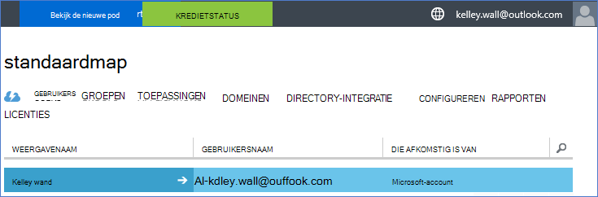
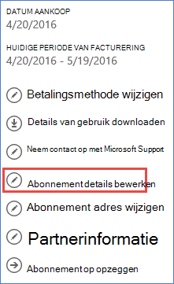
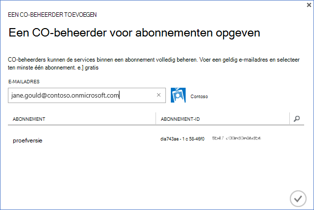

<properties
    pageTitle="Een huurder Office 365 gebruiken in combinatie met een abonnement op Azure | Microsoft Azure"
    description="Informatie over het toevoegen van een Office 365-directory (huurder) voor een abonnement Azure te maken van de koppeling."
    services=""
    documentationCenter=""
    authors="JiangChen79"
    manager="mbaldwin"
    editor=""
    tags="billing,top-support-issue"/>

<tags
    ms.service="billing"
    ms.workload="na"
    ms.tgt_pltfrm="ibiza"
    ms.devlang="na"
    ms.topic="article"
    ms.date="09/16/2016"
    ms.author="cjiang"/>

# Een huurder Office 365 koppelen aan een Azure-abonnement
Als u zowel Azure en Office 365-abonnementen apart hebt aangeschaft in het verleden en nu wilt u toegang tot de Office 365-huurder van het abonnement Azure, is het eenvoudig om dit te doen. In dit artikel ziet u hoe.

> [AZURE.NOTE] In dit artikel geldt niet voor klanten met Enterprise-overeenkomst (EA).

## Snelle hulp
Als u wilt uw huurder Office 365 koppelen aan uw abonnement Azure, uw Azure-account gebruiken om toe te voegen uw huurder Office 365 en vervolgens uw Azure abonnement koppelen aan de huurder Office 365.

## Gedetailleerde stappen
In dit scenario Kelley Wall is een gebruiker die een abonnement Azure onder de account heeft kelley.wall@outlook.com. Kelley heeft ook een Office 365-abonnement met de account kelley.wall@contoso.onmicrosoft.com. Kelley wil nu toegang tot de Office 365-huurder de Azure-abonnement.

### Vereisten
De volgende vereisten zijn nodig voor de vereniging goed te laten werken:

- Moet u de referenties van de beheerder van het abonnement Azure. CO-beheerders kunnen een subset van de stappen niet uitvoeren.
- Moet u de referenties van een globale beheerder van de pachter Office 365.
- Het e-mailadres van de beheerder moet niet zijn opgenomen in de Office 365-huurder.
- Het e-mailadres van de servicebeheerder mag niet overeenkomen met die van een globale beheerder van de pachter Office 365.
- Als u een e-mailadres dat is een Microsoft-account en een organisatie-account gebruikt, tijdelijk de servicebeheerder van uw Azure abonnement voor het gebruik van een ander Microsoft-account te wijzigen. U kunt een nieuwe Microsoft-account op de [aanmeldingspagina van Microsoft-account](https://signup.live.com/)maken.

De beheerder van de, Ga als volgt te werk:

1. Aanmelden bij de [Account Management portal](https://account.windowsazure.com/subscriptions).
2. Selecteer het abonnement dat u wilt wijzigen.
3. Selecteer **abonnement details bewerken**.

    

4. Voer in het vak met **De beheerder van** het e-mailadres van de beheerder van de nieuwe.

    

### De huurder Office 365 koppelen aan het abonnement Azure
Ga als volgt te werk om de Office 365-huurder koppelen aan het abonnement Azure:

1.  Aanmelden bij de [Account Management portal](https://account.windowsazure.com/subscriptions) met de beheerdersreferenties van de service.
2.  Selecteer **ACTIVE DIRECTORY**in het linkerdeelvenster.

    

    > [AZURE.NOTE] U ziet niet de huurder Office 365. Als u deze ziet, moet u de volgende stap overslaan.

    

3. De huurder Office 365 toevoegen aan uw abonnement op Azure.

    een. Selecteer **Nieuw** > **map** > **aangepaste maken**.

    

    b. Selecteer op de pagina **directory toevoegen** onder **DIRECTORY** **bestaande directory gebruiken**. Vervolgens Selecteer **ik ben klaar om te worden afgemeld**en selecteer **volledige** .

    

    c. Nadat u bent afgemeld, meld u aan met de referenties van de globale beheerder van uw Office 365 huurder.

    

    d. Selecteer **Doorgaan**.

    

    e. Selecteer **nu afmelden**.

    

    f. Aanmelden bij de [Account Management portal](https://account.windowsazure.com/subscriptions) met de beheerdersreferenties van de service.

    

    g. U ziet uw Office 365 huurder in het dashboard.

    

4. De map die is gekoppeld aan de Azure abonnement wijzigen.

    een. Selecteer **Instellingen**.

    

    b. Selecteer uw abonnement Azure en selecteer **Map bewerken**.
    

    c. **Volgende** .

    

    > [AZURE.WARNING] U ontvangt een waarschuwing dat alle CO-beheerders worden verwijderd.

    

    >[AZURE.WARNING] Bovendien worden alle [Role-Based Access Control (RBAC)](./active-directory/role-based-access-control-configure.md) gebruikers toegang toegewezen in de bestaande resourcegroepen ook verwijderd. De waarschuwing u ontvangt vermeldingen echter alleen de verwijdering van CO-beheerders.

    

    d. Selecteer **volledige** .

5. U kunt nu uw organisatie accounts van Office 365 CO-beheerders toevoegen aan de huurder Azure Active Directory.

    een. Selecteer het tabblad **beheerders** en selecteer **toevoegen**.

    

    b. Geeft u een organisatie-rekening van de huurder Office 365, selecteert u het abonnement Azure en selecteer vervolgens de **volledige** .

    

    c. Ga terug naar het tabblad **beheerders** . Hier ziet u de organisatie-account die wordt weergegeven als co-beheerder.

    

6. U kunt vervolgens toegang testen met de beheerder van de collega.

    een. Afmelden bij de portal voor accountbeheer.

    b. Open de [Account Management portal](https://account.windowsazure.com/subscriptions) of de [Azure portal](https://portal.azure.com/).

    c. Als een koppeling van **aanmelden met de account van uw organisatie**de Azure-aanmeldingspagina, selecteer de koppeling. Anders wordt deze stap overslaan.

    

    d. Voer de referenties van de beheerder van de collega en selecteer vervolgens **aanmelden**.

    

## Volgende stappen
Verwante scenario's zijn:

- U al een abonnement op Office 365 en klaar zijn voor een Azure-abonnement, maar u wilt de bestaande Office 365-gebruikersaccounts gebruiken voor uw abonnement op Azure.
- U Azure-abonnee bent en wilt ophalen van een Office 365-abonnement voor de gebruikers in uw bestaande exemplaar van Azure Active Directory.

Zie informatie over het uitvoeren van deze taken, [gebruikt uw bestaande Office 365-account bij uw abonnement Azure, of vice versa](billing-use-existing-office-365-account-azure-subscription.md).
