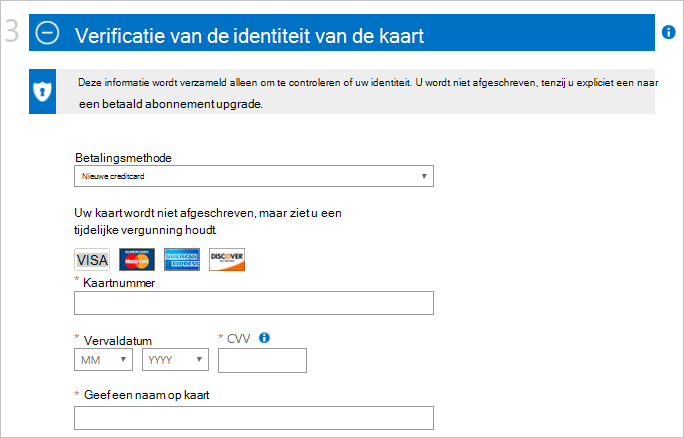
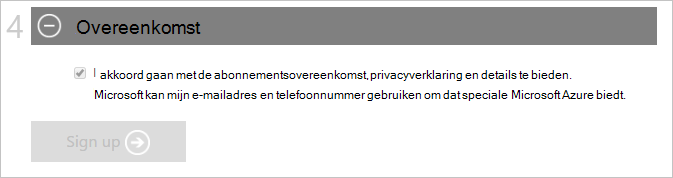

<properties
    pageTitle="Hoe u zich aanmeldt voor inkoop, upgraden of een Azure-abonnement activeren | Microsoft Azure"
    description="Beschrijving van het te kopen of zich aanmelden voor een abonnement op Azure"
    services=""
    documentationCenter=""
    authors="genlin"
    manager="mbaldwin"
    editor=""
    tags="billing,top-support-issue"
    />

<tags
    ms.service="billing"
    ms.workload="na"
    ms.tgt_pltfrm="na"
    ms.devlang="na"
    ms.topic="article"
    ms.date="09/23/2016"
    ms.author="genli"/>

# Aanmelden, kopen, upgraden of Azure activeren

> [AZURE.NOTE] Als u meer Help-informatie op elk punt in dit artikel, neem [contact op met ondersteuning](https://portal.azure.com/?#blade/Microsoft_Azure_Support/HelpAndSupportBlade) voor uw probleem snel opgelost.

Azure biedt verschillende aanbiedingen voor uw zakelijke behoeften en aan de slag met Azure. Ga naar [Azure biedt](https://azure.microsoft.com/support/legal/offer-details/) voor een volledig overzicht van alle actieve aanbiedingen met details op elk voorstel over wat ze dekking, voordelen en beschikbaarheid door landen/regio's.

## Azure biedt - voordelen en beperkingen

De volgende tabel vindt u details op algemene aanbiedingen:

| Aanbieding                                                                              | Details |
|--------------------------------------------------------------------------------------|---------|
| Gratis proefversie                                                                           |• [Aanmelden en stap voor stap handleiding](billing-buy-sign-up-azure-subscription.md#SignupFreeTrial) • [Voordelen](https://azure.microsoft.com/pricing/free-trial/) • [Veelgestelde vragen](https://azure.microsoft.com/pricing/free-trial-faq/) • [Gratis proefperiode aan Pay-As-You-Go bijwerken](billing-buy-sign-up-azure-subscription.md#UpgradeFreeToPYG)     |
| Pay-As-You-Go                                                                        | • [Aanmelden](https://azure.microsoft.com/pricing/purchase-options/) • [Prijzen](https://azure.microsoft.com/pricing/)   |
| MPN (Microsoft Partner Network) - leden ontvangen maandelijks Azure credits gratis | • [Azure voordelen voor partners](https://azure.microsoft.com/offers/ms-azr-0025p/) • [Inschrijven als partner](http://go.microsoft.com/fwlink/?linkid=309258&clcid=0x409) of [abonneren op Microsoft actie pack](http://go.microsoft.com/fwlink/?linkid=525768&clcid=0x409) • Gebruik Azure credits - toegang tot de [portal MPN](https://partner.microsoft.com) en controleren uw en volg de stappen onder Software sleutels en de voordelen. Als u niet controleren of je in aanmerking komen, neem contact op met [MPN ondersteunen](https://partner.microsoft.com/Support/).   |
| Abonnees van MSDN en Visual Studio                                                      |• [MSDN Dev/Test voordelen](https://azure.microsoft.com/offers/ms-azr-0023p/) • [Visual Studio abonnee vergoedingen](https://azure.microsoft.com/pricing/member-offers/msdn-benefits-details/) • [Activeren met Visual Studio abonnee Azure krediet](https://azure.microsoft.com/pricing/member-offers/msdn-benefits-details/) • [Activeren MSDN Azure voordelen in drie eenvoudige stappen](https://www.youtube.com/watch?v=SN2CA71uOEI&feature=youtu.be):  Aanmelden bij [MSDN account-pagina](https://msdn.microsoft.com/subscriptions/manage/default.aspx) en controleer of u in aanmerking komt, klikt u op 'Vergoeding Azure activeren'. Als u niet controleren of je in aanmerking komen, neem dan contact op met de [Klantenservice voor MSDN-abonnementen](https://msdn.microsoft.com/subscriptions/contactus.aspx).|
| BizSpark                                                                             | • [Voordelen BizSpark](https://www.microsoft.com/bizspark/default.aspx#start-two). Zie voor meer details, [maandelijkse Azure krediet voor Visual Studio Enterprise](https://azure.microsoft.com/offers/ms-azr-0064p/) • [Deelnemen aan BizSpark](https://www.microsoft.com/bizspark/signup/default.aspx). Als u problemen ondervindt, neem contact op met het [BizSpark Team](mailto:bizspark@microsoft.com?subject=BizSpark%20Support&body=Thank%20you%20for%20contacting%20BizSpark.%20Please%20provide%20as%20much%20of%20the%20following%20information%20as%20possible,%20as%20it%20will%20help%20expedite%20our%20response%20to%20you.%0aContact%20name:%0aStartup%20name:%0aMicrosoft%20Account/Live%20ID:%0aSpecific%20description%20of%20issue%20experienced%20or%20question:%0a%0aThank%20you,%0a%0aThe%20BizSpark%20Team).      |
| BizSpark Plus                                                                        |• [Meer informatie over BizSpark Plus](https://www.microsoft.com/bizspark/plus/default.aspx). Zie voor meer details [BizSpark Plus-voordelen](https://azure.microsoft.com/offers/ms-azr-0149p/) • [Deelnemen aan BizSpark](https://www.microsoft.com/bizspark/signup/default.aspx) en vervolgens samen met uw partner contact op met upgraden naar BizSpark Plus. Als u problemen ondervindt, neem contact op met het [BizSpark Team](mailto:bizspark@microsoft.com?subject=BizSpark%20Support&body=Thank%20you%20for%20contacting%20BizSpark.%20Please%20provide%20as%20much%20of%20the%20following%20information%20as%20possible,%20as%20it%20will%20help%20expedite%20our%20response%20to%20you.%0aContact%20name:%0aStartup%20name:%0aMicrosoft%20Account/Live%20ID:%0aSpecific%20description%20of%20issue%20experienced%20or%20question:%0a%0aThank%20you,%0a%0aThe%20BizSpark%20Team).     |
| Wederverkopers (Open Volume License-programma's)                                             |• [Activeren Online service Key - handleiding](billing-buy-sign-up-azure-subscription.md#activateKey) • [Inkoop, voordelen, activeren](https://azure.microsoft.com/offers/ms-azr-0111p/)        |
| EA (Enterprise Agreement)                                                            |• [Licentieverlening Azure voor de onderneming](https://azure.microsoft.com/pricing/enterprise-agreement/) • Als u wilt activeren, neem contact op met uw accountmanager bij Microsoft of wederverkoper om vandaag nog aan de slag     |

## Aanmelden voor een gratis proefperiode van Azure-abonnement

Als u wilt zich aanmelden voor een gratis proefperiode van Azure-abonnement, moet u een telefoonnummer, een creditcard en een Microsoft-Account opgeven. Uw Microsoft-account is het e-mailadres dat u, samen met uw wachtwoord gebruikt voor aanmelding bij een Windows Live-programma of een service, zoals Outlook, Hotmail of OneDrive. U kunt een Microsoft-account met behulp van een e-mailadres van u, zoals uw e-mailadres van bedrijf instellen. Zie [Veelgestelde vragen over Microsoft-account](https://www.microsoft.com/account/faq.aspx) voor meer informatie.

Zie [Azure aanmelden bij problemen oplossen](billing-troubleshoot-azure-sign-up-issues.md) als u problemen ondervindt.

>[AZURE.NOTE] De details van uw telefoon-nummer en een creditcard worden alleen gebruikt om uw identiteit verifiëren. Hoewel geen bedrag van je creditcard afgeschreven, zal Microsoft een wachtruimte vergunning plaats op voor een minimale bedrag om te controleren of de creditcard is ongeldig. De blokkering wordt uitgebracht binnen 3-5 werkdagen, afhankelijk van het beleid van uw financiële instelling.

1. Open de [Azure gratis proefperiode pagina](https://azure.microsoft.com/pricing/free-trial/)en selecteer vervolgens **nu starten**.

2. Meld u aan met uw Microsoft-account of de organisatie-account.

3. Geef in de sectie **over u** uw persoonlijke gegevens. [Meer informatie](billing-troubleshoot-azure-sign-up-issues.md#i-am-getting-an-error-when-entering-my-information-to-sign-up) over het invoeren van uw persoonlijke gegevens nauwkeurig.

    

    >[AZURE.NOTE] E-mailadres en land informatie die u verschaft wanneer u zich voor een abonnement op Azure aanmeldt is gekoppeld aan het abonnement en later kan niet worden gewijzigd.

4. U moet een telefoonnummer voor het ontvangen van een verificatiecode die u opgeven kunt als u wilt het verificatieproces voltooien opgeven in de sectie **verificatie via telefoon** .

    U kunt de verificatiecode ontvangen als een tekstbericht of via een telefoongesprek. Uw keuze maken door het selecteren van een **tekstbericht verzenden** of **Bel me**. Selecteer de code van het internationale toegangsnummer voor uw land in het eerste vak en voer je telefoonnummer in het tweede vak. Nadat u de verificatiecode ontvangen, invoeren in het derde vak en selecteer vervolgens de knop **code controleren** . [Raadpleeg dit artikel voor meer informatie](billing-troubleshoot-azure-sign-up-issues.md#i-am-not-getting-text-messages-or-calls-during-account-verification-when-i-try-to-sign-up).

    >[AZURE.NOTE] Kunt u een VOIP-telefoonnummer voor de verificatieprocedure.

    

    Als u niet een SMS-bericht of een oproep ontvangt, probeer een ander telefoonnummer gebruiken of contact opnemen met [Ondersteuning van Azure](https://portal.azure.com/#blade/Microsoft_Azure_Support/HelpAndSupportBlade) voor hulp.

5. Voer de details van een geldige creditcard opgeven in de sectie **verificatie door de kaart** . Deze informatie wordt verzameld alleen om te controleren of uw identiteit.

    Als er een foutbericht na het indienen van je creditcardgegevens, Zie het artikel [Mijn creditcard niet kan worden verstuurd wanneer ik probeer te melden voor Azure](billing-credit-card-fails-during-azure-sign-up.md).

    

6. In de sectie van de **overeenkomst** , schakel het selectievakje in als u akkoord met de abonnementsovereenkomst, details over voorstel en privacyverklaring gaat. Selecteer vervolgens **aanmelden**. Het overeenkomstformulier kan per land verschillen.

    

    Het kan even duren voor het instellen van uw abonnement. Als het abonnement setup niet wordt voltooid binnen 15 minuten, neem dan contact op met [Azure Support](https://portal.azure.com/#blade/Microsoft_Azure_Support/HelpAndSupportBlade) voor hulp.

    > [AZURE.NOTE] Als u een foutbericht krijgt, volg de stappen in het bericht om het probleem te verhelpen. Een standaard foutbericht is:

    > **Helaas, dat de bewerking kan niet worden voltooid. Probeer het later opnieuw of de pagina opnieuw laden**

    > In dit geval, probeer een andere browser gebruikt om het aanmeldingsproces te voltooien. Als het probleem nog steeds optreedt, neem dan contact op met [Ondersteuning van Azure](https://portal.azure.com/#blade/Microsoft_Azure_Support/HelpAndSupportBlade) voor hulp.

7. Wanneer het abonnement klaar is, selecteert u **beginnen met het beheren van mijn service** om te beginnen.

    

### Aanvullende bronnen

- [Ik kan een gratis proefversie van Azure niet activeren](billing-troubleshoot-azure-sign-up-issues.md#i-cant-activate-an-azure-free-trial)
- [Veelgestelde vragen over azure gratis](https://azure.microsoft.com/pricing/free-trial-faq/).

## Azure gratis upgrade naar Pay-As-You-Go

1. Meld u op de [Azure Account Portal](https://account.windowsazure.com/subscriptions) met behulp van het Microsoft-account of uw organisatie-account waarmee u zich aanmeldt voor de gratis proefversie.

2. Selecteer het abonnement en selecteer vervolgens **een upgrade uitvoeren**

    

3. Selecteer **Ja**en selecteer vervolgens **Nu bijwerken**.

    

Wanneer u een van een gratis proefabonnement op een Pay-As-You-Go abonnement upgrade, de voordelen die zijn overgebleven van de gratis evaluatie zoals de limiet van 30 dagen of het krediet $200 op Azure services wordt voortgezet totdat een van deze is opgebruikt. De upgrade abonnement daarna gebeurt.

## Activeren via een on line Service Activation Key

Als u **Azure in Open** credits bij een wederverkoper gekocht en kreeg een activeringssleutel (5 x 5), als volgt te werk om uw abonnement te activeren:

1. Ga naar de [overzichtspagina abonnementen](https://account.windowsazure.com/subscriptions).

2. Selecteer **Azure in Open**. [Azure in Open License key](https://azure.microsoft.com/offers/ms-azr-0111p/) op de pagina Selecteer **een nieuw abonnement activeren of bestaande abonnement**.

3. De productcode invoert en controleer vervolgens de optie overeenkomst.

> [AZURE.NOTE] Als u nog verdere vragen hebt, neem [contact op met ondersteuning](https://portal.azure.com/?#blade/Microsoft_Azure_Support/HelpAndSupportBlade) voor uw probleem snel opgelost.
