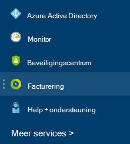

<properties
    pageTitle="Het downloaden van uw factuur en dagelijks gebruik rekeninggegevens Azure | Microsoft Azure"
    description="Hierin wordt beschreven hoe u uw factuur Azure en dagelijkse gebruiksgegevens downloaden"
    services=""
    documentationCenter=""
    authors="genlin"
    manager="mbaldwin"
    editor=""
    tags="billing"
    />

<tags
    ms.service="billing"
    ms.workload="na"
    ms.tgt_pltfrm="na"
    ms.devlang="na"
    ms.topic="article"
    ms.date="10/10/2016"
    ms.author="genli"/>

# Het downloaden van uw factuur en dagelijks gebruik rekeninggegevens Azure

> [AZURE.NOTE] Als u meer Help-informatie op elk punt in dit artikel, neem [contact op met ondersteuning](https://portal.azure.com/?#blade/Microsoft_Azure_Support/HelpAndSupportBlade) voor uw probleem snel opgelost.

Als de accountbeheerder Azure-kunt u de factuur en de dagelijkse gebruiksgegevens op de [Azure portal](https://portal.azure.com) of het [Midden van Azure Account](https://account.windowsazure.com/subscriptions)bekijken. Hier ziet u hoe:

## Azure portal

1. Aanmelden bij de [Azure portal](https://portal.azure.com) als de account administrator.

    >[AZURE.NOTE] Alleen de accountbeheerder heeft toegang tot de gegevens voor facturering. Zie de [Veelgestelde vragen](billing-subscription-transfer.md#faq)voor meer informatie over hoe u kunt nagaan wie er met de accountbeheerder van het abonnement.

2. Selecteer in het menu Hub **Facturering**. Op het blad **facturen** vindt u enkele nuttige informatie zoals de volgende factuurdatum.

    
3. Selecteer het abonnement dat u wilt weergeven in de sectie **kosten abonnement** .

    
4. Klik **Billing & Gebruik**.

    

5. Klik op het blad **facturen geschiedenis** **Factuur downloaden** om een kopie van uw factuur weer te geven. Klik op een betalingsperiode dagelijks gebruik van gegevens.

    

## Azure Account Center

1. Inloggen op het [Midden van Azure-Account](https://account.windowsazure.com/subscriptions) als de account administrator.
2. Selecteer het abonnement waarvoor u de factuur en het gebruik van informatie wilt.
3. Selecteer **Facturering geschiedenis**.  
4. U ziet uw instructies voor de laatste zes perioden voor facturering en de huidige periode gefactureerd.   
5. Selecteer **De huidige instructie weergeven** om te zien van een raming van de kosten op het moment dat de raming is gegenereerd. Deze informatie wordt alleen dagelijks bijgewerkt en mag niet inhouden dat alle uw gebruik. Uw maandelijkse factuur afwijken van deze raming.   
6. Selecteer **Factuur downloaden** naar een kopie van uw laatste factuur.  
7. Selecteer **Downloaden gebruik** de gebruiksgegevens dagelijks als een CSV-bestand te downloaden. 

> [AZURE.NOTE] Als u nog verdere vragen hebt, neem [contact op met ondersteuning](https://portal.azure.com/?#blade/Microsoft_Azure_Support/HelpAndSupportBlade) voor uw probleem snel opgelost.
