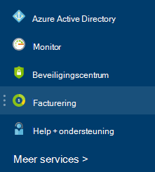

<properties
    pageTitle="Inzicht in uw Azure externe kosten | Microsoft Azure"
    description="Informatie over facturering van de diensten van buitenaf, voorheen bekend als marktplaats, toeslagen in Azure."
    services=""
    documentationCenter=""
    authors="adpick"
    manager="felixwu"
    editor=""
    tags="billing"
    />

<tags
    ms.service="billing"
    ms.workload="na"
    ms.tgt_pltfrm="na"
    ms.devlang="na"
    ms.topic="article"
    ms.date="10/12/2016"
    ms.author="adpick"/>

# Inzicht in uw Azure externe kosten

In dit artikel wordt uitgelegd dat de facturering van de diensten van buitenaf in Azure. Externe services gebruikt voor Marketplace orders worden aangeroepen. Externe Services worden geleverd door onafhankelijke serviceleveranciers, maar zijn volledig geïntegreerd in het ecosysteem van Azure. Meer informatie over hoe u kunt:

- Diensten van buitenaf identificeren
- Begrijpen hoe de facturering verschilt van andere bronnen Azure
- Weergeven en u de transitorische kosten bijhouden van het gebruik van externe services
- Beheer van externe serviceorders en hoe u deze zelf te betalen

## Wat is Azure externe services?

Externe services gebruikt voor Azure Marketplace worden aangeroepen. Ze zijn over het algemeen wordt gepubliceerd door derde partijen beschikbaar voor Azure services. ClearDB en SendGrid zijn bijvoorbeeld externe services die u kunt kopen in Azure, maar niet door Microsoft zijn gepubliceerd.

### Diensten van buitenaf identificeren

Bij het inrichten van een nieuwe externe service of een bron, wordt een waarschuwing weergegeven:

>[AZURE.NOTE] Externe services worden uitgegeven door vennootschappen die niet Microsoft, maar soms ook Microsoft-producten worden gecategoriseerd als externe services.

### Externe services worden afzonderlijk gefactureerd

Externe diensten worden behandeld als afzonderlijke orders binnen uw abonnement Azure. De betalingsperiode voor elke service wordt ingesteld wanneer u de service kopen. Niet te verwarren met de betalingsperiode van het abonnement waarmee u het hebt gekocht. Ook ontvangt u afzonderlijke rekeningen en uw creditcard is afzonderlijk in rekening gebracht.

### Elke externe dienst heeft een ander model voor facturering

Sommige services worden gefactureerd op een "pay-as-you-go" manier, terwijl anderen een maandelijkse betaling gebaseerd model. U hebt een creditcard voor Azure services voor externe, niet kunt u externe services met factuur betalen kopen.

### Kunt u maandelijks gratis credits voor externe services

Als u een Azure-abonnement met [gratis credits](https://azure.microsoft.com/pricing/spending-limits/)kunnen niet zij worden toegepast op de rekeningen van de externe service. Een creditcard gebruiken voor de aanschaf van externe services.

## Weergave-service externe uitgaven en geschiedenis

U kunt een lijst met de externe services die op elk abonnement binnen de [Azure portal](https://portal.azure.com/)weergeven: 

1. Log in om de [Azure portal](https://portal.azure.com/) en [Ga naar het blad **facturen** ](https://portal.azure.com/?flight=1#blade/Microsoft_Azure_Billing/BillingBlade).

     
  
2. Selecteer het abonnement dat u wilt weergeven in de sectie **kosten abonnement** . 
   
    

3. Klik op **externe services**.

    

4. Ziet u elk van uw externe serviceorders publisher, servicelaag die u hebt gekocht, de naam die u aan de resource en de status van de huidige gegeven. Selecteer een externe service om te zien het verleden facturen.

    

5. Hier kunt u bekijken verleden bill bedragen, met inbegrip van de verdeling van de belasting.

    

## Betalingsmethoden voor serviceorders extern beheren

Werk je betalingsmethoden voor externe serviceorders in het [Midden van de Account](https://account.windowsazure.com/).

> [AZURE.NOTE] Als u uw abonnement met een werk of op School-account hebt aangeschaft, moet u [contact opnemen met ondersteuning](https://portal.azure.com/?#blade/Microsoft_Azure_Support/HelpAndSupportBlade) om uw betalingsmethode te wijzigen.

1. Aanmelden bij de [Account Center](https://account.windowsazure.com/) en [Ga naar het tabblad **marketplace** ](https://account.windowsazure.com/Store)

    

2. Selecteer de externe service die u wilt beheren

    

3. Klik op **de betalingsmethode wijzigen** aan de rechterkant van de pagina. Deze koppeling brengt u naar een ander portal voor het beheren van uw betalingsmethode.
    
    

4. Klik op **info bewerken** en volg de instructies voor het bijwerken van uw betalingsgegevens.

    
    
## Een externe serviceorder annuleren

Als u wilt dat de externe serviceorder annuleren, moet u de resource in de [Azure portal](https://portal.azure.com)verwijderen.

## Hulp nodig? Neem contact op met support.

Als u nog verdere vragen hebt, neem [contact op met ondersteuning](https://portal.azure.com/?#blade/Microsoft_Azure_Support/HelpAndSupportBlade) voor uw probleem snel opgelost.
