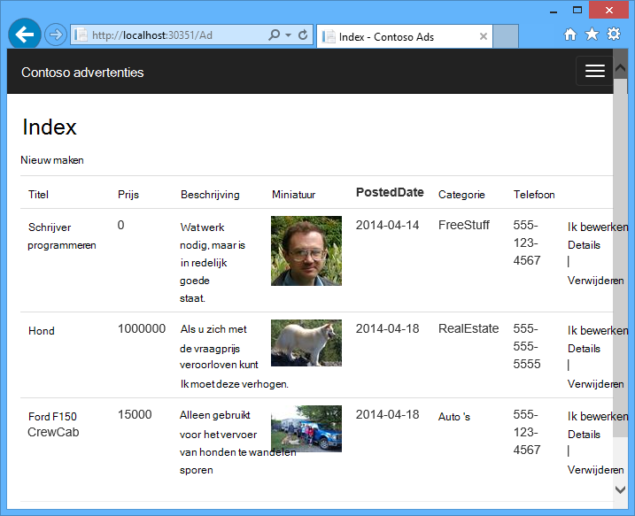
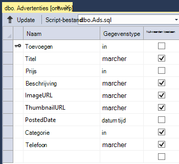
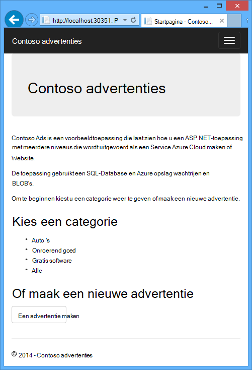
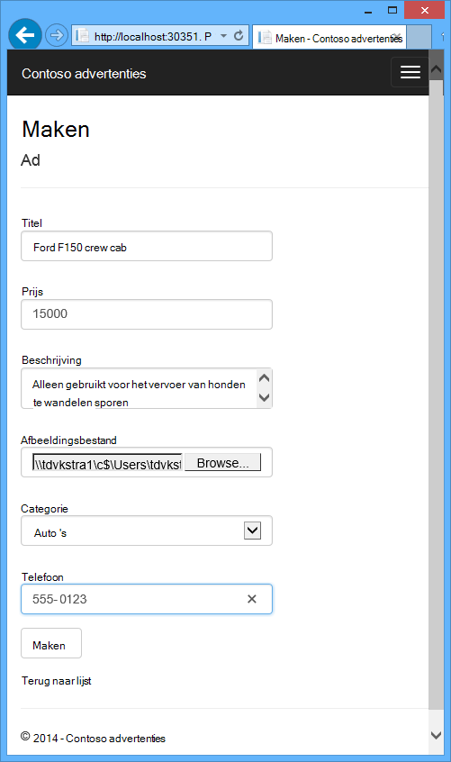
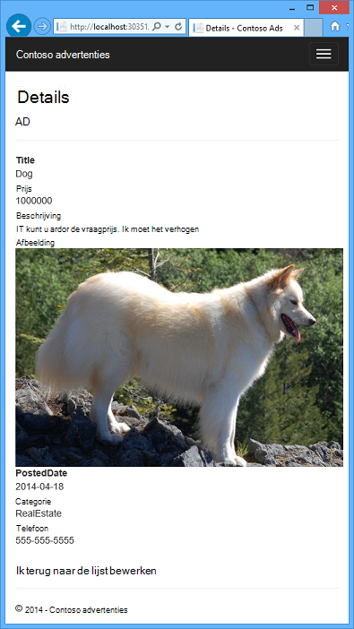
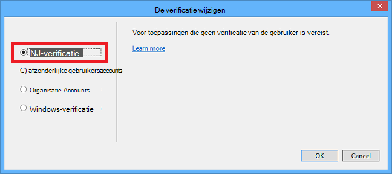

<properties
    pageTitle="Aan de slag met Azure Cloud Services en ASP.NET | Microsoft Azure"
    description="Informatie over het maken van een meerlaags app met behulp van ASP.NET MVC en Azure. De toepassing wordt uitgevoerd in een cloud-service met Webrol en de rol van de werknemer. Entiteit Framework, SQL-Database en Azure opslag wachtrijen en BLOB's worden gebruikt."
    services="cloud-services, storage"
    documentationCenter=".net"
    authors="Thraka"
    manager="timlt"
    editor=""/>

<tags
    ms.service="cloud-services"
    ms.workload="tbd"
    ms.tgt_pltfrm="na"
    ms.devlang="dotnet"
    ms.topic="hero-article"
    ms.date="06/10/2016"
    ms.author="adegeo"/>

# <a name="get-started-with-azure-cloud-services-and-aspnet"></a>Aan de slag met Azure Cloud Services en ASP.NET

> [AZURE.SELECTOR]
- [Node.js](cloud-services-nodejs-develop-deploy-app.md)
- [.NET](cloud-services-dotnet-get-started.md)

## <a name="overview"></a>Overzicht

Deze zelfstudie laat zien hoe een meerlaags .NET-toepassing maken met een ASP.NET-MVC front- en deze implementeren een [Azure cloud-service](cloud-services-choose-me.md). De toepassing gebruikt de [Azure SQL-Database](http://msdn.microsoft.com/library/azure/ee336279), de [Azure Blob-service](http://www.asp.net/aspnet/overview/developing-apps-with-windows-azure/building-real-world-cloud-apps-with-windows-azure/unstructured-blob-storage)en de [Azure Queue-service](http://www.asp.net/aspnet/overview/developing-apps-with-windows-azure/building-real-world-cloud-apps-with-windows-azure/queue-centric-work-pattern). U kunt [de Visual Studio-project downloaden](http://code.msdn.microsoft.com/Simple-Azure-Cloud-Service-e01df2e4) vanaf de MSDN Code Gallery.

De zelfstudie ziet u opbouwen en de toepassing lokaal uitvoeren naar Azure implementeren en uitvoeren in de cloud en ten slotte het bouwen van het geheel. U kunt starten door het gebouw helemaal voert de test en stappen daarna implementeren als u de voorkeur geeft.

## <a name="contoso-ads-application"></a>Toepassing van Contoso advertenties

De toepassing is een bulletinboard reclame. Gebruikers maken een advertentie door het invoeren van tekst en een afbeelding uploaden. Ze ziet een overzicht van advertenties met miniatuurafbeeldingen en kunnen ze de volledige grootte afbeelding zien wanneer ze een advertentie, kunt u de details selecteren.



De toepassing wordt het [patroon van de wachtrij-georiënteerde werk](http://www.asp.net/aspnet/overview/developing-apps-with-windows-azure/building-real-world-cloud-apps-with-windows-azure/queue-centric-work-pattern) tijdens stillegging van de CPU-intensieve werk van het maken van miniaturen met een back-end-proces.

## <a name="alternative-architecture-websites-and-webjobs"></a>Alternatieve architectuur: Websites en WebJobs

Deze zelfstudie laat zien hoe uitgevoerd front-end- en back-end in een Azure cloud-service. Een alternatief is de front-uitvoeren in een [website Azure](/services/web-sites/) en de functie [WebJobs](http://go.microsoft.com/fwlink/?LinkId=390226) (momenteel in het voorbeeld) gebruiken voor de back-end. Zie voor een zelfstudie met WebJobs, [Aan de slag met de Azure WebJobs SDK](../app-service-web/websites-dotnet-webjobs-sdk-get-started.md). Zie voor meer informatie over het kiezen van de services die het meest geschikt zijn voor uw scenario [Websites Azure, Cloud Services en vergelijking van virtuele machines](../app-service-web/choose-web-site-cloud-service-vm.md).

## <a name="what-youll-learn"></a>U leert

* Het inschakelen van de computer voor de ontwikkeling van Azure door de Azure SDK installeren.
* Het maken van een Visual Studio-project cloud service met een ASP.NET-MVC Webrol en de rol van een werknemer.
* Het testen van de cloud service project lokaal, met behulp van de emulator Azure opslag.
* Het publiceren van de wolk project een Azure cloud service en testen met behulp van een account Azure opslag.
* Het uploaden van bestanden en deze opslaan in de Azure Blob-service.
* Het gebruik van de service Azure wachtrij voor de communicatie tussen de lagen.

## <a name="prerequisites"></a>Vereisten

De zelfstudie wordt ervan uitgegaan dat u [basisbegrippen over Azure cloud-services](cloud-services-choose-me.md) zoals *Webrol* en *de rol van de werknemer* terminologie begrijpen.  Ook wordt ervan uitgegaan dat u weet hoe u werkt met [ASP.NET MVC](http://www.asp.net/mvc/tutorials/mvc-5/introduction/getting-started) of [Webformulieren](http://www.asp.net/web-forms/tutorials/aspnet-45/getting-started-with-aspnet-45-web-forms/introduction-and-overview) projecten in Visual Studio. De voorbeeldtoepassing MVC gebruikt, maar de meeste van de zelfstudie is ook van toepassing op webformulieren.

U kunt de app zonder een abonnement Azure lokaal uitvoeren, maar moet u een implementeren van de toepassing naar de cloud. Als u geen account hebt, kunt u [uw MSDN subscriber voordelen te activeren](/pricing/member-offers/msdn-benefits-details/?WT.mc_id=A55E3C668) of [Aanmelden voor een gratis proefversie](/pricing/free-trial/?WT.mc_id=A55E3C668).

De zelfstudie instructies werken met een van de volgende producten:

* Visual Studio 2013
* Visual Studio 2015

Als u een van deze niet hebt, wordt Visual Studio 2015 automatisch geïnstalleerd tijdens de installatie van de SDK Azure.

## <a name="application-architecture"></a>Toepassingsarchitectuur

De app bevat advertenties in een SQL-database met behulp van entiteit Framework Code eerst de tabellen maken en toegang tot de gegevens. Voor elke advertentie in de database opgeslagen twee URL's, één voor de afbeelding op volledig scherm en één voor de miniatuur.



Wanneer een gebruiker een afbeelding uploadt, front-uitgevoerd in de rol van een webpagina opslaan in een [blob-Azure](http://www.asp.net/aspnet/overview/developing-apps-with-windows-azure/building-real-world-cloud-apps-with-windows-azure/unstructured-blob-storage)en de ad-informatie wordt opgeslagen in de database met een URL die naar de blob verwijst. Geschreven op hetzelfde moment, een bericht naar een wachtrij Azure. Een back-end proces in de rol van een werknemer regelmatig controleert of de wachtrij voor nieuwe berichten. Wanneer een nieuw bericht wordt weergegeven, is de rol van de werknemer een miniatuur voor die afbeelding gemaakt en bijgewerkt met de miniaturen URL database voor deze advertentie. Het volgende diagram ziet hoe de onderdelen van de toepassing werken.


[AZURE.INCLUDE [install-sdk](../../includes/install-sdk-2015-2013.md)]

## <a name="download-and-run-the-completed-solution"></a>Downloaden en uitvoeren van de voltooide oplossing

1. Download en unzip de [oplossing wordt voltooid](http://code.msdn.microsoft.com/Simple-Azure-Cloud-Service-e01df2e4).

2. Start Visual Studio.

3. In het menu **bestand** kiest u **Project openen**, navigeer naar waar u de oplossing hebt gedownload en open vervolgens het oplossingsbestand.

3. Druk op CTRL + SHIFT + B om de oplossing te bouwen.

    Standaard worden NuGet package inhoud die niet is opgenomen in het *zip-* bestand automatisch hersteld door Visual Studio. Als de pakketten niet herstellen, ze handmatig installeren door te gaan naar het dialoogvenster **Beheren NuGet pakketten voor oplossing** en op de knop **herstellen** klikken rechtsboven.

3. Zorg dat de **ContosoAdsCloudService** is geselecteerd als het project is gestart in de **Solution Explorer**.

2. Als u Visual Studio 2015, wijzigt u de SQL Server-verbindingstekenreeks in het *Web.config* -bestand van de toepassing van het project ContosoAdsWeb en in het bestand *ServiceConfiguration.Local.cscfg* van het project ContosoAdsCloudService. In elk geval wijzigen in '\v11.0 (localdb)' "(localdb) \MSSQLLocalDB".

1. Druk op CTRL + F5 om de toepassing te starten.

    Wanneer u een cloud service project lokaal uitvoeren, roept Visual Studio automatisch de Azure *emulator berekenen* en Azure *opslag emulator*. De compute-emulator systeembronnen van uw computer voor het simuleren van de rol en de werknemer rol webomgevingen. De emulator opslag maakt gebruik van een database van [SQL Server Express LocalDB](http://msdn.microsoft.com/library/hh510202.aspx) voor het simuleren van Azure cloud opslag.

    De eerste keer dat u een project cloud-service uitvoeren duurt een minuut of zo voor de emulators te starten. Wanneer emulator opstarten is voltooid, wordt de standaardbrowser naar de introductiepagina van de toepassing geopend.

    

2. Klik op **een advertentie te maken**.

2. Testgegevens invoeren en selecteren voor het uploaden van een *JPG* -afbeelding en klik vervolgens op **maken**.

    

    De app gaat u naar de pagina Index, maar toont niet een miniatuur voor de nieuwe advertentie omdat die verwerking is nog niet is gebeurd.

3. Wacht even en vernieuw de pagina Index om de miniatuur weergegeven.

    

4. Klik op **Details** voor uw advertentie om de afbeelding op volledig scherm.

    

U hebt de toepassing uitgevoerd volledig op uw lokale computer geen verbinding heeft met de cloud. De emulator opslag de wachtrij en blob-gegevens opgeslagen in een database van SQL Server Express-LocalDB en de toepassing de ad-gegevens worden opgeslagen in een andere database met LocalDB. Entiteit Framework Code eerste automatisch gemaakt de ad-database voor het eerst dat de web app probeert te openen.

In de volgende sectie kunt u de Azure cloud om middelen te gebruiken voor wachtrijen en BLOB's database van de toepassing wanneer deze wordt uitgevoerd in de cloud-oplossing. Als u wilt blijven lokaal worden uitgevoerd, maar cloud opslag- en bronnen gebruiken, kunt u dat doen; het is gewoon een kwestie van verbindingsreeksen, ziet u hoe u instelt.

## <a name="deploy-the-application-to-azure"></a>De Azure-toepassing implementeren

U kunt de volgende stappen uit om de toepassing wordt uitgevoerd in de cloud gaat doen:

* Maak een Azure cloud-service.
* Azure SQL-database maken.
* Maak een account Azure opslag.
* De oplossing voor het gebruik van de Azure SQL-database wanneer deze wordt uitgevoerd in Azure configureren.
* De oplossing voor het gebruik van uw account Azure opslag wanneer deze wordt uitgevoerd in Azure configureren.
* Het project op uw Azure cloud service implementeren.

### <a name="create-an-azure-cloud-service"></a>Maak een Azure cloud-service

Een Azure cloud-service is de omgeving die in de toepassing wordt uitgevoerd.

1. Open in de browser de [Azure klassieke portal](http://manage.windowsazure.com).

2. Klik op **Nieuw > berekenen > Cloud Service > Snelle invoer**.

4. Voer in het invoervak URL een URL-voorvoegsel.

    Deze URL moet uniek zijn.  U krijgt een foutbericht als het voorvoegsel dat u kiest, al in gebruik door iemand anders is.

5. Kies de regio waar u de toepassing implementeert.

    Dit veld geeft aan welke uw cloud-service wordt gehost in datacenter. Voor de productietoepassing van een kiest u de regio die het dichtst bij uw klanten. Kies de regio die het dichtst bij u in deze zelfstudie.

6. Klik op **de Service Cloud maken**.

    In de volgende afbeelding wordt een cloud service gemaakt met de URL contosoads.cloudapp.net.

    

### <a name="create-an-azure-sql-database"></a>Azure SQL-database maken

Wanneer de toepassing wordt uitgevoerd in de cloud, wordt een cloud-gebaseerde database gebruikt.

1. Klik in [Azure klassieke portal](http://manage.windowsazure.com)op **Nieuw > Data Services > SQL-Database > Snelle invoer**.

1. Voer in het vak **Naam van de Database** *contosoads*.

1. Kies **nieuwe Database van SQL server**in de vervolgkeuzelijst **Server** .

    Ook als uw abonnement al een server heeft, kunt u deze server uit de vervolgkeuzelijst.

1. Kies dezelfde **regio** die u hebt gekozen voor de cloud-service.

    Wanneer de cloud-service en de database worden in verschillende datacentra (verschillende regio's), latentie wordt vergroot en wordt aangerekend voor bandbreedte buiten het datacenter. Bandbreedte binnen een datacenter is gratis.

1. Beheerder **Login naam** en **wachtwoord**invoeren.

    Als u een **nieuwe Database van SQL server** u zijn niet verplicht een bestaande naam en wachtwoord hier geselecteerd, bent u een nieuwe naam en het wachtwoord die u nu definieert om later te gebruiken wanneer u de database opent. Als u een server die u eerder hebt gemaakt, wordt u gevraagd het wachtwoord voor de gebruikersaccount met beheerdersrechten hebt gemaakt.

1. Klik op **SQL-Database maken**.

    

1. Nadat de Azure is gemaakt van de database, klikt u op het tabblad **SQL-Databases** in het linkerdeelvenster van de portal en klikt u vervolgens op de naam van de nieuwe database.

2. Klik op het tabblad **Dashboard** .

3. Klik op **Manage toegestane IP-adressen**.

4. Wijzig onder **Services toegestaan**, **Azure Services** op **Ja**.

5. Klik op **Opslaan**.

### <a name="create-an-azure-storage-account"></a>Maak een account Azure opslag

Een account Azure opslag bevat bronnen voor wachtrij- en blob-gegevens opslaan in de cloud.

In een concrete toepassing maakt u meestal een aparte boekhouding toepassing gegevens versus logboekgegevens, en aparte rekeningen voor testgegevens versus productiegegevens. Voor deze zelfstudie kunt u slechts één account.

1. Klik in [Azure klassieke portal](http://manage.windowsazure.com)op **Nieuw > Data Services > opslag > Snelle invoer**.

4. Geef een URL-voorvoegsel in het vak **URL** .

    Dit voorvoegsel plus de tekst onder het vak worden de unieke URL aan uw account voor opslag. Als het voorvoegsel dat u invoert wordt al door iemand anders gebruikt, hebt u een ander voorvoegsel kiezen.

5. Stel de keuzelijst **regio** op dezelfde regio die u hebt gekozen voor de cloud-service.

    Wanneer de cloud service- en account zijn in verschillende datacentra (verschillende regio's), latentie wordt vergroot en wordt aangerekend voor bandbreedte buiten het datacenter. Bandbreedte binnen een datacenter is gratis.

    Azure affiniteit groepen hebben een mechanisme om de afstand tussen de bronnen in een datacenter, zodat u latentie bespaart minimaliseren. In deze zelfstudie worden geen affiniteit groepen gebruikt. Zie voor meer informatie, [het maken van een groep affiniteit in Azure](http://msdn.microsoft.com/library/jj156209.aspx).

6. De vervolgkeuzelijst voor **replicatie** ingesteld op **lokaal overbodig**.

    Als geo-replicatie voor een opslag-account is ingeschakeld, wordt de opgeslagen inhoud gerepliceerd naar een secundaire datacenter failover naar die locatie in het geval van een grote ramp in de primaire locatie inschakelen. Geo-replicatie kan extra kosten verbonden. Voor test- en accounts wilt u over het algemeen niet betalen voor geo-replicatie. Zie voor meer informatie [maken, beheren, of een opslag account verwijderen](../storage/storage-create-storage-account.md#replication-options).

5. Klik op **opslag-Account maken**.

    

    In de afbeelding, een opslag-account gemaakt met de URL `contosoads.core.windows.net`.

### <a name="configure-the-solution-to-use-your-azure-sql-database-when-it-runs-in-azure"></a>De oplossing voor het gebruik van de Azure SQL-database wanneer deze wordt uitgevoerd in Azure configureren

Het webproject en de rol van werknemer project heeft zijn eigen verbindingsreeks en elk moet verwijzen naar de Azure SQL-database wanneer de toepassing wordt uitgevoerd in Azure.

Gebruikt u een [Web.config-transformatie](http://www.asp.net/mvc/tutorials/deployment/visual-studio-web-deployment/web-config-transformations) voor de Webrol en een cloud omgeving-instelling voor de rol van de werknemer.

>[AZURE.NOTE] In deze sectie en de volgende sectie kunt u de referenties in de project-bestanden opslaan. [Gevoelige gegevens in de opslagplaatsen van openbare bron code niet opslaan](http://www.asp.net/aspnet/overview/developing-apps-with-windows-azure/building-real-world-cloud-apps-with-windows-azure/source-control#secrets).

1. In het ContosoAdsWeb project, het transformatiebestand *Web.Release.config* voor het bestand *Web.config* te openen, verwijdert u het blok als opmerkingen behandelen met een `<connectionStrings>` -element en plak de volgende code in plaats daarvan.

    ```xml
    <connectionStrings>
        <add name="ContosoAdsContext" connectionString="{connectionstring}"
        providerName="System.Data.SqlClient" xdt:Transform="SetAttributes" xdt:Locator="Match(name)"/>
    </connectionStrings>
    ```

    Laat het bestand geopend voor bewerken.

2. In [Azure klassieke portal](http://manage.windowsazure.com)klikt u in het linkerdeelvenster op **SQL-Databases** , klikt u op de database die u hebt gemaakt voor deze zelfstudie klikt u op het tabblad **Dashboard** en klikt u op **weergeven van verbindingsreeksen**.

    

    De portal wordt verbindingsreeksen met een tijdelijke aanduiding voor het wachtwoord weergegeven.

    

4. Verwijder in het transformatiebestand *Web.Release.config* `{connectionstring}` en plakken in plaats daarvan de ADO.NET-verbindingsreeks van de klassieke Azure portal.

5. Vervang in de verbindingstekenreeks die u hebt geplakt in de transform-bestand *Web.Release.config* , `{your_password_here}` met het wachtwoord dat u hebt gemaakt voor de nieuwe SQL-database.

7. Sla het bestand.  

6. Selecteer en kopieer de verbindingsreeks (zonder de aanhalingstekens) voor gebruik in de volgende stappen voor het configureren van de functie van werknemer project.

5. In **Solution Explorer** **rollen** in het project cloud-service met de rechtermuisknop op **ContosoAdsWorker** en klik op **Eigenschappen**.

    

6. Klik op het tabblad **Instellingen** .

7. **Configuratie van de Service** **Cloud**wijzigen.

7. Selecteer het veld **waarde** van het `ContosoAdsDbConnectionString` instellen en plak vervolgens de verbindingsreeks die u hebt gekopieerd uit het vorige gedeelte van de zelfstudie.

    

7. Sla uw wijzigingen.  

### <a name="configure-the-solution-to-use-your-azure-storage-account-when-it-runs-in-azure"></a>De oplossing voor het gebruik van uw account Azure opslag wanneer deze wordt uitgevoerd in Azure configureren

Azure opslag account verbindingsreeksen voor het webproject rol en de rol van werknemer project worden opgeslagen in de omgevingsinstellingen in het project van de service cloud. Er is een aparte set instellingen worden gebruikt wanneer de toepassing wordt lokaal uitgevoerd en wanneer deze wordt uitgevoerd in de cloud voor elk project. U zult de wolk omgevingsinstellingen voor web- en werknemer rol projecten bijwerken.

1. In de **Solution Explorer**met de rechtermuisknop op de **ContosoAdsWeb** onder **functies** in het **ContosoAdsCloudService** -project en klik vervolgens op **Eigenschappen**.

    

2. Klik op het tabblad **Instellingen** . Kies in de vervolgkeuzelijst **Configuratie van de Service** **Cloud**.

    

3. Selecteer de vermelding **StorageConnectionString** en ziet u een knop met het weglatingsteken (**...**) aan de rechterkant van de regel. Klik op de knop om het dialoogvenster **Opslag Account verbindingsreeks maken** te openen.

    

4. In het dialoogvenster **Verbindingsreeks opslag maken** klikt u op **uw abonnement**, kiest u de account van de opslag die u eerder hebt gemaakt en klik op **OK**. Als u nog niet bent aangemeld, wordt u gevraagd uw referenties Azure-account.

    

5. Sla uw wijzigingen.

6. Volg de procedure die u gebruikt voor de `StorageConnectionString` verbindingsreeks instellen van de `Microsoft.WindowsAzure.Plugins.Diagnostics.ConnectionString` verbindingsreeks.

    Deze verbindingsreeks wordt gebruikt voor aanmelding.

7. Volg de procedure die u voor de rol van **ContosoAdsWeb gebruikt** voor het instellen van beide tekenreeksen voor de rol van **ContosoAdsWorker** . Vergeet niet in te stellen van de **Configuratie van de Service** op **wolk**.

De omgeving rolinstellingen die u hebt ingesteld met behulp van de Visual Studio-gebruikersinterface worden opgeslagen in de volgende bestanden in het ContosoAdsCloudService-project:

* *ServiceDefinition.csdef* - Hiermee definieert u de namen van de instelling.
* *ServiceConfiguration.Cloud.cscfg* - bevat waarden voor wanneer de toepassing wordt uitgevoerd in de cloud.
* *ServiceConfiguration.Local.cscfg* - bevat waarden voor wanneer de toepassing wordt lokaal uitgevoerd.

De ServiceDefinition.csdef bevat bijvoorbeeld de volgende definities.

```xml
<ConfigurationSettings>
    <Setting name="StorageConnectionString" />
    <Setting name="ContosoAdsDbConnectionString" />
</ConfigurationSettings>
```

En het bestand *ServiceConfiguration.Cloud.cscfg* bevat de waarden die u hebt opgegeven voor deze instellingen in Visual Studio.

```xml
<Role name="ContosoAdsWorker">
    <Instances count="1" />
    <ConfigurationSettings>
        <Setting name="StorageConnectionString" value="{yourconnectionstring}" />
        <Setting name="ContosoAdsDbConnectionString" value="{yourconnectionstring}" />
        <!-- other settings not shown -->

    </ConfigurationSettings>
    <!-- other settings not shown -->

</Role>
```

De `<Instances>` instelling geeft het aantal virtuele machines die Azure zal de werknemer Rolcode uitvoeren op. De [volgende stappen](#next-steps) vindt u koppelingen naar meer informatie over de schaal van een cloud-service

###  <a name="deploy-the-project-to-azure"></a>Het project Azure implementeren

1.  In de **Solution Explorer**met de rechtermuisknop op het project van de wolk **ContosoAdsCloudService** en selecteer vervolgens **publiceren**.

    

2. Klik op **volgende**in de stap van de wizard **publiceren Azure** **aanmelden** .

    

3. In de stap van de **Instellingen** van de wizard, klikt u op **volgende**.

    

    Is er mis met de standaardinstellingen op het tabblad **Geavanceerd** voor deze zelfstudie. Zie voor informatie over het tabblad Geavanceerd, [Azure Application Wizard publiceren](http://msdn.microsoft.com/library/hh535756.aspx).

4. Klik op **publiceren**in het scherm **Samenvatting** .

    

   Het **Logboek voor faxactiviteit Azure** -venster wordt geopend in Visual Studio.

5. Klik op het pictogram pijl-rechts om de details van de implementatie uitbreiden.

    De implementatie kan 5 minuten of langer duren.

    

6. Wanneer de implementatiestatus voltooid is, klikt u op de **URL van de Web app** om de toepassing te starten.

7. U kunt nu de app testen door het maken, weergeven en bewerken van sommige advertenties, als toen u de toepassing lokaal uitgevoerd.

>[AZURE.NOTE] Wanneer u klaar bent met testen, verwijderen of de cloud-service stoppen. Zelfs als u niet de cloud-service gebruikt, wordt het toerekenen van kosten omdat de bronnen van de virtuele machine worden gereserveerd voor deze. En als u staan laat, kan iedereen de URL van uw vindt maken en weergeven van advertenties. Ga naar het tabblad **Dashboard** voor uw service cloud in [Azure klassieke portal](http://manage.windowsazure.com)en klik vervolgens op de knop **verwijderen** onder aan de pagina. Als u alleen tijdelijk voorkomen dat anderen toegang hebben tot de site wilt, klikt u op **stoppen** . In dat geval blijven kosten toenemen. U kunt een vergelijkbare procedure om de SQL-database- en opslagtechnologie account verwijderen wanneer u ze niet meer nodig.

## <a name="create-the-application-from-scratch"></a>De toepassing zelf maken

Als u [de voltooide toepassing](http://code.msdn.microsoft.com/Simple-Azure-Cloud-Service-e01df2e4)al niet hebt gedownload, moet u dat nu doen. Kopieert u bestanden uit het gedownloade project in het nieuwe project.

Maken van de toepassing van Contoso advertenties omvat de volgende stappen:

* Een cloud service Visual Studio-oplossing maken.
* Werk en NuGet pakketten toevoegen.
* Set projectverwijzingen.
* Verbindingsreeksen configureren.
* Codebestanden toevoegen.

Nadat de oplossing is gemaakt, kunt u de code die uniek is voor een cloud serviceprojecten en Azure BLOB's en wachtrijen bekijken.

### <a name="create-a-cloud-service-visual-studio-solution"></a>Een cloud service Visual Studio-oplossing maken

1. In Visual Studio Kies **Nieuw Project** in het menu **bestand** .

2. Vouw **Visual C#** in het linkerdeelvenster van het dialoogvenster **Nieuw Project** **wolk** sjablonen kiezen en kies vervolgens de sjabloon **Azure Cloud-Service** .

3. Naam van het project en de oplossing van ContosoAdsCloudService en klik vervolgens op **OK**.

    

4. Klik in het dialoogvenster **Nieuwe Azure Cloud Service** toevoegen een Webrol en de rol van een werknemer. De web-functie ContosoAdsWeb de naam en de naam van de rol van de werknemer ContosoAdsWorker. (Gebruik het potloodpictogram in het rechterdeelvenster naar de namen van de rollen worden gewijzigd.)

    

5. Wanneer er voor de Webrol in het dialoogvenster **Nieuw Project voor ASP.NET** , kies de MVC-sjabloon en klik op **Verificatie wijzigen**.

    

7. **Geen verificatie**kiest in het dialoogvenster **Verificatie wijzigen** en klik op **OK**.

    

8. Klik op **OK**in het dialoogvenster **Nieuw Project voor ASP.NET** .

9. In de **Solution Explorer**met de rechtermuisknop op de oplossing (niet een van de projecten) en kies **toevoegen - nieuw Project**.

11. In het dialoogvenster **Nieuw Project toevoegen** kiest **Windows** onder **Visual C#** in het linkerdeelvenster en klik vervolgens op de sjabloon **Class Library** .  

10. Geef het project de *ContosoAdsCommon*en klik vervolgens op **OK**.

    U moet verwijzen naar de context van het kader van de entiteit en het gegevensmodel van web- en werknemer rol projecten. Als alternatief kan u de klassen EF-betrekking in de functie webproject definiëren en verwijzen naar dat project uit het project van de rol van werknemer. Maar in de alternatieve methode, de rol van werknemer project zou een verwijzing naar het web samenstellen die niet noodzakelijk.

### <a name="update-and-add-nuget-packages"></a>Bijwerken en NuGet pakketten toevoegen

1. Open het dialoogvenster **Beheren NuGet pakketten** voor de oplossing.

2. Selecteer de **Updates die**aan de bovenkant van het venster.

3. Zoek naar het pakket *WindowsAzure.Storage* , en als het in de lijst, selecteert u deze en selecteert u de projecten van het web en de werknemer wilt bijwerken in en klik op **bijwerken**.

    De clientbibliotheek opslag wordt vaker dan een Visual Studio-projectsjablonen, bijgewerkt zo vaak vindt u dat de versie in een nieuwe verwachte moeten worden bijgewerkt.

4. Aan de bovenkant van het venster Selecteer **Bladeren**.

5. Het pakket *EntityFramework* NuGet zoeken en installeren in alle drie projecten.

6. Het pakket *Microsoft.WindowsAzure.ConfigurationManager* NuGet zoeken en installeren in het project van de rol van werknemer.

### <a name="set-project-references"></a>Set projectverwijzingen

1. In het ContosoAdsWeb-project, een verwijzing ingesteld naar het ContosoAdsCommon-project. Klik met de rechtermuisknop op het ContosoAdsWeb-project, en klik vervolgens op **verwijzingen** - **Verwijzingen toevoegen**. **Klik in het dialoogvenster **Reference Manager** **oplossing-projecten** te selecteren in het linkerdeelvenster en selecteer **ContosoAdsCommon**.**

2. In het ContosoAdsWorker-project, een verwijzing ingesteld naar het ContosAdsCommon-project.

    ContosoAdsCommon bevat de entiteit Framework data model en context klasse die wordt gebruikt door zowel de front-end en back-end.

3. In het ContosoAdsWorker-project, kunt u een verwijzing instellen naar `System.Drawing`.

    Deze assembly wordt gebruikt door de back-end afbeeldingen converteren naar miniaturen.

### <a name="configure-connection-strings"></a>Verbindingsreeksen configureren

In deze sectie configureert u verbindingsreeksen Azure opslag en SQL om lokaal te testen. De instructies eerder in de zelfstudie wordt uitgelegd hoe de tekenreeksen voor verbindingen voor instellen wanneer de toepassing wordt uitgevoerd in de cloud.

1. In het ContosoAdsWeb-project, opent u het bestand Web.config en voeg de volgende `connectionStrings` element na de `configSections` element.

    ```xml
    <connectionStrings>
        <add name="ContosoAdsContext" connectionString="Data Source=(localdb)\v11.0; Initial Catalog=ContosoAds; Integrated Security=True; MultipleActiveResultSets=True;" providerName="System.Data.SqlClient" />
    </connectionStrings>
    ```

    Als u Visual Studio 2015, vervangen door "v11.0" "MSSQLLocalDB".

2. Sla uw wijzigingen.

3. In het ContosoAdsCloudService-project, met de rechtermuisknop op de ContosoAdsWeb onder de **rollen**en klik vervolgens op **Eigenschappen**.

    

4. Klik op het tabblad **Instellingen** en klik vervolgens op **Toevoegen**in het eigenschappenvenster van **ContosAdsWeb [functie]** .

    Laat de **Configuratie van de Service** is ingesteld op **Alle configuraties**.

5. Voeg een nieuwe instelling met de naam *StorageConnectionString*. **Type** ingesteld op *ConnectionString*en stel de **waarde** voor *UseDevelopmentStorage = true*.

    

6. Sla uw wijzigingen.

7. Volg de procedure om een verbindingsreeks opslag toevoegen in de eigenschappen van ContosoAdsWorker.

8. Nog steeds in het eigenschappenvenster van **ContosoAdsWorker [functie]** toevoegen een andere verbindingsreeks:

    * Naam: ContosoAdsDbConnectionString
    * Type: String
    * Waarde: Dezelfde verbindingsreeks opgeeft dat u voor de functie webproject gebruikt plakken. (Vergeet niet te wijzigen van de gegevensbron als u dit voorbeeld kopiëren en u Visual Studio 2015 gebruikt en in het volgende voorbeeld wordt voor Visual Studio 2013.)

        ```
        Data Source=(localdb)\v11.0; Initial Catalog=ContosoAds; Integrated Security=True; MultipleActiveResultSets=True;
        ```

### <a name="add-code-files"></a>Codebestanden toevoegen

In deze sectie kopieert u codebestanden van de gedownloade oplossing in de nieuwe oplossing. In de volgende secties wordt weergeven en uitleggen van de essentiële onderdelen van deze code.

Bestanden toevoegen aan een project of een map, klik met de rechtermuisknop op het project of de map en klik op **toevoegen** - **Bestaand Item**. Selecteer de bestanden die u wilt gebruiken en klik vervolgens op **toevoegen**. Als wordt gevraagd of u bestaande bestanden wilt vervangen, klikt u op **Ja**.

3. Verwijder het bestand *Class1.cs* in het ContosoAdsCommon-project, en toevoegen in plaats daarvan de bestanden *Ad.cs* en *ContosoAdscontext.cs* uit het gedownloade project.

3. In het ContosoAdsWeb-project toevoegen de volgende bestanden uit de gedownloade project.
    - *Global.asax.cs*.  
    - In de map *Views\Shared* : * \_Layout.cshtml*.
    - In de map *Views\Home* : *Index.cshtml*.
    - In de map *Controllers* : *AdController.cs*.
    - In de map *Views\Ad* (de map eerst maken): vijf *.cshtml* bestanden.

3. Toevoegen in het project ContosoAdsWorker *WorkerRole.cs* uit het gedownloade project.

Nu samenstellen en de toepassing wordt uitgevoerd volgens de instructies eerder in de zelfstudie en de app wordt gebruikt in de lokale database en opslagbronnen emulator.

In de volgende secties wordt uitgelegd dat de code voor het werken met de Azure-omgeving, BLOB's en wachtrijen. In deze zelfstudie wordt niet uitgelegd hoe MVC controllers en scaffolding, het schrijven van code Framework entiteit die met SQL Server-databases en de basisbeginselen van asynchrone programmeren in ASP.NET 4.5 werkt met weergaven maken. Zie de volgende bronnen voor meer informatie over deze onderwerpen:

* [Aan de slag met MVC 5](http://www.asp.net/mvc/tutorials/mvc-5/introduction/getting-started)
* [Aan de slag met EF-6 en 5 MVC](http://www.asp.net/mvc/tutorials/getting-started-with-ef-using-mvc)
* [Inleiding tot de asynchrone programmeren in .NET 4.5](http://www.asp.net/aspnet/overview/developing-apps-with-windows-azure/building-real-world-cloud-apps-with-windows-azure/web-development-best-practices#async).

### <a name="contosoadscommon---adcs"></a>ContosoAdsCommon - Ad.cs

Het Ad.cs-bestand definieert een enum-waarde voor ad-categorieën en een klasse POCO entiteit voor ad-informatie.

```csharp
public enum Category
{
    Cars,
    [Display(Name="Real Estate")]
    RealEstate,
    [Display(Name = "Free Stuff")]
    FreeStuff
}

public class Ad
{
    public int AdId { get; set; }

    [StringLength(100)]
    public string Title { get; set; }

    public int Price { get; set; }

    [StringLength(1000)]
    [DataType(DataType.MultilineText)]
    public string Description { get; set; }

    [StringLength(1000)]
    [DisplayName("Full-size Image")]
    public string ImageURL { get; set; }

    [StringLength(1000)]
    [DisplayName("Thumbnail")]
    public string ThumbnailURL { get; set; }

    [DataType(DataType.Date)]
    [DisplayFormat(DataFormatString = "{0:yyyy-MM-dd}", ApplyFormatInEditMode = true)]
    public DateTime PostedDate { get; set; }

    public Category? Category { get; set; }
    [StringLength(12)]
    public string Phone { get; set; }
}
```

### <a name="contosoadscommon---contosoadscontextcs"></a>ContosoAdsCommon - ContosoAdsContext.cs

De klasse ContosoAdsContext geeft aan dat de Ad-klasse wordt gebruikt in een DbSet-collectie, die het kader van de entiteit worden opgeslagen in een SQL-database.

```csharp
public class ContosoAdsContext : DbContext
{
    public ContosoAdsContext() : base("name=ContosoAdsContext")
    {
    }
    public ContosoAdsContext(string connString)
        : base(connString)
    {
    }
    public System.Data.Entity.DbSet<Ad> Ads { get; set; }
}
```

De klasse heeft twee constructors. De eerste wordt gebruikt door het webproject en geeft de naam van een verbindingsreeks die is opgeslagen in het bestand Web.config. De tweede constructor kunt u in de werkelijke verbindingsreeks doorgeven. Die door het project van de rol van werknemer is nodig omdat het geen een Web.config-bestand. U eerder hebt gezien waar deze verbindingsreeks is opgeslagen en ziet u hoe de code haalt de verbindingsreeks als deze de klasse DbContext instantieert.

### <a name="contosoadsweb---globalasaxcs"></a>ContosoAdsWeb - Global.asax.cs

Code die wordt aangeroepen vanuit de `Application_Start` methode maakt u een container van de blob *afbeeldingen* en een wachtrij voor *afbeeldingen* als deze nog niet bestonden. Dit zorgt ervoor dat wanneer u start met een nieuwe account voor opslag of start met de emulator opslag op een nieuwe computer, de vereiste blob container en de wachtrij wordt automatisch gemaakt.

De code haalt de toegang tot de account opslag met behulp van de verbindingsreeks voor de opslag van het bestand *.cscfg* .

```csharp
var storageAccount = CloudStorageAccount.Parse
    (RoleEnvironment.GetConfigurationSettingValue("StorageConnectionString"));
```

Vervolgens wordt een verwijzing naar de container *afbeeldingen* blob, de container wordt gemaakt als deze nog niet bestaat en toegangsmachtigingen ingesteld op de nieuwe container. Standaard alleen toestaan toegang door clients met opslag referenties BLOB's nieuwe containers. De website moet de BLOB's naar openbare URL's die naar de afbeelding BLOB's verwijzen met afbeeldingen kunnen worden weergegeven.

```csharp
var blobClient = storageAccount.CreateCloudBlobClient();
var imagesBlobContainer = blobClient.GetContainerReference("images");
if (imagesBlobContainer.CreateIfNotExists())
{
    imagesBlobContainer.SetPermissions(
        new BlobContainerPermissions
        {
            PublicAccess =BlobContainerPublicAccessType.Blob
        });
}
```

Dezelfde code wordt een verwijzing naar de wachtrij voor *afbeeldingen* en maakt u een nieuwe wachtrij. In dit geval is geen verandering machtigingen nodig.

```csharp
CloudQueueClient queueClient = storageAccount.CreateCloudQueueClient();
var imagesQueue = queueClient.GetQueueReference("images");
imagesQueue.CreateIfNotExists();
```

### <a name="contosoadsweb---layoutcshtml"></a>ContosoAdsWeb - \_Layout.cshtml

Het bestand *_Layout.cshtml* wordt de naam van de app in de koptekst en voettekst en maakt een "Advertenties" menu-item.

### <a name="contosoadsweb---viewshomeindexcshtml"></a>ContosoAdsWeb - Views\Home\Index.cshtml

Het bestand *Views\Home\Index.cshtml* wordt de categoriekoppelingen op de introductiepagina weergegeven. De koppelingen geven de integer-waarde van de `Category` enum in een querystring-variabele naar de indexpagina van advertenties.

```razor
<li>@Html.ActionLink("Cars", "Index", "Ad", new { category = (int)Category.Cars }, null)</li>
<li>@Html.ActionLink("Real estate", "Index", "Ad", new { category = (int)Category.RealEstate }, null)</li>
<li>@Html.ActionLink("Free stuff", "Index", "Ad", new { category = (int)Category.FreeStuff }, null)</li>
<li>@Html.ActionLink("All", "Index", "Ad", null, null)</li>
```

### <a name="contosoadsweb---adcontrollercs"></a>ContosoAdsWeb - AdController.cs

De constructor roept het bestand in de *AdController.cs* de `InitializeStorage` methode Azure opslag Client Library-objecten waarmee een API voor het werken met blobs en wachtrijen te maken.

De code wordt een verwijzing naar de container van de blob *afbeeldingen* vervolgens zoals u eerder in *Global.asax.cs*. Nodig voor een web app tijdens het dan dat het een standaard [beleid opnieuw](http://www.asp.net/aspnet/overview/developing-apps-with-windows-azure/building-real-world-cloud-apps-with-windows-azure/transient-fault-handling) worden ingesteld. Het standaardbeleid voor exponentiële backoff opnieuw kan vastlopen van het web app voor meer dan een minuut op herhaalde pogingen van een tijdelijke fout. Het hier opgegeven beleid voor opnieuw wacht 3 seconden na elk voor maximaal 3 pogingen proberen.

```csharp
var blobClient = storageAccount.CreateCloudBlobClient();
blobClient.DefaultRequestOptions.RetryPolicy = new LinearRetry(TimeSpan.FromSeconds(3), 3);
imagesBlobContainer = blobClient.GetContainerReference("images");
```

Vergelijkbare code wordt een verwijzing naar de wachtrij voor *afbeeldingen* .

```csharp
CloudQueueClient queueClient = storageAccount.CreateCloudQueueClient();
queueClient.DefaultRequestOptions.RetryPolicy = new LinearRetry(TimeSpan.FromSeconds(3), 3);
imagesQueue = queueClient.GetQueueReference("images");
```

De meeste van de code van de controller is typisch voor het werken met een entiteit Framework gegevensmodel met behulp van een DbContext-klasse. Een uitzondering is de HttpPost `Create` methode uploadt een bestand en slaat het op in de blob-opslag. De binder model biedt een [HttpPostedFileBase](http://msdn.microsoft.com/library/system.web.httppostedfilebase.aspx) -object met de methode.

```csharp
[HttpPost]
[ValidateAntiForgeryToken]
public async Task<ActionResult> Create(
    [Bind(Include = "Title,Price,Description,Category,Phone")] Ad ad,
    HttpPostedFileBase imageFile)
```

Als de gebruiker een bestand te uploaden hebt geselecteerd, de code uploadt het bestand opgeslagen in een blob en Ad-databaserecord bijwerkt met een URL die naar de blob verwijst.

```csharp
if (imageFile != null && imageFile.ContentLength != 0)
{
    blob = await UploadAndSaveBlobAsync(imageFile);
    ad.ImageURL = blob.Uri.ToString();
}
```

De code voor het uploaden is in de `UploadAndSaveBlobAsync` methode. Het maakt een GUID-naam voor de blob, uploadt u slaat het bestand op en retourneert een verwijzing naar de opgeslagen blob.

```csharp
private async Task<CloudBlockBlob> UploadAndSaveBlobAsync(HttpPostedFileBase imageFile)
{
    string blobName = Guid.NewGuid().ToString() + Path.GetExtension(imageFile.FileName);
    CloudBlockBlob imageBlob = imagesBlobContainer.GetBlockBlobReference(blobName);
    using (var fileStream = imageFile.InputStream)
    {
        await imageBlob.UploadFromStreamAsync(fileStream);
    }
    return imageBlob;
}
```

Na de HttpPost `Create` methode uploadt een blob en de database wordt bijgewerkt, wordt een bericht wachtrij te informeren dat back-end proces dat een afbeelding gereed voor conversie naar een miniatuur is gemaakt.

```csharp
string queueMessageString = ad.AdId.ToString();
var queueMessage = new CloudQueueMessage(queueMessageString);
await queue.AddMessageAsync(queueMessage);
```

De code voor de HttpPost `Edit` methode is vergelijkbaar met dien verstande dat als de gebruiker een nieuw bestand selecteert alle BLOB's die al bestaan, moeten worden verwijderd.

```csharp
if (imageFile != null && imageFile.ContentLength != 0)
{
    await DeleteAdBlobsAsync(ad);
    imageBlob = await UploadAndSaveBlobAsync(imageFile);
    ad.ImageURL = imageBlob.Uri.ToString();
}
```

In het volgende voorbeeld wordt de code die BLOB's worden verwijderd wanneer u een advertentie verwijderen.

```csharp
private async Task DeleteAdBlobsAsync(Ad ad)
{
    if (!string.IsNullOrWhiteSpace(ad.ImageURL))
    {
        Uri blobUri = new Uri(ad.ImageURL);
        await DeleteAdBlobAsync(blobUri);
    }
    if (!string.IsNullOrWhiteSpace(ad.ThumbnailURL))
    {
        Uri blobUri = new Uri(ad.ThumbnailURL);
        await DeleteAdBlobAsync(blobUri);
    }
}
private static async Task DeleteAdBlobAsync(Uri blobUri)
{
    string blobName = blobUri.Segments[blobUri.Segments.Length - 1];
    CloudBlockBlob blobToDelete = imagesBlobContainer.GetBlockBlobReference(blobName);
    await blobToDelete.DeleteAsync();
}
```

### <a name="contosoadsweb---viewsadindexcshtml-and-detailscshtml"></a>ContosoAdsWeb - Views\Ad\Index.cshtml en Details.cshtml

Het bestand *Index.cshtml* bevat miniaturen met de andere ad-gegevens.

```razor

```

Het bestand *Details.cshtml* wordt de afbeelding op volledig scherm weergegeven.

```razor

```

### <a name="contosoadsweb---viewsadcreatecshtml-and-editcshtml"></a>ContosoAdsWeb - Views\Ad\Create.cshtml en Edit.cshtml

De bestanden *Create.cshtml* en *Edit.cshtml* geven de codering waarmee u de controller voor de `HttpPostedFileBase` object.

```razor
@using (Html.BeginForm("Create", "Ad", FormMethod.Post, new { enctype = "multipart/form-data" }))
```

Een `<input>` element instrueert de browser een dialoogvenster bestand selecteren.

```razor
<input type="file" name="imageFile" accept="image/*" class="form-control fileupload" />
```

### <a name="contosoadsworker---workerrolecs---onstart-method"></a>ContosoAdsWorker - WorkerRole.cs - OnStart methode

De werknemer Azure rol omgeving roept de `OnStart` methode in de `WorkerRole` klasse als functie van de werknemer is introductie, en roept de `Run` methode wanneer de `OnStart` methode is voltooid.

De `OnStart` methode haalt de verbindingsreeks uit het bestand *.cscfg* en wordt doorgegeven aan de entiteit Framework DbContext-klasse. De SQLClient-provider gebruikt standaard, zodat de provider niet hoeft te worden opgegeven.

```csharp
var dbConnString = CloudConfigurationManager.GetSetting("ContosoAdsDbConnectionString");
db = new ContosoAdsContext(dbConnString);
```

Daarna wordt de methode wordt een verwijzing naar de rekening voor de opslag en de blob-container en de wachtrij wordt gemaakt als deze nog niet bestaan. De code voor die lijkt op wat u al hebt gezien in de Webrol `Application_Start` methode.

### <a name="contosoadsworker---workerrolecs---run-method"></a>De methode Run - WorkerRole.cs - ContosoAdsWorker

De `Run` methode wordt aangeroepen wanneer de `OnStart` methode heeft de initialisatie voltooid. De methode wordt een oneindige lus die wacht op nieuwe berichten en verwerkt ze zodra ze binnenkomen.

```csharp
public override void Run()
{
    CloudQueueMessage msg = null;

    while (true)
    {
        try
        {
            msg = this.imagesQueue.GetMessage();
            if (msg != null)
            {
                ProcessQueueMessage(msg);
            }
            else
            {
                System.Threading.Thread.Sleep(1000);
            }
        }
        catch (StorageException e)
        {
            if (msg != null && msg.DequeueCount > 5)
            {
                this.imagesQueue.DeleteMessage(msg);
            }
            System.Threading.Thread.Sleep(5000);
        }
    }
}
```

Na elke iteratie van de lus als er geen wachtrij bericht is gevonden, wordt in slaapstand gaat voor een tweede. Hiermee voorkomt u dat de rol van de werknemer aangaan overmatig CPU tijd- en transactiekosten. De Microsoft Customer Advisory Team een verhaal vertelt over een ontwikkelaar die vergeten zijn, ingezet voor de productie en links voor vakantie. Wanneer hij terug, duurder het toezicht op zijn dan de vakantie.

De inhoud van een bericht wachtrij wordt soms een fout veroorzaakt in verwerking. Dit heet een *verontreinigd bericht*, en als u alleen een fout vastgelegd en de lus wordt gestart, kunt u eindeloos te verwerken bericht.  Daarom de catch-blok bevat een if-instructie wordt gecontroleerd hoeveel keer de app voor het verwerken van het huidige bericht heeft geprobeerd en het is meer dan 5 keer, dan wordt het bericht verwijderd uit de wachtrij.

`ProcessQueueMessage`wordt aangeroepen wanneer een bericht wachtrij wordt gevonden.

```csharp
private void ProcessQueueMessage(CloudQueueMessage msg)
{
    var adId = int.Parse(msg.AsString);
    Ad ad = db.Ads.Find(adId);
    if (ad == null)
    {
        throw new Exception(String.Format("AdId {0} not found, can't create thumbnail", adId.ToString()));
    }

    CloudBlockBlob inputBlob = this.imagesBlobContainer.GetBlockBlobReference(ad.ImageURL);

    string thumbnailName = Path.GetFileNameWithoutExtension(inputBlob.Name) + "thumb.jpg";
    CloudBlockBlob outputBlob = this.imagesBlobContainer.GetBlockBlobReference(thumbnailName);

    using (Stream input = inputBlob.OpenRead())
    using (Stream output = outputBlob.OpenWrite())
    {
        ConvertImageToThumbnailJPG(input, output);
        outputBlob.Properties.ContentType = "image/jpeg";
    }

    ad.ThumbnailURL = outputBlob.Uri.ToString();
    db.SaveChanges();

    this.imagesQueue.DeleteMessage(msg);
}
```

Deze code leest de database als u de URL van de afbeelding, wordt de afbeelding geconverteerd naar een miniatuur slaat op de miniatuur in een blob, de database wordt bijgewerkt met de URL van de miniatuur blob en wordt het bericht wachtrij verwijderd.

>[AZURE.NOTE] De code in de `ConvertImageToThumbnailJPG` methode gebruikt klassen in de naamruimte van het System.Drawing voor eenvoud. De klassen in deze naamruimte zijn echter ontworpen voor gebruik met Windows Forms. Ze worden niet ondersteund voor gebruik in een Windows- of ASP.NET-service. Zie [Dynamische afbeelding genereren](http://www.hanselman.com/blog/BackToBasicsDynamicImageGenerationASPNETControllersRoutingIHttpHandlersAndRunAllManagedModulesForAllRequests.aspx) en [Diep in grootte van afbeeldingen aanpassen](http://www.hanselminutes.com/313/deep-inside-image-resizing-and-scaling-with-aspnet-and-iis-with-imageresizingnet-author-na)voor meer informatie over opties voor beeldbewerking.

## <a name="troubleshooting"></a>Het oplossen van problemen

In het geval er iets niet werkt terwijl de hand van de instructies in deze zelfstudie, vindt hier u een aantal veelvoorkomende fouten en hoe deze op te lossen.

### <a name="serviceruntimeroleenvironmentexception"></a>ServiceRuntime.RoleEnvironmentException

De `RoleEnvironment` object is onderdeel van Azure wanneer u een toepassing in Azure uitvoert of bij het uitvoeren van een lokaal met behulp van de emulator Azure berekenen.  Als u deze foutmelding krijgt als u lokaal werkt, moet u het ContosoAdsCloudService-project hebt ingesteld als het project is gestart. Hiermee stelt u het project uitvoeren met behulp van de emulator Azure compute.

Een van de dingen die de toepassing gebruikt de Azure-RoleEnvironment voor is de verbinding string-waarden die zijn opgeslagen in de bestanden *.cscfg* , dus een andere oorzaak van deze uitzondering een ontbrekende verbindingsreeks is ophalen. Zorg ervoor dat u de instelling van de StorageConnectionString voor zowel Cloud en lokale configuraties gemaakt in het ContosoAdsWeb-project en u zowel tekenreeksen voor verbindingen voor beide configuraties gemaakt in het project ContosoAdsWorker. Als u **de zoekactie voor StorageConnectionString in de gehele oplossing** doet, ziet u deze 9 maal in 6-bestanden.

### <a name="cannot-override-to-port-xxx-new-port-below-minimum-allowed-value-8080-for-protocol-http"></a>Kan poort xxx niet overschrijven. Nieuwe poort onder de minimale toegestane waarde 8080 voor het protocol http

Wijzig het poortnummer dat wordt gebruikt door het webproject. Klik met de rechtermuisknop op het ContosoAdsWeb-project en klik vervolgens op **Eigenschappen**. Klik op het tabblad **Web** en wijzig het poortnummer in de instelling van de **Url van Project** .

Zie de volgende sectie voor een andere mogelijkheid die het probleem mogelijk oplossen.

### <a name="other-errors-when-running-locally"></a>Andere fouten bij het uitvoeren van lokaal

Op standaard nieuwe wolk via serviceprojecten Azure compute emulator uitdrukkelijke simuleren de Azure-omgeving. Dit is een lichtgewicht versie van de volledige compute-emulator en onder bepaalde voorwaarden de volledige emulator werkt wanneer de express-versie niet ondersteunt.  

Voor het project de volledige emulator gebruikt, met de rechtermuisknop op het ContosoAdsCloudService-project en klik vervolgens op **Eigenschappen**. Klik op het tabblad **Web** in het venster **Eigenschappen** en klik vervolgens op het keuzerondje **Volledige Emulator gebruikt** .

U hebt de toepassing uitvoert met de volledige emulator, Visual Studio openen met administrator-bevoegdheden.

## <a name="next-steps"></a>Volgende stappen

De toepassing van Contoso advertenties opzettelijk gehouden eenvoudig voor een introductie zelfstudie. Bijvoorbeeld implementeert niet [afhankelijkheid injectie](http://www.asp.net/mvc/tutorials/hands-on-labs/aspnet-mvc-4-dependency-injection) of de [opslagplaats en de eenheid van patronen werken](http://www.asp.net/mvc/tutorials/getting-started-with-ef-using-mvc/advanced-entity-framework-scenarios-for-an-mvc-web-application#repo), het [gebruik van een interface voor de registratie van](http://www.asp.net/aspnet/overview/developing-apps-with-windows-azure/building-real-world-cloud-apps-with-windows-azure/monitoring-and-telemetry#log)niet, [Eerste migraties van EF Code](http://www.asp.net/mvc/tutorials/getting-started-with-ef-using-mvc/migrations-and-deployment-with-the-entity-framework-in-an-asp-net-mvc-application) niet wordt gebruikt voor het beheren van veranderingen in objectmodel of [EF verbinding Resiliency](http://www.asp.net/mvc/tutorials/getting-started-with-ef-using-mvc/connection-resiliency-and-command-interception-with-the-entity-framework-in-an-asp-net-mvc-application) tijdelijke netwerkfouten beheren, enzovoort.

Hier volgen enkele cloud service voorbeeldtoepassingen waarin meer concrete coding praktijken, opgenomen in de lijst minder complex te complexe:

* [PhluffyFotos](http://code.msdn.microsoft.com/PhluffyFotos-Sample-7ecffd31). Lijkt het concept van Contoso advertenties implementeert maar meer functies en meer concrete coding practices.
* [Azure Cloud Service meerlagige toepassing met tabellen, wachtrijen en BLOB's](http://code.msdn.microsoft.com/windowsazure/Windows-Azure-Multi-Tier-eadceb36). Introduceert Azure opslag tabellen als BLOB's en wachtrijen. Op basis van een oudere versie van de Azure SDK voor .NET, moet enkele wijzigingen moet werken met de huidige versie.
* [Grondbeginselen van cloud-Service in Microsoft Azure](http://code.msdn.microsoft.com/Cloud-Service-Fundamentals-4ca72649). Een uitgebreid voorbeeld aan te tonen een breed scala van best practices, geproduceerd door de Microsoft Patterns and Practices-groep.

Zie voor algemene informatie over het ontwikkelen voor de wolk [Gebouw concrete wolk Apps met Azure](http://www.asp.net/aspnet/overview/developing-apps-with-windows-azure/building-real-world-cloud-apps-with-windows-azure/introduction).

Zie voor een video-Inleiding tot de aanbevolen procedures voor Azure opslag en patronen, [Microsoft Azure opslag – wat is nieuw, Best Practices en patronen](http://channel9.msdn.com/Events/Build/2014/3-628).

Zie de volgende bronnen voor meer informatie:

* [Azure Cloud Services-deel 1: Inleiding](http://justazure.com/microsoft-azure-cloud-services-part-1-introduction/)
* [Cloud-Services beheren](cloud-services-how-to-manage.md)
* [Azure opslag](/documentation/services/storage/)
* [Het kiezen van een cloud-serviceprovider](https://azure.microsoft.com/overview/choosing-a-cloud-service-provider/)
