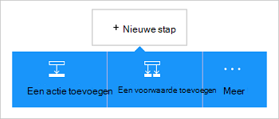

<properties
    pageTitle="De Office 365, Outlook connector toevoegen in uw logica Apps | Microsoft Azure"
    description="Logica apps maken met Office 365-connector om interactie met Office 365. Bijvoorbeeld: maken, bewerken en bijwerken van contactpersonen en agenda-items."
    services=""    
    documentationCenter=""     
    authors="MandiOhlinger"    
    manager="anneta"    
    editor="" 
    tags="connectors" />

<tags
ms.service="logic-apps"
ms.devlang="na"
ms.topic="article"
ms.tgt_pltfrm="na"
ms.workload="integration"
ms.date="10/18/2016"
ms.author="mandia"/>

# Aan de slag met Office 365, Outlook connector 

De Office 365, Outlook connector kunnen interactie met Outlook in Office 365. Met deze connector kunt maken, bewerken, contactpersonen en agenda-items bijwerken en ook, verzenden en beantwoorden van e-mail.

Met Office 365 Outlook u:

- Bouw uw workflow met de functies voor e-mail en agenda in Office 365. 
- Met triggers kunt u de werkstroom starten wanneer er een nieuwe e-mail wanneer u een agenda-item is bijgewerkt en nog veel meer.
- Acties gebruiken om een e-mailbericht te verzenden, maakt u een nieuwe gebeurtenis en nog veel meer. Bijvoorbeeld wanneer er een nieuw object in de televergaderingen (trigger), een e-mail sturen aan uw Outlook in Office 365 (actie). 

In dit onderwerp wordt beschreven hoe Office 365, Outlook connector gebruiken in een logica app u, en van de triggers en acties.

>[AZURE.NOTE] Deze versie van het artikel is van toepassing op logica Apps algemene beschikbaarheid (GA).

Zie voor meer informatie over Logic Apps, [Wat zijn apps logica](../app-service-logic/app-service-logic-what-are-logic-apps.md) en [maken van een app logica](../app-service-logic/app-service-logic-create-a-logic-app.md).

## Verbinding maken met Office 365

Voordat uw logica app toegang een service tot, maakt u een *verbinding* met de service. Een verbinding biedt connectiviteit tussen een app logica en een andere service. Bijvoorbeeld, als u wilt verbinding maken met Office 365, Outlook, moet u eerst een Office 365- *verbinding*. Een verbinding wilt maken, voert u de referenties gebruikt voor toegang tot de service die u verbinding wilt maken. Voer dus de referenties aan uw Office 365-account om de verbinding te maken met Office 365, Outlook.

## Maak de verbinding

>[AZURE.INCLUDE [Steps to create a connection to Office 365](../../includes/connectors-create-api-office365-outlook.md)]

## Een trigger gebruiken

Een trigger is een gebeurtenis die kan worden gebruikt voor het starten van de werkstroom in een app logica gedefinieerd. Triggers vragen' ' de service op een interval en de gewenste frequentie. [Meer informatie over triggers](../app-service-logic/app-service-logic-what-are-logic-apps.md#logic-app-concepts).

1. Typ 'office 365' voor een overzicht van de triggers in de app logica:  

    

2. Selecteer **Office 365 Outlook - bij het snel starten van een gepland evenement**. Als er al een verbinding bestaat, selecteert u een agenda uit de vervolgkeuzelijst.

    

    Als u wordt gevraagd aan te melden, geeft u het teken in details om de verbinding te maken. [De verbinding maken](connectors-create-api-office365-outlook.md#create-the-connection) in dit onderwerp vindt u de stappen. 

    > [AZURE.NOTE] In dit voorbeeld wordt de logica app uitgevoerd wanneer een gebeurtenis in de agenda wordt bijgewerkt. U kunt de resultaten van deze trigger toevoegen die u een bericht verzendt. Bijvoorbeeld de actie Twilio *bericht verzenden* dat teksten toevoegen wanneer de gebeurtenis is gestart in 15 minuten. 

3. Klik op de knop **bewerken** en stel de **frequentie** en **Interval** . Bijvoorbeeld, als u wilt dat de trigger te vragen voor elke 15 minuten, vervolgens de **frequentie** instelt op de **minuut**en het **Interval** instellen op **15**. 

    

4. **Sla** uw wijzigingen (linksboven aan de werkbalk). Uw app logica wordt opgeslagen en automatisch kan worden ingeschakeld.

## Actie

Een actie is een bewerking die wordt uitgevoerd door de werkstroom in een app logica gedefinieerd. [Meer informatie over acties](../app-service-logic/app-service-logic-what-are-logic-apps.md#logic-app-concepts).

1. Selecteer het plus-teken. Ziet u verschillende mogelijkheden: **een actie toevoegen**, **toevoegen van een voorwaarde**of een van de **meer** opties.

    

2. Kies **een actie toevoegen**.

3. Typ in het tekstvak 'office 365' voor een overzicht van alle beschikbare acties.

     

4. In ons voorbeeld kiezen **Office 365 Outlook - contactpersoon maken**. Als er al een verbinding bestaat, kiest u de **Map-ID**, **naam**en andere eigenschappen:  

    

    Als u wordt gevraagd om de verbindingsgegevens, voert u de details van de verbinding te maken. Deze eigenschappen van [de verbinding maken](connectors-create-api-office365-outlook.md#create-the-connection) in dit onderwerp worden beschreven. 

    > [AZURE.NOTE] In dit voorbeeld maken we een nieuwe contactpersoon in Outlook voor Office 365. Uitvoer van een andere trigger kunt u het contact maken. Voeg bijvoorbeeld de trigger televergaderingen *als een object is gemaakt* . Voeg vervolgens de actie voor Office 365, Outlook- *contactpersoon maken* die de televergaderingen-velden worden gebruikt voor het maken van de nieuwe nieuwe contactpersoon in Office 365. 

5. **Sla** uw wijzigingen (linksboven aan de werkbalk). Uw app logica wordt opgeslagen en automatisch kan worden ingeschakeld.

## Technische Details

Hier vindt u de details van de triggers, acties en reacties die deze verbinding ondersteunt:

## Triggers voor Office 365

|Trigger | Beschrijving|
|--- | ---|
|[Wanneer een evenement is die binnenkort worden gestart](connectors-create-api-office365-outlook.md#when-an-upcoming-event-is-starting-soon)|Deze bewerking wordt een stroom gegenereerd wanneer een aanstaande gebeurtenis wordt gestart.|
|[Wanneer een nieuwe e-mail binnenkomt](connectors-create-api-office365-outlook.md#when-a-new-email-arrives)|Deze bewerking wordt een stroom gegenereerd wanneer een nieuwe e-mail binnenkomt|
|[Wanneer u een nieuwe gebeurtenis wordt gemaakt](connectors-create-api-office365-outlook.md#when-a-new-event-is-created)|Deze bewerking wordt een stroom gegenereerd wanneer een nieuwe gebeurtenis wordt gemaakt in een kalender.|
|[Wanneer een gebeurtenis wordt gewijzigd](connectors-create-api-office365-outlook.md#when-an-event-is-modified)|Deze bewerking wordt een stroom gegenereerd wanneer een gebeurtenis wordt gewijzigd in een kalender.|

## Acties voor Office 365

|Actie|Beschrijving|
|--- | ---|
|[E-mails ophalen](connectors-create-api-office365-outlook.md#get-emails)|Deze bewerking wordt e-mails in een map.|
|[Een e-mailbericht verzenden](connectors-create-api-office365-outlook.md#send-an-email)|Deze bewerking verzendt een e-mailbericht.|
|[E-mailadres verwijderen](connectors-create-api-office365-outlook.md#delete-email)|Deze bewerking wordt een e-mailbericht door-id verwijderd.|
|[Markeren als gelezen](connectors-create-api-office365-outlook.md#mark-as-read)|Deze bewerking wordt een e-mailbericht als gelezen gemarkeerd.|
|[E-mail beantwoorden](connectors-create-api-office365-outlook.md#reply-to-email)|Deze bewerking een e-mailbericht beantwoordt.|
|[Bijlage ophalen](connectors-create-api-office365-outlook.md#get-attachment)|Deze bewerking wordt een e-mailbijlage door-id.|
|[Verzenden van e-mail met opties](connectors-create-api-office365-outlook.md#send-email-with-options)|Deze bewerking stuurt een e-mailbericht met meerdere opties en wacht tot de geadresseerde om te reageren met een van de opties.|
|[Goedkeuring per e-mail](connectors-create-api-office365-outlook.md#send-approval-email)|Deze bewerking een e-mail voor goedkeuring verzendt en wacht op een reactie van de geadresseerde.|
|[Agenda's ophalen](connectors-create-api-office365-outlook.md#get-calendars)|Deze bewerking worden de beschikbare kalenders.|
|[Gebeurtenissen ophalen](connectors-create-api-office365-outlook.md#get-events)|Deze bewerking haalt gebeurtenissen uit een agenda.|
|[Gebeurtenis maken](connectors-create-api-office365-outlook.md#create-event)|Hiermee maakt u een nieuwe gebeurtenis in een kalender.|
|[Gebeurtenis ophalen](connectors-create-api-office365-outlook.md#get-event)|Deze bewerking wordt een bepaalde gebeurtenis in een kalender.|
|[Gebeurtenis verwijderen](connectors-create-api-office365-outlook.md#delete-event)|Deze bewerking verwijdert u een gebeurtenis in een kalender.|
|[Gebeurtenis bijwerken](connectors-create-api-office365-outlook.md#update-event)|Deze bewerking wordt een gebeurtenis in een kalender bijgewerkt.|
|[Mappen met contactpersonen ophalen](connectors-create-api-office365-outlook.md#get-contact-folders)|Deze bewerking worden de mappen met contactpersonen beschikbaar.|
|[Contactpersonen](connectors-create-api-office365-outlook.md#get-contacts)|Deze bewerking wordt contactpersonen in een map met contactpersonen.|
|[Contact maken](connectors-create-api-office365-outlook.md#create-contact)|Deze bewerking maakt een nieuwe contactpersoon in een map met contactpersonen.|
|[Contactpersoon ophalen](connectors-create-api-office365-outlook.md#get-contact)|Deze bewerking wordt een specifieke contactpersoon in een map met contactpersonen.|
|[Contactpersoon verwijderen](connectors-create-api-office365-outlook.md#delete-contact)|Deze bewerking verwijdert een contactpersoon uit een map met contactpersonen.|
|[Contactpersoon bijwerken](connectors-create-api-office365-outlook.md#update-contact)|Deze bewerking werkt een contactpersoon in een map met contactpersonen.|

### Trigger- en details

In dit gedeelte ziet u de specifieke details over elke trigger en maatregelen, met inbegrip van eventuele verplichte of optionele eigenschappen voor de invoer en de bijbehorende uitvoer die is gekoppeld aan de verbindingslijn.

#### Wanneer een evenement is die binnenkort worden gestart
Deze bewerking wordt een stroom gegenereerd wanneer een aanstaande gebeurtenis wordt gestart. 

|Naam van eigenschap| Weergavenaam|Beschrijving|
| ---|---|---|
|tabel *|Kalender-id|De unieke id van de kalender|
|lookAheadTimeInMinutes|Look-ahead tijd|Tijd (in minuten) om vooruit te kijken voor toekomstige gebeurtenissen|

Een sterretje (*) betekent dat de eigenschap is vereist.

##### Uitvoerdetails
CalendarItemsList: De lijst van agenda-items

| Naam van eigenschap | Gegevenstype | Beschrijving |
|---|---|---|
|waarde|matrix|Lijst van agenda-items|

#### E-mails ophalen
Deze bewerking wordt e-mails in een map. 

|Naam van eigenschap| Weergavenaam|Beschrijving|
| ---|---|---|
|folderPath|Pad naar map|Pad van de map voor het ophalen van e-mailberichten (standaard: 'Postvak in')|
|Boven|Boven|Aantal e-mailberichten op te halen (standaardwaarde: 10)|
|fetchOnlyUnread|Alleen ongelezen berichten ophalen|Alleen ongelezen e-mails ophalen?|
|includeAttachments|Bijlagen opnemen|Als is ingesteld op true, bijlagen zal ook worden opgehaald samen met het e-mailbericht|
|searchQuery|Zoekopdracht|Zoekopdracht voor het filteren van e-mailberichten|
|overslaan|Overslaan|Aantal e-mails over te slaan (standaard: 0)|
|skipToken|Token overslaan|Token ophalen nieuwe pagina overslaan|

Een sterretje (*) betekent dat de eigenschap is vereist.

##### Uitvoerdetails
ReceiveMessage: E-mailbericht ontvangen

| Naam van eigenschap | Gegevenstype | Beschrijving |
|---|---|---|
|Van|tekenreeks|Van|
|Aan|tekenreeks|Aan|
|Onderwerp|tekenreeks|Onderwerp|
|Hoofdtekst|tekenreeks|Hoofdtekst|
|Belang|tekenreeks|Belang|
|Heeftbijlage|Boole-waarde|Bijlage|
|ID|tekenreeks|Bericht-Id|
|Isgelezen|Boole-waarde|Lezen is|
|DateTimeReceived|tekenreeks|Datum tijd ontvangen|
|Bijlagen|matrix|Bijlagen|
|CC|tekenreeks|Geef de e-mailadressen, gescheiden door puntkomma's alssomeone@contoso.com|
|BCC|tekenreeks|Geef de e-mailadressen, gescheiden door puntkomma's alssomeone@contoso.com|
|IsHtml|Boole-waarde|HTML|

#### Een e-mailbericht verzenden
Deze bewerking verzendt een e-mailbericht. 

|Naam van eigenschap| Weergavenaam|Beschrijving|
| ---|---|---|
|Er *|E-mail|E-mail|

Een sterretje (*) betekent dat de eigenschap is vereist.

##### Uitvoerdetails
Geen.

#### E-mailadres verwijderen
Deze bewerking wordt een e-mailbericht door-id verwijderd. 

|Naam van eigenschap| Weergavenaam|Beschrijving|
| ---|---|---|
|messageId *|Bericht-Id|Id van het e-mailbericht verwijderen|

Een sterretje (*) betekent dat de eigenschap is vereist.

##### Uitvoerdetails
Geen.

#### Markeren als gelezen
Deze bewerking wordt een e-mailbericht als gelezen gemarkeerd. 

|Naam van eigenschap| Weergavenaam|Beschrijving|
| ---|---|---|
|messageId *|Bericht-Id|Id van het e-mailbericht moet worden gemarkeerd als gelezen|

Een sterretje (*) betekent dat de eigenschap is vereist.

##### Uitvoerdetails
Geen.

#### E-mail beantwoorden
Deze bewerking een e-mailbericht beantwoordt. 

|Naam van eigenschap| Weergavenaam|Beschrijving|
| ---|---|---|
|messageId *|Bericht-Id|Id van het e-mailbericht te beantwoorden|
|Opmerking *|Opmerking|Commentaar|
|Allen beantwoorden|Allen beantwoorden|Alle ontvangers beantwoorden|

Een sterretje (*) betekent dat de eigenschap is vereist.

##### Uitvoerdetails
Geen.

#### Bijlage ophalen
Deze bewerking wordt een e-mailbijlage door-id. 

|Naam van eigenschap| Weergavenaam|Beschrijving|
| ---|---|---|
|messageId *|Bericht-Id|Id van het e-mailbericht|
|attachmentId *|Bijlage-Id|Id van de bijlage te downloaden|

Een sterretje (*) betekent dat de eigenschap is vereist.

##### Uitvoerdetails
Geen.

#### Wanneer een nieuwe e-mail binnenkomt
Deze bewerking wordt een stroom gegenereerd wanneer een nieuwe e-mail binnenkomt.

|Naam van eigenschap| Weergavenaam|Beschrijving|
| ---|---|---|
|folderPath|Pad naar map|E-map op te halen (standaard: Postvak in)|
|Aan|Aan|Ontvangende e-mailadressen|
|Van|Van|Van adres|
|belang|Belang|Belang van het e-mailbericht (hoog, normaal, laag) (standaard: normaal)|
|fetchOnlyWithAttachment|Bijlagen heeft|Alleen e-mailberichten met een bijlage ophalen|
|includeAttachments|Bijlagen opnemen|Bijlagen opnemen|
|subjectFilter|Filter onderwerp|De tekenreeks om te zoeken in het onderwerp|

Een sterretje (*) betekent dat de eigenschap is vereist.

##### Uitvoerdetails
TriggerBatchResponse [ReceiveMessage]

| Naam van eigenschap | Gegevenstype |
|---|---|
|waarde|matrix|

#### Verzenden van e-mail met opties
Deze bewerking stuurt een e-mailbericht met meerdere opties en wacht tot de geadresseerde om te reageren met een van de opties. 

|Naam van eigenschap| Weergavenaam|Beschrijving|
| ---|---|---|
|optionsEmailSubscription *|Abonnementaanvraag voor e-mail opties|Abonnementaanvraag voor e-mail opties|

Een sterretje (*) betekent dat de eigenschap is vereist.

##### Uitvoerdetails
SubscriptionResponse: Model voor e-mailabonnement op goedkeuring

| Naam van eigenschap | Gegevenstype | Beschrijving |
|---|---|---|
|ID|tekenreeks|Id van het abonnement|
|resource|tekenreeks|Bron van de aanvraag voor een abonnement|
|notificationType|tekenreeks|Meldingstype|
|notificationUrl|tekenreeks|Meldings-Url|

#### Goedkeuring per e-mail
Deze bewerking een e-mail voor goedkeuring verzendt en wacht op een reactie van de geadresseerde. 

|Naam van eigenschap| Weergavenaam|Beschrijving|
| ---|---|---|
|approvalEmailSubscription *|Abonnementaanvraag voor goedkeuring e-mail|Abonnementaanvraag voor goedkeuring e-mail|

Een sterretje (*) betekent dat de eigenschap is vereist.

##### Uitvoerdetails
SubscriptionResponse: Model voor e-mailabonnement op goedkeuring

| Naam van eigenschap | Gegevenstype | Beschrijving |
|---|---|---|
|ID|tekenreeks|Id van het abonnement|
|resource|tekenreeks|Bron van de aanvraag voor een abonnement|
|notificationType|tekenreeks|Meldingstype|
|notificationUrl|tekenreeks|Meldings-Url|

#### Agenda's ophalen
Deze bewerking worden de beschikbare kalenders. 

Er zijn geen parameters voor deze oproep.

##### Uitvoerdetails
TablesList

| Naam van eigenschap | Gegevenstype |
|---|---|
|waarde|matrix|

#### Gebeurtenissen ophalen
Deze bewerking haalt gebeurtenissen uit een agenda. 

|Naam van eigenschap| Weergavenaam|Beschrijving|
| ---|---|---|
|tabel *|Kalender-id|Selecteer een kalender|
|$filter|Filteren van Query|Een filterquery ODATA de geretourneerde items beperken|
|$orderby|Order By|Een query ODATA sorteren op voor het opgeven van de volgorde van items|
|$skip|Aantal overgeslagen|Aantal items over te slaan (standaard = 0)|
|$top|Get maximum aantal|Maximum aantal items op te halen (standaard = 256)|

Een sterretje (*) betekent dat de eigenschap is vereist.

##### Uitvoerdetails
CalendarEventList: De lijst van agenda-items

| Naam van eigenschap | Gegevenstype | Beschrijving |
|---|---|---|
|waarde|matrix|Lijst van agenda-items|

#### Gebeurtenis maken
Hiermee maakt u een nieuwe gebeurtenis in een kalender. 

|Naam van eigenschap| Weergavenaam|Beschrijving|
| ---|---|---|
|tabel *|Kalender-id|Selecteer een kalender|
|artikel *|Artikel|Gebeurtenis maken|

Een sterretje (*) betekent dat de eigenschap is vereist.

##### Uitvoerdetails
CalendarEvent: Connector specifieke kalender model gebeurtenisklasse.

| Naam van eigenschap | Gegevenstype | Beschrijving |
|---|---|---|
|ID|tekenreeks|De unieke id van de gebeurtenis.|
|Deelnemers|matrix|Lijst met deelnemers voor de gebeurtenis.|
|Hoofdtekst|niet gedefinieerd|De hoofdtekst van het bericht is gekoppeld aan de gebeurtenis.|
|BodyPreview|tekenreeks|Het voorbeeld van het bericht is gekoppeld aan de gebeurtenis.|
|Categorieën|matrix|De categorieën die zijn gekoppeld aan de gebeurtenis.|
|ChangeKey|tekenreeks|Geeft de versie van het gebeurtenisobject. Telkens wanneer de gebeurtenis wordt gewijzigd, verandert de ChangeKey ook.|
|DateTimeCreated|tekenreeks|De datum en tijd waarop de gebeurtenis is gemaakt.|
|DateTimeLastModified|tekenreeks|De datum en tijd waarop de gebeurtenis voor het laatst is gewijzigd.|
|Einde|tekenreeks|De eindtijd van de gebeurtenis.|
|EndTimeZone|tekenreeks|Hiermee geeft u de tijdzone van de vergadering de eindtijd. Deze waarde moet zoals gedefinieerd in Windows (voorbeeld: 'Pacific Standard Time').|
|Heeftbijlagen|Boole-waarde|Instellen op true als de gebeurtenis bijlagen heeft.|
|Belang|tekenreeks|Het belang van de gebeurtenis: laag, normaal of hoog.|
|IsAllDay|Boole-waarde|Stel in op true als de gebeurtenis, hele dag duurt.|
|IsCancelled|Boole-waarde|Stel in op true als de gebeurtenis is geannuleerd.|
|IsOrganizer|Boole-waarde|Instellen op true als de afzender van het bericht is ook de organisator.|
|Locatie|niet gedefinieerd|De locatie van de gebeurtenis.|
|Organisator|niet gedefinieerd|De organisator van de gebeurtenis.|
|Terugkeerpatroon|niet gedefinieerd|Het terugkeerpatroon voor de gebeurtenis.|
|Herinnering|geheel getal|Tijd in minuten voor het begin van de gebeurtenis om te herinneren.|
|ResponseRequested|Boole-waarde|Ingesteld op true als de afzender een antwoord verwacht als de gebeurtenis wordt geaccepteerd of geweigerd.|
|ResponseStatus|niet gedefinieerd|Geeft het type reactie verzonden in reactie op een bericht.|
|SeriesMasterId|tekenreeks|De unieke id voor de Master Series gebeurtenistype.|
|ShowAs|tekenreeks|Wordt weergegeven als vrije of bezet.|
|Start|tekenreeks|De begintijd van de gebeurtenis.|
|StartTimeZone|tekenreeks|Specificeert de tijd waarop de begintijd van de zone van de vergadering. Deze waarde moet zoals gedefinieerd in Windows (voorbeeld: "Pacific Standard Time").|
|Onderwerp|tekenreeks|Onderwerp van de gebeurtenis.|
|Type|tekenreeks|Het gebeurtenistype: één exemplaar, exemplaar, uitzondering of model van de reeks.|
|WebLink|tekenreeks|Het voorbeeld van het bericht is gekoppeld aan de gebeurtenis.|

#### Gebeurtenis ophalen
Deze bewerking wordt een bepaalde gebeurtenis in een kalender. 

|Naam van eigenschap| Weergavenaam|Beschrijving|
| ---|---|---|
|tabel *|Kalender-id|Selecteer een kalender|
|ID *|Item-id|Selecteer een gebeurtenis|

Een sterretje (*) betekent dat de eigenschap is vereist.

##### Uitvoerdetails
CalendarEvent: Connector specifieke kalender model gebeurtenisklasse.

| Naam van eigenschap | Gegevenstype | Beschrijving |
|---|---|---|
|ID|tekenreeks|De unieke id van de gebeurtenis.|
|Deelnemers|matrix|Lijst met deelnemers voor de gebeurtenis.|
|Hoofdtekst|niet gedefinieerd|De hoofdtekst van het bericht is gekoppeld aan de gebeurtenis.|
|BodyPreview|tekenreeks|Het voorbeeld van het bericht is gekoppeld aan de gebeurtenis.|
|Categorieën|matrix|De categorieën die zijn gekoppeld aan de gebeurtenis.|
|ChangeKey|tekenreeks|Geeft de versie van het gebeurtenisobject. Telkens wanneer de gebeurtenis wordt gewijzigd, verandert de ChangeKey ook.|
|DateTimeCreated|tekenreeks|De datum en tijd waarop de gebeurtenis is gemaakt.|
|DateTimeLastModified|tekenreeks|De datum en tijd waarop de gebeurtenis voor het laatst is gewijzigd.|
|Einde|tekenreeks|De eindtijd van de gebeurtenis.|
|EndTimeZone|tekenreeks|Hiermee geeft u de tijdzone van de vergadering de eindtijd. Deze waarde moet zoals gedefinieerd in Windows (voorbeeld: 'Pacific Standard Time').|
|Heeftbijlagen|Boole-waarde|Instellen op true als de gebeurtenis bijlagen heeft.|
|Belang|tekenreeks|Het belang van de gebeurtenis: laag, normaal of hoog.|
|IsAllDay|Boole-waarde|Stel in op true als de gebeurtenis, hele dag duurt.|
|IsCancelled|Boole-waarde|Stel in op true als de gebeurtenis is geannuleerd.|
|IsOrganizer|Boole-waarde|Instellen op true als de afzender van het bericht is ook de organisator.|
|Locatie|niet gedefinieerd|De locatie van de gebeurtenis.|
|Organisator|niet gedefinieerd|De organisator van de gebeurtenis.|
|Terugkeerpatroon|niet gedefinieerd|Het terugkeerpatroon voor de gebeurtenis.|
|Herinnering|geheel getal|Tijd in minuten voor het begin van de gebeurtenis om te herinneren.|
|ResponseRequested|Boole-waarde|Ingesteld op true als de afzender een antwoord verwacht als de gebeurtenis wordt geaccepteerd of geweigerd.|
|ResponseStatus|niet gedefinieerd|Geeft het type reactie verzonden in reactie op een bericht.|
|SeriesMasterId|tekenreeks|De unieke id voor de Master Series gebeurtenistype.|
|ShowAs|tekenreeks|Wordt weergegeven als vrije of bezet.|
|Start|tekenreeks|De begintijd van de gebeurtenis.|
|StartTimeZone|tekenreeks|Specificeert de tijd waarop de begintijd van de zone van de vergadering. Deze waarde moet zoals gedefinieerd in Windows (voorbeeld: "Pacific Standard Time").|
|Onderwerp|tekenreeks|Onderwerp van de gebeurtenis.|
|Type|tekenreeks|Het gebeurtenistype: één exemplaar, exemplaar, uitzondering of model van de reeks.|
|WebLink|tekenreeks|Het voorbeeld van het bericht is gekoppeld aan de gebeurtenis.|

#### Gebeurtenis verwijderen
Deze bewerking verwijdert u een gebeurtenis in een kalender. 

|Naam van eigenschap| Weergavenaam|Beschrijving|
| ---|---|---|
|tabel *|Kalender-id|Selecteer een kalender|
|ID *|ID|Selecteer een gebeurtenis|

Een sterretje (*) betekent dat de eigenschap is vereist.

##### Uitvoerdetails
Geen.

#### Gebeurtenis bijwerken
Deze bewerking wordt een gebeurtenis in een kalender bijgewerkt. 

|Naam van eigenschap| Weergavenaam|Beschrijving|
| ---|---|---|
|tabel *|Kalender-id|Selecteer een kalender|
|ID *|ID|Selecteer een gebeurtenis|
|artikel *|Artikel|Gebeurtenis bijwerken|

Een sterretje (*) betekent dat de eigenschap is vereist.

##### Uitvoerdetails
CalendarEvent: Connector specifieke kalender model gebeurtenisklasse.

| Naam van eigenschap | Gegevenstype | Beschrijving |
|---|---|---|
|ID|tekenreeks|De unieke id van de gebeurtenis.|
|Deelnemers|matrix|Lijst met deelnemers voor de gebeurtenis.|
|Hoofdtekst|niet gedefinieerd|De hoofdtekst van het bericht is gekoppeld aan de gebeurtenis.|
|BodyPreview|tekenreeks|Het voorbeeld van het bericht is gekoppeld aan de gebeurtenis.|
|Categorieën|matrix|De categorieën die zijn gekoppeld aan de gebeurtenis.|
|ChangeKey|tekenreeks|Geeft de versie van het gebeurtenisobject. Telkens wanneer de gebeurtenis wordt gewijzigd, verandert de ChangeKey ook.|
|DateTimeCreated|tekenreeks|De datum en tijd waarop de gebeurtenis is gemaakt.|
|DateTimeLastModified|tekenreeks|De datum en tijd waarop de gebeurtenis voor het laatst is gewijzigd.|
|Einde|tekenreeks|De eindtijd van de gebeurtenis.|
|EndTimeZone|tekenreeks|Hiermee geeft u de tijdzone van de vergadering de eindtijd. Deze waarde moet zoals gedefinieerd in Windows (voorbeeld: 'Pacific Standard Time').|
|Heeftbijlagen|Boole-waarde|Instellen op true als de gebeurtenis bijlagen heeft.|
|Belang|tekenreeks|Het belang van de gebeurtenis: laag, normaal of hoog.|
|IsAllDay|Boole-waarde|Stel in op true als de gebeurtenis, hele dag duurt.|
|IsCancelled|Boole-waarde|Stel in op true als de gebeurtenis is geannuleerd.|
|IsOrganizer|Boole-waarde|Instellen op true als de afzender van het bericht is ook de organisator.|
|Locatie|niet gedefinieerd|De locatie van de gebeurtenis.|
|Organisator|niet gedefinieerd|De organisator van de gebeurtenis.|
|Terugkeerpatroon|niet gedefinieerd|Het terugkeerpatroon voor de gebeurtenis.|
|Herinnering|geheel getal|Tijd in minuten voor het begin van de gebeurtenis om te herinneren.|
|ResponseRequested|Boole-waarde|Ingesteld op true als de afzender een antwoord verwacht als de gebeurtenis wordt geaccepteerd of geweigerd.|
|ResponseStatus|niet gedefinieerd|Geeft het type reactie verzonden in reactie op een bericht.|
|SeriesMasterId|tekenreeks|De unieke id voor de Master Series gebeurtenistype.|
|ShowAs|tekenreeks|Wordt weergegeven als vrije of bezet.|
|Start|tekenreeks|De begintijd van de gebeurtenis.|
|StartTimeZone|tekenreeks|Specificeert de tijd waarop de begintijd van de zone van de vergadering. Deze waarde moet zoals gedefinieerd in Windows (voorbeeld: "Pacific Standard Time").|
|Onderwerp|tekenreeks|Onderwerp van de gebeurtenis.|
|Type|tekenreeks|Het gebeurtenistype: één exemplaar, exemplaar, uitzondering of model van de reeks.|
|WebLink|tekenreeks|Het voorbeeld van het bericht is gekoppeld aan de gebeurtenis.|

#### Wanneer u een nieuwe gebeurtenis wordt gemaakt
Deze bewerking wordt een stroom gegenereerd wanneer een nieuwe gebeurtenis wordt gemaakt in een kalender. 

|Naam van eigenschap| Weergavenaam|Beschrijving|
| ---|---|---|
|tabel *|Kalender-id|Selecteer een kalender|
|$filter|Filteren van Query|Een filterquery ODATA de geretourneerde items beperken|
|$orderby|Order By|Een query ODATA sorteren op voor het opgeven van de volgorde van items|
|$skip|Aantal overgeslagen|Aantal items over te slaan (standaard = 0)|
|$top|Get maximum aantal|Maximum aantal items op te halen (standaard = 256)|

Een sterretje (*) betekent dat de eigenschap is vereist.

##### Uitvoerdetails
CalendarItemsList: De lijst van agenda-items

| Naam van eigenschap | Gegevenstype | Beschrijving |
|---|---|---|
|waarde|matrix|Lijst van agenda-items|

#### Wanneer een gebeurtenis wordt gewijzigd
Deze bewerking wordt een stroom gegenereerd wanneer een gebeurtenis wordt gewijzigd in een kalender. 

|Naam van eigenschap| Weergavenaam|Beschrijving|
| ---|---|---|
|tabel *|Kalender-id|Selecteer een kalender|
|$filter|Filteren van Query|Een filterquery ODATA de geretourneerde items beperken|
|$orderby|Order By|Een query ODATA sorteren op voor het opgeven van de volgorde van items|
|$skip|Aantal overgeslagen|Aantal items over te slaan (standaard = 0)|
|$top|Get maximum aantal|Maximum aantal items op te halen (standaard = 256)|

Een sterretje (*) betekent dat de eigenschap is vereist.

##### Uitvoerdetails
CalendarItemsList: De lijst van agenda-items

| Naam van eigenschap | Gegevenstype | Beschrijving |
|---|---|---|
|waarde|matrix|Lijst van agenda-items|

#### Mappen met contactpersonen ophalen
Deze bewerking worden de mappen met contactpersonen beschikbaar. 

Er zijn geen parameters voor deze oproep.

##### Uitvoerdetails
TablesList

| Naam van eigenschap | Gegevenstype |
|---|---|
|waarde|matrix|

#### Contactpersonen
Deze bewerking wordt contactpersonen in een map met contactpersonen. 

|Naam van eigenschap| Weergavenaam|Beschrijving|
| ---|---|---|
|tabel *|Map-id|De unieke id van de contactpersonenmap op te halen|
|$filter|Filteren van Query|Een filterquery ODATA de geretourneerde items beperken|
|$orderby|Order By|Een query ODATA sorteren op voor het opgeven van de volgorde van items|
|$skip|Aantal overgeslagen|Aantal items over te slaan (standaard = 0)|
|$top|Get maximum aantal|Maximum aantal items op te halen (standaard = 256)|

Een sterretje (*) betekent dat de eigenschap is vereist.

##### Uitvoerdetails
ContactList: De lijst met contactpersonen

| Naam van eigenschap | Gegevenstype | Beschrijving |
|---|---|---|
|waarde|matrix|Lijst met contactpersonen|

#### Contact maken
Deze bewerking maakt een nieuwe contactpersoon in een map met contactpersonen. 

|Naam van eigenschap| Weergavenaam|Beschrijving|
| ---|---|---|
|tabel *|Map-id|Selecteer een map met contactpersonen|
|artikel *|Artikel|Contact maken|

Een sterretje (*) betekent dat de eigenschap is vereist.

##### Uitvoerdetails
Contactpersoon: Contact

| Naam van eigenschap | Gegevenstype | Beschrijving |
|---|---|---|
|ID|tekenreeks|De unieke id van de contactpersoon.|
|ParentFolderId worden|tekenreeks|De ID van de contactpersoon van de bovenliggende map|
|Verjaardag|tekenreeks|Verjaardag van de contactpersoon.|
|FileAs|tekenreeks|Waaronder is de naam van de contactpersoon opgeslagen.|
|DisplayName|tekenreeks|De weergavenaam van de contactpersoon.|
|GivenName|tekenreeks|Naam van de contactpersoon.|
|Initialen|tekenreeks|De initialen van de contactpersoon.|
|MiddleName|tekenreeks|Voornaam van de contactpersoon.|
|Bijnaam|tekenreeks|De bijnaam van de contactpersoon.|
|Achternaam|tekenreeks|De achternaam van de contactpersoon.|
|Titel|tekenreeks|Titel van de contactpersoon.|
|Generatie|tekenreeks|Het genereren van de contactpersoon.|
|EmailAddresses|matrix|Hierin wordt e-mailadres van de contactpersoon.|
|ImAddresses|matrix|(Van de contactpersoon instant messaging IM)-adressen.|
|Functie|tekenreeks|De functie van de contactpersoon.|
|Bedrijfsnaam|tekenreeks|De naam van het bedrijf van de contactpersoon.|
|Afdeling|tekenreeks|Afdeling van de contactpersoon.|
|OfficeLocation|tekenreeks|De locatie van office van de contactpersoon.|
|Beroep|tekenreeks|Het beroep van de contactpersoon.|
|BusinessHomePage|tekenreeks|De startpagina bedrijf van de contactpersoon.|
|AssistantName|tekenreeks|De naam van de assistent van de contactpersoon.|
|Manager|tekenreeks|De naam van de manager van de contactpersoon.|
|HomePhones|matrix|Huis telefoonnummers van de contactpersoon.|
|BusinessPhones|matrix|De zakelijke telefoonnummers van de contactpersoon|
|MobilePhone1|tekenreeks|Het mobiele telefoonnummer van de contactpersoon.|
|HomeAddress|niet gedefinieerd|Het huisadres van de contactpersoon.|
|BusinessAddress|niet gedefinieerd|Werkadres van de contactpersoon.|
|OtherAddress|niet gedefinieerd|Andere adressen voor de contactpersoon.|
|YomiCompanyName|tekenreeks|De Japanse fonetische bedrijfsnaam van de contactpersoon.|
|YomiGivenName|tekenreeks|De fonetische Japanse opgegeven naam (voornaam) van de contactpersoon.|
|YomiSurname|tekenreeks|De Japanse fonetische Achternaam (achternaam) van de contactpersoon|
|Categorieën|matrix|De categorieën die zijn gekoppeld aan de contactpersoon.|
|ChangeKey|tekenreeks|Geeft de versie van het object event|
|DateTimeCreated|tekenreeks|Het tijdstip waarop dat de contactpersoon is gemaakt.|
|DateTimeLastModified|tekenreeks|De tijd die de contactpersoon is gewijzigd.|

#### Contactpersoon ophalen
Deze bewerking wordt een specifieke contactpersoon in een map met contactpersonen. 

|Naam van eigenschap| Weergavenaam|Beschrijving|
| ---|---|---|
|tabel *|Map-id|Selecteer een map met contactpersonen|
|ID *|Item-id|De unieke id van een contactpersoon op te halen|

Een sterretje (*) betekent dat de eigenschap is vereist.

##### Uitvoerdetails
Contactpersoon: Contact

| Naam van eigenschap | Gegevenstype | Beschrijving |
|---|---|---|
|ID|tekenreeks|De unieke id van de contactpersoon.|
|ParentFolderId worden|tekenreeks|De ID van de contactpersoon van de bovenliggende map|
|Verjaardag|tekenreeks|Verjaardag van de contactpersoon.|
|FileAs|tekenreeks|Waaronder is de naam van de contactpersoon opgeslagen.|
|DisplayName|tekenreeks|De weergavenaam van de contactpersoon.|
|GivenName|tekenreeks|Naam van de contactpersoon.|
|Initialen|tekenreeks|De initialen van de contactpersoon.|
|MiddleName|tekenreeks|Voornaam van de contactpersoon.|
|Bijnaam|tekenreeks|De bijnaam van de contactpersoon.|
|Achternaam|tekenreeks|De achternaam van de contactpersoon.|
|Titel|tekenreeks|Titel van de contactpersoon.|
|Generatie|tekenreeks|Het genereren van de contactpersoon.|
|EmailAddresses|matrix|Hierin wordt e-mailadres van de contactpersoon.|
|ImAddresses|matrix|(Van de contactpersoon instant messaging IM)-adressen.|
|Functie|tekenreeks|De functie van de contactpersoon.|
|Bedrijfsnaam|tekenreeks|De naam van het bedrijf van de contactpersoon.|
|Afdeling|tekenreeks|Afdeling van de contactpersoon.|
|OfficeLocation|tekenreeks|De locatie van office van de contactpersoon.|
|Beroep|tekenreeks|Het beroep van de contactpersoon.|
|BusinessHomePage|tekenreeks|De startpagina bedrijf van de contactpersoon.|
|AssistantName|tekenreeks|De naam van de assistent van de contactpersoon.|
|Manager|tekenreeks|De naam van de manager van de contactpersoon.|
|HomePhones|matrix|Huis telefoonnummers van de contactpersoon.|
|BusinessPhones|matrix|De zakelijke telefoonnummers van de contactpersoon|
|MobilePhone1|tekenreeks|Het mobiele telefoonnummer van de contactpersoon.|
|HomeAddress|niet gedefinieerd|Het huisadres van de contactpersoon.|
|BusinessAddress|niet gedefinieerd|Werkadres van de contactpersoon.|
|OtherAddress|niet gedefinieerd|Andere adressen voor de contactpersoon.|
|YomiCompanyName|tekenreeks|De Japanse fonetische bedrijfsnaam van de contactpersoon.|
|YomiGivenName|tekenreeks|De fonetische Japanse opgegeven naam (voornaam) van de contactpersoon.|
|YomiSurname|tekenreeks|De Japanse fonetische Achternaam (achternaam) van de contactpersoon|
|Categorieën|matrix|De categorieën die zijn gekoppeld aan de contactpersoon.|
|ChangeKey|tekenreeks|Geeft de versie van het object event|
|DateTimeCreated|tekenreeks|Het tijdstip waarop dat de contactpersoon is gemaakt.|
|DateTimeLastModified|tekenreeks|De tijd die de contactpersoon is gewijzigd.|

#### Contactpersoon verwijderen
Deze bewerking verwijdert een contactpersoon uit een map met contactpersonen. 

|Naam van eigenschap| Weergavenaam|Beschrijving|
| ---|---|---|
|tabel *|Map-id|Selecteer een map met contactpersonen|
|ID *|ID|De unieke id van een contactpersoon verwijderen|

Een sterretje (*) betekent dat de eigenschap is vereist.

##### Uitvoerdetails
Geen.

#### Contactpersoon bijwerken
Deze bewerking werkt een contactpersoon in een map met contactpersonen. 

|Naam van eigenschap| Weergavenaam|Beschrijving|
| ---|---|---|
|tabel *|Map-id|Selecteer een map met contactpersonen|
|ID *|ID|De unieke id van een contactpersoon bijwerken|
|artikel *|Artikel|Contact item bijwerken|

Een sterretje (*) betekent dat de eigenschap is vereist.

##### Uitvoerdetails
Contactpersoon: Contact

| Naam van eigenschap | Gegevenstype | Beschrijving |
|---|---|---|
|ID|tekenreeks|De unieke id van de contactpersoon.|
|ParentFolderId worden|tekenreeks|De ID van de contactpersoon van de bovenliggende map|
|Verjaardag|tekenreeks|Verjaardag van de contactpersoon.|
|FileAs|tekenreeks|Waaronder is de naam van de contactpersoon opgeslagen.|
|DisplayName|tekenreeks|De weergavenaam van de contactpersoon.|
|GivenName|tekenreeks|Naam van de contactpersoon.|
|Initialen|tekenreeks|De initialen van de contactpersoon.|
|MiddleName|tekenreeks|Voornaam van de contactpersoon.|
|Bijnaam|tekenreeks|De bijnaam van de contactpersoon.|
|Achternaam|tekenreeks|De achternaam van de contactpersoon.|
|Titel|tekenreeks|Titel van de contactpersoon.|
|Generatie|tekenreeks|Het genereren van de contactpersoon.|
|EmailAddresses|matrix|Hierin wordt e-mailadres van de contactpersoon.|
|ImAddresses|matrix|(Van de contactpersoon instant messaging IM)-adressen.|
|Functie|tekenreeks|De functie van de contactpersoon.|
|Bedrijfsnaam|tekenreeks|De naam van het bedrijf van de contactpersoon.|
|Afdeling|tekenreeks|Afdeling van de contactpersoon.|
|OfficeLocation|tekenreeks|De locatie van office van de contactpersoon.|
|Beroep|tekenreeks|Het beroep van de contactpersoon.|
|BusinessHomePage|tekenreeks|De startpagina bedrijf van de contactpersoon.|
|AssistantName|tekenreeks|De naam van de assistent van de contactpersoon.|
|Manager|tekenreeks|De naam van de manager van de contactpersoon.|
|HomePhones|matrix|Huis telefoonnummers van de contactpersoon.|
|BusinessPhones|matrix|De zakelijke telefoonnummers van de contactpersoon|
|MobilePhone1|tekenreeks|Het mobiele telefoonnummer van de contactpersoon.|
|HomeAddress|niet gedefinieerd|Het huisadres van de contactpersoon.|
|BusinessAddress|niet gedefinieerd|Werkadres van de contactpersoon.|
|OtherAddress|niet gedefinieerd|Andere adressen voor de contactpersoon.|
|YomiCompanyName|tekenreeks|De Japanse fonetische bedrijfsnaam van de contactpersoon.|
|YomiGivenName|tekenreeks|De fonetische Japanse opgegeven naam (voornaam) van de contactpersoon.|
|YomiSurname|tekenreeks|De Japanse fonetische Achternaam (achternaam) van de contactpersoon|
|Categorieën|matrix|De categorieën die zijn gekoppeld aan de contactpersoon.|
|ChangeKey|tekenreeks|Geeft de versie van het object event|
|DateTimeCreated|tekenreeks|Het tijdstip waarop dat de contactpersoon is gemaakt.|
|DateTimeLastModified|tekenreeks|De tijd die de contactpersoon is gewijzigd.|

## HTTP-antwoorden

De bovenstaande triggers en acties kunnen u een of meer van de volgende HTTP-statuscodes retourneren: 

|Naam|Beschrijving|
|---|---|
|200|OK|
|202|Geaccepteerd|
|400|Ongeldig verzoek|
|401|Niet-geautoriseerde|
|403|Verboden|
|404|Niet gevonden|
|500|Interne serverfout. Er is een onbekende fout opgetreden|
|Standaard|De bewerking is mislukt.|

## Volgende stappen

[Maken van een app logica](../app-service-logic/app-service-logic-create-a-logic-app.md). Bekijk de beschikbare connectors in Apps logica op onze [lijst van API's](apis-list.md).