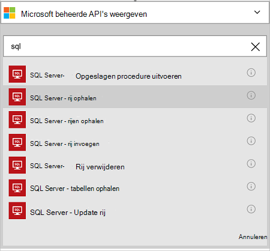
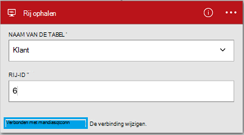

<properties
    pageTitle="De connector Azure SQL-Database in uw Apps logica toevoegen | Microsoft Azure"
    description="Overzicht van Azure SQL Database connector met REST API parameters"
    services=""
    documentationCenter="" 
    authors="MandiOhlinger"
    manager="anneta"
    editor=""
    tags="connectors"/>

<tags
   ms.service="logic-apps"
   ms.devlang="na"
   ms.topic="article"
   ms.tgt_pltfrm="na"
   ms.workload="na" 
   ms.date="10/18/2016"
   ms.author="mandia"/>

# Aan de slag met Azure SQL Database connector
Met behulp van de verbindingslijn Azure SQL-Database, workflows maken voor uw organisatie die gegevens in de tabellen te beheren. 

Met de SQL-Database, u:

- Uw werkstroom maken door een nieuwe klant toe te voegen aan een database met klanten of een order in een orderdatabase wordt bijgewerkt.
- Acties gebruiken om een rij met gegevens opvragen, een nieuwe rij invoegen en zelfs verwijderen. Bijvoorbeeld wanneer een record wordt gemaakt in Dynamics CRM Online (trigger), vervolgens een rij invoegen in een Azure SQL-Database (een handeling). 

In dit onderwerp ziet u hoe u de SQL-Database connector in een app logica, en van de acties.

>[AZURE.NOTE] Deze versie van het artikel is van toepassing op logica Apps algemene beschikbaarheid (GA). 

Zie voor meer informatie over Logic Apps, [Wat zijn apps logica](../app-service-logic/app-service-logic-what-are-logic-apps.md) en [maken van een app logica](../app-service-logic/app-service-logic-create-a-logic-app.md).

## Verbinding maken met Azure SQL-Database

Voordat uw logica app toegang een service tot, maakt u een *verbinding* met de service. Een verbinding biedt connectiviteit tussen een app logica en een andere service. Bijvoorbeeld, als u verbinding maakt met een SQL-Database, wilt maken u eerst een SQL-Database *verbinding*. Een verbinding wilt maken, voert u de referenties gebruikt voor toegang tot de service die u gaat aansluiten op. Dus in de SQL-Database, Voer uw referenties voor SQL-Database om de verbinding te maken. 

#### Maak de verbinding

>[AZURE.INCLUDE [Create the connection to SQL Azure](../../includes/connectors-create-api-sqlazure.md)]

## Een trigger gebruiken

Deze connector hoeft niet alle triggers. Met andere triggers kunt u start de app logica, zoals een trigger terugkeerpatroon, een HTTP-Webhook-trigger, triggers met andere connectors en meer beschikbaar. [Maken van een app logica](../app-service-logic/app-service-logic-create-a-logic-app.md) wordt een voorbeeld gegeven.

## Actie
    
Een actie is een bewerking die wordt uitgevoerd door de werkstroom in een app logica gedefinieerd. [Meer informatie over acties](../app-service-logic/app-service-logic-what-are-logic-apps.md#logic-app-concepts).

1. Selecteer het plus-teken. Ziet u verschillende mogelijkheden: **een actie toevoegen**, **toevoegen van een voorwaarde**of een van de **meer** opties.

    

2. Kies **een actie toevoegen**.

3. Typ in het tekstvak "sql" voor een overzicht van alle beschikbare acties.

     

4. In dit voorbeeld kiest u **SQL Server - rij ophalen**. Als er al een verbinding bestaat, selecteert u de **naam van de tabel** uit de vervolgkeuzelijst en voer de **Rij-ID** die u als resultaat wilt geven.

    

    Als u wordt gevraagd om de verbindingsgegevens, voert u de details van de verbinding te maken. Deze eigenschappen van [de verbinding maken](connectors-create-api-sqlazure.md#create-the-connection) in dit onderwerp worden beschreven. 

    > [AZURE.NOTE] In dit voorbeeld wordt retourneren een rij we uit een tabel. De gegevens in deze rij, toe te voegen die u maakt een bestand met behulp van de velden uit de tabel. Bijvoorbeeld een OneDrive-actie die de velden Voornaam en achternaam wordt een nieuw bestand maken in de cloud opslag account toevoegen. 

5. **Sla** uw wijzigingen (linksboven aan de werkbalk). Uw app logica wordt opgeslagen en automatisch kan worden ingeschakeld.

## Technische Details

## Acties voor SQL-Database
Een actie is een bewerking die wordt uitgevoerd door de werkstroom in een app logica gedefinieerd. De SQL-Database connector omvat de volgende acties. 

|Actie|Beschrijving|
|--- | ---|
|[ExecuteProcedure](connectors-create-api-sqlazure.md#execute-stored-procedure)|Een opgeslagen procedure uitvoeren in SQL|
|[GetRow](connectors-create-api-sqlazure.md#get-row)|Een enkele rij opgehaald uit een SQL-tabel|
|[GetRows](connectors-create-api-sqlazure.md#get-rows)|Rijen opgehaald uit een SQL-tabel|
|[InsertRow](connectors-create-api-sqlazure.md#insert-row)|Met deze methode voegt een nieuwe rij in een SQL-tabel|
|[DeleteRow](connectors-create-api-sqlazure.md#delete-row)|Hiermee verwijdert u een rij uit een SQL-tabel|
|[GetTables](connectors-create-api-sqlazure.md#get-tables)|Tabellen opgehaald uit een SQL-database|
|[UpdateRow](connectors-create-api-sqlazure.md#update-row)|Een bestaande rij in een SQL-tabel bijwerken|

### Actiedetails

In dit gedeelte ziet u de specifieke details over elke actie, met inbegrip van eventuele verplichte of optionele eigenschappen voor de invoer en de bijbehorende uitvoer die is gekoppeld aan de verbindingslijn.

#### Opgeslagen procedure uitvoeren
Een opgeslagen procedure uitvoeren in SQL.  

| Naam van eigenschap| Weergavenaam |Beschrijving|
| ---|---|---|
|procedure * | Naam van procedure | De naam van de opgeslagen procedure die u wilt uitvoeren |
|parameters * | Invoerparameters | De parameters zijn dynamisch en op basis van de opgeslagen procedure die u kiest.    Als u de voorbeelddatabase Adventure Works, bijvoorbeeld de *ufnGetCustomerInformation* opgeslagen procedure kiezen. De invoerparameter **Klant-ID** wordt weergegeven. "6" of een van de andere klant id's invoeren. |

Een sterretje (*) betekent dat de eigenschap is vereist.

##### Uitvoerdetails
ProcedureResult: Het resultaat van de uitvoering van de opgeslagen procedure uitvoert

| Naam van eigenschap | Gegevenstype | Beschrijving |
|---|---|---|
|OutputParameters|object|Parameterwaarden voor uitvoer |
|ReturnCode|geheel getal|De retourcode van een procedure |
|Resultaatsets|object| Resultaatsets|

#### Rij ophalen 
Een enkele rij opgehaald uit een SQL-tabel.  

| Naam van eigenschap| Weergavenaam |Beschrijving|
| ---|---|---|
|tabel * | Naam van de tabel |Naam van de SQL-tabel|
|ID * | Rij-id |De unieke id van de rij ophalen|

Een sterretje (*) betekent dat de eigenschap is vereist.

##### Uitvoerdetails
Artikel

| Naam van eigenschap | Gegevenstype |
|---|---|
|ItemInternalId|tekenreeks|

#### Rijen ophalen 
Rijen opgehaald uit een SQL-tabel.  

|Naam van eigenschap| Weergavenaam|Beschrijving|
| ---|---|---|
|tabel *|Naam van de tabel|Naam van de SQL-tabel|
|$skip|Aantal overgeslagen|Aantal items over te slaan (standaard = 0)|
|$top|Get maximum aantal|Maximum aantal items op te halen (standaard = 256)|
|$filter|Filteren van Query|Een query ODATA filter het aantal items beperken|
|$orderby|Order By|Een query ODATA sorteren op voor het opgeven van de volgorde van items|

Een sterretje (*) betekent dat de eigenschap is vereist.

##### Uitvoerdetails
ItemsList

| Naam van eigenschap | Gegevenstype |
|---|---|
|waarde|matrix|

#### Rij invoegen 
Hiermee voegt een nieuwe rij in een SQL-tabel.  

|Naam van eigenschap| Weergavenaam|Beschrijving|
| ---|---|---|
|tabel *|Naam van de tabel|Naam van de SQL-tabel|
|artikel *|Rij|Rij invoegen in de opgegeven tabel in SQL|

Een sterretje (*) betekent dat de eigenschap is vereist.

##### Uitvoerdetails
Artikel

| Naam van eigenschap | Gegevenstype |
|---|---|
|ItemInternalId|tekenreeks|

#### Rij verwijderen 
Hiermee verwijdert u een rij uit een SQL-tabel.  

|Naam van eigenschap| Weergavenaam|Beschrijving|
| ---|---|---|
|tabel *|Naam van de tabel|Naam van de SQL-tabel|
|ID *|Rij-id|De unieke id van de rij verwijderen|

Een sterretje (*) betekent dat de eigenschap is vereist.

##### Uitvoerdetails
Geen.

#### Tabellen ophalen 
Tabellen opgehaald uit een SQL-database.  

Er zijn geen parameters voor deze oproep. 

##### Uitvoerdetails 
TablesList

| Naam van eigenschap | Gegevenstype |
|---|---|
|waarde|matrix|

#### Rij bijwerken 
Een bestaande rij in een SQL-tabel bijwerken.  

|Naam van eigenschap| Weergavenaam|Beschrijving|
| ---|---|---|
|tabel *|Naam van de tabel|Naam van de SQL-tabel|
|ID *|Rij-id|De unieke id van de rij bijwerken|
|artikel *|Rij|Rij met de bijgewerkte waarden|

Een sterretje (*) betekent dat de eigenschap is vereist.

##### Uitvoerdetails  
Artikel

| Naam van eigenschap | Gegevenstype |
|---|---|
|ItemInternalId|tekenreeks|

### HTTP-antwoorden

Als u de verschillende acties, krijgt u mogelijk bepaalde antwoorden. De volgende tabel geeft een overzicht van de antwoorden en de bijbehorende beschrijvingen:  

|Naam|Beschrijving|
|---|---|
|200|OK|
|202|Geaccepteerd|
|400|Ongeldig verzoek|
|401|Niet-geautoriseerde|
|403|Verboden|
|404|Niet gevonden|
|500|Interne serverfout. Er is een onbekende fout opgetreden|
|Standaard|De bewerking is mislukt.|

## Volgende stappen

[Maken van een app logica](../app-service-logic/app-service-logic-create-a-logic-app.md). Bekijk de beschikbare connectors in Apps logica op onze [lijst van API's](apis-list.md).
