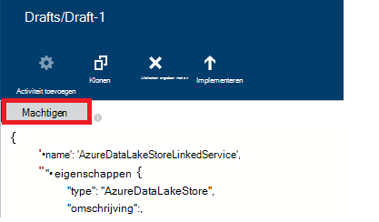

<properties
    pageTitle="Gegevens verplaatsen/Azure Lake gegevensarchief | Azure Data Factory"
    description="Meer informatie over het verplaatsen van gegevens uit Azure Lake gegevensarchief maken met Azure Data Factory"
    services="data-factory"
    documentationCenter=""
    authors="linda33wj"
    manager="jhubbard"
    editor="monicar"/>

<tags
    ms.service="data-factory"
    ms.workload="data-services"
    ms.tgt_pltfrm="na"
    ms.devlang="na"
    ms.topic="article"
    ms.date="09/27/2016"
    ms.author="jingwang"/>

# Gegevens verplaatsen en naar Azure Lake gegevensarchief maken met Azure Data Factory
In dit artikel wordt beschreven hoe u de activiteit kopiëren in een fabriek Azure gegevens kunt gebruiken om gegevens te verplaatsen van/naar Azure Lake gegevensarchief uit een ander gegevensarchief. Dit artikel is gebaseerd op het artikel [gegevensverplaatsing activiteiten](data-factory-data-movement-activities.md) , waarin de activiteit kopiëren en de combinaties van gegevens ondersteunde winkel een algemeen overzicht van de verplaatsing van gegevens biedt.

> [AZURE.NOTE]
> Een account Azure Lake gegevensarchief maken voordat u een pijpleiding met een activiteit kopiëren om gegevens te verplaatsen vanuit een winkel Azure gegevens Lake. Zie informatie over Azure Lake gegevensarchief, [aan de slag met Azure Lake gegevensarchief](../data-lake-store/data-lake-store-get-started-portal.md).
>  
> Bekijk het [maken van uw eerste pipeline-zelfstudie](data-factory-build-your-first-pipeline.md) voor gedetailleerde stappen om te maken van een data factory, gekoppelde services datasets en een pijpleiding. Gebruik de JSON-fragmenten met Data Factory Editor Visual Studio of Azure PowerShell of de Data Factory-entiteiten maken.

## Wizard gegevens kopiëren
De eenvoudigste manier om een pijpleiding die gegevens van Azure Lake gegevensarchief kopieert maken is de wizard kopiëren gebruiken. Zie [Zelfstudie: maken van een pijplijn met behulp van de Wizard kopiëren](data-factory-copy-data-wizard-tutorial.md) voor een snel overzicht over het maken van een pijplijn met behulp van de wizard kopiëren. 

De volgende voorbeelden geven monster JSON definities die u gebruiken kunt voor het maken van een pijplijn met [Azure portal](data-factory-copy-activity-tutorial-using-azure-portal.md) of [Visual Studio](data-factory-copy-activity-tutorial-using-visual-studio.md) of [Azure PowerShell](data-factory-copy-activity-tutorial-using-powershell.md). Ze laten zien hoe om gegevens te kopiëren en naar Azure Lake gegevensopslag en Azure Blob-opslag. Gegevens kunnen wel gekopieerde **rechtstreeks** vanuit een van de bronnen naar een van de PUT vermelde [hier](data-factory-data-movement-activities.md#supported-data-stores) met behulp van de activiteit van de kopie in Azure Data Factory.  

## Voorbeeld: Gegevens kopiëren vanuit Azure Blob Azure Lake gegevensarchief
In het volgende voorbeeld ziet:

1.  Een gekoppelde service van het type [AzureStorage](#azure-storage-linked-service-properties).
2.  Een gekoppelde service van het type [AzureDataLakeStore](#azure-data-lake-linked-service-properties).
3.  Een invoer [dataset](data-factory-create-datasets.md) van het type [AzureBlob](#azure-blob-dataset-type-properties).
4.  Een uitvoer [dataset](data-factory-create-datasets.md) van het type [AzureDataLakeStore](#azure-data-lake-dataset-type-properties).
4.  Een [pijpleiding](data-factory-create-pipelines.md) aan de activiteit van een kopie die gebruikmaakt van [BlobSource](#azure-blob-copy-activity-type-properties) en [AzureDataLakeStoreSink](#azure-data-lake-copy-activity-type-properties).

Het monster gekopieerd tijdreeks gegevens uit een Azure Blob-opslag met Azure Lake gegevensarchief elk uur. De JSON-eigenschappen in deze voorbeelden gebruikt worden in voorbeelden van de volgende secties beschreven.

**Azure gekoppeld Storage-service:**

    {
      "name": "StorageLinkedService",
      "properties": {
        "type": "AzureStorage",
        "typeProperties": {
          "connectionString": "DefaultEndpointsProtocol=https;AccountName=<accountname>;AccountKey=<accountkey>"
        }
      }
    }

**Azure gegevens Lake gekoppeld service:**

    {
        "name": "AzureDataLakeStoreLinkedService",
        "properties": {
            "type": "AzureDataLakeStore",
            "typeProperties": {
                "dataLakeStoreUri": "https://<accountname>.azuredatalakestore.net/webhdfs/v1",
                "sessionId": "<session ID>",
                "authorization": "<authorization URL>"
            }
        }
    }

### Azure gegevens Lake gekoppelde-Service maken met Data Factory-Editor
De volgende procedure bevat stappen voor het maken van een service Azure Lake gegevensarchief gekoppeld is met de Data Factory-Editor.

1. Klik op **nieuwe gegevens opslaan** op de werkbalk en selecteer **Azure Lake gegevensarchief**.
2. Voer de URI voor het meer gegevens in de JSON-editor voor de eigenschap **dataLakeStoreUri** .
3. Klik op de knop **machtigen** op de opdrachtbalk. U ziet een pop-upvenster.

    

4. Aanmelden met uw referenties en de eigenschap **vergunning** in de JSON moet worden toegewezen aan een waarde nu.
5. (optioneel) Geef waarden op voor optionele parameters zoals **accountnaam**, **subscriptionID**en **resourceGroupName** in de JSON of deze eigenschappen verwijderen uit de JSON.
6. Klik op **Deploy** op de opdrachtbalk aan de gekoppelde service implementeren.

> [AZURE.IMPORTANT] De autorisatiecode die u hebt gegenereerd met de knop **machtigen** verloopt later opnieuw. **Autoriseren** met behulp van de **machtigen** knop wanneer de **verificatietoken verloopt** en in dat geval de gekoppelde service. Zie de sectie [Azure Data Lake winkel gekoppelde Service](#azure-data-lake-store-linked-service-properties) voor meer informatie. 

**Azure Blob invoer dataset:**

Gegevens wordt opgehaald uit een nieuwe blob elk uur (frequentie: uur, interval: 1). Naam van het pad en de bestandsnaam voor de blob dynamisch geëvalueerd op basis van de begintijd van het segment dat wordt verwerkt. Het pad naar de map gebruikt, jaar, maand en dag deel uitmaken van de begintijd en bestandsnaam gebruikt de uur-deel van de begintijd. 'externe': 'true' instelling Data Factory service meldt dat de tabel de fabriek gegevens buiten en niet wordt geproduceerd door een activiteit in de fabriek van de gegevens.

    {
      "name": "AzureBlobInput",
      "properties": {
        "type": "AzureBlob",
        "linkedServiceName": "StorageLinkedService",
        "typeProperties": {
          "folderPath": "mycontainer/myfolder/yearno={Year}/monthno={Month}/dayno={Day}",
          "partitionedBy": [
            {
              "name": "Year",
              "value": {
                "type": "DateTime",
                "date": "SliceStart",
                "format": "yyyy"
              }
            },
            {
              "name": "Month",
              "value": {
                "type": "DateTime",
                "date": "SliceStart",
                "format": "MM"
              }
            },
            {
              "name": "Day",
              "value": {
                "type": "DateTime",
                "date": "SliceStart",
                "format": "dd"
              }
            },
            {
              "name": "Hour",
              "value": {
                "type": "DateTime",
                "date": "SliceStart",
                "format": "HH"
              }
            }
          ]
        },
        "external": true,
        "availability": {
          "frequency": "Hour",
          "interval": 1
        },
        "policy": {
          "externalData": {
            "retryInterval": "00:01:00",
            "retryTimeout": "00:10:00",
            "maximumRetry": 3
          }
        }
      }
    }

**Azure gegevens Lake uitvoer dataset:**

In het voorbeeld worden de gegevens gekopieerd naar een winkel Azure gegevens Lake. Nieuwe gegevens wordt de kopie van de gegevens meer opslaan om het uur.

    {
        "name": "AzureDataLakeStoreOutput",
        "properties": {
            "type": "AzureDataLakeStore",
            "linkedServiceName": "AzureDataLakeStoreLinkedService",
            "typeProperties": {
                "folderPath": "datalake/output/"
            },
            "availability": {
                "frequency": "Hour",
                "interval": 1
            }
        }
    }

**Pijplijn met een activiteit kopiëren:**

De pijplijn bevat een kopie activiteit die is geconfigureerd voor het gebruik van de invoer en uitvoer datasets en elk uur is gepland. **Het type** is ingesteld op **BlobSource** in de pijplijn JSON definitie en **sink** -type is ingesteld op **AzureDataLakeStoreSink**.

    {  
        "name":"SamplePipeline",
        "properties":
        {  
            "start":"2014-06-01T18:00:00",
            "end":"2014-06-01T19:00:00",
            "description":"pipeline with copy activity",
            "activities":
            [  
                {
                    "name": "AzureBlobtoDataLake",
                    "description": "Copy Activity",
                    "type": "Copy",
                    "inputs": [
                    {
                        "name": "AzureBlobInput"
                    }
                    ],
                    "outputs": [
                    {
                        "name": "AzureDataLakeStoreOutput"
                    }
                    ],
                    "typeProperties": {
                        "source": {
                            "type": "BlobSource",
                            "treatEmptyAsNull": true,
                            "blobColumnSeparators": ","
                        },
                        "sink": {
                            "type": "AzureDataLakeStoreSink"
                        }
                    },
                    "scheduler": {
                        "frequency": "Hour",
                        "interval": 1
                    },
                    "policy": {
                        "concurrency": 1,
                        "executionPriorityOrder": "OldestFirst",
                        "retry": 0,
                        "timeout": "01:00:00"
                    }
                }
            ]
        }
    }

## Voorbeeld: Gegevens kopiëren vanuit Azure Lake gegevensarchief Azure Blob
In het volgende voorbeeld ziet:

1.  Een gekoppelde service van het type [AzureDataLakeStore](#azure-data-lake-linked-service-properties).
2.  Een gekoppelde service van het type [AzureStorage](#azure-storage-linked-service-properties).
3.  Een invoer [dataset](data-factory-create-datasets.md) van het type [AzureDataLakeStore](#azure-data-lake-dataset-type-properties).
4.  Een uitvoer [dataset](data-factory-create-datasets.md) van het type [AzureBlob](#azure-blob-dataset-type-properties).
5.  Een [pijpleiding](data-factory-create-pipelines.md) aan de activiteit van een kopie die gebruikmaakt van [AzureDataLakeStoreSource](#azure-data-lake-copy-activity-type-properties) en [BlobSink](#azure-blob-copy-activity-type-properties)

Het monster opgehaald tijdreeks gegevens uit een winkel Azure gegevens Lake op een Azure blob elk uur. De JSON-eigenschappen in deze voorbeelden gebruikt worden in voorbeelden van de volgende secties beschreven.

**Azure Lake gegevensarchief gekoppeld service:**

    {
        "name": "AzureDataLakeStoreLinkedService",
        "properties": {
            "type": "AzureDataLakeStore",
            "typeProperties": {
                "dataLakeStoreUri": "https://<accountname>.azuredatalakestore.net/webhdfs/v1",
                "sessionId": "<session ID>",
                "authorization": "<authorization URL>"
            }
        }
    }

> [AZURE.NOTE] Zie de stappen in het vorige voorbeeld URL vergunning verkrijgen.  

**Azure gekoppeld Storage-service:**

    {
      "name": "StorageLinkedService",
      "properties": {
        "type": "AzureStorage",
        "typeProperties": {
          "connectionString": "DefaultEndpointsProtocol=https;AccountName=<accountname>;AccountKey=<accountkey>"
        }
      }
    }

**Azure gegevens Lake dataset ingevoerd:**

Het instellen van **'externe': true** de Data Factory service meldt dat de tabel de fabriek gegevens buiten en niet wordt geproduceerd door een activiteit in de fabriek van gegevens.

    {
        "name": "AzureDataLakeStoreInput",
        "properties":
        {
            "type": "AzureDataLakeStore",
            "linkedServiceName": "AzureDataLakeStoreLinkedService",
            "typeProperties": {
                "folderPath": "datalake/input/",
                "fileName": "SearchLog.tsv",
                "format": {
                    "type": "TextFormat",
                    "rowDelimiter": "\n",
                    "columnDelimiter": "\t"
                }
            },
            "external": true,
            "availability": {
                "frequency": "Hour",
                "interval": 1
            },
            "policy": {
                "externalData": {
                    "retryInterval": "00:01:00",
                    "retryTimeout": "00:10:00",
                    "maximumRetry": 3
                }
            }
        }
    }

**Azure Blob uitvoer dataset:**

Gegevens worden weggeschreven naar een nieuwe blob elk uur (frequentie: uur, interval: 1). Het pad naar de blob wordt dynamisch geëvalueerd op basis van de begintijd van het segment dat wordt verwerkt. Het pad naar de map wordt gebruikt voor jaar, maand, dag en uur delen van de begintijd.

    {
      "name": "AzureBlobOutput",
      "properties": {
        "type": "AzureBlob",
        "linkedServiceName": "StorageLinkedService",
        "typeProperties": {
          "folderPath": "mycontainer/myfolder/yearno={Year}/monthno={Month}/dayno={Day}/hourno={Hour}",
          "partitionedBy": [
            {
              "name": "Year",
              "value": {
                "type": "DateTime",
                "date": "SliceStart",
                "format": "yyyy"
              }
            },
            {
              "name": "Month",
              "value": {
                "type": "DateTime",
                "date": "SliceStart",
                "format": "MM"
              }
            },
            {
              "name": "Day",
              "value": {
                "type": "DateTime",
                "date": "SliceStart",
                "format": "dd"
              }
            },
            {
              "name": "Hour",
              "value": {
                "type": "DateTime",
                "date": "SliceStart",
                "format": "HH"
              }
            }
          ],
          "format": {
            "type": "TextFormat",
            "columnDelimiter": "\t",
            "rowDelimiter": "\n"
          }
        },
        "availability": {
          "frequency": "Hour",
          "interval": 1
        }
      }
    }

**Pipeline-activiteit van de kopie:**

De pijplijn bevat een kopie activiteit die is geconfigureerd voor het gebruik van de invoer en uitvoer datasets en elk uur is gepland. **Het type** is ingesteld op **AzureDataLakeStoreSource** in de pijplijn JSON definitie en **sink** -type is ingesteld op **BlobSink**.

    {  
        "name":"SamplePipeline",
        "properties":{  
            "start":"2014-06-01T18:00:00",
            "end":"2014-06-01T19:00:00",
            "description":"pipeline for copy activity",
            "activities":[  
                {
                    "name": "AzureDakeLaketoBlob",
                    "description": "copy activity",
                    "type": "Copy",
                    "inputs": [
                      {
                        "name": "AzureDataLakeStoreInput"
                      }
                    ],
                    "outputs": [
                      {
                        "name": "AzureBlobOutput"
                      }
                    ],
                    "typeProperties": {
                        "source": {
                            "type": "AzureDataLakeStoreSource",
                        },
                        "sink": {
                            "type": "BlobSink"
                        }
                    },
                    "scheduler": {
                        "frequency": "Hour",
                        "interval": 1
                    },
                    "policy": {
                        "concurrency": 1,
                        "executionPriorityOrder": "OldestFirst",
                        "retry": 0,
                        "timeout": "01:00:00"
                    }
                }
             ]
        }
    }

## Azure gegevens Lake winkel gekoppelde Service-eigenschappen

U kunt een Azure opslag account koppelen aan een Azure data factory met behulp van een service gekoppeld Azure-opslag. De volgende tabel bevat een beschrijving van JSON-elementen die specifiek zijn voor gekoppelde Azure-Storage-service.

| Eigenschap | Beschrijving | Vereist |
| :-------- | :----------- | :-------- |
| type | De eigenschap type moet worden ingesteld op: **AzureDataLakeStore** | Ja |
| dataLakeStoreUri | Geef informatie over de account Azure Lake gegevensarchief. Het is in de volgende indeling: https://<Azure Data Lake account name>.azuredatalakestore.net/webhdfs/v1 | Ja |
| autorisatie | Klik op de knop **machtigen** in de **Data Factory-Editor** en voer uw referenties die de vergunning automatisch gegenereerde URL aan deze eigenschap toewijst.  | Ja |
| sessie-id | OAuth sessie-id van de sessie oauth vergunning. Elke sessie-id is uniek en kan slechts eenmaal worden gebruikt. Deze instelling wordt automatisch gegenereerd wanneer u Data Factory-Editor. | Ja |  
| Accountnaam | De naam van meer gegevens | Nee |
| subscriptionId | Azure abonnement-id. | Nee (indien niet opgegeven, abonnement van de fabriek van gegevens wordt gebruikt). |
| resourceGroupName |  Naam Azure resourcegroep | Nee (indien niet opgegeven, de resourcegroep van de fabriek van gegevens wordt gebruikt). |

## Verlopen van token 
De autorisatiecode genereren met behulp van de knop **machtigen** verloopt later opnieuw. Zie de volgende tabel voor de verlooptermijn voor verschillende typen gebruikersaccounts. Ziet u het volgende foutbericht verschijnt terwijl het verificatie- **verificatietoken verloopt**: ' fout bewerking van referenties: invalid_grant - AADSTS70002: fout bij het valideren van de referenties. AADSTS70008: De opgegeven access-subsidie is verlopen of ingetrokken. Trace-ID: d18629e8-af88-43c5-88e3-d8419eb1fca1 correlatie-ID: tijdstempel fac30a0c-6be6-4e02-8d69-a776d2ffefd7: 2015-12-15 21-09-31Z ".

| Gebruikerstype | Verloopt na |
| :-------- | :----------- | 
| Gebruikersaccounts die niet worden beheerd door Active Directory Azure (@hotmail.com, @live.com, enz.). | 12 uur |
| Gebruikersaccounts beheerd door Azure Active Directory (AAD) | 14 dagen na het laatste segment wordt uitgevoerd.   90 dagen, als een segment op basis van de gekoppelde service OAuth gebaseerde ten minste eenmaal per 14 dagen wordt uitgevoerd. |

Als u uw wachtwoord voordat deze token verlooptijd wijzigen, de verificatietoken verloopt onmiddellijk en ziet u de fout vermeld in deze sectie. 

Om deze fout te voorkomen/oplossen, autoriseren met behulp van de **machtigen** knop wanneer de **verificatietoken verloopt** en in dat geval de gekoppelde service. U kunt ook waarden voor eigenschappen van **sessie-id** en **autorisatie** via programmacode in het volgende gedeelte met code genereren:

### Programmatisch sessie-id en -autorisatie om waarden te genereren 

    if (linkedService.Properties.TypeProperties is AzureDataLakeStoreLinkedService ||
        linkedService.Properties.TypeProperties is AzureDataLakeAnalyticsLinkedService)
    {
        AuthorizationSessionGetResponse authorizationSession = this.Client.OAuth.Get(this.ResourceGroupName, this.DataFactoryName, linkedService.Properties.Type);

        WindowsFormsWebAuthenticationDialog authenticationDialog = new WindowsFormsWebAuthenticationDialog(null);
        string authorization = authenticationDialog.AuthenticateAAD(authorizationSession.AuthorizationSession.Endpoint, new Uri("urn:ietf:wg:oauth:2.0:oob"));

        AzureDataLakeStoreLinkedService azureDataLakeStoreProperties = linkedService.Properties.TypeProperties as AzureDataLakeStoreLinkedService;
        if (azureDataLakeStoreProperties != null)
        {
            azureDataLakeStoreProperties.SessionId = authorizationSession.AuthorizationSession.SessionId;
            azureDataLakeStoreProperties.Authorization = authorization;
        }

        AzureDataLakeAnalyticsLinkedService azureDataLakeAnalyticsProperties = linkedService.Properties.TypeProperties as AzureDataLakeAnalyticsLinkedService;
        if (azureDataLakeAnalyticsProperties != null)
        {
            azureDataLakeAnalyticsProperties.SessionId = authorizationSession.AuthorizationSession.SessionId;
            azureDataLakeAnalyticsProperties.Authorization = authorization;
        }
    }

Zie de [Klasse AzureDataLakeStoreLinkedService](https://msdn.microsoft.com/library/microsoft.azure.management.datafactories.models.azuredatalakestorelinkedservice.aspx), [AzureDataLakeAnalyticsLinkedService klasse](https://msdn.microsoft.com/library/microsoft.azure.management.datafactories.models.azuredatalakeanalyticslinkedservice.aspx)en [De klasse AuthorizationSessionGetResponse](https://msdn.microsoft.com/library/microsoft.azure.management.datafactories.models.authorizationsessiongetresponse.aspx) onderwerpen voor meer informatie over de Data Factory klassen gebruikt in de code. Voeg een verwijzing naar versie **2.9.10826.1824** van **Microsoft.IdentityModel.Clients.ActiveDirectory.WindowsForms.dll** voor de WindowsFormsWebAuthenticationDialog-klasse die wordt gebruikt in de code. 
 

## Azure gegevens Lake Dataset-eigenschappen

Zie het artikel [gegevenssets maken](data-factory-create-datasets.md) voor een volledige lijst van JSON secties & eigenschappen die beschikbaar zijn voor het definiëren van datasets. Secties zoals structuur, beschikbaarheid en het beleid van een dataset JSON zijn vergelijkbaar voor alle typen van dataset (Azure SQL Azure blob, Azure tabel, enz.).

De sectie **typeProperties** verschilt voor elk type dataset en vindt u informatie over de locatie, opmaken, enz., van de gegevens in het gegevensarchief. De sectie typeProperties voor dataset van het type dataset **AzureDataLakeStore** heeft de volgende eigenschappen:

| Eigenschap | Beschrijving | Vereist |
| :-------- | :----------- | :-------- |
| folderPath | Pad naar de container en de map in het Azure gegevens meer opslaan. | Ja |
| Bestandsnaam | De naam van het bestand in het archief Azure gegevens Lake. Bestandsnaam is optioneel en is hoofdlettergevoelig.   Als u een bestandsnaam opgeeft, wordt de activiteit (inclusief kopie) werkt op het specifieke bestand.  Als geen bestandsnaam is opgegeven, bevat kopie alle bestanden in het mappad voor invoer dataset.  Als de bestandsnaam is niet opgegeven voor een dataset uitvoer, de naam van het gegenereerde bestand in de volgende zou zijn deze indeling: gegevens. <Guid>.txt (bijvoorbeeld:: Data.0a405f8a-93ff-4c6f-b3be-f69616f1df7a.txt | Nee |
| partitionedBy | partitionedBy is een optionele eigenschap. U kunt het opgeven van een dynamische mappad en de bestandsnaam voor de reeks tijdgegevens. FolderPath kan bijvoorbeeld zijn ingesteld voor elk uur van de gegevens. Zie de sectie [werken met partitionedBy-eigenschap](#using-partitionedby-property) voor meer informatie en voorbeelden. | Nee |
| indeling | De volgende notatietypen worden ondersteund: **tekstopmaak**, **AvroFormat**, **JsonFormat**, **OrcFormat**, **ParquetFormat**. Stel de eigenschap **type** onder notatie op een van deze waarden. Zie [Tekstopmaak opgeven](#specifying-textformat), [AvroFormat geven](#specifying-avroformat) [JsonFormat geven](#specifying-jsonformat), [Geven OrcFormat](#specifying-orcformat)en [ParquetFormat geven](#specifying-parquetformat) secties voor meer informatie. Als u bestanden wilt kopiëren als-is tussen bestand gebaseerde winkels (binaire kopie), kunt u de opmaaksectie in beide definities van de invoer en uitvoer dataset overslaan.| Nee
| compressie | Geef het type en de mate van compressie van de gegevens. Ondersteunde typen zijn: **GZip**, **Deflate**, en **BZip2** en ondersteunde niveaus zijn: **optimale** en **snelst**. De compressie-instellingen worden momenteel niet ondersteund voor gegevens in **AvroFormat** of **OrcFormat**. Voor meer informatie, Zie de sectie [compressie-ondersteuning](#compression-support) .  | Nee |

### PartitionedBy, eigenschap
U kunt een dynamische mappad en de bestandsnaam voor de reeks tijdgegevens opgeven met de sectie **partitionedBy** , Data Factory macro's en de systeemvariabelen: SliceStart en SliceEnd, die duiden op een begin- en eindtijden voor een bepaald segment.

Zie [Gegevenssets maken](data-factory-create-datasets.md) en de [planning en uitvoering](data-factory-scheduling-and-execution.md) van artikelen te begrijpen meer informatie over time series datasets, planning en segmenten.

#### Voorbeeld 1

    "folderPath": "wikidatagateway/wikisampledataout/{Slice}",
    "partitionedBy":
    [
        { "name": "Slice", "value": { "type": "DateTime", "date": "SliceStart", "format": "yyyyMMddHH" } },
    ],

In dit voorbeeld {segment} wordt vervangen door de waarde van Data Factory systeemvariabele SliceStart in de notatie (YYYYMMDDHH). De SliceStart verwijst naar de begintijd van het segment. Het mappad verschilt voor elk segment. Bijvoorbeeld: wikisampledataout-wikidatagateway/2014100103 of wikisampledataout-wikidatagateway/2014100104

#### Voorbeeld 2

    "folderPath": "wikidatagateway/wikisampledataout/{Year}/{Month}/{Day}",
    "fileName": "{Hour}.csv",
    "partitionedBy":
     [
        { "name": "Year", "value": { "type": "DateTime", "date": "SliceStart", "format": "yyyy" } },
        { "name": "Month", "value": { "type": "DateTime", "date": "SliceStart", "format": "MM" } },
        { "name": "Day", "value": { "type": "DateTime", "date": "SliceStart", "format": "dd" } },
        { "name": "Hour", "value": { "type": "DateTime", "date": "SliceStart", "format": "hh" } }
    ],

Jaar, maand, dag en tijd van de SliceStart in dit voorbeeld worden uitgepakt naar afzonderlijke variabelen die worden gebruikt door de eigenschappen van het mappad en de bestandsnaam.

[AZURE.INCLUDE [data-factory-file-format](../../includes/data-factory-file-format.md)]
 

### Compressieondersteuning  
Verwerken van grote gegevenssets veroorzaken I/O en netwerk knelpunten. Daarom kunnen gecomprimeerde gegevens in winkels niet alleen snellere overdracht van gegevens via het netwerk en schijfruimte besparen, maar ook brengen aanzienlijke prestatieverbeteringen in grote gegevens verwerken. Compressie wordt momenteel ondersteund voor winkels zoals Azure Blob of On-premises bestandssysteem gegevens op basis van een bestand.  

Compressie voor een dataset gebruikt u de eigenschap **compressie** in de dataset JSON zoals in het volgende voorbeeld:   

    {  
        "name": "AzureDatalakeStoreDataSet",  
        "properties": {  
            "availability": {  
                "frequency": "Day",  
                "interval": 1  
            },  
            "type": "AzureDatalakeStore",  
            "linkedServiceName": "DataLakeStoreLinkedService",  
            "typeProperties": {  
                "fileName": "pagecounts.csv.gz",  
                "folderPath": "compression/file/",  
                "compression": {  
                    "type": "GZip",  
                    "level": "Optimal"  
                }  
            }  
        }  
    }  
 
Het gedeelte **compressie** heeft twee eigenschappen:  
  
- **Type:** de compressiecodec **GZIP**, **Deflate** of **BZIP2**.  
- **Niveau:** de compressieratio die **optimale** of **snelst**kan zijn. 
    - **Snelste:** De bewerking compressie Voltooi zo spoedig mogelijk, zelfs als het bestand niet optimaal is gecomprimeerd. 
    - **Optimale**: de compressie-bewerking moet worden optimaal gecomprimeerd, zelfs als de bewerking een langere tijd in beslag neemt. 
    
    Zie [Compressieniveau](https://msdn.microsoft.com/library/system.io.compression.compressionlevel.aspx) onderwerp voor meer informatie. 

Stel dat de dataset monster wordt gebruikt als de uitvoer van de activiteit van een kopie. De activiteit kopiëren de uitvoergegevens worden gecomprimeerd met GZIP-codec met optimale verhouding en schrijft u gecomprimeerde gegevens in een bestand met de naam pagecounts.csv.gz in de winkel Azure gegevens Lake.   

Wanneer u eigenschap compressie in een input-dataset JSON opgeven, leest de pijpleiding gecomprimeerde gegevens van de bron. Wanneer u de eigenschap in een dataset uitvoer JSON opgeeft, kan de activiteit kopie gecomprimeerde gegevens schrijven naar de bestemming. Hier volgen enkele voorbeelden van scenario's: 

- Gegevens uit een Azure Lake gegevensarchief lezen GZIP gecomprimeerd decomprimeren en resultaatgegevens schrijven naar Azure SQL-database. Definieert u in dit geval de invoer dataset Azure Lake gegevensopslag met de eigenschap JSON-compressie. 
- Gegevens lezen uit een bestand met tekst zonder opmaak van het bestandssysteem voor de lokalen en de gecomprimeerde gegevens schrijven naar een Azure-gegevensarchief Lake comprimeren met GZip-indeling. Definieert u in dit geval een dataset uitvoer Azure gegevens Lake met de eigenschap JSON-compressie.  
- Een gecomprimeerd GZIP gegevens uit een Azure-gegevensarchief Lake, decomprimeren, gecomprimeerd met BZIP2, resultaatgegevens lezen en schrijven met een Azure-gegevensarchief Lake. U compressie type set ingesteld als GZIP en BZIP2 voor invoer en uitvoer datasets respectievelijk.   

## Eigenschappen van Azure gegevens Lake kopie activiteit  
Zie het artikel [Pijpleidingen maken](data-factory-create-pipelines.md) voor een volledige lijst van de secties en eigenschappen die beschikbaar zijn voor het definiëren van activiteiten. Eigenschappen van de naam, beschrijving, input en output-tabellen en -beleid zijn beschikbaar voor alle typen activiteiten.

Eigenschappen die beschikbaar zijn in de sectie typeProperties van de activiteit variëren aan de andere kant met elk activiteitstype. Voor de activiteit kopiëren afhankelijk van de typen bronnen en putten

**AzureDataLakeStoreSource** ondersteunt de volgende sectie van eigenschappen **typeProperties** :

| Eigenschap | Beschrijving | Toegestane waarden | Vereist |
| -------- | ----------- | -------------- | -------- |
| recursieve | Geeft aan of de gegevens worden gelezen recursief uit de submappen of alleen uit de opgegeven map. | True (standaardwaarde), False | Nee |

**AzureDataLakeStoreSink** ondersteunt de volgende sectie van eigenschappen **typeProperties** :

| Eigenschap | Beschrijving | Toegestane waarden | Vereist |
| -------- | ----------- | -------------- | -------- |
| copyBehavior | Hiermee geeft u het gedrag kopiëren. | **PreserveHierarchy:** de bestandshiërarchie in de doelmap blijven behouden. Het relatieve pad van het bronbestand naar bronmap is identiek aan het relatieve pad van het bestand naar de doelmap.  **FlattenHierarchy:** alle bestanden uit de bronmap worden gemaakt in het eerste niveau van de doelmap. De doelbestanden worden gemaakt met de naam automatisch gegenereerd.  **MergeFiles:** alle bestanden uit de bronmap in één bestand worden samengevoegd. Als de naam van het bestand/Blob is opgegeven, is de naam van het samengevoegde de opgegeven naam; anders zou worden automatisch gegenereerde bestandsnaam. | Nee |

[AZURE.INCLUDE [data-factory-structure-for-rectangualr-datasets](../../includes/data-factory-structure-for-rectangualr-datasets.md)]

[AZURE.INCLUDE [data-factory-type-conversion-sample](../../includes/data-factory-type-conversion-sample.md)]

[AZURE.INCLUDE [data-factory-column-mapping](../../includes/data-factory-column-mapping.md)]

## Prestatie en afstemming  
Zie de [uitvoering van de activiteit & Tuning Guide](data-factory-copy-activity-performance.md) voor meer informatie over de belangrijkste factoren die prestaties gevolgen van verplaatsing van gegevens (kopiëren activiteit) in Azure Data Factory en verschillende manieren optimaliseren.
