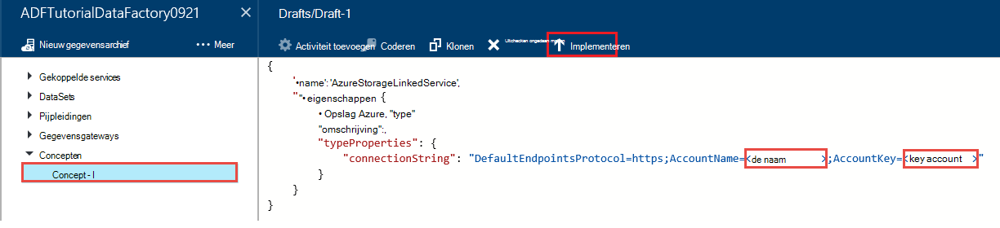
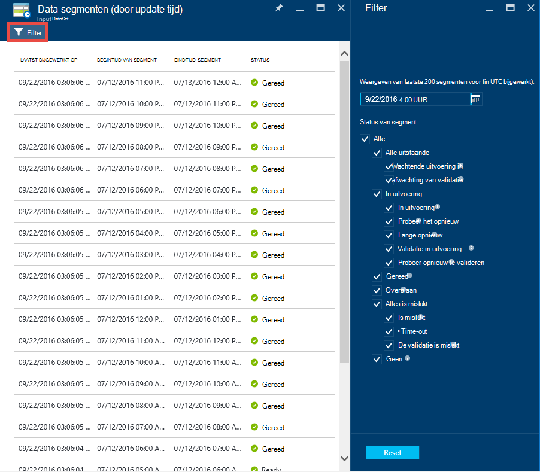

<properties 
    pageTitle="Zelfstudie: Een pijpleiding met kopie activiteit met Azure portal maken | Microsoft Azure" 
    description="In deze zelfstudie maakt u een pijpleiding Azure Data Factory met een activiteit kopiëren met behulp van de Editor Data Factory in Azure portal." 
    services="data-factory" 
    documentationCenter="" 
    authors="spelluru" 
    manager="jhubbard" 
    editor="monicar"/>

<tags 
    ms.service="data-factory" 
    ms.workload="data-services" 
    ms.tgt_pltfrm="na" 
    ms.devlang="na" 
    ms.topic="get-started-article" 
    ms.date="09/16/2016" 
    ms.author="spelluru"/>

# Zelfstudie: Een pijpleiding met kopie activiteit met Azure portal maken
> [AZURE.SELECTOR]
- [Overzicht en vereisten](data-factory-copy-data-from-azure-blob-storage-to-sql-database.md)
- [Wizard kopiëren](data-factory-copy-data-wizard-tutorial.md)
- [Azure portal](data-factory-copy-activity-tutorial-using-azure-portal.md)
- [Visual Studio](data-factory-copy-activity-tutorial-using-visual-studio.md)
- [PowerShell](data-factory-copy-activity-tutorial-using-powershell.md)
- [Sjabloon voor Azure Resource Manager](data-factory-copy-activity-tutorial-using-azure-resource-manager-template.md)
- [REST-API](data-factory-copy-activity-tutorial-using-rest-api.md)
- [.NET API](data-factory-copy-activity-tutorial-using-dotnet-api.md)

In deze zelfstudie wordt beschreven hoe u maken en controleren van de fabriek van een Azure gegevens met behulp van de portal Azure. Een activiteit kopiëren de pijpleiding die in de fabriek gegevens gebruikt om gegevens te kopiëren van Azure Blob-opslag met Azure SQL-Database.

Hier zijn de stappen die u als onderdeel van deze zelfstudie uitvoeren:

Stap | Beschrijving
-----| -----------
[Maak een Azure Data Factory](#create-data-factory) | In deze stap maakt u een Azure data factory met de naam **ADFTutorialDataFactory**.  
[Gekoppelde services maken](#create-linked-services) | In deze stap maakt u twee gekoppelde services: **AzureStorageLinkedService** en **AzureSqlLinkedService**.   De AzureStorageLinkedService koppelt de Azure opslag en AzureSqlLinkedService het Azure SQL-database koppelt aan de ADFTutorialDataFactory. De ingevoerde gegevens worden voor de pijpleiding bevindt zich in een blob-container in de Azure blob-opslag- en -gegevens opgeslagen in een tabel in de Azure SQL-database. Daarom toevoegen u deze twee winkels als gekoppelde services gegevens fabriek.      
[Maken van input en output datasets](#create-datasets) | In de vorige stap kunt u gekoppelde services die verwijzen naar de opgeslagen gegevens met i/o-gegevens gemaakt. In deze stap definieert u twee datasets-- **InputDataset** en **OutputDataset** --die de i/o-gegevens die zijn opgeslagen in opgeslagen gegevens vertegenwoordigen.   Voor de InputDataset, u de container blob met een blob met de brongegevens en de OutputDataset opgeven, geeft u de SQL-tabel waarin de uitvoergegevens. U ook opgeven andere eigenschappen zoals structuur, beschikbaarheid en beleid. 
[Maak een pijpleiding](#create-pipeline) | In deze stap maakt u een pijpleiding met de naam **ADFTutorialPipeline** in de ADFTutorialDataFactory.   U toevoegt een **kopie activiteit** aan de pijpleiding input gegevens vanaf de Azure BLOB aan de uitvoer Azure SQL-tabel. De activiteit kopie uitvoert verplaatsing van gegevens in Azure Data Factory. Het wordt aangedreven door een wereldwijd beschikbare service waarmee gegevens tussen verschillende opgeslagen gegevens op een veilige, schaalbare en betrouwbare manier kunt kopiëren. Zie [Gegevensverplaatsing activiteiten](data-factory-data-movement-activities.md) -artikel voor meer informatie over de activiteit van de kopie. 
[Monitor-pipeline](#monitor-pipeline) | In deze stap kunt u segmenten van invoer en uitvoer van tabellen met Azure portal controleren.

## Vereisten 
Volledige voorwaarden vermeld in het [Overzicht zelfstudie](data-factory-copy-data-from-azure-blob-storage-to-sql-database.md) artikel voordat u deze zelfstudie.

## Data factory maken
In deze stap kunt u de portal Azure een Azure data factory met de naam **ADFTutorialDataFactory**gemaakt.

1.  Na het aanmelden op de [portal Azure](https://portal.azure.com/), klikt u op **Nieuw**en selecteer **Intelligence + Analytics** **Data Factory**klikt u op. 

      

6. In de **nieuwe data factory** blade:
    1. **ADFTutorialDataFactory** voor de **naam**invoeren. 
    
        

        De naam van de fabriek Azure gegevens moet **uniek**zijn. Als het volgende foutbericht wordt weergegeven, wijzigt u de naam van de fabriek van gegevens (bijvoorbeeld yournameADFTutorialDataFactory) en probeer opnieuw te maken. Zie [Data Factory - regels voor naamgeving van](data-factory-naming-rules.md) onderwerp voor naamgevingsregels voor Data Factory artefacten.
    
            Data factory name “ADFTutorialDataFactory” is not available  
     
        
    2. Selecteer uw Azure **abonnement**.
    3. Voer een van de volgende stappen uit voor de resourcegroep:
        1. Selecteer **bestaande gebruiken**en selecteert u een bestaande resourcegroep in de vervolgkeuzelijst. 
        2. Selecteer **Nieuw**en voer de naam van een groep.   
    
            Enkele van de stappen in deze zelfstudie wordt ervan uitgegaan dat u de naam: **ADFTutorialResourceGroup** voor de resourcegroep. Zie meer informatie over resourcegroepen, [resourcegroepen gebruiken voor het beheren van uw resources Azure](../azure-resource-manager/resource-group-overview.md).  
    4. Selecteer de **locatie** voor de fabriek van gegevens. Regio's ondersteund door de service Data Factory worden weergegeven in de vervolgkeuzelijst.
    5. **Pin om Startboard te**selecteren.     
    6. Klik op **maken**.

        > [AZURE.IMPORTANT] Data Factory om instanties te maken, moet u lid zijn van de rol van [Inzender fabriek](../active-directory/role-based-access-built-in-roles.md/#data-factory-contributor) op groepsniveau abonnement of een resource.
        >  
        >  De naam van de fabriek gegevens kan worden geregistreerd als een DNS-naam in de toekomst en dus zichtbaar onlinebronnen.              
9.  Klik op de bell-pictogram op de werkbalk overzicht van de status en/of meldingen. 

     
10. Nadat het is gemaakt, ziet u de **Data Factory** blade zoals in de afbeelding.

    

## Gekoppelde services maken
Gekoppelde services opgeslagen gegevens koppelen of diensten aan een fabriek Azure gegevens berekenen. Zie [ondersteunde gegevens worden opgeslagen](data-factory-data-movement-activities.md##supported-data-stores-and-formats) voor de bronnen en putten die worden ondersteund door de activiteit van de kopie. Zie voor de lijst met compute-services worden ondersteund door Data Factory [berekenen gekoppelde services](data-factory-compute-linked-services.md) . In deze zelfstudie, u niet elke compute-service gebruikt. 

In deze stap maakt u twee gekoppelde services: **AzureStorageLinkedService** en **AzureSqlLinkedService**. AzureStorageLinkedService service koppelingen een Azure opslag Account gekoppeld en AzureSqlLinkedService een Azure SQL-database koppelt aan de **ADFTutorialDataFactory**. U maakt een pijpleiding verderop in deze zelfstudie waarmee gegevens uit een container blob in AzureStorageLinkedService gekopieerd naar een SQL-tabel in AzureSqlLinkedService.

### Een gekoppelde service voor de opslag van Azure-account maken
1.  Klik op in het blad **Data Factory** **auteur en implementeren van** naast elkaar voor het starten van de **Editor** voor de fabriek van gegevens.

     
5. In de **Editor**, klikt u op **nieuwe gegevens opslaan** op de werkbalk en **Azure opslag** selecteren in de vervolgkeuzelijst. U ziet de JSON-sjabloon voor het maken van een opslagservice Azure gekoppeld in het rechterdeelvenster. 

        
6. Vervangen `<accountname>` en `<accountkey>` met de accountnaam en de account sleutelwaarden voor uw account Azure opslag. 

     
6. Klik op **Deploy** op de werkbalk. U ziet nu de geïmplementeerde **AzureStorageLinkedService** in de structuurweergave. 

    

> [AZURE.NOTE]
> Zie [gegevens van/naar Azure Blob verplaatsen](data-factory-azure-blob-connector.md#azure-storage-linked-service) voor meer informatie over eigenschappen van JSON.

### Een gekoppelde service voor de Azure SQL-Database maken
1. In de **Data Factory-Editor**, klikt u op **nieuwe gegevens opslaan** op de werkbalk en **Azure SQL-Database** selecteert in de vervolgkeuzelijst. U ziet de JSON-sjabloon voor het maken van de service gekoppelde Azure SQL in het rechterdeelvenster.
2. Vervangen `<servername>`, `<databasename>`, `<username>@<servername>`, en `<password>` met de namen van uw Azure SQL server, database-gebruikersaccount en wachtwoord. 
3. Klik op **Deploy** op de werkbalk maken en implementeren van de **AzureSqlLinkedService**.
4. Bevestig dat u **AzureSqlLinkedService** in de structuurweergave zien. 

> [AZURE.NOTE]
> Zie [gegevens van/naar Azure SQL-Database verplaatsen](data-factory-azure-sql-connector.md#azure-sql-linked-service-properties) voor meer informatie over eigenschappen van JSON.

## Gegevenssets maken
In de vorige stap u gekoppelde services, **AzureStorageLinkedService** en **AzureSqlLinkedService** een Azure opslag account en Azure SQL-database koppelen aan de fabriek van de gegevens gemaakt: **ADFTutorialDataFactory**. In deze stap definieert u twee datasets-- **InputDataset** en **OutputDataset** --die de i/o-gegevens die zijn opgeslagen in respectievelijk AzureStorageLinkedService en AzureSqlLinkedService genoemde opgeslagen gegevens vertegenwoordigen. InputDataset, u de container blob met een blob met de brongegevens en het OutputDataset opgeven, geeft u de SQL-tabel waarin de uitvoergegevens. 

### Invoer gegevensset maken 
In deze stap maakt u een dataset met de naam **InputDataset** die naar een blob-container in de Azure opslag die wordt vertegenwoordigd door de service **AzureStorageLinkedService** gekoppeld wijst.

1. Klik in de **Editor** voor de Data Factory, **... Meer**en klik op **nieuwe dataset**, klik op **Azure Blob-opslag** in de vervolgkeuzelijst. 

    
2. Vervangen door JSON in het rechterdeelvenster het volgende JSON-fragment: 

        {
          "name": "InputDataset",
          "properties": {
            "structure": [
              {
                "name": "FirstName",
                "type": "String"
              },
              {
                "name": "LastName",
                "type": "String"
              }
            ],
            "type": "AzureBlob",
            "linkedServiceName": "AzureStorageLinkedService",
            "typeProperties": {
              "folderPath": "adftutorial/",
              "fileName": "emp.txt",
              "format": {
                "type": "TextFormat",
                "columnDelimiter": ","
              }
            },
            "external": true,
            "availability": {
              "frequency": "Hour",
              "interval": 1
            }
          }
        }
        
     Houd rekening met de volgende punten: 
    
    - DataSet- **type** is ingesteld op **AzureBlob**.
    - **linkedServiceName** is ingesteld op **AzureStorageLinkedService**. U kunt deze service gekoppelde gemaakt in stap 2.
    - **mappad** is ingesteld op de container **adftutorial** . Ook kunt u de naam van een blob in de map met behulp van de eigenschap **fileName** . Nadat u de naam van de blob niet opgeeft, worden gegevens van alle BLOB's in de container wordt beschouwd als een ingevoerde gegevens.  
    - notatie **type** is ingesteld op **tekstopmaak**
    - Er zijn twee velden in het tekstbestand: **Voornaam** en **Achternaam** , gescheiden door een komma-teken (**columnDelimiter**) 
    - De **beschikbaarheid** is ingesteld op **elk uur** (**frequentie** is ingesteld op **uren** en **interval** is ingesteld op **1**). Daarom Data Factory gezocht voor invoergegevens elk uur in de hoofdmap van de blob container (**adftutorial**) dat u hebt opgegeven. 
    
    Als u een **bestandsnaam** voor een dataset **invoer** niet opgeeft, worden alle bestanden/BLOB's uit de map met invoer (**mappad**) beschouwd als invoer. Als u een bestandsnaam in de JSON opgeeft, alleen het opgegeven bestand/blob asn invoer beschouwd.
 
    Als u een **bestandsnaam** voor een **uitvoertabel**niet opgeeft, wordt de gegenereerde bestanden in het **mappad** heten in de volgende indeling: gegevens. &lt;Guid\&gt;. txt (voorbeeld: Data.0a405f8a-93ff-4c6f-b3be-f69616f1df7a.txt.).

    **Mappad** en de **bestandsnaam** dynamisch op basis van de **SliceStart** -tijd instellen, gebruikt u de eigenschap **partitionedBy** . In het volgende voorbeeld folderPath maakt gebruik van jaar, maand en dag van de SliceStart (begintijd van het segment wordt verwerkt) en bestandsnaam gebruikt uur vanaf de SliceStart. Bijvoorbeeld, als een segment wordt geproduceerd voor 2016-09-20T08:00:00, de mapnaam wordt ingesteld op wikidatagateway/wikisampledataout/2016/09/20 en de bestandsnaam ingesteld op 08.csv. 

            "folderPath": "wikidatagateway/wikisampledataout/{Year}/{Month}/{Day}",
            "fileName": "{Hour}.csv",
            "partitionedBy": 
            [
                { "name": "Year", "value": { "type": "DateTime", "date": "SliceStart", "format": "yyyy" } },
                { "name": "Month", "value": { "type": "DateTime", "date": "SliceStart", "format": "MM" } }, 
                { "name": "Day", "value": { "type": "DateTime", "date": "SliceStart", "format": "dd" } }, 
                { "name": "Hour", "value": { "type": "DateTime", "date": "SliceStart", "format": "hh" } } 
            ],
2. Klik op **Deploy** op de werkbalk maken en implementeren van de dataset **InputDataset** . Bevestig dat u ziet dat de **InputDataset** in de structuurweergave.

> [AZURE.NOTE]
> Zie [gegevens van/naar Azure Blob verplaatsen](data-factory-azure-blob-connector.md#azure-blob-dataset-type-properties) voor meer informatie over eigenschappen van JSON.

### Uitvoer-gegevensset maken
In dit deel van de stap maakt u een dataset uitvoer is met de naam **OutputDataset**. Deze dataset verwijst naar een SQL-tabel in de Azure SQL-database die wordt vertegenwoordigd door **AzureSqlLinkedService**. 

1. Klik in de **Editor** voor de Data Factory, **... Meer**en klik op **nieuwe dataset**, klikt u op **Azure SQL** in het menu. 
2. Vervangen door JSON in het rechterdeelvenster het volgende JSON-fragment:

        {
          "name": "OutputDataset",
          "properties": {
            "structure": [
              {
                "name": "FirstName",
                "type": "String"
              },
              {
                "name": "LastName",
                "type": "String"
              }
            ],
            "type": "AzureSqlTable",
            "linkedServiceName": "AzureSqlLinkedService",
            "typeProperties": {
              "tableName": "emp"
            },
            "availability": {
              "frequency": "Hour",
              "interval": 1
            }
          }
        }
        
     Houd rekening met de volgende punten: 
    
    - DataSet- **type** is ingesteld op **AzureSQLTable**.
    - **linkedServiceName** is ingesteld op **AzureSqlLinkedService** (deze service gekoppelde in stap 2 gemaakte).
    - **emp**is **TableName** ingesteld.
    - Er zijn drie kolommen: **ID**, **Voornaam**en **Achternaam** – in de emp-tabel in de database. -ID is een id-kolom, zodat u moet hier alleen de **Voornaam** en **Achternaam** opgeven.
    - De **beschikbaarheid** is ingesteld op **elk uur** (**frequentie** ingesteld op **uur** en **interval** is ingesteld op **1**).  De service Data Factory genereert een segment output elk uur in de tabel **emp** in de Azure SQL-database.

3. Klik op **Deploy** op de werkbalk maken en implementeren van de dataset **OutputDataset** . Bevestig dat u ziet dat de **OutputDataset** in de structuurweergave. 

> [AZURE.NOTE]
> Zie [gegevens van/naar Azure SQL-Database verplaatsen](data-factory-azure-sql-connector.md#azure-sql-linked-service-properties) voor meer informatie over eigenschappen van JSON.

## Pipeline maken
In deze stap maakt u een pijpleiding met een **Kopie-activiteit** die wordt **InputDataset** als invoer gebruikt en **OutputDataset** als uitvoer.

1. Klik in de **Editor** voor de Data Factory, **... Meer**, en klik op **nieuwe pijpleiding**. U kunt ook **pijpleidingen** in de boomstructuurweergave met de rechtermuisknop en klik op **nieuwe pijpleiding**.
2. Vervangen door JSON in het rechterdeelvenster het volgende JSON-fragment: 
        
        {
          "name": "ADFTutorialPipeline",
          "properties": {
            "description": "Copy data from a blob to Azure SQL table",
            "activities": [
              {
                "name": "CopyFromBlobToSQL",
                "type": "Copy",
                "inputs": [
                  {
                    "name": "InputDataset"
                  }
                ],
                "outputs": [
                  {
                    "name": "OutputDataset"
                  }
                ],
                "typeProperties": {
                  "source": {
                    "type": "BlobSource"
                  },
                  "sink": {
                    "type": "SqlSink",
                    "writeBatchSize": 10000,
                    "writeBatchTimeout": "60:00:00"
                  }
                },
                "Policy": {
                  "concurrency": 1,
                  "executionPriorityOrder": "NewestFirst",
                  "retry": 0,
                  "timeout": "01:00:00"
                }
              }
            ],
            "start": "2016-07-12T00:00:00Z",
            "end": "2016-07-13T00:00:00Z"
          }
        } 

    Houd rekening met de volgende punten:

    - In de sectie activiteiten is er slechts één activiteit waarvan het **type** is ingesteld op **kopiëren**.
    - Input voor de activiteit is ingesteld op **InputDataset** en uitvoer voor de activiteit is ingesteld op **OutputDataset**.
    - **BlobSource** is opgegeven als het bronsoort en **SqlSink** als het type sink is opgegeven in de sectie **typeProperties** .

    Vervang de waarde van de eigenschap **start** met de huidige waarde voor de **dag- en** met de volgende dag. U kunt alleen het datumgedeelte opgeven en het deel van de tijd van de tijd datum overslaan. Bijvoorbeeld: '2016-02-03', die gelijk is aan ' 2016-02-03T00:00:00Z "
    
    Beide start en eind datum/tijd in de [ISO-notatie](http://en.wikipedia.org/wiki/ISO_8601)moet zijn. Bijvoorbeeld: 2016-10-14T16:32:41Z. **De eindtijd** is optioneel, maar we gebruiken in deze zelfstudie. 
    
    Als u geen waarde voor de eigenschap **end** opgeeft, wordt deze berekend als '**start + 48 uur**'. Geef de pijplijn voor onbepaalde tijd uitvoeren, **9999-09-09** als de waarde voor de eigenschap **end** .
    
    In het vorige voorbeeld zijn er 24 gegevens segmenten elk segment per uur wordt geproduceerd.
    
4. Klik op **Deploy** op de werkbalk maken en implementeren van de **ADFTutorialPipeline**. Bevestig dat u ziet dat de pijpleiding in de structuurweergave. 
5. Sluit nu de blade **Editor** door te klikken op **X**. Klik op **X** , zien de **Data Factory** -introductiepagina voor de **ADFTutorialDataFactory**.

**Gefeliciteerd!** Je hebt een Azure data factory, gekoppelde services, tabellen en een pijpleiding gemaakt en gepland van de pijpleiding.   
 
### De fabriek van de gegevens weergeven in een Diagram weergeven 
1. Klik op **Diagram**in de blade **Data Factory** .

    
2. Het diagram lijkt op de volgende afbeelding wordt weergegeven: 

    

    U kunt inzoomen, uitzoomen, in-en uitzoomen op 100%, in-/ uitzoomen past automatisch plaats pijpleidingen en tabellen en lineage weergeven (upstream en downstream artikelen gemarkeerd van geselecteerde items).  U kunt een object (tabel i/o of pijpleiding) voor een overzicht van eigenschappen voor het dubbelklikken. 
3. **ADFTutorialPipeline** in de weergave van het Diagram met de rechtermuisknop en klik op **Open pijpleiding**. 

    
4. Hier ziet u de activiteiten in de pijplijn en datasets invoer en uitvoer voor de activiteiten. In deze zelfstudie hebt u slechts één activiteit in de pijplijn (kopie activiteit) met InputDataset als invoer dataset en OutputDataset als uitvoer dataset.   

    
5. Klik op **gegevens-fabriek** in de ' breadcrumb ' in de linkerbovenhoek om terug te gaan naar de weergave Netwerkdiagram. De weergave Netwerkdiagram worden weergegeven voor alle pijpleidingen. In dit voorbeeld hebt u slechts één pipeline gemaakt.   
 

## Monitor-pipeline
In deze stap kunt u de Azure portal gebruiken om te controleren wat er gebeurt in een fabriek Azure gegevens. 

### Monitor pijpleiding met behulp van de weergave Netwerkdiagram

1. Klik op **X** om te sluiten, de weergave van het **Diagram** voor de Data Factory-introductiepagina voor de fabriek van gegevens. Als u de webbrowser hebt afgesloten, voert u de volgende stappen uit: 
    2. Ga naar [Azure portal](https://portal.azure.com/). 
    2. Dubbelklik op **ADFTutorialDataFactory** op de **Startboard** (of) klikt u op **gegevens fabrieken** in het linkermenu en zoek naar ADFTutorialDataFactory. 
3. U ziet het aantal en de namen van tabellen en de pijpleiding die u hebt gemaakt op deze blade.

    
4. Klik nu op de tegel **Datasets** .
5. Klik op **InputDataset**in de blade **Datasets** . Deze dataset is de dataset input voor **ADFTutorialPipeline**.

       
5. Klik op **... (drie puntjes)** voor een overzicht van alle segmenten van de gegevens.

      

    De data-segmenten tot de huidige tijd **Gereed** zijn omdat het bestand **emp.txt** aanwezig is altijd in de blob-container: **adftutorial\input**. Zorg ervoor dat geen segmenten worden weergegeven in het gedeelte **recent mislukte segmenten** aan de onderkant.

    Lijsten zowel **Onlangs bijgewerkt segmenten** en **segmenten onlangs kan** worden gesorteerd op de **laatste BIJWERKINGSFREQUENTIE**. 
    
    Klik op **Filter** op de werkbalk voor het filteren van de segmenten.  
    
    
6. Sluit de blades totdat het blad **Datasets** . Klik op de **OutputDataset**. Deze dataset is de dataset output voor **ADFTutorialPipeline**.

    
6. De blade **OutputDataset** worden weergegeven zoals in de volgende afbeelding wordt getoond:

     
7. U ziet dat de data-segmenten tot de huidige tijd al zijn vervaardigd en dat ze **klaar**zijn. Geen segmenten worden weergegeven in de sectie **probleem segmenten** aan de onderkant.
8. Klik op **... (Drie puntjes)** voor een overzicht van alle segmenten.

    
9. Klik op een segment uit de lijst en ziet u het **segment** blade.

    
  
    Als het segment niet in de toestand **Gereed** is, ziet u de upstream segmenten die niet klaar zijn en wordt het huidige segment wordt uitgevoerd in de lijst **Upstream segmenten die niet gereed zijn** geblokkeerd.
11. In het **Segment** blade ziet u dat alle activiteiten wordt uitgevoerd in de lijst onder. Klik op een **activiteit uitvoeren** om te zien de **activiteit uitvoeren details** blade. 

    
12. Klik op **X** om te sluiten van alle bladen totdat u terug naar de home-blade voor de **ADFTutorialDataFactory**.
14. (optioneel) **Pijpleidingen** Klik op de introductiepagina voor **ADFTutorialDataFactory**en klik op **ADFTutorialPipeline** in de **pijpleidingen** blade detailanalyse invoertabellen (**verbruikt**) of tabellen (**geproduceerde**).
15. **SQL Server Management Studio**starten, verbinding maken met de Azure SQL-Database en controleer of de rijen worden ingevoegd in de tabel **emp** in de database.

    

### Monitor Monitor & App beheren via pijpleiding
Beeldscherm & toepassing voor het controleren van de pijpleidingen te beheren. Zie voor gedetailleerde informatie over het gebruik van deze toepassing [controleren en beheren van Azure Data Factory pijpleidingen met Monitoring en beheer App](data-factory-monitor-manage-app.md).

1. Klik op de tegel **Monitor & beheren** op de startpagina voor uw data factory genoemd.

     
2. **Monitor & beheren toepassing**te zien. De **Begintijd** en **eindtijd** (12-07-2016) begin en eindtijd (13-07-2016) van uw pijpleiding en klik op **toepassen**als u wilt wijzigen. 

     
3. Een venster van de activiteit in de lijst met **Activiteiten Windows** voor informatie over het selecteren. 
    

## Samenvatting 
In deze zelfstudie, die u hebt gemaakt een fabriek Azure gegevens kopiëren naar een database SQL Azure blob-gegevens uit een Azure. U gebruikt de Azure portal voor het maken van de data factory, gekoppelde services datasets en een pijpleiding. Hier worden de hoofdstappen beschreven die u in deze zelfstudie hebt uitgevoerd:  

1.  Een Azure **data factory**gemaakt.
2.  **Gekoppelde services**gemaakt:
    1. Een **Opslag Azure** gekoppeld service uw Azure opslag account waarin de ingevoerde gegevens te koppelen.    
    2. Een gekoppelde **SQL Azure** service voor het koppelen van uw Azure SQL-database waarin de gegevens over de output. 
3.  **Datasets** die beschrijven de invoergegevens en uitvoergegevens voor pijpleidingen gemaakt.
4.  Een **pijpleiding** met een **Kopie activiteit** met **BlobSource** als de bron- en **SqlSink** als sink gemaakt.  

## Zie ook
| Onderwerp | Beschrijving |
| :---- | :---- |
| [Data verkeer activiteiten](data-factory-data-movement-activities.md) | Dit artikel bevat gedetailleerde informatie over de kopie activiteit die u hebt gebruikt in de zelfstudie. |
| [Planning en uitvoering](data-factory-scheduling-and-execution.md) | In dit artikel wordt uitgelegd dat de planning en uitvoering van aspecten van Azure Data Factory toepassingsmodel. |
| [Pijpleidingen](data-factory-create-pipelines.md) | Dit artikel helpt u bij het begrijpen van pijpleidingen en activiteiten in Azure Data Factory. |
| [DataSets](data-factory-create-datasets.md) | Dit artikel helpt u bij het begrijpen van datasets in Azure Data Factory.
| [Bewaken en beheren van Monitoring App via pijpleidingen](data-factory-monitor-manage-app.md) | In dit artikel wordt beschreven hoe bewaken, beheren en foutopsporing met de Monitoring en beheer App pijpleidingen. 

