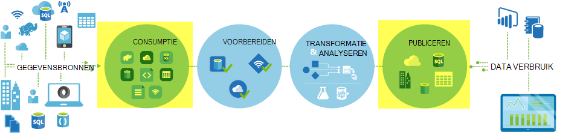
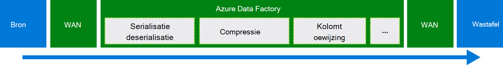
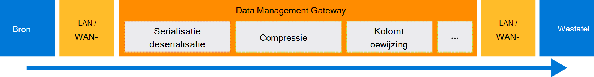

<properties
    pageTitle="Gegevens verplaatsen met kopiëren activiteit | Microsoft Azure"
    description="Meer informatie over het verplaatsen van gegevens Data Factory pijpleidingen: gegevensmigratie wolk winkels, en een winkel in ruimten tot een wolk winkel. Gebruik kopiëren activiteit."
    keywords="gegevens, de verplaatsing van gegevens, de gegevensmigratie, gegevens kopiëren"
    services="data-factory"
    documentationCenter=""
    authors="linda33wj"
    manager="jhubbard"
    editor="monicar"/>

<tags
    ms.service="data-factory"
    ms.workload="data-services"
    ms.tgt_pltfrm="na"
    ms.devlang="na"
    ms.topic="article"
    ms.date="09/22/2016"
    ms.author="jingwang"/>

# Gegevens verplaatsen met behulp van activiteit kopiëren

## Overzicht
In Azure Data Factory kunt u gegevens van verschillende vormen van verschillende op locatie kopiëren en gegevensbronnen voor Azure cloud activiteit kopiëren. Nadat de gegevens zijn gekopieerd, kan deze worden verder verwerkt en geanalyseerd. Kun je kopiëren activiteit voor het publiceren van transformatie en de resultaten van de analyse voor business intelligence (BI) en het verbruik van toepassing.

Kopie activiteit wordt aangedreven door een veilige, betrouwbare, schaalbare, en [wereldwijd beschikbare service](#global). In dit artikel worden details weergegeven over de verplaatsing van gegevens Data Factory en kopie activiteit.

Eerst eens kijken hoe gegevensmigratie plaatsvindt tussen twee wolk gegevensarchieven en tussen een opslaggebied op gebouwen en een gegevensarchief wolk.

> [AZURE.NOTE] Zie voor meer informatie over activiteiten in het algemeen, [Wat pijpleidingen en activiteiten](data-factory-create-pipelines.md).

### Kopiëren van gegevens tussen twee wolk gegevensarchieven
Als bron- en sink gegevensarchieven in de cloud, doorloopt kopie activiteit de volgende etappes om gegevens te kopiëren van de bron tot de sink. De service die activiteit kopiëren bevoegdheden:

1. Leest gegevens van de bron data store.
2. Serialisatie/deserialisatie, compressie/decompressie, kolom toewijzing uitvoeren en typ conversie. Deze bewerkingen op basis van de configuraties van de dataset invoer, uitvoer dataset en kopie activiteit gebeurt.
3.  Schrijft gegevens naar het gegevensarchief bestemming.

De service kiest automatisch de optimale regio voor het uitvoeren van de verplaatsing van gegevens. Dit gebied is meestal een die het dichtst bij de sink-gegevensopslag.

### Een opslaggebied op gebouwen en een gegevensarchief cloud-gegevens kopiëren
Om gegevens veilig verplaatsen tussen een opslaggebied op gebouwen en een wolk gegevensarchief, Data Management Gateway te installeren op uw computer op gebouwen. Data Management Gateway is een agent waarmee hybride gegevens verplaatsen en verwerking. U kunt deze installeren op dezelfde computer als de gegevens zelf opgeslagen of op een afzonderlijke computer die toegang tot de gegevensopslag heeft.

In dit scenario Data Management Gateway voert de serialisatie/deserialisatie, compressie/decompressie, kolom toewijzen en typen converteren. Gegevens doorloopt niet via de service Azure Data Factory. In plaats daarvan schrijft Data Management Gateway rechtstreeks de gegevens naar de bestemming winkel.

Zie [gegevens verplaatsen tussen lokale en cloud opgeslagen gegevens](data-factory-move-data-between-onprem-and-cloud.md) voor een introductie en overzicht. Zie [Data Management Gateway](data-factory-data-management-gateway.md) voor meer informatie over deze agent.

U kunt ook gegevens van/naar ondersteunde gegevens winkels die worden gehost op virtuele machines voor Azure IaaS (VMs) met behulp van Data Management Gateway verplaatsen. In dit geval kunt u Data Management Gateway installeren op dezelfde VM als gegevensarchief zelf of op een aparte VM die toegang tot de gegevensopslag heeft.

## Ondersteunde gegevensopslag en -indelingen
[AZURE.INCLUDE [data-factory-supported-data-stores](../../includes/data-factory-supported-data-stores.md)]

Als u wilt verplaatsen gegevensarchief van een kopie activiteit niet ondersteunen, is een **aangepaste activiteit** in Data Factory gebruiken met uw eigen logica voor het kopiëren/verplaatsen van gegevens. Zie [aangepaste activiteiten in een pijpleiding Azure Data Factory gebruiken](data-factory-use-custom-activities.md)voor meer informatie over het maken en gebruiken van een aangepaste activiteit.

### Ondersteunde bestandsindelingen
U kunt activiteit kopiëren voor het kopiëren van bestanden als-tussen twee bestand-gegevensopslag op, zoals Azure Blob-, bestandssysteem- en HDFS. Hiervoor kunt u de [opmaaksectie](data-factory-create-datasets.md) in beide definities van de invoer en uitvoer dataset overslaan. Worden de gegevens gekopieerd efficiënt zonder enige serialisatie/deserialisatie.

Kopie activiteit ook leest van en schrijft naar bestanden in de opgegeven indeling: tekst, Avro, ORC, parketvloeren en JSON. Zo kunt u het volgende exemplaar activiteiten uitvoeren:

-   Gegevens in de tekstindeling (CSV) van Azure Blob kopiëren en schrijven naar Azure SQL-Database.
-   Kopieer de bestanden in de tekstindeling (CSV) bestandssysteem op ruimten en schrijven naar Azure Blob in Avro-indeling.
-   Gegevens in Azure SQL-Database kopiëren en schrijven naar HDFS op-hoofdkwartier in ORC-indeling.

## Verplaatsing van gegevens algemeen beschikbaar
Azure Data Factory is alleen beschikbaar in de regio's West VS, Oost-VS en Noord-Europa. De service die kopie activiteit bevoegdheden is echter beschikbaar wereldwijd in de volgende regio's en regio's. De topologie van de wereldwijd beschikbare zorgt ervoor dat gegevens efficiënt verkeer die meestal hops cross-regio voorkomt. Zie [Services per regio](https://azure.microsoft.com/regions/#services) voor de beschikbaarheid van Data Factory en verplaatsing van gegevens in een bepaalde regio.

### Gegevens kopiëren naar andere gegevensarchieven cloud
Als bron- en sink gegevensarchieven in de cloud, Data Factory maakt gebruik van de implementatie van een service in de regio die zich het dichtst bij de wastafel in de dezelfde geografische gegevens verplaatsen. Raadpleeg de volgende tabel voor toewijzing:

De regio van het gegevensarchief bestemming | De regio die wordt gebruikt voor het verplaatsen van gegevens
:----------------------------------- | :----------------------------
Oost-Verenigde Staten | Oost-Verenigde Staten
Oost-Verenigde Staten 2 | Oost-Verenigde Staten 2
West-Verenigde Staten | West-Verenigde Staten
West VS 2 | West-Verenigde Staten
Centrale VS | Centrale VS
West Central US | Centrale VS
Centrale Noord-Amerikaanse | Centrale Noord-Amerikaanse
Zuid-centraal-Verenigde Staten | Zuid-centraal-Verenigde Staten
Noord-Europa | Noord-Europa
West-Europa | West-Europa
Zuidoost-Azië | Zuidoost-Azië
Oost-Azië | Zuidoost-Azië
East Japan | East Japan
West Japan | East Japan
Brazilië-Zuid | Brazilië-Zuid
Australië, Oost | Australië, Oost
Zuidoost Australië | Zuidoost Australië
Centraal India | Centraal India
Zuid-India | Centraal India
West-India | Centraal India

> [AZURE.NOTE] Als het gebied van het gegevensarchief van bestemming niet in bovenstaande lijst, mislukt de activiteit kopiëren in plaats van via een andere regio.

### Een opslaggebied op gebouwen en een gegevensarchief cloud-gegevens kopiëren
Wanneer gegevens worden gekopieerd tussen voor gebouwen (of Azure virtuele machines/IaaS) en cloud winkels, [Data Management Gateway](data-factory-data-management-gateway.md) verplaatsing van gegevens op een machine op locatie of een virtuele machine uitvoert. De gegevens wordt niet uitgebreid tot en met de service in de cloud, tenzij u de mogelijkheid [kopie klaargezet](data-factory-copy-activity-performance.md#staged-copy) . In dit geval doorloopt gegevens de staging Azure Blob-opslag voordat deze worden geschreven in het gegevensarchief sink.

## Maken van een pijplijn met activiteit kopiëren
U kunt een pijpleiding maken met activiteit op een aantal manieren kopiëren:

### Met behulp van de Wizard kopiëren
De Wizard Data Factory kopiëren kunt u een pijpleiding met kopie activiteit maken. Deze pijpleiding kunt u gegevens van de ondersteunde bronnen kopiëren naar bestemmingen *zonder te hoeven schrijven JSON* definities van gekoppelde services, datasets en pijpleidingen. [Data Factory kopiëren, Wizard](data-factory-copy-wizard.md) Zie voor meer informatie over de wizard.  

### Met behulp van scripts JSON
Kunt u Data Factory Editor in Azure portal, Visual Studio of Azure PowerShell maken een JSON-definitie voor een pijpleiding (met kopie activiteit). U kunt vervolgens implementeren om te maken van de pijpleiding in Data Factory. Zie [Zelfstudie: gebruik kopiëren activiteit in een pijpleiding Azure Data Factory](data-factory-copy-data-from-azure-blob-storage-to-sql-database.md) voor een zelfstudie met stapsgewijze instructies.    

JSON-eigenschappen (zoals naam, beschrijving, input en output-tabellen en beleid) zijn beschikbaar voor alle typen activiteiten. Eigenschappen die beschikbaar zijn in de `typeProperties` sectie van de activiteit variëren met elk activiteitstype.

Voor de activiteit van de kopie, de `typeProperties` sectie is afhankelijk van de typen bronnen en Put. Klik op een bron/sink in de sectie [bronnen en putten ondersteund](#supported-data-stores) voor meer informatie over eigenschappen die kopie activiteit van die winkel gegevens ondersteunt.   

Hier is een monster JSON-definitie:

    {
      "name": "ADFTutorialPipeline",
      "properties": {
        "description": "Copy data from Azure blob to Azure SQL table",
        "activities": [
          {
            "name": "CopyFromBlobToSQL",
            "type": "Copy",
            "inputs": [
              {
                "name": "InputBlobTable"
              }
            ],
            "outputs": [
              {
                "name": "OutputSQLTable"
              }
            ],
            "typeProperties": {
              "source": {
                "type": "BlobSource"
              },
              "sink": {
                "type": "SqlSink",
                "writeBatchSize": 10000,
                "writeBatchTimeout": "60:00:00"
              }
            },
            "Policy": {
              "concurrency": 1,
              "executionPriorityOrder": "NewestFirst",
              "retry": 0,
              "timeout": "01:00:00"
            }
          }
        ],
        "start": "2016-07-12T00:00:00Z",
        "end": "2016-07-13T00:00:00Z"
      }
    }

Het schema dat is gedefinieerd in de dataset uitvoer wordt bepaald wanneer de activiteit wordt uitgevoerd (bijvoorbeeld: **dagelijks**, frequentie als **dag**en interval als **1**). De activiteit worden de gegevens gekopieerd van een input-gegevensset (**bron**) naar een dataset uitvoer (**wastafel**).

U kunt meer dan één invoer dataset kopie activiteit opgeven. Ze worden gebruikt om te controleren of de afhankelijkheden voordat de activiteit wordt uitgevoerd. Echter wordt alleen de gegevens uit de eerste gegevensset gekopieerd naar de bestemming dataset. Zie voor meer informatie, [planning en uitvoering](data-factory-scheduling-and-execution.md).  

## Prestatie en afstemming
Zie de [prestaties van de activiteit van de kopie en tuning guide](data-factory-copy-activity-performance.md), waarin de belangrijkste factoren die invloed hebben op de prestaties van de verplaatsing van gegevens (kopiëren activiteit) in Azure Data Factory. Ook geeft een overzicht van de waargenomen prestaties tijdens interne tests en verschillende manieren voor het optimaliseren van de prestaties van de activiteit van de kopie worden besproken.

## Planning en opeenvolgende kopiëren
Zie [planning en uitvoering van](data-factory-scheduling-and-execution.md) gedetailleerde informatie over de planning en uitvoering van de werking in Data Factory. Het is mogelijk om meerdere kopieerbewerkingen achter elkaar wilt uitvoeren op een wijze die opeenvolgende/besteld. Zie de sectie [exemplaar besteld](data-factory-scheduling-and-execution.md#ordered-copy) .

## Conversie
Andere gegevensarchieven hebben verschillende native type systemen. Kopie activiteit voert automatische conversie van brontypen opvangen typen met de benadering van de volgende twee stappen:

1. Converteren van native brontypen op het type .NET.
2. Converteren van een aan een eigen wastafel.

De toewijzing van een eigen systeem naar een type .NET voor een gegevensarchief is in de winkel gegevens betreffende artikel. (Klik op de specifieke koppeling in de tabel [opgeslagen gegevens wordt ondersteund](#supported-data-stores) ). U kunt deze toewijzingen betreffende bepalen tijdens het maken van tabellen, zodat de kopie activiteit de juiste conversies worden uitgevoerd.

## Volgende stappen
- Voor meer informatie over de activiteit van de kopie, Zie [gegevens uit Azure Blob-opslag met Azure SQL-Database kopiëren](data-factory-copy-data-from-azure-blob-storage-to-sql-database.md).
- Meer informatie over het verplaatsen van gegevens uit een gegevensarchief voor ruimten met een gegevensarchief wolk, Zie [gegevens verplaatsen uit op-gebouwen om de gegevens van de wolk worden opgeslagen](data-factory-move-data-between-onprem-and-cloud.md).
