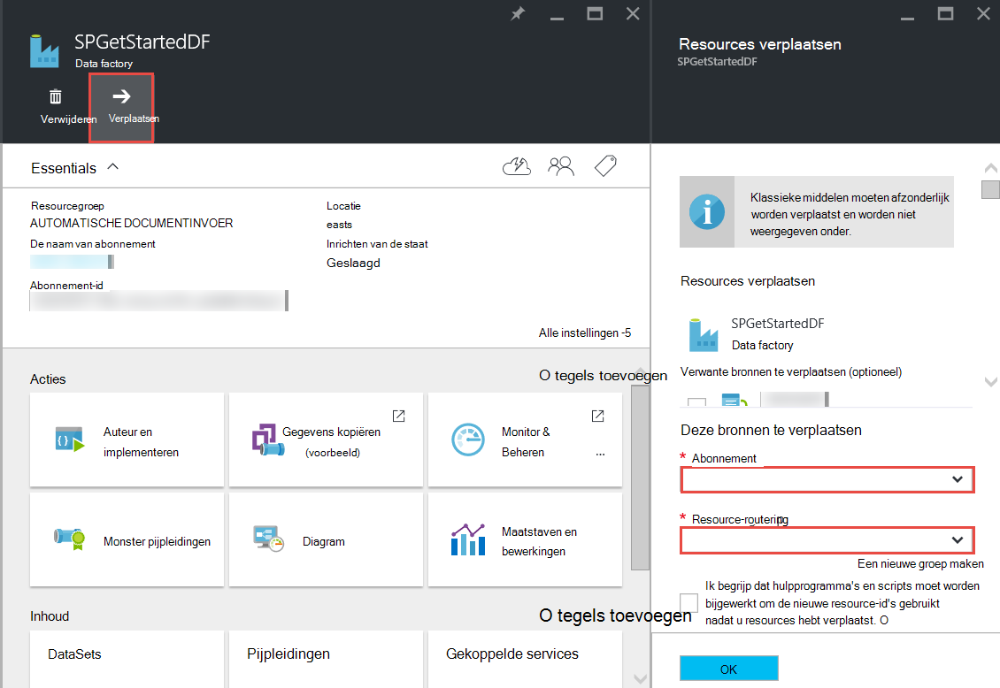

<properties 
    pageTitle="Azure Data Factory - Veelgestelde vragen" 
    description="Veelgestelde vragen over Azure Data Factory." 
    services="data-factory" 
    documentationCenter="" 
    authors="sharonlo101" 
    manager="jhubbard" 
    editor="monicar"/>

<tags 
    ms.service="data-factory" 
    ms.workload="data-services" 
    ms.tgt_pltfrm="na" 
    ms.devlang="na" 
    ms.topic="article" 
    ms.date="09/12/2016" 
    ms.author="shlo"/>

# Azure Data Factory - Veelgestelde vragen

## Algemene vragen

### Wat is Azure Data Factory?

Data Factory is een cloud-gebaseerde data integration-service die **het verkeer en de transformatie van gegevens wordt geautomatiseerd**. Net als bij een fabriek die apparatuur neemt grondstoffen en zetten ze in gereed product wordt uitgevoerd, orchestrates Data Factory bestaande services die onbewerkte gegevens verzamelen en transformeren in kant-en-klare informatie. 
 
Data Factory kunt u werkstromen als gegevens wilt verplaatsen tussen zowel op gebouwen en cloud gegevensopslag als proces/transformatie gegevens met behulp van services zoals Azure HDInsight en Azure gegevens Lake Analytics compute gegevensgestuurde maken. Nadat u een pijpleiding die de actie uitgevoerd die u hebt gemaakt, kunt u plannen worden regelmatig uitgevoerd (per uur, dagelijks, wekelijks, enz.).   

Zie [Overzicht & sleutel concepten](data-factory-introduction.md) voor meer informatie. 

### Waar vind ik de prijsdetails voor Azure Data Factory?

[Data Factory prijzen pagina] Zie[ adf-pricing-details] voor de prijsdetails voor de Azure Data Factory.  

### Hoe ga ik aan de slag met Azure Data Factory?

- Zie voor een overzicht van Azure Data Factory [Inleiding Azure Data Factory](data-factory-introduction.md).
- Zie voor een zelfstudie over het **kopiëren/verplaatsen gegevens** kopiëren activiteit met [gegevens kopiëren van Azure Blob-opslag met Azure SQL-Database](data-factory-copy-data-from-azure-blob-storage-to-sql-database.md).
- Voor een zelfstudie over het **omzetten van gegevens** met behulp van HDInsight component activiteit. Zie [gegevens verwerken met een component-script op Hadoop cluster](data-factory-build-your-first-pipeline.md) 
  
### Wat is de beschikbaarheid van de Data Factory regio?
Data Factory is beschikbaar in de **Verenigde Staten West** en **Noord-Europa**. De opslag en rekenkracht services door fabrieken gegevens gebruikt kunnen worden in andere regio's. Zie [ondersteunde regio's](data-factory-introduction.md#supported-regions). 
 
### Wat zijn de beperkingen van het aantal gegevens fabrieken/pijpleidingen/activiteiten, datasets?
 
Zie **Limieten voor Azure Data Factory** -sectie van het artikel [Azure abonnement Service grenzen, quota's en beperkingen](../azure-subscription-service-limits.md#data-factory-limits) .

### Wat is de authoring/developer ervaring met Azure Data Factory service?

U kunt de auteur/maken fabrieken van gegevens met behulp van een van de volgende opties:

- **Azure portal**  
   de Data Factory-blades in Azure portal bieden uitgebreide gebruikersinterface fabrieken van ad gekoppelde gegevens maakt. De **Data Factory-Editor**die ook deel van de portal uitmaakt, kunt u gemakkelijk gekoppelde services, tabellen, gegevenssets en pijpleidingen maken door te geven van JSON definities voor deze artefacten. Zie [de eerste gegevens pijpleiding met Azure portal maken](data-factory-build-your-first-pipeline-using-editor.md) voor een voorbeeld van het gebruik van de portal/editor maken en implementeren van een data factory genoemd.

- **Visual Studio**  
   kunt u Visual Studio voor het maken van een Azure data factory genoemd. Zie het [maken van uw eerste data pijpleiding met behulp van Visual Studio](data-factory-build-your-first-pipeline-using-vs.md) voor meer informatie. 

- **Azure PowerShell**  
   [maken en monitor Azure Data Factory met Azure PowerShell](data-factory-build-your-first-pipeline-using-powershell.md) Zie voor een zelfstudie/Stapsgewijze instructies voor het maken van een data factory met PowerShell. Zie [Data Factory Cmdlet Reference] [ adf-powershell-reference] inhoud op de MSDN-bibliotheek voor een uitgebreide documentatie van Data Factory-cmdlets.
   
- **Klassenbibliotheek van .NET**  
   kunt u programmatisch gegevens fabrieken maken met behulp van Data Factory .NET SDK. Zie [maken, bewaken en beheren van fabrieken van gegevens met behulp van .NET SDK](data-factory-create-data-factories-programmatically.md) voor een overzicht van het maken van een data factory met .NET SDK. [Data Factory Class Library Reference] Zie[ msdn-class-library-reference] voor een uitgebreide Data Factory .NET SDK-documentatie.

- **REST API**  
   ook kunt u de REST API beschikbaar gesteld door de Azure Data Factory service maken en implementeren van data fabrieken. [Data Factory REST API Reference] Zie[ msdn-rest-api-reference] voor een uitgebreide documentatie van Data Factory REST API.
 
- **Sjabloon voor Azure Resource Manager** 
   Zie [Zelfstudie: uw eerste Azure data factory met behulp van bronbeheer Azure sjabloon maken](data-factory-build-your-first-pipeline-using-arm.md) fo details. 

### Kan ik een fabriek gegevens wijzigen?
Nr. Net als andere bronnen Azure, kan niet de naam van een fabriek Azure gegevens worden gewijzigd. 

### Kan ik een fabriek gegevens uit één Azure abonnement naar de andere verplaatsen? 
Ja. Gebruik de knop **verplaatsen** op uw data factory blade zoals in het volgende diagram wordt weergegeven. 

### Wat zijn de compute-omgevingen ondersteund door Data Factory?
De volgende tabel bevat een lijst met compute-omgevingen ondersteund door Data Factory en de activiteiten die op hen. 

| Berekenen van de omgeving | activiteiten |
| ------------------- | -------- | 
| [Cluster bellen op HDInsight](data-factory-compute-linked-services.md#azure-hdinsight-on-demand-linked-service) of [HDInsight-cluster](data-factory-compute-linked-services.md#azure-hdinsight-linked-service) | [DotNet](data-factory-use-custom-activities.md), [component](data-factory-hive-activity.md), [varkens](data-factory-pig-activity.md), [MapReduce](data-factory-map-reduce.md), [Hadoop-Streaming](data-factory-hadoop-streaming-activity.md) | 
| [Azure Batch](data-factory-compute-linked-services.md#azure-batch-linked-service) | [DotNet](data-factory-use-custom-activities.md) |  
| [Azure Machine Learning](data-factory-compute-linked-services.md#azure-machine-learning-linked-service) | [Machine Learning activiteiten: Batch worden uitgevoerd en een bron van Update](data-factory-azure-ml-batch-execution-activity.md) |
| [Azure gegevens Lake Analytics](data-factory-compute-linked-services.md#azure-data-lake-analytics-linked-service) | [Data Analytics Lake U-SQL](data-factory-usql-activity.md)
| [Azure SQL](data-factory-compute-linked-services.md#azure-sql-linked-service), [datawarehouse Azure SQL](data-factory-compute-linked-services.md#azure-sql-data-warehouse-linked-service), [SQL Server](data-factory-compute-linked-services.md#sql-server-linked-service) | [Opgeslagen Procedure](data-factory-stored-proc-activity.md)

## Activiteiten - Veelgestelde vragen
### Wat zijn de verschillende soorten activiteiten die u in een pijpleiding Data Factory gebruiken kunt? 

- [Data verkeer activiteiten](data-factory-data-movement-activities.md) om gegevens te verplaatsen.
- [Data Transformation activiteiten](data-factory-data-transformation-activities.md) voor proces/transformatie gegevens. 

### Wanneer wordt een activiteit uitgevoerd?
De **beschikbaarheid van** configuratie-instelling in de uitvoertabel gegevens bepaalt wanneer de activiteit wordt uitgevoerd. Als invoer datasets worden opgegeven, de activiteit wordt gecontroleerd of alle afhankelijkheden van de invoergegevens is voldaan (dat wil zeggen **klaar** staat) voordat deze wordt gestart. 

## Activiteit - Veelgestelde vragen over het kopiëren
### Is het beter om een pijpleiding met meerdere activiteiten of een afzonderlijke pijplijn voor elke activiteit? 
Pijpleidingen moeten gerelateerde activiteiten te bundelen. Als de datasets die deze verbinding niet worden gebruikt door een andere activiteit buiten de pijpleiding, kunt u de activiteiten van een pijpleiding. Op deze manier u niet moet keten pijpleiding actieve perioden zodat ze met elkaar worden uitgelijnd. Ook wordt de integriteit van de gegevens in de tabellen op de pijpleiding interne beter behouden bij het bijwerken van de pijpleiding. Pijpleiding update in feite stopt alle activiteiten binnen de pijpleiding, worden deze verwijderd en opnieuw gemaakt. Uit-perspectief, mogelijk beter te zien van de stroom van gegevens binnen de gerelateerde activiteiten in één JSON-bestand voor de pijplijn.

### Wat zijn de ondersteunde gegevensarchieven?
[AZURE.INCLUDE [data-factory-supported-data-stores](../../includes/data-factory-supported-data-stores.md)]

### Wat zijn de ondersteunde bestandsindelingen? 
[AZURE.INCLUDE [data-factory-file-format](../../includes/data-factory-file-format.md)]

### Waar is de kopieerbewerking uitgevoerd? 
Zie de sectie [wereldwijd beschikbare gegevens verplaatsen](data-factory-data-movement-activities.md#global) voor meer informatie. Kortom, wanneer een opslaggebied op ruimten is betrokken, wordt de kopieerbewerking uitgevoerd door de Data Management Gateway in uw omgeving op gebouwen. En wanneer de verplaatsing van gegevens tussen twee wolk winkels, de kopieeropdracht wordt uitgevoerd in het dichtst bij de sink-locatie in de dezelfde geografische regio. 

## HDInsight activiteit - Veelgestelde vragen

### Welke regio's worden ondersteund door HDInsight?

Zie de sectie geografische beschikbaarheid in het volgende artikel: of [Prijzen Details van HDInsight][hdinsight-supported-regions].

### Welke regio wordt gebruikt door een HDInsight op verzoek cluster?

Het cluster op verzoek HDInsight wordt gemaakt in dezelfde regio waar de opslag die u hebt opgegeven voor gebruik met het cluster zich bevindt.    

### Het koppelen van rekeningen in uw cluster HDInsight extra opslagruimte?

Als u uw eigen HDInsight Cluster (BYOC - Breng uw eigen Cluster), Zie de volgende onderwerpen: 

- [Met behulp van een HDInsight-Cluster met opslag van andere Accounts en Metastores][hdinsight-alternate-storage]
- [Extra opslagruimte rekeningen gebruiken met de component HDInsight][hdinsight-alternate-storage-2]

Als u een cluster op verzoek die is gemaakt door de Data Factory-service opgeven accounts extra opslagruimte voor de HDInsight service zo gekoppeld dat de Data Factory service voor jou registreren kunt. Gebruik **additionalLinkedServiceNames** -eigenschap om alternatieve opslag rekeningen zoals in het volgende fragment van JSON te geven in de JSON-definitie voor de gekoppelde service op verzoek:
 
    {
        "name": "MyHDInsightOnDemandLinkedService",
        "properties":
        {
            "type": "HDInsightOnDemandLinkedService",
            "typeProperties": {
                "clusterSize": 1,
                "timeToLive": "00:01:00",
                "linkedServiceName": "LinkedService-SampleData",
                "additionalLinkedServiceNames": [ "otherLinkedServiceName1", "otherLinkedServiceName2" ] 
            }
        }
    } 

In het bovenstaande voorbeeld zijn otherLinkedServiceName1 en otherLinkedServiceName2 gekoppelde services waarvan de definities bevatten de referenties waarmee de cluster HDInsight opslag alternatieve accounts toegang moet hebben.

## Segmenten - Veelgestelde vragen

### Waarom zijn mijn input segmenten niet in de status gereed?  
Een veelvoorkomende fout is geen **externe** eigenschap op **true** in de dataset invoer wanneer de ingevoerde gegevens externe gegevens fabriek (niet geproduceerd door de data factory genoemd) is. 

In het volgende voorbeeld hoeft u alleen **externe** ingesteld op true op **dataset1**.  

**DataFactory1** Pipeline-1: dataset1 -> activity1 -> dataset2 -> activity2 -> dataset3-pijplijn 2: dataset3 -> activity3 -> dataset4

Hebt u een andere fabriek van gegevens met een pijpleiding die dataset4 (geproduceerd door middel van pijpleidingen data factory 1-2), moet u dataset4 markeren als een externe dataset omdat de dataset wordt geproduceerd door een andere fabriek (DataFactory1, niet DataFactory2).  

**DataFactory2**    
Pipeline-1: dataset4 -> activity4 -> dataset5

Als de eigenschap external correct is ingesteld, kunt u controleren of de ingevoerde gegevens op de locatie die is opgegeven in de definitie van de invoer dataset bestaat. 

### Het uitvoeren van een segment op een ander tijdstip dan middernacht wanneer het segment dagelijks wordt geproduceerd?
Gebruik de eigenschap **offset** geeft u het tijdstip waarop het segment moeten worden geproduceerd. Zie de sectie [beschikbaarheid Dataset](data-factory-create-datasets.md#Availability) voor meer informatie over deze eigenschap. Hier is een snelle voorbeeld:

    "availability":
    {
        "frequency": "Day",
        "interval": 1,
        "offset": "06:00:00"
    }

Dagelijkse segmenten beginnen om **6 uur** in plaats van de standaard middernacht.     

### Hoe kan ik een segment opnieuw uitvoeren
U kunt een segment in een van de volgende manieren uitvoeren: 

- Monitor en App beheren een activiteitvenster of segment opnieuw wilt gebruiken. Zie de [geselecteerde activiteit windows opnieuw uitvoeren](data-factory-monitor-manage-app.md#re-run-selected-activity-windows) voor instructies.   
- Klik op **uitvoeren** in de werkbalk op de bladeserver **Segment** voor het segment in de portal Azure.
- Voer de cmdlet **Set-AzureRmDataFactorySliceStatus** met Status ingesteld op **wachten** voor het segment.   
    
        Set-AzureRmDataFactorySliceStatus -Status Waiting -ResourceGroupName $ResourceGroup -DataFactoryName $df -TableName $table -StartDateTime "02/26/2015 19:00:00" -EndDateTime "02/26/2015 20:00:00" 

Zie [Set AzureRmDataFactorySliceStatus] [ set-azure-datafactory-slice-status] voor meer informatie over de cmdlet. 

### Hoe lang was er nodig voor het verwerken van een segment?
Activiteit venster Explorer in de Monitor & App beheren gebruiken om te weten hoe lang het heeft geduurd voor het verwerken van een segment. Zie [Activiteit venster Explorer](data-factory-monitor-manage-app.md#activity-window-explorer) voor meer informatie. 

U kunt ook in de Azure portal het volgende doen:  

1. Op **Datasets** naast elkaar op het blad **DATA FACTORY** voor uw data factory genoemd.
2. Klik op het blad **Datasets** specifiek dataset.
3. Selecteer het segment dat u geïnteresseerd in in de lijst **recente segmenten** aan de **tabel** blade bent.
4. Klik op de activiteit uitvoeren in de lijst **Activiteiten uitgevoerd** op het blad van het **Segment** . 
5. Klik op **Eigenschappen** naast elkaar op het blad **ACTIVITEITSGEGEVENS worden uitgevoerd** . 
6. Hier ziet u het veld **duur** met een waarde. Deze waarde is de tijd die nodig is voor het verwerken van het segment.   

### Het beëindigen van een segment uitgevoerd?
Als u stoppen met de pijpleiding wilt wordt uitgevoerd, kunt u de [Stand-by-AzureRmDataFactoryPipeline](https://msdn.microsoft.com/library/mt603721.aspx) -cmdlet. Op dit moment stopt tot schorsing van de pijpleiding niet het segment uitvoeringen die uitgevoerd worden. Zodra u klaar bent met het gebruik in uitvoering, is geen extra segment opgenomen.

Als u echt stoppen alle uitvoeringen direct wilt, is de enige manier waarop de pijpleiding verwijderen en opnieuw maken. Als u kiest voor het verwijderen van de pijpleiding, hoeft u niet te verwijderen van tabellen en gekoppelde services die worden gebruikt door de pijplijn. 

[create-factory-using-dotnet-sdk]: data-factory-create-data-factories-programmatically.md
[msdn-class-library-reference]: https://msdn.microsoft.com/library/dn883654.aspx
[msdn-rest-api-reference]: https://msdn.microsoft.com/library/dn906738.aspx

[adf-powershell-reference]: https://msdn.microsoft.com/library/dn820234.aspx 
[azure-portal]: http://portal.azure.com
[set-azure-datafactory-slice-status]: https://msdn.microsoft.com/library/mt603522.aspx

[adf-pricing-details]: http://go.microsoft.com/fwlink/?LinkId=517777
[hdinsight-supported-regions]: http://azure.microsoft.com/pricing/details/hdinsight/
[hdinsight-alternate-storage]: http://social.technet.microsoft.com/wiki/contents/articles/23256.using-an-hdinsight-cluster-with-alternate-storage-accounts-and-metastores.aspx
[hdinsight-alternate-storage-2]: http://blogs.msdn.com/b/cindygross/archive/2014/05/05/use-additional-storage-accounts-with-hdinsight-hive.aspx
 
