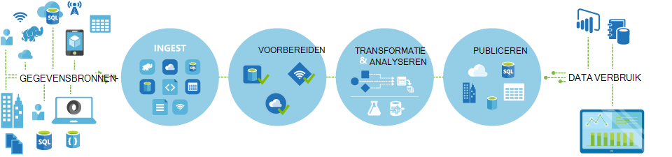
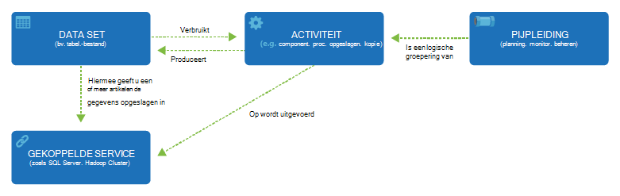

<properties 
    pageTitle="Inleiding tot Data Factory, een service-integratie | Microsoft Azure" 
    description="Meer informatie Azure Data Factory: een wolk integratieservice die orchestrates en verkeer en de transformatie van gegevens wordt geautomatiseerd." 
    keywords="integratie van gegevens, wolk integratie van gegevens, wat is azure data factory"
    services="data-factory" 
    documentationCenter="" 
    authors="sharonlo101" 
    manager="jhubbard" 
    editor="monicar"/>

<tags 
    ms.service="data-factory" 
    ms.workload="data-services" 
    ms.tgt_pltfrm="na" 
    ms.devlang="na" 
    ms.topic="get-started-article" 
    ms.date="09/22/2016" 
    ms.author="shlo"/>

# Inleiding tot Azure Data Factory Service, een service-integratie in de cloud

## Wat is Azure Data Factory? 
Data Factory is een cloud-gebaseerde data integratieservice orchestrates en automatiseert het **verkeer** en de **transformatie** van gegevens. U kunt gegevens integratieoplossingen maken met de service Data Factory kunnen consumptie van gegevens uit verschillende gegevensarchieven, de gegevens transformeren/proces en de resultaatgegevens naar de opgeslagen gegevens publiceren. 

Data Factory-service kunt u gegevens pijpleidingen die verplaatsen en transformeren van gegevens maken en voer vervolgens de pijpleidingen volgens een bepaald schema (per uur, dagelijks, wekelijks, enz.). Het biedt ook uitgebreide visualisaties lineage en afhankelijkheden tussen de pijpleidingen gegevens weergeven en uw gegevens pijpleidingen uit een uniforme weergave te achterhalen gemakkelijk problemen en waarschuwingen controle-instelling controleren.

**Figure1.** Consumptie van gegevens uit verschillende bronnen, voorbereiden, transformeren, de gegevens analyseren en vervolgens publiceren van kant-en-klare gegevens voor consumptie.

## Pijpleidingen en activiteiten
In een oplossing voor Data Factory maakt u een of meer gegevens **pijpleidingen**. Een pijplijn is een logische groepering van activiteiten. Ze worden gebruikt voor groepsactiviteiten in een eenheid die tezamen een taak uitvoeren. 

**Activiteiten** definiëren de acties uit te voeren op de gegevens. U kunt bijvoorbeeld een activiteit kopiëren gegevens kopiëren uit een gegevensarchief naar een ander gegevensarchief. U kunt ook een component-activiteit, die een component-query wordt uitgevoerd op een cluster Azure HDInsight transformeren of analyseren van uw gegevens. Data Factory ondersteunt twee soorten activiteiten: gegevensverplaatsing activiteiten en data transformation activiteiten. 
  
## Data verkeer activiteiten 
[AZURE.INCLUDE [data-factory-supported-data-stores](../../includes/data-factory-supported-data-stores.md)]

Zie [Gegevensverplaatsing activiteiten](data-factory-data-movement-activities.md) -artikel voor meer informatie. 

## Data transformation activiteiten
[AZURE.INCLUDE [data-factory-transformation-activities](../../includes/data-factory-transformation-activities.md)]

Zie [Data Transformation activiteiten](data-factory-data-transformation-activities.md) -artikel voor meer informatie.

Als u wilt verplaatsen gegevensarchief uit een dat kopie activiteit niet ondersteunt, of transformatie van gegevens met behulp van uw eigen logica, maak een **aangepaste activiteit van .NET**. Zie [aangepaste activiteiten in een pijpleiding Azure Data Factory gebruiken](data-factory-use-custom-activities.md)voor meer informatie over het maken en gebruiken van een aangepaste activiteit.

## Gekoppelde services
Gekoppelde services definieert de gegevens die nodig zijn voor Data Factory verbinding maken met externe bronnen (voorbeelden: Azure, op-opslaghouders Azure HDInsight van SQL Server). Gekoppelde services worden gebruikt om twee redenen in Data Factory:

- Bestand te vertegenwoordigen een **gegevensarchief** een op ruimten SQL Server, Oracle-database, inclusief, maar niet beperkt tot, share of een account Azure Blob-opslag. Zie de sectie [gegevensverplaatsing activiteiten](data-factory-data-movement-activities.md) voor een lijst van ondersteunde gegevensarchieven. 
- Voor een **resource te berekenen** waarop de uitvoering van een activiteit. Bijvoorbeeld de HDInsightHive activiteit wordt uitgevoerd op een cluster HDInsight Hadoop. Zie [Data transformation activiteiten](data-factory-data-transformation-activities.md) het gedeelte voor een lijst van ondersteunde compute-omgevingen. 

## DataSets 
Gekoppelde services opgeslagen gegevens aan een fabriek Azure gegevens koppelen. DataSets vertegenwoordigen gegevensstructuren met in de opgeslagen gegevens. Bijvoorbeeld, biedt een Azure gekoppeld opslagservice verbindingsgegevens voor de Data Factory voor verbinding met een account met Azure opslag. Een dataset Azure Blob geeft de blob-container en de map in de Azure Blob-opslag van waaruit de pijpleiding moet de gegevens lezen. Ook een gekoppelde Azure SQL service bevat de verbindingsgegevens voor een Azure SQL-database en een dataset Azure SQL geeft de tabel die de gegevens bevat.   

## Relatie tussen entiteiten Data Factory
Data Factory heeft een paar belangrijke entiteiten die samen voor het definiëren van invoer en uitvoer van gegevens, het verwerken van gebeurtenissen, en de planning en resources die nodig zijn voor het uitvoeren van de gewenste gegevensstroom.

**in figuur 2.** Relaties tussen Dataset, activiteit, pijpleiding en gekoppelde service

Met de vier eenvoudige concepten van gekoppelde services, datasets, activiteiten en pijpleidingen bent u klaar om aan de slag! U kunt [uw eerste pipeline te bouwen](data-factory-build-your-first-pipeline.md). 

## Ondersteunde regio 's
Op dit moment kunt u gegevens fabrieken in de regio's **West VS**, **Oost-VS**en **Noord-Europa** . Echter, een fabriek gegevens kan toegang krijgen tot de opgeslagen gegevens en services in andere Azure regio's om gegevens te verplaatsen tussen de opgeslagen gegevens te berekenen of procesgegevens met behulp van services berekenen. 

Azure Data Factory zelf slaat geen gegevens. U kunt maken van gegevensgestuurde stromen om goedkeuringen door verplaatsing van gegevens tussen [ondersteund gegevensarchieven](data-factory-data-movement-activities.md#supported-data-stores) en verwerking van gegevens met [berekenen van services](data-factory-compute-linked-services.md) in andere regio's of in een omgeving op gebouwen. Ook kunt u [controleren en beheren van workflows](data-factory-monitor-manage-pipelines.md) met beide programma en UI-mechanismen. 

Hoewel Azure Data Factory in alleen **West VS** **VS Oost-**en **Noord-Europese** regio's beschikbaar is, is de service dat de verplaatsing van gegevens in de fabriek gegevens beschikbaar [wereldwijd](data-factory-data-movement-activities.md#global) in verschillende regio's. In het geval een gegevensarchief bevindt zich achter een firewall vervolgens een [Data Management Gateway](data-factory-move-data-between-onprem-and-cloud.md) geïnstalleerd in verplaatst uw omgeving op gebouwen in plaats daarvan de gegevens. 

Voor een voorbeeld, laat ons aannemen dat uw compute-omgevingen zoals Azure HDInsight cluster en Azure Machine Learning worden uitgevoerd uit de regio West-Europa. U kunt maken en gebruiken een instantie Azure Data Factory in Noord-Europa en gebruiken voor het plannen van taken op de compute-omgevingen in West-Europa. Het duurt een paar milliseconden voor de fabriek van de gegevens voor het starten van de taak in uw omgeving compute, maar verandert niet de tijd voor het uitvoeren van de taak in uw computeromgeving.

We proberen Azure Data Factory hebben in elke in de toekomst ondersteund door Azure Geografie.
  
## Volgende stappen
Volg de stapsgewijze instructies in de volgende cursussen als u wilt weten hoe u gegevens fabrieken met gegevens pijpleidingen. 

Zelfstudie | Beschrijving
-------- | -----------
[Bouwen van een pijplijn gegevens waarmee gegevens met behulp van Hadoop cluster verwerkt](data-factory-build-your-first-pipeline.md) | In deze zelfstudie bouwt u uw eerste fabriek Azure gegevens met een pijpleiding gegevens die **processen gegevens** met een component-script op een cluster Azure HDInsight (Hadoop). |
[Bouwen van een pijplijn gegevens verplaatsen van gegevens tussen twee wolk gegevensarchieven](data-factory-copy-data-from-azure-blob-storage-to-sql-database.md) | In deze zelfstudie maakt u een data factory met een pijpleiding die **gegevens** uit de Blob-opslag met SQL-database.
[Bouwen van een pijplijn gegevens als gegevens wilt verplaatsen tussen een opslaggebied op gebouwen en een gegevensarchief voor cloud Data Management Gateway gebruiken](data-factory-move-data-between-onprem-and-cloud.md) | In deze zelfstudie bouwt u een gegevens-fabriek met een pijpleiding die **gegevens** uit een SQL Server-database **op ruimten** naar een Azure blob. Als onderdeel van de procedure, installeren en configureren van de Data Management Gateway op de computer. 
