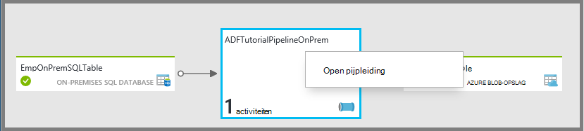
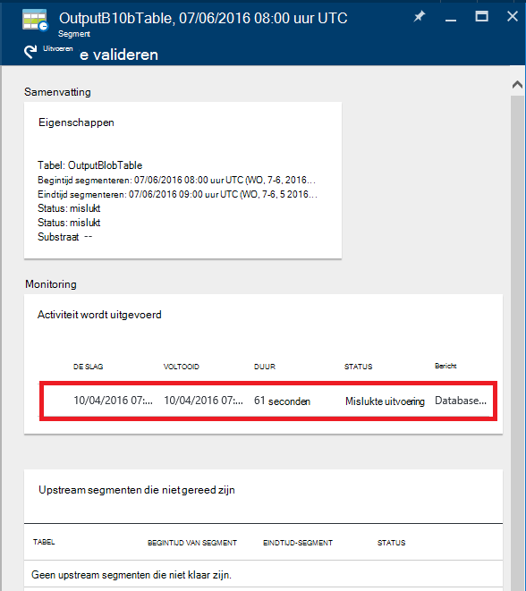
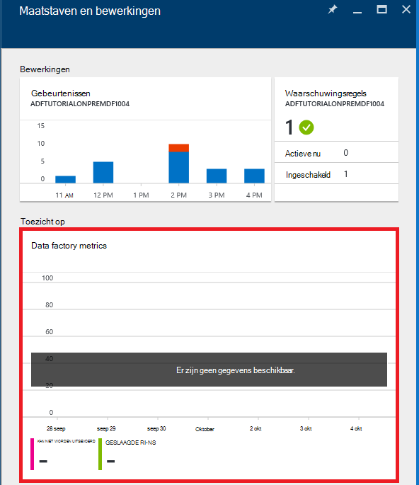

<properties 
    pageTitle="Bewaken en beheren van pijpleidingen Azure Data Factory" 
    description="Informatie over het Azure Portal en Azure PowerShell gebruiken om te controleren en beheren van gegevens Azure fabrieken en pijpleidingen die u hebt gemaakt." 
    services="data-factory" 
    documentationCenter="" 
    authors="spelluru" 
    manager="jhubbard" 
    editor="monicar"/>

<tags 
    ms.service="data-factory" 
    ms.workload="data-services" 
    ms.tgt_pltfrm="na" 
    ms.devlang="na" 
    ms.topic="article" 
    ms.date="09/06/2016" 
    ms.author="spelluru"/>

# Bewaken en beheren van pijpleidingen Azure Data Factory
> [AZURE.SELECTOR]
- [Azure portal/Azure PowerShell gebruiken](data-factory-monitor-manage-pipelines.md)
- [Met behulp van controle en beheer App](data-factory-monitor-manage-app.md)

De Data Factory-service biedt een betrouwbare en volledige weergave van de opslag, verwerking en data verkeer services. De service biedt u een controle helpt dashboard kunt u de volgende taken uitvoeren: 

- Snel gegevens voor end-to-end pijpleiding gezondheid te beoordelen.
- Problemen te identificeren en corrigerende maatregelen te nemen als dat nodig is. 
- Track gegevens lineage. 
- Bijhouden van relaties tussen de gegevens in een van de bronnen.
- Weergave volledige historische accounting taakuitvoering systeemcontrole en afhankelijkheden.

In dit artikel wordt beschreven hoe bewaken, beheren en fouten opsporen in de pijpleidingen. Het bevat ook informatie over het maken van waarschuwingen en ontvang een bericht op fouten.

## Pijpleidingen en activiteit lidstaten begrijpen
Met de portal Azure, kunt u:

- De fabriek van gegevens als een diagram weergeven
- Activiteiten in een pijpleiding weergeven
- Invoer en uitvoer van datasets bekijken
- en nog veel meer. 

Deze sectie bevat ook hoe een segment overgangen van de ene staat naar een andere staat.   

### Ga naar de fabriek van uw gegevens
1.  Log in om de [Azure portal](https://portal.azure.com).
2.  Klik op **gegevens fabrieken** in het menu aan de linkerkant. Als u deze niet ziet, klikt u op **meer services >** en **fabrieken van gegevens** op onder categorie **INTELLIGENCE + ANALYTICS** . 

    

    Hier ziet u alle fabrieken van de gegevens in het blad **gegevens fabrieken** . 
4. Selecteer in het blad gegevens fabrieken, de fabriek van de gegevens waarin u geïnteresseerd bent.

      
5.  en ziet u de introductiepagina (blade**Data factory genoemd** ) voor de fabriek van gegevens.

    

#### De weergave Netwerkdiagram van uw data factory
De weergave van het Diagram van een fabriek van gegevens biedt één deelvenster van glas, bewaken en beheren van de gegevens-fabriek en haar activa.

Klik op **Diagram** op de introductiepagina van data factory om het diagram te bekijken van uw data factory genoemd.

U kunt inzoomen, uitzoomen, uitzoomen past op 100% zoom, de indeling van het diagram vergrendelen en pijpleidingen en tabellen automatisch te plaatsen. U ziet ook de gegevens van lineage (upstream en downstream-objecten van de geselecteerde items weergeven).
 

### Activiteiten in een pijpleiding 
1. Klik met de rechtermuisknop op de pijplijn en klik op **Open pijpleiding** overzicht van alle activiteiten in de pijplijn en datasets invoer en uitvoer voor de activiteiten. Deze functie is handig wanneer uw pijplijn bestaat uit meer dan één activiteit en u wilt weten over de operationele lineage van één pijpleiding.

      
2. In het volgende voorbeeld ziet u twee activiteiten in de pijplijn met hun ingangen en uitgangen. De **JoinData** van het type HDInsight component activiteit en **EgressDataAzure** van het type activiteit kopie activiteit worden in dit voorbeeld pijplijn. 
    
     
3. Terug naar homepage Data Factory kunt u navigeren door te klikken op gegevens fabriek in de ' breadcrumb ' in de linkerbovenhoek.

    

### Status van elke activiteit binnen een pijpleiding
U kunt de huidige status van een activiteit weergeven door de status van de datasets geproduceerd door de activiteit weer te geven. 

Bijvoorbeeld: in het volgende voorbeeld wordt de **BlobPartitionHiveActivity** met succes en een gegevensset met de naam **PartitionedProductsUsageTable**, die in de status **Gereed** is geproduceerd.

Als u dubbelklikt op het **PartitionedProductsUsageTable** in de weergave Netwerkdiagram toonbeeld geeft van alle segmenten die zijn gemaakt door een andere activiteit wordt uitgevoerd binnen een pijpleiding. U kunt zien dat de **BlobPartitionHiveActivity** is elke maand uitgevoerd voor de laatste acht maanden en de segmenten in de status **Gereed** geproduceerd.

De dataset segmenten in de fabriek van gegevens kunnen een van de volgende statussen hebben:

<table>
<tr>
    <th align="left">Staat</th><th align="left">Subtoestand</th><th align="left">Beschrijving</th>
</tr>
<tr>
    <td rowspan="8">Een ogenblik geduld</td><td>ScheduleTime</td><td>De tijd is niet aangebroken voor het segment uit te voeren.</td>
</tr>
<tr>
<td>DatasetDependencies</td><td>De upstream afhankelijkheden zijn niet gereed.</td>
</tr>
<tr>
<td>ComputeResources</td><td>De compute-bronnen zijn niet beschikbaar.</td>
</tr>
<tr>
<td>ConcurrencyLimit</td> <td>Alle exemplaren van de activiteit zijn bezet met andere segmenten.</td>
</tr>
<tr>
<td>ActivityResume</td><td>Activiteit is onderbroken en de segmenten kan niet worden uitgevoerd totdat deze wordt hervat.</td>
</tr>
<tr>
<td>Probeer het opnieuw</td><td>Uitvoering van de activiteit wordt opnieuw geprobeerd.</td>
</tr>
<tr>
<td>Validatie</td><td>Validatie is nog niet begonnen.</td>
</tr>
<tr>
<td>ValidationRetry</td><td>In afwachting van de validatie opnieuw worden geprobeerd.</td>
</tr>
<tr>
<tr
<td rowspan="2">InProgress</td><td>Valideren</td><td>Validatie is uitgevoerd.</td>
</tr>
<td></td>
<td>Het segment wordt verwerkt.</td>
</tr>
<tr>
<td rowspan="4">Is mislukt</td><td>Time-out</td><td>Uitvoering duurde langer dan die van de activiteit is toegestaan.</td>
</tr>
<tr>
<td>Geannuleerd</td><td>Geannuleerd door een gebruiker.</td>
</tr>
<tr>
<td>Validatie</td><td>Validatie is mislukt.</td>
</tr>
<tr>
<td></td><td>Kan genereren en/of het valideren van het segment.</td>
</tr>
<td>Gereed</td><td></td><td>Het segment is gereed voor gebruik.</td>
</tr>
<tr>
<td>Overgeslagen</td><td></td><td>Het segment wordt niet verwerkt.</td>
</tr>
<tr>
<td>Geen</td><td></td><td>Een segment bestaan met een andere status gebruikt, maar is opnieuw ingesteld.</td>
</tr>
</table>

U kunt de details over een segment weergeven door te klikken op een vermelding van het segment in de blade **Segmenten onlangs bijgewerkt** .

 
Als het segment is meerdere keren uitgevoerd, ziet u meerdere rijen in de lijst **activiteit wordt uitgevoerd** . U kunt details bekijken over een activiteit uitvoeren door te klikken op de post uitvoeren in de lijst **dat activiteit wordt uitgevoerd** . De lijst bevat alle logboekbestanden met een foutbericht, indien van toepassing. Deze functie is handig voor het weergeven en logboeken voor foutopsporing zonder te hoeven verlaten van de fabriek van uw gegevens.

Als het segment niet in de toestand **Gereed** is, ziet u de upstream segmenten die niet klaar zijn en wordt het huidige segment wordt uitgevoerd in de lijst **Upstream segmenten die niet gereed zijn** geblokkeerd. Deze functie is handig wanneer uw segment **wachten** staat en u wilt weten over de upstream-afhankelijkheden waarop het segment is in behandeling.

### DataSet toestandsdiagram
Zodra de implementatie van een fabriek van gegevens en de pijpleidingen hebben een geldige actieve periode, segmenten de dataset overgang van de ene toestand naar de andere. Momenteel volgt de status van het segment in het volgende diagram voor staat:

De dataset staat overgang stroom in de fabriek gegevens: wachten op In-voortgang/In uitvoering (Validating) -> -> Ready/mislukt

De segmenten starten in een **wachtrij** staat voor voorafgaande voorwaarden moet worden voldaan voordat u. Vervolgens wordt de activiteit wordt uitgevoerd en het segment wordt de status **In uitvoering** . De uitvoering van de activiteit kan slagen of mislukken. Het segment is gemarkeerd als **Gereed**' of **mislukt** op basis van het resultaat van de uitvoering. 

U kunt het segment om terug te gaan van de status **Gereed** of **mislukt** te **wachten** staat herstellen. U kunt ook markeren de status van het segment wilt **overslaan**, die voorkomt de activiteit wordt uitgevoerd dat en het segment niet verwerken.

## Beheren van pijpleidingen
U kunt uw pijpleidingen met Azure PowerShell beheren. U kunt bijvoorbeeld onderbreken en hervatten van pijpleidingen door Azure PowerShell-cmdlets. 

### Onderbreken en hervatten van pijpleidingen
U kunt pauzeren/uitstellen met de **Stand-bymodus AzureRmDataFactoryPipeline** Powershell-cmdlet pijpleidingen. Deze cmdlet is handig als u niet wilt dat uw pijpleidingen uitvoeren totdat het probleem is opgelost.

Bijvoorbeeld: in de volgende schermafdruk, een probleem ontdekt met de **PartitionProductsUsagePipeline** in de fabriek van **productrecgamalbox1dev** gegevens en we willen de pijplijn opschorten.

Als u wilt onderbreken een pijpleiding, kunt u de volgende PowerShell-opdracht uitvoeren:

    Suspend-AzureRmDataFactoryPipeline [-ResourceGroupName] <String> [-DataFactoryName] <String> [-Name] <String>

Bijvoorbeeld:

    Suspend-AzureRmDataFactoryPipeline -ResourceGroupName ADF -DataFactoryName productrecgamalbox1dev -Name PartitionProductsUsagePipeline 

Zodra het probleem is opgelost met de **PartitionProductsUsagePipeline**, kunt u de onderbroken pijpleiding hervatten door de volgende PowerShell-opdracht uit te voeren:

    Resume-AzureRmDataFactoryPipeline [-ResourceGroupName] <String> [-DataFactoryName] <String> [-Name] <String>

Bijvoorbeeld:

    Resume-AzureRmDataFactoryPipeline -ResourceGroupName ADF -DataFactoryName productrecgamalbox1dev -Name PartitionProductsUsagePipeline 

## Pijpleidingen voor foutopsporing
Azure Data Factory biedt uitgebreide mogelijkheden via Azure portal en Azure PowerShell opsporen en oplossen van pijpleidingen.

### Fouten gevonden in een pijpleiding
Als de activiteit uitvoeren, niet in een pijpleiding, wordt de dataset geproduceerd door de pijplijn in foutstatus door een fout. U kunt opsporen en oplossen van fouten in Azure Data Factory met behulp van de volgende mechanismen.

#### Azure portal gebruiken voor foutopsporing van een fout:

3.  In de **tabel** blade, klikt u op het segment van het probleem met de **STATUS** ingesteld op **mislukt**.

    
4.  Klik op de activiteit die niet kon worden uitgevoerd in de blade **Segment** .
    
    
5.  In de blade **ACTIVITEITSGEGEVENS worden uitgevoerd** , kunt u de bestanden bij het verwerken van HDInsight downloaden. Klik op downloaden voor Status/stderr downloaden van het foutenlogboekbestand met details over de fout.

      

#### De PowerShell gebruiken voor foutopsporing van een fout
1.  **Azure PowerShell**starten.
3.  Voer de opdracht **Get-AzureRmDataFactorySlice** voor een overzicht van de segmenten en hun status. Er is een segment met de status: **mislukt**.       

            Get-AzureRmDataFactorySlice [-ResourceGroupName] <String> [-DataFactoryName] <String> [-TableName] <String> [-StartDateTime] <DateTime> [[-EndDateTime] <DateTime> ] [-Profile <AzureProfile> ] [ <CommonParameters>]
    
    Bijvoorbeeld:
        
            Get-AzureRmDataFactorySlice -ResourceGroupName ADF -DataFactoryName LogProcessingFactory -TableName EnrichedGameEventsTable -StartDateTime 2014-05-04 20:00:00

    Vervang **StartDateTime** door de StartDateTime-waarde die u hebt opgegeven voor de Set-AzureRmDataFactoryPipelineActivePeriod.
4. Voer nu de cmdlet **Get-AzureRmDataFactoryRun** voor meer informatie over deze activiteiten uitvoeren voor het segment.

        Get-AzureRmDataFactoryRun [-ResourceGroupName] <String> [-DataFactoryName] <String> [-TableName] <String> [-StartDateTime] 
        <DateTime> [-Profile <AzureProfile> ] [ <CommonParameters>]
    
    Bijvoorbeeld:

        Get-AzureRmDataFactoryRun -ResourceGroupName ADF -DataFactoryName LogProcessingFactory -TableName EnrichedGameEventsTable -StartDateTime "5/5/2014 12:00:00 AM"

    De waarde van StartDateTime is de begintijd voor de fout/probleem segment dat u uit de vorige stap hebt genoteerd. De datum-tijd moet tussen dubbele aanhalingstekens worden geplaatst.
5.  Hier ziet u de uitvoer met details over de fout (zoals hieronder):

            Id                      : 841b77c9-d56c-48d1-99a3-8c16c3e77d39
            ResourceGroupName       : ADF
            DataFactoryName         : LogProcessingFactory3
            TableName               : EnrichedGameEventsTable
            ProcessingStartTime     : 10/10/2014 3:04:52 AM
            ProcessingEndTime       : 10/10/2014 3:06:49 AM
            PercentComplete         : 0
            DataSliceStart          : 5/5/2014 12:00:00 AM
            DataSliceEnd            : 5/6/2014 12:00:00 AM
            Status                  : FailedExecution
            Timestamp               : 10/10/2014 3:04:52 AM
            RetryAttempt            : 0
            Properties              : {}
            ErrorMessage            : Pig script failed with exit code '5'. See wasb://     adfjobs@spestore.blob.core.windows.net/PigQuery
                                            Jobs/841b77c9-d56c-48d1-99a3-
                        8c16c3e77d39/10_10_2014_03_04_53_277/Status/stderr' for
                        more details.
            ActivityName            : PigEnrichLogs
            PipelineName            : EnrichGameLogsPipeline
            Type                    :
    
    
6.  **Opslaan-AzureRmDataFactoryLog** -cmdlet kunt u uitvoeren met de id-waarde die u uit de uitvoer en de logboekbestanden voor de cmdlet met behulp van de **-DownloadLogsoption** .

            Save-AzureRmDataFactoryLog -ResourceGroupName "ADF" -DataFactoryName "LogProcessingFactory" -Id "841b77c9-d56c-48d1-99a3-8c16c3e77d39" -DownloadLogs -Output "C:\Test"

## Fouten in een pijpleiding opnieuw uitvoeren

### Met behulp van Azure portal

Als u problemen met en het opsporen van fouten in een pijpleiding, kunt u fouten opnieuw uitvoeren door het segment fout gaan en te klikken op de knop **uitvoeren** op de opdrachtbalk.

Als het segment is mislukt vanwege een fout in beleid (voor ex: gegevens niet beschikbaar), kunt u de fout oplossen en Valideer opnieuw door te klikken op de knop **valideren** klikt op de opdrachtbalk.

### Azure PowerShell gebruiken

U kunt fouten opnieuw uitvoeren met behulp van de cmdlet Set-AzureRmDataFactorySliceStatus. Zie [Set AzureRmDataFactorySliceStatus](https://msdn.microsoft.com/library/mt603522.aspx) -onderwerp voor de syntaxis en andere informatie over de cmdlet. 

**Voorbeeld:** Het volgende voorbeeld wordt de status van alle segmenten van de tabel 'DAWikiAggregatedData' te wachten in de fabriek Azure gegevens 'WikiADF'.

De UpdateType is ingesteld op UpstreamInPipeline, wat betekent dat de status van elk segment voor de tabel en alle afhankelijke (upstream) tabellen zijn ingesteld op 'Wachten'. Andere mogelijke waarde voor deze parameter is 'Persoon'.

    Set-AzureRmDataFactorySliceStatus -ResourceGroupName ADF -DataFactoryName WikiADF -TableName DAWikiAggregatedData -Status Waiting -UpdateType UpstreamInPipeline -StartDateTime 2014-05-21T16:00:00 -EndDateTime 2014-05-21T20:00:00

## Waarschuwingen maken
Azure logboeken gebruikersgebeurtenissen bij een Azure-bron (bijvoorbeeld een data factory genoemd) wordt gemaakt, bijgewerkt of verwijderd. U kunt waarschuwingen maken op deze gebeurtenissen. Data Factory kunt u verschillende maatstaven vastleggen en waarschuwingen maken op cijfers. Wij raden aan dat u gebeurtenissen voor real-time bewaking en metrics voor historische doeleinden gebruiken. 

### Waarschuwingen voor gebeurtenissen
Azure gebeurtenissen bieden nuttige inzichten in wat in uw Azure resources gebeurt er. Azure logboeken gebruikersgebeurtenissen bij een Azure-bron (bijvoorbeeld een data factory genoemd) wordt gemaakt, bijgewerkt of verwijderd. Wanneer u de Azure Data Factory, gebeurtenissen worden gegenereerd wanneer:

- Azure Data Factory is gemaakt of bijgewerkt/verwijderen.
- Gegevensverwerking (genoemd als wordt uitgevoerd) is gestart niet worden voltooid.
- Een cluster van de HDInsight op verzoek wordt gemaakt en verwijderd.

U kunt waarschuwingen van deze gebruikersgebeurtenissen maken en configureren voor e-mailberichten verzenden naar de beheerder en CO-beheerders van het abonnement. Daarnaast kunt u extra e-mailadressen van gebruikers die nodig is voor het ontvangen van e-mailberichten wanneer aan de voorwaarden wordt voldaan. Deze functie is handig wanneer u wilt waarschuwen op fouten en niet constant wilt controleren uw data factory genoemd.

> [AZURE.NOTE] De portal wordt momenteel niet weergegeven meldingen van gebeurtenissen. De [bewaking en beheer App](data-factory-monitor-manage-app.md) gebruiken voor een overzicht van alle meldingen.

#### De definitie van een waarschuwing te geven:
Als u de definitie van een waarschuwing, kunt u een JSON-bestand met een beschrijving van de bewerkingen die u worden gewaarschuwd wilt op maken. In het volgende voorbeeld verzendt de waarschuwing een e-mailbericht voor de bewerking RunFinished. Als u specifieke, een e-mailbericht wordt verzonden wanneer een uitvoering in de fabriek van gegevens is voltooid en de uitvoering is mislukt (Status = FailedExecution).

    {
        "contentVersion": "1.0.0.0",
         "$schema": "http://schema.management.azure.com/schemas/2014-04-01-preview/deploymentTemplate.json#",
        "parameters": {},
        "resources": 
        [
            {
                "name": "ADFAlertsSlice",
                "type": "microsoft.insights/alertrules",
                "apiVersion": "2014-04-01",
                "location": "East US",
                "properties": 
                {
                    "name": "ADFAlertsSlice",
                    "description": "One or more of the data slices for the Azure Data Factory has failed processing.",
                    "isEnabled": true,
                    "condition": 
                    {
                        "odata.type": "Microsoft.Azure.Management.Insights.Models.ManagementEventRuleCondition",
                        "dataSource": 
                        {
                            "odata.type": "Microsoft.Azure.Management.Insights.Models.RuleManagementEventDataSource",
                            "operationName": "RunFinished",
                            "status": "Failed",
                            "subStatus": "FailedExecution"   
                        }
                    },
                    "action": 
                    {
                        "odata.type": "Microsoft.Azure.Management.Insights.Models.RuleEmailAction",
                        "customEmails": [ "<your alias>@contoso.com" ]
                    }
                }
            }
        ]
    }

Uit de definitie JSON worden **subStatus** verwijderd als u niet wilt worden gewaarschuwd bij een bepaalde fout.

In dit voorbeeld wordt de waarschuwing voor alle fabrieken van gegevens in uw abonnement. Als u wilt dat de waarschuwing moet worden ingesteld voor een bepaalde data factory genoemd, kunt u data factory **resourceUri** in de **gegevensbron**:

    "resourceUri" : "/SUBSCRIPTIONS/<subscriptionId>/RESOURCEGROUPS/<resourceGroupName>/PROVIDERS/MICROSOFT.DATAFACTORY/DATAFACTORIES/<dataFactoryName>"

De volgende tabel bevat de lijst met beschikbare bewerkingen en statussen (en onderliggende statussen).

Naam van bewerking | Status | Substatus
-------------- | ------ | ----------
RunStarted | De slag | Starten
RunFinished | Kan niet / is voltooid | FailedResourceAllocation  Geslaagd  FailedExecution  Time-out  < geannuleerd  FailedValidation  Afgebroken
OnDemandClusterCreateStarted | De slag
OnDemandClusterCreateSuccessful | Geslaagd
OnDemandClusterDeleted | Geslaagd

Zie [Waarschuwingsregel maken](https://msdn.microsoft.com/library/azure/dn510366.aspx) voor meer informatie over de JSON-elementen die in het voorbeeld worden gebruikt. 

#### Implementatie van de waarschuwing 
Gebruik de Azure PowerShell-cmdlet voor de implementatie van de waarschuwing: **Nieuw AzureRmResourceGroupDeployment**, zoals in het volgende voorbeeld wordt getoond:

    New-AzureRmResourceGroupDeployment -ResourceGroupName adf -TemplateFile .\ADFAlertFailedSlice.json  

Zodra de resource groep implementatie is voltooid, ziet u de volgende berichten:

    VERBOSE: 7:00:48 PM - Template is valid.
    WARNING: 7:00:48 PM - The StorageAccountName parameter is no longer used and will be removed in a future release.
    Please update scripts to remove this parameter.
    VERBOSE: 7:00:49 PM - Create template deployment 'ADFAlertFailedSlice'.
    VERBOSE: 7:00:57 PM - Resource microsoft.insights/alertrules 'ADFAlertsSlice' provisioning status is succeeded
    
    DeploymentName    : ADFAlertFailedSlice
    ResourceGroupName : adf
    ProvisioningState : Succeeded
    Timestamp         : 10/11/2014 2:01:00 AM
    Mode              : Incremental
    TemplateLink      :
    Parameters        :
    Outputs           :

> [AZURE.NOTE] U kunt de [Waarschuwing regel maken](https://msdn.microsoft.com/library/azure/dn510366.aspx) REST API een waarschuwingsregel maken. De JSON-nettolading is vergelijkbaar met het voorbeeld JSON.  

#### Ophalen van de lijst van Azure Resource groep implementaties
De lijst van gedistribueerde implementaties voor Azure resourcegroep haalt met de cmdlet: **Get-AzureRmResourceGroupDeployment**, zoals in het volgende voorbeeld wordt getoond:

    Get-AzureRmResourceGroupDeployment -ResourceGroupName adf
    
    DeploymentName    : ADFAlertFailedSlice
    ResourceGroupName : adf
    ProvisioningState : Succeeded
    Timestamp         : 10/11/2014 2:01:00 AM
    Mode              : Incremental
    TemplateLink      :
    Parameters        :
    Outputs           :

#### Gebeurtenissen van gebruikers oplossen

1. Hier ziet u alle gebeurtenissen die worden gegenereerd wanneer u op de tegel **maatstaven en bewerkingen** .

    

2. Klik op **gebeurtenissen** naast elkaar om de gebeurtenissen te bekijken. 

    
3. U kunt details weergeven over gebeurtenissen, enzovoort gebeurtenissen filteren in het blad **gebeurtenissen** . 

    
4. Klik op een **bewerking** in de lijst van bewerkingen die een fout veroorzaakt.
    
     
5. Klik op **een foutgebeurtenis details over de fout** .

    
  

Zie artikel in de [Azure inzicht Cmdlets](https://msdn.microsoft.com/library/mt282452.aspx) voor PowerShell-cmdlets waarmee u kunt waarschuwingen get/software. Hier volgen enkele voorbeelden van het gebruik van de cmdlet **Get-AlertRule** : 

    PS C:\> get-alertrule -res $resourceGroup -n ADFAlertsSlice -det
        
            Properties :
            Action      : Microsoft.Azure.Management.Insights.Models.RuleEmailAction
            Condition   :
            DataSource :
            EventName             :
            Category              :
            Level                 :
            OperationName         : RunFinished
            ResourceGroupName     :
            ResourceProviderName  :
            ResourceId            :
            Status                : Failed
            SubStatus             : FailedExecution
            Claims                : Microsoft.Azure.Management.Insights.Models.RuleManagementEventClaimsDataSource
            Condition   :
            Description : One or more of the data slices for the Azure Data Factory has failed processing.
            Status      : Enabled
            Name:       : ADFAlertsSlice
            Tags       :
            $type          : Microsoft.WindowsAzure.Management.Common.Storage.CasePreservedDictionary, Microsoft.WindowsAzure.Management.Common.Storage
            Id: /subscriptions/<subscription ID>/resourceGroups/<resource group name>/providers/microsoft.insights/alertrules/ADFAlertsSlice
            Location   : West US
            Name       : ADFAlertsSlice
    
    PS C:\> Get-AlertRule -res $resourceGroup

            Properties : Microsoft.Azure.Management.Insights.Models.Rule
            Tags       : {[$type, Microsoft.WindowsAzure.Management.Common.Storage.CasePreservedDictionary, Microsoft.WindowsAzure.Management.Common.Storage]}
            Id         : /subscriptions/<subscription id>/resourceGroups/<resource group name>/providers/microsoft.insights/alertrules/FailedExecutionRunsWest0
            Location   : West US
            Name       : FailedExecutionRunsWest0
    
            Properties : Microsoft.Azure.Management.Insights.Models.Rule
            Tags       : {[$type, Microsoft.WindowsAzure.Management.Common.Storage.CasePreservedDictionary, Microsoft.WindowsAzure.Management.Common.Storage]}
            Id         : /subscriptions/<subscription id>/resourceGroups/<resource group name>/providers/microsoft.insights/alertrules/FailedExecutionRunsWest3
            Location   : West US
            Name       : FailedExecutionRunsWest3

    PS C:\> Get-AlertRule -res $resourceGroup -Name FailedExecutionRunsWest0
    
            Properties : Microsoft.Azure.Management.Insights.Models.Rule
            Tags       : {[$type, Microsoft.WindowsAzure.Management.Common.Storage.CasePreservedDictionary, Microsoft.WindowsAzure.Management.Common.Storage]}
            Id         : /subscriptions/<subscription id>/resourceGroups/<resource group name>/providers/microsoft.insights/alertrules/FailedExecutionRunsWest0
            Location   : West US
            Name       : FailedExecutionRunsWest0

Voer de volgende opdrachten van de get-help voor een overzicht van de details en voorbeelden van de cmdlet Get-AlertRule. 

    get-help Get-AlertRule -detailed 
    get-help Get-AlertRule -examples

- Als u geen e-mailberichten ontvangt, maar u de gebeurtenissen genereren van waarschuwingen op het portal blade ziet, moet u controleren of e-mailadres opgegeven is ingesteld voor het ontvangen van e-mails van externe afzenders. De waarschuwingsberichten is mogelijk geblokkeerd door uw e-mailinstellingen.

### Waarschuwingen van een maatstelsel
Data Factory kunt u verschillende maatstaven vastleggen en waarschuwingen maken op cijfers. U kunt bewaken en waarschuwingen van de volgende gegevens voor de segmenten in de fabriek van uw gegevens maken.
 
- Mislukte sessies
- Succesvol uitgevoerd.

Deze gegevens zijn nuttig en kunt u een overzicht opvragen van algemene mislukte en succesvol uitgevoerd in de fabriek van hun gegevens. Elke keer dat er wordt een run segment metrics vrijkomen. Deze gegevens worden samengevoegd en geduwd aan uw account voor opslag op het uur. Dus, zodat de statistieken een opslag rekening instellen.

#### Metrics inschakelen:
Als metrics, klikt u op de volgende Data Factory blade:

**Controle op** -> **Metric** -> **Diagnostische instellingen** -> **diagnose**

Op de **Diagnostische** blade, klikt u **op** en selecteert u de account voor de opslag en opslaan.

Zodra u hebt opgeslagen, kan maximaal één uur voor de cijfers zijn zichtbaar op de bladeserver controleren, omdat metrics aggregatie elk uur gebeurt duren.

### Een waarschuwing voor parameters instellen:

Klik op de **Data Factory metrics** blade: 

Klik op het blad **Metric** **+ melding toevoegen** op de werkbalk. 

Voer de volgende stappen uit op de pagina **een waarschuwingsregel toevoegen** en klikt u op **OK**.
 
- Voer een naam voor de waarschuwing (voorbeeld: waarschuwing is mislukt).
- Voer een omschrijving voor de waarschuwing (voorbeeld: een e-mailbericht verzenden wanneer er een fout optreedt).
- Selecteer een metric (mislukte sessies vergeleken met succes wordt uitgevoerd).
- Geef een voorwaarde en een drempelwaarde.   
- De periode opgeven. 
- Opgeven of een e-mailbericht moet worden verzonden naar eigenaars, medewerkers en lezers.
- en nog veel meer. 

Wanneer de waarschuwingsregel is met succes toegevoegd, het blad wordt gesloten en u nieuwe waarschuwing weergegeven op de pagina **Metric** . 

U ziet ook het aantal waarschuwingen op de tegel **waarschuwingen** . Klik op de tegel **waarschuwingen** .

In het blad **waarschuwingen** ziet u alle bestaande signalen. Klik op **waarschuwing toevoegen** op de werkbalk als u een waarschuwing.

### Waarschuwingen:
Zodra de waarschuwingsregel overeenkomt met de voorwaarde, krijgt u een waarschuwingsbericht is geactiveerd. Zodra het probleem opgelost is en de waarschuwing voorwaarde niet meer overeenkomen, krijgt u een waarschuwingsbericht is opgelost.

Dit is anders dan de gebeurtenissen waarbij een melding wordt verzonden bij elke fout die waarschuwingsregel in aanmerking komt.

### Waarschuwingen met PowerShell implementeren
Zoals u zou voor gebeurtenissen doen, kunt u waarschuwingen voor metrische gegevens op dezelfde manier implementeren. 

**Definitie van waarschuwing:**

    {
        "contentVersion" : "1.0.0.0",
        "$schema" : "http://schema.management.azure.com/schemas/2014-04-01-preview/deploymentTemplate.json#",
        "parameters" : {},
        "resources" : [
        {
                "name" : "FailedRunsGreaterThan5",
                "type" : "microsoft.insights/alertrules",
                "apiVersion" : "2014-04-01",
                "location" : "East US",
                "properties" : {
                    "name" : "FailedRunsGreaterThan5",
                    "description" : "Failed Runs greater than 5",
                    "isEnabled" : true,
                    "condition" : {
                        "$type" : "Microsoft.WindowsAzure.Management.Monitoring.Alerts.Models.ThresholdRuleCondition, Microsoft.WindowsAzure.Management.Mon.Client",
                        "odata.type" : "Microsoft.Azure.Management.Insights.Models.ThresholdRuleCondition",
                        "dataSource" : {
                            "$type" : "Microsoft.WindowsAzure.Management.Monitoring.Alerts.Models.RuleMetricDataSource, Microsoft.WindowsAzure.Management.Mon.Client",
                            "odata.type" : "Microsoft.Azure.Management.Insights.Models.RuleMetricDataSource",
                            "resourceUri" : "/SUBSCRIPTIONS/<subscriptionId>/RESOURCEGROUPS/<resourceGroupName
    >/PROVIDERS/MICROSOFT.DATAFACTORY/DATAFACTORIES/<dataFactoryName>",
                            "metricName" : "FailedRuns"
                        },
                        "threshold" : 5.0,
                        "windowSize" : "PT3H",
                        "timeAggregation" : "Total"
                    },
                    "action" : {
                        "$type" : "Microsoft.WindowsAzure.Management.Monitoring.Alerts.Models.RuleEmailAction, Microsoft.WindowsAzure.Management.Mon.Client",
                        "odata.type" : "Microsoft.Azure.Management.Insights.Models.RuleEmailAction",
                        "customEmails" : ["abhinav.gpt@live.com"]
                    }
                }
            }
        ]
    }
 
SubscriptionId, resourceGroupName en dataFactoryName in het monster met de juiste waarden vervangen.

*metricName* vanaf nu ondersteunt twee waarden:
- FailedRuns
- SuccessfulRuns

**De waarschuwing worden geïmplementeerd:**

Gebruik de Azure PowerShell-cmdlet voor de implementatie van de waarschuwing: **Nieuw AzureRmResourceGroupDeployment**, zoals in het volgende voorbeeld wordt getoond:

    New-AzureRmResourceGroupDeployment -ResourceGroupName adf -TemplateFile .\FailedRunsGreaterThan5.json

Volgende bericht na een succesvolle distributie worden weergegeven:

    VERBOSE: 12:52:47 PM - Template is valid.
    VERBOSE: 12:52:48 PM - Create template deployment 'FailedRunsGreaterThan5'.
    VERBOSE: 12:52:55 PM - Resource microsoft.insights/alertrules 'FailedRunsGreaterThan5' provisioning status is succeeded
    
    
    DeploymentName    : FailedRunsGreaterThan5
    ResourceGroupName : adf
    ProvisioningState : Succeeded
    Timestamp         : 7/27/2015 7:52:56 PM
    Mode              : Incremental
    TemplateLink      :
    Parameters        :
    Outputs           

U kunt ook de cmdlet **Add-AlertRule** voor de implementatie van een waarschuwingsregel. Zie [Add AlertRule](https://msdn.microsoft.com/library/mt282468.aspx) onderwerp voor meer informatie en voorbeelden.  

## Data factory verplaatsen naar een andere bronnengroep bevinden of -abonnement
U kunt een fabriek gegevens verplaatsen naar een resourcegroep of een ander abonnement met behulp van de knop **verplaatsen** op de introductiepagina van uw data factory genoemd. 

U kunt ook verwante bronnen (bijvoorbeeld berichten die zijn gekoppeld aan de data factory genoemd) samen met de data factory verplaatsen.

