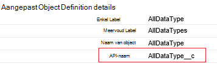
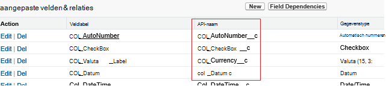

<properties
    pageTitle="Gegevens van de televergaderingen verplaatsen met behulp van Data Factory | Microsoft Azure"
    description="Informatie over het verplaatsen van gegevens uit de televergaderingen met behulp van Azure Data Factory."
    services="data-factory"
    documentationCenter=""
    authors="linda33wj"
    manager="jhubbard"
    editor="monicar"/>

<tags
    ms.service="data-factory"
    ms.workload="data-services"
    ms.tgt_pltfrm="na"
    ms.devlang="na"
    ms.topic="article"
    ms.date="10/25/2016"
    ms.author="jingwang"/>

# Gegevens van de televergaderingen verplaatsen met behulp van Azure Data Factory
In dit artikel wordt beschreven hoe u kopie activiteit in een fabriek Azure gegevens kunt gebruiken om gegevens te kopiëren van televergaderingen met een gegevensopslag die wordt vermeld onder de Sink-kolom in de tabel [ondersteunde bronnen en putten](data-factory-data-movement-activities.md#supported-data-stores) . Dit artikel is gebaseerd op het artikel [gegevensverplaatsing activiteiten](data-factory-data-movement-activities.md) activiteit kopiëren en gegevens ondersteunde archief combinaties een algemeen overzicht van de verplaatsing van gegevens biedt.

Azure Data Factory ondersteunt momenteel alleen verplaatst gegevens uit televergaderingen [ondersteunde sink gegevens stores]((data-factory-data-movement-activities.md#supported-data-stores), maar biedt geen ondersteuning voor het verplaatsen van gegevens uit de andere gegevens worden opgeslagen op televergaderingen.

## Vereisten
- Moet u een van de volgende edities van televergaderingen: Developer Edition, Professional Edition, Enterprise Edition of Unlimited Edition.
- API-machtiging moet worden ingeschakeld. Zie [hoe inschakelen API-toegang in de televergaderingen door de machtigingenset?](https://www.data2crm.com/migration/faqs/enable-api-access-salesforce-permission-set/)
- Om gegevens te kopiëren van televergaderingen tot gegevensarchieven voor gebouwen, moet er ten minste Data Management Gateway 2.0 is geïnstalleerd in uw omgeving op gebouwen.

## Verzoeklimieten televergaderingen
Televergaderingen heeft de grenswaarden voor totaal aantal aanvragen voor API en gelijktijdige API aanvragen. Zie het gedeelte "API aanvragen grenzen" in het artikel [Televergaderingen Developer limieten](http://resources.docs.salesforce.com/200/20/en-us/sfdc/pdf/salesforce_app_limits_cheatsheet.pdf) voor meer informatie. Opmerking Als het aantal gelijktijdige aanvragen de limiet overschrijdt, bandbreedtebeperking plaatsvindt en worden er willekeurig mislukken; Als het totale aantal aanvragen voor de limiet overschrijdt, is wordt de account televergaderingen geblokkeerd gedurende 24 uur; mogelijk ook het foutbericht 'REQUEST_LIMIT_EXCEEDED' in beide scenario's.

## Wizard gegevens kopiëren
De eenvoudigste manier om een pijpleiding die gegevens van televergaderingen naar een van de ondersteunde sink gegevensarchieven kopieert maken is met de wizard gegevens kopiëren. Zie [Zelfstudie: maken van een pijplijn met behulp van de Wizard kopiëren](data-factory-copy-data-wizard-tutorial.md) voor een snel overzicht over het maken van een pijplijn met behulp van de wizard gegevens kopiëren.

Het volgende voorbeeld wordt een monster JSON definities die u gebruiken kunt voor het maken van een pijplijn met behulp van de [portal Azure](data-factory-copy-activity-tutorial-using-azure-portal.md), [Azure PowerShell](data-factory-copy-activity-tutorial-using-powershell.md)of [Visual Studio](data-factory-copy-activity-tutorial-using-visual-studio.md). Ze laten zien hoe gegevens van televergaderingen naar Azure Blob-opslag te kopiëren. Gegevens kunnen echter worden gekopieerd naar een van de PUT vermelde [hier](data-factory-data-movement-activities.md#supported-data-stores) met behulp van de activiteit van de kopie in Azure Data Factory.   

## Voorbeeld: Gegevens kopiëren vanuit een televergaderingen een Azure blob
Dit voorbeeld kopieert gegevens van televergaderingen naar een Azure blob elk uur. De JSON-eigenschappen die worden gebruikt in de volgende voorbeelden worden na de voorbeelden in secties beschreven. U kunt gegevens rechtstreeks naar de put die worden vermeld in het artikel [gegevensverplaatsing activiteiten](data-factory-data-movement-activities.md#supported-data-stores) met behulp van de activiteit van de kopie in Azure Data Factory kopiëren.

Hier vindt u de Data Factory artefacten die u maken moet om het scenario implementeert. De secties die volgen op de lijst vindt informatie over deze stappen.

- Een gekoppelde service van het type [televergaderingen](#salesforce-linked-service-properties)
- Een gekoppelde service van het type [AzureStorage](data-factory-azure-blob-connector.md#azure-storage-linked-service-properties)
- Een [dataset](data-factory-create-datasets.md) -invoer van het type [RelationalTable](#salesforce-dataset-properties)
- Een output- [dataset](data-factory-create-datasets.md) van het type [AzureBlob](data-factory-azure-blob-connector.md#azure-blob-dataset-type-properties)
- Een [pijpleiding](data-factory-create-pipelines.md) met kopie activiteit die gebruikmaakt van [RelationalSource](#relationalsource-type-properties) en [BlobSink](data-factory-azure-blob-connector.md#azure-blob-copy-activity-type-properties)

**Gekoppeld televergaderingen service**

In dit voorbeeld gebruikt de **televergaderingen** gekoppeld. Zie de sectie [televergaderingen gekoppelde service](#salesforce-linked-service-properties) voor de eigenschappen die worden ondersteund door deze gekoppelde service.  Zie [security token ophalen](https://help.salesforce.com/apex/HTViewHelpDoc?id=user_security_token.htm) voor instructies over het opnieuw instellen of opvragen van het beveiligingstoken.

    {
        "name": "SalesforceLinkedService",
        "properties":
        {
            "type": "Salesforce",
            "typeProperties":
            {
                "username": "<user name>",
                "password": "<password>",
                "securityToken": "<security token>"
            }
        }
    }

**Azure gekoppeld opslagservice**

    {
      "name": "AzureStorageLinkedService",
      "properties": {
        "type": "AzureStorage",
        "typeProperties": {
          "connectionString": "DefaultEndpointsProtocol=https;AccountName=<accountname>;AccountKey=<accountkey>"
        }
      }
    }

**Televergaderingen invoer dataset**

    {
        "name": "SalesforceInput",
        "properties": {
            "linkedServiceName": "SalesforceLinkedService",
            "type": "RelationalTable",
            "typeProperties": {
                "tableName": "AllDataType__c"  
            },
            "availability": {
                "frequency": "Hour",
                "interval": 1
            },
            "external": true,
            "policy": {
                "externalData": {
                    "retryInterval": "00:01:00",
                    "retryTimeout": "00:10:00",
                    "maximumRetry": 3
                }
            }
        }
    }

De Data Factory-service **externe** instelt op **true** te informeren dat de dataset de fabriek gegevens buiten en niet wordt geproduceerd door een activiteit in de fabriek van gegevens.

> [AZURE.IMPORTANT] Het "__c" deel van de naam van de API is voor een aangepast object nodig.

**Azure blob uitvoer dataset**

Gegevens worden weggeschreven naar een nieuwe blob elk uur (frequentie: uur, interval: 1).

    {
        "name": "AzureBlobOutput",
        "properties":
        {
            "type": "AzureBlob",
            "linkedServiceName": "AzureStorageLinkedService",
            "typeProperties":
            {
                "folderPath": "adfgetstarted/alltypes_c"
            },
            "availability":
            {
                "frequency": "Hour",
                "interval": 1
            }
        }
    }

**Pijpleiding met activiteit kopiëren**

De pijplijn bevat kopie activiteit, die is geconfigureerd voor het gebruik van de bovenstaande invoer en uitvoer van datasets, en elk uur is gepland. In de pipeline JSON-definitie, **het type** is ingesteld op **RelationalSource**en de **sink** -type is ingesteld op **BlobSink**.

Zie [Eigenschappen van het RelationalSource](#relationalsource-type-properties) voor de lijst met eigenschappen die worden ondersteund door de RelationalSource.

    {  
        "name":"SamplePipeline",
        "properties":{  
            "start":"2016-06-01T18:00:00",
            "end":"2016-06-01T19:00:00",
            "description":"pipeline with copy activity",
            "activities":[  
            {
                "name": "SalesforceToAzureBlob",
                "description": "Copy from Salesforce to an Azure blob",
                "type": "Copy",
                "inputs": [
                {
                    "name": "SalesforceInput"
                }
                ],
                "outputs": [
                {
                    "name": "AzureBlobOutput"
                }
                ],
                "typeProperties": {
                    "source": {
                        "type": "RelationalSource",
                        "query": "SELECT Id, Col_AutoNumber__c, Col_Checkbox__c, Col_Currency__c, Col_Date__c, Col_DateTime__c, Col_Email__c, Col_Number__c, Col_Percent__c, Col_Phone__c, Col_Picklist__c, Col_Picklist_MultiSelect__c, Col_Text__c, Col_Text_Area__c, Col_Text_AreaLong__c, Col_Text_AreaRich__c, Col_URL__c, Col_Text_Encrypt__c, Col_Lookup__c FROM AllDataType__c"             
                    },
                    "sink": {
                        "type": "BlobSink"
                    }
                },
                "scheduler": {
                    "frequency": "Hour",
                    "interval": 1
                },
                "policy": {
                    "concurrency": 1,
                    "executionPriorityOrder": "OldestFirst",
                    "retry": 0,
                    "timeout": "01:00:00"
                }
            }
            ]
        }
    }

> [AZURE.IMPORTANT] Het "__c" deel van de naam van de API is voor een aangepast object nodig.

## Eigenschappen van gekoppelde televergaderingen service

De volgende tabel vindt u beschrijvingen voor JSON-elementen die specifiek voor de service televergaderingen gekoppeld zijn.

| Eigenschap | Beschrijving | Vereist |
| -------- | ----------- | -------- |
| type | De eigenschap type moet worden ingesteld op: **televergaderingen**. | Ja |
| gebruikersnaam |Geef een naam voor de gebruikersaccount. | Ja |
| wachtwoord | Geef een wachtwoord voor de gebruikersaccount.  | Ja |
| securityToken | Een beveiligingstoken voor de gebruikersaccount opgeven. Zie [security token ophalen](https://help.salesforce.com/apex/HTViewHelpDoc?id=user_security_token.htm) voor instructies over hoe u een beveiligingssleutel opnieuw instellen of opvragen. Zie informatie over beveiligingstokens in het algemeen, [beveiliging en de API](https://developer.salesforce.com/docs/atlas.en-us.api.meta/api/sforce_api_concepts_security.htm).  | Ja |

## Eigenschappen van de dataset televergaderingen

Zie het artikel [gegevenssets maken](data-factory-create-datasets.md) voor een volledige lijst van de eigenschappen die beschikbaar zijn voor het definiëren van datasets en secties. Secties zoals structuur, beschikbaarheid en het beleid van een dataset JSON zijn vergelijkbaar voor alle typen dataset (Azure blob Azure SQL Azure tabel en enzovoort).

De sectie **typeProperties** verschilt voor elk type dataset en vindt u informatie over de locatie van de gegevens in het gegevensarchief. De sectie typeProperties voor een dataset van het type **RelationalTable** heeft de volgende eigenschappen:

| Eigenschap | Beschrijving | Vereist |
| -------- | ----------- | -------- |
| Tabelnaam | De naam van de tabel in de televergaderingen. | Nee (als een **query** van de **RelationalSource** is opgegeven) |

> [AZURE.IMPORTANT]  Het "__c" deel van de naam van de API is voor een aangepast object nodig.

## RelationalSource eigenschappen

Zie het artikel [pijpleidingen maken](data-factory-create-pipelines.md) voor een volledige lijst van de eigenschappen die beschikbaar zijn voor het definiëren van activiteiten en secties. Eigenschappen, zoals naam, beschrijving, input en output-tabellen en verschillende beleidsmaatregelen zijn beschikbaar voor alle typen activiteiten.

De eigenschappen die beschikbaar in de sectie typeProperties van de activiteit zijn, variëren aan de andere kant, met elk activiteitstype. Activiteit kopiëren verschillen ze afhankelijk van de typen bronnen en putten.

Kopie activiteit, wanneer de bron van het type **RelationalSource** (waaronder televergaderingen), zijn de volgende eigenschappen beschikbaar in de sectie typeProperties:

| Eigenschap | Beschrijving | Toegestane waarden | Vereist |
| -------- | ----------- | -------------- | -------- |
| query | De aangepaste query gebruiken om gegevens te lezen. | Een SQL-92-query of query [Televergaderingen Object Query Language (SOQL)](https://developer.salesforce.com/docs/atlas.en-us.soql_sosl.meta/soql_sosl/sforce_api_calls_soql.htm) . Bijvoorbeeld: `select * from MyTable__c`. | Nee (als de **tabelnaam** van de **dataset** is opgegeven) |

> [AZURE.IMPORTANT] Het "__c" deel van de naam van de API is voor een aangepast object nodig.

## Tips voor query

### Ophalen van gegevens waar u met component op datum/tijd-kolom
Wanneer de SOQL of SQL-query, rekening gehouden met het verschil DateTime-indeling opgeven. Bijvoorbeeld:

- **SOQL voorbeeld**: $$Text.Format (' SCHAKEL-Id, naam, BillingCity van Account waar LastModifiedDate > = {0:yyyy-MM-ddTHH} en LastModifiedDate < {1:yyyy-MM-ddTHH}', WindowStart, WindowEnd)
- **Voorbeeld SQL**: $$Text.Format ("Selecteer * uit Account waar LastModifiedDate > = {{ts\'{0:yyyy-MM-dd: mm: SS}\'}} en LastModifiedDate < {{ts\'{1:yyyy-MM-dd: mm: SS}\'}}', WindowStart, WindowEnd)'.

### Ophalen van gegevens uit het rapport televergaderingen
U kunt gegevens ophalen uit televergaderingen rapporten door te geven van de query als `{call "<report name>"}`, bv. `"query": "{call \"TestReport\"}"`.

### Ophalen van records verwijderd uit Prullenbak van televergaderingen
De zachte verwijderde records uit televergaderingen Prullenbak opvraagt, kunt u **' IsDeleted = 1 "** in uw query. Bijvoorbeeld: 

- Alleen verwijderde records opvraagt, geeft u ' selecteert *in de MyTable__c * *waarbij IsDeleted = 1** "
- Alle met inbegrip van de bestaande en de verwijderde records opvraagt, geeft u ' selecteert *in de MyTable__c * *waar IsDeleted = 0 of IsDeleted = 1** "

[AZURE.INCLUDE [data-factory-structure-for-rectangualr-datasets](../../includes/data-factory-structure-for-rectangualr-datasets.md)]

### Toewijzing van het type televergaderingen
Type televergaderingen | . Op basis van een NET-type
--------------- | ---------------
Automatisch nummeren | Tekenreeks
CheckBox | Boole-waarde
Valuta | Getal met dubbele precisie
Datum | Datum/tijd
Datum/tijd | Datum/tijd
E-mail | Tekenreeks
ID | Tekenreeks
Relatie zoeken | Tekenreeks
Keuzelijst met meerdere keuzemogelijkheden | Tekenreeks
Nummer | Getal met dubbele precisie
Procent | Getal met dubbele precisie
Telefoon | Tekenreeks
Selectielijst | Tekenreeks
Tekst | Tekenreeks
Tekstgebied | Tekenreeks
Tekstgebied (lang) | Tekenreeks
Tekstgebied (RTF) | Tekenreeks
Tekst (gecodeerd) | Tekenreeks
URL | Tekenreeks

[AZURE.INCLUDE [data-factory-column-mapping](../../includes/data-factory-column-mapping.md)]
[AZURE.INCLUDE [data-factory-structure-for-rectangualr-datasets](../../includes/data-factory-structure-for-rectangualr-datasets.md)]

## Prestatie en afstemming  
Zie de [prestaties van de activiteit van de kopie en tuning guide voor meer informatie over de belangrijkste factoren die prestaties gevolgen van verplaatsing van gegevens (kopiëren activiteit) in Azure Data Factory en verschillende manieren optimaliseren.](data-factory-copy-activity-performance.md)
