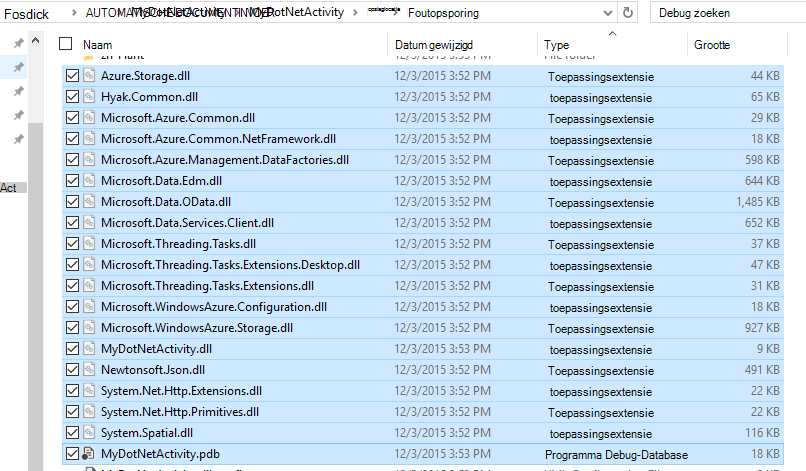
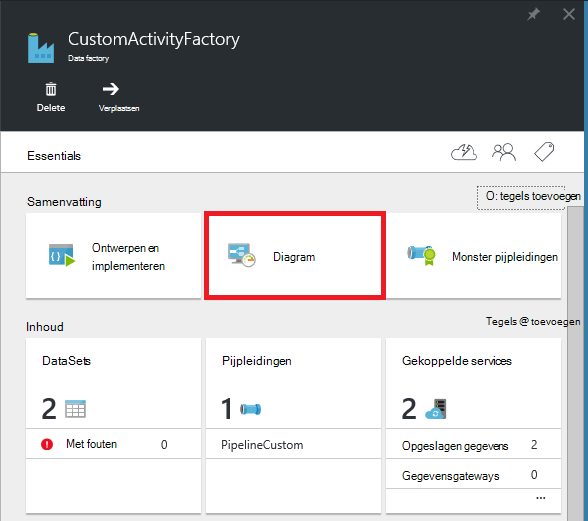
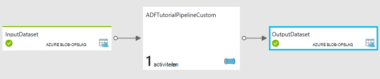
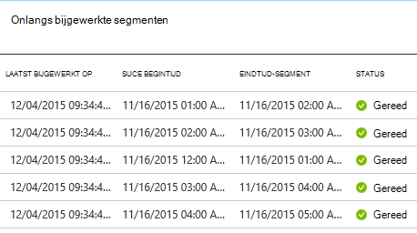
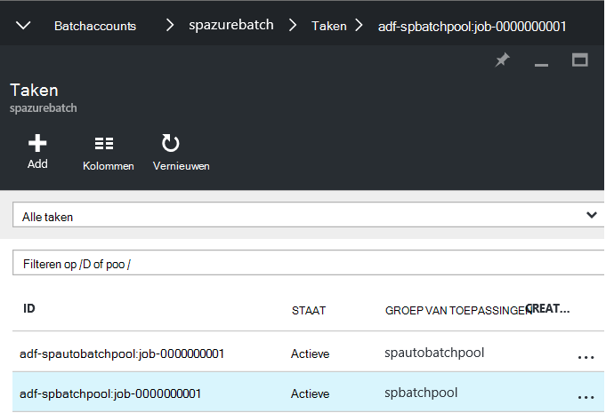
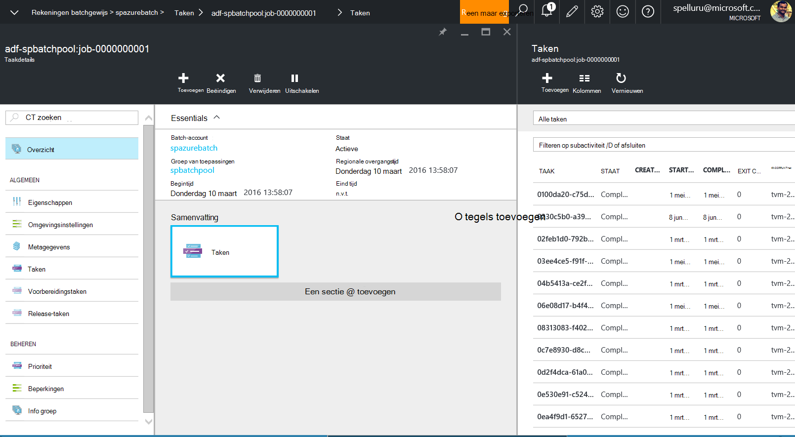
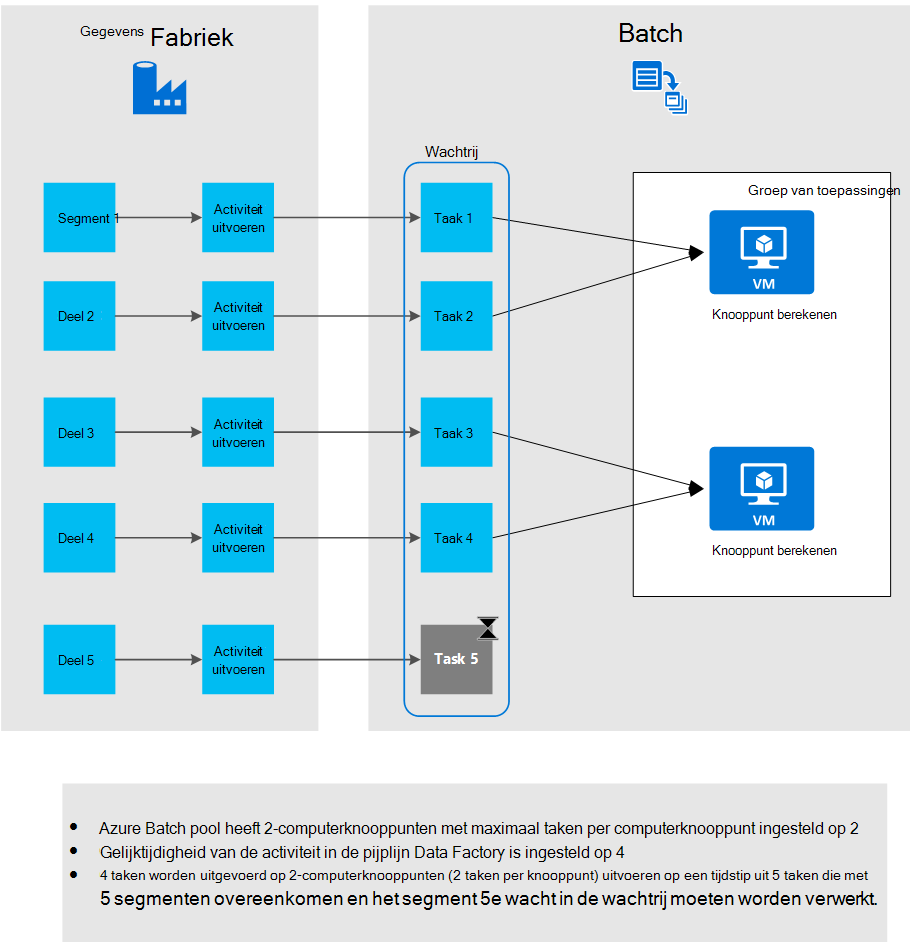

<properties
    pageTitle="Aangepaste activiteiten in een pijpleiding Azure Data Factory gebruiken"
    description="Informatie over het maken van aangepaste activiteiten en deze gebruiken in een pijpleiding Azure Data Factory."
    services="data-factory"
    documentationCenter=""
    authors="spelluru"
    manager="jhubbard"
    editor="monicar"/>

<tags
    ms.service="data-factory"
    ms.workload="data-services"
    ms.tgt_pltfrm="na"
    ms.devlang="na"
    ms.topic="article"
    ms.date="10/17/2016"
    ms.author="spelluru"/>

# Aangepaste activiteiten in een pijpleiding Azure Data Factory gebruiken
> [AZURE.SELECTOR]
[Component](data-factory-hive-activity.md)  
[Varken](data-factory-pig-activity.md)  
[MapReduce](data-factory-map-reduce.md)  
[Streaming Hadoop](data-factory-hadoop-streaming-activity.md)
[Machine Learning](data-factory-azure-ml-batch-execution-activity.md) 
[Opgeslagen Procedure](data-factory-stored-proc-activity.md)
[Gegevens Lake Analytics U SQL](data-factory-usql-activity.md)
[.NET aangepaste](data-factory-use-custom-activities.md)

Er zijn twee soorten activiteiten die u in een pijpleiding Azure Data Factory gebruiken kunt.
 
- [Data verkeer activiteiten](data-factory-data-movement-activities.md) om gegevens te verplaatsen tussen de [opgeslagen gegevens wordt ondersteund](data-factory-data-movement-activities.md#supported-data-stores).
- [Data Transformation activiteiten](data-factory-data-transformation-activities.md) met het gebruik van de gegevens transformeren/proces wordt berekend als Azure, HDInsight, Batch Azure en Azure Machine Learning. Bijvoorbeeld: HDInsight component en Machine Learning Batch worden uitgevoerd.  

Als u gegevens uit een gegevensarchief dat niet wordt ondersteund door Azure Data Factory verplaatsen, kunt u een aangepaste activiteit met .NET maken met uw eigen gegevensverplaatsing logica en gebruik van de activiteit in de pijplijn. 

Op dezelfde manier als u nodig hebt om gegevens op een manier die niet wordt ondersteund door Data Factory transformatie/proces, kunt u een aangepaste activiteit maken met uw eigen logica gegevensverwerking en gebruik van de activiteit in de pijplijn.

> [AZURE.NOTE] Data Management Gateway ondersteunt op dit moment alleen de kopie en opgeslagen procedure activiteit in Data Factory. Het is niet mogelijk met behulp van de gateway van een aangepaste activiteit toegang tot gegevensbronnen op gebouwen.
 
U kunt de aangepaste .NET activiteit uit te voeren met behulp van een **Batch Azure** service of een **Azure HDInsight** cluster configureren.   

De volgende procedure biedt stapsgewijze instructies voor het maken van een aangepaste activiteit voor .NET en het gebruik van aangepaste activiteit in een pijpleiding. Het scenario gebruikt de **Azure Batch** gekoppeld. Gebruik de Azure HDInsight gekoppeld service in plaats daarvan, maakt u een gekoppelde service van het type **HDInsight** (als u uw eigen cluster HDInsight) of **HDInsightOnDemand** (als u wilt dat gegevens fabriek voor het maken van een HDInsight cluster op aanvraag) en gebruiken in de sectie activiteit van de pijpleiding JSON (**linkedServiceName**). Zie sectie [Gebruik Azure HDInsight gekoppelde services](#use-azure-hdinsight-linked-services) voor meer informatie over Azure HDInsight aangepaste activiteit uitvoeren.

> [AZURE.IMPORTANT] 4.5.2 versie van .NET Framework als het kader van het doel voor uw .NET aangepaste activiteit-project in Visual Studio. Data Factory biedt geen ondersteuning voor aangepaste activiteiten opgesteld ten opzichte van de versies van .NET Framework 4.5.2 uiterlijk.   

## Stapsgewijze instructies 

### Vereisten

- Visual Studio 2012/2013/2015
- Download en installeer [Azure.NET SDK][azure-developer-center]

### Azure Batch-vereisten
In dit overzicht, kunt u uw aangepaste .NET activiteiten Azure Batch gebruik als een compute-bron uitvoeren. Zie [Basisbeginselen Azure Batch] [ batch-technical-overview] voor een overzicht van de Batch Azure service en Zie [Aan de slag met de bibliotheek Azure Batch voor .NET] [ batch-get-started] om snel aan de slag met de batchverwerking Azure service.

Voor de zelfstudie moet u een Batch Azure-account maken met een groep van VMs. Hier zijn de stappen:

1. Maak een **Batch Azure rekening** met de [Azure portal](http://manage.windowsazure.com). Zie [maken en beheren van een rekening Azure Batch] [ batch-create-account] artikel voor instructies. Let op de sleutel Azure Batch account naam en account.

    U kunt ook [Nieuwe AzureBatchAccount] [ new-azure-batch-account] cmdlet een Batch Azure-account te maken. [Met behulp van Azure PowerShell naar Azure Batch Account beheren] Zie[ azure-batch-blog] voor gedetailleerde instructies over het gebruik van deze cmdlet.
2. Maak een **groep Azure Batch**.
    1. Klik op **Bladeren** in het linkermenu in [Azure portal](https://portal.azure.com)en op **Batch-Accounts**. 
    2. Selecteer uw account Azure Batch de blade **Batch Account** openen. 
    3. Klik op **groepen** naast elkaar.
    4. Klik op de knop toevoegen op de werkbalk om een groep toevoegen in het blad **van toepassingen** .
        1. Voer een ID voor de groep van toepassingen (**Pool-ID**). Opmerking de **ID van de groep**; moet u bij het maken van de Data Factory-oplossing. 
        2. **Windows Server 2012 R2** opgeven voor de instelling van de besturingssystemen.
        3. Selecteer een **knooppunt prijzen laag**. 
        3. Geef **2** op als waarde voor de instelling van **Specifieke doel** .
        4. Geef **2** op als waarde voor de instelling **maximum aantal taken per knooppunt** .
    5. Klik op **OK** om de groep te maken. 
 
    U kunt ook de cmdlet [New-AzureBatchPool](https://msdn.microsoft.com/library/mt628690.aspx) een Batch Azure-toepassingen maken.    

### Stappen op hoog niveau 
1.  **Een aangepaste activiteit maakt** gebruik van een pijpleiding Data Factory. De aangepaste activiteit in dit voorbeeld bevat de logica van de transformatie/verwerking van gegevens. 
    1.  In Visual Studio .NET Class Library-project maken en toevoegen van de code voor het verwerken van de ingevoerde gegevens compileren van het project. 
    2.  De binaire bestanden en de (optionele) PDB-bestand in de uitvoermap zip.  
    3.  Upload het zip-bestand naar Azure blob-opslag. Gedetailleerde stappen zijn in de maken de sectie aangepaste activiteit. 
2. **Een Azure data factory genoemd die gebruikmaakt van de aangepaste activiteit maken**:
    1. Maak een Azure data factory genoemd.
    2. Gekoppelde services maken.
        1. AzureStorageLinkedService: Opslag van referenties voor toegang tot de BLOB's levert.
        2. AzureBatchLinkedService: Hiermee geeft u de Batch Azure zoals berekenen.
    3. Gegevenssets maken.
        1. InputDataset: Hiermee geeft u de opslag container en de map voor de invoer BLOB's.
        1. OuputDataset: Hiermee geeft u de opslag container en de map voor de uitvoer BLOB's.
    2. Een pijpleiding die gebruikmaakt van de aangepaste activiteit maken.
    3. Uitvoeren en testen van de pijpleiding.
    4. Fouten opsporen in de pijplijn.

## Maak de aangepaste activiteit
Maken van een aangepaste activiteit .NET, maken een **.NET Class Library** -project met een klasse die die **IDotNetActivity** -interface implementeert. Deze interface heeft slechts één methode: [uitvoeren](https://msdn.microsoft.com/library/azure/mt603945.aspx) en de handtekening is:

    public IDictionary<string, string> Execute(
            IEnumerable<LinkedService> linkedServices, 
            IEnumerable<Dataset> datasets, 
            Activity activity, 
            IActivityLogger logger)
        

De methode bestaat uit vier parameters:

- **linkedServices**. Deze eigenschap wordt een overzicht lijst met gekoppelde services die invoer/uitvoer-gegevensbronnen koppelen (bijvoorbeeld: Azure Blob-opslag) om de data factory genoemd. In dit voorbeeld is er slechts één gekoppelde service van het type Azure opslag die wordt gebruikt voor invoer en -uitvoer. 
- **datasets**. Deze eigenschap is een lijst met een overzicht van datasets. Met deze parameter kunt u de locaties en de schema's die zijn gedefinieerd door de invoer en uitvoer datasets.
- **activiteit**. Deze eigenschap geeft de huidige compute entiteit - in dit geval een Batch Azure.
- **logger**. Dit object kunt u debug-opmerkingen die oppervlakte schrijven als het logboek 'Gebruiker' voor de pijplijn. 

De methode retourneert een woordenlijst die kan worden gebruikt om de keten van aangepaste activiteiten in de toekomst. Deze functie is nog niet geïmplementeerd is, dus een lege woordenboek van de methode.  

### Procedure 
1.  Maak een **.NET Class Library** -project.
    <ol type="a">
        <li>Start <b>Visual Studio 2015</b> of <b>Visual Studio 2013</b> of <b>Visual Studio 2012</b>.</li>
        <li>Klik op <b>bestand</b>, wijs <b>Nieuw</b>aan en klik op <b>Project</b>.</li>
        <li><b>Sjablonen</b>en selecteer <b>Visual C#</b>. In dit scenario maakt u gebruik van C#, maar kunt u een .NET-taal voor het ontwikkelen van aangepaste activiteit.</li>
        <li><b>Class-bibliotheek</b> in de lijst met projecttypen aan de rechterkant selecteren.</li>
        <li><b>MyDotNetActivity</b> voor de <b>naam</b>invoeren.</li>
        <li><b>C:\ADFGetStarted</b> voor de <b>locatie</b>selecteren.</li>
        <li>Klik op <b>OK</b> om het project te maken.</li>
    </ol>
2.  Klik op **Extra**en klik op **Package Manager-Console**wijs **NuGet Package Manager**.
3.  In de Package Manager-Console worden uitgevoerd met de volgende opdracht voor het importeren van **Microsoft.Azure.Management.DataFactories**.

        Install-Package Microsoft.Azure.Management.DataFactories

4. Het pakket **Azure opslag** NuGet in het project importeren.

        Install-Package Azure.Storage

5. De volgende instructies voor het **gebruik van** toevoegen aan het bronbestand in het project.

        using System.IO;
        using System.Globalization;
        using System.Diagnostics;
        using System.Linq;

        using Microsoft.Azure.Management.DataFactories.Models;
        using Microsoft.Azure.Management.DataFactories.Runtime;

        using Microsoft.WindowsAzure.Storage;
        using Microsoft.WindowsAzure.Storage.Blob;

6. Wijzig de naam van de **naamruimte** in de **MyDotNetActivityNS**.

        namespace MyDotNetActivityNS

7. Wijzig de naam van de klasse in **MyDotNetActivity** en afgeleid uit de **IDotNetActivity** -interface, zoals in het volgende codefragment:

        public class MyDotNetActivity : IDotNetActivity

8. Implementeren (toevoegen) de **Execute** -methode van de **IDotNetActivity** -interface aan de klasse **MyDotNetActivity** en kopieer de volgende code voor de methode.

    In het volgende voorbeeld wordt het aantal exemplaren van de zoekterm ("Microsoft") in elke blob is gekoppeld aan een segment geteld. 

        /// 

        /// Execute method is the only method of IDotNetActivity interface you must implement. 
        /// In this sample, the method invokes the Calculate method to perform the core logic.  
        /// 

        public IDictionary<string, string> Execute(
            IEnumerable<LinkedService> linkedServices,
            IEnumerable<Dataset> datasets,
            Activity activity,
            IActivityLogger logger)
        {
            // to get extended properties (for example: SliceStart)
            DotNetActivity dotNetActivity = (DotNetActivity)activity.TypeProperties;
            string sliceStartString = dotNetActivity.ExtendedProperties["SliceStart"];

            // to log all extended properties           
            IDictionary<string, string> extendedProperties = dotNetActivity.ExtendedProperties;
            logger.Write("Logging extended properties if any...");
            foreach (KeyValuePair<string, string> entry in extendedProperties)
            {
                logger.Write("<key:{0}> <value:{1}>", entry.Key, entry.Value);
            }
        
            // declare types for input and output data stores
            AzureStorageLinkedService inputLinkedService;

            // declare dataset types
            CustomDataset inputLocation;
            AzureBlobDataset outputLocation;

            Dataset inputDataset = datasets.Single(dataset => dataset.Name == activity.Inputs.Single().Name);
            inputLocation = inputDataset.Properties.TypeProperties as CustomDataset;

            foreach (LinkedService ls in linkedServices)
                logger.Write("linkedService.Name {0}", ls.Name);

            // using First method instead of Single since we are using the same 
            // Azure Storage linked service for input and output. 
            inputLinkedService = linkedServices.First(
                linkedService =>
                linkedService.Name ==
                inputDataset.Properties.LinkedServiceName).Properties.TypeProperties
                as AzureStorageLinkedService;

            string connectionString = inputLinkedService.ConnectionString; 

            // To create an input storage client.
            string folderPath = GetFolderPath(inputDataset);
            string output = string.Empty; // for use later.

            // create storage client for input. Pass the connection string.
            CloudStorageAccount inputStorageAccount = CloudStorageAccount.Parse(connectionString);
            CloudBlobClient inputClient = inputStorageAccount.CreateCloudBlobClient();

            // initialize the continuation token before using it in the do-while loop.
            BlobContinuationToken continuationToken = null;
            do
            {   // get the list of input blobs from the input storage client object.
                BlobResultSegment blobList = inputClient.ListBlobsSegmented(folderPath,
                                         true,
                                         BlobListingDetails.Metadata,
                                         null,
                                         continuationToken,
                                         null,
                                         null);
                
                // Calculate method returns the number of occurrences of 
                // the search term (“Microsoft”) in each blob associated
                // with the data slice. definition of the method is shown in the next step.
 
                output = Calculate(blobList, logger, folderPath, ref continuationToken, "Microsoft");

            } while (continuationToken != null);

            // get the output dataset using the name of the dataset matched to a name in the Activity output collection.
            Dataset outputDataset = datasets.Single(dataset => dataset.Name == activity.Outputs.Single().Name);
            // convert to blob location object.
            outputLocation = outputDataset.Properties.TypeProperties as AzureBlobDataset;

            folderPath = GetFolderPath(outputDataset);

            logger.Write("Writing blob to the folder: {0}", folderPath);

            // create a storage object for the output blob.
            CloudStorageAccount outputStorageAccount = CloudStorageAccount.Parse(connectionString);
            // write the name of the file. 
            Uri outputBlobUri = new Uri(outputStorageAccount.BlobEndpoint, folderPath + "/" + GetFileName(outputDataset));

            logger.Write("output blob URI: {0}", outputBlobUri.ToString());
            // create a blob and upload the output text.
            CloudBlockBlob outputBlob = new CloudBlockBlob(outputBlobUri, outputStorageAccount.Credentials);
            logger.Write("Writing {0} to the output blob", output);
            outputBlob.UploadText(output);

            // The dictionary can be used to chain custom activities together in the future.
            // This feature is not implemented yet, so just return an empty dictionary.  

            return new Dictionary<string, string>();
        }

9. Voeg de volgende methoden. De methode **Execute** roept deze methoden. De methode **GetConnectionString** haalt de verbindingsreeks Azure opslag en de methode **GetFolderPath** haalt de locatie van de blob. De methode **Calculate** geïsoleerd belangrijker is, de code die elke blob doorlopen.

        /// 

        /// Gets the folderPath value from the input/output dataset.
        /// 

        private static string GetFolderPath(Dataset dataArtifact)
        {
            if (dataArtifact == null || dataArtifact.Properties == null)
            {
                return null;
            }

            AzureBlobDataset blobDataset = dataArtifact.Properties.TypeProperties as AzureBlobDataset;
            if (blobDataset == null)
            {
                return null;
            }

            return blobDataset.FolderPath;
        }

        /// 

        /// Gets the fileName value from the input/output dataset.   
        /// 

        private static string GetFileName(Dataset dataArtifact)
        {
            if (dataArtifact == null || dataArtifact.Properties == null)
            {
                return null;
            }

            AzureBlobDataset blobDataset = dataArtifact.Properties.TypeProperties as AzureBlobDataset;
            if (blobDataset == null)
            {
                return null;
            }

            return blobDataset.FileName;
        }

        /// 

        /// Iterates through each blob (file) in the folder, counts the number of instances of search term in the file, 
        /// and prepares the output text that is written to the output blob. 
        /// 

        public static string Calculate(BlobResultSegment Bresult, IActivityLogger logger, string folderPath, ref BlobContinuationToken token, string searchTerm)
        {
            string output = string.Empty;
            logger.Write("number of blobs found: {0}", Bresult.Results.Count<IListBlobItem>());
            foreach (IListBlobItem listBlobItem in Bresult.Results)
            {
                CloudBlockBlob inputBlob = listBlobItem as CloudBlockBlob;
                if ((inputBlob != null) && (inputBlob.Name.IndexOf("$$$.$$$") == -1))
                {
                    string blobText = inputBlob.DownloadText(Encoding.ASCII, null, null, null);
                    logger.Write("input blob text: {0}", blobText);
                    string[] source = blobText.Split(new char[] { '.', '?', '!', ' ', ';', ':', ',' }, StringSplitOptions.RemoveEmptyEntries);
                    var matchQuery = from word in source
                                     where word.ToLowerInvariant() == searchTerm.ToLowerInvariant()
                                     select word;
                    int wordCount = matchQuery.Count();
                    output += string.Format("{0} occurrences(s) of the search term \"{1}\" were found in the file {2}.\r\n", wordCount, searchTerm, inputBlob.Name);
                }
            }
            return output;
        }

    De methode GetFolderPath retourneert het pad naar de map die de dataset naar verwijst en de getfilename, methode geeft als resultaat de naam van de blob of het bestand dat de dataset naar verwijst. Als u havefolderPath worden gedefinieerd met behulp van variabelen zoals {jaar}, {maand}, {dag} enz., de methode geeft als resultaat de tekenreeks zoals deze is zonder deze te vervangen met de runtime waarden. Zie de sectie [toegang tot uitgebreide eigenschappen](#access-extended-properties) voor meer informatie over de toegang tot SliceStart, SliceEnd, enz.    
    
            "name": "InputDataset",
            "properties": {
                "type": "AzureBlob",
                "linkedServiceName": "AzureStorageLinkedService",
                "typeProperties": {
                    "fileName": "file.txt",
                    "folderPath": "adftutorial/inputfolder/",
    
    De methode Calculate berekent het aantal exemplaren van Microsoft in de invoerbestanden (in de map BLOB's) voor een trefwoord. De zoekterm ("Microsoft") is hardcoded in de code.

10. Compileer het project. Klik op **Opbouwen** in het menu en klik op de **Oplossing bouwen**.

    > [AZURE.IMPORTANT] 4.5.2 versie van .NET Framework als het kader van het doel van het project: klik met de rechtermuisknop op het project en klik op **Eigenschappen** om het kader van het doel. Data Factory biedt geen ondersteuning voor aangepaste activiteiten opgesteld ten opzichte van de versies van .NET Framework 4.5.2 uiterlijk. 
11. Start **Windows Verkenner**en navigeer naar de map **bin\debug** of **bin\release** afhankelijk van het type build.
12. Maak een zipbestand **MyDotNetActivity.zip** met de binaire bestanden in de <project folder>\bin\Debug map. U kunt het bestand **MyDotNetActivity.pdb** opnemen zodat u aanvullende gegevens zoals het nummer in de broncode die het probleem veroorzaakt, als er een fout is. Alle bestanden in het zip-bestand voor aangepaste activiteit moet zijn op het **hoogste niveau** met geen submappen.

    
13. **MyDotNetActivity.zip** als een blob met de container blob uploaden: **customactivitycontainer** in de Azure blobopslag dat de **AzureStorageLinkedService** -service in de **ADFTutorialDataFactory** gekoppeld wordt gebruikt.  De blob container **customactivitycontainer** maken als deze nog niet bestaat.

> [AZURE.NOTE] Als u dit project .NET activiteit toevoegen aan een oplossing in Visual Studio met een Data Factory-project en een verwijzing naar .NET activiteit project vanuit de project Data Factory toepassing toevoegt, hoeft u niet de laatste twee stappen van het handmatig maken van het zip-bestand en uploaden naar de Azure blobopslag. Wanneer u met behulp van Visual Studio Data Factory-entiteiten publiceert, worden deze stappen automatisch gedaan door het publicatieproces. Zie artikelen [bouwen uw eerste pijpleiding met behulp van Visual Studio](data-factory-build-your-first-pipeline-using-vs.md) en [Azure Blob Azure SQL-gegevens kopiëren](data-factory-copy-activity-tutorial-using-visual-studio.md) voor meer informatie over het maken en publiceren van Data Factory entiteiten met behulp van Visual Studio.  

### Execute, methode

Deze sectie bevat meer details en opmerkingen over de code in de methode **Execute** .
 
1. De leden voor de invoer-collectie doorlopen worden gevonden in de naamruimte [Microsoft.WindowsAzure.Storage.Blob](https://msdn.microsoft.com/library/azure/microsoft.windowsazure.storage.blob.aspx) . De blob-collectie doorlopen, moet met behulp van de klasse **BlobContinuationToken** . In principe moet u een do-while: lus met de token als het mechanisme voor het verlaten van de lus. Zie voor meer informatie [hoe u Blob-opslag van .NET](../storage/storage-dotnet-how-to-use-blobs.md). Hier ziet u een eenvoudige lus:

        // Initialize the continuation token.
        BlobContinuationToken continuationToken = null;
        do
        {   
            // Get the list of input blobs from the input storage client object.
            BlobResultSegment blobList = inputClient.ListBlobsSegmented(folderPath,
                                      true,
                                      BlobListingDetails.Metadata,
                                      null,
                                      continuationToken,
                                      null,
                                      null);
            // Return a string derived from parsing each blob.
            output = Calculate(blobList, logger, folderPath, ref continuationToken, "Microsoft");
        } while (continuationToken != null);

    Raadpleeg de documentatie voor de methode [ListBlobsSegmented](https://msdn.microsoft.com/library/jj717596.aspx) voor meer informatie.

2.  De code voor het werken via een verzameling BLOB's logisch gaat binnen de do-while: lus. In de **Execute** -methode, de-terwijl lus de lijst met blobs een methode met de naam **berekenen geeft**. De methode retourneert een string-variabele met de naam **uitvoer** is het resultaat van dat herhaald door middel van alle BLOB's in het segment. 

    Wordt het aantal exemplaren van de zoekterm (**Microsoft**) in de blob doorgegeven aan de methode **berekenen** . 

            output += string.Format("{0} occurrences of the search term \"{1}\" were found in the file {2}.\r\n", wordCount, searchTerm, inputBlob.Name);

3.  Als de methode **Calculate** heeft het werk gedaan, moet het worden geschreven naar een nieuwe blob. Voor elke set van BLOB's verwerkt, kan een nieuwe blob dus worden geschreven met de resultaten. Als u wilt schrijven naar een nieuwe blob, eerst de dataset uitvoer vinden. 

            // Get the output dataset using the name of the dataset matched to a name in the Activity output collection.
            Dataset outputDataset = datasets.Single(dataset => dataset.Name == activity.Outputs.Single().Name);

            // Convert to blob location object.
            outputLocation = outputDataset.Properties.TypeProperties as AzureBlobDataset;

4.  De code wordt ook een: **GetFolderPath** voor het ophalen van het pad (de containernaam van opslag).
 
            folderPath = GetFolderPath(outputDataset);

    De **GetFolderPath** werpt het DataSet-object aan een AzureBlobDataSet die een eigenschap met de naam FolderPath.
            
            AzureBlobDataset blobDataset = dataArtifact.Properties.TypeProperties as AzureBlobDataset;
            
            return blobDataset.FolderPath;

5.  De code roept de **getfilename,** methode voor het ophalen van de naam van het bestand (blob-naam).  

            AzureBlobDataset blobDataset = dataArtifact.Properties.TypeProperties as AzureBlobDataset;

            return blobDataset.FileName;

6.  De naam van het bestand wordt geschreven door een URI-object te maken. De URI-constructor gebruikt de eigenschap **BlobEndpoint** als resultaat de containernaam. Naam van de map en de bestandsnaam te maken van de uitvoer blob URI worden toegevoegd.  

            // Write the name of the file. 
            Uri outputBlobUri = new Uri(outputStorageAccount.BlobEndpoint, folderPath + "/" + GetFileName(outputDataset));

7.  De naam van het bestand is geschreven en nu kunt u de uitvoertekenreeks van de methode Calculate schrijven naar een nieuwe blob:

            // Create a blob and upload the output text.
            CloudBlockBlob outputBlob = new CloudBlockBlob(outputBlobUri, outputStorageAccount.Credentials);
            logger.Write("Writing {0} to the output blob", output);
            outputBlob.UploadText(output);

## De data factory met Azure portal maken

In de sectie **aangepaste activiteit maakt** een aangepaste activiteit gemaakt en met binaire bestanden in het zip-bestand en de PDB-bestand geüpload naar een container Azure blob. In dit gedeelte maakt u een Azure **data factory** met een **pijpleiding** die de **aangepaste activiteit**wordt gebruikt.
 
De dataset input voor de aangepaste activiteit geeft de BLOB's (bestanden) in de input-map (adftutorial\inputfolder) in de blob-opslag. De dataset uitvoer voor de activiteit geeft de output BLOB's in de uitvoermap (adftutorial\outputfolder) in de blobopslag. 

Maak een bestand met de naam **bestand.txt** met de volgende inhoud en uploaden naar **adftutorial\inputfolder** (adftutorial is de naam van de container Azure blob en inputfolder is de naam van de map in die container).

    test custom activity Microsoft test custom activity Microsoft

De invoer map komt overeen met een segment in Azure Data Factory, zelfs als de map twee of meer bestanden heeft. Wanneer elk segment wordt verwerkt door de pijplijn, doorloopt de aangepaste activiteit de BLOB's in de map invoer voor dat segment. 

Ziet u een uitvoerbestand met in de map adftutorial\output met een of meer regels (hetzelfde als het aantal BLOB's in de map invoer):
 
    2 occurrences(s) of the search term "Microsoft" were found in the file inputfolder/2015-11-16-00/file.txt.

Hier zijn de stappen die u in deze sectie uitvoeren:

1. Maak een **data factory genoemd**.
2. **Gekoppelde services** voor de groep Azure Batch met VMs op die de aangepaste activiteit wordt uitgevoerd en de Azure opslag die in het bezit van de invoer/uitvoer-BLOB's. 
2. Invoer en uitvoer **datasets** die staan voor invoer en uitvoer van de aangepaste activiteit. 
3. **Pijpleiding** die gebruikmaakt van de aangepaste activiteit.
4. **Data factory**. U maakt een bij het publiceren van deze entiteiten om Azure. 

> [AZURE.NOTE] Maak de **bestand.txt** en uploaden naar een blob-container als u nog niet hebt gedaan. Zie de bovenstaande instructies.  

### Stap 1: De fabriek van gegevens maken

1.  Na het aanmelden op de portal Azure, voer de volgende stappen uit:
    1.  Klik op **Nieuw** in het menu links.
    2.  Klik op **gegevens + Analytics** in het **Nieuw** blad.
    3.  **Data Factory** Klik op de **Data analytics** blade.
2.  Voer **CustomActivityFactory** voor de naam in de **nieuwe data factory** -blade. De naam van de fabriek Azure gegevens moet uniek zijn. Als het foutbericht: **Data factory naam 'CustomActivityFactory' is niet beschikbaar**, wijzig de naam van de fabriek van gegevens (bijvoorbeeld **yournameCustomActivityFactory**) en probeer het opnieuw maken.
3.  Klik op **De naam van de RESOURCE**, en selecteert u een bestaande resourcegroep of een resourcegroep te maken. 
4.  Controleer of u gebruikt het juiste **abonnement** en de **regio** waar u de gegevens fabriek worden gemaakt. 
5.  Klik op **maken** op de **nieuwe data factory** -blade.
6.  Ziet u de data factory wordt gemaakt in het **Dashboard** van de portal voor Azure.
7.  Nadat u de fabriek gegevens hebt gemaakt, ziet u de Data Factory blade, waarin u de inhoud van de data factory genoemd.

### Stap 2: Maak een gekoppelde services

Gekoppelde services opgeslagen gegevens koppelen of diensten aan een fabriek Azure gegevens berekenen. In deze stap koppelt u uw account Azure opslag en Azure Batch-account aan uw data factory genoemd.

#### Azure opslag gekoppeld service maken

1.  Klik op de **auteur en implementeren van** naast elkaar op het blad **DATA FACTORY** voor **CustomActivityFactory**. Ziet u de Data Factory-Editor.
2.  Klik op **nieuwe gegevens opslaan** op de werkbalk en kies **Azure opslag**. U ziet de JSON-script voor het maken van een service gekoppeld Azure-opslag in de editor.
3.  **De naam** vervangen door de naam van uw account Azure opslag en **sleutel rekening** met de toegangssleutel van de account Azure opslag. Zie meer informatie over het ophalen van de sleutel van de toegang tot opslag, [weergeven, kopiëren en opnieuw genereren opslag toegangstoetsen](../storage/storage-create-storage-account.md#view-copy-and-regenerate-storage-access-keys).
4.  Klik op **Deploy** op de opdrachtbalk aan de gekoppelde service implementeren.

#### Azure Batch gekoppeld service maken

2. In de Data Factory-Editor, klikt u op **Nieuw berekenen** van de opdrachtbalk en **Azure Batch** selecteren in het menu.
3. De volgende wijzigingen aanbrengen aan de JSON-script:
    1. Azure-account de naam voor de eigenschap **accountnaam** opgeven. De **URL** van de **Batch Azure account blade** is in de volgende indeling: http://**accountnaam**. region.batch.azure.com. Voor de eigenschap **batchUri** in de JSON moet u **verwijderen 'accountnaam'.** uit de URL en de **accountnaam** te gebruiken voor de **accountnaam** JSON-eigenschap.
    2. De Batch Azure account sleutel opgeven voor de eigenschap **accessKey** . 
    3. Geef de naam van de groep die u hebt gemaakt als onderdeel van de vereisten voor de eigenschap **groepsnaam** . Ook kunt u de ID van de groep in plaats van de naam van de groep.
    4. Azure Batch URI opgeven voor de eigenschap **batchUri** . Zie de opmerkingen hierboven voor de eigenschap **accountnaam** . Voorbeeld: https://westus.batch.azure.com.  
    5. Geef de **AzureStorageLinkedService** voor de eigenschap **linkedServiceName** .
        
            {
              "name": "AzureBatchLinkedService",
              "properties": {
                "type": "AzureBatch",
                "typeProperties": {
                  "accountName": "myazurebatchaccount",
                  "batchUri": "https://westus.batch.azure.com",
                  "accessKey": "<yourbatchaccountkey>",
                  "poolName": "myazurebatchpool",
                  "linkedServiceName": "AzureStorageLinkedService"
                }
              }
            }

        U kunt ook de ID van de groep in plaats van de naam van de groep van toepassingen voor de eigenschap **groepsnaam** opgeven.

    > [AZURE.NOTE] De Data Factory-service ondersteunt geen een-op-verzoek-optie voor Azure Batch als voor HDInsight. U kunt alleen uw eigen Batch Azure-groep in een fabriek Azure gegevens.
    
### Stap 3: Gegevenssets maken
In deze stap maakt u gegevenssets voor invoer en uitvoer van gegevens.

#### Invoer gegevensset maken
1.  In de **Editor** voor de fabriek van gegevens, klikt u op de knop **nieuwe gegevensset** op de werkbalk en klik op **Azure Blob-opslag** uit de vervolgkeuzelijst.
2.  De JSON in het rechterdeelvenster vervangen door de volgende JSON-fragment:

            {
                "name": "InputDataset",
                "properties": {
                    "type": "AzureBlob",
                    "linkedServiceName": "AzureStorageLinkedService",
                    "typeProperties": {
                        "folderPath": "adftutorial/customactivityinput/",
                        "format": {
                            "type": "TextFormat"
                        }
                    },
                    "availability": {
                        "frequency": "Hour",
                        "interval": 1
                    },
                    "external": true,
                    "policy": {}
                }
            }

    U maakt een pijpleiding verderop in dit overzicht met begintijd: 2015-11-16T00:00:00Z-en eindtijd: 2015-11-16T05:00:00Z. Deze is gepland voor de productie van gegevens per uur, zodat er 5 i/o-segmenten (tussen **00**: 00:00 -> **05**: 00:00). 

    De **frequentie** en **interval** voor de invoer dataset is ingesteld op het **uur** en **1**, wat betekent dat het segment invoer per uur beschikbaar is. In dit voorbeeld is het hetzelfde bestand (bestand.txt) in de intputfolder. 

    Hier vindt u de begintijden voor elk segment, die wordt vertegenwoordigd door de systeemvariabele SliceStart in het bovenstaande fragment van JSON. 

    
3.  Klik op **Deploy** op de werkbalk maken en implementeren van de **InputDataset**. Bevestig dat u het bericht **Tabel gemaakt met SUCCES** op de titelbalk van de Editor ziet.

#### Een output-gegevensset maken

1. Klik op **nieuwe dataset**in de **Data Factory-editor**en klik op **Azure Blob-opslag** van de opdrachtbalk.
2. Het script JSON in het rechterdeelvenster vervangen door de volgende JSON-script:

        {
            "name": "OutputDataset",
            "properties": {
                "type": "AzureBlob",
                "linkedServiceName": "AzureStorageLinkedService",
                "typeProperties": {
                    "fileName": "{slice}.txt",
                    "folderPath": "adftutorial/customactivityoutput/",
                    "partitionedBy": [
                        {
                            "name": "slice",
                            "value": {
                                "type": "DateTime",
                                "date": "SliceStart",
                                "format": "yyyy-MM-dd-HH"
                            }
                        }
                    ]
                },
                "availability": {
                    "frequency": "Hour",
                    "interval": 1
                }
            }
        }

    Locatie van uitvoer is **adftutorial/customactivityoutput/** en de naam van het uitvoerbestand is jjjj-MM-dd-HH.txt, waarbij JJJJ-MM-dd HH is het jaar, maand, datum en uur van het segment wordt geproduceerd. Zie de [Naslaginformatie voor ontwikkelaars van] [ adf-developer-reference] voor meer informatie.

    Een blob/uitvoerbestand wordt gegenereerd voor elk segment van de invoer. Hier ziet u hoe een uitvoerbestand voor elk segment wordt genoemd. De uitvoerbestanden worden gegenereerd in een uitvoermap: **adftutorial\customactivityoutput**.

  	| Segment | Begintijd | Uitvoerbestand |
  	| :---- | :--------- | :---------- | 
  	| 1 | 2015-11-16T00:00:00 | 2015-11-16-00.txt |
  	| 2 | 2015-11-16T01:00:00 | 2015-11-16-01.txt |
  	| 3 | 2015-11-16T02:00:00 | 2015-11-16-02.txt |
  	| 4 | 2015-11-16T03:00:00 | 2015-11-16-03.txt |
  	| 5 | 2015-11-16T04:00:00 | 2015-11-16-04.txt |

    Houd er rekening mee dat alle bestanden in een map input deel van een segment met de uitmaken hierboven genoemde begintijden. Wanneer dit segment wordt verwerkt, worden aangepaste activiteit scans met elk bestand en maakt een regel in het uitvoerbestand met het aantal exemplaren van de zoekterm ("Microsoft"). Als er drie bestanden in de inputfolder, er zijn drie regels in het uitvoerbestand voor elk segment per uur: 2015-11-16-00.txt 2015-11-16:01:00:00.txt, enz. 

2. Klik op **Deploy** op de werkbalk voor de implementatie van de **OutputDataset**.

### Maken en uitvoeren van een pijpleiding die gebruikmaakt van de aangepaste activiteit

1. In de Data Factory-Editor, klikt u op **nieuwe pijpleiding** op de opdrachtbalk. Als u de opdracht niet ziet, klikt u op **... (Drie puntjes)** om te zien.
2. De JSON in het rechterdeelvenster worden vervangen door het volgende script van JSON. 

        {
          "name": "ADFTutorialPipelineCustom",
          "properties": {
            "description": "Use custom activity",
            "activities": [
              {
                "Name": "MyDotNetActivity",
                "Type": "DotNetActivity",
                "Inputs": [
                  {
                    "Name": "InputDataset"
                  }
                ],
                "Outputs": [
                  {
                    "Name": "OutputDataset"
                  }
                ],
                "LinkedServiceName": "AzureBatchLinkedService",
                "typeProperties": {
                  "AssemblyName": "MyDotNetActivity.dll",
                  "EntryPoint": "MyDotNetActivityNS.MyDotNetActivity",
                  "PackageLinkedService": "AzureStorageLinkedService",
                  "PackageFile": "customactivitycontainer/MyDotNetActivity.zip",
                  "extendedProperties": {
                    "SliceStart": "$$Text.Format('{0:yyyyMMddHH-mm}', Time.AddMinutes(SliceStart, 0))"
                  }
                },
                "Policy": {
                  "Concurrency": 2,
                  "ExecutionPriorityOrder": "OldestFirst",
                  "Retry": 3,
                  "Timeout": "00:30:00",
                  "Delay": "00:00:00"
                }
              }
            ],
            "start": "2015-11-16T00:00:00Z",
            "end": "2015-11-16T05:00:00Z",
            "isPaused": false
          }
        }

    Houd rekening met de volgende punten:

    - **Gelijktijdigheid** is ingesteld op **2** , zodat de twee segmenten worden parallel door 2 VMs in de pool Azure Batch.
    - Er is een activiteit in de sectie activiteiten en van het type is: **DotNetActivity**.
    - **Assembly-naam** is ingesteld op de naam van het DLL-bestand: **MyDotnetActivity.dll**.
    - **EntryPoint** is ingesteld op **MyDotNetActivityNS.MyDotNetActivity**.
    - **PackageLinkedService** is ingesteld op **AzureStorageLinkedService** verwijst naar de blobopslag met de aangepaste activiteit zip-bestand. Als u verschillende accounts voor Azure opslag voor invoer/uitvoer-bestanden en het zip-bestand voor aangepaste activiteit, kunt u een andere Azure opslag gekoppeld service maken. In dit artikel wordt ervan uitgegaan dat u dezelfde account Azure opslag.
    - **PackageFile** is ingesteld op **customactivitycontainer/MyDotNetActivity.zip**. Het is in de notatie: containerforthezip/nameofthezip.zip.
    - De aangepaste activiteit wordt **InputDataset** als invoer en **OutputDataset** als uitvoer.
    - De eigenschap linkedServiceName van de aangepaste activiteit verwijst naar de **AzureBatchLinkedService**, waardoor de Azure Data Factory die aangepaste activiteit moet worden uitgevoerd op Azure Batch VMs.
    - de eigenschap **isPaused** is standaard ingesteld op **false** . De pijpleiding wordt onmiddellijk uitgevoerd in dit voorbeeld omdat de segmenten in het verleden beginnen. U kunt deze eigenschap instellen op true in de pijplijn onderbreken en opnieuw ingesteld op onwaar op te starten. 
    - De **Begintijd** en **eindtijd** zijn **vijf** uur uit elkaar en segmenten worden geproduceerd per uur, zodat de vijf segmenten worden geproduceerd door de pijplijn. 

4. Klik op **Deploy** op de werkbalk voor de implementatie van de pijpleiding.

### Monitor de pijplijn
 
8. In het blad Data Factory in Azure portal, klikt u op het **Diagram**.
    
    
 
9. Klik in de weergave Netwerkdiagram op de OutputDataset.
 
    

10. U ziet dat de uitvoer van vijf segmenten in de toestand gereed zijn als ze al zijn geproduceerd.

    
    
12. Controleer of dat de output-bestanden worden gegenereerd in de blobopslag in de container **adftutorial** .

    ![uitvoer van een aangepaste activiteit][image-data-factory-ouput-from-custom-activity]

9. Als u de output-bestand opent, ziet u de uitvoer die vergelijkbaar is met de volgende uitvoer:

    2 (s) van de zoekterm 'Microsoft' komt in het bestand inputfolder/2015-11-16-00/file.txt.

10. Gebruik de [Azure portal] [ azure-preview-portal] of Azure PowerShell-cmdlets voor het controleren van uw data factory, pijpleidingen en gegevenssets. U ziet de berichten van de **ActivityLogger** in de code voor de aangepaste activiteit in de logboeken die u kunt downloaden vanaf de portal of het gebruik van cmdlets (specifiek gebruiker-0.log).

    ![Logboeken van aangepaste activiteit downloaden][image-data-factory-download-logs-from-custom-activity]

Zie [controleren en beheren van pijpleidingen](data-factory-monitor-manage-pipelines.md) voor stapsgewijze instructies voor het toezicht op de datasets en pijpleidingen.      

### Integratie van Data Factory en Batch
De Data Factory-service een taak in Azure Batch maakt met de naam: **adf-poolname:job-xxx**. 

Een taak wordt gemaakt voor elke uitvoering van de activiteit van een segment. Als er 10 segmenten klaar om te worden verwerkt, worden in deze taak 10 taken gemaakt. U kunt meer dan één segment parallel worden uitgevoerd als er meerdere computerknooppunten in de groep hebben. U kunt ook meerdere segmenten op de compute hetzelfde uitgevoerd als de maximale taken per computerknooppunt > 1 hebben. 

In het volgende diagram illustreert de relatie tussen taken Azure Data Factory en Batch. 

## Fouten opsporen in de pijplijn
Foutopsporing bestaat uit een paar basistechnieken:

1.  Als u het volgende foutbericht wordt weergegeven, moet u bevestigen dat de naam van de klasse in het CS-bestand overeenkomt met de naam die u hebt opgegeven voor de eigenschap **EntryPoint** in de pijplijn JSON. In het bovenstaande scenario de naam van de klasse is: MyDotNetActivity en het toegangspunt activeerde in de JSON is: MyDotNetActivityNS. **MyDotNetActivity**. 

            MyDotNetActivity assembly does not exist or doesn't implement the type Microsoft.DataFactories.Runtime.IDotNetActivity properly

    Als de namen overeen komen, bevestigen dat de binaire bestanden in de **hoofdmap** van het zip-bestand. Dat wil zeggen, wanneer u het zip-bestand opent, ziet u alle bestanden in de hoofdmap, niet in de submappen.   
2.  Als het segment invoer niet is ingesteld op **Gereed**, bevestigen dat de structuur van de invoer bestaat en correct **bestand.txt** in de invoer. 
2.  In de methode **Execute** van uw aangepaste activiteit, gebruikt u het object **IActivityLogger** informatie die helpt bij het oplossen van problemen met aanmelden. Berichten in het logboek weergegeven in de logboekbestanden van de gebruiker (een of meer bestanden met de naam: gebruiker 0.log, gebruiker-1.log, gebruiker-2.log, enz.). 

    Klik op het segment om te zien de blade **Segment** voor dat segment in het blad **OutputDataset** . U ziet dat de **activiteit wordt uitgevoerd** voor dat segment. U ziet één activiteit uitvoeren voor het segment. Als u op uitvoeren op de opdrachtbalk klikt, kunt u een andere activiteit uitvoert voor hetzelfde segment starten. 

    Wanneer u de activiteit uitvoeren klikt, ziet u de blade **ACTIVITEITGEGEVENS uitvoeren** met een lijst van de logboekbestanden. Ziet u berichten in het bestand user_0.log in logboek. Wanneer een fout optreedt, ziet u drie activiteit wordt uitgevoerd omdat het aantal nieuwe pogingen is ingesteld op 3 in de pijplijn/activiteit JSON. Wanneer u op de activiteit uitvoeren, kunt u de logboekbestanden die u bekijken kunt voor het oplossen van de fout zien. 

    Klik in de lijst van de logboekbestanden op de **gebruiker 0.log**. In het rechterdeelvenster worden de resultaten van het gebruik van de methode **IActivityLogger.Write** . Als u niet alle berichten ziet, moet u controleren of er meer logboekbestanden met de naam: user_1.log, user_2.log enz. Anders wordt kan de code na het laatste bericht vastgelegd.

    Controleer ook **systeem-en 0.log** voor elk systeem, foutberichten en uitzonderingen.

3.  De **PDB** -bestand opnemen in het zip-bestand, zodat de foutgegevens informatie zoals **stack met opgeroepen** wanneer een fout optreedt.
4.  Alle bestanden in het zip-bestand voor aangepaste activiteit moet zijn op het **hoogste niveau** met geen submappen.
5.  Zorg ervoor dat de **assembly-naam** (MyDotNetActivity.dll), **entryPoint**(MyDotNetActivityNS.MyDotNetActivity), **packageFile** (customactivitycontainer/MyDotNetActivity.zip) en **packageLinkedService** (moet verwijzen naar de Azure blobopslag met het zipbestand) naar de juiste waarden zijn ingesteld. 
6.  Als u een fout vast en willen verwerken van het segment, met de rechtermuisknop op het segment in het blad **OutputDataset** en klik op **uitvoeren**. 
7.  De aangepaste activiteit maakt geen gebruik van het bestand **app.config** van uw pakket, zodat als uw code alle tekenreeksen in het configuratiebestand leest, het werkt niet tijdens runtime. De beste praktijken bij het gebruik van de Batch Azure is houdt geen geheimen in een **Azure-KeyVault**, een principal service op basis van certificaten gebruiken voor het beveiligen van de **keyvault**en het certificaat aan Azure Batch toepassingen distribueren. De aangepaste activiteit .NET vervolgens toegang tot geheimen van de KeyVault tijdens runtime. Deze oplossing is een algemene oplossing en kan worden aangepast aan elk type geheim, niet alleen de verbindingsreeks.

    Er is een eenvoudiger oplossing (maar niet raadzaam): een **Azure SQL service gekoppeld** met connection string-instellingen maken, maakt u een dataset die gebruikmaakt van de gekoppelde service en keten van de dataset als een dummy input dataset aan de aangepaste activiteit van .NET. U kunt de gekoppelde service-verbindingsreeks in de activiteitscode voor aangepaste bekijken en moet het prima werken tijdens runtime.  

## De aangepaste activiteiten bijwerken
Als u de code voor aangepaste activiteit bijwerkt, bouwen en upload het zip-bestand met de nieuwe binaire bestanden naar de blobopslag.

## Gegevens kopiëren/verplaatsen 
Activiteit kopiëren kopieert gegevens uit een gegevensarchief **bron** naar een gegevensarchief **sink** . Zie [ondersteunde gegevensopslag](data-factory-data-movement-activities.md#supported-data-stores) voor de lijst van opgeslagen gegevens ondersteund als de bronnen en putten voor de activiteit kopiëren. 

Als u verplaatsen van gegevens uit een gegevensarchief dat niet wordt ondersteund door de **Activiteit van de kopie wilt**, mag u de **aangepaste activiteit** in Data Factory met uw eigen logica voor het kopiëren/verplaatsen van de gegevens. Zie [voorbeeld HTTP Downloader](https://github.com/Azure/Azure-DataFactory/tree/master/Samples/HttpDataDownloaderSample) op GitHub.  

## AppDomain isolatie 
Zie [Cross AppDomain voorbeeld](https://github.com/Azure/Azure-DataFactory/tree/master/Samples/CrossAppDomainDotNetActivitySample) ziet u hoe u een aangepaste activiteit met .NET ontwerpen voor Azure Data Factory die niet is beperkt tot de assembly-versies die worden gebruikt door de Azure Data Factory starten (bijvoorbeeld, WindowsAzure.Storage v4.3.0, Newtonsoft.Json, v6.0.x, enz.).

## Toegang tot uitgebreide eigenschappen
U kunt uitgebreide eigenschappen in de activiteit JSON als volgt declareren: 

    "typeProperties": {
      "AssemblyName": "MyDotNetActivity.dll",
      "EntryPoint": "MyDotNetActivityNS.MyDotNetActivity",
      "PackageLinkedService": "AzureStorageLinkedService",
      "PackageFile": "customactivitycontainer/MyDotNetActivity.zip",
      "extendedProperties": {
        "SliceStart": "$$Text.Format('{0:yyyyMMddHH-mm}', Time.AddMinutes(SliceStart, 0))",
        "DataFactoryName": "CustomActivityFactory"
      }
    },

In de code, twee uitgebreide eigenschappen zijn: **SliceStart** en **DataFactoryName**. De waarde voor SliceStart is gebaseerd op de systeemvariabele SliceStart. Zie [Variabelen](data-factory-scheduling-and-execution.md#data-factory-system-variables) voor een lijst met ondersteunde systeemvariabelen. De waarde voor DataFactoryName is ingesteld op 'CustomActivityFactory'. 

Als u deze uitgebreide eigenschappen in de methode **Execute** , gebruik code die vergelijkbaar is met de volgende code: 

    // to get extended properties (for example: SliceStart)
    DotNetActivity dotNetActivity = (DotNetActivity)activity.TypeProperties;
    string sliceStartString = dotNetActivity.ExtendedProperties["SliceStart"];

    // to log all extended properties                               
    IDictionary<string, string> extendedProperties = dotNetActivity.ExtendedProperties;
    logger.Write("Logging extended properties if any...");
    foreach (KeyValuePair<string, string> entry in extendedProperties)
    {
        logger.Write("<key:{0}> <value:{1}>", entry.Key, entry.Value);
    }

## De functie automatisch schalen van Azure Batch
U kunt ook een Batch Azure-toepassingen maken met de functie **automatisch schalen** . U kan bijvoorbeeld een batch azure-toepassingen maken met 0 toegewezen VMs en de formule van een automatisch schalen op basis van het aantal in behandeling zijnde taken:

Een VM per in behandeling zijnde taken tegelijk (bijvoorbeeld: vijf in behandeling zijnde taken vijf VMs ->):

    pendingTaskSampleVector=$PendingTasks.GetSample(600 * TimeInterval_Second);
    $TargetDedicated = max(pendingTaskSampleVector);

Max van een VM, ongeacht het aantal in behandeling zijnde taken tegelijk:

    pendingTaskSampleVector=$PendingTasks.GetSample(600 * TimeInterval_Second);
    $TargetDedicated = (max(pendingTaskSampleVector)>0)?1:0;

Zie [automatisch schalen computerknooppunten in een Batch Azure-toepassingen](../batch/batch-automatic-scaling.md) voor meer informatie. 

Als de groep met de standaard [autoScaleEvaluationInterval](https://msdn.microsoft.com/library/azure/dn820173.aspx)gebruikt, kan de service Batch 15-30 minuten de VM voorbereiden voordat u de aangepaste activiteit krijgen.  Als de groep een andere autoScaleEvaluationInterval gebruikt, kan de Batch-service autoScaleEvaluationInterval + 10 minuten duren.

## Azure HDInsight gekoppelde services gebruiken
In het overzicht gebruikt u Batch Azure compute aangepaste activiteit uitvoeren. U kunt ook HDInsight cluster gebruiken of Data Factory maken van een cluster op verzoek HDInsight en de aangepaste activiteit uitvoeren op de cluster HDInsight zijn. Hier vindt u de stappen op hoog niveau voor het gebruik van een cluster van HDInsight.  

1. Maak een service Azure HDInsight gekoppeld.   
2. Service HDInsight gekoppeld in plaats van **AzureBatchLinkedService** in de pijplijn JSON gebruiken. 

U kunt de ** **begin** - en** eindtijden voor de pijpleiding wijzigen zodat u het scenario met de HDInsight van Azure service kunt testen.

#### Azure HDInsight gekoppeld service maken 
De Azure Data Factory-service biedt ondersteuning voor het maken van een cluster op verzoek en gebruiken voor het verwerken van invoer van gegevens over de output te produceren. U kunt ook uw eigen cluster gebruiken voor het uitvoeren van dezelfde. Als u bellen op HDInsight cluster gebruikt, wordt een cluster gemaakt voor elk segment. Overwegende dat, als u uw eigen HDInsight cluster gebruikt, het cluster gereed is voor het verwerken van het segment onmiddellijk. Dus wanneer u op verzoek cluster gebruikt, mogelijk niet weergegeven de uitvoergegevens zo snel als u uw eigen cluster gebruikt.

> [AZURE.NOTE] Tijdens runtime een exemplaar van een activiteit .NET wordt alleen uitgevoerd op een werknemer van de knooppunten in het cluster HDInsight; Deze kan niet worden aangepast op meerdere knooppunten worden uitgevoerd. Meerdere exemplaren van de activiteit van .NET kunnen op verschillende knooppunten van het cluster HDInsight parallel uitgevoerd.

##### Gebruik van een cluster op aanvraag HDInsight

1. Klik op **auteur en implementeren** in de introductiepagina Data Factory in **Azure portal**.
2. In de Data Factory-Editor, klikt u op **Nieuw berekenen** van de opdrachtbalk en **On-demand HDInsight cluster** selecteren in het menu.
2. De volgende wijzigingen aanbrengen aan de JSON-script:
    1. Voor de eigenschap **clusterSize** geeft de grootte van de cluster HDInsight.
    3. Voor de eigenschap **timeToLive** geeft u op hoe lang de klant inactief kan zijn voordat deze wordt verwijderd.
    4. Geef de HDInsight-versie die u wilt gebruiken voor de eigenschap **version** . Als u deze eigenschap weglaat, wordt de meest recente versie gebruikt.  
    5. Geef **AzureStorageLinkedService** die u had gemaakt in de Get zelfstudie gestart voor de **linkedServiceName**.

            {
                "name": "HDInsightOnDemandLinkedService",
                "properties": {
                    "type": "HDInsightOnDemand",
                    "typeProperties": {
                        "clusterSize": 4,
                        "timeToLive": "00:05:00",
                        "osType": "Windows",
                        "linkedServiceName": "AzureStorageLinkedService",
                    }
                }
            }

2. Klik op **Deploy** op de opdrachtbalk aan de gekoppelde service implementeren.

##### HDInsight cluster gebruiken:

1. Klik op **auteur en implementeren** in de introductiepagina Data Factory in **Azure portal**.
2. In de **Data Factory-Editor**, klikt u op **Nieuw berekenen** van de opdrachtbalk en **HDInsight cluster** selecteren in het menu.
2. De volgende wijzigingen aanbrengen aan de JSON-script:
    1. Voer de URL voor uw HDInsight voor de eigenschap **clusterUri** . Bijvoorbeeld: https://<clustername>.azurehdinsight.net/     
    2. Voer de naam van de gebruiker die toegang tot het cluster HDInsight heeft voor de eigenschap **UserName** .
    3. Voor de eigenschap **wachtwoord** , voer het wachtwoord voor de gebruiker.
    4. Voer **AzureStorageLinkedService**voor de eigenschap **LinkedServiceName** . U hebt deze gekoppelde service in de Get begonnen zelfstudie.

2. Klik op **Deploy** op de opdrachtbalk aan de gekoppelde service implementeren.

Zie [gekoppelde services berekenen](data-factory-compute-linked-services.md) voor meer informatie. 

Gebruik HDInsight in de **pijplijn JSON**(op verzoek of uw eigen) service gekoppeld: 

    {
      "name": "ADFTutorialPipelineCustom",
      "properties": {
        "description": "Use custom activity",
        "activities": [
          {
            "Name": "MyDotNetActivity",
            "Type": "DotNetActivity",
            "Inputs": [
              {
                "Name": "InputDataset"
              }
            ],
            "Outputs": [
              {
                "Name": "OutputDataset"
              }
            ],
            "LinkedServiceName": "HDInsightOnDemandLinkedService",
            "typeProperties": {
              "AssemblyName": "MyDotNetActivity.dll",
              "EntryPoint": "MyDotNetActivityNS.MyDotNetActivity",
              "PackageLinkedService": "AzureStorageLinkedService",
              "PackageFile": "customactivitycontainer/MyDotNetActivity.zip",
              "extendedProperties": {
                "SliceStart": "$$Text.Format('{0:yyyyMMddHH-mm}', Time.AddMinutes(SliceStart, 0))"
              }
            },
            "Policy": {
              "Concurrency": 2,
              "ExecutionPriorityOrder": "OldestFirst",
              "Retry": 3,
              "Timeout": "00:30:00",
              "Delay": "00:00:00"
            }
          }
        ],
        "start": "2015-11-16T00:00:00Z",
        "end": "2015-11-16T05:00:00Z",
        "isPaused": false
      }
    }

## Voorbeelden

Monster | Welke aangepaste activiteit wordt 
------ | ----------- 
[HTTP-gegevens Downloader](https://github.com/Azure/Azure-DataFactory/tree/master/Samples/HttpDataDownloaderSample). | Gegevens uit een HTTP-eindpunt naar Azure Blob-opslag met behulp van aangepaste C# activiteit in de fabriek gegevens gedownload.
[Twitter Sentiment analyse voorbeeld](https://github.com/Azure/Azure-DataFactory/tree/master/Samples/TwitterAnalysisSample-CustomC%23Activity) | Hiermee wordt een model Azure ML en sentiment analyse, scoren, voorspelling, enz.
[R Script uitvoeren](https://github.com/Azure/Azure-DataFactory/tree/master/Samples/RunRScriptUsingADFSample). | R-script aanroept door RScript.exe uit te voeren op de cluster HDInsight R geïnstalleerd op al. 
[Cross-AppDomain .NET activiteit](https://github.com/Azure/Azure-DataFactory/tree/master/Samples/CrossAppDomainDotNetActivitySample) | Assemblage van verschillende versies van lettertypen die worden gebruikt door het startprogramma Data Factory gebruikt  
 

## Zie ook

[Azure Data Factory Updates: ADF Custom .NET voeren activiteiten met Azure Batch](https://azure.microsoft.com/blog/2015/05/01/azure-data-factory-updates-execute-adf-custom-net-activities-using-azure-batch/).

[batch-net-library]: ../batch/batch-dotnet-get-started.md
[batch-create-account]: ../batch/batch-account-create-portal.md
[batch-technical-overview]: ../batch/batch-technical-overview.md
[batch-get-started]: ../batch/batch-dotnet-get-started.md
[use-custom-activities]: data-factory-use-custom-activities.md
[troubleshoot]: data-factory-troubleshoot.md
[data-factory-introduction]: data-factory-introduction.md
[azure-powershell-install]: https://github.com/Azure/azure-sdk-tools/releases

[developer-reference]: http://go.microsoft.com/fwlink/?LinkId=516908
[cmdlet-reference]: http://go.microsoft.com/fwlink/?LinkId=517456

[new-azure-batch-account]: https://msdn.microsoft.com/library/mt125880.aspx
[new-azure-batch-pool]: https://msdn.microsoft.com/library/mt125936.aspx
[azure-batch-blog]: http://blogs.technet.com/b/windowshpc/archive/2014/10/28/using-azure-powershell-to-manage-azure-batch-account.aspx

[nuget-package]: http://go.microsoft.com/fwlink/?LinkId=517478
[azure-developer-center]: http://azure.microsoft.com/develop/net/
[adf-developer-reference]: http://go.microsoft.com/fwlink/?LinkId=516908
[azure-preview-portal]: https://portal.azure.com/

[adfgetstarted]: data-factory-copy-data-from-azure-blob-storage-to-sql-database.md
[hivewalkthrough]: data-factory-data-transformation-activities.md

[image-data-factory-ouput-from-custom-activity]: ./media/data-factory-use-custom-activities/OutputFilesFromCustomActivity.png

[image-data-factory-download-logs-from-custom-activity]: ./media/data-factory-use-custom-activities/DownloadLogsFromCustomActivity.png
