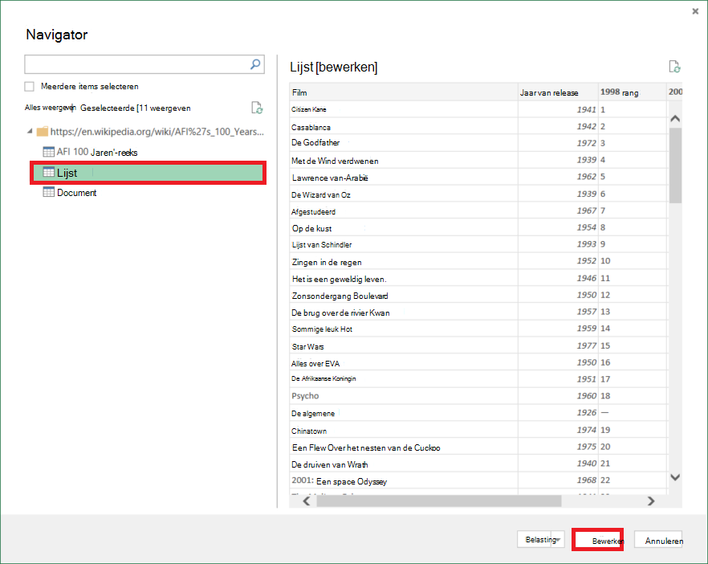

<properties 
    pageTitle="Verplaatsen van gegevens uit de tabel Web | Azure Data Factory" 
    description="Informatie over het verplaatsen van gegevens op ruimten een tabel in een webpagina met Azure Data Factory." 
    services="data-factory" 
    documentationCenter="" 
    authors="linda33wj" 
    manager="jhubbard" 
    editor="monicar"/>

<tags 
    ms.service="data-factory" 
    ms.workload="data-services" 
    ms.tgt_pltfrm="na" 
    ms.devlang="na" 
    ms.topic="article" 
    ms.date="09/26/2016" 
    ms.author="jingwang"/>

# Verplaatsen van gegevens uit een tabel Webbron met Azure Data Factory
In dit artikel wordt beschreven hoe u kunt de kopie activiteit in een fabriek Azure gegevens gegevens uit een tabel in een webpagina kopiëren naar een ander gegevensarchief. Dit artikel is gebaseerd op het artikel [gegevensverplaatsing activiteiten](data-factory-data-movement-activities.md) activiteit kopiëren en gegevens ondersteunde archief combinaties een algemeen overzicht van de verplaatsing van gegevens biedt.

Data factory ondersteunt momenteel alleen verplaatst gegevens uit een tabel Web naar andere opgeslagen gegevens, maar niet verplaatsen van gegevens uit de andere gegevens worden opgeslagen naar een bestemming van de tabel Web.

> [AZURE.NOTE] Deze Web-connector ondersteunt momenteel alleen uitgepakt inhoud van een HTML-pagina.

## -Voorbeeld: Gegevens uit de tabel Web kopiëren naar Azure Blob

In het onderstaande voorbeeld ziet:

1.  Een gekoppelde service van het type [Web](#web-linked-service-properties).
2.  Een gekoppelde service van het type [AzureStorage](data-factory-azure-blob-connector.md#azure-storage-linked-service-properties).
3.  Een invoer [dataset](data-factory-create-datasets.md) van het type [WebTable](#WebTable-dataset-properties).
4.  Een uitvoer [dataset](data-factory-create-datasets.md) van het type [AzureBlob](data-factory-azure-blob-connector.md#azure-blob-dataset-type-properties).
4.  Een [pijpleiding](data-factory-create-pipelines.md) met kopie activiteit die gebruikmaakt van [WebSource](#websource-copy-activity-type-properties) en [BlobSink](data-factory-azure-blob-connector.md#azure-blob-copy-activity-type-properties).

Het monster kopieert gegevens uit een tabel van het Web naar een Azure blob elk uur. De JSON-eigenschappen in deze voorbeelden gebruikt worden in voorbeelden van de volgende secties beschreven. 

In het volgende voorbeeld ziet u hoe u gegevens uit een webpagina-tabel kopiëren naar een Azure blob. Gegevens kunnen echter rechtstreeks aan de PUT vermeld in het artikel [Gegevensverplaatsing activiteiten](data-factory-data-movement-activities.md) met behulp van de activiteit van de kopie in Azure Data Factory worden gekopieerd. 

**Web service gekoppeld** In dit voorbeeld wordt de webservice gekoppeld met anonieme verificatie. Zie [Web service gekoppelde](#web-linked-service-properties) gedeelte voor verschillende soorten verificatie die u kunt gebruiken. 

    {
        "name": "WebLinkedService",
        "properties":
        {
            "type": "Web",
            "typeProperties":
            {
                "authenticationType": "Anonymous",
                "url" : "https://en.wikipedia.org/wiki/"
            }
        }
    }

**Azure gekoppeld opslagservice**

    {
      "name": "AzureStorageLinkedService",
      "properties": {
        "type": "AzureStorage",
        "typeProperties": {
          "connectionString": "DefaultEndpointsProtocol=https;AccountName=<accountname>;AccountKey=<accountkey>"
        }
      }
    }

**Invoer dataset WebTable** De Data Factory-service **externe** instelt op **true** te informeren dat de dataset de fabriek gegevens buiten en niet wordt geproduceerd door een activiteit in de fabriek van gegevens.

> [AZURE.NOTE] Zie de [index van een tabel in een HTML-pagina krijgen](#get-index-of-a-table-in-an-html-page) sectie voor stappen voor het opvragen van de index van een tabel in een HTML-pagina.  

    
    {
        "name": "WebTableInput",
        "properties": {
            "type": "WebTable",
            "linkedServiceName": "WebLinkedService",
            "typeProperties": {
                "index": 1,
                "path": "AFI's_100_Years...100_Movies"
            },
            "external": true,
            "availability": {
                "frequency": "Hour",
                "interval":  1
            }
        }
    }

**Azure Blob uitvoer dataset**

Gegevens worden weggeschreven naar een nieuwe blob elk uur (frequentie: uur, interval: 1). 

    {
        "name": "AzureBlobOutput",
        "properties":
        {
            "type": "AzureBlob",
            "linkedServiceName": "AzureStorageLinkedService",
            "typeProperties":
            {
                "folderPath": "adfgetstarted/Movies"
            },
            "availability":
            {
                "frequency": "Hour",
                "interval": 1
            }
        }
    }

**Pipeline-exemplaar activiteit**

De pijplijn bevat een kopie activiteit die is geconfigureerd voor het gebruik van de bovenstaande invoer en uitvoer datasets en elk uur is gepland. **Het type** is ingesteld op **WebSource** in de pijplijn JSON definitie en **sink** -type is ingesteld op **BlobSink**. 

Zie [Eigenschappen van het WebSource](#websource-copy-activity-type-properties) voor de lijst met eigenschappen die worden ondersteund door de WebSource. 
    
    {  
        "name":"SamplePipeline",
        "properties":{  
        "start":"2014-06-01T18:00:00",
        "end":"2014-06-01T19:00:00",
        "description":"pipeline with copy activity",
        "activities":[  
          {
            "name": "WebTableToAzureBlob",
            "description": "Copy from a Web table to an Azure blob",
            "type": "Copy",
            "inputs": [
              {
                "name": "WebTableInput"
              }
            ],
            "outputs": [
              {
                "name": "AzureBlobOutput"
              }
            ],
            "typeProperties": {
              "source": {
                "type": "WebSource"
              },
              "sink": {
                "type": "BlobSink"
              }
            },
           "scheduler": {
              "frequency": "Hour",
              "interval": 1
            },
            "policy": {
              "concurrency": 1,
              "executionPriorityOrder": "OldestFirst",
              "retry": 0,
              "timeout": "01:00:00"
            }
          }
          ]
       }
    }

## Web-Service gekoppelde eigenschappen

De volgende tabel bevat een beschrijving van JSON-elementen die specifiek zijn voor gekoppelde webservice.

| Eigenschap | Beschrijving | Vereist |
| -------- | ----------- | -------- | 
| type | De eigenschap type moet worden ingesteld op: **Web** | Ja | 
| URL | URL naar de Web-bron | Ja |
| authenticationType | Anonieme of Basic. | Ja |
| Gebruikersnaam | Gebruikersnaam voor standaardverificatie. | Ja (voor basisverificatie)
| wachtwoord | Een wachtwoord voor basisverificatie. | Ja (voor basisverificatie)

### Anonieme verificatie gebruikt

    {
        "name": "web",
        "properties":
        {
            "type": "Web",
            "typeProperties":
            {
                "authenticationType": "Anonymous",
                "url" : "https://en.wikipedia.org/wiki/"
            }
        }
    }

### Met behulp van basisverificatie
    
    {
        "name": "web",
        "properties":
        {
            "type": "Web",
            "typeProperties":
            {
                "authenticationType": "basic",
                "url" : "http://myit.mycompany.com/",
                "userName": "Administrator",
                "password": "password"
            }
        }
    }

## WebTable dataset eigenschappen

Zie het artikel [gegevenssets maken](data-factory-create-datasets.md) voor een volledige lijst van de secties en eigenschappen die beschikbaar zijn voor het definiëren van datasets. Secties zoals structuur, beschikbaarheid en het beleid van een dataset JSON zijn vergelijkbaar voor alle typen van dataset (Azure SQL Azure blob, Azure tabel, enz.).

De sectie **typeProperties** verschilt voor elk type dataset en vindt u informatie over de locatie van de gegevens in het gegevensarchief. De sectie typeProperties van de dataset van het type **WebTable** heeft de volgende eigenschappen

Eigenschap | Beschrijving | Vereist
:-------- | :----------- | :--------
type    | het type van de dataset. moet worden ingesteld op **WebTable** | Ja
pad | Een relatieve URL naar de bron die de tabel bevat. | Nr. Als geen pad is opgegeven, wordt alleen de URL die is opgegeven in de servicedefinitie van de gekoppelde gebruikt. 
index | De index van de tabel in de bron. Zie de [index van een tabel in een HTML-pagina krijgen](#get-index-of-a-table-in-an-html-page) sectie voor stappen voor het opvragen van de index van een tabel in een HTML-pagina. | Ja

**Voorbeeld:**

    {
        "name": "WebTableInput",
        "properties": {
            "type": "WebTable",
            "linkedServiceName": "WebLinkedService",
            "typeProperties": {
                "index": 1,
                "path": "AFI's_100_Years...100_Movies"
            },
            "external": true,
            "availability": {
                "frequency": "Hour",
                "interval":  1
            }
        }
    }

## WebSource - eigenschappen kopiëren activiteit

Zie het artikel [Pijpleidingen maken](data-factory-create-pipelines.md) voor een volledige lijst van de secties en eigenschappen die beschikbaar zijn voor het definiëren van activiteiten. Eigenschappen van de naam, beschrijving, input en output-tabellen en -beleid zijn beschikbaar voor alle typen activiteiten. 

Eigenschappen die beschikbaar zijn in de sectie typeProperties van de activiteit variëren aan de andere kant met elk activiteitstype. Activiteit kopiëren verschillen ze afhankelijk van de typen bronnen en putten.

Geen extra eigenschappen worden momenteel ondersteund als de bron van de activiteit van de kopie van het type **WebSource**. 

## Index van een tabel in een HTML-pagina ophalen

1. **Excel 2016** starten en Ga naar het tabblad **gegevens** .  
2. Klik op **Nieuw** op de werkbalk, wijs **Van andere bronnen** en klikt u op **Uit Web**.
    
     
3. Voer in het dialoogvenster **Van webpagina** **URL** u in de gekoppelde service JSON gebruikt (bijvoorbeeld: https://en.wikipedia.org/wiki/) en pad, u voor de gegevensset geeft (bijvoorbeeld: AFI % 27s_100_Years... 100_Movies) en klik op **OK**. 

     

    URL die wordt gebruikt in dit voorbeeld: https://en.wikipedia.org/wiki/AFI%27s_100_Years...100_Movies 
4.  Als het dialoogvenster **toegang tot webinhoud** wordt weergegeven, selecteert u de juiste **URL**- **verificatie**en klik op **verbinden**. 

    
5.  Klik op een **tabel** om de inhoud van de tabel en klik vervolgens op de knop **bewerken** onder in de structuur.  

     

5. Klik op **Geavanceerde Editor** knop op de werkbalk in de **Query Editor** -venster.

    

6. Klik in het dialoogvenster Geavanceerde Editor is het nummer naast 'Source' in de index.

     

Als u Excel 2013, moet u [Microsoft Power Query voor Excel](https://www.microsoft.com/download/details.aspx?id=39379) gebruiken om de index. Zie [verbinding maken met een webpagina](https://support.office.com/article/Connect-to-a-web-page-Power-Query-b2725d67-c9e8-43e6-a590-c0a175bd64d8) -artikel voor meer informatie. De stappen zijn identiek als u werkt met [Microsoft Power BI voor Desktop](https://powerbi.microsoft.com/desktop/). 

[AZURE.INCLUDE [data-factory-column-mapping](../../includes/data-factory-column-mapping.md)]

[AZURE.INCLUDE [data-factory-structure-for-rectangualr-datasets](../../includes/data-factory-structure-for-rectangualr-datasets.md)]

## Prestatie en afstemming  
Zie de [uitvoering van de activiteit & Tuning Guide](data-factory-copy-activity-performance.md) voor meer informatie over de belangrijkste factoren die prestaties gevolgen van verplaatsing van gegevens (kopiëren activiteit) in Azure Data Factory en verschillende manieren optimaliseren.
