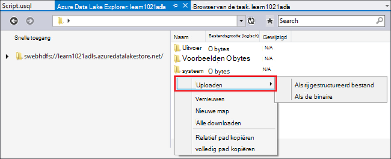
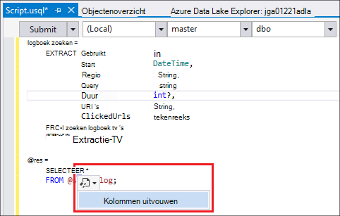
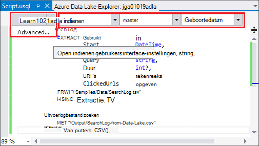
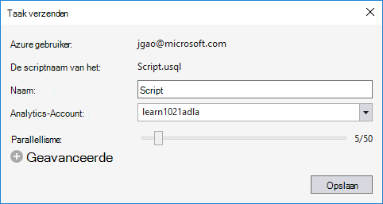
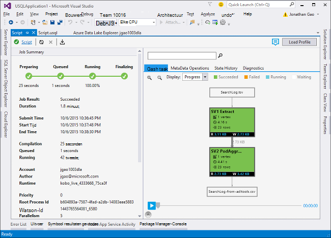
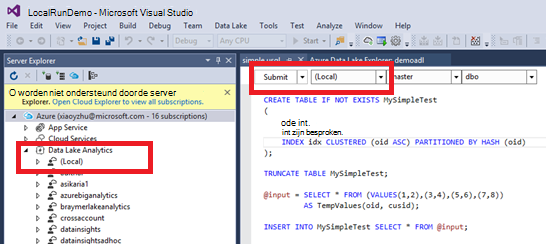
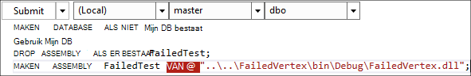

<properties
   pageTitle="U SQL scripts schrijven met behulp van hulpmiddelen voor gegevens Lake voor Visual Studio | Azure"
   description="Informatie over gegevens Lake Tools installeren voor Visual Studio, het ontwikkelen en U SQL-testscripts. "
   services="data-lake-analytics"
   documentationCenter=""
   authors="edmacauley"
   manager="jhubbard"
   editor="cgronlun"/>

<tags
   ms.service="data-lake-analytics"
   ms.devlang="na"
   ms.topic="get-started-article"
   ms.tgt_pltfrm="na"
   ms.workload="big-data"
   ms.date="05/16/2016"
   ms.author="edmaca"/>

# Zelfstudie: ontwikkelt U SQL-scripts met behulp van hulpmiddelen voor gegevens Lake voor Visual Studio

[AZURE.INCLUDE [get-started-selector](../../includes/data-lake-analytics-selector-get-started.md)]

Informatie over gegevens Lake Tools installeren voor Visual Studio en gegevens Lake's voor Visual Studio gebruiken om te schrijven en U SQL-scripts te testen.

U SQL is een hyper-schaalbare, sterk uitbreidbare taal voor het voorbereiden, transformeren en analyse van alle gegevens in het data-meer en meer. Zie U SQL Reference (http://go.microsoft.com/fwlink/p/?LinkId=691348) voor meer informatie.

##Vereisten

- **Visual Studio 2015, Visual Studio 2013 bijwerken 4 of Visual Studio 2012. (Ultimate/Premium) Enterprise, Professional, communautaire edities worden ondersteund; Express edition wordt niet ondersteund. Visual Studio "15" wordt momenteel niet ondersteund en wij werken aan die.**
- **Microsoft Azure SDK voor .NET versie 2.7.1 of hoger**.  Installeren met de [Web platform installer](http://www.microsoft.com/web/downloads/platform.aspx).
- **[Hulpmiddelen voor Visual Studio voor meer gegevens](http://aka.ms/adltoolsvs)**.

    Nadat de gegevens meer Tools voor Visual Studio is geïnstalleerd, ziet u een knooppunt "Analytics gegevens Lake" in Server Explorer onder het knooppunt "Azure" is (u kunt Server explorer openen door op Ctrl + Alt + S te drukken).

- **Doorloop de volgende twee secties in [Azure portal aan de slag met Azure gegevens Lake Analytics gebruiken](data-lake-analytics-get-started-portal.md)**.

    - [Een Azure gegevens Lake Analytics-account maken](data-lake-analytics-get-started-portal.md#create_adl_analytics_account).
    - [SearchLog.tsv uploaden naar de standaardaccount Lake gegevensopslag](data-lake-analytics-get-started-portal.md#update-data-to-the-default-adl-storage-account).

    Voor uw gemak, een voorbeeld van PowerShell script voor het maken van een service gegevens Lake analytisch en uploaden brongegevensbestand vindt u in [Appx-A PowerShell voorbeeld voor het voorbereiden van de zelfstudie](data-lake-analytics-data-lake-tools-get-started.md#appx-a-powershell-sample-for-preparing-the-tutorial).

    De extra gegevens Lake ondersteunt geen gegevens meer Analytics-accounts maken. Zodat hebt u gemaakt met behulp van de portal voor Azure, Azure PowerShell, .NET SDK of Azure CLI. Een Data Lake Analytics als taak wilt uitvoeren, moet u enkele gegevens. Hoewel de gegevens Lake's uploaden-gegevens ondersteunt, gebruikt u de portal voor het uploaden van de voorbeeldgegevens gemakkelijker als u deze zelfstudie volgen.

## Verbinding maken met Azure

**Verbinding maken met gegevens Lake Analytics**

1. Open de Visual Studio.
2. Klik in het menu **Beeld** op **Server Explorer** om Server Explorer te openen. Of druk op **[CTRL] + [ALT] + S**.
3. Klik met de rechtermuisknop op **Azure**'Verbinding maken met Microsoft Azure abonnement' en volg de instructies.
4. In **Server Explorer** **Azure**vouwen en vouw **Gegevens Lake Analytics**. U dient een overzicht van uw gegevens Lake Analytics accounts als die er zijn. U kunt geen gegevens Lake Analytics accounts maken vanuit Visual Studio. Zie [aan de slag met Azure gegevens Lake Analytics via Azure portal](data-lake-analytics-get-started-portal.md) of [Aan de slag met Azure gegevens Lake Analytics met Azure PowerShell](data-lake-analytics-get-started-powershell.md)een account maken.

## Bron gegevensbestanden uploaden

U hebt bepaalde gegevens in de sectie **vereisten** eerder in de zelfstudie geüpload.  

In het geval u uw eigen gegevens gebruiken wilt, vindt hier u de procedures voor het uploaden van gegevens uit de Data Lake's.

**Om bestanden te uploaden naar de afhankelijke Azure gegevens Lake rekening**

1. In **Server Explorer** **Azure**uitvouwen, vouw **Gegevens Lake Analytics**, vouw van uw account gegevens Lake Analytics en **Opslag rekeningen**uit. U dient de standaardaccount Lake gegevensopslag en de gekoppelde accounts voor gegevensopslag Lake en de gekoppelde accounts van Azure opslag zien. De standaardaccount voor meer gegevens heeft een label 'Standaard opslag Account'.
2. Klik met de rechtermuisknop op de standaardaccount Lake gegevensopslag en klik vervolgens op **Explorer**.  De gegevens meer hulpprogramma's voor Visual Studio Explorer-venster wordt geopend.  Aan de linkerkant geeft het een structuurweergave inhoud weergeven aan de rechterkant.
3. Blader naar de map waar u bestanden uploaden
4. Klik met de rechtermuisknop op een lege ruimte en klik vervolgens op **uploaden**.

    

**Om bestanden te uploaden naar een gekoppelde Azure Blob opslag**

1. In **Server Explorer** **Azure**uitvouwen, vouw **Gegevens Lake Analytics**, vouw van uw account gegevens Lake Analytics en **Opslag rekeningen**uit. U dient de standaardaccount Lake gegevensopslag en de gekoppelde accounts voor gegevensopslag Lake en de gekoppelde accounts van Azure opslag zien.
2. Vouw de Azure opslag Account.
3. Klik met de rechtermuisknop op de container waar u bestanden uploaden en klik vervolgens op **Explorer**. Als u een container niet hebt, moet u eerst een met de Azure portal Azure PowerShell of andere hulpprogramma's maken.
4. Blader naar de map waar u bestanden uploaden
5. Klik met de rechtermuisknop op een lege ruimte en klik vervolgens op **uploaden**.

## U SQL-scripts ontwikkelen

De gegevens Lake Analytics taken zijn geschreven in de taal die U SQL. Zie voor meer informatie over U SQL, [aan de slag met U SQL-taal](data-lake-analytics-u-sql-get-started.md) en [U SQL language reference](http://go.microsoft.com/fwlink/?LinkId=691348).

**Maken en indienen van een taak gegevens Lake Analytics**

1. Klik op **Nieuw**in het menu **bestand** en klik vervolgens op **Project**.
2. Selecteer het type **Project U SQL** .

    

3. Klik op **OK**. Visual studio maakt een oplossing met een **Script.usql** -bestand.
4. Voer het volgende script in **Script.usql**:

        @searchlog =
            EXTRACT UserId          int,
                    Start           DateTime,
                    Region          string,
                    Query           string,
                    Duration        int?,
                    Urls            string,
                    ClickedUrls     string
            FROM "/Samples/Data/SearchLog.tsv"
            USING Extractors.Tsv();

        @res =
            SELECT *
            FROM @searchlog;        

        OUTPUT @res   
            TO "/Output/SearchLog-from-Data-Lake.csv"
        USING Outputters.Csv();

    Dit U SQL-script leest het brongegevensbestand met **Extractors.Tsv()**en maakt vervolgens een CSV-bestand met behulp van **Outputters.Csv()**.

    De twee paden niet worden gewijzigd, tenzij u het bronbestand naar een andere locatie gekopieerd.  Gegevens Lake Analytics maakt de uitvoermap als het niet bestaat.

    Is het eenvoudiger de relatieve paden voor de bestanden opgeslagen in standaard gegevens meer accounts gebruikt. Ook kunt u absolute paden.  Bijvoorbeeld

        adl://<Data LakeStorageAccountName>.azuredatalakestore.net:443/Samples/Data/SearchLog.tsv

    Absolute paden hebt u toegang tot bestanden in de gekoppelde accounts voor opslag.  De syntaxis voor bestanden die zijn opgeslagen in de gekoppelde Azure opslag account is:

        wasb://<BlobContainerName>@<StorageAccountName>.blob.core.windows.net/Samples/Data/SearchLog.tsv

    >[AZURE.NOTE] Azure Blob container met openbare BLOB's of machtigingen voor openbare containers worden momenteel niet ondersteund.  

    U ziet de volgende functies:

    - **IntelliSense**

        Naam automatisch voltooid en de leden worden weergegeven voor de rijenset, klassen, Databases, schema's en de gebruiker gedefinieerde objecten (UDOs).

        IntelliSense voor catalogus entiteiten (Databases, schema's, tabellen, UDOs enz.) is gekoppeld aan uw account berekenen. U kunt de huidige actieve compute-rekening, de database en het schema in de bovenste werkbalk controleren en ze schakelen via de vervolgkeuzelijsten.

    - *Kolommen *uitvouwen***

        Klik op het recht van *, ziet u een blauwe onderstreping van de *. Plaatst u de muisaanwijzer op het blauwe onderstreping en klik vervolgens op de pijl-omlaag.
        

        **Kolommen uitvouwen**, klikt u op het gereedschap wordt vervangen door de * met de kolomnamen.

    - **Automatisch opmaken**

        Gebruikers kunnen de inspringing wijzigen van het U SQL-script op basis van de code structuur bewerken -> Geavanceerd:

        - Indeling Document (Ctrl + E, D): Het gehele document opmaakt   
        - Indeling selectie (Ctrl + K, Ctrl + F): De selectie wordt opgemaakt. Als er geen selectie heeft plaatsgevonden, wordt deze sneltoets de geselecteerde regel in.  

        Alle opmaak regels worden geconfigureerd onder Extra -> Opties -> tekst Editor - > SIP -> opmaak.  
    - **Slim inspringen**

        Meer hulpmiddelen voor Visual Studio kan expressies automatisch laten inspringen tijdens het schrijven van scripts. Deze functie is standaard uitgeschakeld, die gebruikers nodig hebben om via U controle-SQL -> Opties en instellingen -> schakelopties -> Slim inspringen inschakelen.

    - **Ga naar de definitie en alle verwijzingen zoeken**

        Met de rechtermuisknop op de naam van een rijenset/parameter/kolom/UDO enz., en klikt u op Ga naar definitie (F12) kunt u navigeren naar de definitie ervan. Door te klikken op alle verwijzingen zoeken (Shift + F12), worden alle verwijzingen weergegeven.

    - **Azure pad invoegen**

        In plaats van het onthouden van Azure pad en typ handmatig bij het schrijven van scripts, Lake hulpmiddelen voor Visual Studio biedt een eenvoudige manier: klik met de rechtermuisknop in de editor, klikt u op Azure pad invoegen. Navigeer naar het bestand in het browservenster Azure Blob. Klik op **OK**. het bestandspad wordt ingevoegd in uw programmacode.

5. Geef de gegevens Lake Analytics account, Database, en het Schema. U kunt selecteren **(lokaal)** lokaal uitvoeren van het script voor het doel van de tests. Voor meer informatie Zie [Uitvoeren U SQL lokaal](#run-u-sql-locally).

    

    Zie voor meer informatie, [gebruikt U SQL-catalogus](data-lake-analytics-use-u-sql-catalog.md).

5. In **Solution Explorer**met de rechtermuisknop op **Script.usql**en klik op **Script maken**. Controleer of het resultaat in het deelvenster Uitvoer.
6. In **Solution Explorer**met de rechtermuisknop op **Script.usql**en klik op **Script indienen**. Optioneel, u kunt ook op **verzenden** klikt vanuit het deelvenster Script.usql.  Zie de vorige afbeelding.  Klik op de pijl-omlaag naast de knop verzenden wilt indienen met behulp van de volgende opties:
7. Typt u de **Naam van**de **Analytics-Account**controleren en klik vervolgens op **verzenden**. Resultaten van indienen en de taakkoppeling zijn beschikbaar in de gegevens meer hulpprogramma's voor Visual Studio venster wanneer het verzenden is voltooid.

    

8. U moet klikt u op de knop Vernieuwen om de status van de meest recente zien en het scherm te vernieuwen. Wanneer de uitkomsten van de taak, geeft de **Grafiek taak** **Meta Data bewerkingen**, **Geschiedenis van de** **Diagnostische gegevens**:

    

    * Samenvatting van de taak. De overzichtsgegevens van de huidige taak bijvoorbeeld weergeven: status, voortgang, uitvoeringstijd, Runtime-naam, indiener enz.   
    * Taakdetails. Gedetailleerde informatie over deze taak wordt geleverd, met inbegrip van script, resource, Vertex uitvoering weergeven.
    * Grafiek van de taak. Vier grafieken zijn beschikbaar voor het visualiseren van de taak informatie: voortgang, gegevens lezen, gegevens geschreven, uitvoeringstijd, gemiddelde verwerkingstijd Per knooppunt, doorvoer van invoer, uitvoer, doorvoer.
    * Bewerkingen van metagegevens. Alle bewerkingen in de metagegevens worden weergegeven.
    * Regionale geschiedenis.
    * Diagnostische gegevens. Meer hulpmiddelen voor Visual Studio diagnose taakuitvoering automatisch. U ontvangt waarschuwingen wanneer er enkele fouten of problemen met de prestaties in hun werk zijn. Zie diagnostische gegevens (link TBD) voor meer informatie deel taak.

**Taakstatus controleren**

1. In Server Explorer **Azure**uitvouwen, vouw **Gegevens Lake Analytics**, vouw de naam van de account gegevens Lake Analytics
2. Dubbelklik op **taken** om de taken.
2. Klik op een taak om de status zien.

**Voor een overzicht van de uitvoer van de taak**

1. In **Server Explorer** **Azure**uitvouwen, vouw **Gegevens Lake Analytics**Vouw uw account gegevens Lake Analytics, vouw **Opslag rekeningen**, met de rechtermuisknop op de standaardaccount voor gegevensopslag Lake en klik vervolgens op **Explorer**.
2.  Dubbelklik op de **uitvoer** om de map te openen
3.  Dubbelklik op **SearchLog van adltools.csv**.

###Afspelen van taak

Taak afspelen kunt u uitvoering van de taak bekijken en visueel afwijkingen van de prestaties en knelpunten opsporen. Deze functie kan worden gebruikt voordat de taak is voltooid kan worden uitgevoerd (dat wil zeggen gedurende de tijd die de taak actief wordt uitgevoerd), evenals als de uitvoering is voltooid. Afspelen tijdens de taakuitvoering doet, kan de gebruiker voor het afspelen van de voortgang tot de huidige tijd.

**Voortgang van uitvoering van het project weergeven**  

1. Klik op **Profiel laden** in de rechterbovenhoek. Zie het vorige scherm geschoten.
2. Klik op de knop afspelen in de linkerbenedenhoek om te controleren van de voortgang van het project kan worden uitgevoerd.
3. Tijdens het afspelen, klikt u op **onderbreken** als u wilt stoppen of sleept u de voortgangsbalk rechtstreeks naar specifieke posities.

###Warmte-kaart

Meer hulpmiddelen voor Visual Studio biedt gebruiker selecteerbare kleur-overlays in de weergave Project om aan te geven van de voortgang, I/O gegevens, uitvoeringstijd, i/o-doorvoer van elke fase. Via deze kunnen gebruikers uitzoeken potentiële problemen en de distributie van taakeigenschappen direct en intuïtief. U kunt een gegevensbron weer te geven in de lijst.  

## Lokaal U SQL uitvoeren

Met de U-SQL lokale ervaring uitvoeren in Visual Studio, kunt u:

- Lokaal, U SQL-scripts uitvoeren met C#-assembly's.
- Fouten opsporen in C#-assembly's lokaal.
- Lokale databases maken/verwijderen/weergeven, assembly's, schema's en tabellen in Server Explorer als u kunnen doen voor Azure gegevens Lake Analytics-service.

Ziet u een *lokale* account in Visual Studio en het installatieprogramma maakt een *DataRoot* map *C:\LocalRunRoot*bevindt. De map DataRoot wordt gebruikt:

- Winkel metagegevens met inbegrip van de tabellen, DBs, TVFs, enz.
- Voor een bepaald script: als een relatief pad wordt verwezen in het i/o-paden, gaan we van de DataRoot (evenals pad van het script als de it de invoer)
- De map DataRoot niet zal worden verwezen als u probeert een assemblage registreren en een relatief pad gebruiken (Zie het onderdeel "assembly's gebruiken bij het maken van lokale run" voor meer details)

De volgende video wordt getoond hoe de functie U SQL lokaal uitvoeren:

>[AZURE.VIDEO usql-localrun]

### Bekende problemen en beperkingen

- Kan tabel/DB etc. in Server Explorer voor de lokale account maken.
- Als een relatief pad wordt verwezen:

    - In het script invoer (uitpakken * FROM "pad/abc ')-het pad DataRoot en het pad naar het script gezocht.
    - In de uitvoer van het script (uitvoer naar "pad/abc"): het pad DataRoot wordt gebruikt als de uitvoermap.
    - Bij de registratie van assembly (xyz ASSEMBLY maken van "pad/abc '): het pad naar het script zal worden gezocht, maar niet de DataRoot.
    - Geregistreerd TVF/weergeven of andere metagegevens entiteiten: het pad DataRoot wordt gezocht, maar niet het pad naar script.

    Voor scripts op Lake Data service uitgevoerd, de standaardaccount voor de opslag wordt gebruikt als hoofdmap en dienovereenkomstig worden gezocht.

### Lokaal U SQL-scripts testen
Zie voor meer informatie over het ontwikkelen van U SQL-scripts [ontwikkelen U SQL - scripts](#develop-and-test-u-sql-scripts). Bouwen en uitvoeren U SQL scripts lokaal **(lokale)** selecteert in de vervolgkeuzelijst van het cluster en klik op **verzenden**. Zorg ervoor dat u de juiste gegevens waarnaar wordt verwezen - hetzij verwijzen naar het absolute pad of de gegevens plaatsen onder de map DataRoot.

U kunt ook met de rechtermuisknop op een script en klik op **Lokale plannen uitvoeren** in het contextmenu of druk op **CTRL + F5** om trigger lokaal uitvoeren.

### Assembly's in lokale uitvoeren gebruiken

Er zijn twee manieren voor het uitvoeren van de aangepaste C#-bestanden:

- Assembly's in de code achter het bestand schrijven en de assembly's worden automatisch geregistreerd en verbroken nadat het script is voltooid.
- Een C# assembly-project maken en registreren van de dll voor uitvoer naar de lokale account via een script zoals hieronder. Houd er rekening mee dat het pad relatief ten opzichte van het script in plaats van de map DataRoot is.

### Foutopsporing voor scripts en C#-assembly's lokaal

Zonder indiening en registratie op de Azure gegevens Lake Analytics-Service kunt u fouten opsporen C#-assembly's. U kunt onderbrekingspunten instellen in de code achter het bestand en in een project waarnaar wordt verwezen C#.

**Lokale code in de code achter het bestand fouten opsporen**
1.  Onderbrekingspunten instellen in de code achter het bestand.
2.  Druk op **F5** om het script lokaal debuggen.

De volgende procedure werkt alleen in Visual Studio 2015. In oudere Visual Studio moet u handmatig de pdb-bestanden toevoegen.

**Lokale code in een project waarnaar wordt verwezen C# foutopsporing**
1.  Een Assembly C#-project maken en dit voor het genereren van de output-dll.
2.  Registreer de dll met een U-SQL-instructie:

        CREATE ASSEMBLY assemblyname FROM @"..\..\path\to\output\.dll";
3.  Onderbrekingspunten instellen in de C#-code.
4.  Druk op **F5** om te verwijzen naar de C#-dll lokaal voor het script opsporen.  

##Zie ook

Om te beginnen met gegevens Lake Analytics met verschillende hulpprogramma's Zie:

- [Aan de slag met Data Lake Analytics met Azure portal](data-lake-analytics-get-started-portal.md)
- [Aan de slag met Data Lake Analytics met Azure PowerShell](data-lake-analytics-get-started-powershell.md)
- [Aan de slag met Data Lake Analytics met .NET SDK](data-lake-analytics-get-started-net-sdk.md)
- [C#-code in projecten U SQL fouten opsporen](data-lake-analytics-debug-u-sql-jobs.md)

Meer onderwerpen van de ontwikkeling zien:

- [Analyseren met Data Lake Analytics weblogs](data-lake-analytics-analyze-weblogs.md)
- [U SQL scripts schrijven met behulp van hulpmiddelen voor gegevens Lake voor Visual Studio](data-lake-analytics-data-lake-tools-get-started.md)
- [Aan de slag met Azure gegevens Lake Analytics U SQL-taal](data-lake-analytics-u-sql-get-started.md)
- [U SQL door gebruiker gedefinieerde operators voor gegevens Lake Analytics projecten ontwikkelen](data-lake-analytics-u-sql-develop-user-defined-operators.md)

##ToepassingX A PowerShell voorbeeld voor het voorbereiden van de zelfstudie

De volgende PowerShell script bereidt een Azure gegevens Lake Analytics-account en de brongegevens voor u, zodat u kunt verdergaan met [ontwikkelen U SQL - scripts](data-lake-analytics-data-lake-tools-get-started.md#develop-u-sql-scripts).

    #region - used for creating Azure service names
    $nameToken = "<Enter an alias>"
    $namePrefix = $nameToken.ToLower() + (Get-Date -Format "MMdd")
    #endregion

    #region - service names
    $resourceGroupName = $namePrefix + "rg"
    $dataLakeStoreName = $namePrefix + "adas"
    $dataLakeAnalyticsName = $namePrefix + "adla"
    $location = "East US 2"
    #endregion

    # Treat all errors as terminating
    $ErrorActionPreference = "Stop"

    #region - Connect to Azure subscription
    Write-Host "`nConnecting to your Azure subscription ..." -ForegroundColor Green
    try{Get-AzureRmContext}
    catch{Login-AzureRmAccount}
    #endregion

    #region - Create an Azure Data Lake Analytics service account
    Write-Host "Create a resource group ..." -ForegroundColor Green
    New-AzureRmResourceGroup `
        -Name  $resourceGroupName `
        -Location $location

    Write-Host "Create a Data Lake account ..."  -ForegroundColor Green
    New-AzureRmDataLakeStoreAccount `
        -ResourceGroupName $resourceGroupName `
        -Name $dataLakeStoreName `
        -Location $location

    Write-Host "Create a Data Lake Analytics account ..."  -ForegroundColor Green
    New-AzureRmDataLakeAnalyticsAccount `
        -Name $dataLakeAnalyticsName `
        -ResourceGroupName $resourceGroupName `
        -Location $location `
        -DefaultDataLake $dataLakeStoreName

    Write-Host "The newly created Data Lake Analytics account ..."  -ForegroundColor Green
    Get-AzureRmDataLakeAnalyticsAccount `
        -ResourceGroupName $resourceGroupName `
        -Name $dataLakeAnalyticsName  
    #endregion

    #region - prepare the source data
    Write-Host "Import the source data ..."  -ForegroundColor Green
    $localFolder = "C:\Tutorials\Downloads\" # A temp location for the file.
    $storageAccount = "adltutorials"  # Don't modify this value.
    $container = "adls-sample-data"  #Don't modify this value.

    # Create the temp location  
    New-Item -Path $localFolder -ItemType Directory -Force

    # Download the sample file from Azure Blob storage
    $context = New-AzureStorageContext -StorageAccountName $storageAccount -Anonymous
    $blobs = Azure\Get-AzureStorageBlob -Container $container -Context $context
    $blobs | Get-AzureStorageBlobContent -Context $context -Destination $localFolder

    # Upload the file to the default Data Lake Store account    
    Import-AzureRmDataLakeStoreItem -AccountName $dataLakeStoreName -Path $localFolder"SearchLog.tsv" -Destination "/Samples/Data/SearchLog.tsv"

    Write-Host "List the source data ..."  -ForegroundColor Green
    Get-AzureRmDataLakeStoreChildItem -Account $dataLakeStoreName -Path  "/Samples/Data/"
    #endregion
