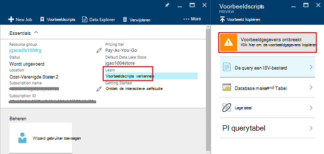
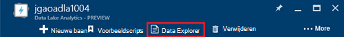
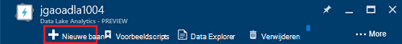
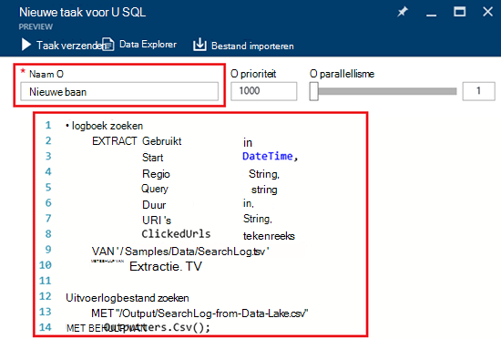
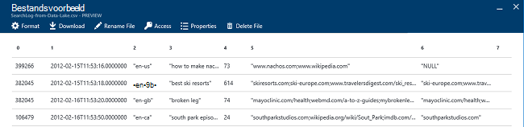

<properties 
   pageTitle="Aan de slag met Azure gegevens Lake Analytics met Azure portal | Azure" 
   description="Informatie over het gebruik van de portal Azure een gegevens Lake Analytics-account maken, geen gegevens meer Analytics taak gebruikt U SQL maken en indienen van de taak. " 
   services="data-lake-analytics" 
   documentationCenter="" 
   authors="edmacauley" 
   manager="jhubbard" 
   editor="cgronlun"/>
 
<tags
   ms.service="data-lake-analytics"
   ms.devlang="na"
   ms.topic="hero-article"
   ms.tgt_pltfrm="na"
   ms.workload="big-data" 
   ms.date="10/06/2016"
   ms.author="edmaca"/>

# Zelfstudie: aan de slag met Azure gegevens Lake Analytics met Azure portal

[AZURE.INCLUDE [get-started-selector](../../includes/data-lake-analytics-selector-get-started.md)]

Informatie over het gebruik van de portal Azure Azure gegevens Lake Analytics accounts maken en verzenden taken naar de service gegevens Lake Analytics gegevens Lake Analytics taken definiëren in [U SQL](data-lake-analytics-u-sql-get-started.md). Zie voor meer informatie over gegevens Lake Analytics [Azure gegevens Lake Analytics overzicht](data-lake-analytics-overview.md).

In deze zelfstudie ontwikkelen van een project dat een tab gescheiden waarden (TSV) en zet deze in een bestand met door komma's gescheiden waarden (CSV) kan lezen. Om na te gaan via dezelfde zelfstudie met behulp van andere ondersteunde hulpprogramma's, klikt u op de tabs boven aan deze sectie. Zodra de eerste taak is voltooid, kunt u beginnen met het schrijven van meer complexe gegevenstransformaties met U SQL.

##Vereisten

Voordat u deze zelfstudie hebt u de volgende items:

- **Azure een abonnement**. Zie [Azure krijg gratis proefperiode](https://azure.microsoft.com/pricing/free-trial/).

##Gegevens Lake Analytics-account maken

Voordat u alle taken kunt uitvoeren, moet u een account gegevens Lake Analytics hebben.

Elke account gegevens Lake Analytics heeft een [Gegevensarchief voor Lake Azure]() account afhankelijkheid.  Deze account is de standaardaccount Lake gegevensopslag genoemd.  Kunt u de account Lake gegevensarchief vooraf of wanneer u uw gegevens Lake Analytics-account maken. In deze zelfstudie maakt u het gegevensarchief Lake-account met de account gegevens Lake Analytics.

**Een Data Lake Analytics-account maken**

1. Aanmelden op de [portal Azure](https://portal.azure.com).
2. Klik op **Nieuw**en op **Intelligence + analytics**, **Data Lake Analytics**.
3. Typ of Selecteer de volgende waarden:

    

    - **Naam**: de naam van de account gegevens Lake Analytics.
    - **Abonnement**: Kies de Azure abonnement gebruikt voor het Analytics-account.
    - **Resourcegroep**. Selecteer een bestaande brongroep van Azure of een nieuwe maken. Azure Resource Manager kunt u werken met de resources in uw toepassing als een groep. Zie [Azure Resource Manager-overzicht](resource-group-overview.md)voor meer informatie. 
    - **Locatie**. Selecteer een Azure Datacenter voor de account gegevens Lake Analytics. 
    - **Gegevensarchief Lake**: elke gegevens Lake Analytics account een afhankelijke gegevensarchief Lake-account heeft. De gegevens Lake Analytics-account en de afhankelijke Lake gegevensarchief account moeten zich bevinden in dezelfde Azure Datacenter. Volg de instructies voor het maken van een nieuw gegevensarchief Lake-account of een bestaande selecteren.

8. Klik op **maken**. Het gaat u naar de portal home scherm. Een nieuwe tegel wordt toegevoegd aan de StartBoard met het label 'Deploying Azure gegevens Lake Analytics' weergegeven. Het duurt even voor het maken van een account gegevens Lake Analytics. Wanneer de account wordt gemaakt, wordt de rekening op een nieuwe blade geopend in de portal.

Nadat een account gegevens Lake Analytics is gemaakt, kunt u extra Lake gegevensarchief Azure opslag rekeningen en toevoegen. Zie [gegevens lake Analytics beheren rekening gegevensbronnen](data-lake-analytics-manage-use-portal.md#manage-account-data-sources)voor meer informatie.

##Brongegevens voorbereiden

In deze zelfstudie kunt u zoeken in Logboeken sommige verwerken.  Het logboek zoeken kan worden opgeslagen in de winkel dData Lake of Azure Blob-opslag. 

De Azure portal biedt een gebruikersinterface voor het aantal voorbeeldbestanden kopiëren naar de standaardaccount gegevensarchief Lake, waaronder een logboekbestand zoeken.

**Voorbeeldbestanden kopiëren**

1. Open uw account gegevens Lake Analytics vanaf de [portal Azure](https://portal.azure.com).  Zie [accounts beheren gegevens Lake Analytics](data-lake-analytics-get-started-portal.md#manage-accounts) een maken en openen van de account in de portal.
3. Het deelvenster **Essentials** uitbreiden en klik vervolgens op **verkennen voorbeeldscripts**. Hiermee opent u een andere blade **Voorbeeldscripts**genoemd.

    

4. Klik op **Voorbeeld ontbreken** de voorbeeldbestanden gegevens kopiëren. Als dit gebeurt, geeft de portal **voorbeeldgegevens met succes bijgewerkt**.
7. Uit het blad gegevens Lake analytics-account, klikt u op **Gegevens** in de bovenkant. 

    

    Hiermee opent u de twee bladen. Een **Data Explorer**is en de andere is de standaardaccount Lake gegevensarchief.
8. Klik in de standaard gegevensarchief Lake account blade, **monsters** , vouw de map en klik op **gegevens** aan de map. U moet de volgende bestanden en mappen zien:

    - AmbulanceData /
    - AdsLog.tsv
    - SearchLog.tsv
    - Version.txt
    - WebLog.log
    
    In deze zelfstudie gebruikt u SearchLog.tsv.

In de praktijk moet u ofwel uw toepassingen schrijven gegevens in een gekoppelde opslag rekeningen of gegevens uploaden programmeren. Zie voor het uploaden van bestanden [uploaden van gegevens naar Lake gegevensarchief](data-lake-analytics-manage-use-portal.md#upload-data-to-adls) of [uploaden van gegevens naar een Blob-opslag](data-lake-analytics-manage-use-portal.md#upload-data-to-wasb).

##Maken en indienen van gegevens Lake Analytics taken

Nadat u de brongegevens hebt voorbereid, kunt u beginnen met het ontwikkelen van een U SQL-script.  

**Een project indienen**

1. Klik op **Nieuwe taak**van het Lake Data analytics account-blade op de portal. 

    

    Zie als u het blad niet ziet, [openen van een account gegevens Lake Analytics van de portal](data-lake-analytics-manage-use-portal.md#access-adla-account).
2. Geef **Naam**en het volgende U SQL-script:

        @searchlog =
            EXTRACT UserId          int,
                    Start           DateTime,
                    Region          string,
                    Query           string,
                    Duration        int?,
                    Urls            string,
                    ClickedUrls     string
            FROM "/Samples/Data/SearchLog.tsv"
            USING Extractors.Tsv();
        
        OUTPUT @searchlog   
            TO "/Output/SearchLog-from-Data-Lake.csv"
        USING Outputters.Csv();

    

    Dit U SQL-script leest het brongegevensbestand met **Extractors.Tsv()**en maakt vervolgens een CSV-bestand met behulp van **Outputters.Csv()**. 
    
    De twee paden niet worden gewijzigd, tenzij u het bronbestand naar een andere locatie kopiëren.  Gegevens Lake Analytics maakt de uitvoermap als het niet bestaat.  In dit geval gebruiken we eenvoudige, relatieve paden.  
    
    Het is eenvoudiger relatieve paden gebruiken voor bestanden die zijn opgeslagen in de standaard gegevens meer accounts. Ook kunt u absolute paden.  Bijvoorbeeld 
    
        adl://<Data LakeStorageAccountName>.azuredatalakestore.net:443/Samples/Data/SearchLog.tsv
      

    Zie voor meer informatie over U SQL, [aan de slag met Azure gegevens Lake Analytics U SQL - taal](data-lake-analytics-u-sql-get-started.md) en [U SQL language reference](http://go.microsoft.com/fwlink/?LinkId=691348).
     
3. Klik op **Taak verzenden** vanaf de bovenkant.   
4. Wacht totdat de status van de taak wordt gewijzigd in **geslaagd**. U ziet dat de taak voltooien duurde ongeveer een minuut.
    
    In het geval de taak is mislukt, Zie [Monitor en het oplossen van gegevens Lake Analytics taken](data-lake-analytics-monitor-and-troubleshoot-jobs-tutorial.md).

5. Klik op het tabblad **uitvoer** onderaan in het blad, en klik op **SearchLog van gegevens Lake.csv**. U kunt bekijken, downloaden, hernoemen en verwijderen van het uitvoerbestand.

    

##Zie ook

- Een complexe query's, Zie [Logboeken van Website analyseren met behulp van Azure gegevens Lake Analytics](data-lake-analytics-analyze-weblogs.md).
- Zie [ontwikkelt U SQL - scripts met behulp van hulpmiddelen voor gegevens Lake voor Visual Studio](data-lake-analytics-data-lake-tools-get-started.md)om te beginnen U SQL-toepassingen ontwikkelen.
- Zie informatie over U SQL, [aan de slag met Azure gegevens Lake Analytics U SQL - taal](data-lake-analytics-u-sql-get-started.md).
- Zie voor beheertaken, [Azure gegevens Lake Analytics beheren met behulp van Azure portal](data-lake-analytics-manage-use-portal.md).
- Zie voor een overzicht van gegevens Lake Analytics, [Azure gegevens Lake Analytics overzicht](data-lake-analytics-overview.md).
- Klik op het tabblad kiezers boven aan de pagina overzicht dezelfde zelfstudie met behulp van andere hulpprogramma's.
- Zie [toegang tot diagnostische logboeken voor Azure gegevens Lake Analytics](data-lake-analytics-diagnostic-logs.md) om diagnostische gegevens vastleggen,
