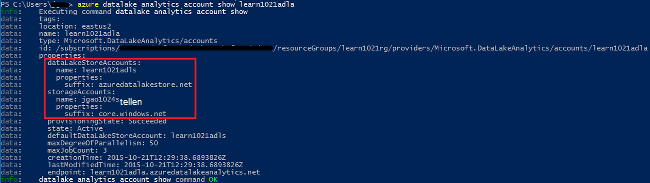
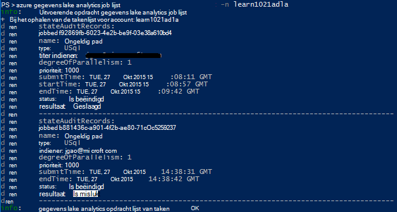
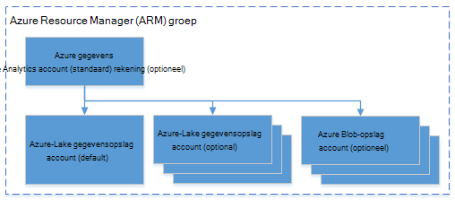

<properties 
   pageTitle="Azure gegevens Lake Analytics Azure opdrachtregel beheren | Azure" 
   description="Informatie over het beheren van gegevens Lake Analytics-accounts, gegevensbronnen, taken en Azure CLI-gebruikers" 
   services="data-lake-analytics" 
   documentationCenter="" 
   authors="edmacauley" 
   manager="jhubbard" 
   editor="cgronlun"/>
 
<tags
   ms.service="data-lake-analytics"
   ms.devlang="na"
   ms.topic="article"
   ms.tgt_pltfrm="na"
   ms.workload="big-data" 
   ms.date="05/16/2016"
   ms.author="edmaca"/>

# Azure gegevens Lake Analytics met Azure opdrachtregelinterface (CLI) beheren

[AZURE.INCLUDE [manage-selector](../../includes/data-lake-analytics-selector-manage.md)]

Informatie over het beheren van accounts Azure gegevens Lake Analytics, gegevensbronnen, gebruikers en taken met behulp van de Azure. Om te zien met behulp van andere hulpprogramma's voor beheer-onderwerp, klikt u op de bovenstaande tabblad selecteren.

**Vereisten**

Voordat u deze zelfstudie hebt u het volgende:

- **Azure een abonnement**. Zie [Azure krijg gratis proefperiode](https://azure.microsoft.com/pricing/free-trial/).
- **Azure CLI**. Zie [installeren en configureren van Azure CLI](../xplat-cli-install.md).
    - Downloaden en installeren van **voorlopige** [Azure CLI hulpmiddelen](https://github.com/MicrosoftBigData/AzureDataLake/releases) om deze demo te voltooien.
- **Verificatie**, met de volgende opdracht:

        azure login
    Zie voor meer informatie over verificatie via een account voor werk of school, [verbinding maken met een Azure-abonnement van de CLI Azure](../xplat-cli-connect.md).
- **Overschakelen naar de modus Azure Resource Manager**met de volgende opdracht:

        azure config mode arm

**Overzicht van de opdrachten gegevensarchief Lake en Lake Analytics van gegevens:**

    azure datalake store
    azure datalake analytics

<!-- ################################ -->
<!-- ################################ -->
## Accounts beheren

Voordat u alle gegevens Lake Analytics taken uitvoert, moet u een account gegevens Lake Analytics hebben. In tegenstelling tot Azure-HDInsight betaalt niet u voor een Analytics-account als dit niet een taak wordt uitgevoerd.  U betaalt alleen voor de tijd waarop een taak wordt uitgevoerd.  Zie [Overzicht Azure Lake Analytics](data-lake-analytics-overview.md)voor meer informatie.  

###Accounts maken

    azure datalake analytics account create "<Data Lake Analytics Account Name>" "<Azure Location>" "<Resource Group Name>" "<Default Data Lake Account Name>"

###Rekeningen

Met de volgende opdracht worden de eigenschappen van een bestaande gegevens Lake Analytics-Account bijgewerkt
    
    azure datalake analytics account set "<Data Lake Analytics Account Name>"

###Lijst met accounts

Lijst met gegevens Lake Analytics-accounts 

    azure datalake analytics account list

Lijst met gegevens Lake Analytics rekeningen binnen een bepaalde resourcegroep

    azure datalake analytics account list -g "<Azure Resource Group Name>"

Details van een specifieke gegevens Lake Analytics account ophalen

    azure datalake analytics account show -g "<Azure Resource Group Name>" -n "<Data Lake Analytics Account Name>"

###Gegevens Lake Analytics accounts verwijderen

    azure datalake analytics account delete "<Data Lake Analytics Account Name>"

<!-- ################################ -->
<!-- ################################ -->
## Gegevensbronnen account beheren

Gegevens Lake Analytics ondersteunt momenteel de volgende gegevensbronnen:

- [Azure Lake gegevensarchief](../data-lake-store/data-lake-store-overview.md)
- [Azure opslag](../storage/storage-introduction.md)

Wanneer u een Analytics-account maakt, moet u een account Azure Lake gegevensopslag worden de standaard opslag-account opgeven. De standaardaccount voor ADL opslag wordt gebruikt voor het opslaan van controlelogboeken metagegevens en taak taak. Nadat u een Analytics-account hebt gemaakt, kunt u extra Lake gegevensopslag accounts en/of opslag Azure account toevoegen. 

### De standaardaccount voor de opslag van ADL zoeken

    azure datalake analytics account show "<Data Lake Analytics Account Name>"

De waarde wordt weergegeven onder eigenschappen: datalakeStoreAccount:name.

### Extra Azure Blob storage accounts toevoegen

    azure datalake analytics account datasource add -n "<Data Lake Analytics Account Name>" -b "<Azure Blob Storage Account Short Name>" -k "<Azure Storage Account Key>"

>[AZURE.NOTE] Alleen Blob storage korte namen worden ondersteund.  Gebruik geen FQDN-naam, bijvoorbeeld 'myblob.blob.core.windows.net'.

### Extra Lake gegevensarchief accounts toevoegen

    azure datalake analytics account datasource add -n "<Data Lake Analytics Account Name>" -l "<Data Lake Store Account Name>" [-d]

[-d] is een optionele schakeloptie om aan te geven of de gegevens meer worden toegevoegd de standaardaccount voor meer gegevens is. 

### Bestaande gegevensbron bijwerken

Een bestaande account Lake gegevensarchief standaard instellen:

    azure datalake analytics account datasource set -n "<Data Lake Analytics Account Name>" -l "<Azure Data Lake Store Account Name>" -d
      
Een bestaande sleutel voor Blob storage account bijwerken:

    azure datalake analytics account datasource set -n "<Data Lake Analytics Account Name>" -b "<Blob Storage Account Name>" -k "<New Blob Storage Account Key>"

### Lijst met gegevensbronnen:

    azure datalake analytics account show "<Data Lake Analytics Account Name>"
    

### Gegevensbronnen verwijderen:

Een gegevensarchief Lake account verwijderen:

    azure datalake analytics account datasource delete "<Data Lake Analytics Account Name>" "<Azure Data Lake Store Account Name>"

Een Blob storage-account verwijderen:

    azure datalake analytics account datasource delete "<Data Lake Analytics Account Name>" "<Blob Storage Account Name>"

## Taken beheren

U moet een account gegevens Lake Analytics hebben voordat u een taak kunt maken.  Zie [accounts gegevens Lake Analytics beheren](#manage-accounts)voor meer informatie.

### Lijst taken

    azure datalake analytics job list -n "<Data Lake Analytics Account Name>"

### Project-informatie ophalen

    azure datalake analytics job show -n "<Data Lake Analytics Account Name>" -j "<Job ID>"
    
### Taken verzenden

> [AZURE.NOTE] De standaardprioriteit van een taak is 1000 en de standaard mate van parallellisme voor een taak is 1.

    azure datalake analytics job create  "<Data Lake Analytics Account Name>" "<Job Name>" "<Script>"

### Taken annuleren

Met de opdracht lijst kunt u de taak-id en gebruik vervolgens annuleren om te annuleren de taak.

    azure datalake analytics job list -n "<Data Lake Analytics Account Name>"
    azure datalake analytics job cancel "<Data Lake Analytics Account Name>" "<Job ID>"

## Catalogus beheren

De catalogus U SQL gebruikt voor het structureren van gegevens en code zodat ze kunnen worden gedeeld door U SQL-scripts. De catalogus kunt de hoogste prestaties met gegevens in Azure gegevens meer mogelijk. Zie voor meer informatie, [gebruikt U SQL-catalogus](data-lake-analytics-use-u-sql-catalog.md).
 
###Items in de lijst

    #List databases
    azure datalake analytics catalog list -n "<Data Lake Analytics Account Name>" -t database

    #List tables
    azure datalake analytics catalog list -n "<Data Lake Analytics Account Name>" -t table
    
De typen omvatten een database, schema, assemblage, gegevens uit externe bron, tabel, tabelwaardefunctie of statistische tabelgegevens.

###Catalogus geheim maken

    azure datalake analytics catalog secret create -n "<Data Lake Analytics Account Name>" <databaseName> <hostUri> <secretName>

### Het geheim van de catalogus wijzigen

    azure datalake analytics catalog secret set -n "<Data Lake Analytics Account Name>" <databaseName> <hostUri> <secretName>

###Geheim catalogus verwijderen

    azure datalake analytics catalog secrete delete -n "<Data Lake Analytics Account Name>" <databaseName> <hostUri> <secretName>

<!-- ################################ -->
<!-- ################################ -->
## ARM groepen gebruiken

Toepassingen zijn gewoonlijk opgebouwd uit veel onderdelen, bijvoorbeeld een webtoepassing, database, databaseserver, opslag- en 3e partij diensten. Azure Resource Manager (ARM) kunt u werken met de resources in uw toepassing als een groep, een resourcegroep Azure genoemd. U kunt implementeren, bijwerken, controleren of alle bronnen voor uw toepassing in een enkele, gecoördineerde bewerking te verwijderen. U een sjabloon gebruiken voor de implementatie en de sjabloon die voor verschillende omgevingen, zoals het testen, ontwikkel- en productiecomputers kunt werken. U kunt de facturering voor uw organisatie verduidelijken door de samengevouwen kosten voor de hele groep weer te geven. Zie [Azure Resource Manager-overzicht](../azure-resource-manager/resource-group-overview.md)voor meer informatie. 

Een Data Lake Analytics-service kan de volgende onderdelen bevatten:

- Azure gegevens Lake Analytics account
- Vereiste standaard Azure Lake gegevensopslag account
- Aanvullende Azure gegevens meer opslagruimte accounts
- Extra opslag Azure accounts

U kunt deze onderdelen onder één ARM groeperen om ze gemakkelijker te beheren.

Een account gegevens Lake Analytics en de rekeningen voor opslag afhankelijk moeten worden geplaatst in het midden met dezelfde gegevens Azure.
De groep ARM kan maar zich bevinden in een ander datacenter.  

##Zie ook 

- [Overzicht van Microsoft Azure gegevens Lake Analytics](data-lake-analytics-overview.md)
- [Aan de slag met Data Lake Analytics met Azure Portal](data-lake-analytics-get-started-portal.md)
- [Azure gegevens Lake Analytics met Azure Portal beheren](data-lake-analytics-manage-use-portal.md)
- [Controleren en oplossen van problemen met Azure gegevens Lake Analytics taken met Azure Portal](data-lake-analytics-monitor-and-troubleshoot-jobs-tutorial.md)

