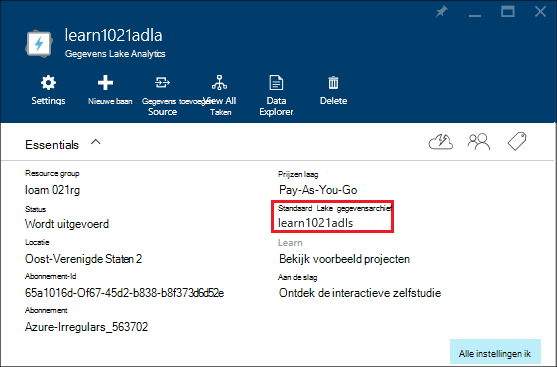

<properties 
   pageTitle="Azure gegevens Lake Analytics met behulp van de portal Azure beheren | Azure" 
   description="Informatie over gegevens Lake Analytics acounts, gegevensbronnen, gebruikers en taken beheren." 
   services="data-lake-analytics" 
   documentationCenter="" 
   authors="edmacauley" 
   manager="jhubbard" 
   editor="cgronlun"/>
 
<tags
   ms.service="data-lake-analytics"
   ms.devlang="na"
   ms.topic="article"
   ms.tgt_pltfrm="na"
   ms.workload="big-data" 
   ms.date="10/06/2016"
   ms.author="edmaca"/>

# Azure gegevens Lake Analytics met Azure portal beheren

[AZURE.INCLUDE [manage-selector](../../includes/data-lake-analytics-selector-manage.md)]

Informatie over het beheren van Azure gegevens Lake Analytics-accounts, account-gegevensbronnen, gebruikers en taken met behulp van de portal Azure. Klik op de knop voor tabselectie boven aan de pagina overzicht van onderwerpen met een ander hulpprogramma.

**Vereisten**

Voordat u deze zelfstudie hebt u de volgende items:

- **Azure een abonnement**. Zie [Azure krijg gratis proefperiode](https://azure.microsoft.com/pricing/free-trial/).

<!-- ################################ -->
<!-- ################################ -->
## Accounts beheren

Voordat u alle gegevens Lake Analytics taken uitvoert, moet u een account gegevens Lake Analytics hebben. In tegenstelling tot HDInsight, Azure betaalt u alleen voor een gegevens Lake Analytics-account wanneer u een taak uitvoert.  U betaalt alleen voor de tijd waarop een taak wordt uitgevoerd.  Zie [Overzicht Azure Lake Analytics](data-lake-analytics-overview.md)voor meer informatie.  

**Een Data Lake Analytics-account maken**

1. Aanmelden op de [portal Azure](https://portal.azure.com).
2. Klik op **Nieuw**en op **Intelligence + analytics**, **Data Lake Analytics**.
3. Typ of Selecteer de volgende waarden:

    

    - **Naam**: de naam van de account gegevens Lake Analytics.
    - **Abonnement**: Kies de Azure abonnement gebruikt voor het Analytics-account.
    - **Resourcegroep**. Selecteer een bestaande brongroep van Azure of een nieuwe maken. Azure Resource Manager kunt u werken met de resources in uw toepassing als een groep. Zie [Azure Resource Manager-overzicht](resource-group-overview.md)voor meer informatie. 
    - **Locatie**. Selecteer een Azure Datacenter voor de account gegevens Lake Analytics. 
    - **Gegevensarchief Lake**: elke gegevens Lake Analytics account een afhankelijke gegevensarchief Lake-account heeft. De gegevens Lake Analytics-account en de afhankelijke Lake gegevensarchief account moeten zich bevinden in dezelfde Azure Datacenter. Volg de instructies voor het maken van een nieuw gegevensarchief Lake-account of een bestaande selecteren.

8. Klik op **maken**. Het gaat u naar de portal home scherm. Een nieuwe tegel wordt toegevoegd aan de StartBoard met het label 'Deploying Azure gegevens Lake Analytics' weergegeven. Het duurt even voor het maken van een account gegevens Lake Analytics. Wanneer de account wordt gemaakt, wordt de rekening op een nieuwe blade geopend in de portal.

Nadat een account gegevens Lake Analytics is gemaakt, kunt u extra Lake gegevensarchief Azure opslag rekeningen en toevoegen. Zie [gegevens lake Analytics beheren rekening gegevensbronnen](data-lake-analytics-manage-use-portal.md#manage-account-data-sources)voor meer informatie.

**Op een gegevens-Lake Analytics account toegang/open**

1. Aanmelden op de [portal Azure](https://portal.azure.com/).
2. Klik op **Gegevens Lake Analytics** in het linkermenu.  Als u deze niet ziet, klikt u op **meer services**en klik op **Gegevens Lake Analytics** onder **Intelligence + Analytics**.
3. Klik op de Data Lake Analytics-account die u wilt openen. De account wordt geopend in een nieuw blade.

**Een Data Lake Analytics-account verwijderen**

1. Open de Data Lake Analytics-account die u wilt verwijderen. Zie [toegang tot gegevens Lake Analytics-accounts](#access-adla-account)voor meer informatie.
2. Klik op **verwijderen** in het knopmenu boven aan het blad.
3. Typ de naam van de account en klik vervolgens op **verwijderen**.

Als een gegevens Lake Analytics-account verwijdert, niet de afhankelijke Lake gegevensarchief rekeningen. Zie voor instructies van gegevensopslag Lake accounts verwijderen, [account verwijderen Lake gegevensarchief](data-lake-store-get-started-portal.md#delete-azure-data-lake-store-account).

<!-- ################################ -->
<!-- ################################ -->
## Gegevensbronnen account beheren

Gegevens Lake Analytics ondersteunt momenteel de volgende gegevensbronnen:

- [Azure Lake gegevensarchief](../data-lake-store/data-lake-store-overview.md)
- [Azure opslag](../storage/storage-introduction.md)

Wanneer u een gegevens-Lake Analytics-account maakt, moet u een account Azure Lake gegevensarchief de standaardaccount opslag aanwijzen. De standaardaccount Lake gegevensarchief wordt gebruikt voor het opslaan van controlelogboeken metagegevens en taak taak. Nadat u een Data Lake Analytics-account hebt gemaakt, kunt u extra Lake gegevensarchief accounts en/of opslag Azure account toevoegen. 

**De standaardaccount voor de opslag van gegevens Lake zoeken**

- Open de Data Lake Analytics-account die u wilt beheren. Zie [toegang tot gegevens Lake Analytics-accounts](#access-adla-account)voor meer informatie. De standaardopslag voor meer gegevens wordt weergegeven in de **essentiële**:

    

**Aanvullende gegevensbronnen toevoegen**

1. Open de Data Lake Analytics-account die u wilt beheren. Zie [toegang tot gegevens Lake Analytics-accounts](#access-adla-account)voor meer informatie.
2. Klik op **Instellingen** en vervolgens klikt u op de **Gegevensbronnen**. Ziet u de standaardaccount voor gegevensopslag Lake daar vermeld wordt. 
3. Klik op **gegevensbron toevoegen**.

    

    Als u wilt een gegevensarchief voor Lake Azure-account toevoegt, moet u de account naam en toegang tot de account kunnen deze query.
    Als u wilt toevoegen een Azure Blob-opslag, moet u de account voor de opslag en de sleutel rekening, die u vinden kunt door te gaan naar de rekening voor opslag in de portal.

**Gegevensbronnen verkennen**  

1. Open de Analytics-account die u wilt beheren. Zie [toegang tot gegevens Lake Analytics-accounts](#access-adla-account)voor meer informatie.
2. Klik op **Instellingen** en klik vervolgens op **Data Explorer**. 
 
    
    
3. Klik op een gegevensarchief Lake account om het account te openen.

    
    
    U kunt voor elke rekening gegevensarchief Lake
    
    - **Nieuwe map**: nieuwe map toevoegen.
    - **Uploaden**: uploaden van bestanden naar de rekening voor de opslag van uw werkstation.
    - **Toegang**: toegang configureren machtigingen.
    - **Naam van map**: de naam van een map wijzigen.
    - **Eigenschappen van mappen**: bestand of de map eigenschappen, weergeven, zoals WASB-pad, WEBHDFS, het laatst is gewijzigd tijd enzovoort.
    - **Verwijderen van map**: een map verwijderen.

**Voor het uploaden van bestanden naar Lake gegevensarchief rekening**

1. Vanuit de Portal in het linkermenu klikt u op **Bladeren** en klik vervolgens op **Lake gegevensarchief**.
2. Klik op het gegevensarchief Lake account die u wilt uploaden van gegevens. De standaardaccount voor gegevensopslag Lake, vindt u [hier](#default-adl-account).
3. Klikt u op **Gegevens** uit het bovenste menu.
4. Klik op **Nieuwe map** om een nieuwe map te maken of klik op de naam van een map naar de map wijzigen.
6. Klik op **uploaden** in het bovenste menu bestand te uploaden.

**Voor het uploaden van bestanden naar Azure Blob opslag account**

Zie [gegevens voor Hadoop projecten in HDInsight uploaden](../hdinsight/hdinsight-upload-data.md).  De informatie is van toepassing op gegevens Lake Analytics.

## Gebruikers beheren

Gegevens Lake Analytics gebruikmaakt van op rollen gebaseerde toegangscontrole met Azure Active Directory. Wanneer u een gegevens-Lake Analytics-account maakt, wordt de rol van een 'Abonnement Admins' toegevoegd aan de rekening. U kunt toevoegen als u meer gebruikers en beveiligingsgroepen met de volgende functies:

|Rol|Beschrijving|
|----|-----------|
|Eigenaar|Kunt u alles, met inbegrip van toegang tot bronnen te beheren.|
|Inzender|Toegang tot de portal; verzenden en taken controleren. Als u taken, moet een inzender de machtiging lezen of schrijven naar de rekeningen Lake gegevensarchief.|
|DataLakeAnalyticsDeveloper | Indienen, controleren en taken annuleren.  Deze gebruikers kunnen alleen hun eigen taken annuleren. Zij kunnen niet hun eigen account beheren, bijvoorbeeld, gebruikers toevoegen, machtigingen wijzigen of de account verwijderen. Taken uitvoeren moeten, ze lees- of schrijftoegang tot de rekeningen van het gegevensarchief Lake     | 
|Reader|Hiermee kunt u Alles bekijken, maar geen wijzigingen aanbrengen.|  
|DevTest Labs gebruiker|U kunt alles te bekijken en verbinding maken, starten, opnieuw opstarten en afsluiten van de virtuele machines.|  
|Beheerder toegang|U kunt gebruikerstoegang tot Azure bronnen beheren.|  

Zie [Wat is Azure Active Directory](../active-directory/active-directory-whatis.md)voor meer informatie over het maken van Azure Active Directory-gebruikers en beveiligingsgroepen.

**Gebruikers of beveiligingsgroepen toevoegen aan een account gegevens Lake Analytics**

1. Open de Analytics-account die u wilt beheren. Zie [toegang tot gegevens Lake Analytics-accounts](#access-adla-account)voor meer informatie.
2. Klik op **Instellingen**en klik vervolgens op **gebruikers**. U kunt ook klikken op **toegang** op de titelbalk **Essentials** zoals in de volgende schermafdruk:

    
3. Klik op **toevoegen**in het blad **gebruiker** .
4. Selecteer een rol toevoegen van een gebruiker en klik vervolgens op **OK**.

**Opmerking: Als deze gebruiker of groep taken, moeten zij op de Lake gegevensarchief en toestemming gegeven. Zie [beveiligde gegevens die zijn opgeslagen in Lake gegevensarchief](../data-lake-store/data-lake-store-secure-data.md)voor meer informatie.**

<!-- ################################ -->
<!-- ################################ -->
## Taken beheren

Voordat u alle U SQL-taken kunt uitvoeren, moet u een account gegevens Lake Analytics hebben.  Zie [accounts gegevens Lake Analytics beheren](#manage-data-lake-analytics-accounts)voor meer informatie.

**Een taak maken**

1. Open de Analytics-account die u wilt beheren. Zie [toegang tot gegevens Lake Analytics-accounts](#access-adla-account)voor meer informatie.
2. Klik op **nieuwe taak**.

    

    Er wordt een nieuwe blade die lijkt op:

    

    Voor elke taak, kunt u configureren

  	|Naam|Beschrijving|
  	|----|-----------|
  	|Taaknaam|Voer de naam van de taak.|
  	|Prioriteit|Hoe lager het nummer heeft een hogere prioriteit. Als twee taken beide in de wachtrij geplaatst zijn, met een lagere prioriteit eerst wordt uitgevoerd|
  	|Parallellisme |Het maximumaantal compute processen die op hetzelfde moment kan gebeuren. Een hoger aantal kan de prestaties verbeteren, maar ook kosten kunnen toenemen.|
  	|Script|Het U SQL-script voor het project invullen.|

    Met dezelfde interface, kunt u ook de gegevensbronnen koppelen verkennen en extra bestanden toevoegen aan de gekoppelde gegevensbronnen. 
3. Als u de taak wilt maken, klikt u op **Taak verzenden** .

**Een project indienen**

Zie [taken maken gegevens Lake Analytics](#create-job).

**Taken controleren**

1. Open de Analytics-account die u wilt beheren. Zie [toegang tot gegevens Lake Analytics-accounts](#access-adla-account)voor meer informatie. Het deelvenster Beheer bevat de elementaire taakinformatie:

    

3. Zoals in de vorige afbeelding, klikt u op **Taakbeheer** .

    

4. Klik op een taak in de lijst. Of klik op **Filter** waarmee u de taken zoeken:

    

    U kunt taken per **Periode**, **Taaknaam**en **auteur**filteren.
5. Klik op **indienen** als u wilt dat de taak opnieuw indienen.

**Een taak opnieuw indienen**

Zie [Netwerkcontrole gegevens Lake Analytics taken](#monitor-jobs).

##.-Gebruik controleren

**.-Gebruik controleren**

1. Open de Analytics-account die u wilt beheren. Zie [toegang tot gegevens Lake Analytics-accounts](#access-adla-account)voor meer informatie. Het deelvenster gebruik wordt het gebruik:

    

2. Dubbelklik op het deelvenster om meer details te zien.

##Beeld U SQL-catalogus

De [catalogus U SQL](data-lake-analytics-use-u-sql-catalog.md) gebruikt voor het structureren van gegevens en code zodat ze kunnen worden gedeeld door U SQL-scripts. De catalogus kunt de hoogste prestaties met gegevens in Azure gegevens meer mogelijk. Vanaf de portal Azure bent u kunt U SQL-catalogus weergeven.

**Kunt U SQL-catalogus bladeren**

1. Open de Analytics-account die u wilt beheren. Zie [toegang tot gegevens Lake Analytics-accounts](#access-adla-account)voor meer informatie.
2. Klikt u op **Gegevens** uit het bovenste menu.
3. Vouw **catalogus**, vouw **master**en uit **tabellen, of **tabel-gewaardeerde functies**, of **-assembly's **. Het volgende screenshot toont een tabelwaardefunctie.

    

<!-- ################################ -->
<!-- ################################ -->
## Groepen Azure Resource Manager gebruiken

Toepassingen zijn gewoonlijk opgebouwd uit veel onderdelen, bijvoorbeeld een web app, database, databaseserver, opslag en services van andere leveranciers. Azure Resource Manager kunt u werken met de resources in uw toepassing als een groep, een resourcegroep Azure genoemd. U kunt implementeren, bijwerken, controleren of alle resources voor de toepassing in een enkele, gecoördineerde bewerking verwijderen. U een sjabloon gebruiken voor de implementatie en de sjabloon die voor verschillende omgevingen zoals test-, ontwikkel- en productiecomputers kunt werken. U kunt de facturering voor uw organisatie verduidelijken door de samengevouwen kosten voor de hele groep weer te geven. Zie [Azure Resource Manager-overzicht](../azure-resource-manager/resource-group-overview.md)voor meer informatie. 

Een Data Lake Analytics-service kan de volgende onderdelen bevatten:

- Azure gegevens Lake Analytics account
- Vereiste standaard Azure Lake gegevensarchief account
- Aanvullende Azure gegevensarchief Lake accounts
- Extra opslag Azure accounts

U kunt deze onderdelen onder één Resource Management group om ze gemakkelijker te beheren.

Een account gegevens Lake Analytics en de rekeningen voor opslag afhankelijk moeten worden geplaatst in het midden met dezelfde gegevens Azure.
De Resource Management groep kan echter zich bevinden in een ander datacenter.  

##Zie ook 

- [Overzicht van Microsoft Azure gegevens Lake Analytics](data-lake-analytics-overview.md)
- [Aan de slag met Data Lake Analytics met Azure portal](data-lake-analytics-get-started-portal.md)
- [Azure gegevens Lake Analytics met Azure PowerShell beheren](data-lake-analytics-manage-use-powershell.md)
- [Controleren en oplossen van problemen met Azure gegevens Lake Analytics taken met Azure portal](data-lake-analytics-monitor-and-troubleshoot-jobs-tutorial.md)

