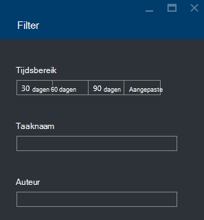

<properties 
   pageTitle="Problemen oplossen met Azure gegevens Lake Analytics taken met Azure Portal | Azure" 
   description="Informatie over het gebruik van de Portal Azure gegevens Lake Analytics taken oplossen. " 
   services="data-lake-analytics" 
   documentationCenter="" 
   authors="edmacauley" 
   manager="jhubbard" 
   editor="cgronlun"/>
 
<tags
   ms.service="data-lake-analytics"
   ms.devlang="na"
   ms.topic="article"
   ms.tgt_pltfrm="na"
   ms.workload="big-data" 
   ms.date="05/16/2016"
   ms.author="edmaca"/>

# Problemen oplossen met Azure gegevens Lake Analytics taken met Azure Portal

Informatie over het gebruik van de Portal Azure gegevens Lake Analytics taken oplossen.

In deze zelfstudie wordt u het probleem van een ontbrekende bron bestand instellen en de Azure Portal gebruiken bij het oplossen van het probleem.

**Vereisten**

Voordat u deze zelfstudie hebt u het volgende:

- **Basiskennis van gegevens Lake Analytics proces van taken**. Zie [aan de slag met Azure gegevens Lake Analytics met Azure Portal](data-lake-analytics-get-started-portal.md).
- **A gegevens Lake Analytics-account**. Zie [aan de slag met Azure gegevens Lake Analytics met Azure Portal](data-lake-analytics-get-started-portal.md#create-adl-analytics-account).
- **Kopieer de voorbeeldgegevens op de standaardrekening Lake gegevensarchief**.  Zie [de brongegevens voorbereiden](data-lake-analytics-get-started-portal.md#prepare-source-data)

##Een taak gegevens Lake Analytics verzenden

Nu maakt u een U-SQL-taak met de naam van een beschadigd bronbestand.  

**De taak verzenden**

1. Klik op **Microsoft Azure** in de linkerbovenhoek van het Portal Azure.
2. Klik op de tegel met de naam van uw gegevens Lake Analytics.  Het is hier vastgehouden wanneer de account is gemaakt.
Als de account niet er is vastgemaakt, Zie [een Analytics-account vanuit de portal te openen](data-lake-analytics-manage-use-portal.md#access-adla-account).
3. Klik op **Nieuwe taak** in het bovenste menu.
4. Voer een taaknaam en de volgende U SQL-script:

        @searchlog =
            EXTRACT UserId          int,
                    Start           DateTime,
                    Region          string,
                    Query           string,
                    Duration        int?,
                    Urls            string,
                    ClickedUrls     string
            FROM "/Samples/Data/SearchLog.tsv1"
            USING Extractors.Tsv();
        
        OUTPUT @searchlog   
            TO "/output/SearchLog-from-adls.csv"
        USING Outputters.Csv();

    Het bronbestand dat is gedefinieerd in het script is **/Samples/Data/SearchLog.tsv1**, waarbij **/Samples/Data/SearchLog.tsv**worden.
     
5. Klik op **Taak verzenden** vanaf de bovenkant. Een nieuw deelvenster met Details van de taak wordt geopend. Op de titelbalk wordt de status van de taak. Het duurt een paar minuten duren. U kunt klikken op **vernieuwen** als u de meest recente status.
6. Wacht totdat de status van de taak wordt gewijzigd in **mislukt**.  Als de taak **is voltooid**, is het omdat u de map /Samples niet verwijderen. Zie de sectie **vereisten** aan het begin van de zelfstudie.

U kunt vraagt zich af - waarom duurt het zo lang voor een klein project.  Onthoud dat gegevens Lake Analytics is ontworpen om grote gegevens te verwerken.  Het schijnt dat bij de verwerking van een grote hoeveelheid gegevens met behulp van een gedistribueerd systeem.

We gaan nu wordt ervan uitgegaan dat u de taak heeft ingediend en sluit de portal.  In het volgende gedeelte leert u hoe u problemen met het project.

## Problemen oplossen met het project

In de laatste sectie vindt u een taak hebt ingediend en de taak is mislukt.  

**Voor een overzicht van alle projecten**

1. Klik op **Microsoft Azure** in de linkerbovenhoek van het Azure portal.
2. Klik op de tegel met de naam van uw gegevens Lake Analytics.  De taak-overzicht wordt weergegeven op de tegel **Taakbeheer** .

    
    
    Het Project Management biedt u een overzicht van de status van de taak. Zoals u ziet, dat er is een mislukte taak.
   
3. Klik op de tegel **Taakbeheer** om het overzicht van de projecten. De taken worden onderverdeeld in **actief**, **in wachtrij**en **beëindigd**. Ziet u de mislukte taak in de sectie **beëindigd** wordt. Het zijn eerste bestand uit de lijst. Wanneer u een groot aantal taken hebt, kunt u **filteren** zodat u taken vinden.

    

4. Klik op de mislukte taak in de lijst om de taakdetails openen in een nieuwe blade:

    
    
    Let op de knop **opnieuw indienen** . Nadat u het probleem hebt opgelost, kunt u de taak opnieuw indienen.

5. Klik op gemarkeerde deel van de vorige screenshot voor het openen van gegevens van de fout.  Er wordt ongeveer als volgt:

    

    Geeft u dat de bronmap is niet gevonden.
    
6. Klik op **Script dupliceren**.
7. Het pad **van** de volgende update:

    "/ Samples/Data/SearchLog.tsv"

8. Klik op **taak**.

##Zie ook

- [Azure gegevens Lake Analytics overzicht](data-lake-analytics-overview.md)
- [Aan de slag met Azure gegevens Lake Analytics met Azure PowerShell](data-lake-analytics-get-started-powershell.md)
- [Aan de slag met Azure gegevens Lake Analytics en U-SQL met behulp van Visual Studio](data-lake-analytics-u-sql-get-started.md)
- [Azure gegevens Lake Analytics met Azure Portal beheren](data-lake-analytics-manage-use-portal.md)

