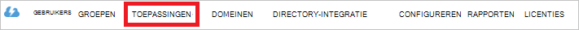

<properties
   pageTitle="Verificatie met Lake gegevensarchief met Active Directory | Microsoft Azure"
   description="Meer informatie over het verifiëren met Lake gegevensarchief met Active Directory"
   services="data-lake-store"
   documentationCenter=""
   authors="nitinme"
   manager="jhubbard"
   editor="cgronlun"/>

<tags
   ms.service="data-lake-store"
   ms.devlang="na"
   ms.topic="article"
   ms.tgt_pltfrm="na"
   ms.workload="big-data"
   ms.date="10/17/2016"
   ms.author="nitinme"/>

# Verificatie van de eindgebruiker met Lake gegevensarchief met Azure Active Directory

> [AZURE.SELECTOR]
- [Verificatie Services](data-lake-store-authenticate-using-active-directory.md)
- [Verificatie van de eindgebruiker](data-lake-store-end-user-authenticate-using-active-directory.md)

Azure Active Directory-gegevensarchief Lake Azure gebruikt voor verificatie. Voordat u een toepassing die met Azure Lake gegevensarchief of Azure gegevens Lake Analytics werkt ontwerpen, moet u eerst bepalen hoe u wilt dat voor de verificatie van uw toepassing met Azure Active Directory (AD Azure). De twee belangrijkste opties zijn beschikbaar:

* Verificatie van de eindgebruiker, en 
* Verificatie Services. 

Deze beide opties ertoe leiden dat uw toepassing wordt geleverd met een 2.0 OAuth-token die wordt gekoppeld aan elk verzoek Azure Lake gegevensarchief of Azure gegevens Lake Analytics.

Dit artikel spreekt over het maken een webtoepassing Azure AD voor verificatie van de eindgebruiker. Zie [Azure Active Directory met behulp van Service-service - verificatie met Lake gegevensarchief](data-lake-store-authenticate-using-active-directory.md)voor instructies over de toepassingsconfiguratie Azure AD voor verificatie Services.

## Vereisten

* Een abonnement op Azure. Zie [Azure krijg gratis proefperiode](https://azure.microsoft.com/pricing/free-trial/).
* Uw abonnement-ID. U kunt deze ophalen vanaf de Portal Azure. Het is bijvoorbeeld verkrijgbaar op de bladeserver Lake gegevensarchief account.

    

* Uw domeinnaam Azure AD. U kunt deze ophalen door de muis in de rechterbovenhoek van de Portal Azure. Het screenshot hieronder de domeinnaam is **contoso.microsoft.com**en de GUID tussen haakjes is de id van de huurder. 

    

## Verificatie van de eindgebruiker

Dit is de aanbevolen werkwijze als u wilt dat de eindgebruiker zich aanmelden bij uw toepassing via Azure AD. Uw toepassing kan Azure bronnen met hetzelfde niveau van toegang als de eindgebruiker die aangemeld worden. De eindgebruiker moet verstrekken hun referenties periodiek in volgorde voor uw toepassing toegankelijk.

Het resultaat van de eindgebruiker zich aanmeldt met is dat uw toepassing een toegangstoken en een token vernieuwen wordt gegeven. Het toegangstoken wordt gekoppeld aan elk verzoek Lake gegevensarchief of gegevens Lake Analytics en geldig is gedurende een uur standaard. Het token vernieuwd kan worden gebruikt voor het verkrijgen van een nieuwe toegangstoken en is geldig voor maximaal twee weken standaard als regelmatig gebruikt. U kunt twee verschillende benaderingen voor de eindgebruiker zich aanmelden.

### Met behulp van het pop-upmenu voor OAuth 2.0

Uw toepassing kan resulteren in een pop-up OAuth 2.0 vergunning, waarin de eindgebruiker hun referenties kan invoeren. Dit pop-upmenu werkt ook samen met het proces verificatie met Azure AD twee factoren (2FA), indien nodig. 

>[AZURE.NOTE] Met deze methode wordt nog niet ondersteund in de Azure AD verificatie bibliotheek (ADAL) voor Python of Java.

### Rechtstreeks doorgeven in de referenties van de gebruiker

Uw toepassing kan rechtstreeks referenties van de gebruiker naar Azure AD. Deze methode werkt alleen met de gebruikersaccounts voor de organisatie-ID; is niet compatibel met pc / gebruikersaccounts "live ID", met inbegrip van die eindigt op @outlook.com of @live.com. Bovendien is deze methode is niet compatibel met gebruikersaccounts waarvoor verificatie Azure AD twee factoren (2FA).

### Wat moet ik deze aanpak gebruiken?

* Azure AD-domeinnaam. Dit wordt al vermeld in de vereiste van dit artikel.

* Azure AD **-webtoepassing**

* Client-ID voor de webtoepassing Azure AD

* Antwoord URI voor de webtoepassing Azure AD

* Overgedragen machtigingen

Zie de sectie [een Active Directory-toepassing maken](#create-an-active-directory-application) hieronder voor instructies over het maken van een webtoepassing Azure AD en configureert voor de hierboven vermelde eisen. 

## Een Active Directory-toepassing maken

In deze sectie we meer informatie over het maken en configureren van een webtoepassing Azure AD voor verificatie van de eindgebruiker met Azure Lake gegevensarchief Azure Active Directory wordt gebruikt.

### Stap 1: Een Azure Active Directory-toepassing maken

>[AZURE.NOTE] De onderstaande stappen via de Portal Azure. U kunt ook een Azure AD toepassing maken met [Azure PowerShell](../resource-group-authenticate-service-principal.md) of [Azure CLI](../resource-group-authenticate-service-principal-cli.md).

1. Log in op uw Account Azure via de [klassieke portal](https://manage.windowsazure.com/).

2. Selecteer **Active Directory** in het linkerdeelvenster.

     
     
3. Selecteer de Active Directory die u gebruiken wilt voor het maken van de nieuwe toepassing. Als er meer dan één Active Directory, wilt u meestal de toepassing maken in de map waarin uw abonnement staat. U kunt alleen toegang verlenen tot resources in uw abonnement voor toepassingen in dezelfde map als uw abonnement.  

     
    
    
3. De toepassingen in de map, klik op **toepassingen**.

     

4. Als u nog niet hebt gemaakt een toepassing in deze map voordat u ziet iets dergelijks aan de volgende afbeelding. Klik op **een toepassing toevoegen**

     

     Of klik op **toevoegen** in het onderste deelvenster.

     

6. Geef een naam op voor de toepassing en selecteert u het type toepassing dat u wilt maken. Voor deze zelfstudie, een **WEB toepassing en/of WEB API** maken en klik op de knop Volgende.

     

7. Vul de eigenschappen voor uw app. **SIGN-ON-URL**, bieden de URI naar een website waarop de toepassing wordt beschreven. Het bestaan van de website is niet gevalideerd. Bieden voor **APP-ID URI**, de URI die de toepassing aangeeft.

     

    Klik op het selectievakje om de wizard hebt voltooid en de toepassing te maken.

### Stap 2: De client-id ophalen URI beantwoorden en gedelegeerde machtigingen instellen

1. Klik op het tabblad **configureren** om het wachtwoord van uw toepassing configureren.

     

2. Kopieer de **CLIENT-ID**.
  
     

3. Kopieer de **URI antwoord**onder de sectie **op** .

    

4. Klik onder **machtigingen voor andere toepassingen**, op **toepassing toevoegen**

    

5. Selecteer **Gegevens-Lake Azure** en **Windows** **Azure Service Management API**en klikt u op het vinkje in de wizard **machtigingen voor andere toepassingen** .

6. De **Overgedragen machtigingen** voor de zojuist toegevoegde services is standaard ingesteld op nul. Klik op de **Overgedragen machtigingen** vervolgkeuzelijst voor gegevens-Lake Azure en Windows Azure Management-Service en schakel de selectievakjes in voor de waarden ingesteld op 1 beschikbaar. Het resultaat ziet er zo uit.

     

7. Klik op **Opslaan**.

## Volgende stappen

In dit artikel een Azure AD-webtoepassing wordt gemaakt en die worden verzameld door de informatie die u nodig hebt in uw toepassingen te ontwerpen met behulp van de SDK voor .NET, Java SDK, enz. U kunt nu doorgaan met de volgende artikelen die praten over het gebruik van de webtoepassing Azure AD eerst worden geverifieerd met het gegevensarchief Lake en vervolgens andere bewerkingen uitvoeren op de winkel.

- [Aan de slag met Azure Lake gegevensarchief maken met .NET SDK](data-lake-store-get-started-net-sdk.md)
- [Aan de slag met Azure Lake gegevensarchief maken met Java-SDK](data-lake-store-get-started-java-sdk.md)
