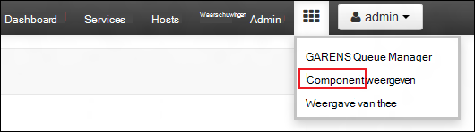
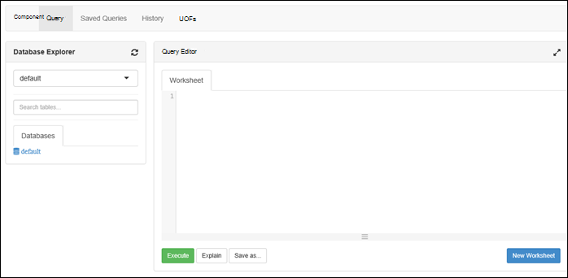

<properties
   pageTitle="HDInsight clusters maken met Azure Lake gegevensarchief maken met de portal | Azure"
   description="Azure Portal maken en gebruiken van clusters voor HDInsight met Azure Lake gegevensarchief gebruiken"
   services="data-lake-store,hdinsight" 
   documentationCenter=""
   authors="nitinme"
   manager="jhubbard"
   editor="cgronlun"/>

<tags
   ms.service="data-lake-store"
   ms.devlang="na"
   ms.topic="article"
   ms.tgt_pltfrm="na"
   ms.workload="big-data"
   ms.date="10/21/2016"
   ms.author="nitinme"/>

# Maak een cluster HDInsight met Lake gegevensarchief met Azure Portal

> [AZURE.SELECTOR]
- [Met behulp van Portal](data-lake-store-hdinsight-hadoop-use-portal.md)
- [Met behulp van PowerShell](data-lake-store-hdinsight-hadoop-use-powershell.md)
- [Met behulp van bronbeheer](data-lake-store-hdinsight-hadoop-use-resource-manager-template.md)

Informatie over het Azure Portal gebruiken voor het maken van een cluster HDInsight (HBase Hadoop Spark of Storm) met toegang tot de gegevensopslag Lake Azure. Enkele belangrijke overwegingen voor deze release:

* **Motoren voor clusters (Linux) en Hadoop-clusters (Windows en Linux)**, het gegevensarchief Lake kan alleen worden gebruikt als een account extra opslagruimte. De standaardaccount voor de opslag van dergelijke clusters steeds Azure opslag BLOB's (WASB) nog.

* **Voor de Storm-clusters (Windows en Linux)**, het gegevensarchief Lake kunnen worden gebruikt om gegevens te schrijven van een Storm-topologie. Lake gegevensopslag kan ook gebruikt worden voor het opslaan van referentiegegevens die vervolgens kunnen worden gelezen door een Storm-topologie. Voor meer informatie, Zie [Gebruik gegevensarchief Lake in een Storm-topologie](#use-data-lake-store-in-a-storm-topology).

* **HBase voor clusters (Windows en Linux)**, het gegevensarchief Lake kan worden gebruikt als een standaard opslag en extra opslagruimte. Zie [Gebruik gegevensarchief Lake HBase clusters](#use-data-lake-store-with-hbase-clusters)voor meer informatie.

> [AZURE.NOTE] Enkele belangrijke punten om te onthouden. 
> 
> * Optie voor het maken van clusters van HDInsight met toegang tot de gegevensopslag Lake is alleen beschikbaar voor HDInsight versie 3.2 en 3.4 (voor clusters op zowel Windows als Linux Hadoop, HBase en Storm). Deze optie is alleen beschikbaar op HDInsight 3.4 clusters voor clusters Spark op Linux.
>
> * Zoals hierboven vermeld, is als standaard opslag voor bepaalde clustertypen (HBase) en extra opslagruimte voor andere clustertypen (Hadoop, Spark, Storm) Lake gegevensopslag beschikbaar. Met behulp van Lake gegevensarchief als een account extra opslagruimte heeft geen gevolgen voor prestaties of de mogelijkheid om te lezen/schrijven voor de opslag van het cluster. In een scenario waar Lake gegevensarchief wordt gebruikt als extra opslagruimte, cluster-bestanden (zoals Logboeken, enz.) om de standaard opslag Azure BLOB's (), geschreven terwijl de gegevens die u wilt verwerken in een gegevensarchief Lake account kunnen worden opgeslagen.

## Vereisten

Voordat u deze zelfstudie hebt u het volgende:

- **Azure een abonnement**. Zie [Azure krijg gratis proefperiode](https://azure.microsoft.com/pricing/free-trial/).

- **Azure Lake gegevensarchief account**. Volg de instructies op de [aan de slag met Azure Lake gegevensarchief maken met de Portal Azure](data-lake-store-get-started-portal.md). 

- **Voorbeeldgegevens aan uw account Azure Lake gegevensarchief uploaden**. Als u de account hebt gemaakt, de volgende taken uitvoeren om te uploaden voorbeeldgegevens. U moet deze gegevens later in de zelfstudie uit te voeren taken uit een cluster van HDInsight die toegang tot de gegevens in het gegevensarchief Lake.

    * [Een map in uw Lake gegevensarchief maken](data-lake-store-get-started-portal.md#createfolder).
    * [Upload een bestand naar uw winkel gegevens Lake](data-lake-store-get-started-portal.md#uploaddata). Als u voorbeeldgegevens wilt uploaden zoekt, krijgt u de map **Data ambulances** uit de [Azure gegevens Lake Git Repository](https://github.com/Azure/usql/tree/master/Examples/Samples/Data/AmbulanceData).

- **Azure Active Directory Service Principal**. Stappen in deze zelfstudie geven instructies voor het maken van een service principal in AD Azure. U moet wel een beheerder AD Azure mogelijk te maken van een service principal. Als u een Azure AD-beheerder bent, kunt u deze vereiste overslaan en doorgaan met de zelfstudie.
    
    **Als u niet een Azure AD-beheerder bent**, is het niet mogelijk voor het uitvoeren van de stappen die nodig zijn voor het maken van een service principal. In dat geval moet uw beheerder Azure AD eerst een service principal maken voordat u een cluster HDInsight met Lake gegevensarchief kunt maken. Ook moet de service principal worden gemaakt met behulp van een certificaat, zoals beschreven bij het [maken van een service principal met certificaat](../resource-group-authenticate-service-principal.md#create-service-principal-with-certificate).

## U leert sneller met video's?

Bekijk de volgende video's om te begrijpen hoe HDInsight clusters met toegang naar Lake gegevensopslag inrichten.

* [Maak een cluster HDInsight met toegang tot de gegevensopslag Lake](https://mix.office.com/watch/l93xri2yhtp2)
* Zodra de cluster is ingesteld, [Access-gegevens in het gegevensarchief van meer component en varken scripts gebruiken](https://mix.office.com/watch/1n9g5w0fiqv1q)

## Maak een HDInsight-cluster met toegang tot de gegevensopslag Lake Azure

In dit gedeelte maakt u een HDInsight Hadoop-cluster dat het gegevensarchief Lake als een extra opslagruimte gebruikt. In deze release, kan voor een cluster Hadoop Lake gegevensopslag alleen worden gebruikt als een extra opslagruimte voor het cluster. De standaard opslag nog steeds de opslag Azure BLOB's (WASB). Dus eerst maken we de opslag account en Opslagcontainers nodig zijn voor het cluster.

1. Aanmelden voor de nieuwe [Portal Azure](https://portal.azure.com).

2. Volg de stappen bij het [maken van Hadoop clusters in het HDInsight](../hdinsight/hdinsight-provision-clusters.md#create-using-the-preview-portal) te starten met een HDInsight-cluster wordt ingericht.

3. Klik op het blad **Optionele configuratie** **Gegevensbron**. Geef de details voor de account voor opslag en opslag container, **locatie** opgeven als **Oost-VS 2**in de blade **Gegevensbron** en klik op **Cluster AAD identiteit**.

    ![Add service principal HDInsight cluster] (./media/data-lake-store-hdinsight-hadoop-use-portal/hdi.adl.1.png "Add service principal HDInsight cluster")

4. Op het blad **Cluster AAD identiteit** kunt u een bestaande Service Principal selecteren of een nieuwe maken.

    * **Maak een nieuwe Service Principal**

        * Klik op **Nieuw**in het blad **Cluster AAD identiteit** naar **Service Principal**en in het **maken van een Service Principal** blade, geeft u de waarden wilt maken van een nieuwe service principal. Als onderdeel van die, wordt een certificaat en een Azure Active Directory-toepassing ook gemaakt. Klik op **maken**.

            ![Add service principal HDInsight cluster] (./media/data-lake-store-hdinsight-hadoop-use-portal/hdi.adl.2.png "Add service principal HDInsight cluster")

        * Klik op het blad **Cluster AAD identiteit** **ADLS toegang beheren**. Het deelvenster ziet u het gegevensarchief Lake accounts die zijn gekoppeld aan het abonnement. U kunt echter instellen dat de machtigingen voor de account die u hebt gemaakt. Selecteer machtigingen voor lezen/schrijven/uitvoeren voor de account die u wilt koppelen aan het cluster HDInsight en klik vervolgens op **Machtigingen opslaan**.

            ![Add service principal HDInsight cluster] (./media/data-lake-store-hdinsight-hadoop-use-portal/hdi.adl.3.png "Add service principal HDInsight cluster")

        * Klik op het blad **Cluster AAD identiteit** **Certificaat downloaden** om te downloaden van het certificaat dat is gekoppeld aan de service principal dat u hebt gemaakt. Dit is handig als u de dezelfde service principal in de toekomst gebruiken wilt bij het maken van clusters voor extra HDInsight. Klik op **selecteren**.

            ![Add service principal HDInsight cluster] (./media/data-lake-store-hdinsight-hadoop-use-portal/hdi.adl.4.png "Add service principal HDInsight cluster")

    * **Kies een bestaande Service Principal**

        * In het **Cluster AAD identiteit** blade, klik op **bestaande**en **Service Principal**op in het blad **selecteert u een Service Principal** zoekt u naar een bestaande service principal. Klik op service principal name en klik vervolgens op **selecteren**.

            ![Add service principal HDInsight cluster] (./media/data-lake-store-hdinsight-hadoop-use-portal/hdi.adl.5.png "Add service principal HDInsight cluster")

        * Op het blad **Cluster AAD identiteit** certificaat (.pfx) dat is gekoppeld aan de geselecteerde service-principal uploaden en geeft u het wachtwoord voor het certificaat.

5. Klik op **ADLS toegang beheren** en klik op **machtigingen voor bestanden selecteren**. 

    ![Add service principal HDInsight cluster] (./media/data-lake-store-hdinsight-hadoop-use-portal/hdi.adl.5.existing.save.png "Add service principal HDInsight cluster")

6. In het blad **bestandsmachtigingen selecteren** in de vervolgkeuzelijst **Account** de Lake gegevensarchief rekening selecteren die u wilt dat is gekoppeld aan het cluster HDInsight. Het blad bevat de bestanden en mappen beschikbaar in de geselecteerde gegevensarchief Lake rekening. 
 
    ![Geven toegang tot de gegevensopslag Lake] (./media/data-lake-store-hdinsight-hadoop-use-portal/hdi-adl-permission-1.png "Geven toegang tot de gegevensopslag Lake")

    Daarna bepalen de machtigingen voor de geselecteerde bestanden en mappen. Voor mappen, moet u ook opgeven of de machtigingen van toepassing op de map of op de map en alle onderliggende items in de map. U kunt deze selectie maken door de juiste waarde te selecteren in het vak **Toepassen op** vervolgkeuzelijst. U kunt een machtiging op het pictogram **verwijderen**

    ![Geven toegang tot de gegevensopslag Lake] (./media/data-lake-store-hdinsight-hadoop-use-portal/hdi-adl-permission-2.png "Geven toegang tot de gegevensopslag Lake")

    Herhaal deze stappen om de bijbehorende bestanden en mappen van andere gegevensarchief Lake-accounts. Als u klaar bent met het toewijzen van de machtigingen, klikt u op **selecteren** onder aan het blad.

7. Controleer de machtigingen die u hebt opgegeven in de blade **geselecteerde machtigingen toewijzen** en klik vervolgens op **uitvoeren** als deze machtigingen wilt verlenen.

    ![Geven toegang tot de gegevensopslag Lake] (./media/data-lake-store-hdinsight-hadoop-use-portal/hdi-adl-permission-3.png "Geven toegang tot de gegevensopslag Lake")

    De voortgang wordt weergegeven in de statuskolom. Als u alle machtigingen kunnen worden toegewezen, klikt u op **Gereed**. 

6. Klik op **selecteren** op het **Cluster AAD identiteits** - en **Gegevensbron** blades en Ga door met de cluster creaties zoals beschreven bij het [maken van Hadoop clusters in het HDInsight](../hdinsight/hdinsight-hadoop-create-linux-clusters-portal.md).

7. Zodra de cluster wordt ingericht, kunt u controleren dat de Service Principal gekoppeld aan het cluster HDInsight is. Klik op **Cluster AAD identiteit** om de bijbehorende Service Principal Zie hiervoor uit het cluster blade.

    ![Add service principal HDInsight cluster] (./media/data-lake-store-hdinsight-hadoop-use-portal/hdi.adl.6.png "Add service principal HDInsight cluster")

## Testtaken uitvoeren op de cluster HDInsight het Azure Lake gegevensarchief gebruiken

Nadat u een HDInsight-cluster hebt geconfigureerd, kunt u testtaken uitvoeren op het cluster dat de cluster HDInsight toegang krijgen gegevens in de gegevensopslag Lake Azure tot testen. Om dit te doen, we enkele component query's dat doel het gegevensarchief Lake wordt uitgevoerd.

### Voor een Linux-cluster

1. Open de blade cluster voor het cluster dat u zojuist hebt ingericht en klik vervolgens op **Dashboard**. Hiermee opent u Ambari voor de Linux-cluster. Bij de toegang tot Ambari, wordt u gevraagd om de site te verifiëren. Voer de admin (standaard admin), account en het wachtwoord dat u gebruikt bij het maken van het cluster.

    ![Starten van de cluster-dashboard] (./media/data-lake-store-hdinsight-hadoop-use-portal/hdiadlcluster1.png "Starten van de cluster-dashboard")

    U kunt ook rechtstreeks naar Ambari gaan door te gaan naar de https://CLUSTERNAME.azurehdinsight.net in een webbrowser (waar de **CLUSTERNAAM** de naam van het cluster HDInsight is).

2. Open de component. Selecteer de reeks vakjes in het Paginamenu (naast de koppeling **Admin** en de knop aan de rechterkant van de pagina) aan de lijst met beschikbare weergaven. Selecteer de **component** -weergave.

    

3. Een pagina met de volgende strekking worden weergegeven:

    

4. Plak de volgende instructie in de HiveQL in het werkblad in de **Query Editor** -sectie van de pagina:

        CREATE EXTERNAL TABLE vehicles (str string) LOCATION 'adl://mydatalakestore.azuredatalakestore.net:443/mynewfolder'

5. Klik op de knop **uitvoeren** onder in de **Query Editor** om de query te starten. Een gedeelte van de **Resultaten van de Query** moet worden weergegeven onder de **Query Editor** en informatie over de taak weergeven.

6. Nadat de query is voltooid, wordt het gedeelte van de **Resultaten van de Query** de resultaten van de bewerking weergegeven. Het tabblad **resultaten** moet de volgende gegevens bevatten:

7. De volgende query uitvoeren om te controleren of de tabel is gemaakt.

        SHOW TABLES;

    Het tabblad **resultaten** moet het volgende worden weergegeven:

        hivesampletable
        vehicles

    **voertuigen** is de tabel die u eerder hebt gemaakt. **hivesampletable** is beschikbaar in alle clusters van HDInsight standaard een voorbeeldtabel.

8. U kunt ook een query voor het ophalen van gegevens uit de tabel **voertuigen** uitvoeren.

        SELECT * FROM vehicles LIMIT 5;

### Voor een cluster met Windows

1. Open de blade cluster voor het cluster dat u zojuist hebt ingericht en klik vervolgens op **Dashboard**.

    ![Starten van de cluster-dashboard] (./media/data-lake-store-hdinsight-hadoop-use-portal/hdiadlcluster1.png "Starten van de cluster-dashboard")

    Voer desgevraagd de referenties voor het cluster.

2. Hiermee opent u de Console Microsoft Azure HDInsight Query. Klik op **component-Editor**.

    ![Open component editor] (./media/data-lake-store-hdinsight-hadoop-use-portal/hdiadlcluster2.png "Open component editor")

3. In de component-Editor, voert u de volgende query en klik op **verzenden**.

        CREATE EXTERNAL TABLE vehicles (str string) LOCATION 'adl://mydatalakestore.azuredatalakestore.net:443/mynewfolder'

    In deze query component maken we een tabel met gegevens die zijn opgeslagen in het gegevensarchief van Lake op `adl://mydatalakestore.azuredatalakestore.net:443/mynewfolder`. Deze locatie heeft een voorbeeldbestand dat u moet eerder zijn geüpload.

    De tabel **Taak sessie** onderaan ziet u de status van de taak wijzigt van **Bezig met initialiseren**, **uitgevoerd**, **voltooid**. U kunt ook klikken op **Details weergeven** voor meer informatie over de taak voltooid.

    ![Tabel maken] (./media/data-lake-store-hdinsight-hadoop-use-portal/hdiadlcluster3.png "Tabel maken")

4. De volgende query uitvoeren om te controleren of de tabel is gemaakt.

        SHOW TABLES;

    Klik op **Details weergeven** overeenkomt met deze query en de uitvoer moet het volgende worden weergegeven:

        hivesampletable
        vehicles

    **voertuigen** is de tabel die u eerder hebt gemaakt. **hivesampletable** is beschikbaar in alle clusters van HDInsight standaard een voorbeeldtabel.

5. U kunt ook een query voor het ophalen van gegevens uit de tabel **voertuigen** uitvoeren.

        SELECT * FROM vehicles LIMIT 5;

## Access Lake gegevensarchief HDFS opdrachten

Nadat u het cluster HDInsight Lake gegevensopslag gebruikt hebt geconfigureerd, kunt u de HDFS shell-opdrachten voor toegang tot de winkel.

### Voor een Linux-cluster

In dit gedeelte u SSH zal in het cluster en de HDFS opdrachten uitvoeren. Windows beschikt niet over een ingebouwde SSH-client. Beste **stopverf**, dat kan worden gedownload van [http://www.chiark.greenend.org.uk/~sgtatham/putty/download.html](http://www.chiark.greenend.org.uk/~sgtatham/putty/download.html)gebruiken.

Zie voor meer informatie over het gebruik van stopverf, [Gebruik SSH met Linux-gebaseerde Hadoop op HDInsight van Windows](../hdinsight/hdinsight-hadoop-linux-use-ssh-windows.md).

Wanneer een verbinding, u het volgende HDFS filesystem om de bestanden in het gegevensarchief Lake.

    hdfs dfs -ls adl://<Data Lake Store account name>.azuredatalakestore.net:443/

Dit moet het bestand dat u eerder hebt geüpload naar de gegevensopslag Lake aanbieden.

    15/09/17 21:41:15 INFO web.CaboWebHdfsFileSystem: Replacing original urlConnectionFactory with org.apache.hadoop.hdfs.web.URLConnectionFactory@21a728d6
    Found 1 items
    -rwxrwxrwx   0 NotSupportYet NotSupportYet     671388 2015-09-16 22:16 adl://mydatalakestore.azuredatalakestore.net:443/mynewfolder

U kunt ook de `hdfs dfs -put` opdracht sommige bestanden uploaden naar de gegevensopslag Lake en vervolgens met `hdfs dfs -ls` om te controleren of de bestanden zijn geüpload.

### Voor een cluster met Windows

1. Aanmelden voor de nieuwe [Portal Azure](https://portal.azure.com).

2. Klik op **Bladeren** **HDInsight clusters**en klik vervolgens op het cluster HDInsight die u hebt gemaakt.

3. Klik op **Extern bureaublad**in de blade cluster en klik op **verbinding maken**in de **Extern bureaublad** -blade.

    ![Externe HDI cluster] (./media/data-lake-store-hdinsight-hadoop-use-portal/ADL.HDI.PS.Remote.Desktop.png "Maak een brongroep Azure")

    Voer desgevraagd de referenties die u hebt opgegeven voor de extern bureaublad-gebruiker.

4. In de externe sessie start Windows PowerShell en de HDFS filesystem-opdrachten gebruiken om de bestanden in de Azure Lake gegevensopslag.

        hdfs dfs -ls adl://<Data Lake Store account name>.azuredatalakestore.net:443/

    Dit moet het bestand dat u eerder hebt geüpload naar de gegevensopslag Lake aanbieden.

        15/09/17 21:41:15 INFO web.CaboWebHdfsFileSystem: Replacing original urlConnectionFactory with org.apache.hadoop.hdfs.web.URLConnectionFactory@21a728d6
        Found 1 items
        -rwxrwxrwx   0 NotSupportYet NotSupportYet     671388 2015-09-16 22:16 adl://mydatalakestore.azuredatalakestore.net:443/mynewfolder

    U kunt ook de `hdfs dfs -put` opdracht sommige bestanden uploaden naar de gegevensopslag Lake en vervolgens met `hdfs dfs -ls` om te controleren of de bestanden zijn geüpload.

## Gebruik gegevensarchief Lake met vonkontsteking cluster

In dit gedeelte kunt u Jupyter laptop beschikbaar met clusters HDInsight Spark een taak uitvoeren die gegevens ophaalt uit een gegevensarchief Lake-account die u aan een cluster HDInsight Spark, in plaats van de standaard Azure opslag Blob-account gekoppeld.

1. Via de voorbeeldgegevens kopiëren vanuit de standaard opslag-account (WASB) die is gekoppeld aan het cluster vonk aan de Azure gegevens Lake store-account die is gekoppeld aan het cluster. Hiervoor kunt u het [hulpprogramma ADLCopy](http://aka.ms/downloadadlcopy) . Download en installeer het hulpprogramma van de koppeling.

2. Open een opdrachtprompt en Ga naar de map waarin AdlCopy is geïnstalleerd, doorgaans `%HOMEPATH%\Documents\adlcopy`.

3. Voer de volgende opdracht om een specifiek blob uit de Broncontainer kopiëren naar een gegevensarchief Lake:

        AdlCopy /source https://<source_account>.blob.core.windows.net/<source_container>/<blob name> /dest swebhdfs://<dest_adls_account>.azuredatalakestore.net/<dest_folder>/ /sourcekey <storage_account_key_for_storage_container>

    Voor deze zelfstudie kopiëren **HVAC.csv** voorbeeldgegevensbestand op **/HdiSamples/HdiSamples/SensorSampleData/hvac/** naar de rekening Azure Lake gegevensarchief. Het codefragment moet er als volgt uitzien:

        AdlCopy /Source https://mydatastore.blob.core.windows.net/mysparkcluster/HdiSamples/HdiSamples/SensorSampleData/hvac/HVAC.csv /dest swebhdfs://mydatalakestore.azuredatalakestore.net/hvac/ /sourcekey uJUfvD6cEvhfLoBae2yyQf8t9/BpbWZ4XoYj4kAS5Jf40pZaMNf0q6a8yqTxktwVgRED4vPHeh/50iS9atS5LQ==

    >[AZURE.WARNING] Zorg ervoor dat u die de bestands- en padnamen in het geval van de juiste zijn.

4. U wordt gevraagd de referenties invoeren voor de Azure abonnement waarmee u uw gegevensarchief Lake-account hebt. Ziet u de volgende uitvoer:

        Initializing Copy.
        Copy Started.
        100% data copied.
        Copy Completed. 1 file copied.

    Het gegevensbestand (**HVAC.csv**) worden onder een map **/hvac** in het gegevensarchief Lake account gekopieerd.

4. De [Azure Portal](https://portal.azure.com/)van de startboard, klik op de tegel voor uw cluster Spark (als u deze aan de startboard vastgemaakt). U kunt ook navigeren naar het cluster onder **Alle bladeren** > **HDInsight Clusters**.   

2. Van de bladeserver Spark-cluster op **Snelkoppelingen**en klik **Jupyter laptop**van de bladeserver **Cluster Dashboard** . Geef desgevraagd de referenties van de beheerder voor het cluster.

    > [AZURE.NOTE] U kan ook de laptop Jupyter voor uw cluster bereiken via de volgende URL in uw browser. __CLUSTERNAAM__ vervangen door de naam van het cluster:
    >
    > `https://CLUSTERNAME.azurehdinsight.net/jupyter`

2. Een nieuw notitieblok maken. Klik op **Nieuw**en klik vervolgens op **PySpark**.

    ![Een nieuwe laptop voor Jupyter maken] (./media/data-lake-store-hdinsight-hadoop-use-portal/hdispark.note.jupyter.createnotebook.png "Een nieuwe laptop voor Jupyter maken")

3. Een nieuw notitieblok wordt gemaakt en geopend met de naam **Untitled.pynb**. 

4. Omdat u een laptop met behulp van de kernel PySpark gemaakt, hoeft u niet alle contexten expliciet maken. Vonk en component contexten wordt automatisch voor u gemaakt wanneer u de eerste cel in de code uitvoert. U kunt starten door het importeren van de typen die nodig zijn voor dit scenario. Hiertoe het volgende codefragment plakken in een cel en druk op **SHIFT + ENTER**.

        from pyspark.sql.types import *
        
    Telkens wanneer u een taak in Jupyter uitvoert, wordt de titel van uw web browser venster status **(bezet)** en de titel van het notitieblok weergeven. U ziet ook een gevulde cirkel naast de tekst **PySpark** in de rechterbovenhoek. Nadat de taak is voltooid, wordt dit gewijzigd in een lege cirkel.

     ![Status van een taak van de laptop Jupyter] (./media/data-lake-store-hdinsight-hadoop-use-portal/hdispark.jupyter.job.status.png "Status van een taak van de laptop Jupyter")

4. Voorbeeldgegevens in een tijdelijke tabel met behulp van het **HVAC.csv** -bestand dat u hebt gekopieerd naar de rekening van het gegevensarchief Lake laden. U kunt toegang krijgen tot de gegevens in het gegevensarchief Lake rekening met de volgende URL-patroon.

        adl://<data_lake_store_name>.azuredatalakestore.net/<path_to_file>

    Plakken in het volgende voorbeeld, **MYDATALAKESTORE** vervangen door de naam van uw Lake gegevensarchief in een lege cel en druk op **SHIFT + ENTER**. In dit voorbeeld registreert de gegevens naar een tijdelijke tabel **voor installaties**genoemd.

        # Load the data
        hvacText = sc.textFile("adl://MYDATALAKESTORE.azuredatalakestore.net/hvac/HVAC.csv")
        
        # Create the schema
        hvacSchema = StructType([StructField("date", StringType(), False),StructField("time", StringType(), False),StructField("targettemp", IntegerType(), False),StructField("actualtemp", IntegerType(), False),StructField("buildingID", StringType(), False)])
        
        # Parse the data in hvacText
        hvac = hvacText.map(lambda s: s.split(",")).filter(lambda s: s[0] != "Date").map(lambda s:(str(s[0]), str(s[1]), int(s[2]), int(s[3]), str(s[6]) ))
        
        # Create a data frame
        hvacdf = sqlContext.createDataFrame(hvac,hvacSchema)
        
        # Register the data fram as a table to run queries against
        hvacdf.registerTempTable("hvac")

5. Aangezien u een kernel PySpark gebruikt, kunt u nu rechtstreeks uitvoeren een SQL-query op de tijdelijke tabel **voor installaties** die u zojuist hebt gemaakt met behulp van de `%%sql` magic. Voor meer informatie over de `%%sql` magic, evenals andere magics beschikbaar met de kernel PySpark Zie [Kernels op Jupyter-laptops met vonkontsteking HDInsight clusters beschikbaar](hdinsight-apache-spark-jupyter-notebook-kernels.md#why-should-i-use-the-new-kernels).
        
        %%sql
        SELECT buildingID, (targettemp - actualtemp) AS temp_diff, date FROM hvac WHERE date = \"6/1/13\"

5. Zodra de taak is voltooid, wordt standaard de volgende uitvoer in tabelvorm weergegeven.

    ![Uitvoer van de tabel van het resultaat van de query] (./media/data-lake-store-hdinsight-hadoop-use-portal/tabular.output.png "Uitvoer van de tabel van het resultaat van de query")

    Ook ziet u de resultaten in ook andere visualisaties. Een vlakgrafiek voor hetzelfde resultaat zou uitzien als volgt uit.

    ![Gebied grafiek van het resultaat van de query] (./media/data-lake-store-hdinsight-hadoop-use-portal/area.output.png "Gebied grafiek van het resultaat van de query")

6. Nadat u klaar bent met het uitvoeren van de toepassing, moet u afsluiten van de laptop om bronnen vrij te geven. Hiertoe klikt u in het menu **bestand** op de laptop, klikt u op **sluiten en stoppen**. Deze wordt afgesloten en sluit de laptop.

## Gebruik gegevensarchief Lake in een topologie Storm

U kunt het gegevensarchief Lake schrijven van gegevens uit de topologie van een Storm. Zie voor instructies voor het bereiken van dit scenario, [Gebruik Azure Lake gegevensarchief met Apache Storm met HDInsight](../hdinsight/hdinsight-storm-write-data-lake-store.md).

## Gebruik gegevensarchief Lake HBase clusters

HBase clusters, kunt u meer gegevensarchief als een standaard opslag en extra opslagruimte. Om dit te doen:

1.  Selecteer in de blade **Gegevensbron** **HBase locatie**voor **Lake gegevensarchief** .
2.  Selecteer de naam van het gegevensarchief Lake die u wilt gebruiken of een nieuwe maken.
3.  Ten slotte geeft u de **Hoofdmap HBase** in het gegevensarchief Lake. Als het gegevensarchief Lake account beschikt niet over een hoofdmap een nieuwe maken.

    ![HBase met Lake gegevensarchief] (./media/data-lake-store-hdinsight-hadoop-use-portal/hbase-data-lake-store.png "Maak een brongroep Azure")

### Overwegingen bij het gebruik van Lake gegevensarchief als standaard opslagruimte voor clusters HBase

* Voor meer dan één HBase cluster kunt u dezelfde account Lake gegevensarchief. **HBase hoofdmap** die u voor het cluster (stap 4 in de schermopname hierboven opgeeft) moet uniek. U **moet niet** de hoofdmap van hetzelfde gebruiken via twee verschillende HBase clusters.
* Hoewel u Lake gegevensarchief account als standaard opslag gebruikt, worden de logboekbestanden HBase cluster nog steeds in de Azure opslag BLOB's (WASB) die is gekoppeld aan het cluster opgeslagen. Dit is in het blauw in de schermopname boven gemarkeerd.

## Zie ook

* [PowerShell: Een cluster van HDInsight voor het gebruik van Lake gegevensarchief maken](data-lake-store-hdinsight-hadoop-use-powershell.md)

[makecert]: https://msdn.microsoft.com/library/windows/desktop/ff548309(v=vs.85).aspx
[pvk2pfx]: https://msdn.microsoft.com/library/windows/desktop/ff550672(v=vs.85).aspx
