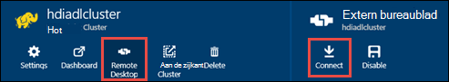

<properties
   pageTitle="HDInsight clusters met Azure Lake gegevensarchief met behulp van bronbeheer sjablonen maken | Microsoft Azure"
   description="Azure Resource Manager-sjablonen gebruiken voor het maken en gebruiken van clusters voor HDInsight met Azure Lake gegevensarchief"
   services="data-lake-store,hdinsight"
   documentationCenter=""
   authors="nitinme"
   manager="jhubbard"
   editor="cgronlun"/>

<tags
   ms.service="data-lake-store"
   ms.devlang="na"
   ms.topic="article"
   ms.tgt_pltfrm="na"
   ms.workload="big-data"
   ms.date="10/21/2016"
   ms.author="nitinme"/>

# <a name="create-an-hdinsight-cluster-with-data-lake-store-using-azure-resource-manager-template"></a>Een HDInsight-cluster met Lake gegevensarchief met behulp van bronbeheer Azure-sjabloon maken

> [AZURE.SELECTOR] - [Met behulp van Portal](data-lake-store-hdinsight-hadoop-use-portal.md) - [met behulp van PowerShell](data-lake-store-hdinsight-hadoop-use-powershell.md) - [met behulp van bronbeheer](data-lake-store-hdinsight-hadoop-use-resource-manager-template.md)

Informatie over hoe u een sjabloon Azure Resource Manager gebruiken voor het configureren van een cluster HDInsight met toegang tot de gegevensopslag Lake Azure. Enkele belangrijke overwegingen voor deze release:

-   **Motoren voor clusters (Linux), en clusters van Hadoop/Storm (Windows en Linux)**, het gegevensarchief Lake kan alleen worden gebruikt als een account extra opslagruimte. De standaardaccount voor de opslag van dergelijke clusters steeds Azure opslag BLOB's (WASB) nog.

-   **HBase voor clusters (Windows en Linux)**, het gegevensarchief Lake kan worden gebruikt als een standaard opslag of extra opslagruimte.

> [AZURE.NOTE] Enkele belangrijke punten om te onthouden.
>
> - Optie voor het maken van clusters van HDInsight met toegang tot de gegevensopslag Lake is alleen beschikbaar voor HDInsight versie 3.2 en 3.4 (voor clusters op zowel Windows als Linux Hadoop, HBase en Storm). Deze optie is alleen beschikbaar op HDInsight 3.4 clusters voor clusters Spark op Linux.
>
> - Zoals hierboven vermeld, is als standaard opslag voor bepaalde clustertypen (HBase) en extra opslagruimte voor andere clustertypen (Hadoop, Spark, Storm) Lake gegevensopslag beschikbaar. Met behulp van Lake gegevensarchief als een account extra opslagruimte heeft geen gevolgen voor prestaties of de mogelijkheid om te lezen/schrijven voor de opslag van het cluster. In een scenario waar Lake gegevensarchief wordt gebruikt als extra opslagruimte, cluster-bestanden (zoals Logboeken, enz.) om de standaard opslag Azure BLOB's (), geschreven terwijl de gegevens die u wilt verwerken in een gegevensarchief Lake account kunnen worden opgeslagen.
>

In dit artikel richten we een cluster Hadoop met Lake gegevensarchief als extra opslagruimte.

## <a name="prerequisites"></a>Vereisten

Voordat u deze zelfstudie hebt u het volgende:

-   **Azure een abonnement**. Zie [Azure krijg gratis proefperiode](https://azure.microsoft.com/pricing/free-trial/).

-   **Azure PowerShell 1.0 of hoger**. Zie [het installeren en configureren van Azure PowerShell](../powershell-install-configure.md).

- **Azure Active Directory Service Principal**. Stappen in deze zelfstudie geven instructies voor het maken van een service principal in AD Azure. U moet wel een beheerder AD Azure mogelijk te maken van een service principal. Als u een Azure AD-beheerder bent, kunt u deze vereiste overslaan en doorgaan met de zelfstudie.
    
    **Als u niet een Azure AD-beheerder bent**, is het niet mogelijk voor het uitvoeren van de stappen die nodig zijn voor het maken van een service principal. In dat geval moet uw beheerder Azure AD eerst een service principal maken voordat u een cluster HDInsight met Lake gegevensarchief kunt maken. Ook moet de service principal worden gemaakt met behulp van een certificaat, zoals beschreven bij het [maken van een service principal met certificaat](../resource-group-authenticate-service-principal.md#create-service-principal-with-certificate).

## <a name="create-an-hdinsight-cluster-with-azure-data-lake-store"></a>Maak een cluster HDInsight met Azure Lake gegevensarchief

De sjabloon Resource Manager en de vereisten voor het gebruik van de sjabloon, zijn beschikbaar op GitHub op [een HDInsight Linux cluster met nieuwe gegevensarchief Lake implementeren](https://github.com/Azure/azure-quickstart-templates/tree/master/201-hdinsight-datalake-store-azure-storage). Volg de instructies op deze link voor het maken van een cluster HDInsight met Azure gegevensarchief Lake als extra opslagruimte.

De instructies op de koppeling hierboven genoemde vereist PowerShell. Voordat u met deze instructies, zorg ervoor dat u zich aanmeldt bij uw account Azure. Op het bureaublad opent een nieuw venster met Azure PowerShell en voer de volgende fragmenten. Wanneer u wordt gevraagd aan te melden, moet dat u zich aanmelden als een van de admininistrators abonnement/eigenaar:

```
# Log in to your Azure account
Login-AzureRmAccount

# List all the subscriptions associated to your account
Get-AzureRmSubscription

# Select a subscription
Set-AzureRmContext -SubscriptionId <subscription ID>
```

## <a name="upload-sample-data-to-the-azure-data-lake-store"></a>Voorbeeldgegevens uploaden naar de Azure Lake gegevensopslag

De bronnenbeheerder sjabloon een nieuw gegevensarchief Lake account maakt en koppelt aan het cluster HDInsight. Nu moet u voorbeeldgegevens uploaden naar de gegevensopslag Lake. U moet deze gegevens later in de zelfstudie uit te voeren taken uit een cluster van HDInsight die toegang tot de gegevens in het gegevensarchief Lake. Zie [een bestand uploadt naar de gegevensopslag Lake](data-lake-store-get-started-portal.md#uploaddata)voor instructies over het uploaden van gegevens. Als u voorbeeldgegevens wilt uploaden zoekt, krijgt u de map **Data ambulances** uit de [Azure gegevens Lake Git Repository](https://github.com/Azure/usql/tree/master/Examples/Samples/Data/AmbulanceData).

## <a name="set-relevant-acls-on-the-sample-data"></a>Stel relevante ACL's van de voorbeeldgegevens

Zorg ervoor dat de voorbeeldgegevens die u hebt geüpload is toegankelijk vanuit de HDInsight-cluster, moet u ervoor zorgen dat de Azure AD-toepassing die wordt gebruikt om identiteit tussen de cluster HDInsight en Lake gegevensarchief toegang heeft tot het bestand of de map die u probeert toegang te krijgen tot stand te brengen. U doet dit door de volgende stappen uitvoeren.

1.  De naam van de toepassing van Azure AD die is gekoppeld aan een cluster van HDInsight en het gegevensarchief Lake vinden. Een manier om te zoeken naar de naam is de HDInsight cluster bladeserver die u hebt gemaakt met de sjabloon Resource Manager openen, klikt u op het tabblad **Cluster AAD identiteit** en zoek naar de waarde van de **Weergavenaam van de Service Principal**.

2.  Nu, voor toegang tot deze toepassing Azure AD op het bestand of de map die u wilt gebruiken uit het cluster HDInsight. De juiste ACL's op het bestand of de map in het gegevensarchief Lake, Zie [gegevens beveiligen in Lake gegevensarchief](data-lake-store-secure-data.md#assign-users-or-security-group-as-acls-to-the-azure-data-lake-store-file-system).

## <a name="run-test-jobs-on-the-hdinsight-cluster-to-use-the-data-lake-store"></a>Testtaken uitvoeren op de cluster HDInsight gebruiken het gegevensarchief Lake

Nadat u een HDInsight-cluster hebt geconfigureerd, kunt u testtaken uitvoeren op het cluster om te testen of het cluster HDInsight Lake gegevensarchief toegang. We voeren een taak monster component maakt een tabel met behulp van de voorbeeldgegevens die u eerder hebt geüpload naar de gegevensopslag Lake hiervoor.

### <a name="for-a-linux-cluster"></a>Voor een Linux-cluster

In deze sectie wordt u SSH in de cluster en run de een voorbeeldquery component. Windows beschikt niet over een ingebouwde SSH-client. Beste **stopverf**, dat kan worden gedownload van [http://www.chiark.greenend.org.uk/~sgtatham/putty/download.html](http://www.chiark.greenend.org.uk/~sgtatham/putty/download.html)gebruiken.

Zie voor meer informatie over het gebruik van stopverf, [Gebruik SSH met Linux-gebaseerde Hadoop op HDInsight van Windows ](../hdinsight/hdinsight-hadoop-linux-use-ssh-windows.md).

1.  Wanneer een verbinding, start u de CLI component met de volgende opdracht:

    ```
    hive
    ```

2.  Met behulp van de CLI, voert u de volgende instructies om een nieuwe tabel met de naam **voertuigen** de voorbeeldgegevens in de gegevensopslag Lake maken:

    ```
    DROP TABLE vehicles;
    CREATE EXTERNAL TABLE vehicles (str string) LOCATION 'adl://<mydatalakestore>.azuredatalakestore.net:443/';
    SELECT * FROM vehicles LIMIT 10;
    ```

    Een uitvoer van de volgende strekking worden weergegeven:

    ```
    1,1,2014-09-14 00:00:03,46.81006,-92.08174,51,S,1
    1,2,2014-09-14 00:00:06,46.81006,-92.08174,13,NE,1
    1,3,2014-09-14 00:00:09,46.81006,-92.08174,48,NE,1
    1,4,2014-09-14 00:00:12,46.81006,-92.08174,30,W,1
    1,5,2014-09-14 00:00:15,46.81006,-92.08174,47,S,1
    1,6,2014-09-14 00:00:18,46.81006,-92.08174,9,S,1
    1,7,2014-09-14 00:00:21,46.81006,-92.08174,53,N,1
    1,8,2014-09-14 00:00:24,46.81006,-92.08174,63,SW,1
    1,9,2014-09-14 00:00:27,46.81006,-92.08174,4,NE,1
    1,10,2014-09-14 00:00:30,46.81006,-92.08174,31,N,1
    ```

### <a name="for-a-windows-cluster"></a>Voor een cluster met Windows

Gebruik de volgende cmdlets voor het uitvoeren van de query voor de component. In deze query een tabel maken van de gegevens in het gegevensarchief Lake we en vervolgens een query uitvoeren op de gemaakte tabel.

```
$queryString = "DROP TABLE vehicles;" + "CREATE EXTERNAL TABLE vehicles (str string) LOCATION 'adl://$dataLakeStoreName.azuredatalakestore.net:443/';" + "SELECT * FROM vehicles LIMIT 10;"

$hiveJobDefinition = New-AzureRmHDInsightHiveJobDefinition -Query $queryString

$hiveJob = Start-AzureRmHDInsightJob -ResourceGroupName $resourceGroupName -ClusterName $clusterName -JobDefinition $hiveJobDefinition -ClusterCredential $httpCredentials

Wait-AzureRmHDInsightJob -ResourceGroupName $resourceGroupName -ClusterName $clusterName -JobId $hiveJob.JobId -ClusterCredential $httpCredentials
```

Dit heeft de volgende uitvoer. **ExitValue** van 0 in de uitvoer wordt voorgesteld dat de taak is voltooid.

```
Cluster         : hdiadlcluster.
HttpEndpoint    : hdiadlcluster.azurehdinsight.net
State           : SUCCEEDED
JobId           : job_1445386885331_0012
ParentId        :
PercentComplete :
ExitValue       : 0
User            : admin
Callback        :
Completed       : done
```

De uitvoer van de taak met behulp van de volgende cmdlet ophalen:

```
Get-AzureRmHDInsightJobOutput -ClusterName $clusterName -JobId $hiveJob.JobId -DefaultContainer $containerName -DefaultStorageAccountName $storageAccountName -DefaultStorageAccountKey $storageAccountKey -ClusterCredential $httpCredentials
```

De uitvoer van de taak de volgende strekking weergegeven:

```
1,1,2014-09-14 00:00:03,46.81006,-92.08174,51,S,1
1,2,2014-09-14 00:00:06,46.81006,-92.08174,13,NE,1
1,3,2014-09-14 00:00:09,46.81006,-92.08174,48,NE,1
1,4,2014-09-14 00:00:12,46.81006,-92.08174,30,W,1
1,5,2014-09-14 00:00:15,46.81006,-92.08174,47,S,1
1,6,2014-09-14 00:00:18,46.81006,-92.08174,9,S,1
1,7,2014-09-14 00:00:21,46.81006,-92.08174,53,N,1
1,8,2014-09-14 00:00:24,46.81006,-92.08174,63,SW,1
1,9,2014-09-14 00:00:27,46.81006,-92.08174,4,NE,1
1,10,2014-09-14 00:00:30,46.81006,-92.08174,31,N,1
```

## <a name="access-data-lake-store-using-hdfs-commands"></a>Access Lake gegevensarchief HDFS opdrachten

Nadat u het cluster HDInsight Lake gegevensopslag gebruikt hebt geconfigureerd, kunt u de HDFS shell-opdrachten voor toegang tot de winkel.

### <a name="for-a-linux-cluster"></a>Voor een Linux-cluster

In dit gedeelte u SSH zal in het cluster en de HDFS opdrachten uitvoeren. Windows beschikt niet over een ingebouwde SSH-client. Beste **stopverf**, dat kan worden gedownload van [http://www.chiark.greenend.org.uk/~sgtatham/putty/download.html](http://www.chiark.greenend.org.uk/~sgtatham/putty/download.html)gebruiken.

Zie voor meer informatie over het gebruik van stopverf, [Gebruik SSH met Linux-gebaseerde Hadoop op HDInsight van Windows ](../hdinsight/hdinsight-hadoop-linux-use-ssh-windows.md).

Wanneer een verbinding, u het volgende HDFS filesystem om de bestanden in het gegevensarchief Lake.

```
hdfs dfs -ls adl://<Data Lake Store account name>.azuredatalakestore.net:443/
```

Dit moet het bestand dat u eerder hebt geüpload naar de gegevensopslag Lake aanbieden.

```
15/09/17 21:41:15 INFO web.CaboWebHdfsFileSystem: Replacing original urlConnectionFactory with org.apache.hadoop.hdfs.web.URLConnectionFactory@21a728d6
Found 1 items
-rwxrwxrwx   0 NotSupportYet NotSupportYet     671388 2015-09-16 22:16 adl://mydatalakestore.azuredatalakestore.net:443/mynewfolder
```

U kunt ook de `hdfs dfs -put` opdracht sommige bestanden uploaden naar de gegevensopslag Lake en vervolgens met `hdfs dfs -ls` om te controleren of de bestanden zijn geüpload.

### <a name="for-a-windows-cluster"></a>Voor een cluster met Windows

1.  Aanmelden voor de nieuwe [Portal Azure](https://portal.azure.com).

2.  Klik op **Bladeren** **HDInsight clusters**en klik vervolgens op het cluster HDInsight die u hebt gemaakt.

3.  Klik op **Extern bureaublad**in de blade cluster en klik op **verbinding maken**in de **Extern bureaublad** -blade.

    

    Voer desgevraagd de referenties die u hebt opgegeven voor de extern bureaublad-gebruiker.

4.  In de externe sessie start Windows PowerShell en de HDFS filesystem-opdrachten gebruiken om de bestanden in de Azure Lake gegevensopslag.

    ```
    hdfs dfs -ls adl://<Data Lake Store account name>.azuredatalakestore.net:443/
    ```

    Dit moet het bestand dat u eerder hebt geüpload naar de gegevensopslag Lake aanbieden.

    ```
    15/09/17 21:41:15 INFO web.CaboWebHdfsFileSystem: Replacing original urlConnectionFactory with org.apache.hadoop.hdfs.web.URLConnectionFactory@21a728d6
    Found 1 items
    -rwxrwxrwx   0 NotSupportYet NotSupportYet     671388 2015-09-16 22:16 adl://mydatalakestore.azuredatalakestore.net:443/vehicle1_09142014.csv
    ```

    U kunt ook de `hdfs dfs -put` opdracht sommige bestanden uploaden naar de gegevensopslag Lake en vervolgens met `hdfs dfs -ls` om te controleren of de bestanden zijn geüpload.

## <a name="next-steps"></a>Volgende stappen

-   [Gegevens kopiëren van Azure Storage Blobs naar Lake gegevensarchief](data-lake-store-copy-data-wasb-distcp.md)
