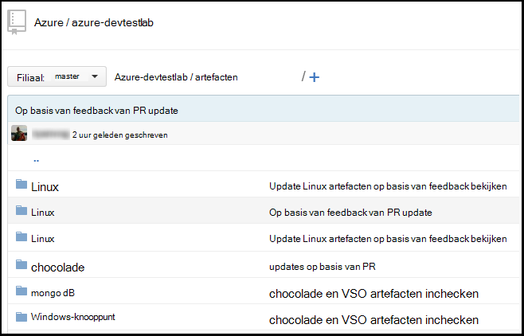
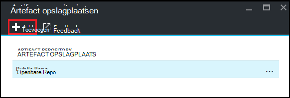
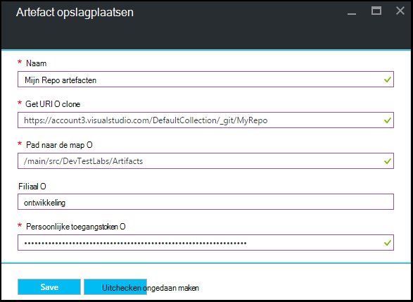

<properties
    pageTitle="Een artefact Git repository toevoegen aan een lab in Azure DevTest Labs | Microsoft Azure"
    description="Een GitHub of Visual Studio Team Services Git repository voor uw aangepaste artefacten bron toevoegen in Azure DevTest Labs"
    services="devtest-lab,virtual-machines,visual-studio-online"
    documentationCenter="na"
    authors="tomarcher"
    manager="douge"
    editor=""/>

<tags
    ms.service="devtest-lab"
    ms.workload="na"
    ms.tgt_pltfrm="na"
    ms.devlang="na"
    ms.topic="article"
    ms.date="09/06/2016"
    ms.author="tarcher"/>

# Een artefact Git repository toevoegen aan een lab in Azure DevTest Labs

> [AZURE.VIDEO how-to-add-your-private-artifacts-repository-in-a-devtest-lab]

Artefacten zijn *Acties* - zoals het installeren van software of actieve scripts en opdrachten - bij het maken van een VM in Azure DevTest Labs. Standaard bevat een lab artefacten uit de officiële Azure DevTest Labs artefact opslagplaats. U kunt een artefact Git repository toevoegen aan uw testomgeving op te nemen van de artefacten die uw team maakt. De bibliotheek kan worden gehost op [GitHub](https://github.com) of [Visual Studio Team Services (VSTS)](https://visualstudio.com).

- Voor meer informatie over het maken van een opslagplaats van GitHub, Zie de [GitHub Bootcamp](https://help.github.com/categories/bootcamp/).
- Zie informatie over het maken van een project Team Services met een Git Repository, [Visual Studio Team Services verbinding maken met](https://www.visualstudio.com/get-started/setup/connect-to-visual-studio-online).

De volgende schermafbeelding ziet u een voorbeeld van hoe een opslagplaats met artefacten in GitHub:  

## De opslagplaats informatie en referenties

Als een opslagplaats van artefact toevoegen aan uw lab, moet u eerst bepaalde gegevens ophalen uit uw bibliotheek. In de volgende gedeelten helpen u bij het ophalen van deze informatie voor artefact opslagplaatsen die worden gehost op GitHub en Visual Studio Team Services.

### De GitHub opslagplaats kloon URL en persoonlijke access token ophalen

Als u de bibliotheek GitHub kloon URL en persoonlijke toegangstoken, volg deze stappen:

1. Ga naar de introductiepagina van de GitHub opslagplaats met de definities van het artefact.

1. Selecteer **klonen of downloaden**.

1. Klik op de knop naar de **HTTPS url kopiëren** naar het Klembord kopiëren en de URL voor later gebruik opslaan.

1. Selecteer de afbeelding profiel in de rechterbovenhoek van GitHub en selecteer **Instellingen**.

1. Selecteer in het menu aan de linkerkant van **persoonlijke instellingen** , **persoonlijke toegangstokens**.

1. Selecteer **de nieuwe token genereren**.

1. Klik op de pagina **nieuwe persoonlijke toegangstoken** Voer een **Omschrijving van de Token**, accepteren de standaarditems **bereiken selecteren**en kies vervolgens **Token genereren**.

1. De gegenereerde token opslaan als u het later nodig hebt.

1. U kunt de GitHub nu sluiten.   

1. Verder met de sectie [verbinding maken met uw lab aan de opslagplaats artefact](#connect-your-lab-to-the-artifact-repository) .

### De Visual Studio Team Services opslagplaats kloon URL en persoonlijke access token ophalen

Als u de Visual Studio Team Services opslagplaats kloon URL en persoonlijke toegangstoken, volg deze stappen:

1. Open de introductiepagina van de collectie team (bijvoorbeeld: `https://contoso-web-team.visualstudio.com`), en selecteer vervolgens het project artefact.

1. Selecteer op de introductiepagina van project **-Code**.

1. Selecteer de URL kopiëren om op te geven **de codetabel van het project** , **kloon**.

1. De URL niet opslaan als u het later in deze zelfstudie nodig.

1. U maakt een persoonlijke toegang Token, **Mijn profiel** te selecteren uit de vervolgkeuzelijst gebruiker account.

1. Selecteer op de pagina profiel informatie **beveiliging**.

1. Selecteer op het tabblad **beveiliging** **toevoegen**.

1. Op de pagina **een persoonlijke toegangstoken maken** :

    - Voer een **Beschrijving** voor het token.
    - **180 dagen** selecteert in de lijst **Is verlopen In** .
    - Kies **alle toegankelijke accounts** in de lijst **Accounts** .
    - Kies de optie **alle scopes** .
    - Kies **Token maken**.

1. Wanneer u klaar bent, verschijnt het nieuwe token in de lijst **Persoonlijke toegangstokens** . Selecteer **Token kopiëren**en vervolgens de waarde voor token voor later gebruik opslaan.

1. Verder met de sectie [verbinding maken met uw lab aan de opslagplaats artefact](#connect-your-lab-to-the-artifact-repository) .

##Verbinding maken met uw lab de opslagplaats artefact

1. Log in om de [Azure portal](http://go.microsoft.com/fwlink/p/?LinkID=525040).

1. Selecteer **Meer Services**en **DevTest Labs** selecteert in de lijst.

1. Selecteer in de lijst van labs, de gewenste lab.   

1. Selecteer de **configuratie**op van het lab-blade.

1. Selecteer op het lab van **configuratie** blade, **Artefacten opslagplaatsen**.

1. Selecteer op het blad **Artefacten opslagplaatsen** **+ toevoegen**.

    
 
1. Op het tweede blad **Artefacten opslagplaatsen** , het volgende opgeven:

    - **Naam** - Voer een naam voor de bibliotheek.
    - **Git Clone Url** - Voer de URL in HTTPS Git clone die u eerder hebt gekopieerd van GitHub of Visual Studio Team Services. 
    - **Pad naar de map** - Voer het pad ten opzichte van de kloon URL de definities van artefact bevat.
    - **Filiaal** - Voer de vertakking te krijgen van uw definities artefact.
    - **Persoonlijke Access Token** - Voer de persoonlijke toegangstoken dat u eerder hebt verkregen van GitHub of Visual Studio Team Services. 
     
    

1. Selecteer **Opslaan**.

[AZURE.INCLUDE [devtest-lab-try-it-out](../../includes/devtest-lab-try-it-out.md)]

## Verwante blogberichten
- [Problemen met mislukte artefacten in AzureDevTestLabs](http://www.visualstudiogeeks.com/blog/DevOps/How-to-troubleshoot-failing-artifacts-in-AzureDevTestLabs)
- [Een VM toevoegen aan bestaand AD-domein met ARM sjabloon in Azure Dev-testlab](http://www.visualstudiogeeks.com/blog/DevOps/Join-a-VM-to-existing-AD-domain-using-ARM-template-AzureDevTestLabs)