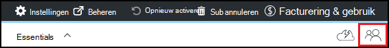

<properties
    pageTitle="Eigenaren en gebruikers toevoegen in Azure DevTest Labs | Microsoft Azure"
    description="Eigenaren en gebruikers toevoegen in Azure DevTest Labs gebruikt in de portal Azure PowerShell"
    services="devtest-lab,virtual-machines"
    documentationCenter="na"
    authors="tomarcher"
    manager="douge"
    editor=""/>

<tags
    ms.service="devtest-lab"
    ms.workload="na"
    ms.tgt_pltfrm="na"
    ms.devlang="na"
    ms.topic="article"
    ms.date="09/12/2016"
    ms.author="tarcher"/>

# Eigenaren en gebruikers toevoegen in Azure DevTest Labs

> [AZURE.VIDEO how-to-set-security-in-your-devtest-lab]

Toegang in Azure DevTest Labs wordt beheerd door [Azure_Role-Based Access Control RBAC ()](../active-directory/role-based-access-control-what-is.md). RBAC gebruikt, kunt u taken binnen uw team scheiden in *functies* waar u de hoeveelheid toegang aan gebruikers voor het uitvoeren van hun taken nodige verlenen. Drie van deze RBAC-rollen zijn *eigenaar*en *Gebruiker van DevTest Labs* *Inzender*. In dit artikel leert u welke bewerkingen kunnen worden uitgevoerd in elk van de drie belangrijkste RBAC-rollen. Daar leert u hoe u gebruikers toevoegen aan een lab - zowel via de portal en via een PowerShell-script en hoe gebruikers toe te voegen op het niveau van het abonnement.

## Acties die kunnen worden uitgevoerd in elke rol

Er zijn drie belangrijke rollen die u aan een gebruiker toewijzen kunt:

- Eigenaar
- DevTest Labs gebruiker
- Inzender

De volgende tabel ziet u de acties die door gebruikers in elk van deze functies kunnen worden uitgevoerd:

| **Gebruikers met deze rol acties kunnen uitvoeren.** | **DevTest Labs gebruiker**            | **Eigenaar** | **Inzender** |
|---|---|---|---|
| **Testlab, taken**                          |                              |       |             |
| Gebruikers toevoegen aan een lab                     | Nee                           | Ja   | Nee          |
| Update-instellingen                   | Nee                           | Ja   | Ja         |
| **VM basis taken**                      |                              |       |             |
| Toevoegen en verwijderen van aangepaste afbeeldingen           | Nee                           | Ja   | Ja         |
| Toevoegen, bijwerken en verwijderen van formules       | Ja                          | Ja   | Ja         |
| "Witte" lijst Azure Marketplace afbeeldingen     | Nee                           | Ja   | Ja         |
| **VM-taken**                           |                              |       |             |
| VMs maken                             | Ja                          | Ja   | Ja         |
| Starten, stoppen en VMs verwijderen            | Alleen VMs gemaakt door de gebruiker | Ja   | Ja         |
| VM-beleid bijwerken                     | Nee                           | Ja   | Ja         |
| Gegevensschijven van VMs toevoegen of verwijderen      | Alleen VMs gemaakt door de gebruiker | Ja   | Ja         |
| **Artefact-taken**                     |                              |       |             |
| Toevoegen en verwijderen van opslagplaatsen artefact   | Nee                           | Ja   | Ja         |
| Artefacten van toepassing                        | Ja                          | Ja   | Ja         |

> [AZURE.NOTE] Wanneer een gebruiker een VM maakt, wordt die gebruiker automatisch toegewezen aan de rol van de **eigenaar** van VM is gemaakt.

## Een eigenaar of gebruiker toevoegen op het niveau van lab

Eigenaren en gebruikers kunnen worden toegevoegd op het niveau van het lab via het portal Azure. Dit geldt ook voor externe gebruikers met een geldige [Microsoft-account (MSA)](devtest-lab-faq.md#what-is-a-microsoft-account).
De volgende stappen begeleiden u bij het proces van een eigenaar of gebruiker toe te voegen aan een lab in Azure DevTest Labs:

1. Log in om de [Azure portal](http://go.microsoft.com/fwlink/p/?LinkID=525040).

1. Selecteer **meer services**en **DevTest Labs** selecteert in de lijst.

1. Selecteer in de lijst van labs, de gewenste lab.

1. Selecteer de **configuratie**op van het lab-blade. 

1. Selecteer op het blad **configuratie** **gebruikers**.

1. Selecteer op het blad **gebruikers** **+ toevoegen**.

    

1. Selecteer de gewenste rol op het blad **een rol te selecteren** . In de sectie [acties die kunnen worden uitgevoerd in elke rol](#actions-that-can-be-performed-in-each-role) worden de verschillende acties die kunnen worden uitgevoerd door gebruikers in de eigenaar, DevTest gebruikers en rollen Inzender.

1. Voer het e-mailadres of de naam van de gebruiker die u wilt toevoegen in de rol die u hebt opgegeven op de bladeserver **gebruikers toevoegen** . Als de gebruiker niet wordt gevonden, wordt een foutbericht beschreven het probleem. Als de gebruiker wordt gevonden, wordt die gebruiker vermeld en geselecteerd. 

1. Selecteer **selecteren**.

1. Selecteer **OK** om te sluiten van de bladeserver **toegang toevoegen** .

1. Wanneer u naar de blade **gebruikers terugkeert** , is de gebruiker toegevoegd.  

## Een externe gebruiker toevoegen aan een lab met PowerShell

U kunt naast het toevoegen van gebruikers in de portal Azure, een externe gebruiker toevoegen aan uw lab met een PowerShell script. Wijzigen in het volgende voorbeeld wordt de parameterwaarden onder de opmerking **waarden te wijzigen** .
U kunt ophalen van de `subscriptionId`, `labResourceGroup`, en `labName` waarden uit het lab blade in Azure portal.

> [AZURE.NOTE]
> Het voorbeeldscript wordt ervan uitgegaan dat de opgegeven gebruiker als gast is toegevoegd aan de Active Directory en mislukken zal als dit niet het geval is. Een gebruiker in Active Directory niet toevoegen aan een lab, gebruiken de Azure portal toewijzen aan de gebruiker aan een rol, zoals geïllustreerd in de sectie [toevoegen van een eigenaar of gebruiker op het niveau van het lab](#add-an-owner-or-user-at-the-lab-level).   

    # Add an external user in DevTest Labs user role to a lab
    # Ensure that guest users can be added to the Azure Active directory:
    # https://azure.microsoft.com/en-us/documentation/articles/active-directory-create-users/#set-guest-user-access-policies

    # Values to change
    $subscriptionId = "<Enter Azure subscription ID here>"
    $labResourceGroup = "<Enter lab's resource name here>"
    $labName = "<Enter lab name here>"
    $userDisplayName = "<Enter user's display name here>"

    # Log into your Azure account
    Login-AzureRmAccount
    
    # Select the Azure subscription that contains the lab. 
    # This step is optional if you have only one subscription.
    Select-AzureRmSubscription -SubscriptionId $subscriptionId
    
    # Retrieve the user object
    $adObject = Get-AzureRmADUser -SearchString $userDisplayName
    
    # Create the role assignment. 
    $labId = ('subscriptions/' + $subscriptionId + '/resourceGroups/' + $labResourceGroup + '/providers/Microsoft.DevTestLab/labs/' + $labName)
    New-AzureRmRoleAssignment -ObjectId $adObject.Id -RoleDefinitionName 'DevTest Labs User' -Scope $labId

## Een eigenaar of gebruiker op het niveau van abonnement toevoegen

Azure machtigingen worden overgenomen van bovenliggende bereik naar een bereik van onderliggende in Azure. Eigenaren van een Azure-abonnement met labs zijn daarom automatisch eigenaren van de labs. Zij tevens eigenaar van het VMs en andere bronnen die zijn gemaakt door gebruikers van het lab en de service Azure DevTest Labs. 

U kunt meer eigenaars toevoegen aan een lab via blade in [Azure portal](http://go.microsoft.com/fwlink/p/?LinkID=525040)van het lab. De toegevoegde eigenaar reikwijdte van beheer is echter iets smaller is dan de scope van de eigenaar van het abonnement. Bijvoorbeeld, de toegevoegde eigenaren geen volledige toegang tot een aantal van de middelen die door de service DevTest Labs zijn gemaakt in het abonnement. 

Als een eigenaar aan een Azure-abonnement toevoegen, volg deze stappen:

1. Log in om de [Azure portal](http://go.microsoft.com/fwlink/p/?LinkID=525040).

1. Selecteer **Meer Services**en selecteer uit de lijst met **abonnementen** .

1. Selecteer het gewenste abonnement.

1. Selecteer **toegang tot** pictogram. 

    

1. Selecteer op het blad **gebruikers** **toevoegen**.

    

1. Selecteer de **eigenaar**op het blad **een rol te selecteren** .

1. Voer het e-mailadres of de naam van de gebruiker die u wilt toevoegen als eigenaar van een op het blad **gebruikers toevoegen** . Als de gebruiker niet wordt gevonden, krijgt u een foutbericht weergegeven waarin het probleem wordt uitgelegd. Als de gebruiker wordt gevonden, wordt die gebruiker wordt vermeld onder het tekstvak **gebruiker** .

1. Selecteer de gebruikersnaam van de bevindt.

1. Selecteer **selecteren**.

1. Selecteer **OK** om te sluiten van de bladeserver **toegang toevoegen** .

1. Wanneer u naar de blade **gebruikers terugkeert** , is de gebruiker toegevoegd als eigenaar. Deze gebruiker is nu eigenaar van een labs gemaakt onder dit abonnement en dus kunnen de eigenaar van taken uit te voeren. 

[AZURE.INCLUDE [devtest-lab-try-it-out](../../includes/devtest-lab-try-it-out.md)]
