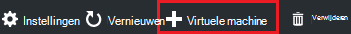
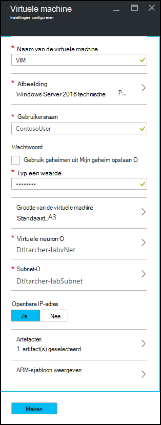
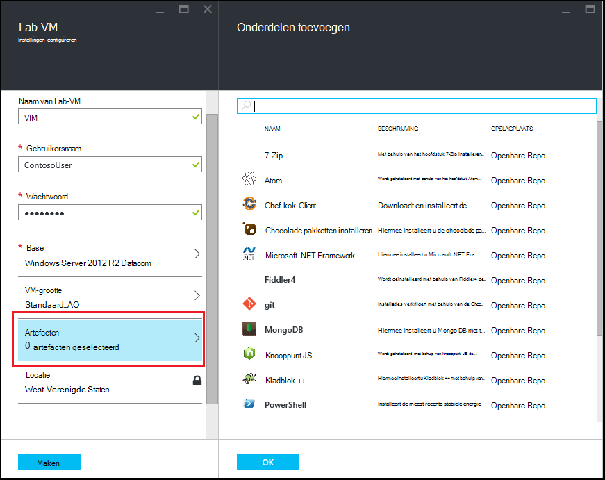
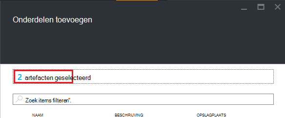

<properties
    pageTitle="Een VM met artefacten toevoegen aan een lab in Azure DevTest Labs | Microsoft Azure"
    description="Informatie over het toevoegen van een VM met artefacten in Azure DevTest Labs"
    services="devtest-lab,virtual-machines"
    documentationCenter="na"
    authors="tomarcher"
    manager="douge"
    editor=""/>

<tags
    ms.service="devtest-lab"
    ms.workload="na"
    ms.tgt_pltfrm="na"
    ms.devlang="na"
    ms.topic="article"
    ms.date="08/30/2016"
    ms.author="tarcher"/>

# Een VM met artefacten toevoegen aan een lab in Azure DevTest Labs

> [AZURE.VIDEO how-to-create-vms-with-artifacts-in-a-devtest-lab]

U maakt een VM in een testomgeving uit een *basis* die een [aangepaste installatiekopie](./devtest-lab-create-template.md), [formule](./devtest-lab-manage-formulas.md)of [Marketplace-afbeelding](./devtest-lab-configure-marketplace-images.md).

DevTest Labs *artefacten* kunt u *Acties* die worden uitgevoerd wanneer de VM wordt gemaakt. 

Artefact acties kunnen uitvoeren van procedures, zoals met Windows PowerShell-scripts Bash opdrachten uitvoeren en software installeren. 

Artefact *parameters* kunt u aanpassen de onderdelen voor uw specifieke scenario.

In dit artikel wordt beschreven hoe u een VM maken in uw testomgeving met artefacten.

## Een VM met artefacten toevoegen

1. Log in om de [Azure portal](http://go.microsoft.com/fwlink/p/?LinkID=525040).

1. Selecteer **Meer Services**en **DevTest Labs** selecteert in de lijst.

1. Selecteer in de lijst van labs, een testomgeving waarin u wilt maken van de VM.  

1. Selecteer op het lab van **Overzicht** blade, **+ virtuele Machine**.  
    

1. Selecteer op het **kiezen van een base** -blade basis voor VM.

1. Voer een naam voor de nieuwe virtuele machine in het tekstvak **naam van de virtuele machine** op de blade **virtuele machine** .

    

1. Voer een **Naam van de gebruiker** die administrator-bevoegdheden op de virtuele machine wordt verleend.  

1. Als u gebruiken een wachtwoord opgeslagen in uw *geheime winkel wilt*, selecteert u **de geheimen van mijn geheime winkel**en een belangrijke waarde die overeenkomt met uw geheim (wachtwoord) opgeven. Anders geeft u eenvoudigweg een wachtwoord in het tekstveld **een waarde**met het label.
 
1. Selecteer de **grootte van de virtuele machine** en selecteer een van de vooraf gedefinieerde items die de processorcores, RAM-geheugen en de grootte van de vaste schijf van de VM te maken.

1. **Virtueel netwerk** selecteren en selecteer de gewenste virtuele netwerk.

1. Selecteer **Subnet** en subnet te selecteren.

1. Als het lab-beleid is ingesteld op toestaan van openbare IP-adressen voor het geselecteerde subnet, kunt u opgeven of u wilt dat het IP-adres als public door **Ja** of **Nee**te selecteren. Anders is deze optie uitgeschakeld en geselecteerd als **Nee**. 

1. Selecteer **artefacten** - selecteren uit de lijst met artefacten - en configureren van de onderdelen die u wilt toevoegen aan de installatiekopie. 
**Opmerking:** Als u nog DevTest Labs of artefacten configureren nooit, gaat u verder met de sectie [toevoegen een bestaande artefact voor een VM](#add-an-existing-artifact-to-a-vm) en hier terug als u klaar bent.

1. Als u wilt bekijken of kopiëren van de sjabloon Azure Resource Manager, gaat u verder met de sectie [sjabloon opslaan Azure Resource Manager](#save-arm-template) en terugkeren wanneer u klaar bent.

1. Selecteer **maken** de opgegeven VM toevoegen aan het lab.

1. De blade lab geeft de status van het maken van de VM; eerst als **maken**, vervolgens **uitgevoerd** na de VM is gestart.

1. Ga naar de [Volgende stappen](#next-steps) . 

## Een bestaande artefact toevoegen aan een VM

U kunt bestaande artefacten toevoegen tijdens het maken van een VM. Elk lab bevat artefacten uit de openbare DevTest Labs artefact opslagplaats als artefacten die u hebt gemaakt en toegevoegd aan uw eigen bibliotheek artefact.
Als u wilt ontdekken hoe maken artefacten, raadpleegt u het artikel [informatie over het ontwerpen van uw eigen artefacten voor gebruik met DevTest Labs](devtest-lab-artifact-author.md).

1. Selecteer op de **virtuele machine** -blade **artefacten**. 

1. Selecteer de gewenste artefact op de bladeserver **artefacten toevoegen** .  

    

1. Voer de vereiste parameterwaarden en een optionele parameters die u nodig hebt.  

1. Selecteer **toevoegen** aan het artefact toevoegen en terug te keren naar het blade **Artefacten toevoegen** .

1. Doorgaan met het toevoegen van onderdelen wanneer dat nodig is voor uw VM.

1. Zodra u uw artefacten hebt toegevoegd, kunt u [de volgorde waarin de onderdelen worden uitgevoerd wijzigen](#change-the-order-in-which-artifacts-are-run). U kunt ook teruggaan naar het [weergeven of wijzigen van een artefact](#view-or-modify-an-artifact).

## Wijzig de volgorde waarin de onderdelen worden uitgevoerd

De acties van de artefacten worden standaard uitgevoerd in de volgorde waarin ze worden toegevoegd aan de VM. De volgende stappen illustreren het wijzigen van de volgorde waarin de onderdelen worden uitgevoerd.

1. Selecteer de koppeling die aangeeft hoeveel artefacten die zijn toegevoegd aan de VM aan de bovenkant van het blad **Artefacten toevoegen** .

    

1. Als u de volgorde waarin de onderdelen worden uitgevoerd, slepen en neerzetten van de artefacten in de gewenste volgorde. **Opmerking:** Als u problemen hebt met het artefact slepen, zorg dat u te vanuit de linkerkant van het artefact slepen. 

1. Klik op **OK** wanneer u klaar bent.  

## Weergeven of wijzigen van een artefact

De volgende stappen illustreren hoe u kunt weergeven of wijzigen van de parameters van een artefact:

1. Selecteer de koppeling die aangeeft hoeveel artefacten die zijn toegevoegd aan de VM aan de bovenkant van het blad **Artefacten toevoegen** .

    

1. Selecteer het onderdeel dat u wilt weergeven of bewerken op het blad **Geselecteerd artefacten** .  

1. Op het blad **Artefact toevoegen** eventueel wijzigingen wilt aanbrengen en selecteer **OK** sluit de blade **Artefact toevoegen** .

1. Selecteer **OK** om te sluiten van de bladeserver **Artefacten geselecteerd** .

## Azure Resource Manager sjabloon opslaan

Een sjabloon Azure Resource Manager biedt een declaratieve manier om een herhaalbare distributie definiëren. De volgende stappen wordt uitgelegd hoe de bronnenbeheerder Azure-sjabloon opslaan voor VM wordt gemaakt.
Als u eenmaal hebt opgeslagen, kunt u de sjabloon Azure Resource Manager voor de [implementatie van nieuwe VMs met Azure PowerShell](../azure-resource-manager/resource-group-overview.md#template-deployment).

1. Selecteer op de blade **virtuele machine** **ARM-sjabloon weergeven**.

1. Selecteer de sjabloontekst op de **sjabloon voor Azure Resource Manager weergeven blade**.

1. De geselecteerde tekst naar het Klembord kopiëren.

1. Selecteer **OK** om te sluiten van de **sjabloon voor Azure Resource Manager weergeven blade**.

1. Open een teksteditor.

1. In de sjabloontekst vanaf het Klembord te plakken.

1. Sla het bestand voor later gebruik.

[AZURE.INCLUDE [devtest-lab-try-it-out](../../includes/devtest-lab-try-it-out.md)]

## Volgende stappen

- Zodra de VM is gemaakt, kunt u de VM **verbinding maken** door in te selecteren van de VM-blade.
- Meer informatie over het [maken van aangepaste onderdelen voor uw DevTest Labs VM](devtest-lab-artifact-author.md).
- De [galerie met sitesjablonen DevTest Labs ARM QuickStart](https://github.com/Azure/azure-devtestlab/tree/master/ARMTemplates) verkennen