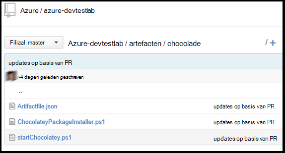

<properties 
    pageTitle="Aangepaste onderdelen voor uw DevTest Labs VM maken | Microsoft Azure"
    description="Meer informatie over het ontwerpen van uw eigen artefacten voor gebruik met DevTest Labs"
    services="devtest-lab,virtual-machines"
    documentationCenter="na"
    authors="tomarcher"
    manager="douge"
    editor=""/>

<tags
    ms.service="devtest-lab"
    ms.workload="na"
    ms.tgt_pltfrm="na"
    ms.devlang="na"
    ms.topic="article"
    ms.date="08/25/2016"
    ms.author="tarcher"/>

#Aangepaste onderdelen voor uw DevTest Labs VM maken

> [AZURE.VIDEO how-to-author-custom-artifacts] 

## Overzicht
**Artefacten** worden gebruikt voor het implementeren en configureren van uw toepassing nadat een VM is ingericht. Een artefact bestaat uit een bestand met de formulierdefinitie artefact en andere bestanden die zijn opgeslagen in een map in een git repository. Artefact bestaan definitie uit JSON en expressies die u gebruiken kunt om aan te geven wat u wilt installeren op een VM. Bijvoorbeeld, kunt u de naam van het onderdeel uit te voeren en parameters die beschikbaar zijn wanneer de opdracht wordt uitgevoerd. U kunt verwijzen naar andere scriptbestanden binnen het definitiebestand artefact met de naam.

##Artefact Definitie bestandsindeling
In het volgende voorbeeld ziet u de secties van de basisstructuur van een definitiebestand.

    {
      "$schema": "https://raw.githubusercontent.com/Azure/azure-devtestlab/master/schemas/2015-01-01/dtlArtifacts.json",
      "title": "",
      "description": "",
      "iconUri": "",
      "targetOsType": "",
      "parameters": {
        "<parameterName>": {
          "type": "",
          "displayName": "",
          "description": ""
        }
      },
      "runCommand": {
        "commandToExecute": ""
      }
    }

| Elementnaam | Vereist? | Beschrijving
| ------------ | --------- | -----------
| $schema      | Nee        | De locatie van het schemabestand JSON die helpt bij het testen van de geldigheid van het definitiebestand.
| titel        | Ja       | De naam van het onderdeel dat wordt weergegeven in het lab.
| Beschrijving  | Ja       | Beschrijving van het onderdeel dat wordt weergegeven in het lab.
| iconUri      | Nee        | De URI van het pictogram weergegeven in het lab.
| targetOsType | Ja       | Het besturingssysteem van de VM waar onderdelen worden geïnstalleerd. Ondersteunde opties zijn: Windows en Linux.
| parameters   | Nee        | Waarden die beschikbaar zijn wanneer u de opdracht install artefact is uitgevoerd op een computer. Dit helpt bij het aanpassen van uw artefact.
| OpdrachtUitvoeren (RunCommand)   | Ja       | Artefact-opdracht die wordt uitgevoerd op een VM installeren.

###Artefact-parameters

In de sectie parameters van het definitiebestand opgeven u welke waarden die een gebruiker invoeren kan bij het installeren van een artefact. U kunt verwijzen naar deze waarden in de installatieopdracht artefact.

U definieert parameters wordt de volgende structuur.

    "parameters": {
        "<parameterName>": {
          "type": "<type-of-parameter-value>",
          "displayName": "<display-name-of-parameter>",
          "description": "<description-of-parameter>"
        }
      }

| Elementnaam | Vereist? | Beschrijving
| ------------ | --------- | -----------
| type         | Ja       | Waarde van de parameter type. Zie de lijst hieronder voor de toegestane typen:
| displayName Ja       | De naam van de parameter die wordt weergegeven als een gebruiker in een testomgeving.
| Beschrijving  | Ja       | Beschrijving van de parameter die wordt weergegeven in het lab.

De toegestane typen zijn:

- tekenreeks: een willekeurige geldige tekenreeks van JSON
- int: een geldige integer op JSON
- BOOL – een geldige JSON Boolean
- matrix-alle geldige JSON

##Artefact expressies en functies

U kunt een expressie gebruiken en functies maken het artefact opdracht installeren.
Expressies tussen haakjes ([en]), en worden geëvalueerd wanneer het onderdeel wordt geïnstalleerd. Expressies kunnen plaatsen in een string-waarde JSON en altijd een andere JSON-waarde als resultaat geven. Als u wilt gebruiken een letterlijke tekenreeks die met een beugel begint [, moet u twee haakjes [[.
Meestal kunt u expressies met functies voor het samenstellen van een waarde. Net als in JavaScript, worden functieaanroepen opgemaakt als functionName(arg1,arg2,arg3)

De volgende lijst bevat veelgebruikte functies.

- parameters(parameterName) - geeft als resultaat een waarde voor de parameter die is opgegeven bij de artefact-opdracht wordt uitgevoerd.
- samenvoegen (arg1, arg2,... arg3) - een combinatie van meerdere tekenreekswaarden. Deze functie kan een of meer argumenten nemen.

In het volgende voorbeeld ziet u hoe expressie en functies gebruiken om een waarde te maken.

    runCommand": {
         "commandToExecute": "[concat('powershell.exe -File startChocolatey.ps1'
    , ' -RawPackagesList ', parameters('packages')
    , ' -Username ', parameters('installUsername')
    , ' -Password ', parameters('installPassword'))]"
    }

##Maak een aangepaste artefact

Maak uw aangepaste artefact door onderstaande stappen te volgen:

1. Installeer een JSON-editor - moet u een editor JSON artefact definitie bestanden. Wij raden u aan met behulp van [Visual Studio-Code](https://code.visualstudio.com/), die beschikbaar is voor Windows, Linux en OS X.

1. Krijg een monster artifactfile.json - Check out de artefacten gemaakt door Azure DevTest Labs team op onze [GitHub opslagplaats](https://github.com/Azure/azure-devtestlab) waar hebben wij een uitgebreide bibliotheek met artefacten die u helpen uw eigen artefacten maken. Downloaden van een bestand met de formulierdefinitie artefact en wijzigingen aanbrengen in het maken van uw eigen artefacten.

1. Gebruik maken van IntelliSense - hefboomwerking IntelliSense voor een overzicht van geldige elementen die kunnen worden gebruikt om een bestand met de formulierdefinitie artefact samen te stellen. Ook ziet u de verschillende opties voor de waarden van een element. Bijvoorbeeld IntelliSense tonen u de twee opties van Windows of Linux bij het bewerken van het element **targetOsType** .

1. Het artefact opslaan in een git repository
    1. Maak een aparte map voor elke waar de mapnaam hetzelfde als de naam artefact is artefact.
    1. Het definitiebestand artefact (artifactfile.json) worden opgeslagen in de map die u hebt gemaakt.
    1. Sla de scripts waarnaar wordt verwezen in de installatieopdracht artefact.

    Hier volgt een voorbeeld van hoe een artefact-map:

    

1. De opslagplaats artefacten toevoegen met het lab - verwijzen naar het artikel, [een opslagplaats Git artefact met een lab toevoegen](devtest-lab-add-artifact-repo.md).

[AZURE.INCLUDE [devtest-lab-try-it-out](../../includes/devtest-lab-try-it-out.md)]

## Verwante blogberichten
- [Problemen met mislukte artefacten in AzureDevTestLabs](http://www.visualstudiogeeks.com/blog/DevOps/How-to-troubleshoot-failing-artifacts-in-AzureDevTestLabs)
- [Een VM toevoegen aan bestaand AD-domein met ARM sjabloon in Azure Dev-testlab](http://www.visualstudiogeeks.com/blog/DevOps/Join-a-VM-to-existing-AD-domain-using-ARM-template-AzureDevTestLabs)

## Volgende stappen

- Meer informatie over het [toevoegen van een Git artefact opslagplaats met een lab](devtest-lab-add-artifact-repo.md).
